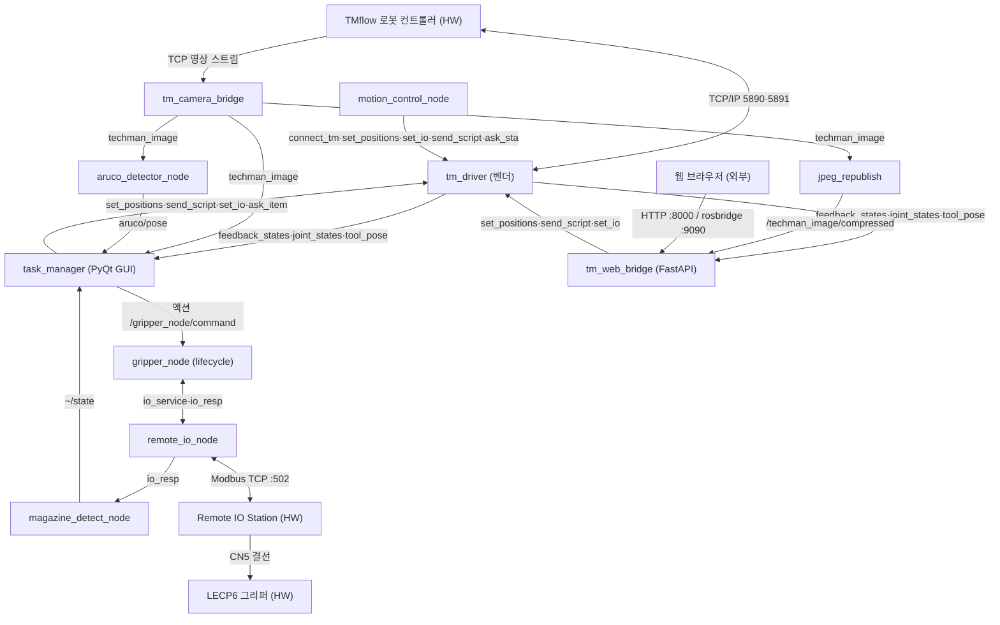

# 2026-08-29 (KST) — TM_Robot_UI 전체 코드 리뷰

## 코드 버전

- 리뷰 커밋: `bba82ee` (branch `master`) + 주석 정비 워킹트리 (미커밋 — ① 전체 주석 제거 ② 코딩 규칙 기반 주석 재작성. 워킹트리 diff SHA256 은 문서 말미 «부록 C» 에 고정)
- 직전 리뷰: 없음 (본 주제 최초 — 이식 전 저장소의 부분 리뷰는 `docs/code_review/TM_Robot_ros2_ws/`·`TM_Task_Manager_unimplemented/`·`Cobot-Web-GUI/` 참조, 별도 주제)
- findings 상태: 전건 `[신규]`
- 같은 시각 지시: `docs/user_instructions/sessions/3376aca3-*.md` 2026-08-28 23:24 항목 ("모든 주석 제거하고 코드 리뷰 해서 변수표 함수표, 토픽표")

## 분석 분기 명시

- 분기: **전체 구조 분석** (자체 개발 코드 전체 — 벤더 `src/Robot/tmrobot_official_packages/` 제외, 단 벤더 인터페이스는 사용 지점에서 실측 대조)
- 감지된 도메인: **ros2-review / concurrency** (embedded-review 미적용 — 트리거 실측 미충족: ISR·NVIC·FreeRTOS·인터럽트 속성 0건, remote_io 는 유저스페이스 Modbus TCP(Transmission Control Protocol))
- 분석 규모: 232파일 / 약 52,000줄 / 함수 3,014개 (부 1~7 에 전수 인벤토리)

## 문서 구성 안내 — 요청 3표의 위치

| 요청 표 | 위치 |
| --- | --- |
| **함수표** (전수 3,014) | 각 부(部)의 모듈별 «함수표» 섹션 (부 1: TM 코어 · 부 2: 탭 · 부 3: 서비스층 · 부 4: 스크립트/테스트/기동 · 부 5: 웹/모션 · 부 6: 그리퍼 · 부 7: IO/센서/비전) |
| **변수표** (전역/상수 전수) | 각 부의 모듈별 «전역 변수 / 모듈 상수» 섹션 (통합 개요는 §Core-4) |
| **토픽표** | §도메인 A-통합 (토픽 전수 + QoS + RxO 매트릭스 + 노드 그래프) — 상세 근거는 각 부 «ROS2» 섹션 |

---

## Core 인벤토리 (통합)

### 1. 목적

본 저장소는 Techman 협동로봇(TM 시리즈)을 중심으로 한 **픽앤플레이스 작업 셀의 ROS2(Robot Operating System 2) Humble 워크스페이스**다. 벤더 공식 `tm_driver` 가 로봇 컨트롤러(TMflow)와 TCP/IP 로 통신하며 토픽(`feedback_states`·`joint_states`·`tool_pose`)과 서비스(`set_positions`·`send_script`·`set_io`·`ask_item` 등)를 제공하고, 그 위에 자체 개발 계층이 올라간다.

자체 계층은 ① **TM_Robot_Task_Manager** — PyQt5 GUI 로 잡(job) 티칭·레시피 관리·팔레트 티칭·핸드아이 검증을 수행하는 중심 애플리케이션(코어 `job_executor` 가 YAML 레시피를 해석해 로봇 모션·그리퍼·비전 스텝을 실행), ② **tm_web_bridge** — FastAPI(Fast Application Programming Interface 웹 프레임워크)+rosbridge 기반 웹 원격 감시·조작, ③ **Actuators/gripper** — SMC LECP6 그리퍼를 Remote IO Station 경유로 구동하는 HAL(Hardware Abstraction Layer)/FSM(Finite State Machine)/lifecycle 노드 스택, ④ **IOs/Remote_IO_Station** — Modbus TCP 로 IO 스테이션을 폴링·발행하는 노드, ⑤ **Sensors/Magazine_Detect** — IO 비트에서 매거진 재석(在席)을 디바운스 판독, ⑥ **Vision/AI** — ArUco 마커 검출 노드·YOLOv8(You Only Look Once v8) 도구, ⑦ **Common/tc_msgs** — msg 17·srv 20 자체 인터페이스, 로 구성된다 (각 부 «목적» 이 모듈 단위 상세를 담는다).

### 2. 코드 플로우차트 (전체 흐름도)

시스템 수준 데이터 흐름 (drawio 동반: `2026-08-29-flow.drawio` — 노드·엣지 1:1):

다중 진입점 분리: 진입 경로는 ① PyQt GUI(`task_manager.launch.py` — 부 4 M12), ② 웹(`web_bridge.launch.py` — 부 5 M8), ③ 그리퍼 단독 스택(SIL(Software-In-the-Loop)/HIL(Hardware-In-the-Loop) — 부 6), ④ 단독 도구(scripts/tools — 부 4) 4계열이며 각 부의 «흐름 요약» 이 경로별 호출 체인을 담는다. 공통 호출 그래프는 위 시스템 흐름도가 담당한다.

### 3. 함수표 (통합 개요 + 시스템 핵심 발췌)

전수 함수표(3,014개)는 각 부의 모듈별 «함수표» 에 있다 (컬럼: `#·함수·입력·출력·기능·위치`). 시스템을 관통하는 핵심 함수 발췌:

| # | 함수 | 입력 | 출력 | 기능 | 위치 |
| --- | --- | --- | --- | --- | --- |
| S1 | JobExecutor.execute_job | job(dict), ctx | bool | YAML 레시피 스텝 해석·순차 실행의 총괄 진입점 | src/TM_Robot_Task_Manager/tm_task_manager/job_executor.py:214 |
| S2 | MainWindow.__init__ | profile | — | GUI·ROS 노드·서비스 계층 조립 루트 | src/TM_Robot_Task_Manager/tm_task_manager/main_window.py:55 |
| S3 | BridgeNode.__init__ | — | — | 웹 브리지의 ROS 결선(구독 4·클라 3) 조립 | src/tm_web_bridge/tm_web_bridge/bridge_node.py:40 |
| S4 | GripperFsm.tick | now_ms, snapshot | FsmOutput | 그리퍼 16상태 FSM 1주기 전이(20ms) | src/Actuators/gripper/gripper_motion/src/gripper_fsm.cpp:118 |
| S5 | RemoteIoNode.tick | — | — | Modbus 폴링→io_resp 발행 주기(20ms) | src/IOs/Remote_IO_Station/remote_io_ros/src/remote_io_node.cpp:150 |
| S6 | MagazineTable.update | io_di | bool | IO 프레임 1회 반영+디바운스 | src/Sensors/Magazine_Detect/src/magazine_table.cpp:44 |
| S7 | ArucoDetector.imageCallback | Image | — | 마커 검출→pose·TF(Transform) 발행 | src/Vision/ROS2/tm_aruco_detect/src/aruco_detector.cpp:68 |
| S8 | MotionControlNode 서비스군 | SetPositions/Trigger | resp | custom_motion/* 13종 서버 | src/Robot/tm_custom_motion_control/src/motion_control_node.cpp:54-118 |

주: 위 위치 값은 부 1~7 표와 동일 기준(현재 워킹트리)이며, S1·S2 등 발췌 번호는 각 부 표의 원 번호와 별개다.

### 4. 전역 변수 / 모듈 상수 (통합 개요)

전수 표(226항목 + 테스트 로컬 상수 55)는 각 부의 «전역 변수 / 모듈 상수» 에 있다. 통합 관찰:

- **가변 전역 12건** — 부 3: `MACROS`(레지스트리)·`vision_plugin_manager._instance`(싱글턴)·`plt.rcParams` 전역 변형·`sys.path` 삽입 / 부 4: 가변 3(스크립트 상태) / 부 5: `RUNNER`(wizard 실행 상태) / 부 6: static 5행 / 부 7: `g_sigpipe_count`·`latch_predict` font 상태. 각 부 평가에서 `[품질]` 로 적정성 판정(대부분 모듈 싱글턴 관례 — 치명 없음, race 관련은 동시성 B-2 로 격상 기록).
- 나머지는 전부 `(상수)` — 프로토콜 주소·타임아웃·UI 상수 계열.

### 5. 의존성 3-tier (통합)

모듈별 상세 표는 각 부에 있다 (컬럼: Tier·대상·버전/제약·부재 시 동작·근거). 시스템 통합 표:

| Tier | 대상 | 버전/제약 | 부재 시 동작(필수/선택) | 근거(파일:line) |
| --- | --- | --- | --- | --- |
| 빌드 | ROS2 Humble (rclpy·rclcpp·ament) | Humble | 빌드 불가 | 각 package.xml (부 1~7) |
| 빌드 | tm_msgs (벤더) | — | TM 연동 전 패키지 빌드 불가 | src/TM_Robot_Task_Manager/package.xml:10 등 |
| 빌드 | tc_msgs (자체) | msg 17·srv 20 | gripper/remote_io/magazine 빌드 불가 | src/Common/tc_msgs/CMakeLists.txt:8-46 |
| 빌드 | PyQt5, OpenCV, numpy | — | GUI/비전 빌드·기동 불가 | src/TM_Robot_Task_Manager/setup.py:20-27 |
| 런타임 필수 | tm_driver 노드 | 벤더, robot_ip 인자 | 서비스 wait 무한/타임아웃 — 모션 전 기능 불능 (기동은 됨) | src/TM_Robot_Task_Manager/launch/task_manager.launch.py:34-45 |
| 런타임 필수 | TMflow 컨트롤러 (로봇 실기) | Listen 노드 활성 | tm_driver 연결 실패 로그 반복, 토픽 무발행 | 부 4 A-8 |
| 런타임 필수 | Remote IO Station (Modbus :502) | 192.168.192.14 | remote_io_node 연결 재시도 — io_resp stale→gripper kStaleData 거부 | src/IOs/Remote_IO_Station/remote_io_ros/src/remote_io_node.cpp:51-52 |
| 런타임 필수(미선언 ⚠) | matplotlib | — | **task_manager 기동 자체 불가** (eager import 연쇄) — High, §평가 H-5 | src/TM_Robot_Task_Manager/tm_task_manager/tabs/precision_test_tab.py:1 |
| 런타임 선택 | gripper_node / SCHUNK 노드 / distance 노드 | — | 해당 잡 스텝 실패 처리(클라 wait 타임아웃) — GUI 는 동작 | src/TM_Robot_Task_Manager/tm_task_manager/main_window.py:124-132 |
| 런타임 선택 | sim_station_node (SIL) | remote_io_node 대체 | 실기 없이 io_resp/io_service 모의 — 동시 기동 금지(§A-통합 다중 발행) | src/Actuators/gripper/gripper_ros/src/sim_station_node.cpp:66-69 |
| 런타임 선택(미선언 ⚠) | scipy·netifaces·pandas·flask·waitress | — | 해당 기능 ImportError (부 3 M27/M43·부 4 평가 참조) | 부 3·부 4 의존성 표 |

---

## 도메인 A-통합 (ros2-review) — 토픽표

각 노드별 A-1~A-5 원표는 부 1~7 «ROS2» 섹션에 있다. 여기는 시스템 조인 결과다.

### A-통합-1. 토픽표 (pub/sub 조인 — 사용자 요청 «토픽표» 정본)

| 토픽 | 발행 노드(QoS) | 구독 노드(들)(QoS) | 메시지 타입 | 판정 |
| --- | --- | --- | --- | --- |
| feedback_states | tm_driver(depth1·기본) [벤더] | task_manager(d10), tm_web_bridge(d10) | tm_msgs/FeedbackState | 호환 — depth1 발행 주의(버스트 드롭) |
| **tm_driver/feedback_states** | **발행자 없음** | robot_connection(d10) | tm_msgs/FeedbackState | **고아 구독 — H-2 (토픽명 불일치)** |
| joint_states | tm_driver(d1) [벤더] | task_manager(d10), tm_web_bridge(d10), landmark_visualizer(d10, `/joint_states`) | sensor_msgs/JointState | 호환 |
| tool_pose | tm_driver(d1) [벤더] | task_manager(d10), tm_web_bridge(d10), record_place_pose(d10) | geometry_msgs/PoseStamped | 호환 |
| sct_response | tm_driver(d1) [벤더] | global_variable_script(d10) | tm_msgs/SctResponse | 호환 |
| sta_response / svr_response | tm_driver(d1) [벤더] | (자체 구독 없음) | tm_msgs/* | 미사용 벤더 토픽 — 무해 |
| techman_image | tm_camera_bridge(d10) ·(대안) 벤더 tm_get_status image_pub | task_manager(d10×2), jpeg_republish(d10), aruco_detector(d10), image_sub(d10) | sensor_msgs/Image | 호환 — **발행자 2계보: 동시 기동 시 다중 발행 충돌, A-통합-3 ②** |
| /techman_image/compressed | jpeg_republish(d10) | tm_web_bridge(d1) | sensor_msgs/CompressedImage | 호환 (sub depth1 — 최신 1장 의도) |
| aruco/pose | aruco_detector(d10) | task_manager(d10) | geometry_msgs/PoseStamped | 호환 |
| aruco/debug_image | aruco_detector(d10) | (자체 구독 없음 — RViz 용) | sensor_msgs/Image | 의도적 개방 — 무해 |
| **/tm_robot/tcp_pose** | **발행자 없음** | landmark_visualizer(d10) | std_msgs/Float32MultiArray | **고아 구독 — M-급 (도구 한정), 부 4 평가 참조** |
| io_resp | remote_io_node(d10) ·(대안) sim_station_node(d10) | gripper_node(d10), magazine_detect_node(d10), gripper_hil_cycle(d50) | tc_msgs/Io | 호환 — HIL/SIL 상호 배타 기동 전제(A-통합-3 ③) |
| io_alarms | remote_io_node(d10) | (자체 구독 없음) | tc_msgs/AmrAlarm | 모니터링 개방 — 무해 |
| /magazine_detect_node/state | magazine_detect_node(d10) | magazine_state_service(명시 RELIABLE·VOLATILE·KEEP_LAST·d10) | magazine_detect/MagazineState | 호환 |
| custom_motion/{gripper_cmd·stop·speed_override} | (자체 발행 없음 — 외부 수동 발행 전제) | motion_control_node(d10) | std_msgs/Bool·Int32 | 고아 구독(도구성 인터페이스) — Info |

서비스/액션 조인 (요약 — 원표는 각 부 A-3): 벤더 tm_driver 서버 8종(`connect_tm`·`send_script`·`set_event`·`set_io`·`set_positions`·`ask_sta`·`ask_item`·`write_item`, tm_ros2_sct.cpp:26-46·tm_ros2_svr.cpp:38-44 실측) ← 클라이언트: task_manager(11 인스턴스)·tm_web_bridge(3)·robot_client(5)·서비스층 차용 다수. 자체 서버: `custom_motion/*` 13종(부 5)·`io_service`(부 7)·`/gripper_node/command` 액션(부 6)·lifecycle 표준(부 6). 미해결 외부 서버: `calibration/*` Trigger 4종(클라만 존재 — camera_calibration_node 는 launch 기동 대상이나 자체 코드 아님), SCHUNK `gripper_command`·`distance_command`(외부 노드 전제 — 런타임 선택).

### A-통합-2. QoS 호환 매트릭스 (RxO — Requested vs Offered)

전 토픽 실측 결과 **offered(pub) ≥ requested(sub) 위반 0건**: 모든 자체·벤더 pub/sub 이 기본 프로파일(RELIABLE·VOLATILE·KEEP_LAST)이고 BEST_EFFORT / TRANSIENT_LOCAL 사용이 없다 (각 부 A-표 실측 종합). 축별 판정:

| 축 | 위반(pub→sub) | 본 시스템 실측 |
| --- | --- | --- |
| Reliability | BEST_EFFORT→RELIABLE | 없음 (전부 RELIABLE) |
| Durability | VOLATILE→TRANSIENT_LOCAL | 없음 (전부 VOLATILE — late-joiner 요구 없음) |
| depth | (호환성 아님 — 드롭 위험) | 벤더 발행 depth1 (feedback_states·joint_states·tool_pose·sct_response) vs 구독 depth10 — 발행측 큐가 병목, 구독 지연 시 최신만 생존. 이미지 토픽 RELIABLE 은 대역 부담(§평가 Info) |

### A-통합-3. 노드 연결 그래프 (rqt_graph 등가) 점검

edge 표 (핵심 — 전체 조인은 A-통합-1):

| 토픽 | 발행 노드 | 구독 노드(들) | 메시지 타입 | QoS 호환(A-통합-2) |
| --- | --- | --- | --- | --- |
| feedback_states | tm_driver | task_manager, tm_web_bridge | FeedbackState | 호환 |
| techman_image | tm_camera_bridge | task_manager, jpeg_republish, aruco_detector, image_sub | Image | 호환 |
| /techman_image/compressed | jpeg_republish | tm_web_bridge | CompressedImage | 호환 |
| io_resp | remote_io_node (또는 sim_station_node) | gripper_node, magazine_detect_node | tc_msgs/Io | 호환 |
| ~/state | magazine_detect_node | task_manager(magazine_state_service) | MagazineState | 호환 |
| aruco/pose | aruco_detector | task_manager | PoseStamped | 호환 |

점검 결과:

1. **고아 토픽(결함)** — `tm_driver/feedback_states` 구독(발행자 없음, H-2), `/tm_robot/tcp_pose` 구독(발행자 없음, 부 4). 고아 발행 `io_alarms`·`aruco/debug_image`·`sta/svr_response` 는 개방 인터페이스로 무해.
2. **다중 발행자 가능성** — `techman_image`: 자체 tm_camera_bridge 와 벤더 `techman_robot_get_status` image_pub 두 계보. 표준 기동(task_manager.launch.py)은 tm_camera_bridge 만 띄우므로 정적 1발행이나, 벤더 데모 병행 기동 시 충돌 — A-8 기동 규율로 통제 필요 `[bringup]`.
3. **상호 배타 발행자** — `io_resp`: remote_io_node(HIL)와 sim_station_node(SIL)는 동시 기동 금지 전제(부 6 설계). 절차서(부 4 A-8·부 6 흐름)에 명시됨.
4. **외부 경계** — 벤더 tm_driver(토픽 4·서비스 8)·TMflow(TCP)·Remote IO Station(Modbus)·SCHUNK/distance 외부 노드 — Core-5 런타임 tier 와 연계 기록 완료.

### A-통합-4. 파라미터 (A-4 종합)

총 126: motion_control_node 9 (부 5) · gripper_node 57 + sim_station_node 33 (부 6) · remote_io 13 + magazine 5 + aruco 8 (부 7) · launch `robot_ip` 1 (부 4). YAML 단위 주석 규율은 부 6·7 의 config 검토에 반영 (기존 gripper_stack.yaml 이 단위·구분 주석 유지 — 부 6).

### A-통합-5. TF frames (A-5 종합)

| frame | parent | 발행 노드 | 정적/동적 | 위치 |
| --- | --- | --- | --- | --- |
| jig_landmark | robot_base | task_manager(StaticTransformBroadcaster) | 정적(재발행 타이머) | src/TM_Robot_Task_Manager/tm_task_manager/services/coordinate_system_manager.py:404-414 |
| jig_plate | jig_landmark | 〃 | 정적 | 〃:427-433 |
| mark_jig_plate1..4 | jig_plate | 〃 | 정적 | 〃:435-446 |
| aruco_marker_&lt;id&gt; | camera_link | aruco_detector_node | 동적(검출 프레임마다) | src/Vision/ROS2/tm_aruco_detect/src/aruco_detector.cpp:174-197 |

### A-통합-6. 기동 절차 (A-8)

전수 표(PyQt 12단계 + 정지 2 + 웹 5 + 대안 2)는 **부 4 «A-8 기동 절차 표»**. 본 리뷰는 정적 분석으로 실기 측정치를 제출하지 않으므로 `[bringup]` 의 측정 규율(발행자 수 런타임 확인)은 차기 실기 리뷰 과제로 남긴다 — 단 절차서 부재 상태는 본 문서 부 4 표로 해소됐다.

---

## 도메인 B-통합 (concurrency)

모듈별 B-1/B-2/B-3 원표는 각 부에 있다. 시스템 관찰:

- **실행 컨텍스트 지형**: PyQt GUI 메인 스레드(+ `spin_once`/`spin_until_future_complete` 재진입 구동) / pallet_teach·ImageCapture·Joystick QThread·safety Thread·NetworkManager ThreadPool(50) (부 1~3) / tm_web_bridge: MultiThreadedExecutor + uvicorn sync 워커 (부 5) / C++ 노드: single-threaded executor + (gripper) 전용 MutuallyExclusive 콜백 그룹 (부 6·7).
- **비보호 공유 상태 군집**: CommandGate·jog_in_progress·MotionGuard._records·IO/Magazine 캐시(부 3), pallet_teach 4종(부 2), 웹 job race(부 5), cv::Mat(부 5) — 각 부 B-2 에 «비보호» 표기·변경 방식(check-then-act 포함) 기록 완료. 대표 결함은 §평가 Critical/High 로 승격.

---

## 평가 (통합 — severity 클러스터)

severity 분포: Critical 1 / High 11 / Medium 79 / Low 116 / Info 91
Verdict: REQUEST CHANGES

세부 평가 항목(전 298건)은 각 부 «평가 후보» 에 카테고리 태그·함수 `#` 인용·재현 위치와 함께 있다. 아래는 Critical/High 전건과 Medium 이하 클러스터 요약이다. (본 SOP 규칙 11 에 따라 작성자 self-APPROVE 불가 — Verdict 확정 렌더는 별도 lane 소관.)

### Critical

**C-1. RobotClient — [exec][reentrant][신규] 서비스 콜백 내 spin_until_future_complete 재진입 (Critical)** — 부 5 M10 함수 #(callService 계열)
   재현: src/Robot/tm_custom_motion_control/src/robot_client.cpp:60-167 — motion_control_node 의 custom_motion/* 서버 콜백(단일 스레드 executor)이 RobotClient 를 통해 tm_driver 서비스를 spin_until_future_complete 로 대기 → executor 재진입으로 첫 서비스 호출부터 응답 불가(deadlock).
   권고: 콜백 그룹 분리(Reentrant/MutuallyExclusive 이원화) + `async` 체인 또는 별도 executor 스레드로 클라이언트 대기 이관.

### High

**H-1. job_executor `_exec_vision_process` — [논리][신규] `runtime_vars` 미초기화 (High)** — 부 1 M1
   재현: src/TM_Robot_Task_Manager/tm_task_manager/job_executor.py:3048,3077 — 초기화 경로 없이 참조, 해당 잡 유형 실행 시 AttributeError.
   권고: __init__ 초기화 + 해당 스텝 단위 테스트.

**H-2. robot_connection — [topology][신규] 구독 토픽명 불일치 (High)** — 부 1 M4, A-통합-1
   재현: src/TM_Robot_Task_Manager/tm_task_manager/robot_connection.py:33-38 이 `tm_driver/feedback_states` 구독 — 벤더는 `feedback_states` 발행(tm_ros2_svr.cpp:20 실측) → `is_robot_ready` 영구 미갱신.
   권고: 토픽명 정정 + 연결 상태 회귀 테스트.

**H-3. job_executor `_exec_align_tm_landmark` — [exec][성능][신규] spin 없는 future 폴링 + 매회 클라이언트 생성 (High)** — 부 1 M1
   재현: src/TM_Robot_Task_Manager/tm_task_manager/job_executor.py:1574-1596 — sleep 폴링은 spin 없이는 future 완료 콜백이 돌지 않는 구동 구조와 결합 시 타임아웃 상습.
   권고: 루트 노드 클라이언트 재사용 + spin_until_future_complete 일원화.

**H-4. MotionGuard.check — [논리][신규] 좌표계 전제 미강제 (High, 안전 관련)** — 부 3 M7·M35·M37
   재현: services/tm_landmark_align_service.py:125-131 → services/tm_robot_script_motion.py:64 — ChangeBase 후 vision 좌표 목표가 RobotBase 기준 안전구역과 대조됨.
   권고: check 에 좌표계 인자 의무화(전제 위반 시 거부).

**H-5. tabs — [품질][신규] matplotlib 미선언 + eager import → 기동 불가 (High)** — 부 2 M8·M1
   재현: tabs/precision_test_tab.py:1 모듈 import 가 tabs/__init__ 연쇄로 앱 필수 — package.xml·setup.py 미선언, 미설치 환경 즉사.
   권고: 의존 선언 + 지연 import.

**H-6·H-7. convert_to_runtime ↔ verify_conversion — [논리][테스트][신규] reference 키 불일치 (High ×2건 계상)** — 부 4
   재현: tools/convert_to_runtime.py:258 `tm_jig_landmark` vs tools/verify_conversion.py:46 `tm_landmark` — 검증 도구 KeyError.
   권고: 키 상수 단일화(공유 모듈).

**H-8. tm_web_bridge API — [논리][신규] 무인증 0.0.0.0 노출 (High, 보안)** — 부 5 M1
   재현: 로봇 모션·IO 제어 엔드포인트가 인증 없이 전 인터페이스 바인드.
   권고: 최소 토큰 인증 + 바인드 주소 설정화.

**H-9. tm_web_bridge — [race][신규] job_executor 이중 구동 race (High)** — 부 5 M2
   재현: PyQt GUI 와 웹이 동일 실행 계층을 동시 트리거 가능 — 진행 상태 공유 비보호.
   권고: 실행 소유권 단일화(락 또는 단일 서버 경유).

**H-10. image_sub — [race][신규] cv::Mat 공유 race (High)** — 부 5 M9
   재현: 콜백 쓰기 ↔ 표시 스레드 읽기 비보호.
   권고: 스냅샷 복사 + mutex.

**H-11. motion_control positions — [논리][신규] 미검증 입력으로 로봇 모션 (High)** — 부 5 M13
   재현: moveJoint/moveTCP 요청 positions 크기·범위 미검증 → 실기 위험.
   권고: 요청 검증 가드(크기 6·리밋).

### Medium 이하 클러스터 요약 (대표 테마 — 세부는 각 부)

- `[exec]` **spin 이중 구동 위험 군집** — 서비스층 5개 모듈이 spin_until_future_complete 직접 호출 (부 3 M16/M33 등), GUI 재진입 구동과 결합 시 취약 (Medium 군집).
- `[race]` **check-then-act 비보호 군집** — CommandGate·jog 플래그·MotionGuard._records·캐시류 (부 2·3), write 결과 미확인 set_io (부 3 M23).
- `[품질]` **중복 구현 군집** — 회전변환 5중(부 3), Canny 3중(부 7), 캡처 시퀀스 2중(부 3), AI 스크립트 2벌(부 7), GUI 위젯 3중(부 4) — 통합 권고.
- `[SOLID]` **경계 침식** — task_edit_tab→job_executor private `_exec_*` 7곳(부 2), gripper 서비스층 private 접근(debt-003 연계).
- **의존 선언 결손 군집** — matplotlib(H-5)·scipy·netifaces·pandas·flask·waitress (부 3·4) `[품질]`.
- `[timing]` gripper write_bits 500ms 블로킹 in 20ms tick (부 6 Medium 1건).
- `[테스트]` **기존 실패 1건(본 세션 실측·[신규])**: `test_recipe_manager.py:346` — `scan_ar_tag` 가 Vision 카테고리에 미등록(원본 HEAD 에서도 동일 실패 — 주석 작업과 무관). tm_web_bridge·tm_custom_motion_control·image_sub 테스트 0건(부 5) 결손 포함.
- `[param]`·`[ns]`·경로 하드코딩 — `/home/amap/TM_Robot_ros2_ws` 부재 경로 4파일(부 4, 본 머신 심볼릭 링크 부재 실측), PyQt↔웹 `ROS_LOCALHOST_ONLY` 기본 불일치(부 4) 등.

### debt 연계

- debt-013 (remote_io 0x1100/0x80 매뉴얼 문면 미확정 — HIL 대기): 코드 마커는 주석 제거로 삭제, `docs/debt/registry.md` 가 유일 추적처.
- debt-003 (각도 계산 private 재사용): 부 1·3 중복 군집과 동일 맥락 — 잔존.

---

# 부 1 — TM_Robot_Task_Manager 코어 (job_executor·main_window·recipe_manager·robot_connection·robot_profile·paths·global_variable_script)

# frag_A1 — tm_task_manager 코어 8파일 인벤토리

담당 범위: src/TM_Robot_Task_Manager/tm_task_manager/ {job_executor, main_window, recipe_manager, robot_connection, robot_profile, paths, global_variable_script, __init__}.py
줄 번호는 현재 워킹트리 실측 (Read/grep -n). 벤더 인터페이스 대조: src/Robot/tmrobot_official_packages/tm_driver/src/tm_ros2_svr.cpp·tm_ros2_sct.cpp 실측.

---

## M1. src/TM_Robot_Task_Manager/tm_task_manager/job_executor.py

### 목적
Recipe(YAML)의 Job 시퀀스를 순차(또는 역순) 실행하는 실행 엔진. `JobExecutor` 단일 클래스가 50+ 종의 job type 디스패치(`_execute_job`, job_executor.py:463)를 담당하며, TM 로봇 이동(tm_driver `set_positions`/`send_script` 서비스), TM Landmark/Jig 스캔(비전), 평면(plate) 계산·정렬, 그리퍼(TM Flow 변수·SMC 액션·SCHUNK 서비스), IO 읽기/쓰기, AI 검사까지 실행한다.

상태(`ExecutionState` enum, job_executor.py:59-65)와 실행 콜백(on_state_changed/on_job_started/on_job_completed/on_log 등, job_executor.py:75-81)을 UI(MainWindow/RunMonitorTab)에 노출한다. 실행은 별도 스레드가 아니라 Qt 메인 스레드에서 동기 실행되며, 다음 잡 진행은 `_execute_next_job`↔`_execute_current_job` 상호 재귀(job_executor.py:294, 273)로 이어진다. Landmark 스캔 결과로 4x4 변환행렬(`tm_transform_matrix`)을 만들어 상대좌표 잡을 절대좌표로 변환한다(job_executor.py:341-347, 1835).

### 함수표
| # | 함수 | 입력 | 출력 | 기능 | 위치(file:line) |
|---|---|---|---|---|---|
| 1 | JobExecutor.__init__ | ros_node, vision_manager, ai_detection_service | - | 상태·콜백·공유 캐시(detected_* 등) 초기화 | src/TM_Robot_Task_Manager/tm_task_manager/job_executor.py:69 |
| 2 | JobExecutor._log | message: str | None | on_log 콜백으로 로그 전달 | src/TM_Robot_Task_Manager/tm_task_manager/job_executor.py:112 |
| 3 | JobExecutor.last_origin_check_result (property) | - | Any | macro_blackboard 의 origin_check_result 반환 | src/TM_Robot_Task_Manager/tm_task_manager/job_executor.py:116 |
| 4 | JobExecutor._macro_context | - | MacroContext | 매크로 실행 컨텍스트 생성 | src/TM_Robot_Task_Manager/tm_task_manager/job_executor.py:120 |
| 5 | JobExecutor._run_macro_sequence | job: Job, macro_defs: List[Dict] | bool | JOB_TYPES 의 macros 정의를 순차 실행(run_macro) | src/TM_Robot_Task_Manager/tm_task_manager/job_executor.py:123 |
| 6 | JobExecutor._wait_for_listen_node | timeout: float=10.0 | bool | spin_once 폴링으로 is_sct_connected 대기 (미사용 데드 코드) | src/TM_Robot_Task_Manager/tm_task_manager/job_executor.py:147 |
| 7 | JobExecutor._set_state | state: ExecutionState | None | 상태 전이 + on_state_changed 콜백 | src/TM_Robot_Task_Manager/tm_task_manager/job_executor.py:167 |
| 8 | JobExecutor.load_recipe | recipe: Recipe | None | Recipe 적재, 인덱스 0, IDLE | src/TM_Robot_Task_Manager/tm_task_manager/job_executor.py:172 |
| 9 | JobExecutor.run | - | bool | run_from(0) 위임 | src/TM_Robot_Task_Manager/tm_task_manager/job_executor.py:177 |
| 10 | JobExecutor.run_from | start_index: int=0 | bool | 검증 후 blackboard 초기화, 정방향 실행 시작 | src/TM_Robot_Task_Manager/tm_task_manager/job_executor.py:180 |
| 11 | JobExecutor.run_reverse_from | start_index: int | bool | 역순(_direction=-1) 실행 시작 (blackboard 는 유지) | src/TM_Robot_Task_Manager/tm_task_manager/job_executor.py:204 |
| 12 | JobExecutor.pause | - | None | RUNNING→PAUSED | src/TM_Robot_Task_Manager/tm_task_manager/job_executor.py:226 |
| 13 | JobExecutor.resume | - | bool | PAUSED→RUNNING 후 다음 잡 실행 | src/TM_Robot_Task_Manager/tm_task_manager/job_executor.py:231 |
| 14 | JobExecutor.stop | - | None | _stop_requested 세트, STOPPED, 인덱스 0 리셋 | src/TM_Robot_Task_Manager/tm_task_manager/job_executor.py:238 |
| 15 | JobExecutor.step | - | bool | 현재 잡 1개만 실행 후 PAUSED | src/TM_Robot_Task_Manager/tm_task_manager/job_executor.py:244 |
| 16 | JobExecutor._execute_next_job | - | bool | 종료 판정(정/역방향) 후 현재 잡 실행 | src/TM_Robot_Task_Manager/tm_task_manager/job_executor.py:258 |
| 17 | JobExecutor._execute_current_job | - | bool | 잡 실행 + 콜백 + 성공 시 인덱스 증감·재귀 계속, 예외 시 ERROR | src/TM_Robot_Task_Manager/tm_task_manager/job_executor.py:275 |
| 18 | JobExecutor._create_transform_matrix | pose: Dict[str,float] | np.ndarray(4x4) | XYZ+ZYX euler → 동차변환행렬 | src/TM_Robot_Task_Manager/tm_task_manager/job_executor.py:312 |
| 19 | JobExecutor._extract_pose | T: np.ndarray | Dict[str,float] | 동차변환행렬 → pose dict | src/TM_Robot_Task_Manager/tm_task_manager/job_executor.py:325 |
| 20 | JobExecutor._transform_relative_to_absolute | rel_pose: Dict | Dict | tm_transform_matrix 로 상대→절대 변환 (행렬 없으면 그대로) | src/TM_Robot_Task_Manager/tm_task_manager/job_executor.py:341 |
| 21 | JobExecutor._convert_to_robot_positions | motion_type, x..rz | List[float] | deg/mm → rad/m (SetPositions 단위) | src/TM_Robot_Task_Manager/tm_task_manager/job_executor.py:350 |
| 22 | JobExecutor._move_to_position | motion_type, x..rz, velocity, decomposed_tcp=False | (bool, str) | PTP_J/PTP_T 이동 — ros_node._call_set_positions 위임, 분해 이동 분기 | src/TM_Robot_Task_Manager/tm_task_manager/job_executor.py:372 |
| 23 | JobExecutor._build_decomposed_tcp_waypoints | current_pose, target: List[float] | (waypoints, label) | decomposed_move_planner 위임 | src/TM_Robot_Task_Manager/tm_task_manager/job_executor.py:402 |
| 24 | JobExecutor._move_to_position_decomposed | x..rz, velocity | (bool, str) | 축 분해 LINE_T 다단 이동 (중단 요청 체크) | src/TM_Robot_Task_Manager/tm_task_manager/job_executor.py:406 |
| 25 | JobExecutor._move_to_position_line | motion_type, x..rz, velocity | (bool, str) | LINE_T 단일 직선 이동 | src/TM_Robot_Task_Manager/tm_task_manager/job_executor.py:445 |
| 26 | JobExecutor._execute_job | job: Job | bool | job.type → _exec_* 50여 분기 디스패치 (macros 우선) | src/TM_Robot_Task_Manager/tm_task_manager/job_executor.py:463 |
| 27 | JobExecutor._exec_go_home | job | bool | RobotBase 좌표계 확인 후 HOME 이동 | src/TM_Robot_Task_Manager/tm_task_manager/job_executor.py:567 |
| 28 | JobExecutor._exec_move_to_point | job | bool | (상대→절대 변환 포함) PTP 포인트 이동 + 위치 검증 | src/TM_Robot_Task_Manager/tm_task_manager/job_executor.py:597 |
| 29 | JobExecutor._verify_move_position | job, target x..rz, tcp_before | None | 이동 후 TCP 실측 오차 로그 (1mm 초과 시 경고성 로그) | src/TM_Robot_Task_Manager/tm_task_manager/job_executor.py:668 |
| 30 | JobExecutor._exec_move_linear | job | bool | send_script 로 Move_Line("TPP",...) 전송 + is_moving 안정화 폴링 | src/TM_Robot_Task_Manager/tm_task_manager/job_executor.py:688 |
| 31 | JobExecutor._exec_line_move_to_point | job | bool | 기준좌표+오프셋 LINE_T 직선 이동 (0 좌표 거부) | src/TM_Robot_Task_Manager/tm_task_manager/job_executor.py:773 |
| 32 | JobExecutor._build_descent_segments | x,y,from_z,to_z,velocity,decel_zone_mm,decel_velocity | List[Tuple] | Z 하강 감속 구간 분할 | src/TM_Robot_Task_Manager/tm_task_manager/job_executor.py:856 |
| 33 | JobExecutor._build_straight_segments | cur/target xyz, velocity, decel | List[Tuple] | 직선 경로 감속 분할 | src/TM_Robot_Task_Manager/tm_task_manager/job_executor.py:870 |
| 34 | JobExecutor._build_pose_keep_segments | tcp_before, target xyz, velocity, decel, straight | List[Tuple] | 자세유지 이동 구간(Z상승→XY / XY→Z하강) 계획 | src/TM_Robot_Task_Manager/tm_task_manager/job_executor.py:893 |
| 35 | JobExecutor._log_orientation_deviation | label, lock_rx/ry/rz | Optional[float] | 이동 종점 자세 편차 측정·로그 | src/TM_Robot_Task_Manager/tm_task_manager/job_executor.py:931 |
| 36 | JobExecutor._exec_pose_keep_move_to_point | job | bool | 자세 고정 다단 LINE_T 이동 (감속 구간 포함) | src/TM_Robot_Task_Manager/tm_task_manager/job_executor.py:954 |
| 37 | JobExecutor._exec_move_to_ar_offset | job | bool | AR 태그 기준 목표 계산 — 로그만, 실이동 없음(스텁) | src/TM_Robot_Task_Manager/tm_task_manager/job_executor.py:1040 |
| 38 | JobExecutor._exec_scan_ar_tag | job | bool | vision_manager.get_tag 폴링, 검출 시 g_robot_command=2 + ScriptExit | src/TM_Robot_Task_Manager/tm_task_manager/job_executor.py:1056 |
| 39 | JobExecutor._exec_wait_for_detection | job | bool | 로그만 남기고 즉시 True(스텁) | src/TM_Robot_Task_Manager/tm_task_manager/job_executor.py:1097 |
| 40 | JobExecutor._exec_gripper_open | job | bool | g_robot_command=10 쓰기 + delay | src/TM_Robot_Task_Manager/tm_task_manager/job_executor.py:1105 |
| 41 | JobExecutor._exec_gripper_close | job | bool | g_robot_command=9 쓰기 + delay | src/TM_Robot_Task_Manager/tm_task_manager/job_executor.py:1122 |
| 42 | JobExecutor._exec_gripper_home | job | bool | g_robot_command=11 쓰기 + delay | src/TM_Robot_Task_Manager/tm_task_manager/job_executor.py:1139 |
| 43 | JobExecutor._exec_smc_grip | job | bool | _exec_smc_gripper(job,'grip') | src/TM_Robot_Task_Manager/tm_task_manager/job_executor.py:1156 |
| 44 | JobExecutor._exec_smc_release | job | bool | _exec_smc_gripper(job,'release') | src/TM_Robot_Task_Manager/tm_task_manager/job_executor.py:1159 |
| 45 | JobExecutor._exec_smc_home | job | bool | _exec_smc_gripper(job,'home') | src/TM_Robot_Task_Manager/tm_task_manager/job_executor.py:1162 |
| 46 | JobExecutor._exec_smc_gripper | job, profile: str | bool | gripper_ros GripperCommand 액션 send_goal→result 대기 | src/TM_Robot_Task_Manager/tm_task_manager/job_executor.py:1165 |
| 47 | JobExecutor._exec_schunk_gripper | job, command: int | bool | tc_msgs GripperCommand 서비스 호출(received 확인) | src/TM_Robot_Task_Manager/tm_task_manager/job_executor.py:1219 |
| 48 | JobExecutor._exec_read_distance | job | bool | tc_msgs DistanceCommand 서비스로 거리 2ch 읽기 | src/TM_Robot_Task_Manager/tm_task_manager/job_executor.py:1255 |
| 49 | JobExecutor._exec_read_digital_io | job | bool | gv_manager.read_variable(di_name) 로 DI 읽기 | src/TM_Robot_Task_Manager/tm_task_manager/job_executor.py:1290 |
| 50 | JobExecutor._exec_check_magazine | job | bool | magazine_state_service 슬롯 재고 판정, 불일치 시 #51 | src/TM_Robot_Task_Manager/tm_task_manager/job_executor.py:1308 |
| 51 | JobExecutor._handle_magazine_mismatch | params: Dict | bool | on_mismatch stop/skip/ignore 처리 (skip 은 current_job_index 점프) | src/TM_Robot_Task_Manager/tm_task_manager/job_executor.py:1348 |
| 52 | JobExecutor._exec_write_digital_io | job | bool | SetIO 서비스로 Ctrl/End DO 쓰기 | src/TM_Robot_Task_Manager/tm_task_manager/job_executor.py:1392 |
| 53 | JobExecutor._exec_read_analog_io | job | bool | io_control_service 우선, 폴백 gv_manager 로 AI 읽기 | src/TM_Robot_Task_Manager/tm_task_manager/job_executor.py:1448 |
| 54 | JobExecutor._exec_align_to_ar_tag | job | bool | AR 정렬 목표 계산 — `if self.ros_node: pass` 실이동 없음(스텁) | src/TM_Robot_Task_Manager/tm_task_manager/job_executor.py:1476 |
| 55 | JobExecutor._exec_move_to_ar_center | job | bool | AR 중심 목표 계산 — 실이동 없음(스텁) | src/TM_Robot_Task_Manager/tm_task_manager/job_executor.py:1512 |
| 56 | JobExecutor._exec_align_tm_landmark | job | bool | 현 위치 고정 + Landmark 자세로 PTP_T (전용 클라이언트 생성, spin 없는 busy-wait) | src/TM_Robot_Task_Manager/tm_task_manager/job_executor.py:1536 |
| 57 | JobExecutor._exec_find_landmark | job | bool | 3x3/5x5 격자 나선 탐색 스캔, 발견 시 저장/정밀 재스캔 | src/TM_Robot_Task_Manager/tm_task_manager/job_executor.py:1608 |
| 58 | JobExecutor.scan_landmark_averaged | repeat_count, outlier_method, wait_time, jig_number, analysis_target | (pose, analysis) | 반복 스캔 + outlier 제거 평균 (매크로·settings_tab 도 사용) | src/TM_Robot_Task_Manager/tm_task_manager/job_executor.py:1747 |
| 59 | JobExecutor._exec_scan_tm_landmark | job | bool | Landmark 스캔 → tm_transform_matrix 갱신 + 좌표계 자동 저장 | src/TM_Robot_Task_Manager/tm_task_manager/job_executor.py:1806 |
| 60 | JobExecutor._exec_scan_tm_landmark_jig | job | bool | Jig(1~4) landmark 스캔 → jig_landmark_results 저장 | src/TM_Robot_Task_Manager/tm_task_manager/job_executor.py:1851 |
| 61 | JobExecutor.vision_origin_check | repeat_count=5, outlier_method='iqr', move_to_reference=True, velocity=20.0, wait_after_command=100 | bool | vision_origin_check 매크로 실행 (settings_tab 에서 호출) | src/TM_Robot_Task_Manager/tm_task_manager/job_executor.py:1879 |
| 62 | JobExecutor._exec_move_to_jig_landmark | job | bool | [프로토타입] Jig landmark + 오프셋 위치로 자세 유지 이동 | src/TM_Robot_Task_Manager/tm_task_manager/job_executor.py:1894 |
| 63 | JobExecutor._exec_calculate_plate_pose | job | bool | Jig1~4 로 평면 pose 계산 + 직사각형 검증 + 저장 | src/TM_Robot_Task_Manager/tm_task_manager/job_executor.py:1957 |
| 64 | JobExecutor._confirm_plate_rectangle | landmarks, params, blocking=True | bool | JigPlateValidator 직사각형 검증, 실패 시 작업자 확인 콜백 | src/TM_Robot_Task_Manager/tm_task_manager/job_executor.py:2003 |
| 65 | JobExecutor._resolve_plate_pose_files | source_path, file_prefix, average_count | List[Path] | 저장본 YAML 파일 목록 해석(파일/폴더, 최신 N개) | src/TM_Robot_Task_Manager/tm_task_manager/job_executor.py:2051 |
| 66 | JobExecutor._exec_load_plate_pose | job | bool | 저장본 랜드마크 평균으로 평면 pose 복원 | src/TM_Robot_Task_Manager/tm_task_manager/job_executor.py:2069 |
| 67 | JobExecutor._plate_pose_file_name | job, saved_at: str | str | <레시피>_<캡션>_<시각>.yaml 파일명 생성(문자 정제) | src/TM_Robot_Task_Manager/tm_task_manager/job_executor.py:2115 |
| 68 | JobExecutor._save_plate_pose | save_dir, plate_pose, landmarks, job, operator | bool | 평면 pose + 4 landmark YAML 저장 | src/TM_Robot_Task_Manager/tm_task_manager/job_executor.py:2127 |
| 69 | JobExecutor._exec_save_landmark_pose | job | bool | tm_landmark_pose 검증 후 저장 위임 | src/TM_Robot_Task_Manager/tm_task_manager/job_executor.py:2171 |
| 70 | JobExecutor._save_landmark_pose | save_dir, pose, job, operator | bool | landmark 단일 pose YAML 저장 | src/TM_Robot_Task_Manager/tm_task_manager/job_executor.py:2195 |
| 71 | JobExecutor._landmark_pose_age_min | path, data | Optional[float] | 저장본 나이(분) — saved_at 우선, 폴백 mtime | src/TM_Robot_Task_Manager/tm_task_manager/job_executor.py:2230 |
| 72 | JobExecutor._load_landmark_pose_from_files | params | (pose, msg) | 저장본 평균 landmark 로드(유효시간 검사 포함) | src/TM_Robot_Task_Manager/tm_task_manager/job_executor.py:2244 |
| 73 | JobExecutor._landmark_frame_inputs | params | ((landmark, frame_mode, relative), reason) | 마커좌표계 이동 입력 해석(latest_scan/file) | src/TM_Robot_Task_Manager/tm_task_manager/job_executor.py:2298 |
| 74 | JobExecutor._landmark_frame_target | params | (target, reason) | 마커좌표계 목표 pose 계산(반경 상한·tool offset) | src/TM_Robot_Task_Manager/tm_task_manager/job_executor.py:2324 |
| 75 | JobExecutor._exec_move_to_landmark_pose | job | bool | 마커좌표계 목표로 자세유지 이동 | src/TM_Robot_Task_Manager/tm_task_manager/job_executor.py:2351 |
| 76 | JobExecutor.estimate_landmark_frame_target | params | (offset, msg) | 현 TCP 를 마커좌표계 오프셋으로 역산 (task_edit_tab 사용) | src/TM_Robot_Task_Manager/tm_task_manager/job_executor.py:2373 |
| 77 | JobExecutor.estimate_landmark_frame_tool_offset | params | (offset, msg) | 그리퍼 오차(6DOF) 역산 (task_edit_tab 사용) | src/TM_Robot_Task_Manager/tm_task_manager/job_executor.py:2390 |
| 78 | JobExecutor._plane_normal_tilt_deg | plate_pose | float | 평면 법선의 base +Z 대비 기울기(deg) | src/TM_Robot_Task_Manager/tm_task_manager/job_executor.py:2410 |
| 79 | JobExecutor._check_landmark_diagonal_diff | max_diff_mm: float | (bool, str) | Jig 4점 대각선 길이 차 검증 | src/TM_Robot_Task_Manager/tm_task_manager/job_executor.py:2415 |
| 80 | JobExecutor._read_tcp_or_log | what: str | Optional[List[float]] | 현재 TCP 읽기(실패 시 로그) | src/TM_Robot_Task_Manager/tm_task_manager/job_executor.py:2443 |
| 81 | JobExecutor._move_pose_keep | label, target, velocity, decel_zone_mm, decel_velocity, straight=False | bool | 2단(제자리 자세정렬→자세유지 접근) 공통 이동 | src/TM_Robot_Task_Manager/tm_task_manager/job_executor.py:2450 |
| 82 | JobExecutor._exec_save_pose | job | bool | 현 TCP 를 saved_poses[key] 에 저장 | src/TM_Robot_Task_Manager/tm_task_manager/job_executor.py:2514 |
| 83 | JobExecutor._exec_move_to_saved_pose | job | bool | 저장 자세로 _move_pose_keep 복귀 | src/TM_Robot_Task_Manager/tm_task_manager/job_executor.py:2525 |
| 84 | JobExecutor._exec_move_to_plane_pose | job | bool | 평면좌표계 목표 이동(기울기·반경·z>0 가드) | src/TM_Robot_Task_Manager/tm_task_manager/job_executor.py:2543 |
| 85 | JobExecutor._plane_align_base_target | params | (target, tcp_before, tilt_deg) | 평면 수직 정렬 목표 계산(배치·기울기 가드) | src/TM_Robot_Task_Manager/tm_task_manager/job_executor.py:2597 |
| 86 | JobExecutor._plane_align_tool_offset (static) | params | dict | offset_* 파라미터 → tool offset dict | src/TM_Robot_Task_Manager/tm_task_manager/job_executor.py:2649 |
| 87 | JobExecutor.estimate_plane_align_tool_offset | params | (offset, msg) | 평면 정렬 그리퍼 오차 역산 (task_edit_tab 사용) | src/TM_Robot_Task_Manager/tm_task_manager/job_executor.py:2655 |
| 88 | JobExecutor._exec_align_to_plane_normal | job | bool | 평면 법선 수직 정렬 2단 이동 (#81 과 동일 패턴 인라인 구현) | src/TM_Robot_Task_Manager/tm_task_manager/job_executor.py:2680 |
| 89 | JobExecutor._exec_measure_plane_distance | job | bool | TCP-평면 부호거리·정렬편차 측정 로그 | src/TM_Robot_Task_Manager/tm_task_manager/job_executor.py:2763 |
| 90 | JobExecutor._exec_generate_runtime | job | bool | tools/convert_to_runtime 으로 마스터→런타임 YAML 변환 (sys.path 주입) | src/TM_Robot_Task_Manager/tm_task_manager/job_executor.py:2798 |
| 91 | JobExecutor._read_and_store_landmark_result | - | bool | AskItem 으로 g_tm_landmark_detect/g_TM_Landmark 읽어 저장 | src/TM_Robot_Task_Manager/tm_task_manager/job_executor.py:2864 |
| 92 | JobExecutor._exec_measure_point | job | bool | 측정점 이동(#28 과 동일 변환 블록) + end 시 on_measure_point 콜백 | src/TM_Robot_Task_Manager/tm_task_manager/job_executor.py:2921 |
| 93 | JobExecutor._exec_vision_process | job | bool | Vision 플러그인 실행 (runtime_vars 미초기화 — 평가 후보 참조) | src/TM_Robot_Task_Manager/tm_task_manager/job_executor.py:2994 |
| 94 | JobExecutor._exec_ai_inspection | job | bool | AI 모델 로드→TM Flow 촬영 트리거→techman_image 수신→추론 | src/TM_Robot_Task_Manager/tm_task_manager/job_executor.py:3099 |

### 전역 변수 / 모듈 상수
| # | 변수 | 사용처(함수) | 기능 | 위치(file:line) |
|---|---|---|---|---|
| 1 | POSE_KEEP_MIN_SEGMENT_MM (상수) | #34, #36, #81, #88 | 이동 생략 최소 구간 0.1mm | src/TM_Robot_Task_Manager/tm_task_manager/job_executor.py:48 |
| 2 | POSE_KEEP_DECEL_ZONE_MM (상수) | #36, #75, #83, #84, #88 | 하강 감속 구간 기본 40mm | src/TM_Robot_Task_Manager/tm_task_manager/job_executor.py:50 |
| 3 | POSE_KEEP_DECEL_VELOCITY (상수) | #34, #36, #75, #83, #84, #88 | 감속 구간 속도 기본 10% | src/TM_Robot_Task_Manager/tm_task_manager/job_executor.py:51 |
| 4 | POSE_KEEP_DECEL_MARGIN_MM (상수) | #32, #33 | 감속 분할 마진 5mm | src/TM_Robot_Task_Manager/tm_task_manager/job_executor.py:52 |
| 5 | PLANE_ALIGN_MAX_TILT_DEG (상수) | #84, #85 | 평면 기울기 상한 30° | src/TM_Robot_Task_Manager/tm_task_manager/job_executor.py:54 |
| 6 | PLANE_ALIGN_MAX_DIAGONAL_DIFF_MM (상수) | #85 | 대각선 차 상한 10mm | src/TM_Robot_Task_Manager/tm_task_manager/job_executor.py:55 |
| 7 | PLANE_ALIGN_MIN_ROTATION_DEG (상수) | #81, #88 | 자세 정렬 생략 임계 0.01° | src/TM_Robot_Task_Manager/tm_task_manager/job_executor.py:56 |
| 8 | JobExecutor.LANDMARK_POSE_KEYS (상수, 클래스) | #69~#77 | landmark pose 필수 키 6종 | src/TM_Robot_Task_Manager/tm_task_manager/job_executor.py:2169 |
| 9 | JobExecutor.LANDMARK_FRAME_OFFSET_KEYS (상수, 클래스) | #73 | 마커좌표계 오프셋 키 6종 | src/TM_Robot_Task_Manager/tm_task_manager/job_executor.py:2228 |
| 10 | ExecutionState (enum 상수) | 전 실행 함수 | IDLE/RUNNING/PAUSED/STOPPED/ERROR/COMPLETED | src/TM_Robot_Task_Manager/tm_task_manager/job_executor.py:59-65 |

### 의존성 3-tier
| Tier | 대상 | 버전/제약 | 부재 시 동작(필수/선택) | 근거(파일:line) |
|---|---|---|---|---|
| 빌드 | ament_python (setup.py) | package.xml 은 buildtool 로 ament_cmake 선언(불일치) | colcon 빌드 불가 | src/TM_Robot_Task_Manager/package.xml:10-11,39 / setup.py:1-40 |
| 런타임 필수 | rclpy, yaml, numpy, scipy | Humble 배포판 | import 시 크래시 (모듈 로드 불가) | src/TM_Robot_Task_Manager/tm_task_manager/job_executor.py:9-12 |
| 런타임 필수 | tm_msgs (SetPositions/SendScript/AskItem/SetIO) | 벤더 패키지 | 함수 내 import — 해당 잡 실행 시 ImportError 크래시(방어 없음) | src/TM_Robot_Task_Manager/tm_task_manager/job_executor.py:386,419,452,701,1412,1565,2868 |
| 런타임 필수 | 내부: paths, recipe_manager, macros, tools/*, services/* | 동일 패키지 | import 시 크래시 | src/TM_Robot_Task_Manager/tm_task_manager/job_executor.py:14-45 |
| 런타임 선택 | gripper_ros.action.GripperCommand | SMC 그리퍼 | try/except ImportError — smc_* 잡만 실패 로그 후 False | src/TM_Robot_Task_Manager/tm_task_manager/job_executor.py:1177-1181 |
| 런타임 선택 | tc_msgs.srv (GripperCommand/DistanceCommand) | SCHUNK·거리센서 | try/except ImportError — schunk_*/read_distance 잡만 False | src/TM_Robot_Task_Manager/tm_task_manager/job_executor.py:1231-1235,1266-1270 |
| 런타임 선택 | cv2, cv_bridge | vision_process/ai_inspection 잡 | 함수 내 import — 해당 잡 실행 시 예외 → _execute_current_job 이 잡아 ERROR 상태 | src/TM_Robot_Task_Manager/tm_task_manager/job_executor.py:2995,3165-3170 |
| 런타임 선택 | tools/convert_to_runtime (sys.path 주입) | generate_runtime 잡 | import 실패 시 예외 → ERROR 상태 | src/TM_Robot_Task_Manager/tm_task_manager/job_executor.py:2822-2841 |

### ROS2
노드를 직접 만들지 않고 주입된 `ros_node`(TaskManagerNode)의 클라이언트·토픽 캐시를 사용한다. 벤더 tm_driver 인터페이스 사용 지점 전수:

**A-1 Subscriptions** — 이 모듈 자체 구독 없음 (ros_node.current_tcp_pose 등 캐시를 소비: job_executor.py:409,652,944,1004 등. 구독 자체는 M2 에 기록).

**A-2 Publications** — 없음.

**A-3 Services / Actions** (전부 클라이언트 측, 벤더 서비스명은 tm_ros2_sct.cpp:26-44·tm_ros2_svr.cpp:38-46 실측 대조)
| 이름 | 타입 | 클라이언트/서버 | 콜백/요청 위치 | 위치(file:line) |
|---|---|---|---|---|
| set_positions | tm_msgs/srv/SetPositions | 클라이언트(ros_node 경유) | #22 _move_to_position → ros_node._call_set_positions / #24 / #25 | src/TM_Robot_Task_Manager/tm_task_manager/job_executor.py:395-400,433-438,456-461 |
| set_positions | tm_msgs/srv/SetPositions | 클라이언트(매 호출 신규 생성) | #56 _exec_align_tm_landmark — create_client 후 call_async, spin 없는 sleep 폴링 | src/TM_Robot_Task_Manager/tm_task_manager/job_executor.py:1574-1596 |
| send_script | tm_msgs/srv/SendScript | 클라이언트(ros_node.send_script_client) | #30 _exec_move_linear — Move_Line 스크립트, spin_until_future_complete 10s | src/TM_Robot_Task_Manager/tm_task_manager/job_executor.py:703-732 |
| set_io | tm_msgs/srv/SetIO | 클라이언트(ros_node.set_io_client) | #52 _exec_write_digital_io — module/type=1/pin/state | src/TM_Robot_Task_Manager/tm_task_manager/job_executor.py:1403-1441 |
| ask_item | tm_msgs/srv/AskItem | 클라이언트(ros_node.ask_item_client) | #91 _read_and_store_landmark_result — g_tm_landmark_detect, g_TM_Landmark | src/TM_Robot_Task_Manager/tm_task_manager/job_executor.py:2869-2901 |
| /gripper_node/command | gripper_ros/action/GripperCommand | 액션 클라이언트(ros_node.gripper_action_client) | #46 _exec_smc_gripper — send_goal_async→get_result_async | src/TM_Robot_Task_Manager/tm_task_manager/job_executor.py:1172-1216 |
| gripper_command | tc_msgs/srv/GripperCommand | 클라이언트(ros_node.schunk_gripper_client) | #47 _exec_schunk_gripper | src/TM_Robot_Task_Manager/tm_task_manager/job_executor.py:1227-1248 |
| distance_command | tc_msgs/srv/DistanceCommand | 클라이언트(ros_node.distance_client) | #48 _exec_read_distance | src/TM_Robot_Task_Manager/tm_task_manager/job_executor.py:1262-1282 |

(간접: vision_manager.write_variable/send_script_exit 는 send_script 서비스를, gv_manager.read_variable 은 ask_item 을 경유 — M7 참조. spin 은 rclpy.spin_once/spin_until_future_complete 를 주입 노드에 직접 건다: job_executor.py:158,730,744,752,758,1195,1202,1244,1278,1435,2881,2900)

**A-4 Parameters** — 해당 없음 (declare_parameter 0건, grep 실측).
**A-5 TF frames** — 해당 없음.

### 동시성
**B-1 동기화 객체** — 없음 (락·이벤트 미사용. 전 구간 Qt 메인 스레드 동기 실행).

**B-2 공유 상태** (모두 Qt 메인 스레드 내 재진입 공유 — `_log`→`QApplication.processEvents()`(main_window.py:1164) 중 GUI 핸들러·QTimer 가 실행되어 잡 실행 도중 stop()/pause() 등이 재진입 호출됨)
| 변수 | 읽기 위치 | 쓰기 위치 | 변경 방식 | 공유 방식 | 보호 객체 |
|---|---|---|---|---|---|
| state | :259,291 (실행 루프), UI 콜백 | _set_state :167-170 (run/stop/pause 등) | 단순 대입 | 메인 스레드 재진입 (stop 은 processEvents 경유 재진입) | 비보호 |
| _stop_requested | :426, 3156 (람다) | :108,193,217,239 | 단순 대입 (플래그) | 메인 스레드 재진입 | 비보호 |
| current_job_index | :263,268,276,289,1379-1389 | :174,197,220,241,289(±=),1384,1387 | 복합 read-modify-write (+= _direction, skip 점프) | 메인 스레드 재진입 | 비보호 |
| _direction | :262,289,1371 | :110,194,218 | 단순 대입 | 메인 스레드 재진입 | 비보호 |
| detected_landmark_pose / detected_ar_pose / detected_plate_pose / tm_landmark_pose / tm_transform_matrix | :1042,1478,1514,1538,2309,2553,2605,2764 등 | :1070,1707,1725,1824-1835,1985,2107,2912 | 단순 대입 | 메인 스레드 (UI 탭에서도 읽음: main_window.py:817) | 비보호 |
| jig_landmark_results / saved_poses / macro_blackboard | :1911,1965,2418,2529; blackboard :118 | :1873,2106,2520; clear :195, pop :1882 | 컬렉션 변형 | 메인 스레드 + 매크로 컨텍스트 | 비보호 |
| recipe_mode | :622,804,947 | :106,471 | 단순 대입 | 메인 스레드 | 비보호 |
| ros_node.current_tcp_pose (타 객체) | :409,652,944,1004,1546,2444 등 다수 | rclpy 콜백(M2 _on_tool_pose) — spin 시점 갱신 | 단순 대입(콜백) | 동일 스레드 spin 재진입 | 비보호 |

**B-3 실행 컨텍스트**
| 이름 | 종류 | 우선순위·executor | 생성 위치 |
|---|---|---|---|
| Qt 메인 스레드(잡 실행) | thread (동기 호출 체인) | QApplication.exec_ 이벤트 루프 안에서 run()/step() 이 블로킹 실행 | tabs/run_monitor_tab.py:116,137,154,169 (호출부) |
| rclpy 기본 executor (중첩 spin) | executor | spin_once/spin_until_future_complete 를 잡 실행 중 직접 호출 — 콜백 그룹 미사용(기본 MutuallyExclusive) | src/TM_Robot_Task_Manager/tm_task_manager/job_executor.py:158,730,1195,1435,2881 등 |

### 흐름 요약
진입점: MainWindow(RunMonitorTab) 버튼 → `run()/run_from()/run_reverse_from()/step()`.
주 체인: run_from → _execute_next_job ↔ _execute_current_job(재귀) → _execute_job(디스패치) → _exec_*(각 잡) → _move_to_position/_move_to_position_line → ros_node._call_set_positions → (MotionGateway 안전 가드) → tm_driver `set_positions` 서비스 → 완료는 FeedbackState/tool_pose 캐시 폴링으로 판정.
비전 체인: _exec_scan_tm_landmark → scan_landmark_averaged → vision_manager.execute_tm_landmark_scan/read(→ send_script/ask_item) → tm_transform_matrix 갱신 → 이후 relative 잡 좌표 변환.
외부 인터페이스: tm_driver 서비스 5종(set_positions, send_script, ask_item, set_io, + 간접 connect), gripper_ros 액션, tc_msgs 서비스 2종, 파일 IO(plate/landmark pose YAML 저장·로드: :2158-2166, 2217-2225, 2267), 이미지 저장(/tmp 또는 지정 경로 :3085-3088).

### 평가 후보
**함수 #93 `_exec_vision_process` — [논리] `self.runtime_vars` 미초기화로 vision_process 잡 전 경로 실패 (High)**
   재현: job_executor.py:3048, 3077 에서 `self.runtime_vars` 접근하지만 `__init__`(69-110)에 정의 없음 → 성공 경로에서도 3077 에서 AttributeError → 3093-3095 except 에 잡혀 항상 False.
   권고: `__init__` 에 `self.runtime_vars = {}` 추가 (또는 잡 타입 제거).

**함수 #56 `_exec_align_tm_landmark` — [timing][논리] spin 없는 busy-wait 로 future 완료 불가 + 클라이언트 누수 (High)**
   재현: job_executor.py:1592-1596 `while not future.done(): time.sleep(0.1)` — 대기 중 노드 spin 이 전혀 없어(응답 콜백 처리 주체 부재, QTimer 도 sleep 중 정지) 10초 타임아웃 귀결 구조. 또한 :1574 매 호출 create_client 로 클라이언트 누적.
   권고: 다른 _exec_* 처럼 `rclpy.spin_until_future_complete` 사용 + ros_node.set_positions_client 재사용.

**함수 #56 + JOB_TYPES — [논리][param] velocity 단위 불일치·z_distance 미사용 (Medium)**
   재현: recipe_manager.py:339-341 은 velocity 를 'mm/s', default 100.0 으로 선언하지만 job_executor.py:1550,1583 은 %로 취급(velocity_percent_to_service, 기본 10.0). z_distance(recipe_manager.py:339) 는 _exec_align_tm_landmark 에서 읽지 않음.
   권고: 스키마·코드 단위 통일(%) 및 미사용 파라미터 제거.

**함수 #37/#39/#54/#55 AR 계열 잡 — [품질][논리] 무동작 스텁이 True 반환 (Medium)**
   재현: job_executor.py:1040-1054(로그만), 1097-1103(즉시 True), 1476-1510·1512-1534(`if self.ros_node: pass`). JOB_TYPES 에는 정식 잡으로 노출(recipe_manager.py:257,423,900,910).
   권고: 미구현 잡은 UI 에서 숨기거나 False+"미구현" 로그로 명시.

**함수 #16/#17 `_execute_next_job`/`_execute_current_job` — [성능][논리] 잡 수 비례 상호 재귀 (Medium)**
   재현: job_executor.py:294 `return self._execute_next_job()` ↔ :273 — 잡 1개당 스택 프레임 누적, 파이썬 기본 재귀 한도(1000)로 대형/루프성 레시피에서 RecursionError 위험.
   권고: while 루프로 평탄화.

**함수 #28/#31/#92 — [품질] relative→absolute 변환 블록 3중 복제 (Medium)**
   재현: job_executor.py:617-649, 799-830, 2942-2974 — teaching/execution 분기 포함 사실상 동일 코드.
   권고: `_resolve_relative_pose(job, params)` 헬퍼로 통합.

**함수 #81 `_move_pose_keep` vs #88 `_exec_align_to_plane_normal` — [품질] 2단 정렬·접근 로직 중복 (Medium)**
   재현: job_executor.py:2450-2512 와 2680-2761 — 자세정렬 생략 판정·구간 실행 루프가 거의 동일(후자만 인라인).
   권고: #88 을 _move_pose_keep 재사용으로 축약.

**함수 #6 `_wait_for_listen_node` — [품질] 데드 코드 (Low)**
   재현: job_executor.py:147-165 정의뿐, 패키지 전체 grep 호출 0건.
   권고: 삭제 또는 사용처 복원.

**함수 #57 `_exec_find_landmark` — [논리] grid_size 3/5 외 값이면 중앙 1점만 스캔 (Low)**
   재현: job_executor.py:1662-1663 else 분기 `GRID_ORDER=[(0,0)]` — UI min/max(3~5, recipe_manager.py:290)로 4 입력 가능, 경고 없이 탐색 축소.
   권고: 미지원 값 거부 로그 후 False 또는 4 지원.

**함수 #40~#42 gripper delay — [품질] 코드 기본값(0.5s)과 스키마 기본값(3.0s) 불일치 (Low)**
   재현: job_executor.py:1107,1124(0.5) vs recipe_manager.py:732,739(3.0).
   권고: 한쪽 기준으로 통일.

**함수 #52 `_exec_write_digital_io` — [논리] pin 파싱 int() 예외 미방어 (Low)**
   재현: job_executor.py:1416,1419 `int(do_name.replace(...))` — 'Ctrl_DOx' 형 비정상 이름이면 ValueError → 상위 except 로 레시피 ERROR.
   권고: try/except 후 명시 거부.

**함수 #90 `_exec_generate_runtime` — [품질] sys.path 런타임 주입으로 tools 모듈 import (Low)**
   재현: job_executor.py:2822-2830 — install/build 경로 문자열 파싱으로 tools 디렉토리 주입.
   권고: tools 를 패키지 모듈로 승격해 정상 import.

**함수 #68/#70 — [품질] plate/landmark 저장 함수 중복 (Low)**
   재현: job_executor.py:2127-2167 vs 2195-2226 — 디렉토리 해석·메타데이터·yaml 저장 로직 동일 골격.
   권고: 공통 저장 헬퍼 추출.

**B-2 공유 상태 전반 — [reentrant] `_log`→processEvents 재진입 창구 (Medium)**
   재현: main_window.py:1164 processEvents 로 잡 실행 도중 GUI 이벤트(정지 버튼 → job_executor.py:238 stop, QTimer _spin_ros)가 실행 스택 안에서 재진입. stop 반영이 이 경로에만 의존하며, 재진입 중 상태 변수(state/current_job_index)가 실행 루프 판단과 얽힘.
   권고: 잡 실행을 워커 스레드(QThread)로 분리하거나 재진입 지점 명시 관리.

### 커버리지 증빙
| 파일 | 라인 수 | 함수 수 |
|---|---|---|
| src/TM_Robot_Task_Manager/tm_task_manager/job_executor.py | 3,184 | 94 |

전수 커버 선언: 누락 0 (def 95건 grep 중 1건은 `macro_def` 변수명 오탐 — job_executor.py:126).

---

## M2. src/TM_Robot_Task_Manager/tm_task_manager/main_window.py

### 목적
애플리케이션 진입점(`main`, main_window.py:1237)과 두 축을 담는다. ① `TaskManagerNode`(rclpy Node, main_window.py:66): tm_driver 의 토픽 구독(joint_states/tool_pose/feedback_states/techman_image)과 서비스 클라이언트(set_positions/ask_item/send_script/set_io) + 선택적 그리퍼 클라이언트를 보유하고, 안전 가드(MotionGuard/BoundaryMonitor/MotionGateway) 경유로 이동 명령을 보낸다(`_call_set_positions`, main_window.py:340). ② `MainWindow`(QMainWindow, main_window.py:449): 12개 탭과 20여 서비스 객체를 조립하고, QTimer 로 rclpy 를 10ms 폴링 spin(`_spin_ros`, main_window.py:588)하며 Recipe 파일 열기/저장, 로그 스타일링, 비상정지를 처리한다.

ROS 실행 모델은 별도 spin 스레드 없이 "Qt 이벤트 루프 + QTimer 폴링 spin"이며, 잡 실행 중에는 job_executor 가 같은 노드에 중첩 spin 을 건다.

### 함수표
| # | 함수 | 입력 | 출력 | 기능 | 위치(file:line) |
|---|---|---|---|---|---|
| 1 | TaskManagerNode.__init__ | - | - | 구독 4·클라이언트 4(+선택 3)·안전가드 초기화 | src/TM_Robot_Task_Manager/tm_task_manager/main_window.py:67 |
| 2 | TaskManagerNode._init_safety_guard | - | None | 안전구역 로드, MotionGuard/BoundaryMonitor/MotionGateway/RobotStopService 생성 | src/TM_Robot_Task_Manager/tm_task_manager/main_window.py:146 |
| 2a | _init_safety_guard.log (이너) | message | None | get_logger().warn 위임 | src/TM_Robot_Task_Manager/tm_task_manager/main_window.py:153 |
| 3 | TaskManagerNode.reload_safety_area | - | (bool, str) | 안전구역 설정 재적재·검증 | src/TM_Robot_Task_Manager/tm_task_manager/main_window.py:185 |
| 4 | TaskManagerNode.current_joint_position (property) | - | list | motion_service 위임 | src/TM_Robot_Task_Manager/tm_task_manager/main_window.py:195 |
| 5 | TaskManagerNode.current_tcp_pose (property) | - | list | motion_service 위임 | src/TM_Robot_Task_Manager/tm_task_manager/main_window.py:199 |
| 6 | TaskManagerNode.current_base_name (property+setter) | value | str | motion_service 위임 | src/TM_Robot_Task_Manager/tm_task_manager/main_window.py:203,207 |
| 7 | TaskManagerNode.robot_moving (property) | - | bool | motion_service.is_moving | src/TM_Robot_Task_Manager/tm_task_manager/main_window.py:211 |
| 8 | TaskManagerNode.target_position (property+setter) | value | list | motion_service 위임 | src/TM_Robot_Task_Manager/tm_task_manager/main_window.py:215,219 |
| 9 | TaskManagerNode.last_position_error / last_rotation_error / last_joint_error (property 3) | - | float | motion_service 위임 | src/TM_Robot_Task_Manager/tm_task_manager/main_window.py:223,227,231 |
| 10 | TaskManagerNode._on_joint_state | msg: JointState | None | TM 조인트 판별 후 motion_service 갱신 + UI 콜백 | src/TM_Robot_Task_Manager/tm_task_manager/main_window.py:236 |
| 11 | TaskManagerNode._on_tool_pose | msg: PoseStamped | None | TCP pose(quaternion) 갱신 | src/TM_Robot_Task_Manager/tm_task_manager/main_window.py:242 |
| 12 | TaskManagerNode._on_feedback_state | msg: FeedbackState | None | 속도·is_sct_connected·IO 상태 갱신 | src/TM_Robot_Task_Manager/tm_task_manager/main_window.py:250 |
| 13 | TaskManagerNode._on_techman_image | msg: Image | None | 프레임 캐시 push + 대기 플래그 처리 | src/TM_Robot_Task_Manager/tm_task_manager/main_window.py:270 |
| 14 | TaskManagerNode.start_techman_image_subscription | - | int(baseline) | 새 프레임 대기 시작(seq 기준선 반환) | src/TM_Robot_Task_Manager/tm_task_manager/main_window.py:278 |
| 15 | TaskManagerNode.wait_techman_image | baseline, timeout_sec, should_stop, spin=False | (msg, err) | 기준선 이후 프레임 대기 (spin 옵션) | src/TM_Robot_Task_Manager/tm_task_manager/main_window.py:285 |
| 15a | wait_techman_image.on_poll (이너) | - | None | spin_once(0.05s) 폴링 | src/TM_Robot_Task_Manager/tm_task_manager/main_window.py:289 |
| 16 | TaskManagerNode._check_motion_complete | - | bool | motion_service 완료 판정 위임 | src/TM_Robot_Task_Manager/tm_task_manager/main_window.py:299 |
| 17 | TaskManagerNode._motion_kind_of | motion_type | str | SetPositions 상수 → 안전가드 모션 종류 | src/TM_Robot_Task_Manager/tm_task_manager/main_window.py:302 |
| 18 | TaskManagerNode._log_motion_command | kind, positions, velocity | None | 이동 명령 진단 로그(단위 환산) | src/TM_Robot_Task_Manager/tm_task_manager/main_window.py:313 |
| 19 | TaskManagerNode._call_set_positions | motion_type, positions, velocity, acc_time, blend, fine_goal | (bool, str) | 안전 게이트웨이 경유 이동 명령 전송 | src/TM_Robot_Task_Manager/tm_task_manager/main_window.py:340 |
| 20 | TaskManagerNode._send_set_positions | 상동 | (bool, str) | set_positions 호출 + 완료 폴링(30s, 안정 3회) | src/TM_Robot_Task_Manager/tm_task_manager/main_window.py:357 |
| 21 | TaskManagerNode.start_subscriptions | - | None | techman_image/aruco pose 구독 생성(중복 2번째 techman_image) | src/TM_Robot_Task_Manager/tm_task_manager/main_window.py:406 |
| 22 | TaskManagerNode.stop_subscriptions | - | None | 위 구독 해제 | src/TM_Robot_Task_Manager/tm_task_manager/main_window.py:425 |
| 23 | TaskManagerNode._on_image | msg: Image | None | cv 변환 후 image_callback 위임 | src/TM_Robot_Task_Manager/tm_task_manager/main_window.py:436 |
| 24 | TaskManagerNode._on_pose | msg: PoseStamped | None | pose_callback 위임 | src/TM_Robot_Task_Manager/tm_task_manager/main_window.py:444 |
| 25 | MainWindow.__init__ | ros_node=None | - | 서비스 20여 개·탭 12개 조립, QTimer 2개 시작 | src/TM_Robot_Task_Manager/tm_task_manager/main_window.py:450 |
| 26 | MainWindow._spin_ros | - | None | 10ms 마다 spin_once(timeout 0); 예외 시 self.close() | src/TM_Robot_Task_Manager/tm_task_manager/main_window.py:588 |
| 27 | MainWindow._connect_signals | - | None | 메뉴·버튼·탭 시그널 연결 | src/TM_Robot_Task_Manager/tm_task_manager/main_window.py:595 |
| 28 | MainWindow._init_ui | - | None | IP 표시·상태바·탭 init_ui 일괄 호출 | src/TM_Robot_Task_Manager/tm_task_manager/main_window.py:624 |
| 29 | MainWindow._init_ip_display | - | None | PC/로봇 IP 표시·저장 연결 | src/TM_Robot_Task_Manager/tm_task_manager/main_window.py:655 |
| 30 | MainWindow._get_all_network_interfaces | - | list | NetworkManager 위임 | src/TM_Robot_Task_Manager/tm_task_manager/main_window.py:668 |
| 31 | MainWindow._get_local_ip | - | str | NetworkManager 위임(유선 우선) | src/TM_Robot_Task_Manager/tm_task_manager/main_window.py:671 |
| 32 | MainWindow._load_robot_ip_from_config | - | str | config_manager 위임 | src/TM_Robot_Task_Manager/tm_task_manager/main_window.py:674 |
| 33 | MainWindow._on_robot_ip_changed | - | None | IP 입력 저장 | src/TM_Robot_Task_Manager/tm_task_manager/main_window.py:677 |
| 34 | MainWindow._save_robot_ip_to_config | ip | None | 저장(실패 로그) | src/TM_Robot_Task_Manager/tm_task_manager/main_window.py:683 |
| 35 | MainWindow._on_find_robot_ip | - | None | 백그라운드 스레드로 로봇 IP 스캔 + QTimer 폴링 | src/TM_Robot_Task_Manager/tm_task_manager/main_window.py:689 |
| 35a | _on_find_robot_ip.scan_thread (이너) | - | None | NetworkManager.scan_for_robot(5890/5891) 실행, _scan_result/_scan_done 기록 | src/TM_Robot_Task_Manager/tm_task_manager/main_window.py:699 |
| 35b | _on_find_robot_ip.check_scan_complete (이너) | - | None | _scan_done 폴링 후 완료 처리 | src/TM_Robot_Task_Manager/tm_task_manager/main_window.py:708 |
| 36 | MainWindow._on_scan_complete | - | None | 스캔 결과 UI 반영·저장 | src/TM_Robot_Task_Manager/tm_task_manager/main_window.py:720 |
| 37 | MainWindow._on_refresh_pc_ip | - | None | 인터페이스 선택 다이얼로그로 PC IP 설정 | src/TM_Robot_Task_Manager/tm_task_manager/main_window.py:731 |
| 38 | MainWindow._on_position_taught | taught_data: dict | None | 티칭 위치 로그 | src/TM_Robot_Task_Manager/tm_task_manager/main_window.py:763 |
| 39 | MainWindow._on_new | - | None | 새 Recipe(확인 다이얼로그) | src/TM_Robot_Task_Manager/tm_task_manager/main_window.py:770 |
| 40 | MainWindow._on_open | - | None | 파일 다이얼로그로 Recipe 로드 | src/TM_Robot_Task_Manager/tm_task_manager/main_window.py:785 |
| 41 | MainWindow._update_recipe_reference | recipe | None | scan 잡 있으면 tm_jig_landmark 기준점을 recipe.reference 에 기록 | src/TM_Robot_Task_Manager/tm_task_manager/main_window.py:809 |
| 42 | MainWindow._on_save | - | None | 저장(경로 없으면 save_as) | src/TM_Robot_Task_Manager/tm_task_manager/main_window.py:840 |
| 43 | MainWindow._on_save_as | - | None | 다른 이름 저장 | src/TM_Robot_Task_Manager/tm_task_manager/main_window.py:857 |
| 44 | MainWindow._on_about | - | None | About 다이얼로그 | src/TM_Robot_Task_Manager/tm_task_manager/main_window.py:886 |
| 45 | MainWindow._on_emergency_stop | - | None | job_executor.stop() + 로그 | src/TM_Robot_Task_Manager/tm_task_manager/main_window.py:890 |
| 46 | MainWindow._on_origin_check_alarm | result | None | 기준점 편차 초과 크리티컬 다이얼로그 | src/TM_Robot_Task_Manager/tm_task_manager/main_window.py:895 |
| 47 | MainWindow._on_plate_rect_alarm | payload | bool | 직사각형 검증 실패 → 저장/중단 선택 다이얼로그 | src/TM_Robot_Task_Manager/tm_task_manager/main_window.py:914 |
| 48 | MainWindow._update_joint_display | joint_positions | None | 조인트 캐시 갱신 | src/TM_Robot_Task_Manager/tm_task_manager/main_window.py:940 |
| 49 | MainWindow._update_robot_status_display | - | None | 100ms 타이머 — 조인트/TCP lineEdit 갱신 | src/TM_Robot_Task_Manager/tm_task_manager/main_window.py:944 |
| 50 | MainWindow._on_start_camera | - | None | 500ms 라이브 뷰 타이머 시작 | src/TM_Robot_Task_Manager/tm_task_manager/main_window.py:968 |
| 51 | MainWindow._on_camera_live_tick | - | None | 캡처 중 아니면 capture_image(15s) | src/TM_Robot_Task_Manager/tm_task_manager/main_window.py:979 |
| 52 | MainWindow._on_stop_camera | - | None | 라이브 뷰 정지 | src/TM_Robot_Task_Manager/tm_task_manager/main_window.py:984 |
| 53 | MainWindow._on_capture_error | msg: str | None | 캡처 실패 시 라이브 뷰 자동 정지 | src/TM_Robot_Task_Manager/tm_task_manager/main_window.py:991 |
| 54 | MainWindow._on_image_capture | - | None | 단발 캡처 | src/TM_Robot_Task_Manager/tm_task_manager/main_window.py:998 |
| 55 | MainWindow._on_image_captured | cv_image | None | 캡처 이미지 UI 반영 | src/TM_Robot_Task_Manager/tm_task_manager/main_window.py:1001 |
| 56 | MainWindow._on_image_save | - | None | 캡처 이미지 저장 | src/TM_Robot_Task_Manager/tm_task_manager/main_window.py:1007 |
| 57 | MainWindow._save_captured_image | cv_image | Optional[str] | data/images/날짜/ 에 PNG 저장 | src/TM_Robot_Task_Manager/tm_task_manager/main_window.py:1014 |
| 58 | MainWindow._on_detect_chessboard / _on_capture_calib_image / _on_run_calibration / _on_save_calibration | - | None | calib_service 위임 4종 | src/TM_Robot_Task_Manager/tm_task_manager/main_window.py:1035,1038,1041,1044 |
| 59 | MainWindow._on_calib_status_changed / _on_chessboard_detected / _on_calib_image_captured / _on_calibration_completed / _on_calibration_saved | status/success/message | None | 캘리브레이션 시그널 핸들러 5종 | src/TM_Robot_Task_Manager/tm_task_manager/main_window.py:1048,1051,1057,1064,1070 |
| 60 | MainWindow._move_to_position | motion_type, positions, velocity, acc_time, blend, fine_goal | (bool, str) | ros_node._call_set_positions 위임 (jog_service 콜백) | src/TM_Robot_Task_Manager/tm_task_manager/main_window.py:1077 |
| 61 | MainWindow._update_task_sequence | - | None | Task 리스트 위젯 재구성 | src/TM_Robot_Task_Manager/tm_task_manager/main_window.py:1091 |
| 62 | MainWindow.current_tcp_orientation (property) | - | Any | coordinate_system_manager 위임 | src/TM_Robot_Task_Manager/tm_task_manager/main_window.py:1102 |
| 63 | MainWindow._log_style_for | message, kind=None | Optional[tuple] | 로그 문구 키워드로 스타일(fail/warn/ok) 결정 | src/TM_Robot_Task_Manager/tm_task_manager/main_window.py:1118 |
| 64 | MainWindow._strip_log_premark | message | str | 선행 이모지 마크 제거 | src/TM_Robot_Task_Manager/tm_task_manager/main_window.py:1131 |
| 65 | MainWindow._log | message, kind=None | None | 타임스탬프+HTML 스타일 로그, processEvents 호출 | src/TM_Robot_Task_Manager/tm_task_manager/main_window.py:1138 |
| 66 | MainWindow._update_recent_files_menu | - | None | 최근 파일 메뉴 재구성 | src/TM_Robot_Task_Manager/tm_task_manager/main_window.py:1167 |
| 67 | MainWindow._open_recent_file | file_path | None | 최근 파일 열기(없으면 목록 제거) | src/TM_Robot_Task_Manager/tm_task_manager/main_window.py:1183 |
| 68 | MainWindow.closeEvent | event | None | 타이머 정지·구독 해제·TF 정지·pkill 카메라 브리지 | src/TM_Robot_Task_Manager/tm_task_manager/main_window.py:1206 |
| 69 | main | - | (exit) | rclpy.init → TaskManagerNode → QApplication → MainWindow → exec_ → 종료 정리 | src/TM_Robot_Task_Manager/tm_task_manager/main_window.py:1237 |

### 전역 변수 / 모듈 상수
| # | 변수 | 사용처(함수) | 기능 | 위치(file:line) |
|---|---|---|---|---|
| 1 | _SMC_GRIPPER_AVAILABLE (상수, import 시 결정) | TaskManagerNode.__init__ (:123) | gripper_ros 소싱 여부 플래그 | src/TM_Robot_Task_Manager/tm_task_manager/main_window.py:46-51 |
| 2 | _TC_MSGS_AVAILABLE (상수, import 시 결정) | TaskManagerNode.__init__ (:130) | tc_msgs 소싱 여부 플래그 | src/TM_Robot_Task_Manager/tm_task_manager/main_window.py:53-57 |
| 3 | MainWindow.LOG_STYLES (상수, 클래스) | _log_style_for | 로그 분류 키워드·색상 테이블 | src/TM_Robot_Task_Manager/tm_task_manager/main_window.py:1106-1114 |
| 4 | MainWindow.LOG_PREMARKS (상수, 클래스) | _strip_log_premark | 제거 대상 선행 마크 목록 | src/TM_Robot_Task_Manager/tm_task_manager/main_window.py:1116 |

### 의존성 3-tier
| Tier | 대상 | 버전/제약 | 부재 시 동작(필수/선택) | 근거(파일:line) |
|---|---|---|---|---|
| 빌드 | ament_python | - | 빌드 불가 | src/TM_Robot_Task_Manager/package.xml:39 |
| 런타임 필수 | PyQt5 (python3-pyqt5) | package.xml exec_depend | import 시 크래시 | src/TM_Robot_Task_Manager/tm_task_manager/main_window.py:3-8 / package.xml:29 |
| 런타임 필수 | rclpy, ament_index_python, sensor_msgs, geometry_msgs, std_srvs, cv_bridge, tm_msgs | package.xml depend | import 시 크래시 | src/TM_Robot_Task_Manager/tm_task_manager/main_window.py:10-16,44 / package.xml:13-18 |
| 런타임 필수 | 내부 services/*, tabs/*, safety/* | 동일 패키지 | import 시 크래시 (safety 는 함수 내 import — 노드 생성 시) | src/TM_Robot_Task_Manager/tm_task_manager/main_window.py:20-43,59-63,147-151 |
| 런타임 선택 | gripper_ros.action | SMC 그리퍼 | try/except → 클라이언트 None + warn 로그 | src/TM_Robot_Task_Manager/tm_task_manager/main_window.py:46-51,123-128 |
| 런타임 선택 | tc_msgs.srv | SCHUNK·거리센서 | try/except → 클라이언트 None + warn 로그 | src/TM_Robot_Task_Manager/tm_task_manager/main_window.py:53-57,130-137 |
| 런타임 선택 | cv2 (python3-opencv) | 이미지 저장 | 함수 내 import — 저장 기능만 실패 | src/TM_Robot_Task_Manager/tm_task_manager/main_window.py:1015 / package.xml:30 |

### ROS2
**A-1 Subscriptions** (QoS: 코드 실측 depth 만 지정 → 기본(RELIABLE·VOLATILE·KEEP_LAST). 벤더 발행측은 depth 1: tm_ros2_svr.cpp:20-22 — 호환)
| 토픽 | 메시지 타입 | QoS | 콜백 함수 | 위치(file:line) |
|---|---|---|---|---|
| joint_states | sensor_msgs/JointState | depth 10 · 기본(RELIABLE·VOLATILE·KEEP_LAST) | _on_joint_state | src/TM_Robot_Task_Manager/tm_task_manager/main_window.py:83-88 |
| tool_pose | geometry_msgs/PoseStamped | depth 10 · 기본 | _on_tool_pose | src/TM_Robot_Task_Manager/tm_task_manager/main_window.py:89-94 |
| /feedback_states | tm_msgs/FeedbackState | depth 10 · 기본 | _on_feedback_state | src/TM_Robot_Task_Manager/tm_task_manager/main_window.py:96-101 |
| techman_image (영구) | sensor_msgs/Image | depth 10 · 기본 | _on_techman_image | src/TM_Robot_Task_Manager/tm_task_manager/main_window.py:108-113 |
| techman_image (start_subscriptions 시 2번째) | sensor_msgs/Image | depth 10 · 기본 | _on_image | src/TM_Robot_Task_Manager/tm_task_manager/main_window.py:407-413 |
| aruco/pose | geometry_msgs/PoseStamped | depth 10 · 기본 | _on_pose | src/TM_Robot_Task_Manager/tm_task_manager/main_window.py:416-422 |

**A-2 Publications** — 없음 (이 파일에서 create_publisher 0건).

**A-3 Services / Actions** (클라이언트 생성 지점; 벤더 서버: set_positions/send_script/set_io/set_event=tm_ros2_sct.cpp:26-44, ask_item/connect_tmsvr/write_item=tm_ros2_svr.cpp:38-46)
| 이름 | 타입 | 클라이언트/서버 | 콜백/요청 위치 | 위치(file:line) |
|---|---|---|---|---|
| set_positions | tm_msgs/srv/SetPositions | 클라이언트 | _send_set_positions (call_async + spin_until_future_complete 10s + 완료 폴링 30s) | src/TM_Robot_Task_Manager/tm_task_manager/main_window.py:116,357-403 |
| ask_item | tm_msgs/srv/AskItem | 클라이언트 | job_executor/서비스 객체들이 사용 | src/TM_Robot_Task_Manager/tm_task_manager/main_window.py:118 |
| send_script | tm_msgs/srv/SendScript | 클라이언트 | job_executor._exec_move_linear 등 사용 | src/TM_Robot_Task_Manager/tm_task_manager/main_window.py:119 |
| set_io | tm_msgs/srv/SetIO | 클라이언트 | job_executor._exec_write_digital_io 사용 | src/TM_Robot_Task_Manager/tm_task_manager/main_window.py:121 |
| /gripper_node/command | gripper_ros/action/GripperCommand | 액션 클라이언트 (선택) | job_executor._exec_smc_gripper 사용 | src/TM_Robot_Task_Manager/tm_task_manager/main_window.py:124 |
| gripper_command | tc_msgs/srv/GripperCommand | 클라이언트 (선택) | job_executor._exec_schunk_gripper 사용 | src/TM_Robot_Task_Manager/tm_task_manager/main_window.py:131 |
| distance_command | tc_msgs/srv/DistanceCommand | 클라이언트 (선택) | job_executor._exec_read_distance 사용 | src/TM_Robot_Task_Manager/tm_task_manager/main_window.py:132 |

**A-4 Parameters** — 해당 없음 (declare_parameter 0건).
**A-5 TF frames** — 이 파일 해당 없음 (TF 발행은 coordinate_system_manager 소관 — closeEvent 에서 stop_tf_publishing 만 호출: main_window.py:1216-1217).

### 동시성
**B-1 동기화 객체** — 없음 (락 미사용).

**B-2 공유 상태**
| 변수 | 읽기 위치 | 쓰기 위치 | 변경 방식 | 공유 방식 | 보호 객체 |
|---|---|---|---|---|---|
| _scan_result | _on_scan_complete :724-727 (메인) | scan_thread :702-706 (워커 스레드) | 단순 대입(리스트 교체) | 스레드 간 공유 | 비보호 |
| _scan_done | check_scan_complete :709 (QTimer/메인) | :697(False, 메인), :707(True, 워커) | 단순 대입(플래그) | 스레드 간 공유 | 비보호 |
| waiting_for_techman_image / current_techman_image | _on_techman_image :273, wait_techman_image :294-296 | :104,273-275,279-280,295-296 | 단순 대입 | 메인 스레드(spin 재진입) | 비보호 |
| is_sct_connected | job_executor._wait_for_listen_node :160 (hasattr 가드) | _on_feedback_state :255 (동적 생성, __init__ 미초기화) | 단순 대입 | 메인 스레드 | 비보호 |
| motion_service 내부 상태(current_tcp_pose 등) | property 다수, job_executor 다수 | rclpy 콜백 :238,244,253 | 단순 대입 | 메인 스레드(spin 재진입) | 비보호 |
| current_joint_position / current_tcp_pose (MainWindow 캐시) | _update_robot_status_display :951-965 | :577-578,941,946-949 | 단순 대입 | 메인 스레드(QTimer) | 비보호 |

**B-3 실행 컨텍스트**
| 이름 | 종류 | 우선순위·executor | 생성 위치 |
|---|---|---|---|
| Qt 메인 스레드 | thread(이벤트 루프) | QApplication.exec_ | src/TM_Robot_Task_Manager/tm_task_manager/main_window.py:1250 |
| ros_timer (10ms) | QTimer → _spin_ros(spin_once timeout 0) | 메인 스레드 | src/TM_Robot_Task_Manager/tm_task_manager/main_window.py:580-582 |
| robot_status_timer (100ms) | QTimer | 메인 스레드 | src/TM_Robot_Task_Manager/tm_task_manager/main_window.py:584-586 |
| _camera_live_timer (500ms) | QTimer | 메인 스레드 | src/TM_Robot_Task_Manager/tm_task_manager/main_window.py:972-975 |
| _scan_check_timer (100ms) | QTimer | 메인 스레드 | src/TM_Robot_Task_Manager/tm_task_manager/main_window.py:713-715 |
| scan_thread | threading.Thread(daemon) | 기본 우선순위 | src/TM_Robot_Task_Manager/tm_task_manager/main_window.py:717-718 |
| rclpy 기본 executor | spin_once/spin_until_future_complete (콜백 그룹 미지정 = 기본 MutuallyExclusive) | 메인 스레드에서 폴링·중첩 | src/TM_Robot_Task_Manager/tm_task_manager/main_window.py:591,370,384 |

### 흐름 요약
진입점: `main`(1237) → rclpy.init → TaskManagerNode 생성(구독·클라이언트·안전가드) → QApplication → MainWindow(서비스·탭 조립, QTimer 시작) → app.exec_().
주 체인(이동): 탭/JobExecutor → _call_set_positions → MotionGateway.send → _send_set_positions → set_positions 서비스 → motion_service 완료 폴링.
주 체인(상태): tm_driver 토픽(joint_states/tool_pose/feedback_states) → QTimer _spin_ros(10ms) 로 콜백 실행 → motion_service 캐시 → robot_status_timer(100ms)로 UI 갱신.
외부 인터페이스: tm_driver 토픽 4종·서비스 4종, 그리퍼 액션/서비스, 파일(레시피 YAML, 이미지 PNG, 설정), subprocess pkill(tm_camera_bridge, camera_calibration_node: 1223-1232).

### 평가 후보
**함수 #26 `_spin_ros` — [논리][reentrant] 광범위 except 로 임의 예외 시 창 전체 종료 (Medium)**
   재현: main_window.py:592-593 `except (KeyboardInterrupt, Exception): self.close()` — spin 중 발생하는 어떤 예외든(콜백 내부 오류 포함) 조용히 메인 창을 닫음. 원인 로그도 없음.
   권고: 예외 로깅 후 계속, 치명 예외만 종료.

**함수 #21 `start_subscriptions` — [topology][품질] techman_image 이중 구독 (Low)**
   재현: main_window.py:108-113(영구 구독 _on_techman_image) + 407-413(_on_image) — 동일 토픽 2개 구독이 공존, 프레임당 콜백 2회.
   권고: ImageFrameCache 단일 구독으로 통합, _on_image 는 캐시 소비로 변경.

**함수 #12 `_on_feedback_state` — [품질] is_sct_connected 를 __init__ 에서 미초기화 (Low)**
   재현: main_window.py:255 에서 최초 대입 — 첫 FeedbackState 수신 전에는 속성 부재(job_executor.py:160 이 hasattr 로 방어 중).
   권고: __init__ 에서 False 초기화.

**함수 #35 `_on_find_robot_ip` — [race] _scan_result/_scan_done 스레드 간 비보호 공유 (Low)**
   재현: main_window.py:696-718 — 워커 스레드 쓰기(:702-707), 메인 QTimer 읽기(:709). GIL+단방향 플래그라 실해는 낮으나 동기화 규약 부재.
   권고: Qt 시그널 또는 threading.Event 로 완료 통지.

**함수 #68 `closeEvent` — [스타일] bare except + pkill 이름 매칭 종료 (Low)**
   재현: main_window.py:1222-1232 — `except: pass` 2회, 외부 프로세스를 이름으로 강제 종료.
   권고: 구체 예외 지정, 프로세스 핸들 관리로 대체.

**함수 #65 `_log` — [reentrant] processEvents 로 로그 호출마다 이벤트 루프 재진입 (Medium)**
   재현: main_window.py:1164 — job_executor 실행 스택 안에서 로그할 때마다 GUI 이벤트·QTimer(_spin_ros 포함) 실행. 정지 버튼이 동작하는 유일 경로인 동시에, 중첩 spin(잡 실행 중 spin_until_future_complete 활성 상태에서 _spin_ros 의 spin_once)이 겹치는 구조.
   권고: 실행 스레드 분리 후 processEvents 제거 (M1 재진입 항목과 동일 뿌리).

**import 정리 — [스타일] 미사용 import (Info)**
   재현: main_window.py:15 Trigger, :95 SctResponse(FeedbackState 와 함께 import 후 미사용), :19 Job.
   권고: 미사용 import 제거.

### 커버리지 증빙
| 파일 | 라인 수 | 함수 수 |
|---|---|---|
| src/TM_Robot_Task_Manager/tm_task_manager/main_window.py | 1,259 | 84 (이너 4 포함, def 실측 84건) |

전수 커버 선언: 누락 0 (함수표는 위임 핸들러 9건을 2행(#58,#59)으로 묶어 표기 — 개별 위치 병기).

---

## M3. src/TM_Robot_Task_Manager/tm_task_manager/recipe_manager.py

### 목적
Recipe 데이터 모델과 영속화. `Job`(id/type/name/params/caption/coordinate_mode/robot_base, recipe_manager.py:8-57), `Recipe`(잡 리스트 + master_file/reference 메타, recipe_manager.py:60-148), `RecipeManager`(YAML 로드/저장, 최근 파일 목록, 잡 팩토리, recipe_manager.py:151-1148)로 구성된다.

패키지의 잡 스키마 단일 근원인 `JOB_TYPES`(recipe_manager.py:154-933)가 이 파일에 있다 — 50종 잡의 파라미터 타입·기본값·설명과 매크로 합성 잡(`macros` 키: settled_origin_check :434-437, vision_origin_check :538, wait :804)을 정의하며, job_executor `_execute_job` 과 task_edit_tab UI 가 모두 이 테이블을 참조한다.

### 함수표
| # | 함수 | 입력 | 출력 | 기능 | 위치(file:line) |
|---|---|---|---|---|---|
| 1 | Job.__init__ | job_id, job_type, name, params, caption, coordinate_mode, original_absolute, robot_base | - | 잡 필드 초기화 | src/TM_Robot_Task_Manager/tm_task_manager/recipe_manager.py:11 |
| 2 | Job.sync_robot_base | - | None | params 의 6좌표를 robot_base 로 복사 | src/TM_Robot_Task_Manager/tm_task_manager/recipe_manager.py:23 |
| 3 | Job.to_dict | - | Dict | 직렬화 (absolute 시 robot_base 자동 포함) | src/TM_Robot_Task_Manager/tm_task_manager/recipe_manager.py:27 |
| 4 | Job.from_dict (classmethod) | data: Dict | Job | 역직렬화 | src/TM_Robot_Task_Manager/tm_task_manager/recipe_manager.py:46 |
| 5 | Recipe.__init__ | name, description | - | 메타·잡 리스트 초기화 | src/TM_Robot_Task_Manager/tm_task_manager/recipe_manager.py:61 |
| 6 | Recipe.add_job | job | None | 추가 + id 재부여 | src/TM_Robot_Task_Manager/tm_task_manager/recipe_manager.py:73 |
| 7 | Recipe.insert_job | index, job | None | 삽입 + id 재부여 | src/TM_Robot_Task_Manager/tm_task_manager/recipe_manager.py:77 |
| 8 | Recipe.duplicate_job | index | bool | deepcopy 복제 후 다음 위치 삽입 | src/TM_Robot_Task_Manager/tm_task_manager/recipe_manager.py:82 |
| 9 | Recipe.remove_job | index | None | 삭제 + id 재부여 | src/TM_Robot_Task_Manager/tm_task_manager/recipe_manager.py:91 |
| 10 | Recipe.move_job_up | index | bool | 앞으로 스왑 | src/TM_Robot_Task_Manager/tm_task_manager/recipe_manager.py:96 |
| 11 | Recipe.move_job_down | index | bool | 뒤로 스왑 | src/TM_Robot_Task_Manager/tm_task_manager/recipe_manager.py:103 |
| 12 | Recipe._update_ids | - | None | 1-base 로 id 재부여 | src/TM_Robot_Task_Manager/tm_task_manager/recipe_manager.py:110 |
| 13 | Recipe.to_dict | - | Dict | 직렬화(modified 갱신) | src/TM_Robot_Task_Manager/tm_task_manager/recipe_manager.py:114 |
| 14 | Recipe.from_dict (classmethod) | data | Recipe | 역직렬화 | src/TM_Robot_Task_Manager/tm_task_manager/recipe_manager.py:131 |
| 15 | RecipeManager.__init__ | recipe_dir=None | - | 레시피 폴더 결정(install/build 경로 역산) + 최근 파일 로드 | src/TM_Robot_Task_Manager/tm_task_manager/recipe_manager.py:935 |
| 16 | RecipeManager._ensure_directory | - | None | 폴더 생성 | src/TM_Robot_Task_Manager/tm_task_manager/recipe_manager.py:954 |
| 17 | RecipeManager.new_recipe | name, description | Recipe | 새 Recipe 생성·현재화 | src/TM_Robot_Task_Manager/tm_task_manager/recipe_manager.py:957 |
| 18 | RecipeManager.load_recipe | file_path, auto_reconvert=False | Recipe | YAML 로드 + 마스터 변경 감지 경고(재변환은 미구현 pass) | src/TM_Robot_Task_Manager/tm_task_manager/recipe_manager.py:961 |
| 19 | RecipeManager.save_recipe | recipe=None, file_path=None | str | 주석 헤더 포함 YAML 저장 | src/TM_Robot_Task_Manager/tm_task_manager/recipe_manager.py:997 |
| 20 | RecipeManager.list_recipes | - | List[Dict] | 폴더 내 레시피 메타 나열(오류 무시) | src/TM_Robot_Task_Manager/tm_task_manager/recipe_manager.py:1033 |
| 21 | RecipeManager.create_job | job_type, name=None, params=None | Job | JOB_TYPES 기본값으로 잡 생성 | src/TM_Robot_Task_Manager/tm_task_manager/recipe_manager.py:1052 |
| 22 | RecipeManager.get_job_types_by_category | - | Dict[str, List[str]] | 카테고리별 잡 타입 목록 | src/TM_Robot_Task_Manager/tm_task_manager/recipe_manager.py:1072 |
| 23 | RecipeManager.get_job_type_info | job_type | Optional[Dict] | JOB_TYPES 조회 | src/TM_Robot_Task_Manager/tm_task_manager/recipe_manager.py:1081 |
| 24 | RecipeManager._get_recent_files_path | - | str | .recent_files.txt 경로 | src/TM_Robot_Task_Manager/tm_task_manager/recipe_manager.py:1085 |
| 25 | RecipeManager._load_recent_files | - | None | 최근 파일 로드(~ 확장·존재 필터) | src/TM_Robot_Task_Manager/tm_task_manager/recipe_manager.py:1088 |
| 26 | RecipeManager._save_recent_files | - | None | 최근 파일 저장(~ 축약) | src/TM_Robot_Task_Manager/tm_task_manager/recipe_manager.py:1105 |
| 27 | RecipeManager.add_to_recent_files | file_path | None | 최근 파일 선두 삽입(최대 4) | src/TM_Robot_Task_Manager/tm_task_manager/recipe_manager.py:1120 |
| 28 | RecipeManager.get_recent_files | - | List[str] | 복사본 반환 | src/TM_Robot_Task_Manager/tm_task_manager/recipe_manager.py:1133 |
| 29 | RecipeManager.clear_recent_files | - | None | 목록 비움 | src/TM_Robot_Task_Manager/tm_task_manager/recipe_manager.py:1136 |
| 30 | RecipeManager.remove_from_recent_files | file_path | bool | 목록에서 제거 | src/TM_Robot_Task_Manager/tm_task_manager/recipe_manager.py:1140 |

### 전역 변수 / 모듈 상수
| # | 변수 | 사용처(함수) | 기능 | 위치(file:line) |
|---|---|---|---|---|
| 1 | Job.COORDINATE_KEYS (상수, 클래스) | sync_robot_base, to_dict | 6좌표 키 목록 | src/TM_Robot_Task_Manager/tm_task_manager/recipe_manager.py:9 |
| 2 | RecipeManager.CATEGORY_ORDER (상수, 클래스) | UI(task_edit_tab)에서 사용 | 카테고리 표시 순서 | src/TM_Robot_Task_Manager/tm_task_manager/recipe_manager.py:152 |
| 3 | RecipeManager.JOB_TYPES (상수, 클래스, 780줄) | create_job, get_job_type*, job_executor._execute_job(:466), UI | 잡 스키마 단일 근원(50종) | src/TM_Robot_Task_Manager/tm_task_manager/recipe_manager.py:154-933 |

### 의존성 3-tier
| Tier | 대상 | 버전/제약 | 부재 시 동작(필수/선택) | 근거(파일:line) |
|---|---|---|---|---|
| 런타임 필수 | yaml (python3-yaml) | package.xml exec_depend | import 시 크래시 | src/TM_Robot_Task_Manager/tm_task_manager/recipe_manager.py:3 / package.xml:31 |
| 런타임 필수 | stdlib (os, copy, datetime, typing) | - | - | src/TM_Robot_Task_Manager/tm_task_manager/recipe_manager.py:1-5 |

### ROS2
ROS2 해당 없음 (rclpy 미사용 순수 데이터 모듈).

### 동시성
동시성 해당 없음 (스레드·락 미사용. 단, current_recipe/JOB_TYPES 는 메인 스레드에서 UI·실행기가 공유 — M1 B-2 참조).

### 흐름 요약
진입점 없음(라이브러리). 체인: MainWindow._on_open/_open_recent_file → load_recipe → Recipe.from_dict → job_executor.load_recipe / 저장: _on_save → _update_recipe_reference → save_recipe → Recipe.to_dict → YAML. UI 잡 편집: task_edit_tab → create_job/JOB_TYPES. 외부 인터페이스: 파일 IO(레시피 YAML, .recent_files.txt), stdout print(:982-987,1100,1118).

### 평가 후보
**함수 #18 `load_recipe` — [품질] auto_reconvert 죽은 분기 + print 경고 (Low)**
   재현: recipe_manager.py:986-988 — `if auto_reconvert: print(...); pass` 재변환 미구현. 경고가 GUI 로그가 아닌 stdout(:982-984).
   권고: 미구현 분기 제거 또는 구현, 경고는 로그 콜백으로.

**함수 #20 `list_recipes` — [스타일] 예외 무시(except: pass) (Info)**
   재현: recipe_manager.py:1047-1048 — 손상 YAML 이 조용히 누락.
   권고: 최소한 파일명 로그.

**JOB_TYPES vs 실행기 — [품질] 스키마·구현 괴리 (Medium)**
   재현: ① align_tm_landmark 의 z_distance 선언(:339)·velocity 단위 mm/s(:340) — 실행기는 미사용/%(M1 참조). ② gripper delay 기본 3.0(:732,739) vs 코드 0.5. ③ scan_ar_tag 스키마에 delay 파라미터 없음(:415-422)인데 실행기는 params.get('delay',0.5) 사용(job_executor.py:1060). ④ AR 계열 4종은 스텁.
   권고: JOB_TYPES 와 _exec_* 시그니처 대조표 만들어 일치화.

**함수 #15 `__init__` — [품질] install/build 문자열 파싱 경로 역산 (Low)**
   재현: recipe_manager.py:939-943 — 경로에 'install'/'build' 문자열이 있으면 워크스페이스 역산. paths.py 의 동일 목적 로직(_from_share_dir)과 중복이며 규칙이 다름(문자열 매칭 vs package.xml 마커).
   권고: paths.PACKAGE_ROOT 재사용.

### 커버리지 증빙
| 파일 | 라인 수 | 함수 수 |
|---|---|---|
| src/TM_Robot_Task_Manager/tm_task_manager/recipe_manager.py | 1,148 | 30 |

전수 커버 선언: 누락 0.

---

## M4. src/TM_Robot_Task_Manager/tm_task_manager/robot_connection.py

### 목적
tm_driver 의 `connect_tmsvr` 서비스로 로봇 이더넷(TMSVR) 연결을 요청하고 연결 상태(`ConnectionState` enum)를 관리하는 매니저. FeedbackState 구독으로 error_code==0 여부를 `is_robot_ready` 로 추적해 상태 변화 콜백을 UI(settings_tab)에 전달한다. disconnect 는 드라이버 호출 없이 로컬 상태만 해제한다(robot_connection.py:104-115).

### 함수표
| # | 함수 | 입력 | 출력 | 기능 | 위치(file:line) |
|---|---|---|---|---|---|
| 1 | RobotConnectionManager.__init__ | node: Node | - | connect 클라이언트·feedback 구독 생성 | src/TM_Robot_Task_Manager/tm_task_manager/robot_connection.py:18 |
| 2 | RobotConnectionManager._set_state | state | None | 상태 전이 + on_state_changed 콜백 | src/TM_Robot_Task_Manager/tm_task_manager/robot_connection.py:42 |
| 3 | RobotConnectionManager._on_feedback_state | msg: FeedbackState | None | error_code==0 → is_robot_ready 갱신·콜백 | src/TM_Robot_Task_Manager/tm_task_manager/robot_connection.py:48 |
| 4 | RobotConnectionManager.connect | robot_ip: str, timeout_sec=5.0 | (bool, str) | connect_tmsvr 호출(server=0, reconnect=True) | src/TM_Robot_Task_Manager/tm_task_manager/robot_connection.py:61 |
| 5 | RobotConnectionManager.disconnect | - | (bool, str) | 로컬 상태만 DISCONNECTED (드라이버 호출 없음) | src/TM_Robot_Task_Manager/tm_task_manager/robot_connection.py:104 |
| 6 | RobotConnectionManager.get_connection_info | - | dict | 상태 요약 | src/TM_Robot_Task_Manager/tm_task_manager/robot_connection.py:117 |
| 7 | RobotConnectionManager.is_connected | - | bool | state==CONNECTED | src/TM_Robot_Task_Manager/tm_task_manager/robot_connection.py:125 |
| 8 | RobotConnectionManager.is_ready | - | bool | 연결 + 로봇 정상 | src/TM_Robot_Task_Manager/tm_task_manager/robot_connection.py:128 |

### 전역 변수 / 모듈 상수
| # | 변수 | 사용처(함수) | 기능 | 위치(file:line) |
|---|---|---|---|---|
| 1 | ConnectionState (enum 상수) | 전 함수 | DISCONNECTED/CONNECTING/CONNECTED/ERROR | src/TM_Robot_Task_Manager/tm_task_manager/robot_connection.py:10-14 |

### 의존성 3-tier
| Tier | 대상 | 버전/제약 | 부재 시 동작(필수/선택) | 근거(파일:line) |
|---|---|---|---|---|
| 런타임 필수 | rclpy, tm_msgs (ConnectTM, SetEvent, FeedbackState) | package.xml depend | import 시 크래시 | src/TM_Robot_Task_Manager/tm_task_manager/robot_connection.py:1-5 |
| 런타임 필수 | std_srvs (Trigger — 실사용 없음) | - | import 시 크래시(미사용인데 필수화) | src/TM_Robot_Task_Manager/tm_task_manager/robot_connection.py:3 |

### ROS2
**A-1 Subscriptions**
| 토픽 | 메시지 타입 | QoS | 콜백 함수 | 위치(file:line) |
|---|---|---|---|---|
| tm_driver/feedback_states | tm_msgs/FeedbackState | depth 10 · 기본(RELIABLE·VOLATILE·KEEP_LAST) | _on_feedback_state | src/TM_Robot_Task_Manager/tm_task_manager/robot_connection.py:33-38 |

**A-2 Publications** — 없음.

**A-3 Services / Actions**
| 이름 | 타입 | 클라이언트/서버 | 콜백/요청 위치 | 위치(file:line) |
|---|---|---|---|---|
| connect_tmsvr | tm_msgs/srv/ConnectTM | 클라이언트 | connect() — call_async + spin_until_future_complete | src/TM_Robot_Task_Manager/tm_task_manager/robot_connection.py:28-31,80-81 |

**A-4 Parameters** — 해당 없음. **A-5 TF** — 해당 없음.

### 동시성
동시성 해당 없음 (콜백·호출 모두 메인 스레드 spin 컨텍스트. is_robot_ready 는 콜백 쓰기/UI 읽기 공유이나 동일 스레드).

### 흐름 요약
진입점 없음(라이브러리). 체인: MainWindow.__init__(:457) 생성 → settings_tab 연결 버튼 → connect() → tm_driver connect_tmsvr → FeedbackState 콜백으로 ready 추적 → on_robot_status_changed → UI. 외부 인터페이스: tm_driver 서비스 1·토픽 1.

### 평가 후보
**함수 #1 `__init__` — [topology][논리] feedback 토픽명이 벤더 발행명과 불일치 → is_robot_ready 갱신 불능 (High)**
   재현: robot_connection.py:33-38 은 `tm_driver/feedback_states` 구독. 벤더 tm_driver 는 `feedback_states` 로 발행(src/Robot/tmrobot_official_packages/tm_driver/src/tm_ros2_svr.cpp:20; main_window.py:96-101 도 `/feedback_states` 사용). 네임스페이스 없이 기동 시 `/tm_driver/feedback_states` 는 발행자 없는 토픽 → `_on_feedback_state` 미호출 → is_robot_ready 영구 False, is_ready() 항상 False.
   권고: 토픽명을 `feedback_states` 로 정정 (TaskManagerNode 구독 재사용도 검토).

**함수 #5 `disconnect` — [논리] 실제 드라이버 연결 해제 없음 (Info)**
   재현: robot_connection.py:104-115 — 서비스 호출 없이 로컬 상태만 변경. UI 표시(연결 해제됨)와 드라이버 실상태가 다를 수 있음.
   권고: 의도(soft disconnect)라면 주석/문서화, 아니면 SetEvent/드라이버 API 로 실해제.

**import — [스타일] Trigger·SetEvent 미사용 import (Info)**
   재현: robot_connection.py:3-4 — Trigger, SetEvent 참조 0건.
   권고: 제거.

### 커버리지 증빙
| 파일 | 라인 수 | 함수 수 |
|---|---|---|
| src/TM_Robot_Task_Manager/tm_task_manager/robot_connection.py | 129 | 8 |

전수 커버 선언: 누락 0.

---

## M5. src/TM_Robot_Task_Manager/tm_task_manager/robot_profile.py

### 목적
다중 로봇 환경에서 "지금 이 PC 가 어느 로봇 프로필(config/robots/*.yaml)에 속하는가"를 결정하는 유틸리티. 결정 우선순위: ① 환경변수 TM_ROBOT_ID → ② config/robots/active.txt 마커 → ③ 로컬 IPv4 와 프로필 identify.ips 교집합 → ④ TCP 5890 포트 실도달 프로브. launch 파일(task_manager.launch.py:118-127, tm_system.launch.py:12-15)과 테스트(test/test_robot_profile.py, test_robot_ip_probe.py)에서 사용되며, tm_task_manager 런타임 코드에서는 직접 import 하지 않는다.

### 함수표
| # | 함수 | 입력 | 출력 | 기능 | 위치(file:line) |
|---|---|---|---|---|---|
| 1 | _robots_dir | - | str | paths.CONFIG_DIR/robots 경로 | src/TM_Robot_Task_Manager/tm_task_manager/robot_profile.py:19 |
| 2 | available | - | List[str] | 프로필 yaml 파일명 목록 | src/TM_Robot_Task_Manager/tm_task_manager/robot_profile.py:24 |
| 3 | load | robot_id: str | Dict | 프로필 yaml 로드(+id/_path 보강), 없으면 ProfileError | src/TM_Robot_Task_Manager/tm_task_manager/robot_profile.py:35 |
| 4 | local_ipv4 | - | List[str] | getaddrinfo + UDP 프로브로 로컬 IPv4 수집(127.* 제외) | src/TM_Robot_Task_Manager/tm_task_manager/robot_profile.py:50 |
| 5 | _detect_id_without_probe | - | Optional[str] | env→active.txt→IP 교집합 (포트 프로브 제외) | src/TM_Robot_Task_Manager/tm_task_manager/robot_profile.py:70 |
| 6 | candidate_robot_ips | - | List[(id, ip)] | 고정 프로필 우선 + 전체 프로필 robot_ip 후보 | src/TM_Robot_Task_Manager/tm_task_manager/robot_profile.py:96 |
| 6a | candidate_robot_ips.add (이너) | robot_id | None | 중복 없이 후보 추가 | src/TM_Robot_Task_Manager/tm_task_manager/robot_profile.py:100 |
| 7 | reachable | ip, port=5890, timeout_sec=1.0 | bool | TCP connect_ex 도달성 검사 | src/TM_Robot_Task_Manager/tm_task_manager/robot_profile.py:120 |
| 8 | probe_robot_ip | timeout_sec=1.0 | (id, ip) or (None, None) | 후보 중 첫 도달 로봇 반환 | src/TM_Robot_Task_Manager/tm_task_manager/robot_profile.py:135 |
| 9 | probe_report | timeout_sec=1.0 | str | 후보별 응답/무응답 보고 문자열 | src/TM_Robot_Task_Manager/tm_task_manager/robot_profile.py:143 |
| 10 | detect_id | - | Optional[str] | env→active.txt→IP 교집합→포트 프로브 (#5 로직 중복 포함) | src/TM_Robot_Task_Manager/tm_task_manager/robot_profile.py:151 |
| 11 | active | required=False | Optional[Dict] | detect_id 후 프로필 로드(실패 시 ProfileError 옵션) | src/TM_Robot_Task_Manager/tm_task_manager/robot_profile.py:181 |
| 12 | robot_ip | default=None | Optional[str] | 활성 프로필의 robot_ip | src/TM_Robot_Task_Manager/tm_task_manager/robot_profile.py:194 |
| 13 | gripper_id | default='' | str | 활성 프로필의 gripper.id | src/TM_Robot_Task_Manager/tm_task_manager/robot_profile.py:204 |
| 14 | describe | - | str | 프로필 요약 문자열 | src/TM_Robot_Task_Manager/tm_task_manager/robot_profile.py:214 |
| 15 | ProfileError (class) | - | - | RuntimeError 파생 예외 | src/TM_Robot_Task_Manager/tm_task_manager/robot_profile.py:15 |

### 전역 변수 / 모듈 상수
| # | 변수 | 사용처(함수) | 기능 | 위치(file:line) |
|---|---|---|---|---|
| 1 | ENV_VAR (상수) | #5, #10 | 'TM_ROBOT_ID' | src/TM_Robot_Task_Manager/tm_task_manager/robot_profile.py:8 |
| 2 | ACTIVE_FILE (상수) | #5, #10, #11 | 'active.txt' | src/TM_Robot_Task_Manager/tm_task_manager/robot_profile.py:9 |
| 3 | ROBOT_PORT (상수) | #7, #8, #9, launch | 5890 | src/TM_Robot_Task_Manager/tm_task_manager/robot_profile.py:11 |
| 4 | PROBE_TIMEOUT_SEC (상수) | #7~#9 | 1.0s | src/TM_Robot_Task_Manager/tm_task_manager/robot_profile.py:12 |

### 의존성 3-tier
| Tier | 대상 | 버전/제약 | 부재 시 동작(필수/선택) | 근거(파일:line) |
|---|---|---|---|---|
| 런타임 필수 | yaml | package.xml exec_depend | import 시 크래시 | src/TM_Robot_Task_Manager/tm_task_manager/robot_profile.py:6 |
| 런타임 필수 | 내부 paths (지연 import) | - | _robots_dir 호출 시 크래시 | src/TM_Robot_Task_Manager/tm_task_manager/robot_profile.py:20 |
| 런타임 필수 | stdlib socket/os | - | - | src/TM_Robot_Task_Manager/tm_task_manager/robot_profile.py:2-3 |

### ROS2
ROS2 해당 없음 (rclpy 미사용 — 소켓 기반 유틸).

### 동시성
동시성 해당 없음.

### 흐름 요약
진입점 없음(launch/test 소비 라이브러리). 체인: launch → probe_report/probe_robot_ip → candidate_robot_ips → load → reachable(TCP 5890). 외부 인터페이스: 파일(config/robots/*.yaml, active.txt), 환경변수 TM_ROBOT_ID, TCP 소켓(5890, UDP 프로브 8.8.8.8/192.168.44.1).

### 평가 후보
**함수 #5/#10 — [품질] detect_id 가 _detect_id_without_probe 를 재구현(코드 중복) (Low)**
   재현: robot_profile.py:70-93 과 151-176 — env/active.txt/IP 교집합 3단이 문자 그대로 중복, detect_id 만 마지막에 프로브(:177-178) 추가.
   권고: `detect_id = _detect_id_without_probe() or probe_robot_ip()[0]` 로 축약.

**함수 #4 `local_ipv4` — [스타일] 광범위 except Exception: pass 3회 (Info)**
   재현: robot_profile.py:54-56,62-64 — 실패 원인 소실(오프라인 진단 곤란).
   권고: debug 수준 로그 남기기.

### 커버리지 증빙
| 파일 | 라인 수 | 함수 수 |
|---|---|---|
| src/TM_Robot_Task_Manager/tm_task_manager/robot_profile.py | 224 | 16 (이너 1, 예외 클래스 1 포함) |

전수 커버 선언: 누락 0.

---

## M6. src/TM_Robot_Task_Manager/tm_task_manager/paths.py

### 목적
패키지 소스 루트(config/ui/data 등 리소스 위치)를 import 시점에 확정하는 경로 단일 근원. ① `__file__` 상향 탐색으로 package.xml 마커 검색(paths.py:8-12), ② 실패 시 ament share 디렉토리에서 `src/TM_Robot_Task_Manager` 역산(paths.py:15-25). 둘 다 실패하면 import 자체가 RuntimeError 로 실패한다(fail-fast, paths.py:33-37). job_executor(:14,2055,2133)·main_window(:18,1018) 등이 사용.

### 함수표
| # | 함수 | 입력 | 출력 | 기능 | 위치(file:line) |
|---|---|---|---|---|---|
| 1 | _from_upward_search | - | Path or None | 부모 디렉토리 상향으로 package.xml 탐색 | src/TM_Robot_Task_Manager/tm_task_manager/paths.py:8 |
| 2 | _from_share_dir | - | Path or None | ament share 에서 소스 트리 역산(try/except) | src/TM_Robot_Task_Manager/tm_task_manager/paths.py:15 |
| 3 | _find_package_root | - | Path | 두 리졸버 순차 시도, 실패 시 RuntimeError | src/TM_Robot_Task_Manager/tm_task_manager/paths.py:28 |
| 4 | ui | name: str | str | UI_DIR 하위 파일 경로 | src/TM_Robot_Task_Manager/tm_task_manager/paths.py:52 |
| 5 | config | name: str | str | CONFIG_DIR 하위 파일 경로 | src/TM_Robot_Task_Manager/tm_task_manager/paths.py:56 |
| 6 | log_resolved | logger=None | str | 해석된 경로 일람 로그/print | src/TM_Robot_Task_Manager/tm_task_manager/paths.py:60 |

### 전역 변수 / 모듈 상수
| # | 변수 | 사용처(함수) | 기능 | 위치(file:line) |
|---|---|---|---|---|
| 1 | _PACKAGE_NAME (상수) | #2, #3 | 'tm_task_manager' | src/TM_Robot_Task_Manager/tm_task_manager/paths.py:4 |
| 2 | _MARKER (상수) | #1, #2 | 'package.xml' | src/TM_Robot_Task_Manager/tm_task_manager/paths.py:5 |
| 3 | PACKAGE_ROOT (상수, import 시 확정) | 패키지 전역(job_executor:2055 등) | 소스 패키지 루트 | src/TM_Robot_Task_Manager/tm_task_manager/paths.py:40 |
| 4 | SRC_ROOT (상수) | AI_ROOT 계산 | 워크스페이스 src/ | src/TM_Robot_Task_Manager/tm_task_manager/paths.py:41 |
| 5 | UI_DIR / CONFIG_DIR / DATA_DIR / SCRIPTS_DIR / AI_ROOT / ROBOTS_DIR (상수 6종) | ui(), config(), robot_profile._robots_dir, main_window:1018 등 | 리소스 디렉토리 | src/TM_Robot_Task_Manager/tm_task_manager/paths.py:43-49 |

### 의존성 3-tier
| Tier | 대상 | 버전/제약 | 부재 시 동작(필수/선택) | 근거(파일:line) |
|---|---|---|---|---|
| 런타임 선택 | ament_index_python | share 역산 경로에만 필요 | try/except → None 폴백(상향 탐색으로 충분하면 무영향) | src/TM_Robot_Task_Manager/tm_task_manager/paths.py:16-20 |
| 런타임 필수 | stdlib os/pathlib | - | - | src/TM_Robot_Task_Manager/tm_task_manager/paths.py:1-2 |

### ROS2
ROS2 해당 없음.

### 동시성
동시성 해당 없음 (import 시 1회 확정, 이후 읽기 전용).

### 흐름 요약
진입점 없음. import 시 `PACKAGE_ROOT = _find_package_root()`(paths.py:40) 즉시 평가 — 실패 시 이 모듈을 import 하는 모든 모듈(job_executor, main_window 등)이 기동 불능. 외부 인터페이스: 파일 시스템 탐색, ament index.

### 평가 후보
**모듈 전체 — [품질] import 부수효과(경로 확정·RuntimeError)로 배포 형태 제약 (Info)**
   재현: paths.py:40 — 소스 트리 없는 순수 install 배포에선 상향 탐색·share 역산 모두 실패해 import 불가(에러 메시지에 명시됨 :33-37). 설계 의도(fail-fast)로 보이나 배포 제약 사항.
   권고: 배포 문서에 "소스 트리 동반 필수" 명시 유지.

**recipe_manager.__init__ 와의 관계 — [품질] 경로 결정 로직 이원화 (Low, M3 항목과 동일 사안)**
   재현: recipe_manager.py:936-943 은 paths 를 쓰지 않고 install/build 문자열 파싱으로 별도 역산.
   권고: paths.PACKAGE_ROOT 로 일원화.

### 커버리지 증빙
| 파일 | 라인 수 | 함수 수 |
|---|---|---|
| src/TM_Robot_Task_Manager/tm_task_manager/paths.py | 76 | 6 |

전수 커버 선언: 누락 0.

---

## M7. src/TM_Robot_Task_Manager/tm_task_manager/global_variable_script.py

### 목적
TM Flow 전역 변수(g_* 변수, Base_Name 등)의 읽기/쓰기 게이트웨이. 쓰기는 `send_script` 서비스(`변수=값` 스크립트, id="gv"), 읽기는 `ask_item` 서비스로 수행한다. `sct_response` 토픽을 구독해 마지막 스크립트 응답을 캐시하지만(last_response), 읽기 경로는 서비스 응답만 사용한다. MainWindow 가 생성해(main_window.py:461) VisionManager·ImageCaptureService·LandmarkAlignService 등에 주입되고, job_executor 는 vision_manager.gv_manager 경유로 DI/AI 읽기에 사용한다(job_executor.py:1300,1468).

### 함수표
| # | 함수 | 입력 | 출력 | 기능 | 위치(file:line) |
|---|---|---|---|---|---|
| 1 | GlobalVariableScript.__init__ | node: Node | - | send_script/ask_item 클라이언트 + sct_response 구독 생성 | src/TM_Robot_Task_Manager/tm_task_manager/global_variable_script.py:10 |
| 2 | GlobalVariableScript._sct_response_callback | msg: SctResponse | None | last_response/response_received 갱신 | src/TM_Robot_Task_Manager/tm_task_manager/global_variable_script.py:34 |
| 3 | GlobalVariableScript.read_variable | variable_name, timeout_sec=5.0 | (bool, str) | ask_item(id="gv", wait 0.2s) 호출, '=' 뒤 값 파싱 | src/TM_Robot_Task_Manager/tm_task_manager/global_variable_script.py:39 |
| 4 | GlobalVariableScript.write_variable | variable_name, value, timeout_sec=5.0 | (bool, str) | send_script("변수=값") 전송 | src/TM_Robot_Task_Manager/tm_task_manager/global_variable_script.py:76 |
| 5 | GlobalVariableScript.send_script | script, timeout_sec=5.0 | (bool, str) | 임의 스크립트 전송 | src/TM_Robot_Task_Manager/tm_task_manager/global_variable_script.py:114 |
| 6 | GlobalVariableScript.read_multiple_variables | variable_names: list, timeout_sec=5.0 | (bool, dict) | 순차 read_variable (실패 시 None) | src/TM_Robot_Task_Manager/tm_task_manager/global_variable_script.py:148 |
| 7 | GlobalVariableScript.send_script_exit | script_id='test', timeout_sec=5.0 | bool | ScriptExit() 전송 (Listen Node 종료) | src/TM_Robot_Task_Manager/tm_task_manager/global_variable_script.py:162 |
| 8 | GlobalVariableScript.read_base_name | timeout_sec=1.0 | Optional[str] | Base_Name 읽어 따옴표 제거 | src/TM_Robot_Task_Manager/tm_task_manager/global_variable_script.py:185 |

### 전역 변수 / 모듈 상수
전역 변수/모듈 상수 없음.

### 의존성 3-tier
| Tier | 대상 | 버전/제약 | 부재 시 동작(필수/선택) | 근거(파일:line) |
|---|---|---|---|---|
| 런타임 필수 | rclpy, tm_msgs (SctResponse, SendScript, AskItem) | package.xml depend | import 시 크래시 | src/TM_Robot_Task_Manager/tm_task_manager/global_variable_script.py:1-4 |

### ROS2
**A-1 Subscriptions**
| 토픽 | 메시지 타입 | QoS | 콜백 함수 | 위치(file:line) |
|---|---|---|---|---|
| sct_response | tm_msgs/SctResponse | depth 10 · 기본(RELIABLE·VOLATILE·KEEP_LAST) (벤더 발행 depth 1: tm_ros2_sct.cpp:22 — 호환) | _sct_response_callback | src/TM_Robot_Task_Manager/tm_task_manager/global_variable_script.py:25-30 |

**A-2 Publications** — 없음.

**A-3 Services / Actions**
| 이름 | 타입 | 클라이언트/서버 | 콜백/요청 위치 | 위치(file:line) |
|---|---|---|---|---|
| send_script | tm_msgs/srv/SendScript | 클라이언트 (TaskManagerNode 의 것과 별개 2번째 인스턴스) | write_variable :91-92, send_script :125-126, send_script_exit :172-173 | src/TM_Robot_Task_Manager/tm_task_manager/global_variable_script.py:15-18 |
| ask_item | tm_msgs/srv/AskItem | 클라이언트 (2번째 인스턴스) | read_variable :51-52 | src/TM_Robot_Task_Manager/tm_task_manager/global_variable_script.py:20-23 |

**A-4 Parameters** — 해당 없음. **A-5 TF** — 해당 없음.

### 동시성
**B-2 공유 상태**
| 변수 | 읽기 위치 | 쓰기 위치 | 변경 방식 | 공유 방식 | 보호 객체 |
|---|---|---|---|---|---|
| last_response / response_received | (현재 파일 내 소비처 없음 — 외부에서 참조 가능) | _sct_response_callback :36-37, __init__ :12-13 | 단순 대입 | 메인 스레드 spin 콜백 | 비보호 |

**B-3 실행 컨텍스트** — 자체 컨텍스트 없음(주입 노드의 spin 에 동승; spin_until_future_complete 를 주입 노드에 직접 검: :52,92,126,173).

### 흐름 요약
진입점 없음. 체인: VisionManager/탭 → write_variable·read_variable → tm_driver send_script/ask_item → TM Flow 전역 변수. ScriptExit 체인: job_executor(scan_ar_tag/ai_inspection) → vision_manager → send_script_exit → Listen Node 탈출. 외부 인터페이스: tm_driver 서비스 2종, sct_response 토픽.

### 평가 후보
**클라이언트 중복 — [품질] send_script/ask_item 클라이언트가 TaskManagerNode 와 2벌 (Low)**
   재현: global_variable_script.py:15-23 vs main_window.py:118-119 — 동일 노드에 같은 서비스 클라이언트 2개 생성(+job_executor 의 set_positions 임시 생성까지 포함하면 3곳 패턴).
   권고: TaskManagerNode 클라이언트 재사용.

**함수 #2/#3 — [품질] sct_response 캐시(last_response)가 읽기 경로와 무관한 잔재 (Info)**
   재현: global_variable_script.py:34-37 캐시 갱신뿐, 파일 내 소비 0건. 클래스 로그 메시지도 "Write: Script, Read: Service"(:32)로 서비스 읽기 확정.
   권고: 구독·캐시 제거 또는 응답 검증에 활용.

**함수 #3 `read_variable` — [논리] 실패 메시지가 값 채널로 반환 (Low)**
   재현: global_variable_script.py:63-65 — (False, "변수 읽기 실패: …") 형태로 두 번째 요소가 값/오류 겸용. 호출부(job_executor.py:1300-1306)는 분기 처리하나 타입 혼용.
   권고: (성공, 값, 오류) 분리 또는 예외 사용.

### 커버리지 증빙
| 파일 | 라인 수 | 함수 수 |
|---|---|---|
| src/TM_Robot_Task_Manager/tm_task_manager/global_variable_script.py | 189 | 9 |

전수 커버 선언: 누락 0.

---

## M8. src/TM_Robot_Task_Manager/tm_task_manager/__init__.py

### 목적
패키지 공개 API 재수출. MainWindow/TaskManagerNode, RecipeManager/Recipe/Job, JobExecutor/ExecutionState, RobotConnectionManager/ConnectionState, GlobalVariableScript 를 `__all__` 로 노출한다. import 시 main_window 를 즉시 로드하므로 PyQt5·tm_msgs 등 무거운 의존이 패키지 import 시점에 전이된다(`import tm_task_manager` 만으로 GUI 스택 로드).

### 함수표
함수 없음 (import/재수출 전용).

### 전역 변수 / 모듈 상수
| # | 변수 | 사용처(함수) | 기능 | 위치(file:line) |
|---|---|---|---|---|
| 1 | __all__ (상수) | 패키지 소비자 | 공개 심볼 10종 목록 | src/TM_Robot_Task_Manager/tm_task_manager/__init__.py:7-18 |

### 의존성 3-tier
| Tier | 대상 | 버전/제약 | 부재 시 동작(필수/선택) | 근거(파일:line) |
|---|---|---|---|---|
| 런타임 필수 | 내부 5모듈 (main_window 포함 — PyQt5/rclpy/tm_msgs 전이) | - | 패키지 import 시 크래시 | src/TM_Robot_Task_Manager/tm_task_manager/__init__.py:1-5 |

### ROS2
ROS2 해당 없음 (직접 사용 없음).

### 동시성
동시성 해당 없음.

### 흐름 요약
진입점 없음. `from tm_task_manager import X` 경로 제공. robot_profile 은 재수출 목록에 없어 launch 가 `from tm_task_manager import robot_profile` 시 이 __init__ 의 GUI 의존이 함께 로드됨(launch/task_manager.launch.py:118).

### 평가 후보
**모듈 전체 — [품질] 재수출로 인해 robot_profile 단독 사용 시에도 PyQt5 전체 로드 (Low)**
   재현: __init__.py:1 이 main_window(PyQt5, cv_bridge, tm_msgs)를 즉시 import — launch 파일의 IP 프로브(launch/task_manager.launch.py:118)가 GUI 스택 로드를 유발. GUI 없는 환경(디스플레이/PyQt 미설치)에서 launch 자체가 실패 가능.
   권고: 지연 import 또는 robot_profile 을 경량 하위 패키지로 분리.

### 커버리지 증빙
| 파일 | 라인 수 | 함수 수 |
|---|---|---|
| src/TM_Robot_Task_Manager/tm_task_manager/__init__.py | 18 | 0 |

전수 커버 선언: 누락 0.

---

## 요약 통계

| 항목 | 값 |
|---|---|
| 파일 | 8 (전수, 누락 0) |
| 총 라인 | 6,227 |
| 함수 | 247 (job_executor 94 · main_window 84 · recipe_manager 30 · robot_connection 8 · robot_profile 16 · paths 6 · global_variable_script 9 · __init__ 0) |
| 전역/모듈/클래스 상수 | 30 (M1: 10, M2: 4, M3: 3, M4: 1, M5: 4, M6: 7그룹, M7: 0, M8: 1) |
| 토픽 구독 | 8 (joint_states, tool_pose, /feedback_states, techman_image×2, aruco/pose, tm_driver/feedback_states[불일치], sct_response) |
| 토픽 발행 | 0 |
| 서비스/액션 클라이언트 | 서비스 8종 11인스턴스(set_positions×2, ask_item×2, send_script×2, set_io, connect_tmsvr, gripper_command, distance_command) + 액션 1(/gripper_node/command) — 서버 0 |
| ROS2 파라미터 | 0 (declare_parameter 없음) |
| TF frame | 0 (담당 파일 내) |
| 평가 후보 | 28건 — High 3 (runtime_vars 미초기화 / align_tm_landmark spin 없는 대기 / feedback 토픽명 불일치), Medium 9, Low 12, Info 4 |

# 부 2 — TM_Robot_Task_Manager tabs/ (PyQt 탭 계층)

# fragment A2 — src/TM_Robot_Task_Manager/tm_task_manager/tabs/ (PyQt 탭 UI, 14 파일 전수)

분석 기준: 현재 워킹트리 실측 (find 실측 14개 .py, 총 5,585 라인). 줄 번호는 전부 grep/Read 실측.

공통 사항 (모든 탭 모듈에 적용):
- 모든 탭은 `BaseTab` 을 상속하고 `main_window` 참조 하나로 서비스·매니저·위젯에 접근한다 (God-object 접근 패턴).
- 의존성 근거 공통: `src/TM_Robot_Task_Manager/package.xml` — rclpy(:13), tm_msgs(:18), python3-pyqt5(:28), python3-opencv(:29), python3-yaml(:30). **matplotlib·numpy 는 package.xml/setup.py 어디에도 선언 없음** (grep 실측: 매치 0건).
- 탭 패키지는 `main_window.py:59` 에서 `from .tabs import (...)` 로 eager import 되므로, 어느 탭 모듈의 모듈-레벨 import 실패도 앱 전체 기동 실패로 이어진다.
- ROS2 API 를 직접(rclpy pub/sub/client 생성) 쓰는 탭 파일은 **없음** (grep `rclpy` 매치 0건). 단 settings_tab 이 `tm_msgs.srv.SetPositions` 타입을, ai_detection_tab 이 `ament_index_python` 을 import — 각 모듈 A-표에 기록.

---

## M1. src/TM_Robot_Task_Manager/tm_task_manager/tabs/__init__.py

### 목적
탭 패키지 공개 인터페이스. 13개 탭 클래스를 re-export 하고 `__all__` 로 공개 목록을 고정한다. 모든 탭 모듈을 eager import 하므로 개별 탭의 모듈-레벨 의존성(matplotlib 등)이 패키지 import 시점에 전부 로드된다.

### 함수표
함수 없음 (import + `__all__` 선언만).

### 전역 변수 / 모듈 상수
| # | 변수 | 사용처(함수) | 기능 | 위치(file:line) |
|---|---|---|---|---|
| 1 | `__all__` (상수) | 패키지 import 기구 | 공개 심볼 13개 목록 | src/TM_Robot_Task_Manager/tm_task_manager/tabs/__init__.py:15 |

### 의존성 3-tier
| Tier | 대상 | 버전/제약 | 부재 시 동작(필수/선택) | 근거(파일:line) |
|---|---|---|---|---|
| 런타임 필수 | tabs 하위 13개 모듈 | 동일 패키지 | 필수 — 어느 하나라도 import 실패 시 패키지 import 실패(try/except 없음) | tabs/__init__.py:1-13 |

### ROS2
ROS2 해당 없음.

### 동시성
동시성 해당 없음.

### 흐름 요약
`main_window.py:59` → `from .tabs import (...)` → 본 파일이 13개 탭 모듈 연쇄 import. 외부 인터페이스 없음.

### 평가 후보
**(모듈) `__init__` — [품질][bringup] eager import 로 무거운 선택 의존성(matplotlib)까지 기동 시 강제 로드 (Medium)**
   재현: tabs/__init__.py:7 → precision_test_tab.py:11-13 (matplotlib 모듈-레벨 import), package.xml 에 matplotlib 미선언 (grep 0건)
   권고: matplotlib 의존 탭은 지연 import 하거나 package.xml 에 exec_depend 선언

### 커버리지 증빙
| 파일 | 라인 수 | 함수 수 |
|---|---|---|
| tabs/__init__.py | 29 | 0 |

누락 0.

---

## M2. src/TM_Robot_Task_Manager/tm_task_manager/tabs/base_tab.py

### 목적
모든 탭의 공통 베이스 클래스. `main_window` 를 보관하고 `ros_node`·`recipe_manager`·`job_executor`·`vision_manager`·`gv_manager`·`config_manager` 를 property 로 위임 노출한다. `_log` 는 메인 윈도우 로그 위젯으로 위임하고, `connect_signals` 는 추상(미구현 시 NotImplementedError), `init_ui` 는 no-op 기본을 제공한다.

### 함수표
| # | 함수 | 입력 | 출력 | 기능 | 위치(file:line) |
|---|---|---|---|---|---|
| 1 | `BaseTab.__init__` | `main_window` | - | 메인 윈도우 참조 저장 | tabs/base_tab.py:5 |
| 2 | `BaseTab.ros_node` (property) | - | node | main_window.ros_node 위임 | tabs/base_tab.py:8 |
| 3 | `BaseTab.recipe_manager` (property) | - | RecipeManager | 위임 접근자 | tabs/base_tab.py:12 |
| 4 | `BaseTab.job_executor` (property) | - | JobExecutor | 위임 접근자 | tabs/base_tab.py:16 |
| 5 | `BaseTab.vision_manager` (property) | - | VisionManager | 위임 접근자 | tabs/base_tab.py:20 |
| 6 | `BaseTab.gv_manager` (property) | - | GVManager | 위임 접근자 | tabs/base_tab.py:24 |
| 7 | `BaseTab.config_manager` (property) | - | ConfigManager | 위임 접근자 | tabs/base_tab.py:28 |
| 8 | `BaseTab._log` | `message: str, kind=None` | None | 메인 윈도우 `_log` 위임(종류 선택) | tabs/base_tab.py:32 |
| 9 | `BaseTab.connect_signals` | - | - | 추상 — NotImplementedError | tabs/base_tab.py:38 |
| 10 | `BaseTab.init_ui` | - | None | 기본 no-op | tabs/base_tab.py:41 |

### 전역 변수 / 모듈 상수
전역 변수/모듈 상수 없음.

### 의존성 3-tier
| Tier | 대상 | 버전/제약 | 부재 시 동작(필수/선택) | 근거(파일:line) |
|---|---|---|---|---|
| 런타임 필수 | typing (표준) | - | 필수 (import 실패 시 크래시) | tabs/base_tab.py:1 |

### ROS2
ROS2 해당 없음 (ros_node 는 위임 노출만).

### 동시성
동시성 해당 없음.

### 흐름 요약
각 탭 생성 시 `__init__(main_window)` → 이후 각 탭이 property 로 서비스 접근. 외부 인터페이스 없음.

### 평가 후보
**함수 #1 `BaseTab.__init__` — [SOLID] main_window God-object 결합: 모든 탭이 구체 메인 윈도우에 의존 (Info)**
   재현: tabs/base_tab.py:5-6 + 각 탭의 `self.mw = main_window` 재보관(예: global_variables_tab.py:11)
   권고: 필요 서비스만 주입하는 구조로 점진 전환 (현행 유지 시 문서화)

**함수 #1 — [품질] 파생 탭 전부가 `self.mw = main_window` 를 중복 재정의 — `self.main_window` 와 동일 객체 이중 명명 (Low)**
   재현: base_tab.py:6 vs global_variables_tab.py:11, vision_tab.py:13 등 13개 탭 전부
   권고: base 에서 `self.mw` alias 를 한 번만 정의

### 커버리지 증빙
| 파일 | 라인 수 | 함수 수 |
|---|---|---|
| tabs/base_tab.py | 42 | 10 |

누락 0.

---

## M3. src/TM_Robot_Task_Manager/tm_task_manager/tabs/global_variables_tab.py

### 목적
로봇 Global Variable 읽기/쓰기 탭. `gv_manager` 를 통해 변수를 서비스로 읽고, 스크립트로 쓰고(쓰기 후 ScriptExit 전송), 결과를 히스토리 테이블(최대 100행 유지)에 기록한다.

### 함수표
| # | 함수 | 입력 | 출력 | 기능 | 위치(file:line) |
|---|---|---|---|---|---|
| 1 | `GlobalVariablesTab.__init__` | `main_window` | - | 초기화, mw 보관 | tabs/global_variables_tab.py:9 |
| 2 | `GlobalVariablesTab.connect_signals` | - | None | 읽기/쓰기/히스토리삭제 버튼 연결 | tabs/global_variables_tab.py:13 |
| 3 | `GlobalVariablesTab.init_ui` | - | None | 히스토리 테이블 헤더 리사이즈 설정 | tabs/global_variables_tab.py:19 |
| 4 | `GlobalVariablesTab._on_read_variable` | - | None | gv_manager.read_variable 호출, 결과 표시·히스토리 추가 | tabs/global_variables_tab.py:24 |
| 5 | `GlobalVariablesTab._on_write_variable` | - | None | write_variable + send_script_exit('gv'), 결과 표시 | tabs/global_variables_tab.py:50 |
| 6 | `GlobalVariablesTab._add_variable_history` | `variable_name, value` | None | 히스토리 0행 삽입, 100행 초과분 제거 | tabs/global_variables_tab.py:87 |
| 7 | `GlobalVariablesTab._on_clear_variable_history` | - | None | 히스토리 테이블 전체 삭제 | tabs/global_variables_tab.py:100 |

### 전역 변수 / 모듈 상수
전역 변수/모듈 상수 없음.

### 의존성 3-tier
| Tier | 대상 | 버전/제약 | 부재 시 동작(필수/선택) | 근거(파일:line) |
|---|---|---|---|---|
| 런타임 필수 | PyQt5 | python3-pyqt5 | 필수 — import 실패 시 크래시 | global_variables_tab.py:3, package.xml:28 |
| 런타임 선택 | gv_manager (내부 서비스) | - | 선택 — None 이면 상태라벨 안내 후 중단 (graceful) | global_variables_tab.py:31-33, 62-64 |

### ROS2
ROS2 해당 없음 (GV 서비스 호출은 gv_manager 내부 소관).

### 동시성
동시성 해당 없음.

### 흐름 요약
- 진입: main_window 가 `connect_signals()`/`init_ui()` 호출.
- 시그널→슬롯: `pushButton_readVariable.clicked→_on_read_variable`, `pushButton_writeVariable.clicked→_on_write_variable`, `pushButton_clearHistory.clicked→_on_clear_variable_history` (:14-17).
- 참조 서비스: `gv_manager` (read_variable / write_variable / send_script_exit).
- 호출 체인: `_on_write_variable → gv_manager.write_variable → gv_manager.send_script_exit('gv') → _add_variable_history`.
- 외부 인터페이스: 없음(간접 — GV 서비스는 gv_manager 소관).

### 평가 후보
**함수 #4,#5 `_on_read_variable`/`_on_write_variable` — [성능][timing] 동기 서비스 호출을 GUI 스레드에서 수행 — 응답 지연 시 UI 프리즈 (Low)**
   재현: global_variables_tab.py:38, 69 (blocking 호출, 스레드 분리 없음)
   권고: 타임아웃 확인 및 장기적으로 비동기화 (앱 전반 공통 패턴이므로 일괄 결정)

### 커버리지 증빙
| 파일 | 라인 수 | 함수 수 |
|---|---|---|
| tabs/global_variables_tab.py | 102 | 7 |

누락 0.

---

## M4. src/TM_Robot_Task_Manager/tm_task_manager/tabs/task_edit_tab.py

### 목적
Recipe(작업 시퀀스) 편집 탭 — 본 디렉토리 최대 파일(1,295줄). 사용 가능한 Task 트리에서 Job 을 추가/삭제/이동/복사하고, 선택 Job 의 파라미터 폼을 타입별(choice/float/int/bool/dict-offset/dirpath/text/list) 동적 생성·저장한다. 또한 개별 Task 를 즉시 실행하는 수동 실행 경로(`_move_to_params` 의 job.type 별 분기 18종)와 티칭(현재 위치 → 파라미터), 오차 preset 저장/적용, PS2 조이스틱 jog 연동, AI 인식 단건 실행을 담당한다.

### 함수표
| # | 함수 | 입력 | 출력 | 기능 | 위치(file:line) |
|---|---|---|---|---|---|
| 1 | `TaskEditTab.__init__` | `main_window` | - | 위젯 dict 초기화, `_init_ps2_jog` 호출 | tabs/task_edit_tab.py:15 |
| 2 | `TaskEditTab._init_ps2_jog` | - | None | joystick_service 시그널 4종 연결 + 체크박스 토글 연결 | tabs/task_edit_tab.py:24 |
| 3 | `TaskEditTab.connect_signals` | - | None | 시퀀스 목록·버튼 7종·트리 더블클릭·컨텍스트메뉴 연결 | tabs/task_edit_tab.py:34 |
| 4 | `TaskEditTab.init_ui` | - | None | 사용 가능 Task 트리 초기화 | tabs/task_edit_tab.py:58 |
| 5 | `TaskEditTab._init_available_tasks` | - | None | JOB_TYPES 를 카테고리별 트리 구성·전개 | tabs/task_edit_tab.py:61 |
| 6 | `TaskEditTab._on_available_task_double_clicked` | `item, column` | None | 리프 더블클릭 시 Task 추가 | tabs/task_edit_tab.py:84 |
| 7 | `TaskEditTab._on_add_task_to_sequence` | - | None | create_job → recipe.add_job → 목록 갱신 | tabs/task_edit_tab.py:88 |
| 8 | `TaskEditTab._on_delete_task_from_sequence` | - | None | 선택 Job 삭제 | tabs/task_edit_tab.py:103 |
| 9 | `TaskEditTab._on_move_task_up` | - | None | Job 위로 이동 | tabs/task_edit_tab.py:113 |
| 10 | `TaskEditTab._on_move_task_down` | - | None | Job 아래로 이동 | tabs/task_edit_tab.py:121 |
| 11 | `TaskEditTab._on_copy_task_in_sequence` | - | None | Job 복제 | tabs/task_edit_tab.py:129 |
| 12 | `TaskEditTab._on_task_sequence_context_menu` | `position` | None | 복사/이동/삭제 컨텍스트 메뉴 | tabs/task_edit_tab.py:140 |
| 13 | `TaskEditTab._update_task_sequence` | - | None | 시퀀스 리스트위젯 재구성 | tabs/task_edit_tab.py:165 |
| 14 | `TaskEditTab._on_apply_params` | - | None | UI→job.params 저장 후 목록 갱신 | tabs/task_edit_tab.py:176 |
| 15 | `TaskEditTab._on_task_sequence_selected` | `row: int` | None | 선택 Job 파라미터 폼 표시 | tabs/task_edit_tab.py:187 |
| 16 | `TaskEditTab._display_task_params` | `job` | None | 파라미터 타입별 위젯 동적 생성(200줄) + 실행버튼 라벨 분기 | tabs/task_edit_tab.py:195 |
| 17 | `TaskEditTab._exec_button_label` | `job` | str | 실행 버튼 기본 라벨 결정 | tabs/task_edit_tab.py:399 |
| 18 | `TaskEditTab._on_motion_type_changed` | `motion_type` | None | 라벨 갱신 위임 | tabs/task_edit_tab.py:406 |
| 19 | `TaskEditTab._update_param_labels` | `motion_type` | None | tcp/joint 에 따라 X..Rz ↔ J1..J6 라벨 전환 | tabs/task_edit_tab.py:409 |
| 20 | `TaskEditTab._clear_params_ui` | - | None | 파라미터 폼 전체 제거 | tabs/task_edit_tab.py:440 |
| 21 | `TaskEditTab._on_browse_dirpath` | `path_edit` | None | 저장 폴더 선택 다이얼로그 | tabs/task_edit_tab.py:453 |
| 22 | `TaskEditTab._save_params_from_ui` | `job` | None | 위젯→job.params 역직렬화(list 는 ast.literal_eval) + sync_robot_base | tabs/task_edit_tab.py:464 |
| 23 | `TaskEditTab._selected_job` | - | Job\|None | 현재 선택 Job 반환 | tabs/task_edit_tab.py:515 |
| 24 | `TaskEditTab._on_teach_position` | - | None | 현재 로봇 위치를 파라미터에 티칭(타입별 분기) | tabs/task_edit_tab.py:522 |
| 25 | `TaskEditTab._on_move_to_params` | - | None | command_gate 획득 후 `_move_to_params` 실행/해제 | tabs/task_edit_tab.py:587 |
| 26 | `TaskEditTab._move_to_params` | - | None | job.type 18종 분기 → 각 `_exec_*` 디스패치 | tabs/task_edit_tab.py:598 |
| 27 | `TaskEditTab._exec_gripper_command` | `command_value: int, command_name: str` | None | g_robot_command 쓰기로 그리퍼 명령 | tabs/task_edit_tab.py:697 |
| 28 | `TaskEditTab._exec_read_digital_io` | - | None | io_control_service.read_digital_input | tabs/task_edit_tab.py:709 |
| 29 | `TaskEditTab._exec_write_digital_io` | - | None | write_digital_output_by_name | tabs/task_edit_tab.py:727 |
| 30 | `TaskEditTab._exec_read_analog_io` | - | None | read_analog_input | tabs/task_edit_tab.py:749 |
| 31 | `TaskEditTab._exec_find_landmark` | - | None | 임시 Job 구성 → job_executor._exec_find_landmark | tabs/task_edit_tab.py:767 |
| 32 | `TaskEditTab._exec_scan_tm_landmark` | - | None | vision_manager 스캔+읽기, 결과 저장·표시 | tabs/task_edit_tab.py:815 |
| 33 | `TaskEditTab._exec_scan_tm_landmark_jig` | - | None | Jig 번호별 스캔+읽기 | tabs/task_edit_tab.py:839 |
| 34 | `TaskEditTab._exec_scan_align_tm_landmark` | - | None | 스캔+정렬 후 결과 읽기 | tabs/task_edit_tab.py:868 |
| 35 | `TaskEditTab._exec_align_tm_landmark` | - | None | landmark_align_service.align_to_landmark | tabs/task_edit_tab.py:887 |
| 36 | `TaskEditTab._exec_move_linear` | - | None | 저장 후 job_executor._exec_move_linear | tabs/task_edit_tab.py:899 |
| 37 | `TaskEditTab._exec_line_move_to_point` | - | None | job_executor._exec_line_move_to_point | tabs/task_edit_tab.py:915 |
| 38 | `TaskEditTab._exec_pose_keep_move_to_point` | - | None | job_executor._exec_pose_keep_move_to_point | tabs/task_edit_tab.py:931 |
| 39 | `TaskEditTab._exec_selected_job` | `label: str` | None | 범용 — job_executor._execute_job | tabs/task_edit_tab.py:947 |
| 40 | `TaskEditTab._exec_align_to_plane_normal` | - | None | job_executor._exec_align_to_plane_normal | tabs/task_edit_tab.py:962 |
| 41 | `TaskEditTab._add_offset_preset_row` | `layout` | None | 오차 preset 콤보+적용/저장/삭제 행 추가 | tabs/task_edit_tab.py:980 |
| 42 | `TaskEditTab._read_offset_widgets` | - | dict\|None | offset_{x,y,rx,ry,rz} 위젯 값 수집 | tabs/task_edit_tab.py:1018 |
| 43 | `TaskEditTab._write_offset_widgets` | `offset: dict` | bool | preset 값을 위젯에 기입 | tabs/task_edit_tab.py:1026 |
| 44 | `TaskEditTab._offset_preset_name` | - | str | 콤보 현재 텍스트 | tabs/task_edit_tab.py:1033 |
| 45 | `TaskEditTab._on_apply_offset_preset` | - | None | preset 조회→위젯 기입 | tabs/task_edit_tab.py:1039 |
| 46 | `TaskEditTab._on_save_offset_preset` | - | None | preset 저장 + 콤보 갱신 | tabs/task_edit_tab.py:1056 |
| 47 | `TaskEditTab._on_delete_offset_preset` | - | None | preset 삭제 + 콤보 갱신 | tabs/task_edit_tab.py:1075 |
| 48 | `TaskEditTab._teach_landmark_frame_offset` | `job` | None | executor 로 그리퍼 오차 추산→tool_offset_* 기입 | tabs/task_edit_tab.py:1095 |
| 49 | `TaskEditTab._teach_plane_align_offset` | `job` | None | 평면 정렬 오차 추산→offset 위젯 기입 | tabs/task_edit_tab.py:1114 |
| 50 | `TaskEditTab._exec_measure_plane_distance` | - | None | job_executor._exec_measure_plane_distance | tabs/task_edit_tab.py:1128 |
| 51 | `TaskEditTab._exec_motion_move` | - | None | teaching_service.move_to_position (joint/tcp, 축분해 옵션) | tabs/task_edit_tab.py:1145 |
| 52 | `TaskEditTab._on_ps2_jog_toggled` | `enabled: bool` | None | joystick_service.set_enabled | tabs/task_edit_tab.py:1181 |
| 53 | `TaskEditTab._on_ps2_jog_requested` | `axis: str, direction: int` | None | jog_service.jog_continuous | tabs/task_edit_tab.py:1184 |
| 54 | `TaskEditTab._on_ps2_mode_changed` | `mode: str` | None | 모드 라벨 갱신 | tabs/task_edit_tab.py:1187 |
| 55 | `TaskEditTab._on_ps2_connection_changed` | `connected: bool` | None | 상태 라벨 갱신 | tabs/task_edit_tab.py:1190 |
| 56 | `TaskEditTab._on_ps2_status_changed` | `message: str` | None | print 출력 | tabs/task_edit_tab.py:1194 |
| 57 | `TaskEditTab._exec_ai_inspection` | - | None | 모델 자동선택·로드→시그널 연결→이미지 캡처 트리거 | tabs/task_edit_tab.py:1197 |
| 58 | `TaskEditTab._on_ai_inspection_result` | `detections, annotated_image, fps` | None | 결과 표시 + 시그널 해제 | tabs/task_edit_tab.py:1252 |
| 59 | `TaskEditTab._on_ai_inspection_error` | `error_msg` | None | 에러 표시 + 시그널 해제 | tabs/task_edit_tab.py:1281 |

### 전역 변수 / 모듈 상수
| # | 변수 | 사용처(함수) | 기능 | 위치(file:line) |
|---|---|---|---|---|
| 1 | `TaskEditTab.OFFSET_PRESET_KEYS` (클래스 상수) | #42,#43 | 오차 preset 키 5종 | tabs/task_edit_tab.py:978 |
| 2 | `TaskEditTab.LANDMARK_FRAME_OFFSET_KEYS` (클래스 상수) | #48 | tool_offset 키 6종 | tabs/task_edit_tab.py:1093 |

### 의존성 3-tier
| Tier | 대상 | 버전/제약 | 부재 시 동작(필수/선택) | 근거(파일:line) |
|---|---|---|---|---|
| 런타임 필수 | PyQt5 | python3-pyqt5 | 필수 — 크래시 | task_edit_tab.py:3-8, package.xml:28 |
| 런타임 필수 | 내부: paths, recipe_manager(Job), job_executor, 각 서비스 | 동일 패키지 | 필수 (서비스 None 시 개별 함수는 로그 후 중단) | task_edit_tab.py:10, 785, 714-717 등 |
| 런타임 선택 | offset_preset_service | - | 선택 — 없으면 preset 행 미생성 (graceful) | task_edit_tab.py:981-983 |
| 런타임 선택 | command_gate | - | 선택 — 없으면 게이트 없이 실행 | task_edit_tab.py:588-590 |

### ROS2
직접 rclpy 사용 없음. 간접 인터페이스:

**A-3 Services / Actions**
| 이름 | 타입 | 클라이언트/서버 | 콜백/요청 위치 | 위치(file:line) |
|---|---|---|---|---|
| (간접) set_positions | `tm_msgs/srv/SetPositions` | 클라이언트(간접 — teaching_service.move_to_position → mw._move_to_position 경유, 본 파일은 호출 트리거만) | `_exec_motion_move` | tabs/task_edit_tab.py:1168-1174 |

### 동시성
동시성 해당 없음 (스레드/락 미사용, 시그널 연결·해제만 GUI 스레드에서 수행).

### 흐름 요약
- 진입: main_window → `__init__`(PS2 연결 포함) → `connect_signals` → `init_ui`.
- 시그널→슬롯 (connect_signals :34-56 + _init_ps2_jog :24-32):
  - `listWidget_taskSequence.currentRowChanged → _on_task_sequence_selected`
  - `pushButton_addTask/removeTask/moveUp/moveDown/copyTask.clicked → _on_add/_on_delete/_on_move_task_up/_on_move_task_down/_on_copy_task_in_sequence`
  - `listWidget_taskSequence.customContextMenuRequested → _on_task_sequence_context_menu`
  - `pushButton_applyParams/teachPosition/moveToParams.clicked → _on_apply_params/_on_teach_position/_on_move_to_params`
  - `treeWidget_availableTasks.itemDoubleClicked → _on_available_task_double_clicked`
  - `checkBox_ps2JogEnable.toggled → _on_ps2_jog_toggled`
  - `joystick_service.jog_requested/mode_changed/connection_changed/status_changed → _on_ps2_jog_requested/_on_ps2_mode_changed/_on_ps2_connection_changed/_on_ps2_status_changed`
  - 동적: `ai_detection_service.detection_completed/detection_error → _on_ai_inspection_result/_on_ai_inspection_error` (실행 시 connect, 콜백에서 disconnect :1243-1244, 1260-1262)
- 참조 서비스: recipe_manager, job_executor, vision_manager, teaching_service, io_control_service, landmark_align_service, jog_service, joystick_service, ai_detection_service, image_capture_service, offset_preset_service, command_gate.
- 주요 체인: `_on_move_to_params → command_gate.acquire → _move_to_params → (job.type 분기) → job_executor._exec_* / vision_manager.execute_* / io_control_service.* → _log` ; `_exec_ai_inspection → ai_detection_service.load_model → image_capture_service.capture_image → (image_captured) → ai_detection 쪽 추론 → detection_completed → _on_ai_inspection_result`.
- 외부 인터페이스: 파일 다이얼로그(폴더 선택 :460), 나머지는 전부 서비스 경유 간접.

### 평가 후보
**함수 #26,#31,#36~#40,#50 — [SOLID] job_executor 의 언더스코어 private 메서드 직접 호출 (캡슐화 위반) (Medium)**
   재현: task_edit_tab.py:803, 909, 925, 941, 957, 972, 1138 — `job_executor._exec_*`/`_execute_job` 호출
   권고: executor 에 공개 단건 실행 API(`execute_single(job)`)를 두고 탭은 그것만 사용

**함수 #22 `_save_params_from_ui` — [스타일][품질] bare `except:` 로 ast.literal_eval 실패 무시 (Medium)**
   재현: task_edit_tab.py:507 (`except:` — SystemExit/KeyboardInterrupt 포함 전부 흡수)
   권고: `except (ValueError, SyntaxError):` 로 한정

**함수 #57 `_exec_ai_inspection` — [논리] 캡처 무응답 시 시그널 연결·pending 플래그 잔류 → 재실행 시 중복 connect (Medium)**
   재현: task_edit_tab.py:1242-1250 에서 connect + 플래그 set, disconnect 는 결과/에러 콜백(:1260-1262, 1288-1291)에서만 수행. capture_image(timeout 3s)가 image_captured 를 발화하지 못하면 해제 경로 없음
   권고: 타임아웃 타이머로 pending 해제 + disconnect, 또는 `Qt.UniqueConnection` 사용

**함수 #16 `_display_task_params` — [품질] job.type→버튼라벨 15종 if/elif 사다리 + 각 분기 동일 2줄 반복 (Low)**
   재현: task_edit_tab.py:353-397
   권고: `{job.type: 라벨}` dict 테이블로 축약

**함수 #26 `_move_to_params` — [품질] type→핸들러 18연속 if-return 디스패치 (Low)**
   재현: task_edit_tab.py:611-695
   권고: dict 디스패치 테이블화 (#16 과 함께)

**함수 #36,#37,#38,#40,#50 — [품질] 동일 보일러플레이트(선택 job 확인→저장→executor 호출→성공/실패 로그) 5회 중복 (Low)**
   재현: task_edit_tab.py:899-913, 915-929, 931-945, 962-976, 1128-1143 — 구조 동일, 대상 메서드/문구만 상이
   권고: `_exec_via_executor(method_name, ok_msg, fail_msg)` 헬퍼로 통합 (#39 `_exec_selected_job` 재사용 가능)

**함수 #26 등 실행 계열 — [성능][timing] 로봇 이동·스캔을 GUI 스레드에서 동기 실행 — 동작 완료까지 UI 전체 프리즈 (Medium)**
   재현: task_edit_tab.py:909, 957, 1168 (동기 호출, 스레드/타이머 분리 없음; pallet_teach_tab 은 동일 문제를 워커 스레드로 해결한 것과 대조 — pallet_teach_tab.py:484)
   권고: pallet_teach_tab 의 워커+poll 패턴 또는 executor 비동기 API 로 통일

### 커버리지 증빙
| 파일 | 라인 수 | 함수 수 |
|---|---|---|
| tabs/task_edit_tab.py | 1295 | 59 |

누락 0.

---

## M5. src/TM_Robot_Task_Manager/tm_task_manager/tabs/vision_tab.py

### 목적
비전 탭. 카메라 원본/처리 이미지 표시, ArUco 태그 포즈 수신 결과 테이블 갱신·선택 태그 좌표 표시, threshold 이미지 처리(image_processing_service), 처리 이미지 저장, 비전용 6축 jog 버튼(jog_service) 연동을 담당한다. `update_camera_image`/`update_tag_pose` 는 메인 윈도우(ROS 콜백 수신측)가 호출하는 공개 진입점이다.

### 함수표
| # | 함수 | 입력 | 출력 | 기능 | 위치(file:line) |
|---|---|---|---|---|---|
| 1 | `VisionTab.__init__` | `main_window` | - | 초기화 | tabs/vision_tab.py:11 |
| 2 | `VisionTab.connect_signals` | - | None | 태그테이블·threshold·저장·jog·vision_manager·image_processing_service 연결 | tabs/vision_tab.py:15 |
| 3 | `VisionTab._connect_jog_signals` | - | None | 6축 ± 12버튼 + step/velocity 스핀박스 ↔ jog_service | tabs/vision_tab.py:42 |
| 4 | `VisionTab._on_jog_params_changed` | `step_mm: float, velocity_percent: int` | None | 스핀박스 blockSignals 후 동기화 | tabs/vision_tab.py:59 |
| 5 | `VisionTab.init_ui` | - | None | no-op | tabs/vision_tab.py:67 |
| 6 | `VisionTab.update_camera_image` | `cv_image(np.ndarray)` | None | BGR→RGB→QPixmap 스케일 표시 + mw.current_camera_image 갱신 | tabs/vision_tab.py:71 |
| 7 | `VisionTab.update_tag_pose` | `pose_msg(PoseStamped)` | None | frame_id 에서 tag_id 파싱 → vision_manager.update_tag_pose | tabs/vision_tab.py:88 |
| 8 | `VisionTab._on_tag_updated` | `tag_id: str, tag_data: dict` | None | 태그 테이블 갱신 위임 | tabs/vision_tab.py:107 |
| 9 | `VisionTab._update_tag_table` | - | None | 전체 태그 테이블 재구성 | tabs/vision_tab.py:110 |
| 10 | `VisionTab._on_tag_selection_changed` | - | None | 선택 태그 ID·위치·쿼터니언 라벨 표시 | tabs/vision_tab.py:128 |
| 11 | `VisionTab._on_use_selected_tag` | - | None | 선택 태그를 기준 태그(spinBox_tagId)로 설정 | tabs/vision_tab.py:148 |
| 12 | `VisionTab._on_apply_threshold` | - | None | image_processing_service.apply_threshold | tabs/vision_tab.py:162 |
| 13 | `VisionTab._on_processing_completed` | `processed_image` | None | 처리 이미지 표시 위임 | tabs/vision_tab.py:173 |
| 14 | `VisionTab._display_processed_image` | `image` | None | gray/color 분기 QImage 변환·표시 | tabs/vision_tab.py:176 |
| 15 | `VisionTab._on_save_processed_image` | - | None | 파일 다이얼로그 → image_processing_service.save_image | tabs/vision_tab.py:194 |

### 전역 변수 / 모듈 상수
전역 변수/모듈 상수 없음.

### 의존성 3-tier
| Tier | 대상 | 버전/제약 | 부재 시 동작(필수/선택) | 근거(파일:line) |
|---|---|---|---|---|
| 런타임 필수 | cv2 (OpenCV) | python3-opencv | 필수 — import 실패 시 크래시 | vision_tab.py:1, package.xml:29 |
| 런타임 필수 | PyQt5 | python3-pyqt5 | 필수 | vision_tab.py:4-5, package.xml:28 |
| 런타임 필수 | vision_manager, image_processing_service, jog_service | 내부 | 필수 — None 가드 없음(연결 시 AttributeError) | vision_tab.py:33-38, 46-54 |

### ROS2
ROS2 해당 없음 (PoseStamped 메시지는 인자로 수신만 — 구독 생성은 메인 윈도우 소관. `update_tag_pose` 가 `aruco_marker_*` frame_id 를 파싱: vision_tab.py:89-94).

### 동시성
동시성 해당 없음.

### 흐름 요약
- 진입: main_window → `connect_signals()`; ROS 이미지/포즈 콜백 → `update_camera_image`/`update_tag_pose` (메인 윈도우가 호출).
- 시그널→슬롯 (:15-57):
  - `tableWidget_detectedTags.itemSelectionChanged → _on_tag_selection_changed`
  - `pushButton_applyThreshold.clicked → _on_apply_threshold`, `pushButton_saveProcessedImage.clicked → _on_save_processed_image`
  - `horizontalSlider_threshold.valueChanged ↔ spinBox_thresholdValue.setValue` (양방향) + `spinBox_thresholdValue.valueChanged → _on_apply_threshold`
  - `pushButton_useSelectedTag.clicked → _on_use_selected_tag`
  - `vision_manager.tag_updated → _on_tag_updated`
  - `image_processing_service.processing_completed → _on_processing_completed`, `processing_error → _log`
  - `pushButton_visionJog{X..Rz}{Minus,Plus}.clicked → jog_service.jog(axis, ±1)` (12개 람다)
  - `spinBox_visionJogStep/Velocity.valueChanged → jog_service.set_params`, `jog_service.params_changed → _on_jog_params_changed`
- 참조 서비스: vision_manager, image_processing_service, jog_service.
- 외부 인터페이스: 파일 다이얼로그(PNG/JPEG 저장 :200-203).

### 평가 후보
**함수 #6,#14 — [스타일] `aspectRatioMode=1` 매직 넘버 (Qt.KeepAspectRatio 상수 미사용) (Low)**
   재현: vision_tab.py:83, 188
   권고: `Qt.KeepAspectRatio` 명시

**함수 #2 — [논리] `spinBox_thresholdValue.valueChanged` 가 슬라이더 동기화와 `_on_apply_threshold` 에 모두 연결 — 슬라이더 드래그 중 매 틱마다 전체 threshold 처리 실행 (Low)**
   재현: vision_tab.py:23-29 (슬라이더→스핀박스→apply 연쇄)
   권고: 적용은 sliderReleased/Apply 버튼으로 한정하거나 디바운스

**함수 #9 `_update_tag_table` — [성능] 태그 1건 갱신마다 전체 테이블 재구성 (Info)**
   재현: vision_tab.py:107-126 (`tag_updated` 마다 setRowCount+전행 setItem)
   권고: 변경 행만 갱신 (태그 수가 적어 현재 영향 미미)

### 커버리지 증빙
| 파일 | 라인 수 | 함수 수 |
|---|---|---|
| tabs/vision_tab.py | 207 | 15 |

누락 0.

---

## M6. src/TM_Robot_Task_Manager/tm_task_manager/tabs/run_monitor_tab.py

### 목적
Recipe 실행/모니터 탭. Run/Pause/Stop/Step/RunFrom/RunReverse/반복실행 버튼을 job_executor 에 연결하고, executor 콜백(on_state_changed/on_job_started/on_job_completed)으로 진행 상태·진행바·Job 목록(O/X)을 갱신한다. recipe_info 의 `vision_origin_check` 정책(first/last/both)에 따라 기준점 확인 Job 배치를 실행 전 검증하며, 반복 실행 카운터(성공/실패)를 관리하고 로그 저장/삭제를 제공한다.

### 함수표
| # | 함수 | 입력 | 출력 | 기능 | 위치(file:line) |
|---|---|---|---|---|---|
| 1 | `RunMonitorTab.__init__` | `main_window` | - | 반복 실행 카운터 4종 초기화 | tabs/run_monitor_tab.py:13 |
| 2 | `RunMonitorTab.connect_signals` | - | None | 실행 버튼 9종 + 탭 전환 + executor 콜백 3종 할당 | tabs/run_monitor_tab.py:22 |
| 3 | `RunMonitorTab.init_ui` | - | None | Job 목록 초기 갱신 | tabs/run_monitor_tab.py:40 |
| 4 | `RunMonitorTab._on_tab_changed` | `index: int` | None | 본 탭 진입 시 목록 갱신 | tabs/run_monitor_tab.py:43 |
| 5 | `RunMonitorTab._update_monitor_jobs` | - | None | 현재 recipe 의 Job 목록 재구성 + 상태 리셋 | tabs/run_monitor_tab.py:47 |
| 6 | `RunMonitorTab._validate_vision_origin_check_placement` | `recipe` | (bool, str) | 정책별 첫/마지막 Job 타입 검증 | tabs/run_monitor_tab.py:59 |
| 7 | `RunMonitorTab._check_vision_origin_placement_or_warn` | `recipe` | bool | 검증 실패 시 경고 다이얼로그 | tabs/run_monitor_tab.py:85 |
| 8 | `RunMonitorTab._on_run` | - | None | PAUSED→resume, 아니면 검증→load_recipe→run | tabs/run_monitor_tab.py:100 |
| 9 | `RunMonitorTab._on_pause` | - | None | executor.pause | tabs/run_monitor_tab.py:118 |
| 10 | `RunMonitorTab._on_stop` | - | None | 반복 중지 + executor.stop | tabs/run_monitor_tab.py:121 |
| 11 | `RunMonitorTab._on_step` | - | None | IDLE 이면 load 후 step | tabs/run_monitor_tab.py:125 |
| 12 | `RunMonitorTab._on_run_from` | - | None | 선택 행부터 실행 | tabs/run_monitor_tab.py:139 |
| 13 | `RunMonitorTab._on_run_reverse` | - | None | 선택 행부터 역방향 실행 | tabs/run_monitor_tab.py:156 |
| 14 | `RunMonitorTab._on_repeat_run` | - | None | 반복 횟수 설정 후 첫 반복 시작 | tabs/run_monitor_tab.py:171 |
| 15 | `RunMonitorTab._start_repeat_iteration` | - | None | n회차 로드+run+상태바 | tabs/run_monitor_tab.py:187 |
| 16 | `RunMonitorTab._stop_repeat` | - | None | 반복 중지·결과 요약 로그 | tabs/run_monitor_tab.py:197 |
| 17 | `RunMonitorTab._repeat_suffix` | - | str | 상태 문구용 반복 진행 접미사 | tabs/run_monitor_tab.py:212 |
| 18 | `RunMonitorTab._set_status` | `text, done: int, total: int, state: str` | None | 상태 라벨+진행바 색/서식 갱신 | tabs/run_monitor_tab.py:220 |
| 19 | `RunMonitorTab._reset_status` | `text: str` | None | 상태 초기화 | tabs/run_monitor_tab.py:238 |
| 20 | `RunMonitorTab._on_executor_state_changed` | `state(ExecutionState)` | None | 버튼 활성화·반복 진행·완료/오류 처리, 동적 정밀도 테스트 연계 | tabs/run_monitor_tab.py:245 |
| 21 | `RunMonitorTab._on_executor_job_started` | `index: int, job` | None | 현재 행 선택 + 상태 run 표시 | tabs/run_monitor_tab.py:305 |
| 22 | `RunMonitorTab._on_executor_job_completed` | `index: int, job, success: bool` | None | 목록 O/X 마킹·실패 배경색·상태 갱신 | tabs/run_monitor_tab.py:312 |
| 23 | `RunMonitorTab._on_clear_log` | - | None | 로그 위젯 clear | tabs/run_monitor_tab.py:328 |
| 24 | `RunMonitorTab._on_save_log` | - | None | 로그를 파일로 저장 (OSError 처리) | tabs/run_monitor_tab.py:331 |

### 전역 변수 / 모듈 상수
| # | 변수 | 사용처(함수) | 기능 | 위치(file:line) |
|---|---|---|---|---|
| 1 | `VISION_ORIGIN_CHECK_JOB_TYPE` (상수) | #6 | 기준점 확인 Job 타입 문자열 | tabs/run_monitor_tab.py:9 |

### 의존성 3-tier
| Tier | 대상 | 버전/제약 | 부재 시 동작(필수/선택) | 근거(파일:line) |
|---|---|---|---|---|
| 런타임 필수 | PyQt5 | python3-pyqt5 | 필수 | run_monitor_tab.py:4-6, package.xml:28 |
| 런타임 필수 | job_executor.ExecutionState (지역 import) | 내부 | 필수 — 함수 호출 시 import | run_monitor_tab.py:101, 126, 141, 246 |
| 런타임 필수 | precision_test_manager | 내부 | 필수 — COMPLETED 시 무가드 접근(미초기화면 AttributeError) | run_monitor_tab.py:301-303 |

### ROS2
ROS2 해당 없음.

### 동시성
동시성 해당 없음 (job_executor 는 스레드 미사용 — job_executor.py 에 threading/QThread grep 매치 0건; 콜백은 호출 스레드에서 동기 실행. 단 M14 평가 후보의 교차 항목 참조).

### 흐름 요약
- 진입: main_window → `connect_signals()`/`init_ui()`.
- 시그널→슬롯 (:22-34): `pushButton_run/pause/stop/step/runFrom/runReverse/repeatRun.clicked → _on_run/_on_pause/_on_stop/_on_step/_on_run_from/_on_run_reverse/_on_repeat_run`, `pushButton_clearLog/saveLog.clicked → _on_clear_log/_on_save_log`, `tabWidget_main.currentChanged → _on_tab_changed`.
- 콜백(시그널 아님 — 일반 속성 대입 :36-38): `job_executor.on_state_changed = _on_executor_state_changed`, `on_job_started = _on_executor_job_started`, `on_job_completed = _on_executor_job_completed`.
- 참조 서비스: recipe_manager, job_executor, precision_test_manager(간접).
- 주요 체인: `_on_run → _check_vision_origin_placement_or_warn → job_executor.load_recipe → run → (executor 콜백) → _on_executor_job_started/_completed → _set_status` ; 반복: `_on_repeat_run → _start_repeat_iteration → run → COMPLETED 콜백 → QTimer.singleShot(500, _start_repeat_iteration)`.
- 외부 인터페이스: 로그 파일 저장(~/tm_run_log_*.log :337-350).

### 평가 후보
**함수 #2 `connect_signals` — [SOLID][품질] executor 콜백을 단일 대입으로 점유 — 다른 구독자가 생기면 서로 덮어씀 (Low)**
   재현: run_monitor_tab.py:36-38 (Qt 시그널이 아닌 단일 콜백 속성)
   권고: executor 콜백을 pyqtSignal 또는 다중 리스너 목록으로 전환

**함수 #20 `_on_executor_state_changed` — [품질] 반복 완료 분기에서 버튼 4종 재활성화가 상단 상태 기반 활성화(:268-271)와 중복 (Low)**
   재현: run_monitor_tab.py:296-299 vs 268-271
   권고: 활성화 로직을 한 곳(상태 기반)으로 일원화

**함수 #20 — [논리] `precision_test_manager` 무가드 접근 — precision 탭 init_ui 이전에 COMPLETED 가 오면 AttributeError (Low)**
   재현: run_monitor_tab.py:301 (`self.mw.precision_test_manager.is_running`); 해당 속성은 precision_test_tab.init_ui(:52)에서야 생성
   권고: `getattr(self.mw, 'precision_test_manager', None)` 가드 (탭 초기화 순서에 의존하는 잠재 결함)

### 커버리지 증빙
| 파일 | 라인 수 | 함수 수 |
|---|---|---|
| tabs/run_monitor_tab.py | 353 | 24 |

누락 0.

---

## M7. src/TM_Robot_Task_Manager/tm_task_manager/tabs/settings_tab.py

### 목적
설정 탭. 로봇 연결/해제(connection_manager), 좌표계 읽기/적용(gv_manager·landmark_align_service), TCP 자세 프리셋(robot_base/jig_landmark/jig_plate) 선택·적용(coordinate_system_manager + SetPositions PTP_T 이동), 6축 jog, jig landmark/plate 4점 읽기·평면 계산·저장, TF 발행 토글, 기준점(vision origin) 학습·즉시 확인·허용오차 저장을 담당한다.

### 함수표
| # | 함수 | 입력 | 출력 | 기능 | 위치(file:line) |
|---|---|---|---|---|---|
| 1 | `SettingsTab.__init__` | `main_window` | - | 초기화 | tabs/settings_tab.py:10 |
| 2 | `SettingsTab.connect_signals` | - | None | 액션·버튼 20여종 + jog 12버튼 + connection_manager 콜백 연결 | tabs/settings_tab.py:14 |
| 3 | `SettingsTab.init_ui` | - | None | 로봇 IP 로드, 라디오 초기화, TF 비활성, 기준점 표시 | tabs/settings_tab.py:80 |
| 4 | `SettingsTab._on_connect` | - | None | connection_manager.connect(ip, 5s) 결과 반영 | tabs/settings_tab.py:93 |
| 5 | `SettingsTab._on_disconnect` | - | None | 연결 해제·버튼 상태 반영 | tabs/settings_tab.py:121 |
| 6 | `SettingsTab._on_connection_state_changed` | `state(ConnectionState)` | None | 상태별 로그·버튼 활성화 | tabs/settings_tab.py:137 |
| 7 | `SettingsTab._on_robot_status_changed` | `is_ready: bool` | None | 준비 상태 로그 | tabs/settings_tab.py:159 |
| 8 | `SettingsTab._on_read_base` | - | None | 좌표계 이름 읽어 콤보 동기화 | tabs/settings_tab.py:166 |
| 9 | `SettingsTab._on_apply_coordinate_system` | - | None | landmark_align_service.change_coordinate_system | tabs/settings_tab.py:178 |
| 10 | `SettingsTab._update_base_display` | - | None | base 이름 표시·vision base 시 경고색, ros_node.current_base_name 갱신 | tabs/settings_tab.py:192 |
| 11 | `SettingsTab._on_jog` | `axis, direction` | None | jog_service.jog | tabs/settings_tab.py:229 |
| 12 | `SettingsTab._on_jog_params_changed` | `step_mm: float, velocity_percent: int` | None | 스핀박스 동기화(blockSignals) | tabs/settings_tab.py:232 |
| 13 | `SettingsTab._init_tcp_pose_radiobuttons` | - | None | csm 현재 좌표계에 맞춰 라디오 체크 | tabs/settings_tab.py:241 |
| 14 | `SettingsTab._update_tcp_pose_labels` | - | None | (빈 구현) | tabs/settings_tab.py:254 |
| 15 | `SettingsTab._on_tcp_pose_changed` | `name: str, checked: bool` | None | 좌표계 설정 + 목표 자세로 PTP_T 이동 | tabs/settings_tab.py:257 |
| 16 | `SettingsTab._on_apply_tcp_pose` | - | None | 체크된 라디오 기준으로 #15 와 동일 이동 수행 | tabs/settings_tab.py:293 |
| 17 | `SettingsTab._on_read_jig_landmark` | - | None | g_TM_Landmark → jig landmark 스핀박스 | tabs/settings_tab.py:335 |
| 18 | `SettingsTab._on_calculate_jig_plate` | - | None | 4 Mark → JigPlaneCalculator 평면 산출·기입 | tabs/settings_tab.py:346 |
| 19 | `SettingsTab._on_open_jig_validator` | - | None | jig_plate_validator.py 서브프로세스 실행 | tabs/settings_tab.py:395 |
| 20 | `SettingsTab._read_tm_landmark_to_ui` | `name, spin_x..spin_rz` | None | g_TM_Landmark 읽기·파싱·기입 공통 | tabs/settings_tab.py:418 |
| 21 | `SettingsTab._on_read_mark_jig_plate` | `mark_num: int` | None | g_Jig_Landmark{n} 읽기·파싱·기입 | tabs/settings_tab.py:443 |
| 22 | `SettingsTab._on_save_jig_landmark` | - | None | csm 단일 landmark 설정+config 저장 | tabs/settings_tab.py:481 |
| 23 | `SettingsTab._on_save_jig_plate` | - | None | tool pose + 4 mark 다중 스캔 저장 | tabs/settings_tab.py:511 |
| 24 | `SettingsTab._on_tf_enable_changed` | `state` | None | csm TF 발행 시작/중지 | tabs/settings_tab.py:567 |
| 25 | `SettingsTab._reference_spinboxes` | - | list | 기준점 스핀박스 6개 수집 | tabs/settings_tab.py:588 |
| 26 | `SettingsTab._update_reference_display` | - | None | 허용오차·기준점·학습이력·σ 표시 | tabs/settings_tab.py:592 |
| 27 | `SettingsTab._on_reference_save_tolerance` | - | None | 허용오차 저장 | tabs/settings_tab.py:634 |
| 28 | `SettingsTab._on_reference_learn` | - | None | 조건 검증(RobotBase·TCP)→scan_landmark_averaged→save_reference | tabs/settings_tab.py:646 |
| 29 | `SettingsTab._on_vision_origin_check_now` | - | None | job_executor.vision_origin_check 실행·PASS/FAIL 표시 | tabs/settings_tab.py:701 |

### 전역 변수 / 모듈 상수
전역 변수/모듈 상수 없음 (POSE_KEYS 는 vision_origin_check_service 에서 import :6).

### 의존성 3-tier
| Tier | 대상 | 버전/제약 | 부재 시 동작(필수/선택) | 근거(파일:line) |
|---|---|---|---|---|
| 런타임 필수 | PyQt5 | python3-pyqt5 | 필수 | settings_tab.py:1, package.xml:28 |
| 런타임 필수 | tm_msgs.srv.SetPositions | tm_msgs | 필수 — #15/#16 실행 시 지역 import, 부재 시 ImportError | settings_tab.py:277, 318, package.xml:18 |
| 런타임 필수 | 내부: landmark_parser, jig_plane_calculator, vision_origin_check_service(POSE_KEYS), coordinate_transformer | 동일 패키지 | 필수 — 모듈 import 시 크래시 | settings_tab.py:4-6, 276-277 |
| 런타임 선택 | connection_manager / gv_manager / csm / vision_origin_check_service | - | 선택 — None 시 로그 안내 후 중단 (graceful) | settings_tab.py:76, 94-96, 419-421, 484-487, 635-638 |

### ROS2
직접 rclpy 사용 없음. 간접 인터페이스:

**A-3 Services / Actions**
| 이름 | 타입 | 클라이언트/서버 | 콜백/요청 위치 | 위치(file:line) |
|---|---|---|---|---|
| (간접) set_positions | `tm_msgs/srv/SetPositions` (PTP_T 모드 상수 사용) | 클라이언트(간접 — `mw._move_to_position` 경유; 클라이언트 소유는 메인 윈도우/robot_connection 측) | `_on_tcp_pose_changed`(:281-286), `_on_apply_tcp_pose`(:322-327) | tabs/settings_tab.py:277-286, 318-327 |

**A-5 TF frames** — 발행 자체는 coordinate_system_manager 소관, 본 탭은 `start_tf_publishing(interval)`/`stop_tf_publishing()` 토글만 수행 (settings_tab.py:575-583). frame 명세는 본 파일에서 확인 불가(관여 없음).

### 동시성
동시성 해당 없음.

### 흐름 요약
- 진입: main_window → `connect_signals()`/`init_ui()`.
- 시그널→슬롯 (:14-78): `actionConnect/actionDisconnect.triggered → _on_connect/_on_disconnect`; `btn_readBase → _on_read_base`; `pushButton_applyCoordinateSystem → _on_apply_coordinate_system`; `radioButton_robotBase/jigLandmark/jigPlate.toggled → _on_tcp_pose_changed(name)` (람다 3개); `pushButton_applyTcpPose → _on_apply_tcp_pose`; `pushButton_readJigLandmark/calculateJigPlate → _on_read_jig_landmark/_on_calculate_jig_plate`; `pushButton_readMark1..4 → _on_read_mark_jig_plate(n)`; `pushButton_saveJigLandmark/saveJigPlate/openJigValidator → _on_save_jig_landmark/_on_save_jig_plate/_on_open_jig_validator`; jog 12버튼 → `_on_jog(axis,±1)`; `spinBox_jogStep/Velocity.valueChanged → jog_service.set_params`, `jog_service.params_changed → _on_jog_params_changed`; `checkBox_enableTF.stateChanged → _on_tf_enable_changed`; `pushButton_refLearn/refCheckNow/refSaveTolerance → _on_reference_learn/_on_vision_origin_check_now/_on_reference_save_tolerance`.
- 콜백(속성 대입 :76-78): `connection_manager.on_state_changed = _on_connection_state_changed`, `on_robot_status_changed = _on_robot_status_changed`.
- 참조 서비스: connection_manager, config_manager, gv_manager, landmark_align_service, jog_service, coordinate_system_manager, vision_origin_check_service, job_executor, vision_manager.
- 주요 체인: `_on_reference_learn → job_executor.scan_landmark_averaged(n회) → service.save_reference → _update_reference_display` ; `_on_tcp_pose_changed → csm.set_current_system → CoordinateTransformer.convert_tcp_to_service_format → mw._move_to_position(SetPositions.Request.PTP_T)`.
- 외부 인터페이스: 서브프로세스(jig_plate_validator.py + config/positions.yaml :400-413), 간접 SetPositions 서비스.

### 평가 후보
**함수 #15,#16 `_on_tcp_pose_changed`/`_on_apply_tcp_pose` — [품질] 동일 로직(자세 적용→변환→PTP_T 이동→결과 로그) 약 30줄 중복 (Medium)**
   재현: settings_tab.py:262-291 vs 304-332 — 본문 사실상 동일 (선택원만 라디오 콜백/현재 체크 상태 차이)
   권고: `_apply_tcp_pose(name)` 공통 함수로 추출

**함수 #2,#22,#23 — [스타일][품질] print [DEBUG]/[저장] 문 12곳 잔존 — 로그 체계(_log)와 이원화 (Low)**
   재현: settings_tab.py:15, 40-41, 45, 482, 486, 504, 507, 512, 516, 561, 564
   권고: `_log` 또는 logger 로 일원화, 디버그 print 제거

**함수 #10 `_update_base_display` — [SOLID] View 가 `ros_node.current_base_name` 상태를 직접 기록 (Low)**
   재현: settings_tab.py:196-198
   권고: base 이름 상태의 소유자를 한 곳(노드 or 매니저)으로 정하고 setter 경유

**함수 #4,#28,#29 — [성능][timing] 5초 연결/반복 스캔/기준점 확인을 GUI 스레드 동기 실행 — 진행 동안 UI 프리즈 (Medium)**
   재현: settings_tab.py:107 (`connect(robot_ip, timeout_sec=5.0)`), :683-685 (`scan_landmark_averaged(repeat_count,...)`), :712-715 (`vision_origin_check`)
   권고: 워커 스레드/비동기화 (M4 동일 계열 — 앱 공통 결정 사항)

**함수 #10 — [품질] 6개 lineEdit 스타일 설정 2세트 반복 (Info)**
   재현: settings_tab.py:209-215, 218-224
   권고: 위젯 리스트 순회로 축약

**함수 #14 `_update_tcp_pose_labels` — [품질] 빈 구현(pass)이 #13 에서 호출됨 — 죽은 코드 (Info)**
   재현: settings_tab.py:252-255
   권고: 제거 또는 TODO(debt id) 부여

### 커버리지 증빙
| 파일 | 라인 수 | 함수 수 |
|---|---|---|
| tabs/settings_tab.py | 729 | 29 |

누락 0.

---

## M8. src/TM_Robot_Task_Manager/tm_task_manager/tabs/precision_test_tab.py

### 목적
정밀도 테스트 탭(954줄, 두 블록 구성). ① 반복 측정 테스트: 정적(제자리 landmark 스캔 반복)·동적(Recipe 실행 연동, PrecisionTestManager 소유) 모드로 측정을 수집해 통계(μ/σ/3σ)·테이블·matplotlib 산점도 4종(XY/YZ/ZX/회전)을 갱신하고 CSV/PNG 내보내기·외부 분석기 실행을 제공한다. ② plate_pose 데이터셋 블록: PlatePoseDataset 으로 저장된 팔레트 측정 YAML 들을 불러와 jig 4점 재현성 통계, 4점 형상(변·대각선) 검사 PASS/FAIL, 3D 형상 플롯, 팔레트 전체 겹쳐보기를 제공한다.

### 함수표
| # | 함수 | 입력 | 출력 | 기능 | 위치(file:line) |
|---|---|---|---|---|---|
| 1 | `PrecisionTestTab.__init__` | `main_window` | - | figure/canvas/ax 필드 12종 + dataset 필드 초기화 | tabs/precision_test_tab.py:20 |
| 2 | `PrecisionTestTab.connect_signals` | - | None | no-op (연결은 init_ui 내부에서) | tabs/precision_test_tab.py:46 |
| 3 | `PrecisionTestTab.init_ui` | - | None | PrecisionTestManager 생성(mw 에 보관), .ui 로드, 시그널·그래프·데이터셋 블록 초기화 | tabs/precision_test_tab.py:49 |
| 4 | `PrecisionTestTab._connect_precision_test_signals` | - | None | 모드 라디오·시작/중지/리셋·내보내기 버튼 연결 | tabs/precision_test_tab.py:74 |
| 5 | `PrecisionTestTab._init_precision_test_graphs` | - | None | 4개 Figure/Canvas 를 위젯에 장착 | tabs/precision_test_tab.py:88 |
| 6 | `PrecisionTestTab._on_test_mode_changed` | - | None | static/dynamic 전환·recipe 라벨 갱신 | tabs/precision_test_tab.py:136 |
| 7 | `PrecisionTestTab._update_precision_recipe_label` | - | None | 현재 recipe 파일명 표시 | tabs/precision_test_tab.py:146 |
| 8 | `PrecisionTestTab._on_start_precision_test` | - | None | 반복수 설정·is_running=True·모드별 시작 | tabs/precision_test_tab.py:159 |
| 9 | `PrecisionTestTab._run_static_precision_test` | - | None | landmark 스캔+읽기→측정 추가→QTimer(100ms) 재귀 체인 | tabs/precision_test_tab.py:178 |
| 10 | `PrecisionTestTab._handle_measurement_error` | `error_msg: str` | None | 계속/중단 질의 다이얼로그 | tabs/precision_test_tab.py:215 |
| 11 | `PrecisionTestTab._run_dynamic_precision_test` | - | None | manager 콜백 4종 배선 후 start_dynamic_test | tabs/precision_test_tab.py:230 |
| 12 | `PrecisionTestTab._on_precision_test_completed` | - | None | 종료 처리 위임 | tabs/precision_test_tab.py:245 |
| 13 | `PrecisionTestTab._on_request_next_iteration` | - | None | 500ms 후 다음 회차 | tabs/precision_test_tab.py:248 |
| 14 | `PrecisionTestTab._finish_precision_test` | - | None | is_running=False·버튼 복원·UI 갱신 | tabs/precision_test_tab.py:251 |
| 15 | `PrecisionTestTab._on_stop_precision_test` | - | None | is_running=False·버튼 복원 | tabs/precision_test_tab.py:264 |
| 16 | `PrecisionTestTab._on_reset_precision_test` | - | None | manager.reset + UI 갱신 | tabs/precision_test_tab.py:274 |
| 17 | `PrecisionTestTab._on_export_precision_csv` | - | None | install/build 경로 추론→data/날짜 폴더에 CSV 저장 | tabs/precision_test_tab.py:280 |
| 18 | `PrecisionTestTab._on_save_precision_graph` | - | None | XY/YZ/ZX 3종 PNG 저장 | tabs/precision_test_tab.py:313 |
| 19 | `PrecisionTestTab._on_open_precision_analyzer` | - | None | sys.path 주입 후 precision_analyzer 창 실행 | tabs/precision_test_tab.py:345 |
| 20 | `PrecisionTestTab._update_precision_test_ui` | - | None | 진행바·통계 라벨·측정 테이블·그래프 일괄 갱신 | tabs/precision_test_tab.py:368 |
| 21 | `PrecisionTestTab._update_precision_test_graphs` | - | None | 4개 산점도 clear→재플롯 | tabs/precision_test_tab.py:412 |
| 22 | `PrecisionTestTab._init_plate_dataset_block` | - | None | PlatePoseDataset 생성(mw 에 보관)·그래프·시그널·루트 설정 | tabs/precision_test_tab.py:465 |
| 23 | `PrecisionTestTab._connect_plate_dataset_signals` | - | None | 데이터셋 버튼·체크박스 연결 | tabs/precision_test_tab.py:477 |
| 24 | `PrecisionTestTab._init_plate_dataset_graphs` | - | None | 2x2 산점도 Figure + 3D Figure 장착 | tabs/precision_test_tab.py:489 |
| 25 | `PrecisionTestTab._refresh_pallet_combo` | - | None | 팔레트 폴더 목록 콤보 갱신 | tabs/precision_test_tab.py:519 |
| 26 | `PrecisionTestTab._current_dataset_variant` | - | str | raw/corrected 선택 | tabs/precision_test_tab.py:532 |
| 27 | `PrecisionTestTab._on_browse_dataset_root` | - | None | 루트 폴더 선택·검증 | tabs/precision_test_tab.py:539 |
| 28 | `PrecisionTestTab._on_load_plate_dataset` | - | None | dataset.load → 통계·산점도·형상 갱신 | tabs/precision_test_tab.py:555 |
| 29 | `PrecisionTestTab._update_dataset_stats_table` | - | None | 통계 테이블 채우기 | tabs/precision_test_tab.py:575 |
| 30 | `PrecisionTestTab._update_dataset_scatter` | - | None | 절대/편차 뷰 산점도 4면 재플롯 | tabs/precision_test_tab.py:595 |
| 31 | `PrecisionTestTab._on_dataset_view_toggled` | - | None | 절대/편차 토글 재플롯 | tabs/precision_test_tab.py:629 |
| 32 | `PrecisionTestTab._side_pair_colors` | `sides: dict, validator` | dict | 변쌍 차이 허용 초과 시 적색 매핑 | tabs/precision_test_tab.py:633 |
| 33 | `PrecisionTestTab._draw_jig_rectangle` | `ax, marks, sides, colors, label, annotate` | None | 4점 변·대각선·중심 3D 드로잉 | tabs/precision_test_tab.py:646 |
| 34 | `PrecisionTestTab._update_jig_shape` | - | None | 평균 4점 형상 검사·PASS/FAIL·3D 갱신 (겹쳐보기 분기) | tabs/precision_test_tab.py:685 |
| 35 | `PrecisionTestTab._fill_jig_check_table` | `sides: dict, results` | None | 변 길이 + 검사 결과 테이블 | tabs/precision_test_tab.py:727 |
| 36 | `PrecisionTestTab._centred` (static) | `marks` | list | 중심 정렬 좌표 변환 | tabs/precision_test_tab.py:761 |
| 37 | `PrecisionTestTab._update_jig3d_overlay` | - | None | 전체 팔레트 겹쳐 3D + 요약 테이블 | tabs/precision_test_tab.py:766 |
| 38 | `PrecisionTestTab._fill_overlay_summary_table` | `summary_rows` | None | 팔레트별 최악 항목/판정 테이블 | tabs/precision_test_tab.py:817 |
| 39 | `PrecisionTestTab._apply_equal_3d_range` | `ax, marks` | None | 3D 등축 범위 설정 | tabs/precision_test_tab.py:851 |
| 40 | `PrecisionTestTab._on_overlay_toggled` | - | None | 겹쳐보기 토글 재드로잉 | tabs/precision_test_tab.py:865 |
| 41 | `PrecisionTestTab._dataset_default_path` | `suffix: str` | str | data/날짜/파일명 기본 경로 생성 | tabs/precision_test_tab.py:870 |
| 42 | `PrecisionTestTab._on_export_dataset_csv` | - | None | 통계·변길이·형상검사 CSV 저장 | tabs/precision_test_tab.py:882 |
| 43 | `PrecisionTestTab._save_figure` | `figure, suffix: str, title: str` | None | Figure PNG 저장 공통 | tabs/precision_test_tab.py:932 |
| 44 | `PrecisionTestTab._on_save_dataset_graph` | - | None | 산점도 저장 | tabs/precision_test_tab.py:950 |
| 45 | `PrecisionTestTab._on_save_jig_shape` | - | None | 3D 그래프 저장 | tabs/precision_test_tab.py:953 |

### 전역 변수 / 모듈 상수
| # | 변수 | 사용처(함수) | 기능 | 위치(file:line) |
|---|---|---|---|---|
| 1 | `PrecisionTestTab.JIG_COLORS` (클래스 상수) | #30,#33 | jig 1~4 색상 | tabs/precision_test_tab.py:455 |
| 2 | `PrecisionTestTab.DATASET_PLANES` (클래스 상수) | #24,#30 | 4개 평면 정의(축·라벨·제목) | tabs/precision_test_tab.py:456 |
| 3 | `PrecisionTestTab.PALLET_OVERLAY_COLORS` (클래스 상수) | #37 | 겹쳐보기 팔레트 색 6종 | tabs/precision_test_tab.py:462 |

### 의존성 3-tier
| Tier | 대상 | 버전/제약 | 부재 시 동작(필수/선택) | 근거(파일:line) |
|---|---|---|---|---|
| 런타임 필수 | matplotlib (backend_qt5agg, Figure, mplot3d) | **package.xml/setup.py 미선언** | 필수 — 모듈-레벨 import 이므로 부재 시 tabs 패키지 import 실패 = 앱 기동 불가 | precision_test_tab.py:11-13, (package.xml grep 매치 0) |
| 런타임 필수 | PyQt5 | python3-pyqt5 | 필수 | precision_test_tab.py:4-9, package.xml:28 |
| 런타임 필수 | 내부: paths, precision_test_manager, plate_pose_dataset | 동일 패키지 | 필수 (지역 import — init_ui 시점 크래시) | precision_test_tab.py:16, 50, 466 |
| 런타임 선택 | scripts/precision_analyzer (외부 창) | sys.path 주입 | 선택 — 실패 시 경고 다이얼로그 (try/except) | precision_test_tab.py:351-365 |

### ROS2
ROS2 해당 없음 (ros_node 는 동적 테스트 시 manager 로 전달만 :239).

### 동시성
동시성 해당 없음 (QTimer.singleShot 체인은 GUI 스레드 내 순차 실행 :209, 226, 249).

### 흐름 요약
- 진입: main_window → `init_ui()` (connect_signals 는 no-op; 모든 연결은 init_ui 내부).
- 시그널→슬롯 (①:74-86): `radioButton_staticTest/dynamicTest.toggled → _on_test_mode_changed`; `pushButton_startTest/stopTest/resetTest → _on_start/_on_stop/_on_reset_precision_test`; `pushButton_exportCSV/saveGraph/precisionAnalyzer → _on_export_precision_csv/_on_save_precision_graph/_on_open_precision_analyzer`.
- 시그널→슬롯 (②:477-487): `pushButton_loadDataset/browseDataset/exportDatasetCSV/saveDatasetGraph → _on_load_plate_dataset/_on_browse_dataset_root/_on_export_dataset_csv/_on_save_dataset_graph`; `checkBox_datasetAbsolute.toggled → _on_dataset_view_toggled`; `checkBox_overlayAllPallets.toggled → _on_overlay_toggled`; `pushButton_saveJigShape → _on_save_jig_shape`.
- 콜백(속성 대입 :234-237): `manager.on_log/on_measurement_added/on_test_completed/on_request_next_iteration → _log/_update_precision_test_ui/_on_precision_test_completed/_on_request_next_iteration`.
- 참조 서비스: precision_test_manager(본 탭이 생성·mw 에 보관), plate_pose_dataset(동일), vision_manager, recipe_manager, job_executor, ros_node.
- 주요 체인(정적): `_on_start → _run_static_precision_test → vision_manager.execute_tm_landmark_scan/read → manager.add_measurement → _update_precision_test_ui → QTimer.singleShot(100, 재귀)`. (동적): `_run_dynamic_precision_test → manager.start_dynamic_test(recipe, job_executor, ros_node)` + run_monitor 탭의 COMPLETED 훅(run_monitor_tab.py:301-303)이 `manager.on_recipe_completed` 호출.
- 외부 인터페이스: CSV/PNG 파일 저장, data/ 디렉토리 생성(:296, 873), 파일 다이얼로그, precision_analyzer 창.

### 평가 후보
**모듈 import — [품질][bringup] matplotlib 런타임 의존 미선언 + eager import → 미설치 환경에서 앱 전체 기동 실패 (High)**
   재현: precision_test_tab.py:11-13 (모듈-레벨 import) + tabs/__init__.py:7 + main_window.py:59 (eager 연쇄) + package.xml/setup.py 에 matplotlib 선언 없음 (grep 0건)
   권고: package.xml 에 `python3-matplotlib` exec_depend 추가, 또는 탭 내 지연 import + 부재 시 탭 비활성 fallback

**함수 #17 `_on_export_precision_csv` — [품질] install/build 문자열 파싱으로 워크스페이스 경로 추론 — 동일 파일 내 다른 함수는 paths 모듈 사용 (일관성 결여) (Medium)**
   재현: precision_test_tab.py:285-295 (문자열 split) vs :872 (`paths.DATA_DIR` 사용)
   권고: `paths.DATA_DIR` 로 통일 (#41 `_dataset_default_path` 재사용)

**함수 #8 `_on_start_precision_test` — [논리] 시작 시 current_iteration 미리셋 — 완료 후 Reset 없이 재시작하면 즉시 완료 처리 (Low)**
   재현: precision_test_tab.py:159-176 (총횟수·is_running 만 설정) + :181-182 (`current_iteration >= total_iterations` 즉시 종료); 리셋은 #16 에서만
   권고: 시작 시 이어하기/새로하기 의도를 명시 (새로하기라면 reset 호출)

**함수 #9 — [성능][timing] 정적 테스트 1회 측정(스캔+wait 0.5s+읽기)이 GUI 스레드 동기 실행 (Medium)**
   재현: precision_test_tab.py:185-194 (execute_tm_landmark_scan(wait_time=0.5) 동기 호출)
   권고: M4/M7 과 동일 계열 — 실행 계열 비동기화 일괄 결정

**함수 #10 `_handle_measurement_error` — [품질] handeye_test_tab._handle_measurement_error(:237-248)와 동일 패턴 중복 (Low)**
   재현: precision_test_tab.py:215-228 vs handeye_test_tab.py:237-248 (다이얼로그+계속/중단 구조 동일, 재시도 대상 함수만 상이)
   권고: BaseTab 또는 공용 유틸로 통합 (continuation 콜백 인자화)

**함수 #3 `init_ui` — [SOLID] View 가 도메인 매니저(PrecisionTestManager, PlatePoseDataset)를 생성해 mw 에 심음 — 소유권 역전 (Low)**
   재현: precision_test_tab.py:52 (`self.mw.precision_test_manager = ...`), :469 (`self.mw.plate_dataset = ...`); run_monitor_tab(:301)이 이 속성에 의존
   권고: 매니저 생성은 main_window 초기화 단계로 이동

### 커버리지 증빙
| 파일 | 라인 수 | 함수 수 |
|---|---|---|
| tabs/precision_test_tab.py | 954 | 45 |

누락 0.

---

## M9. src/TM_Robot_Task_Manager/tm_task_manager/tabs/handeye_test_tab.py

### 목적
Hand-Eye 테스트 탭. HandEyeTestManager 를 생성(본 탭 소유)하고, 기준 TCP 읽기→그리드 측정 위치 생성(2x+1 × 2y+1 × z)→위치 목록 편집·YAML 저장/로드→반복 측정 실행(QTimer 체인)→측정 테이블·진행바·통계 표시→CSV 내보내기·외부 분석기 실행을 담당한다.

### 함수표
| # | 함수 | 입력 | 출력 | 기능 | 위치(file:line) |
|---|---|---|---|---|---|
| 1 | `HandEyeTestTab.__init__` | `main_window` | - | 초기화 (ui/manager None) | tabs/handeye_test_tab.py:13 |
| 2 | `HandEyeTestTab.connect_signals` | - | None | no-op (연결은 init_ui 내부) | tabs/handeye_test_tab.py:19 |
| 3 | `HandEyeTestTab.init_ui` | - | None | .ui 로드·mw.handeye_ui 보관·매니저·시그널·라벨 초기화 | tabs/handeye_test_tab.py:22 |
| 4 | `HandEyeTestTab._init_manager` | - | None | HandEyeTestManager 생성 + 콜백 3종 배선 | tabs/handeye_test_tab.py:38 |
| 5 | `HandEyeTestTab._connect_handeye_signals` | - | None | 버튼 14종 + 스핀박스 3종 연결 | tabs/handeye_test_tab.py:51 |
| 6 | `HandEyeTestTab._on_read_current_tcp` | - | None | 현재 TCP → 기준 스핀박스 6개 | tabs/handeye_test_tab.py:75 |
| 7 | `HandEyeTestTab._update_total_positions_label` | - | None | 총 측정 위치 수 라벨 계산 | tabs/handeye_test_tab.py:92 |
| 8 | `HandEyeTestTab._on_generate_positions` | - | None | 기준+스텝/개수로 위치 그리드 생성 | tabs/handeye_test_tab.py:104 |
| 9 | `HandEyeTestTab._on_clear_positions` | - | None | 위치 목록 초기화 | tabs/handeye_test_tab.py:125 |
| 10 | `HandEyeTestTab._update_positions_table` | - | None | 위치 테이블 재구성 | tabs/handeye_test_tab.py:130 |
| 11 | `HandEyeTestTab._on_add_current_position` | - | None | 현재 TCP 를 목록에 추가 | tabs/handeye_test_tab.py:146 |
| 12 | `HandEyeTestTab._on_delete_selected_position` | - | None | 선택 행(역순) 삭제 | tabs/handeye_test_tab.py:160 |
| 13 | `HandEyeTestTab._on_save_positions` | - | None | YAML 저장 다이얼로그 | tabs/handeye_test_tab.py:175 |
| 14 | `HandEyeTestTab._on_load_positions` | - | None | YAML 로드 다이얼로그 | tabs/handeye_test_tab.py:187 |
| 15 | `HandEyeTestTab._on_start_test` | - | None | 반복수·지연 설정→start_test→측정 루프 개시 | tabs/handeye_test_tab.py:197 |
| 16 | `HandEyeTestTab._run_next_measurement` | - | None | run_single_measurement→완료/오류/다음(QTimer 100ms) | tabs/handeye_test_tab.py:219 |
| 17 | `HandEyeTestTab._handle_measurement_error` | `error_msg: str` | None | 계속/중단 질의 | tabs/handeye_test_tab.py:237 |
| 18 | `HandEyeTestTab._on_stop_test` | - | None | manager.stop_test + 버튼 복원 | tabs/handeye_test_tab.py:250 |
| 19 | `HandEyeTestTab._on_reset_test` | - | None | manager.reset_test + 테이블/진행 초기화 | tabs/handeye_test_tab.py:258 |
| 20 | `HandEyeTestTab._on_measurement_complete` | `measurement: dict` | None | 측정 테이블 갱신 | tabs/handeye_test_tab.py:268 |
| 21 | `HandEyeTestTab._on_test_complete` | - | None | is_running=False·버튼 복원·통계 표시 | tabs/handeye_test_tab.py:271 |
| 22 | `HandEyeTestTab._on_progress_update` | `current: int, total: int` | None | 진행바/라벨 갱신 | tabs/handeye_test_tab.py:283 |
| 23 | `HandEyeTestTab._update_measurements_table` | - | None | 측정 15열 테이블 재구성(실패 적색) | tabs/handeye_test_tab.py:290 |
| 24 | `HandEyeTestTab._on_export_csv` | - | None | CSV 저장 다이얼로그 | tabs/handeye_test_tab.py:319 |
| 25 | `HandEyeTestTab._on_open_analyzer` | - | None | handeye_analyzer.py 서브프로세스 실행(CSV 자동 저장) | tabs/handeye_test_tab.py:333 |

### 전역 변수 / 모듈 상수
전역 변수/모듈 상수 없음.

### 의존성 3-tier
| Tier | 대상 | 버전/제약 | 부재 시 동작(필수/선택) | 근거(파일:line) |
|---|---|---|---|---|
| 런타임 필수 | PyQt5 (uic 포함) | python3-pyqt5 | 필수 | handeye_test_tab.py:1-6, package.xml:28 |
| 런타임 필수 | 내부: paths, handeye_test_manager | 동일 패키지 | 필수 — init_ui 시점 지역 import 크래시 | handeye_test_tab.py:9, 39 |
| 런타임 선택 | scripts/handeye_analyzer.py | 파일 존재 검사 | 선택 — 부재 시 경고 다이얼로그 | handeye_test_tab.py:340-342 |

### ROS2
ROS2 해당 없음.

### 동시성
동시성 해당 없음 (QTimer.singleShot 체인 :235, 246).

### 흐름 요약
- 진입: main_window → `init_ui()` (connect_signals no-op).
- 시그널→슬롯 (:51-72): `pushButton_readCurrentTcp/generatePositions/clearPositions → _on_read_current_tcp/_on_generate_positions/_on_clear_positions`; `spinBox_xCount/yCount/zCount.valueChanged → _update_total_positions_label`; `pushButton_addCurrentPos/deleteSelectedPos/savePositions/loadPositions → _on_add_current_position/_on_delete_selected_position/_on_save_positions/_on_load_positions`; `pushButton_startTest/stopTest/resetTest → _on_start_test/_on_stop_test/_on_reset_test`; `pushButton_exportCSV/openAnalyzer → _on_export_csv/_on_open_analyzer`.
- 콜백(속성 대입 :47-49): `manager.on_measurement_complete/on_test_complete/on_progress_update → _on_measurement_complete/_on_test_complete/_on_progress_update`.
- 참조 서비스: HandEyeTestManager(본 탭 생성; job_executor·vision_manager 주입 :41-45).
- 주요 체인: `_on_start_test → manager.start_test → _run_next_measurement → manager.run_single_measurement(로봇 이동+측정) → (성공) QTimer.singleShot(100, 재귀) / (오류) _handle_measurement_error / (완료) _on_test_complete`.
- 외부 인터페이스: YAML/CSV 파일 다이얼로그, 서브프로세스(handeye_analyzer.py :352-354).

### 평가 후보
**함수 #6,#11 — [논리] TCP 읽기 실패 판정을 (0,0,0) 정확 비교로 수행 — 실제 원점 근처 자세를 실패로 오판 가능 (Info)**
   재현: handeye_test_tab.py:77, 148 (`tcp[0] == 0.0 and tcp[1] == 0.0 and tcp[2] == 0.0`)
   권고: manager 가 (success, tcp) 튜플을 반환하도록 인터페이스 개선

**함수 #21 `_on_test_complete` — [SOLID] View 가 `manager.is_running` 을 직접 대입 — 상태 소유권 침범 (Info)**
   재현: handeye_test_tab.py:273 (`self.manager.is_running = False`); stop 은 #18 처럼 `manager.stop_test()` 경유가 존재
   권고: manager 의 종결 메서드 경유로 통일

**함수 #16 — [성능][timing] run_single_measurement(로봇 이동 포함)를 GUI 스레드 동기 실행 (Medium)**
   재현: handeye_test_tab.py:223 (동기 호출; 이동·지연 동안 UI 정지)
   권고: M4/M7/M8 과 동일 계열 일괄 비동기화

**함수 #17 — [품질] precision_test_tab #10 과 중복 (M8 항목에서 통합 권고) (Low)**
   재현: handeye_test_tab.py:237-248
   권고: 공용 헬퍼 통합

### 커버리지 증빙
| 파일 | 라인 수 | 함수 수 |
|---|---|---|
| tabs/handeye_test_tab.py | 357 | 25 |

누락 0.

---

## M10. src/TM_Robot_Task_Manager/tm_task_manager/tabs/ps2_joystick_test_tab.py

### 목적
PS2 조이스틱 테스트 탭. `joystick_service` 의 상태 시그널(모드/연결/상태)과 내부 워커의 축/버튼 시그널을 받아 진행바 8축·버튼 LED 12개·모드 색상 표시를 갱신하는 순수 표시(view) 탭이다. 설정 값(device_path/deadzone/threshold)은 서비스의 `_config` 를 읽어 표시한다.

### 함수표
| # | 함수 | 입력 | 출력 | 기능 | 위치(file:line) |
|---|---|---|---|---|---|
| 1 | `PS2JoystickTestTab.__init__` | `main_window` | - | 버튼 12·축 8 상태 배열 초기화 | tabs/ps2_joystick_test_tab.py:9 |
| 2 | `PS2JoystickTestTab.connect_signals` | - | None | no-op | tabs/ps2_joystick_test_tab.py:16 |
| 3 | `PS2JoystickTestTab.init_ui` | - | None | .ui 로드·시그널 연결·초기 표시 | tabs/ps2_joystick_test_tab.py:19 |
| 4 | `PS2JoystickTestTab._connect_joystick_signals` | - | None | mode/connection/status_changed 연결 | tabs/ps2_joystick_test_tab.py:33 |
| 5 | `PS2JoystickTestTab._connect_worker_signals` | - | None | js._worker 존재 시 axis/button_changed 연결 | tabs/ps2_joystick_test_tab.py:39 |
| 6 | `PS2JoystickTestTab._init_display` | - | None | 설정 표시·축 진행바 50 초기화 | tabs/ps2_joystick_test_tab.py:45 |
| 7 | `PS2JoystickTestTab._on_axis_changed` | `axis_id: int, value: float` | None | 축 값 저장·표시 (id≥8 무시) | tabs/ps2_joystick_test_tab.py:72 |
| 8 | `PS2JoystickTestTab._on_button_changed` | `button_id: int, pressed: bool` | None | 버튼 상태 저장·표시 (id≥12 무시) | tabs/ps2_joystick_test_tab.py:78 |
| 9 | `PS2JoystickTestTab._on_mode_changed` | `mode: str` | None | 모드 라벨·색상 인디케이터 | tabs/ps2_joystick_test_tab.py:84 |
| 10 | `PS2JoystickTestTab._on_connection_changed` | `connected: bool` | None | 연결 표시 + 재연결 시 워커 시그널 재연결 | tabs/ps2_joystick_test_tab.py:91 |
| 11 | `PS2JoystickTestTab._on_status_changed` | `message: str` | None | 상태 메시지 라벨 | tabs/ps2_joystick_test_tab.py:96 |
| 12 | `PS2JoystickTestTab._update_connection_display` | `connected: bool` | None | 연결 LED 색/문구 | tabs/ps2_joystick_test_tab.py:100 |
| 13 | `PS2JoystickTestTab._update_axis_display` | `axis_id: int, value: float` | None | [-1,1]→[0,100] 진행바·수치 라벨 | tabs/ps2_joystick_test_tab.py:113 |
| 14 | `PS2JoystickTestTab._update_button_display` | `button_id: int, pressed: bool` | None | 버튼 인디케이터 색 | tabs/ps2_joystick_test_tab.py:126 |

### 전역 변수 / 모듈 상수
전역 변수/모듈 상수 없음.

### 의존성 3-tier
| Tier | 대상 | 버전/제약 | 부재 시 동작(필수/선택) | 근거(파일:line) |
|---|---|---|---|---|
| 런타임 필수 | PyQt5 (uic) | python3-pyqt5 | 필수 | ps2_joystick_test_tab.py:1-2, package.xml:28 |
| 런타임 필수 | joystick_service (내부) | - | 필수 — 무가드 접근(None 시 AttributeError) | ps2_joystick_test_tab.py:34, 50 |
| 런타임 선택 | js._worker | 연결 후 생성 | 선택 — None 이면 워커 시그널 연결 생략 | ps2_joystick_test_tab.py:41-43 |

### ROS2
ROS2 해당 없음.

### 동시성
동시성 해당 없음 (워커 스레드는 joystick_service 소관; 본 탭은 Qt 시그널 수신만 — 큐드 커넥션으로 GUI 스레드 실행).

### 흐름 요약
- 진입: main_window → `init_ui()`.
- 시그널→슬롯: `joystick_service.mode_changed/connection_changed/status_changed → _on_mode_changed/_on_connection_changed/_on_status_changed` (:35-37); `js._worker.axis_changed/button_changed → _on_axis_changed/_on_button_changed` (:42-43, 재연결 시 :94 재수행).
- 참조 서비스: joystick_service (와 그 내부 `_worker`, `_config`).
- 외부 인터페이스: 없음 (조이스틱 장치 접근은 서비스 소관).

### 평가 후보
**함수 #5,#6 — [SOLID] 서비스 private 멤버(`js._worker`, `js._config`) 직접 접근 (Medium)**
   재현: ps2_joystick_test_tab.py:41 (`js._worker`), :51 (`js._config['joystick']`)
   권고: joystick_service 에 공개 접근자(worker 시그널 re-emit, config 조회 API) 추가

**함수 #10 `_on_connection_changed` — [논리] 재연결마다 `_connect_worker_signals` 재호출 — 동일 워커가 유지되면 시그널 중복 연결→콜백 다중 호출 (Medium, 조건부)**
   재현: ps2_joystick_test_tab.py:29(초기) + :94(재연결 시마다); connect 중복 방지 장치 없음. 서비스가 재연결 시 워커를 재생성하면 무해 — 워커 수명은 본 파일에서 확인되지 않음(확인되지 않음으로 명시)
   권고: 연결 전 disconnect 하거나 `Qt.UniqueConnection` 지정

### 커버리지 증빙
| 파일 | 라인 수 | 함수 수 |
|---|---|---|
| tabs/ps2_joystick_test_tab.py | 131 | 14 |

누락 0.

---

## M11. src/TM_Robot_Task_Manager/tm_task_manager/tabs/keyboard_control_tab.py

### 목적
키보드 수동 조작 탭 ("Manual Control"). 코드로만 UI 를 구성하며(uic 미사용), `_KeyCaptureWidget` 이 grabKeyboard 로 방향키/</>·숫자키 입력을 받아 jog_service 로 XYZ 스텝 이동·스텝 크기 변경을 수행한다. 별도로 그리퍼 강제 열기(인터록 우회) 버튼이 gripper_override_service 를 호출한다. 탭 이탈 시(hideEvent) 키보드 모드가 자동 해제된다.

### 함수표
| # | 함수 | 입력 | 출력 | 기능 | 위치(file:line) |
|---|---|---|---|---|---|
| 1 | `_KeyCaptureWidget.__init__` | `jog_service` | - | 콜백 필드·포커스 정책 초기화 | tabs/keyboard_control_tab.py:24 |
| 2 | `_KeyCaptureWidget._current_step` | - | float | jog_service.get_params 의 step | tabs/keyboard_control_tab.py:31 |
| 3 | `_KeyCaptureWidget._set_step` | `mm: float` | float | 하한(1mm) 클램프 후 set_params | tabs/keyboard_control_tab.py:35 |
| 4 | `_KeyCaptureWidget._notify` | `text: str` | None | on_action 콜백 호출 | tabs/keyboard_control_tab.py:40 |
| 5 | `_KeyCaptureWidget.keyPressEvent` | `event` | None | 축 이동/스텝 1~9·0·=·− 처리 (auto-repeat 무시) | tabs/keyboard_control_tab.py:44 |
| 6 | `_KeyCaptureWidget.hideEvent` | `event` | None | releaseKeyboard + on_hidden 콜백 | tabs/keyboard_control_tab.py:80 |
| 7 | `KeyboardControlTab.__init__` | `main_window` | - | 위젯 필드 초기화 | tabs/keyboard_control_tab.py:89 |
| 8 | `KeyboardControlTab.connect_signals` | - | None | no-op | tabs/keyboard_control_tab.py:98 |
| 9 | `KeyboardControlTab.init_ui` | - | None | 코드 UI 구성·override 가용성 반영·탭 삽입(PS2 탭 뒤) | tabs/keyboard_control_tab.py:101 |
| 10 | `KeyboardControlTab._on_mode_toggled` | `checked: bool` | None | grab/releaseKeyboard + 문구 전환 | tabs/keyboard_control_tab.py:160 |
| 11 | `KeyboardControlTab._on_capture_action` | `text: str` | None | 상태 라벨 갱신 | tabs/keyboard_control_tab.py:170 |
| 12 | `KeyboardControlTab._on_capture_hidden` | - | None | 숨김 시 모드 버튼 해제 | tabs/keyboard_control_tab.py:173 |
| 13 | `KeyboardControlTab._on_force_open` | - | None | 경고 확인 후 gripper_override_service.force_release | tabs/keyboard_control_tab.py:177 |
| 14 | `KeyboardControlTab._on_params_changed` | `step_mm: float, velocity_percent: int` | None | 스텝 라벨 갱신 | tabs/keyboard_control_tab.py:202 |

### 전역 변수 / 모듈 상수
| # | 변수 | 사용처(함수) | 기능 | 위치(file:line) |
|---|---|---|---|---|
| 1 | `_STEP_MIN_MM` (상수) | #3 | 스텝 하한 1mm | tabs/keyboard_control_tab.py:6 |
| 2 | `_STEP_RESET_MM` (상수) | #5 | 0 키 리셋값 10mm | tabs/keyboard_control_tab.py:7 |
| 3 | `_STEP_BIG_MM` (상수) | #5 | =/− 증감폭 10mm | tabs/keyboard_control_tab.py:8 |
| 4 | `_KeyCaptureWidget._AXIS_KEYMAP` (클래스 상수) | #5 | 키→(축,방향) 매핑 8종 | tabs/keyboard_control_tab.py:13 |

### 의존성 3-tier
| Tier | 대상 | 버전/제약 | 부재 시 동작(필수/선택) | 근거(파일:line) |
|---|---|---|---|---|
| 런타임 필수 | PyQt5 | python3-pyqt5 | 필수 | keyboard_control_tab.py:1-2, package.xml:28 |
| 런타임 필수 | jog_service, gripper_override_service (내부) | - | 필수 — 무가드 접근 | keyboard_control_tab.py:102, 131 |
| 런타임 선택 | override 백엔드 가용성 | `override.available()` | 선택 — 불가 시 버튼 비활성+사유 툴팁 (graceful) | keyboard_control_tab.py:132-139 |

### ROS2
ROS2 해당 없음.

### 동시성
동시성 해당 없음.

### 흐름 요약
- 진입: main_window → `init_ui()` → `tabWidget_main.insertTab(PS2 탭 다음, "Manual Control")` (:155-158).
- 시그널→슬롯: `mode_button.toggled → _on_mode_toggled` (:111); `force_open_button.clicked → _on_force_open` (:130); `jog_service.params_changed → _on_params_changed` (:153). 콜백(속성): `capture.on_action → _on_capture_action`, `capture.on_hidden → _on_capture_hidden` (:149-150).
- 참조 서비스: jog_service, gripper_override_service.
- 주요 체인: `keyPressEvent → jog_service.jog(axis, ±1)` / `_set_step → jog_service.set_params` ; `_on_force_open → QMessageBox 확인 → gripper_override_service.force_release() → 결과 표시`.
- 외부 인터페이스: 전역 키보드 grab (grabKeyboard :162 — 앱 전체 키 입력 점유).

### 평가 후보
**함수 #5 `keyPressEvent` — [성능][timing] 키 입력 핸들러에서 로봇 jog 명령 동기 호출 — 명령 지연 시 키 이벤트 처리 정체 (Info)**
   재현: keyboard_control_tab.py:53 (`self._jog_service.jog(a, direction)` — GUI 이벤트 루프 내 동기)
   권고: jog_service 내부가 비동기라면 현행 유지 가능 — 서비스 계약 확인 후 결정 (확인되지 않음)

**함수 #10 `_on_mode_toggled` — [논리] grabKeyboard 로 앱 전체 키 점유 — 모드 ON 상태에서 다른 위젯 입력 불가는 의도된 동작이나, 예외 경로(위젯 파괴 등)에서 release 누락 시 입력 잠금 (Low)**
   재현: keyboard_control_tab.py:162 (grab), 해제 경로는 :166 토글 OFF 와 :81 hideEvent 두 곳뿐
   권고: focusOutEvent 등 보조 해제 경로 추가 검토

### 커버리지 증빙
| 파일 | 라인 수 | 함수 수 |
|---|---|---|
| tabs/keyboard_control_tab.py | 204 | 14 |

누락 0.

---

## M12. src/TM_Robot_Task_Manager/tm_task_manager/tabs/io_control_tab.py

### 목적
IO 제어 탭. io_control_service 의 DI/DO 갱신 시그널을 받아 Control Box DI 16·DO 16, End-Effector DI 4·DO 4 의 LED/토글 버튼을 갱신하고, DO 버튼 클릭을 서비스의 set_cb_do/set_ee_do 로 전달한다. Grip/Release 버튼과, magazine_state_service 가용 시 버퍼 매거진 6슬롯 재고 표시(있음/비어있음/확인불가)를 제공한다.

### 함수표
| # | 함수 | 입력 | 출력 | 기능 | 위치(file:line) |
|---|---|---|---|---|---|
| 1 | `IOControlTab.__init__` | `main_window` | - | 위젯 캐시 리스트 5종 초기화 | tabs/io_control_tab.py:16 |
| 2 | `IOControlTab.init_ui` | - | None | .ui 로드·위젯 캐시·LED 초기화·매거진 그룹 구성 | tabs/io_control_tab.py:27 |
| 3 | `IOControlTab._cache_widget_references` | - | None | label_cb_di_0..15 등 getattr 수집 | tabs/io_control_tab.py:50 |
| 4 | `IOControlTab._init_led_styles` | - | None | 모든 DI LED OFF 스타일 | tabs/io_control_tab.py:74 |
| 5 | `IOControlTab._build_magazine_group` | `layout: QVBoxLayout` | None | 서비스 가용성별 매거진 그룹/안내 박스 | tabs/io_control_tab.py:78 |
| 6 | `IOControlTab._make_magazine_label` | `slot: int` | QLabel | 슬롯 라벨 생성·등록 | tabs/io_control_tab.py:99 |
| 7 | `IOControlTab._update_magazine` | `present: List[bool], raw: List[bool], valid: bool` | None | 슬롯별 있음/비어있음/확인불가 표시 | tabs/io_control_tab.py:108 |
| 8 | `IOControlTab.connect_signals` | - | None | io 서비스 시그널 5종 + 매거진 + DO 버튼 + grip/release | tabs/io_control_tab.py:126 |
| 9 | `IOControlTab._connect_do_buttons` | - | None | DO 버튼 clicked→set_cb_do/set_ee_do (핀 캡처 람다) | tabs/io_control_tab.py:158 |
| 10 | `IOControlTab._update_cb_di_leds` | `states: List[bool]` | None | CB DI LED 갱신 (+info 로그) | tabs/io_control_tab.py:174 |
| 11 | `IOControlTab._update_cb_do_leds` | `states: List[bool]` | None | CB DO 버튼 체크 상태 동기화 | tabs/io_control_tab.py:182 |
| 12 | `IOControlTab._update_ee_di_leds` | `states: List[bool]` | None | EE DI LED 갱신 | tabs/io_control_tab.py:187 |
| 13 | `IOControlTab._update_ee_do_leds` | `states: List[bool]` | None | EE DO 버튼 체크 상태 동기화 | tabs/io_control_tab.py:193 |
| 14 | `IOControlTab._on_grip` | - | None | io_control_service.grip | tabs/io_control_tab.py:199 |
| 15 | `IOControlTab._on_release` | - | None | io_control_service.release | tabs/io_control_tab.py:204 |

### 전역 변수 / 모듈 상수
| # | 변수 | 사용처(함수) | 기능 | 위치(file:line) |
|---|---|---|---|---|
| 1 | `IOControlTab.LED_ON_STYLE` (클래스 상수) | #10,#12 | LED 켜짐 스타일 | tabs/io_control_tab.py:10 |
| 2 | `IOControlTab.LED_OFF_STYLE` (클래스 상수) | #4,#10,#12 | LED 꺼짐 스타일 | tabs/io_control_tab.py:11 |
| 3 | `IOControlTab.MGZ_PRESENT_STYLE` (클래스 상수) | #7 | 매거진 있음 스타일 | tabs/io_control_tab.py:12 |
| 4 | `IOControlTab.MGZ_EMPTY_STYLE` (클래스 상수) | #7 | 매거진 비어있음 스타일 | tabs/io_control_tab.py:13 |
| 5 | `IOControlTab.MGZ_STALE_STYLE` (클래스 상수) | #5,#6,#7 | 미수신/확인불가 스타일 | tabs/io_control_tab.py:14 |

### 의존성 3-tier
| Tier | 대상 | 버전/제약 | 부재 시 동작(필수/선택) | 근거(파일:line) |
|---|---|---|---|---|
| 런타임 필수 | PyQt5 (uic) | python3-pyqt5 | 필수 | io_control_tab.py:2-3, package.xml:28 |
| 런타임 필수 | io_control_service (내부) | - | 필수 — 없으면 에러 로그 후 연결 생략 (graceful degrade) | io_control_tab.py:130-133 |
| 런타임 선택 | magazine_state_service | `available` 플래그 | 선택 — 불가 시 "사용 불가" 안내 박스 (graceful; magazine_detect 는 package.xml:26 exec_depend) | io_control_tab.py:79-89, 143-145 |

### ROS2
ROS2 해당 없음 (ros_node 는 get_logger 로깅 용도만 :28-29, 127-128 등; IO 토픽/서비스는 io_control_service 소관).

### 동시성
동시성 해당 없음.

### 흐름 요약
- 진입: main_window → `init_ui()` → `connect_signals()`.
- 시그널→슬롯 (:137-153): `io_control_service.cb_di_updated/cb_do_updated/ee_di_updated/ee_do_updated → _update_cb_di_leds/_update_cb_do_leds/_update_ee_di_leds/_update_ee_do_leds`; `io_error → _log`; `magazine_state_service.magazine_updated → _update_magazine` (가용 시); DO 버튼 32개 `clicked → service.set_cb_do/set_ee_do(pin, checked)` (람다 :163-171); `btn_grip/btn_release.clicked → _on_grip/_on_release`.
- 참조 서비스: io_control_service, magazine_state_service.
- 외부 인터페이스: 없음(간접 — IO 하드웨어는 서비스 소관).

### 평가 후보
**함수 #10 `_update_cb_di_leds` — [성능][스타일] DI 갱신 시그널마다 ros logger info 출력 — 주기 갱신이면 로그 폭주 (Low)**
   재현: io_control_tab.py:175-176 (콜백 선두 무조건 info)
   권고: debug 레벨로 강등 또는 제거

**함수 #3 `_cache_widget_references` — [논리] 중간 위젯 누락 시 리스트 인덱스가 핀 번호와 어긋남 — i번 핀 상태가 다른 LED 에 표시 (Low, 조건부)**
   재현: io_control_tab.py:54-72 (존재하는 위젯만 append → 인덱스 압축) + :177-180 (`states[i] → self._cb_di_leds[i]` 핀=인덱스 가정). 현행 .ui 에 전 위젯이 있으면 무해 — .ui 검증은 본 fragment 범위 밖
   권고: `self._cb_di_leds.append(led or None)` 식으로 자리 유지 후 None 스킵

**함수 #2,#8 — [스타일] print 와 ros logger 혼용 (Low)**
   재현: io_control_tab.py:37, 43, 48 (print) vs :28-29, 127-128 (get_logger)
   권고: 로깅 경로 일원화

### 커버리지 증빙
| 파일 | 라인 수 | 함수 수 |
|---|---|---|
| tabs/io_control_tab.py | 207 | 15 |

누락 0.

---

## M13. src/TM_Robot_Task_Manager/tm_task_manager/tabs/ai_detection_tab.py

### 목적
AI 검출 탭. ai_detection_service 의 task/runtime/model 목록으로 콤보박스를 구성하고, 모델 로드(목록 선택 또는 파일 선택 — hailo .hef / PyTorch .pt), confidence 슬라이더↔스핀박스 동기화, 연속 검출(QTimer 100ms 로 현재 이미지 추론)·단건 검출(이미지 캡처 후 추론)을 실행하며, 결과(주석 이미지·FPS·검출 테이블 7열)를 표시한다.

### 함수표
| # | 함수 | 입력 | 출력 | 기능 | 위치(file:line) |
|---|---|---|---|---|---|
| 1 | `AIDetectionTab.__init__` | `main_window` | - | ui/타이머/단건 플래그 초기화 | tabs/ai_detection_tab.py:15 |
| 2 | `AIDetectionTab.init_ui` | - | None | share dir 에서 .ui 로드·셋업·confidence·100ms 타이머 생성 | tabs/ai_detection_tab.py:25 |
| 3 | `AIDetectionTab._init_detection_setup` | - | None | task/runtime 콤보 채움·모델 목록 갱신 | tabs/ai_detection_tab.py:61 |
| 4 | `AIDetectionTab._refresh_model_combobox` | - | None | task+runtime 조합의 모델 목록 재구성 | tabs/ai_detection_tab.py:82 |
| 5 | `AIDetectionTab._init_confidence_controls` | - | None | 0.5 초기값 + 슬라이더↔스핀 양방향 연결 | tabs/ai_detection_tab.py:103 |
| 6 | `AIDetectionTab.connect_signals` | - | None | 서비스 시그널 4종 + 콤보/버튼 + image_captured 연결 | tabs/ai_detection_tab.py:118 |
| 7 | `AIDetectionTab._on_model_loaded` | `success: bool, message: str` | None | 로드 성공/실패 로그 | tabs/ai_detection_tab.py:153 |
| 8 | `AIDetectionTab._on_detection_completed` | `detections: List, annotated_image: np.ndarray, fps: float` | None | FPS·이미지·결과 테이블 갱신 | tabs/ai_detection_tab.py:159 |
| 9 | `AIDetectionTab._on_detection_error` | `error_msg: str` | None | 에러 로그 | tabs/ai_detection_tab.py:167 |
| 10 | `AIDetectionTab._on_status_changed` | `status: str` | None | 상태 라벨 | tabs/ai_detection_tab.py:170 |
| 11 | `AIDetectionTab._on_detection_changed` | `index: int` | None | task 변경 시 모델 목록 갱신 | tabs/ai_detection_tab.py:175 |
| 12 | `AIDetectionTab._on_runtime_changed` | `index: int` | None | runtime 변경 시 모델 목록 갱신 | tabs/ai_detection_tab.py:180 |
| 13 | `AIDetectionTab._on_model_changed` | `index: int` | None | 선택 모델 즉시 로드 | tabs/ai_detection_tab.py:185 |
| 14 | `AIDetectionTab._on_load_custom_model` | - | None | runtime 별 필터 파일 다이얼로그→로드 | tabs/ai_detection_tab.py:194 |
| 15 | `AIDetectionTab._on_confidence_changed` | `threshold: float` | None | 서비스 임계값 설정 | tabs/ai_detection_tab.py:214 |
| 16 | `AIDetectionTab._on_toggle_detection` | `checked: bool` | None | 연속 검출 타이머 시작/정지·버튼 문구 | tabs/ai_detection_tab.py:218 |
| 17 | `AIDetectionTab._on_single_detection` | - | None | 단건: 플래그 set 후 이미지 캡처 요청(3s) | tabs/ai_detection_tab.py:233 |
| 18 | `AIDetectionTab._on_capture_then_detect` | `cv_image` | None | 캡처 완료 시 현재 이미지 갱신·추론 실행 | tabs/ai_detection_tab.py:251 |
| 19 | `AIDetectionTab._run_detection` | - | None | 타이머 틱마다 current_camera_image 추론 | tabs/ai_detection_tab.py:261 |
| 20 | `AIDetectionTab._display_image` | `cv_image: np.ndarray` | None | 라벨 크기 맞춤 리사이즈 후 표시 | tabs/ai_detection_tab.py:272 |
| 21 | `AIDetectionTab._update_results_table` | `detections: List` | None | 7열 결과 테이블 재구성 | tabs/ai_detection_tab.py:301 |

### 전역 변수 / 모듈 상수
전역 변수/모듈 상수 없음.

### 의존성 3-tier
| Tier | 대상 | 버전/제약 | 부재 시 동작(필수/선택) | 근거(파일:line) |
|---|---|---|---|---|
| 런타임 필수 | ament_index_python | rclpy 계열 | 필수 — import 실패 시 크래시 | ai_detection_tab.py:6, package.xml:13 |
| 런타임 필수 | cv2, numpy | python3-opencv (numpy 는 **직접 미선언** — opencv 전이 의존에 기댐) | 필수 — 크래시 | ai_detection_tab.py:8-9, package.xml:29 |
| 런타임 필수 | PyQt5 (uic) | python3-pyqt5 | 필수 | ai_detection_tab.py:2-5, package.xml:28 |
| 런타임 선택 | ai_detection_service / image_capture_service | hasattr 가드 | 선택 — 없으면 에러 로그 후 연결 생략 | ai_detection_tab.py:122-125, 146-147, 238-240 |

### ROS2
직접 토픽/서비스 사용 없음. ROS2 인프라 사용:

**A-4 Parameters 대신 — ament 리소스 조회**
| API | 용도 | 위치(file:line) |
|---|---|---|
| `get_package_share_directory('tm_task_manager')` | share 의 ai_detection_tab.ui 경로 해석 | tabs/ai_detection_tab.py:6, 30-31 |

(구독/발행/서비스/파라미터/TF 해당 없음 — 이미지 획득은 image_capture_service, 추론은 ai_detection_service 소관.)

### 동시성
동시성 해당 없음 (QTimer 는 GUI 스레드; 추론 스레딩 여부는 서비스 소관).

### 흐름 요약
- 진입: main_window → `init_ui()` → `connect_signals()`.
- 시그널→슬롯 (:129-147): `ai_detection_service.model_loaded/detection_completed/detection_error/status_changed → _on_model_loaded/_on_detection_completed/_on_detection_error/_on_status_changed`; `comboBox_detection/runtime/model.currentIndexChanged → _on_detection_changed/_on_runtime_changed/_on_model_changed`; `pushButton_loadModel.clicked → _on_load_custom_model`; `doubleSpinBox_confidence.valueChanged → _on_confidence_changed` (+슬라이더 양방향 람다 :111-116); `pushButton_startDetection.toggled → _on_toggle_detection`; `pushButton_singleDetection.clicked → _on_single_detection`; `image_capture_service.image_captured → _on_capture_then_detect`; `_detection_timer.timeout → _run_detection` (:57).
- 참조 서비스: ai_detection_service, image_capture_service.
- 주요 체인(단건): `_on_single_detection → image_capture_service.capture_image(3s) → image_captured → _on_capture_then_detect → ai_detection_service.run_inference → detection_completed → _on_detection_completed`. (연속): `타이머(100ms) → _run_detection → run_inference(mw.current_camera_image)`.
- 외부 인터페이스: 모델 파일 다이얼로그(.pt/.hef), share 디렉토리 .ui 파일.

### 평가 후보
**함수 #16,#19 — [논리] 연속 검출이 새 프레임을 캡처하지 않음 — `current_camera_image` 는 단건 캡처(#18)나 vision 탭에서만 갱신되므로 같은 정지 이미지를 100ms 마다 재추론 (Medium)**
   재현: ai_detection_tab.py:261-269 (`mw.current_camera_image` 읽기만, 캡처 트리거 없음); 갱신 지점은 :255 와 vision_tab.py:72 뿐
   권고: 연속 모드에서 캡처 서비스 스트림과 연동하거나 최소한 문서화

**함수 #19 `_run_detection` — [성능][스타일] 이미지 부재 시 100ms 마다 `_log("Image Capture를 먼저 실행하세요")` — 초당 10회 로그 폭주 (Medium)**
   재현: ai_detection_tab.py:262-264 (타이머 틱마다 무조건 로그)
   권고: 1회 경고 후 타이머 정지 또는 상태 라벨로 대체

**함수 #2 `init_ui` — [품질] .ui 경로를 get_package_share_directory 로 직접 해석 — 다른 탭들은 paths.ui() 헬퍼 사용 (일관성 결여) (Low)**
   재현: ai_detection_tab.py:30-31 vs io_control_tab.py:31, handeye_test_tab.py:23 (`paths.ui(...)`)
   권고: `paths.ui('ai_detection_tab.ui')` 로 통일

**함수 #14 `_on_load_custom_model` — [스타일] 함수 내부 지역 import (AIDetectionService.TASKS_ROOT 접근용) (Info)**
   재현: ai_detection_tab.py:201-202
   권고: 초기 디렉토리 결정을 서비스 API 로 이관

### 커버리지 증빙
| 파일 | 라인 수 | 함수 수 |
|---|---|---|
| tabs/ai_detection_tab.py | 327 | 21 |

누락 0.

---

## M14. src/TM_Robot_Task_Manager/tm_task_manager/tabs/pallet_teach_tab.py

### 목적
팔레트 티칭 마법사 탭 (코드 구성 UI, tabWidget index 1 에 삽입). 5단계 — ① 팔레트 종류(고정/비고정)·마커 간격, ② 위치 마커 촬영(비고정식), ③ 4점 측정(또는 3-대안: 저장된 측정 YAML 평균), ④ 중심 접근·픽/플레이스 티칭, ⑤ 이름·작업자·그리퍼(자동감지 포함)·하강 방식 지정 후 레시피 3개 생성. 각 단계는 macros 패키지(run_macro)를 **워커 스레드**에서 실행하고 QTimer(150ms) poll 로 완료를 회수하며, 단계 간 결과는 `blackboard` dict 로 공유한다. 로봇 동작 전 확인 다이얼로그를 강제한다.

### 함수표
| # | 함수 | 입력 | 출력 | 기능 | 위치(file:line) |
|---|---|---|---|---|---|
| 1 | `PalletTeachTab.__init__` | `main_window` | - | blackboard·busy·poll 필드 초기화 | tabs/pallet_teach_tab.py:30 |
| 2 | `PalletTeachTab.init_ui` | - | None | 시퀀스 검증→스크롤 페이지에 step1~5+로그 구성→탭 삽입 | tabs/pallet_teach_tab.py:44 |
| 3 | `PalletTeachTab._build_step1` | - | QGroupBox | 종류 라디오·pitch/trim 스핀 4종 | tabs/pallet_teach_tab.py:83 |
| 4 | `PalletTeachTab._build_step2` | - | QGroupBox | 위치 마커 촬영 버튼/상태 | tabs/pallet_teach_tab.py:129 |
| 5 | `PalletTeachTab._build_step3` | - | QGroupBox | 4점 측정 승인 버튼/상태 | tabs/pallet_teach_tab.py:150 |
| 6 | `PalletTeachTab._build_step3_alt` | - | QGroupBox | 측정 파일 선택 목록·outlier 방법·평면 만들기 | tabs/pallet_teach_tab.py:171 |
| 7 | `PalletTeachTab._build_step4` | - | QGroupBox | standoff·정렬 모드·중심 접근·픽/플레이스 저장 | tabs/pallet_teach_tab.py:249 |
| 8 | `PalletTeachTab._build_step5` | - | QGroupBox | 이름·작업자·그리퍼 라디오·감지·하강 방식·레시피 생성 | tabs/pallet_teach_tab.py:299 |
| 9 | `PalletTeachTab._selected_gripper` | - | str | 그리퍼 라디오의 gripper_id | tabs/pallet_teach_tab.py:364 |
| 10 | `PalletTeachTab._selected_descent` | - | str | 하강 라디오의 descent_id | tabs/pallet_teach_tab.py:369 |
| 11 | `PalletTeachTab._on_probe_gripper` | - | None | hardware.gripper.survey 로 LIVE 백엔드 감지·라디오 자동 선택 | tabs/pallet_teach_tab.py:376 |
| 12 | `PalletTeachTab._build_log` | - | QGroupBox | 진행 기록 QPlainTextEdit(500블록) | tabs/pallet_teach_tab.py:392 |
| 13 | `PalletTeachTab._is_floating` | - | bool | 비고정식 여부 | tabs/pallet_teach_tab.py:403 |
| 14 | `PalletTeachTab._refresh_enabled` | - | None | blackboard 상태·busy 로 버튼 활성화 일괄 갱신 | tabs/pallet_teach_tab.py:406 |
| 15 | `PalletTeachTab._append_log` | `message: str` | None | 탭 로그 + 전역 로그 이중 기록 | tabs/pallet_teach_tab.py:432 |
| 16 | `PalletTeachTab._run` | `macro_name: str, params: Dict, on_done: Callable` | None | busy 가드→MacroContext 구성→워커 스레드+150ms poll 시작 | tabs/pallet_teach_tab.py:439 |
| 16a | `PalletTeachTab._run.worker` (이너) | - | None | run_macro 실행, 예외 포함 `_result` 저장, `_done` 마크 | tabs/pallet_teach_tab.py:457 |
| 16b | `PalletTeachTab._run.poll` (이너) | - | None | done 시 타이머 정지·결과/예외 처리·on_done·재활성화 | tabs/pallet_teach_tab.py:465 |
| 17 | `PalletTeachTab._confirm_motion` | `title: str, body: str` | bool | 로봇 동작 확인 다이얼로그 | tabs/pallet_teach_tab.py:486 |
| 18 | `PalletTeachTab._on_capture_marker` | - | None | pallet_capture_marker 매크로 실행 | tabs/pallet_teach_tab.py:493 |
| 18a | `PalletTeachTab._on_capture_marker.done` (이너) | `result` | None | 마커 좌표 상태 표시 | tabs/pallet_teach_tab.py:494 |
| 19 | `PalletTeachTab._start_dir` | - | str | 측정 폴더 시작 경로 해석 | tabs/pallet_teach_tab.py:503 |
| 20 | `PalletTeachTab._listed_paths` | - | List[str] | 목록 위젯의 파일 경로들(UserRole) | tabs/pallet_teach_tab.py:507 |
| 21 | `PalletTeachTab._set_listed_paths` | `paths: List[str]` | None | 목록 재구성 + 상태 문구 | tabs/pallet_teach_tab.py:511 |
| 22 | `PalletTeachTab._on_pick_files` | - | None | 다중 파일 선택·목록 병합 | tabs/pallet_teach_tab.py:523 |
| 23 | `PalletTeachTab._on_pick_folder` | - | None | 폴더 선택→측정 파일 최신순 채움 | tabs/pallet_teach_tab.py:533 |
| 24 | `PalletTeachTab._on_clear_files` | - | None | 목록 비우기 | tabs/pallet_teach_tab.py:546 |
| 25 | `PalletTeachTab._on_remove_selected_files` | - | None | 선택 항목 제외 | tabs/pallet_teach_tab.py:549 |
| 26 | `PalletTeachTab._on_load_measurements` | - | None | pallet_load_measurements 매크로 실행 | tabs/pallet_teach_tab.py:557 |
| 26a | `PalletTeachTab._on_load_measurements.done` (이너) | `result` | None | 평균 중심·대체 상태 표시 | tabs/pallet_teach_tab.py:560 |
| 27 | `PalletTeachTab._on_scan_corners` | - | None | pitch 검증·동작 확인→pallet_scan_4corners 실행 | tabs/pallet_teach_tab.py:577 |
| 27a | `PalletTeachTab._on_scan_corners.done` (이너) | `result` | None | 중심·자세 상태 표시 | tabs/pallet_teach_tab.py:590 |
| 28 | `PalletTeachTab._on_center_approach` | - | None | 동작 확인→pallet_center_approach 실행 | tabs/pallet_teach_tab.py:605 |
| 29 | `PalletTeachTab._on_capture_teach` | `slot: str('pick'\|'place')` | None | pallet_capture_teach 실행 | tabs/pallet_teach_tab.py:619 |
| 30 | `PalletTeachTab._on_emit_recipes` | - | None | 이름 검증→pallet_emit_recipes 실행 | tabs/pallet_teach_tab.py:622 |
| 30a | `PalletTeachTab._on_emit_recipes.done` (이너) | `result` | None | 생성 경로 표시·안내 다이얼로그 | tabs/pallet_teach_tab.py:628 |

### 전역 변수 / 모듈 상수
| # | 변수 | 사용처(함수) | 기능 | 위치(file:line) |
|---|---|---|---|---|
| 1 | `TAB_TITLE` (상수) | #2 | 탭 제목 '팔레트 티칭' | tabs/pallet_teach_tab.py:19 |
| 2 | `TAB_INSERT_INDEX` (상수) | #2 | 탭 삽입 위치 1 | tabs/pallet_teach_tab.py:21 |
| 3 | `FIXED_SEQUENCE` (상수) | #2(FLOATING 경유) | 고정식 매크로 순서 4종 | tabs/pallet_teach_tab.py:23 |
| 4 | `FLOATING_SEQUENCE` (상수) | #2 | 비고정식 순서(마커 촬영 선행) | tabs/pallet_teach_tab.py:25 |

### 의존성 3-tier
| Tier | 대상 | 버전/제약 | 부재 시 동작(필수/선택) | 근거(파일:line) |
|---|---|---|---|---|
| 런타임 필수 | PyQt5 | python3-pyqt5 | 필수 | pallet_teach_tab.py:5-11, package.xml:28 |
| 런타임 필수 | 내부: macros(run_macro/validate_sequence/MacroContext), macros.pallet_teach, hardware.gripper | 동일 패키지 | 필수 — 모듈/함수 시점 import 크래시 | pallet_teach_tab.py:14-17, 377 |
| 런타임 선택 | job_executor | None 검사 | 선택 — None 이면 경고 다이얼로그 후 중단 | pallet_teach_tab.py:443-446 |

### ROS2
ROS2 해당 없음 (ros_node 는 그리퍼 survey 에 전달만 :378-379; 실제 통신은 hardware.gripper/매크로 소관).

### 동시성
**B-1 동기화 객체**
| 객체 | 종류 | 보호 자원 | 획득 위치 | 해제 위치 |
|---|---|---|---|---|
| (없음) | - | - | - | - |

동기화 객체 없음 — 아래 공유 상태 전부 비보호.

**B-2 공유 상태**
| 변수 | 읽기 위치 | 쓰기 위치 | 변경 방식 | 공유 방식 | 보호 객체 |
|---|---|---|---|---|---|
| `self._result` | poll(GUI): :470 | worker(스레드): :459, 461 / _run(GUI): :450 | 단순 대입 | GUI ↔ 워커 스레드 | 비보호 |
| `self._done` | poll(GUI): :466 | worker(스레드) finally: :463 / _run(GUI): :449 | 단순 대입(bool 플래그) | GUI ↔ 워커 스레드 | 비보호 |
| `self._busy` | _run: :441, _refresh_enabled: :417 | _run: :448 / poll: :469 (모두 GUI) | 단순 대입 | GUI 단독 | (해당 없음) |
| `self.blackboard` | done 콜백들: :496, 562-566, 592, 608, 630 / _refresh_enabled: :410-412 (GUI) | run_macro 내부(워커 스레드, MacroContext 경유 :454) | dict 컬렉션 변형 | GUI ↔ 워커 스레드 | 비보호 |

**B-3 실행 컨텍스트**
| 이름 | 종류 | 우선순위·executor | 생성 위치 |
|---|---|---|---|
| macro worker | threading.Thread(daemon=True) | 기본 | tabs/pallet_teach_tab.py:484 |
| `_poll_timer` | QTimer 150ms (GUI 스레드) | 기본 | tabs/pallet_teach_tab.py:481-483 |

### 흐름 요약
- 진입: main_window → `init_ui()` → `tabWidget_main.insertTab(1, page, '팔레트 티칭')`.
- 시그널→슬롯 (전부 코드 UI): `fixed.toggled → _refresh_enabled` (:93); `마커 촬영 → _on_capture_marker` (:138); `4점 측정 → _on_scan_corners` (:159); `파일 선택/폴더 전체/목록 비우기/빼기 → _on_pick_files/_on_pick_folder/_on_clear_files/_on_remove_selected_files` (:183-201); `평면 만들기 → _on_load_measurements` (:235); `중심 접근 → _on_center_approach` (:271); `픽/플레이스 저장 → _on_capture_teach('pick'/'place')` (:281-283); `지금 감지 → _on_probe_gripper` (:325); `레시피 생성 → _on_emit_recipes` (:352); `_poll_timer.timeout → poll` (:482).
- 참조 서비스: job_executor(MacroContext 로 주입), macros 레지스트리(run_macro/validate_sequence), hardware.gripper(survey/LIVE).
- 주요 체인: `버튼 → _confirm_motion(동작 시) → _run(macro, params, done) → [워커] run_macro(MacroContext(job_executor, blackboard)) → [GUI poll] 결과 회수 → done(result) → blackboard 갱신 표시 → _refresh_enabled`.
- 외부 인터페이스: 측정 YAML 파일/폴더 다이얼로그(:524-544), blackboard 경유 레시피 파일 생성 경로 표시(:630-635); 로봇 동작·그리퍼 통신은 매크로/hardware 계층 간접.

### 평가 후보
**함수 #16 `_run` — [race] `_result`/`_done`/`blackboard` 를 GUI·워커 스레드가 락 없이 공유 (Low)**
   재현: pallet_teach_tab.py:459-463(워커 쓰기) vs :466-478(GUI 읽기); blackboard 는 :454 로 워커에 전달되어 매크로가 변형, GUI 는 done 콜백·_refresh_enabled 에서 읽음. 쓰기(worker: `_result` 후 `_done=True`)와 읽기(poll: `_done` 확인 후 `_result`) 순서가 정방향이고 CPython GIL 하에서 실질 위험은 낮으나 메모리 모델 보장은 없음. busy 게이트(:441, 417-427)가 실행 중 GUI 측 blackboard 접근 버튼을 비활성화함
   권고: `_done` 을 threading.Event 로, 결과 전달은 Qt 시그널(큐드)로 대체하면 poll 타이머도 제거 가능

**함수 #16 — [reentrant][timing] 워커 스레드에서 job_executor 를 구동 — run_monitor 탭 콜백(on_state_changed 등, run_monitor_tab.py:36-38)이 executor 에 물려 있어, 매크로 경로가 해당 콜백을 발화하면 Qt 위젯이 워커 스레드에서 조작됨 (Medium, 조건부)**
   재현: pallet_teach_tab.py:454+484 (executor 를 워커에서 사용) + job_executor.py:169-170, 278-285 (콜백 동기 발화) + run_monitor_tab.py:306-325 (콜백이 위젯 접근). 매크로가 executor 의 상태 변경/Job 실행 경로를 실제로 타는지는 macros 구현 소관 — 본 fragment 범위 밖(확인되지 않음)
   권고: macros 의 executor 사용 경로 확인 후, 콜백 발화 시 QMetaObject.invokeMethod/시그널로 GUI 스레드 마샬링

**함수 #3~#8 — [품질] `_widgets` 문자열 키 dict 에 22개 위젯 축적 — 오타가 런타임 KeyError 로만 드러남 (Info)**
   재현: pallet_teach_tab.py:41, 108-359 (키 문자열 22종)
   권고: dataclass/네임드 속성으로 전환 검토 (현행 규모에서는 허용 범위)

### 커버리지 증빙
| 파일 | 라인 수 | 함수 수 |
|---|---|---|
| tabs/pallet_teach_tab.py | 648 | 36 (메서드 30 + 이너 6) |

누락 0.

---

## 요약 통계

| 항목 | 값 |
|---|---|
| 총 파일 | 14 (find 실측, 누락 0) |
| 총 라인 | 5,585 |
| 총 함수 | 314 (M1:0, M2:10, M3:7, M4:59, M5:15, M6:24, M7:29, M8:45, M9:25, M10:14, M11:14, M12:15, M13:21, M14:36) |
| 전역/모듈·클래스 상수 | 16 (모듈 상수 8: `__all__`, VISION_ORIGIN_CHECK_JOB_TYPE, _STEP_* 3종, TAB_TITLE, TAB_INSERT_INDEX, FIXED/FLOATING_SEQUENCE / 클래스 상수 8: OFFSET_PRESET_KEYS, LANDMARK_FRAME_OFFSET_KEYS, JIG_COLORS, DATASET_PLANES, PALLET_OVERLAY_COLORS, IOControlTab 스타일 5종=1행씩 5, _AXIS_KEYMAP) |
| ROS2 직접 사용 파일 | 0 (rclpy pub/sub/client 생성 없음) — 간접 기록: SetPositions 서비스 타입 (settings_tab, task_edit_tab 경유 1건), ament_index (ai_detection_tab) |
| 토픽 (A-1/A-2) | 0 (탭 계층 직접 사용 없음) |
| 서비스 (A-3) | 1 (간접 — tm_msgs/srv/SetPositions, 2개 모듈에서 트리거) |
| 파라미터 (A-4) | 0 |
| 동시성 보유 모듈 | 1 (M14 pallet_teach_tab — 워커 스레드 + 비보호 공유 4종) |
| 평가 후보 | 총 47건 — Critical 0 / High 1 / Medium 15 / Low 22 / Info 9 |

Severity 상위 요약:
- **High 1**: M8 matplotlib 런타임 의존 미선언 + eager import → 미설치 환경 앱 기동 불가.
- **Medium 15**: M1 eager import 구조(1) · M4 executor private 호출/bare except/AI 시그널 잔류/GUI 동기 실행(4) · M7 TCP 자세 적용 중복/GUI 동기 실행(2) · M8 경로 추론 불일치/정적 테스트 동기 실행(2) · M9 측정 동기 실행(1) · M10 private 접근/워커 시그널 중복 연결-조건부(2) · M13 연속검출 정지영상 재추론/100ms 로그 폭주(2) · M14 워커 스레드 executor 콜백-조건부(1).
- 횡단 관찰: "로봇 동작 GUI 스레드 동기 실행"이 M4·M7·M8·M9 4개 모듈 공통 — M14 만 워커+poll 로 해결한 비대칭. 앱 차원 일괄 결정 권고.

# 부 3 — TM_Robot_Task_Manager services/·macros/·tools/·safety/·hardware/

# fragment A3 — tm_task_manager 하위 디렉토리 (services/·macros/·tools/·safety/·hardware/) 인벤토리

담당 범위: src/TM_Robot_Task_Manager/tm_task_manager/ 아래 루트 직속 파일·tabs/ 를 제외한 전 하위 디렉토리 .py 전수 (find 실측 51개 파일, 9,234 라인).
공통 의존성 근거: src/TM_Robot_Task_Manager/package.xml:13-30 (rclpy·std_msgs·sensor_msgs·geometry_msgs·cv_bridge·tm_msgs 필수 / gripper_ros·tc_msgs·magazine_detect exec_depend 선택 / python3-pyqt5·python3-opencv·python3-yaml), setup.py:35-39 (entry point 는 main_window:main 뿐 — 본 범위 모듈은 전부 라이브러리).

---

## M1. src/TM_Robot_Task_Manager/tm_task_manager/hardware/ (gripper.py, __init__.py)

### 목적
그리퍼 백엔드(SMC 전동 / SCHUNK 서보) 선언과 감지. `GripperBackend` 불변 데이터클래스로 잡 타입·ROS 클라이언트 속성명·메시지 모듈을 기술하고, `probe`/`survey`/`detect` 가 ros_node 의 클라이언트 존재·메시지 모듈 import·서버 생존(wait_for_server/service) 3단계로 상태(absent/built/live)를 판정한다. `resolve` 는 명시 지정 또는 자동 감지로 백엔드를 확정하고 실패 시 `NoGripperDetected` 를 던진다. `__init__.py` 는 빈 파일(0 라인).

### 함수표
| # | 함수 | 입력 | 출력 | 기능 | 위치(file:line) |
|---|------|------|------|------|------|
| 1 | GripperBackend.job_type | closing: bool | str | 파지/놓기 잡 타입 문자열 선택 | src/TM_Robot_Task_Manager/tm_task_manager/hardware/gripper.py:20 |
| 2 | GripperBackend.job_name | closing: bool | str | 한국어 잡 이름 생성 | src/TM_Robot_Task_Manager/tm_task_manager/hardware/gripper.py:23 |
| 3 | probe | backend, ros_node, timeout_sec=3.0 | str(ABSENT/BUILT/LIVE) | 클라이언트·msg모듈·서버생존 3단계 상태 판정 | src/TM_Robot_Task_Manager/tm_task_manager/hardware/gripper.py:47 |
| 4 | survey | ros_node, timeout_sec=3.0 | List[(backend, state)] | 전 백엔드 probe 일괄 | src/TM_Robot_Task_Manager/tm_task_manager/hardware/gripper.py:67 |
| 5 | detect | ros_node, timeout_sec=3.0 | Optional[GripperBackend] | 첫 LIVE 백엔드 반환 | src/TM_Robot_Task_Manager/tm_task_manager/hardware/gripper.py:71 |
| 6 | resolve | explicit: Optional[str], ros_node, timeout_sec | GripperBackend (raises NoGripperDetected) | 명시 지정 검증 또는 자동 감지 | src/TM_Robot_Task_Manager/tm_task_manager/hardware/gripper.py:78 |

### 전역 변수 / 모듈 상수
| # | 변수 | 사용처(함수) | 기능 | 위치(file:line) |
|---|------|------|------|------|
| 1 | ABSENT/BUILT/LIVE (상수) | probe, detect | 상태 문자열 | gripper.py:4-6 |
| 2 | SMC (상수) | ORDER | SMC 백엔드 정의 (action, gripper_ros.action) | gripper.py:28-32 |
| 3 | SCHUNK (상수) | ORDER, pallet_recipe_generator | SCHUNK 백엔드 정의 (service, tc_msgs.srv) | gripper.py:33-37 |
| 4 | ORDER (상수) | survey, BACKENDS | 감지 우선순위 (SMC→SCHUNK) | gripper.py:39 |
| 5 | BACKENDS (상수) | resolve, PalletRecipeGenerator | id→백엔드 dict | gripper.py:40 |

### 의존성 3-tier
| Tier | 대상 | 버전/제약 | 부재 시 동작(필수/선택) | 근거(파일:line) |
|---|---|---|---|---|
| 런타임 선택 | gripper_ros.action / tc_msgs.srv | exec_depend | probe 의 `__import__` 실패 시 ABSENT 반환 — 크래시 없음(선택) | gripper.py:53-56, package.xml:20-22 |
| 런타임 선택 | ros_node (rclpy 노드) | - | None 이면 ABSENT (선택) | gripper.py:48-49 |

### ROS2
직접 rclpy 미사용. 인터페이스: ros_node 속성 `gripper_action_client`(SMC 액션 서버 wait_for_server), `schunk_gripper_client`(SCHUNK 서비스 wait_for_service) 생존 확인만 수행 (gripper.py:58-61).

### 동시성
동시성 해당 없음 (probe 의 wait_for_* 는 호출 스레드 블로킹, 최대 timeout_sec).

### 흐름 요약
진입: `resolve(explicit, ros_node)` ← macros/pallet_teach.pallet_emit_recipes:492. 체인: resolve → detect → survey → probe(백엔드별) → wait_for_server/service. 외부 인터페이스: 벤더/사내 그리퍼 노드의 액션·서비스 서버 존재 여부.

### 평가 후보
**함수 #3 `probe` — [timing] 기본 timeout 3초 × 백엔드 2개 = 최대 6초 블로킹 (Low)**
   재현: gripper.py:47-64 / detect 경유 resolve 를 GUI 스레드에서 호출 시
   권고: 호출측 문서화 또는 timeout 인자 축소 기본값 검토 1줄 주석.

### 커버리지 증빙
| 파일 | 라인 수 | 함수 수 |
|---|---|---|
| hardware/gripper.py | 93 | 6 |
| hardware/__init__.py | 0 | 0 |
전수 커버 선언: 누락 0.

---

## M2. src/TM_Robot_Task_Manager/tm_task_manager/macros/base.py

### 목적
매크로 프레임워크 코어. `MacroResult`(성공/실패+데이터), `MacroContext`(executor 프록시 — 로그·ros_node·vision·정지요청·이동·스캔·blackboard), `MacroSpec`(이름·파라미터·requires/produces) 를 정의하고, 전역 레지스트리 `MACROS` 에 `register` 데코레이터로 등록한다. `run_macro` 가 defaults 병합 → blackboard 선행조건 검사 → 실행 → 반환형 검증을 수행하고, `validate_sequence` 가 매크로 열의 산출물/요구 정합성을 정적 검사한다.

### 함수표
| # | 함수 | 입력 | 출력 | 기능 | 위치(file:line) |
|---|------|------|------|------|------|
| 1 | MacroResult.success | message='', **data | MacroResult | 성공 결과 생성 | macros/base.py:14 |
| 2 | MacroResult.failure | message, **data | MacroResult | 실패 결과 생성 | macros/base.py:18 |
| 3 | MacroContext.__init__ | executor, blackboard: Optional[dict] | - | executor 참조·blackboard 보관 | macros/base.py:24 |
| 4 | MacroContext.log | message: str | None | executor._log 위임 | macros/base.py:28 |
| 5 | MacroContext.ros_node (property) | - | node | executor.ros_node | macros/base.py:32 |
| 6 | MacroContext.vision_manager (property) | - | VisionManager | executor.vision_manager | macros/base.py:36 |
| 7 | MacroContext.vision_origin_check_service (property) | - | 서비스 | executor 위임 | macros/base.py:40 |
| 8 | MacroContext.coordinate_system_manager (property) | - | 관리자 | executor 위임 | macros/base.py:44 |
| 9 | MacroContext.is_stop_requested (property) | - | bool | executor._stop_requested 읽기 | macros/base.py:48 |
| 10 | MacroContext.clear_stop_request | - | None | executor._stop_requested=False | macros/base.py:51 |
| 11 | MacroContext.move_to_position | *args, **kwargs | (bool,str) | executor._move_to_position 위임 | macros/base.py:54 |
| 12 | MacroContext.move_pose_keep | label, target: dict, velocity, decel_zone_mm, decel_velocity, straight | bool | executor._move_pose_keep 위임 | macros/base.py:57 |
| 13 | MacroContext.scan_landmark_averaged | *args, **kwargs | (pose,stats) | executor 위임 | macros/base.py:63 |
| 14 | MacroContext.emit | callback_name: str, payload | None | executor 콜백 동적 발화 | macros/base.py:66 |
| 15 | MacroContext.put | key, value | None | blackboard 쓰기 | macros/base.py:71 |
| 16 | MacroContext.get | key, default=None | Any | blackboard 읽기 | macros/base.py:74 |
| 17 | MacroContext.has | key | bool | blackboard 존재 확인 | macros/base.py:77 |
| 18 | MacroSpec.defaults | - | Dict | params 기본값 dict | macros/base.py:91 |
| 19 | MacroSpec.blackboard_requires | - | List[str] | config: 접두어 제외 요구 | macros/base.py:94 |
| 20 | MacroSpec.external_requires | - | List[str] | config: 접두어 요구만 | macros/base.py:97 |
| 21 | register | name, summary, category, params, requires, produces | decorator | 매크로 등록 (중복 시 ValueError) | macros/base.py:104 |
| 21a | register.decorator | fn: Callable | Callable | MACROS[name]=MacroSpec 등록 | macros/base.py:108 |
| 22 | get_macro | name | Optional[MacroSpec] | 레지스트리 조회 | macros/base.py:120 |
| 23 | run_macro | name, ctx, params | MacroResult | 기본값 병합→선행조건 검사→실행→반환형 검증 | macros/base.py:124 |
| 24 | validate_sequence | uses: List[str] | (bool, List[str]) | 열 단위 requires/produces 정합 검사 | macros/base.py:149 |

### 전역 변수 / 모듈 상수
| # | 변수 | 사용처(함수) | 기능 | 위치(file:line) |
|---|------|------|------|------|
| 1 | EXTERNAL_PREFIX (상수) | blackboard_requires, external_requires | 'config:' 외부요구 접두어 | macros/base.py:4 |
| 2 | MACROS (가변) | register, get_macro, run_macro, validate_sequence | 전역 매크로 레지스트리 dict | macros/base.py:101 |

### 의존성 3-tier
| Tier | 대상 | 버전/제약 | 부재 시 동작(필수/선택) | 근거(파일:line) |
|---|---|---|---|---|
| 런타임 필수 | 표준 dataclasses/typing | py3.10 | - | macros/base.py:1-2 |
| 런타임 필수 | executor(job_executor) 규약 | `_log`,`ros_node`,`_stop_requested`,`_move_to_position`,`_move_pose_keep`,`scan_landmark_averaged` 속성 | 속성 부재 시 AttributeError 크래시 (필수) | macros/base.py:29-64 |

### ROS2
ROS2 해당 없음 (ros_node 는 프록시 전달만).

### 동시성
동시성 해당 없음 (MACROS 는 import 시 단일 스레드 등록 전제, 락 없음).

### 흐름 요약
진입: job_executor 가 `run_macro(name, MacroContext(executor, blackboard), params)` 호출. 체인: run_macro → MacroSpec.defaults → blackboard_requires 검사 → spec.fn(ctx, **resolved) → MacroResult. 검증 경로: validate_sequence(레시피 편집기). 외부 인터페이스 없음.

### 평가 후보
**함수 #2 (모듈) `MACROS` — [품질] 가변 전역 레지스트리, import 부수효과로 등록 (Low)**
   재현: macros/base.py:101, macros/__init__.py:12-13 (import builtin/pallet_teach 부수효과 등록)
   권고: 명시적 registry 객체 주입 고려 — 현행 유지 시 테스트 격리 주의 주석.
**함수 #9/#10 `is_stop_requested`/`clear_stop_request` — [race] executor._stop_requested 를 락 없이 읽고/쓰기 (Low)**
   재현: macros/base.py:47-52 — GUI 스레드가 세우고 매크로 실행 스레드가 폴링하는 bool 플래그 (GIL 하 단순 대입이라 실해악 낮음)
   권고: 단일 bool 이라 현행 허용 — threading.Event 전환 시 의미 명확화.

### 커버리지 증빙
| 파일 | 라인 수 | 함수 수 |
|---|---|---|
| macros/base.py | 163 | 25 |
전수 커버 선언: 누락 0.

---

## M3. src/TM_Robot_Task_Manager/tm_task_manager/macros/builtin.py

### 목적
기본 매크로 2종 등록. `wait` 는 100ms 단위로 정지 요청을 확인하며 지정 시간 대기, `vision_origin_check` 는 학습된 TCP 자세로 복귀(선택) 후 랜드마크 반복 측정 → `VisionOriginCheckService.evaluate` 로 6축 편차 판정, 실패 시 `on_origin_check_alarm` 콜백 발화.

### 함수표
| # | 함수 | 입력 | 출력 | 기능 | 위치(file:line) |
|---|------|------|------|------|------|
| 1 | wait | ctx, duration: int=1000(ms) | MacroResult | 정지요청 폴링하며 대기 | macros/builtin.py:15 |
| 2 | vision_origin_check | ctx, move_to_reference=True, velocity=20.0, repeat_count=5, outlier_method='iqr', wait_after_command=100 | MacroResult | 기준자세 복귀→반복측정→편차 판정→알람 | macros/builtin.py:52 |

### 전역 변수 / 모듈 상수
전역 변수/모듈 상수 없음 (register 인자 내 기본값뿐).

### 의존성 3-tier
| Tier | 대상 | 버전/제약 | 부재 시 동작(필수/선택) | 근거(파일:line) |
|---|---|---|---|---|
| 런타임 필수 | macros.base | - | ImportError 크래시 (필수) | macros/builtin.py:3 |
| 런타임 선택 | ctx.vision_origin_check_service / vision_manager / ros_node | - | None 검사 후 MacroResult.failure 반환 (선택) | macros/builtin.py:58-76 |

### ROS2
ROS2 해당 없음 (ctx 경유 간접 — ros_node.current_base_name 읽기 builtin.py:71).

### 동시성
**B-2 공유 상태** | ctx.is_stop_requested(executor._stop_requested) | 읽기 builtin.py:22 | 쓰기: executor(범위 외) | 단순 대입 | 스레드 간 플래그 | 비보호 |
**B-3 실행 컨텍스트** | 매크로 실행 스레드(job_executor 소유, 범위 외) | thread | - | - |

### 흐름 요약
진입: run_macro('wait'|'vision_origin_check'). vision_origin_check 체인: service.has_reference → get_reference_tcp_pose → ctx.move_to_position → ctx.scan_landmark_averaged → service.evaluate → ctx.put('origin_check_result') → (실패 시) ctx.emit('on_origin_check_alarm'). 외부 인터페이스: 없음(간접).

### 평가 후보
**함수 #1 `wait` — [timing] elapsed 를 sleep 명목치로 누적해 실제 경과와 오차 발생 (Info)**
   재현: macros/builtin.py:19-26 — sleep(0.1) 지연이 늘어나도 elapsed 는 +0.1 고정
   권고: time.monotonic 기준 마감시간 비교로 전환 1줄.
**함수 #2 `vision_origin_check` — [논리] 좌표계 검사 시 getattr 기본값 'RobotBase' 로 통과시킴 (Low)**
   재현: macros/builtin.py:70-76 — current_base_name 속성이 없으면 검사 우회
   권고: 속성 부재를 실패로 처리할지 명시.

### 커버리지 증빙
| 파일 | 라인 수 | 함수 수 |
|---|---|---|
| macros/builtin.py | 113 | 2 |
전수 커버 선언: 누락 0.

---

## M4. src/TM_Robot_Task_Manager/tm_task_manager/macros/pallet_teach.py (+ macros/__init__.py)

### 목적
팔레트 티칭 워크플로 매크로 6종. 저장 측정파일 평균(`pallet_load_measurements`), 비고정식 위치마커 촬영(`pallet_capture_marker`), 4꼭짓점 스캔→평면 계산(`pallet_scan_4corners`), 평면 중심 상공 접근(`pallet_center_approach`), 현재 자세를 평면 상대값으로 티칭 슬롯 저장(`pallet_capture_teach`), 픽앤플레이스 레시피 발행(`pallet_emit_recipes`). 결과는 blackboard(plate_pose·plate_marks·teach_poses·position_marker_pose 등)로 연쇄된다. `__init__.py` 는 base 공개 API 재수출 + builtin/pallet_teach import 로 등록을 트리거한다.

### 함수표
| # | 함수 | 입력 | 출력 | 기능 | 위치(file:line) |
|---|------|------|------|------|------|
| 1 | _current_tcp | ctx | Optional[List[float]] | ros_node.current_tcp_pose 6축 읽기 | macros/pallet_teach.py:27 |
| 2 | _tcp_dict | pose: List[float] | Dict[str,float] | 리스트→xyzrxryrz dict | macros/pallet_teach.py:35 |
| 3 | normalize_plate_pose_up | plate_pose: dict | dict | 법선 z<0 이면 y·z축 반전해 위로 정규화 | macros/pallet_teach.py:40 |
| 4 | package_root | - | str | paths.PACKAGE_ROOT 지연 조회 | macros/pallet_teach.py:51 |
| 5 | resolve_measurement_dir | source_path: str | str | 상대경로를 패키지 루트 기준 절대화 | macros/pallet_teach.py:56 |
| 6 | list_measurement_files | source_path, file_prefix='', max_files=0 | List[str] | 최신순 yaml 목록 | macros/pallet_teach.py:62 |
| 7 | average_marks_with_outliers | file_paths, outlier_method='iqr' | (marks, used, skipped, stats) | jig1~4 파일 간 outlier 제거 평균 | macros/pallet_teach.py:75 |
| 8 | pallet_load_measurements | ctx, source_path, file_prefix, max_files=5, outlier_method='iqr', file_paths=None | MacroResult | 저장 측정 평균→plate_pose 산출 | macros/pallet_teach.py:143 |
| 9 | pallet_capture_marker | ctx, repeat_count=10, outlier_method='3sigma', wait_after_command=0 | MacroResult | 위치 마커 6축 측정·저장 | macros/pallet_teach.py:207 |
| 10 | pallet_scan_4corners | ctx, pitch_x, pitch_y, trim_x, trim_y, velocity=25, repeat_count=10, outlier_method='3sigma', wait_after_command=0 | MacroResult | 4꼭짓점 이동·스캔→평면 pose | macros/pallet_teach.py:263 |
| 11 | pallet_center_approach | ctx, standoff_mm=150, rz_mode='plane', velocity=20 | MacroResult | 평면 법선 위 standoff 로 정렬 이동 | macros/pallet_teach.py:365 |
| 12 | pallet_capture_teach | ctx, slot='pick' | MacroResult | 현재 TCP 를 평면 상대값으로 슬롯 저장 | macros/pallet_teach.py:411 |
| 13 | pallet_emit_recipes | ctx, pallet_name, mount='fixed', pitch/trim, operator, gripper='', descent='plane_normal', overwrite=False | MacroResult | 그리퍼 resolve→PalletRecipeGenerator.emit | macros/pallet_teach.py:460 |

### 전역 변수 / 모듈 상수
| # | 변수 | 사용처(함수) | 기능 | 위치(file:line) |
|---|------|------|------|------|
| 1 | DEFAULT_CORNER_PLAN (상수) | pallet_scan_4corners | jig 순회 순서 (4→2→1→3, 단위 이동) | macros/pallet_teach.py:17 |
| 2 | TEACH_SLOTS (상수) | pallet_capture_teach | approach/pick/place 슬롯 | macros/pallet_teach.py:24 |

### 의존성 3-tier
| Tier | 대상 | 버전/제약 | 부재 시 동작(필수/선택) | 근거(파일:line) |
|---|---|---|---|---|
| 런타임 필수 | yaml, numpy | python3-yaml | ImportError 크래시 (필수) | macros/pallet_teach.py:5,8 |
| 런타임 필수 | tools.jig_plane_calculator | scipy 연쇄 | ImportError 크래시 (필수) | macros/pallet_teach.py:10-15 |
| 런타임 필수 | services.landmark_analyzer / services.pallet_recipe_generator / hardware.gripper | 지연 import | 함수 호출 시 ImportError (필수) | macros/pallet_teach.py:78,471,489-490 |

### ROS2
ROS2 해당 없음 (ctx.ros_node.current_tcp_pose 읽기와 ctx.move_to_position/scan_landmark_averaged 위임뿐 — 실제 토픽/서비스는 루트 노드 소관).

### 동시성
**B-2 공유 상태** | ctx.blackboard | 읽기 ctx.get(각 매크로) | 쓰기 ctx.put(각 매크로) | 컬렉션 변형(dict) | 매크로 실행 스레드 내 단일 | 비보호(단일 스레드 전제) |
(스레드 생성 없음 — 실행 컨텍스트는 executor 소유.)

### 흐름 요약
진입: run_macro 경유. 대표 체인(고정식): pallet_scan_4corners → ctx.move_to_position/scan_landmark_averaged ×4 → JigPlaneCalculator.to_dict → normalize_plate_pose_up → blackboard['plate_pose'] → pallet_center_approach(tcp_pose_for_plane_normal) → pallet_capture_teach(pose_in_plane_frame) → pallet_emit_recipes(resolve gripper → PalletRecipeGenerator.emit → yaml 파일들). 외부 인터페이스: data/plate_pose_calc/*.yaml 읽기, config/recipes/<name>/*.yaml 쓰기(발행기 경유).

### 평가 후보
**함수 #7 `average_marks_with_outliers` — [품질] tools/jig_plane_calculator.py:314 `average_landmarks_from_files` 와 같은 일(측정파일 jig1~4 평균)의 중복 구현 (Medium)**
   재현: macros/pallet_teach.py:75-119 (outlier 제거判 추가) vs jig_plane_calculator.py:314-349 (단순 평균) — 파일 스키마·스킵 사유 문자열까지 동일
   권고: outlier_method='none' 경로로 한쪽에 통합.
**함수 #10 `pallet_scan_4corners` — [논리] Z·자세를 시작 TCP 로 고정한 채 XY 만 이동 — 기울어진 팔레트에서 마커 이탈 가능 (Info)**
   재현: macros/pallet_teach.py:295-299 — start[2]~start[5] 고정
   권고: 사용 전 조그로 평행 맞춤 전제를 macro summary 에 이미 기술 — 유지, 문서 확인만.
**함수 #8 `pallet_load_measurements` — [논리] file_paths 지정 시 max_files·file_prefix 무시가 params 설명에만 있고 검증 없음 (Info)**
   재현: macros/pallet_teach.py:149-150
   권고: 현행 유지 가능 — 로그 1줄 추가 고려.

### 커버리지 증빙
| 파일 | 라인 수 | 함수 수 |
|---|---|---|
| macros/pallet_teach.py | 528 | 13 |
| macros/__init__.py | 25 | 0 |
전수 커버 선언: 누락 0.

---

## M5. src/TM_Robot_Task_Manager/tm_task_manager/safety/safety_area.py

### 목적
안전 구역(허용 박스 합집합 + 금지 박스, 마진·공구 반경 팽창) 설정의 로드/저장/검증과 기하 판정 함수군. 점 포함(`point_in_area`), 위반 상세(`violations`), 선분-박스 교차(slab, `segment_intersects_box`), 금지구역 히트(`keep_out_hits`), 10mm 샘플링 선분 검사(`segment_in_allowed`), 종합 판정(`check_point`/`check_segment`)을 제공한다. 설정 파일은 config/safety_area.yaml.

### 함수표
| # | 함수 | 입력 | 출력 | 기능 | 위치(file:line) |
|---|------|------|------|------|------|
| 1 | config_path | - | str | paths.config('safety_area.yaml') | safety/safety_area.py:26 |
| 2 | load_area | path=None | dict | yaml 로드+기본값 병합 (파일 없으면 DEFAULT) | safety/safety_area.py:31 |
| 3 | save_area | area, path=None | str | yaml 저장 (디렉토리 생성) | safety/safety_area.py:52 |
| 4 | validate_area | area: dict | (bool, str) | 박스 구조·범위·베이스 포함·마진·공구 검증 | safety/safety_area.py:60 |
| 5 | is_enabled | area | bool | enabled 플래그 | safety/safety_area.py:114 |
| 6 | tool_inflation_mm | area | float | 공구 반경 팽창값 | safety/safety_area.py:118 |
| 7 | keep_out_inflation_mm | area | float | margin+공구 반경 | safety/safety_area.py:128 |
| 8 | point_in_area | area, xyz_mm | bool | 허용 박스 합집합 포함 검사 | safety/safety_area.py:132 |
| 9 | violations | area, points_mm | List[dict] | 이탈점별 최근접 박스·초과량 | safety/safety_area.py:145 |
| 10 | describe_violation | violation | str | 위반 한국어 설명 | safety/safety_area.py:179 |
| 11 | segment_intersects_box | p0, p1, lo, hi | bool | slab 법 선분-AABB 교차 | safety/safety_area.py:191 |
| 12 | keep_out_hits | area, p0_mm, p1_mm=None | List[dict] | 팽창된 금지 박스 교차 목록 | safety/safety_area.py:211 |
| 13 | describe_keep_out_hit | hit | str | 금지구역 히트 설명 | safety/safety_area.py:234 |
| 14 | segment_in_allowed | area, p0, p1, step_mm=10 | (bool, Optional[dict]) | 10mm 샘플링 허용구역 검사 | safety/safety_area.py:242 |
| 15 | check_point | area, point_mm | (bool, str) | 허용+금지 종합 점 판정 | safety/safety_area.py:261 |
| 16 | check_segment | area, p0, p1, step_mm=10 | (bool, str) | 허용 샘플링+금지 slab 종합 선분 판정 | safety/safety_area.py:273 |

### 전역 변수 / 모듈 상수
| # | 변수 | 사용처(함수) | 기능 | 위치(file:line) |
|---|------|------|------|------|
| 1 | CONFIG_FILE_NAME (상수) | config_path | 'safety_area.yaml' | safety/safety_area.py:6 |
| 2 | BASE_POINT_MM (상수) | validate_area | 로봇 베이스 원점 | safety/safety_area.py:8 |
| 3 | DEFAULT_TOOL (상수) | load_area, DEFAULT_AREA | 공구 기본 (enabled·r45mm) | safety/safety_area.py:10-14 |
| 4 | DEFAULT_AREA (상수) | load_area | 비활성 기본 구역 | safety/safety_area.py:16-23 |

### 의존성 3-tier
| Tier | 대상 | 버전/제약 | 부재 시 동작(필수/선택) | 근거(파일:line) |
|---|---|---|---|---|
| 런타임 필수 | yaml | python3-yaml | ImportError 크래시 (필수) | safety/safety_area.py:4 |
| 런타임 필수 | ..paths (지연) | - | config_path 호출 시 ImportError (필수) | safety/safety_area.py:27 |

### ROS2
ROS2 해당 없음.

### 동시성
동시성 해당 없음 (순수 함수군 — area dict 는 호출자가 소유).

### 흐름 요약
진입: MotionGuard.__init__/reload → load_area; 판정은 check_point/check_segment ← BoundaryJudge.update, MotionGuard.check. 외부 인터페이스: config/safety_area.yaml 읽기/쓰기.

### 평가 후보
**함수 #14 `segment_in_allowed` — [논리] 허용구역 검사는 10mm 샘플링이라 샘플 사이 미세 이탈을 놓칠 수 있음 (Low)**
   재현: safety/safety_area.py:249-255 — 금지구역은 slab 정확검사(211-231)인데 허용구역만 근사
   권고: 허용 박스도 구간-합집합 정확 검사로 통일하거나 step 근사 한계를 주석으로 명시.
**함수 #9 `violations` — [성능] 점마다 전 박스 재순회 + check_segment 는 위반 시 violations 를 2회 계산 경로 (Info)**
   재현: safety/safety_area.py:145-176, 273-286
   권고: 현행 규모(박스 수 소수)에서는 무해 — 유지.
**함수 #2 `load_area` — [논리] yaml 스칼라/리스트 타입 미검증 병합 — validate_area 를 거치지 않는 호출 경로(MotionGuard 기본 로드)에서 min/max 키 부재 시 point_in_area KeyError (Low)**
   재현: safety/safety_area.py:39-49 (구조 미검증) + 139 (`box['min']` 직접 인덱싱); 잘못된 safety_area.yaml 로드 시
   권고: load_area 에서 validate_area 실패 시 DEFAULT_AREA 폴백.

### 커버리지 증빙
| 파일 | 라인 수 | 함수 수 |
|---|---|---|
| safety/safety_area.py | 286 | 16 |
전수 커버 선언: 누락 0.

---

## M6. src/TM_Robot_Task_Manager/tm_task_manager/safety/boundary_monitor.py

### 목적
이동 중 실시간 경계 감시. `BoundaryJudge` 는 직전 표본과 현재 표본을 이어 선분 검사(첫 표본은 점 검사)하고, `BoundaryMonitor` 는 데몬 스레드에서 poll_sec(기본 0.05s) 주기로 `sample_fn`(TCP 위치) 을 표본화해 위반 시 `stop_fn`(로봇 정지) 을 호출하고 `on_violation` 콜백을 발화한다. 상태는 idle/watching/stopped 3상.

### 함수표
| # | 함수 | 입력 | 출력 | 기능 | 위치(file:line) |
|---|------|------|------|------|------|
| 1 | BoundaryJudge.__init__ | area: dict | - | 구역·직전점 초기화 | safety/boundary_monitor.py:16 |
| 2 | BoundaryJudge.previous (property) | - | Optional[List[float]] | 직전 표본 | safety/boundary_monitor.py:20 |
| 3 | BoundaryJudge.reset | - | None | 직전점 소거 | safety/boundary_monitor.py:24 |
| 4 | BoundaryJudge.update | point_mm | Optional[str] | 점/선분 검사 후 위반 사유 반환 | safety/boundary_monitor.py:27 |
| 5 | BoundaryMonitor.__init__ | area, sample_fn, stop_fn, poll_sec=0.05, on_violation, log_callback | - | 스레드·락·이벤트 준비 | safety/boundary_monitor.py:45 |
| 6 | BoundaryMonitor.state (property) | - | str | 락 보호 상태 읽기 | safety/boundary_monitor.py:65 |
| 7 | BoundaryMonitor.message (property) | - | str | 락 보호 메시지 읽기 | safety/boundary_monitor.py:70 |
| 8 | BoundaryMonitor.is_watching (property) | - | bool | state==watching | safety/boundary_monitor.py:75 |
| 9 | BoundaryMonitor.set_area | area | None | 구역 교체+Judge 재생성 | safety/boundary_monitor.py:79 |
| 10 | BoundaryMonitor._log | message | None | 콜백 로그 | safety/boundary_monitor.py:83 |
| 11 | BoundaryMonitor.start | - | bool | watching 전이+감시 스레드 기동 | safety/boundary_monitor.py:87 |
| 12 | BoundaryMonitor.stop | timeout=1.0 | None | 이벤트 세트+join+idle 복귀 | safety/boundary_monitor.py:101 |
| 13 | BoundaryMonitor.reset | - | None | idle 복귀·메시지 소거 | safety/boundary_monitor.py:111 |
| 14 | BoundaryMonitor._run | - | None | 폴링 루프: 표본→판정→위반 시 정지 | safety/boundary_monitor.py:117 |
| 15 | BoundaryMonitor._trigger_stop | reason | None | stopped 전이+stop_fn 호출+콜백 | safety/boundary_monitor.py:133 |

### 전역 변수 / 모듈 상수
| # | 변수 | 사용처(함수) | 기능 | 위치(file:line) |
|---|------|------|------|------|
| 1 | DEFAULT_POLL_SEC (상수) | __init__ | 0.05s 폴링 주기 | safety/boundary_monitor.py:7 |
| 2 | STATE_IDLE/WATCHING/STOPPED (상수) | 상태 전이 전반 | 3상 상태 문자열 | safety/boundary_monitor.py:9-11 |

### 의존성 3-tier
| Tier | 대상 | 버전/제약 | 부재 시 동작(필수/선택) | 근거(파일:line) |
|---|---|---|---|---|
| 런타임 필수 | threading, safety_area | 표준/동패키지 | ImportError 크래시 (필수) | safety/boundary_monitor.py:1-5 |
| 런타임 선택 | sample_fn/stop_fn 예외 | - | try/except 로 로그 후 계속/실패 메시지 (선택) | safety/boundary_monitor.py:120-123, 143-146 |

### ROS2
ROS2 해당 없음 (sample_fn/stop_fn 주입 — 실체는 루트 노드의 TCP 상태·set_event 서비스).

### 동시성
**B-1 동기화 객체**
| 객체 | 종류 | 보호 자원 | 획득 위치 | 해제 위치 |
|---|---|---|---|---|
| _lock | threading.Lock | _state, _message | state:67, message:72, start:90, stop:107, reset:112, _trigger_stop:134,150 | with 블록 종료 |
| _stop_event | threading.Event | 루프 종료 신호 | set: stop:102 / clear: start:96 | wait: _run:131 |
**B-2 공유 상태**
| 변수 | 읽기 위치 | 쓰기 위치 | 변경 방식 | 공유 방식 | 보호 객체 |
|---|---|---|---|---|---|
| _state | state:68, start:91, stop:108, _trigger_stop:135 | start:93, stop:109, reset:113, _trigger_stop:137 | check-then-act(락 내) | GUI↔감시 스레드 | _lock |
| _message | message:73 | start:94, reset:114, _trigger_stop:138,151 | 단순 대입/복합 += | GUI↔감시 스레드 | _lock |
| _thread | start:97-98, stop:103-106 | start:97, stop:106 | 단순 대입 | GUI 스레드 전용 조작 | 비보호 |
| _judge._previous | update:34-39 | update:29,39, reset:25 | 단순 대입 | 감시 스레드 전용(사용 중) | 비보호 |
| _area | _run→judge 경유 | set_area:80 | 단순 대입 | GUI 쓰기↔감시 읽기 | 비보호 |
**B-3 실행 컨텍스트**
| 이름 | 종류 | 우선순위·executor | 생성 위치 |
|---|---|---|---|
| safety-boundary | threading.Thread(daemon=True) | 기본 | safety/boundary_monitor.py:97 |

### 흐름 요약
진입: MotionGateway._watching → start → Thread(_run). 체인: _run → sample_fn() → BoundaryJudge.update → (위반) _trigger_stop → stop_fn() + on_violation(). 외부 인터페이스: 주입 콜백 경유(로봇 정지 서비스).

### 평가 후보
**함수 #9 `set_area` — [race] 감시 스레드 동작 중 _judge 교체 시 락 없이 참조 스왑 (Low)**
   재현: safety/boundary_monitor.py:79-81 — _run(126) 이 이전 judge 로 마지막 판정 1회 가능. 참조 대입은 원자적이라 크래시는 없음
   권고: watching 중 set_area 금지(assert) 또는 stop 후 교체를 계약으로 문서화.
**함수 #12 `stop` — [timing] join(timeout=1.0) 실패해도 _thread=None 처리 — 잔존 스레드가 한 사이클 더 돌 수 있음 (Info)**
   재현: safety/boundary_monitor.py:101-109 — stop_event 세트 상태라 실해악은 다음 wait 에서 종료
   권고: 현행 허용 — join 실패 로그 1줄 고려.
**함수 #15 `_trigger_stop` — [exec] stop_fn 이 감시 스레드에서 호출됨 — stop_fn 에 spin 계열(RobotStopService.stop_sync)을 물리면 이중 spin 위험 (Medium, 배선은 루트 소관)**
   재현: safety/boundary_monitor.py:143-146 + robot_stop_service.py:69 (spin_until_future_complete)
   권고: stop_fn 은 비동기 stop()(call_async 만) 계열로 한정한다는 계약 주석.

### 커버리지 증빙
| 파일 | 라인 수 | 함수 수 |
|---|---|---|
| safety/boundary_monitor.py | 155 | 15 |
전수 커버 선언: 누락 0.

---

## M7. src/TM_Robot_Task_Manager/tm_task_manager/safety/motion_guard.py (+ safety/__init__.py)

### 목적
이동 명령 사전 게이트. `MotionGuard.check` 가 모션 종류(line/line_relative/ptp_tcp/ptp_joint/vision_job)별로 안전 구역 판정을 내리고 `GuardDecision` 으로 기록한다. 구역 활성 시 PTP 는 경로 비보증으로 무조건 거부, vision_job 은 좌표 불명으로 미검사 허용, Line 계열만 시작→목표 선분을 정확 검사한다. 시작점이 이미 위반이면 "갇힘 방지"로 목표점만 검사한다. `tool_offset_to_base` 는 공구좌표 오프셋을 베이스 변위로 변환. `safety/__init__.py` 는 빈 파일.

### 함수표
| # | 함수 | 입력 | 출력 | 기능 | 위치(file:line) |
|---|------|------|------|------|------|
| 1 | GuardDecision.summary | - | str | 허용/거부·검사여부 한 줄 요약 | safety/motion_guard.py:31 |
| 2 | rotation_matrix_deg | rx,ry,rz (deg) | List[List[float]] | ZYX 회전행렬 (순수 파이썬) | safety/motion_guard.py:39 |
| 3 | tool_offset_to_base | tcp_pose, dx,dy,dz | List[float] | 공구 오프셋→베이스 목표점 | safety/motion_guard.py:51 |
| 4 | MotionGuard.__init__ | area=None, log_callback=None | - | 구역 로드(기본 load_area)·기록 리스트 | safety/motion_guard.py:63 |
| 5 | MotionGuard.area (property) | - | dict | 현재 구역 | safety/motion_guard.py:69 |
| 6 | MotionGuard.enabled (property) | - | bool | sa.is_enabled | safety/motion_guard.py:73 |
| 7 | MotionGuard.reload | path=None | dict | 구역 재로드 | safety/motion_guard.py:77 |
| 8 | MotionGuard.set_area | area | None | 구역 교체 | safety/motion_guard.py:81 |
| 9 | MotionGuard.records | - | List[GuardDecision] | 기록 사본 | safety/motion_guard.py:84 |
| 10 | MotionGuard.unchecked_records | - | List[GuardDecision] | 허용+미검사 기록 | safety/motion_guard.py:87 |
| 11 | MotionGuard.clear_records | - | None | 기록 소거 | safety/motion_guard.py:90 |
| 12 | MotionGuard._log | message | None | 콜백 로그 | safety/motion_guard.py:93 |
| 13 | MotionGuard._record | decision | GuardDecision | 기록 append+200개 트림+비정상만 로그 | safety/motion_guard.py:97 |
| 14 | MotionGuard.check | kind, tcp_pose, target_mm, offset_mm, label | GuardDecision | 종류별 판정 본체 | safety/motion_guard.py:105 |

### 전역 변수 / 모듈 상수
| # | 변수 | 사용처(함수) | 기능 | 위치(file:line) |
|---|------|------|------|------|
| 1 | MOTION_LINE/LINE_RELATIVE/PTP_TCP/PTP_JOINT/VISION_JOB (상수) | check, MotionGateway | 모션 종류 식별자 | safety/motion_guard.py:7-11 |
| 2 | EXACT_KINDS/PTP_KINDS (상수) | check | 종류 그룹 | safety/motion_guard.py:13-14 |
| 3 | MAX_RECORDS (상수) | _record | 기록 상한 200 | safety/motion_guard.py:16 |

### 의존성 3-tier
| Tier | 대상 | 버전/제약 | 부재 시 동작(필수/선택) | 근거(파일:line) |
|---|---|---|---|---|
| 런타임 필수 | safety_area | 동패키지 | ImportError 크래시 (필수) | safety/motion_guard.py:5 |

### ROS2
ROS2 해당 없음.

### 동시성
**B-2 공유 상태** | _records | records:84-88 (GUI) | _record:98-100 (송신 경로) | 컬렉션 변형(append/del) | 잠재 스레드 간 | 비보호 |
(락·스레드 생성 없음 — 호출측이 단일 스레드(GUI/executor)일 것을 암묵 전제.)

### 흐름 요약
진입: MotionGateway.check/send, TmRobotScriptMotion._guard, ImageCaptureWorker(gateway 경유), HandEyeTestManager._move_to_position. 체인: check → sa.point_in_area/keep_out_hits/check_point/check_segment → _record. 외부 인터페이스 없음.

### 평가 후보
**함수 #14 `check` — [논리] 판정 좌표계 전제(로봇 베이스 mm)가 강제되지 않음 — ChangeBase 후 vision 좌표 목표를 그대로 검사 (High)**
   재현: safety/motion_guard.py:135-164 는 tcp_pose(베이스 기준 mm)와 target_mm 을 동일 좌표계로 가정. tm_landmark_align_service.py:125-131 이 change_to_vision_base 후 line_cpp(x=0,y=0,z=z_distance) 호출 → tm_robot_script_motion.py:64 의 _guard('line', target_mm=[0,0,z]) 가 vision 좌표 목표를 베이스 좌표 구역과 대조 — 허위 허용/거부 가능
   권고: guard 에 좌표계 인자를 추가하거나, 비 RobotBase 상태의 Line 을 vision_job 처럼 '미검사' 로 강등.
**함수 #13 `_record` — [race] _records 를 락 없이 append/트림 — 감시·GUI 양쪽에서 check 가 불릴 수 있음 (Low)**
   재현: safety/motion_guard.py:97-103; 실사용 호출은 GUI/executor 단일 계열이라 현재는 미발현
   권고: 단일 스레드 계약 주석 또는 Lock 추가.

### 커버리지 증빙
| 파일 | 라인 수 | 함수 수 |
|---|---|---|
| safety/motion_guard.py | 164 | 14 |
| safety/__init__.py | 0 | 0 |
전수 커버 선언: 누락 0.

---

## M8. src/TM_Robot_Task_Manager/tm_task_manager/services/__init__.py

### 목적
services 패키지 공개 API 재수출. 33개 서비스 모듈 중 14개 클래스만 노출한다 (VisionManager, ConfigManager, NetworkManager, TeachingService, CoordinateTransformer, LandmarkAlignService, TmRobotRos2Motion, TmRobotScriptMotion, CoordinateSystemManager, CameraCalibrationService, ImageCaptureService, RobotMotionService, IOControlService, VisionOriginCheckService/Result).

### 함수표
함수 없음 (import/`__all__` 뿐, services/__init__.py:1-32).

### 전역 변수 / 모듈 상수
| # | 변수 | 사용처(함수) | 기능 | 위치(file:line) |
|---|------|------|------|------|
| 1 | __all__ (상수) | import * | 공개 심볼 14+1종 | services/__init__.py:16-32 |

### 의존성 3-tier
| Tier | 대상 | 버전/제약 | 부재 시 동작(필수/선택) | 근거(파일:line) |
|---|---|---|---|---|
| 런타임 필수 | 하위 14개 모듈 (연쇄로 rclpy·tm_msgs·cv2·PyQt5·std_srvs) | - | 패키지 import 시 ImportError 크래시 (필수) | services/__init__.py:1-14 |

### ROS2
ROS2 해당 없음 (연쇄 import 만).

### 동시성
동시성 해당 없음.

### 흐름 요약
`from .services import X` 진입 시 tm_robot_ros2_motion(rclpy·tm_msgs), image 계열(cv2·cv_bridge), camera_calibration(std_srvs) 이 연쇄 import 됨 — ROS 환경 미소싱 셸에서는 패키지 import 자체가 실패.

### 평가 후보
**(모듈) — [품질] 공개 목록이 실제 서비스의 절반 이하 — 나머지는 각 사용처에서 모듈 직접 import 로 우회 (Info)**
   재현: services/__init__.py:16-32 (14종) vs 디렉토리 33 모듈
   권고: 전부 노출하거나 '공개 API 만 유지' 방침을 주석으로.

### 커버리지 증빙
| 파일 | 라인 수 | 함수 수 |
|---|---|---|
| services/__init__.py | 32 | 0 |
전수 커버 선언: 누락 0.

---

## M9. src/TM_Robot_Task_Manager/tm_task_manager/services/ai_detection_service.py

### 목적
YOLOv8 세그먼테이션 기반 검출 서비스(QObject). 전용 venv 의 site-packages 를 sys.path 에 주입해 ultralytics 를 로드하고, task(jig_latch/tag_detect)·runtime(pc=.pt/hailo=.hef)별 모델 목록 조회, 모델 로드, 추론(`run_inference`) 후 마스크에서 minAreaRect 각도로 래치 OPEN/CLOSE 상태를 판정해 어노테이션 이미지와 함께 Qt 시그널로 발행한다.

### 함수표
| # | 함수 | 입력 | 출력 | 기능 | 위치(file:line) |
|---|------|------|------|------|------|
| 1 | AIDetectionService.__init__ | - | - | venv 주입·상태 초기화 | services/ai_detection_service.py:47 |
| 2 | ._add_venv_to_path | - | None | yolov8_env site-packages sys.path 삽입 | services/ai_detection_service.py:59 |
| 3 | .get_available_tasks | - | List[(id,표시명)] | tasks/ 하위 존재 task 목록 | services/ai_detection_service.py:73 |
| 4 | .get_available_runtimes | - | List[(id,표시명)] | pc/hailo | services/ai_detection_service.py:81 |
| 5 | .get_available_models | task='', runtime='' | List[(이름,경로)] | tasks/<t>/models/{pt,hef}/*.ext | services/ai_detection_service.py:84 |
| 6 | .load_model | model_path: str | bool | ultralytics YOLO 로드+시그널 | services/ai_detection_service.py:104 |
| 7 | .set_confidence_threshold | threshold: float | None | 0~1 클램프 | services/ai_detection_service.py:135 |
| 8 | .set_angle_threshold | threshold: float | None | 1~45 클램프 (_angle_threshold) | services/ai_detection_service.py:139 |
| 9 | .angle_threshold (property) | - | float | getattr 기본 15.0 | services/ai_detection_service.py:142 |
| 10 | .is_model_loaded (property) | - | bool | 모델 존재 | services/ai_detection_service.py:146 |
| 11 | .run_inference | cv_image: np.ndarray | bool | predict→DetectionResult 목록→시그널 | services/ai_detection_service.py:150 |
| 12 | ._calc_mask_angle_and_state | mask, image_shape | (angle, state) | minAreaRect 각도→OPEN/CLOSE | services/ai_detection_service.py:227 |
| 13 | ._draw_annotations | image, results | np.ndarray | 마스크·박스·라벨 렌더 | services/ai_detection_service.py:270 |
| 14 | ._get_class_color | class_id | (b,g,r) | 10색 순환 | services/ai_detection_service.py:324 |

### 전역 변수 / 모듈 상수
| # | 변수 | 사용처(함수) | 기능 | 위치(file:line) |
|---|------|------|------|------|
| 1 | AI_ROOT/TASKS_ROOT (클래스 상수) | 모델 탐색 | paths.AI_ROOT 기반 경로 | services/ai_detection_service.py:31-32 |
| 2 | YOLOV8_VENV_PATH/HAILO_VENV_PATH (클래스 상수) | _add_venv_to_path | venv 경로 | services/ai_detection_service.py:34-35 |
| 3 | DETECTION_TASKS/RUNTIME_CONFIG (클래스 상수) | task/model 조회 | task·런타임 사전 | services/ai_detection_service.py:37-45 |

### 의존성 3-tier
| Tier | 대상 | 버전/제약 | 부재 시 동작(필수/선택) | 근거(파일:line) |
|---|---|---|---|---|
| 런타임 필수 | PyQt5, numpy, ..paths | - | ImportError 크래시 (필수) | services/ai_detection_service.py:7-10 |
| 런타임 선택 | ultralytics (venv 주입) | yolov8_env 內 py3.10 | load_model 에서 ImportError → 시그널로 실패 통지 (선택) | services/ai_detection_service.py:108,124-127 |
| 런타임 선택 | cv2 | - | _calc/_draw 에서 try import → None/원본 반환 (선택) | services/ai_detection_service.py:230-233, 271-274 |

### ROS2
ROS2 해당 없음 (이미지는 호출자가 전달).

### 동시성
동시성 해당 없음 (run_inference 는 호출 스레드에서 블로킹 — 스레딩은 탭 소관).

### 흐름 요약
진입: ai_detection_tab(범위 외) → load_model → run_inference(cv_image) → detection_completed(list, image, fps). 외부 인터페이스: AI_ROOT 파일시스템(tasks/·engine/), venv site-packages.

### 평가 후보
**함수 #2 `_add_venv_to_path` — [논리] __init__ 중 detection_error.emit — 아직 아무 슬롯도 연결 전이라 오류가 유실됨 (Low)**
   재현: services/ai_detection_service.py:47-71 — 생성자에서 venv 부재 시 emit
   권고: 부재 플래그 저장 후 첫 load_model 에서 통지.
**함수 #2 `_add_venv_to_path` — [품질] 프로세스 전역 sys.path 오염 — 앱 전체 패키지 해석에 venv 우선 삽입 (Low)**
   재현: services/ai_detection_service.py:68-69 (insert(0,...)) — PyQt/numpy 버전 충돌 위험
   권고: append 로 강등 또는 서브프로세스 추론 구조 검토.
**함수 #8/#9 — [스타일] _angle_threshold 를 __init__ 에서 정의하지 않고 getattr 기본값으로 우회 (Info)**
   재현: services/ai_detection_service.py:139-144
   권고: __init__ 에서 self._angle_threshold=15.0 선언.

### 커버리지 증빙
| 파일 | 라인 수 | 함수 수 |
|---|---|---|
| services/ai_detection_service.py | 337 | 14 |
전수 커버 선언: 누락 0.

---

## M10. src/TM_Robot_Task_Manager/tm_task_manager/services/camera_calibration_service.py

### 목적
카메라 캘리브레이션 노드(camera_calibration_node)의 Trigger 서비스 4종(detect_chessboard/capture_image/run_calibration/save_calibration)을 비동기 호출하는 Qt 어댑터. call_async + add_done_callback 으로 결과를 Qt 시그널로 변환하고 캡처 성공 횟수를 카운트한다.

### 함수표
| # | 함수 | 입력 | 출력 | 기능 | 위치(file:line) |
|---|------|------|------|------|------|
| 1 | .__init__ | ros_node=None | - | 클라이언트 4종 생성(노드 있을 때) | services/camera_calibration_service.py:14 |
| 2 | .captured_count (property) | - | int | 캡처 성공 수 | services/camera_calibration_service.py:27 |
| 3 | .reset_captured_count | - | None | 카운트 0 | services/camera_calibration_service.py:31 |
| 4 | ._init_service_clients | - | None | Trigger 클라이언트 4종 create_client | services/camera_calibration_service.py:34 |
| 5 | ._check_service_available | client, service_name | bool | wait_for_service(1s)+오류 시그널 | services/camera_calibration_service.py:47 |
| 6 | .detect_chessboard | - | None | 비동기 호출+콜백 등록 | services/camera_calibration_service.py:64 |
| 7 | .capture_image | - | None | 〃 | services/camera_calibration_service.py:73 |
| 8 | .run_calibration | - | None | 〃 | services/camera_calibration_service.py:82 |
| 9 | .save_calibration | - | None | 〃 | services/camera_calibration_service.py:91 |
| 10 | ._on_detect_done | future | None | 결과→chessboard_detected 시그널 | services/camera_calibration_service.py:101 |
| 11 | ._on_capture_done | future | None | 성공 시 카운트++→image_captured | services/camera_calibration_service.py:113 |
| 12 | ._on_run_done | future | None | →calibration_completed | services/camera_calibration_service.py:129 |
| 13 | ._on_save_done | future | None | →calibration_saved | services/camera_calibration_service.py:141 |

### 전역 변수 / 모듈 상수
전역 변수/모듈 상수 없음.

### 의존성 3-tier
| Tier | 대상 | 버전/제약 | 부재 시 동작(필수/선택) | 근거(파일:line) |
|---|---|---|---|---|
| 런타임 필수 | PyQt5, std_srvs.srv.Trigger | ROS2 humble | ImportError 크래시 (필수) | services/camera_calibration_service.py:2-3 |
| 런타임 선택 | camera_calibration_node (외부 노드) | - | wait_for_service 실패 → error_occurred 시그널, 동작 중단 (선택) | services/camera_calibration_service.py:53-59 |

### ROS2
**A-3 Services / Actions**
| 이름 | 타입 | 클라이언트/서버 | 콜백/요청 위치 | 위치(file:line) |
|---|---|---|---|---|
| calibration/detect_chessboard | std_srvs/Trigger | 클라이언트 | detect_chessboard:70→_on_detect_done | services/camera_calibration_service.py:38-39 |
| calibration/capture_image | std_srvs/Trigger | 클라이언트 | capture_image:79→_on_capture_done | services/camera_calibration_service.py:40-41 |
| calibration/run_calibration | std_srvs/Trigger | 클라이언트 | run_calibration:88→_on_run_done | services/camera_calibration_service.py:42-43 |
| calibration/save_calibration | std_srvs/Trigger | 클라이언트 | save_calibration:97→_on_save_done | services/camera_calibration_service.py:44-45 |
A-1/A-2/A-4/A-5 해당 없음. (상대 이름 — 노드 네임스페이스 종속.)

### 동시성
**B-3 실행 컨텍스트** | add_done_callback 콜백 | rclpy executor 스레드(루트 spin 소관) | - | services/camera_calibration_service.py:71,80,89,98 |
**B-2 공유 상태** | _captured_count | captured_count:29 (GUI) | _on_capture_done:117 (executor 스레드) | 복합 +=1 | 스레드 간 | 비보호 |
(pyqtSignal emit 은 스레드 간 안전 — queued connection.)

### 흐름 요약
진입: handeye_test_tab 등 → detect_chessboard 등 4 메서드 → wait_for_service(1s, 블로킹) → call_async → executor 스레드 콜백 → Qt 시그널. 외부 인터페이스: calibration/* Trigger 서비스 4종.

### 평가 후보
**함수 #11 `_on_capture_done` — [race] _captured_count += 1 이 executor 스레드에서, 읽기·reset 은 GUI 스레드에서 — 비보호 read-modify-write (Low)**
   재현: services/camera_calibration_service.py:117 vs 29,32
   권고: 카운트 증가를 시그널 수신측(GUI)으로 이동하거나 Lock.
**함수 #5 `_check_service_available` — [timing] GUI 스레드에서 wait_for_service(1s) 블로킹 — 버튼마다 최대 1초 프리즈 (Info)**
   재현: services/camera_calibration_service.py:53
   권고: 현행 허용(짧음) — 주석으로 명시.

### 커버리지 증빙
| 파일 | 라인 수 | 함수 수 |
|---|---|---|
| services/camera_calibration_service.py | 151 | 13 |
전수 커버 선언: 누락 0.

---

## M11. src/TM_Robot_Task_Manager/tm_task_manager/services/command_gate.py

### 목적
중복 명령 방지 게이트. busy 플래그로 명령 점유를 획득/해제하고, 점유 중 들어온 명령을 거부 카운트한 뒤 해제 시점에 "N건 버림" 로그를 남긴다. `run` 은 acquire→func→finally release 래퍼.

### 함수표
| # | 함수 | 입력 | 출력 | 기능 | 위치(file:line) |
|---|------|------|------|------|------|
| 1 | .__init__ | log_callback=None | - | busy/라벨/거부수 초기화 | services/command_gate.py:5 |
| 2 | .busy (property) | - | bool | 점유 여부 | services/command_gate.py:11 |
| 3 | .current_label (property) | - | str | 점유 명령 라벨 | services/command_gate.py:15 |
| 4 | .rejected_count (property) | - | int | 거부 누적 | services/command_gate.py:19 |
| 5 | .acquire | label='명령' | bool | busy면 거부수++·False, 아니면 점유 | services/command_gate.py:23 |
| 6 | .release | - | None | 해제+거부 로그 | services/command_gate.py:32 |
| 7 | .run | label, func, *args, **kwargs | Any/None | acquire→func→finally release | services/command_gate.py:49 |

### 전역 변수 / 모듈 상수
전역 변수/모듈 상수 없음.

### 의존성 3-tier
| Tier | 대상 | 버전/제약 | 부재 시 동작(필수/선택) | 근거(파일:line) |
|---|---|---|---|---|
| 런타임 필수 | typing 표준 | - | - | services/command_gate.py:1 |

### ROS2
ROS2 해당 없음.

### 동시성
**B-2 공유 상태**
| 변수 | 읽기 위치 | 쓰기 위치 | 변경 방식 | 공유 방식 | 보호 객체 |
|---|---|---|---|---|---|
| _busy | acquire:24, release:33 | acquire:28, release:39 | check-then-act | Qt 메인 스레드 호출 전제 | 비보호 |
| _rejected_count | release:36 | acquire:25(+=1), release:41 | 복합 += | 〃 | 비보호 |

### 흐름 요약
진입: JogService._acquire/_release, run_monitor 계열(범위 외). 외부 인터페이스 없음.

### 평가 후보
**함수 #5 `acquire` — [race] check-then-act 가 락 없음 — Qt 메인 스레드 단일 사용 전제가 코드에 명시되지 않음 (Low)**
   재현: services/command_gate.py:23-30 — 현 호출자는 전부 Qt 시그널 경유(메인 스레드)라 미발현
   권고: "GUI 스레드 전용" 계약 주석 또는 threading.Lock.

### 커버리지 증빙
| 파일 | 라인 수 | 함수 수 |
|---|---|---|
| services/command_gate.py | 56 | 7 |
전수 커버 선언: 누락 0.

---

## M12. src/TM_Robot_Task_Manager/tm_task_manager/services/config_manager.py

### 목적
positions.yaml 단일 설정 파일의 dot-path 접근자. 캐시(_config_cache)에 1회 로드 후 get/set/delete 를 제공하고 set/delete 마다 전체 파일을 다시 쓴다. robot IP·home position 전용 헬퍼 포함.

### 함수표
| # | 함수 | 입력 | 출력 | 기능 | 위치(file:line) |
|---|------|------|------|------|------|
| 1 | .__init__ | config_path=None | - | 기본 paths.config('positions.yaml') | services/config_manager.py:9 |
| 2 | ._load_config | - | dict | 캐시 로드(실패 시 {} + print) | services/config_manager.py:15 |
| 3 | ._save_config | config: dict | None | yaml 저장+캐시 갱신 (실패 raise) | services/config_manager.py:28 |
| 4 | .reload | - | dict | 캐시 무효화 후 재로드 | services/config_manager.py:40 |
| 5 | .get_config_path | - | str | 경로 반환 | services/config_manager.py:44 |
| 6 | .get_robot_ip | - | Optional[str] | robot.ip | services/config_manager.py:47 |
| 7 | .set_robot_ip | ip: str | None | robot.ip 설정+저장 | services/config_manager.py:51 |
| 8 | .get_home_position | - | Optional[dict] | positions.home | services/config_manager.py:58 |
| 9 | .set_home_position | values: dict | None | positions.home.values 설정 | services/config_manager.py:62 |
| 10 | .get | key_path: str, default=None | Any | dot-path 조회 | services/config_manager.py:73 |
| 11 | .set | key_path: str, value | None | dot-path 설정+저장 | services/config_manager.py:88 |
| 12 | .delete | key_path: str | bool | dot-path 삭제+저장 | services/config_manager.py:102 |
| 13 | .get_all | - | dict | 얕은 복사 반환 | services/config_manager.py:119 |

### 전역 변수 / 모듈 상수
전역 변수/모듈 상수 없음.

### 의존성 3-tier
| Tier | 대상 | 버전/제약 | 부재 시 동작(필수/선택) | 근거(파일:line) |
|---|---|---|---|---|
| 런타임 필수 | yaml, ..paths | python3-yaml | ImportError 크래시 (필수) | services/config_manager.py:2,5 |
| 런타임 선택 | positions.yaml 파일 | - | 없으면 빈 설정 {} (선택) | services/config_manager.py:17-18 |

### ROS2
ROS2 해당 없음.

### 동시성
동시성 해당 없음 (락 없음 — 다중 인스턴스가 같은 파일을 쓰면 마지막 쓰기 승리, 아래 후보 참조).

### 흐름 요약
진입: VisionOriginCheckService, CoordinateSystemManager, settings 탭 등. 체인: get/set → _load_config(캐시) → _save_config(전체 재기록). 외부 인터페이스: config/positions.yaml.

### 평가 후보
**함수 #13 `get_all` — [논리] 얕은 복사 — 중첩 dict 를 밖에서 수정하면 캐시가 오염된 채 다음 set 에서 파일로 굳어짐 (Low)**
   재현: services/config_manager.py:119-121 (`config.copy()`)
   권고: copy.deepcopy 반환.
**(클래스) — [품질] ConfigManager 인스턴스가 여러 곳에서 개별 생성되면(예: VisionOriginCheckService 기본 생성 vision_origin_check_service.py:36) 캐시 간 불일치·상호 덮어쓰기 (Medium)**
   재현: services/config_manager.py:15-38 캐시는 인스턴스 로컬 — A 인스턴스 set 후 B 인스턴스는 옛 캐시로 set → A 의 변경 소실
   권고: 앱 전역 단일 인스턴스 주입을 계약화(현 루트 배선 확인 필요) 또는 set 전 reload.

### 커버리지 증빙
| 파일 | 라인 수 | 함수 수 |
|---|---|---|
| services/config_manager.py | 121 | 13 |
전수 커버 선언: 누락 0.

---

## M13. src/TM_Robot_Task_Manager/tm_task_manager/services/coordinate_system_manager.py

### 목적
좌표계 정의(robot_base 고정 / jig_landmark 단일 랜드마크 / jig_plate 다중 랜드마크) 관리. tool_pose·scan_data 저장/로드(ConfigManager 의 coordinate_definitions.*), 설정 백업(data/jig_mark/날짜/), jig_plate 4점 평면 계산(JigPlaneCalculator 위임), 그리고 StaticTransformBroadcaster 로 robot_base→jig_landmark→jig_plate→mark_jig_plate{1..4} TF 트리를 주기 발행한다.

### 함수표
| # | 함수 | 입력 | 출력 | 기능 | 위치(file:line) |
|---|------|------|------|------|------|
| 1 | .__init__ | config_manager=None, log_callback=None, ros_node=None | - | 정의 로드·TF 상태 초기화 | services/coordinate_system_manager.py:55 |
| 2 | ._log | message | None | 콜백 로그 | services/coordinate_system_manager.py:70 |
| 3 | ._create_pose_dict | x..rz=0 | dict | pose dict 생성 | services/coordinate_system_manager.py:74 |
| 4 | ._create_default_definition | name | dict | 타입별 기본 정의 | services/coordinate_system_manager.py:77 |
| 5 | .get_tool_pose | name | Optional[dict] | 정의 또는 기본 tool_pose 사본 | services/coordinate_system_manager.py:98 |
| 6 | .set_tool_pose | name, x..rz | bool | robot_base 제외 설정 | services/coordinate_system_manager.py:108 |
| 7 | .set_tool_pose_from_list | name, values | bool | 6원소 검증 후 위임 | services/coordinate_system_manager.py:129 |
| 8 | .get_scan_data | name | Optional[Any] | 정의의 scan_data | services/coordinate_system_manager.py:136 |
| 9 | .set_single_landmark_scan | name, landmark, tcp_pose | bool | 단일 스캔 저장+tool_pose 동기화 | services/coordinate_system_manager.py:144 |
| 10 | .add_multi_landmark_scan | name, landmark, tcp_pose | bool | 다중 스캔 append | services/coordinate_system_manager.py:171 |
| 11 | .clear_multi_landmark_scan | name | bool | 다중 스캔 초기화 | services/coordinate_system_manager.py:200 |
| 12 | .get_landmark_count | name | int | 다중 스캔 수 | services/coordinate_system_manager.py:212 |
| 13 | .get_current_system | - | str | 현재 좌표계명 | services/coordinate_system_manager.py:221 |
| 14 | .set_current_system | name | bool | 현재 좌표계 변경 | services/coordinate_system_manager.py:224 |
| 15 | .get_current_tcp_orientation | - | (rx,ry,rz) | 현재 좌표계 tool_pose 자세 | services/coordinate_system_manager.py:233 |
| 16 | .get_current_tool_pose | - | Optional[dict] | 현재 tool_pose | services/coordinate_system_manager.py:240 |
| 17 | .save_to_config | backup_type=None | bool | 정의+current 저장(+백업) | services/coordinate_system_manager.py:244 |
| 18 | ._save_coordinate_backup | coordinate_type | bool | positions.yaml→data/jig_mark 복사 | services/coordinate_system_manager.py:260 |
| 19 | .load_from_config | - | bool | 정의·current 로드 | services/coordinate_system_manager.py:289 |
| 20 | .get_system_type | name | Optional[str] | 타입 조회 | services/coordinate_system_manager.py:310 |
| 21 | .get_system_names | - | List[str] | 지원 좌표계 사본 | services/coordinate_system_manager.py:313 |
| 22 | .get_definition | name | Optional[dict] | 정의 사본 | services/coordinate_system_manager.py:316 |
| 23 | .reset_to_defaults | name=None | bool | 일부/전체 기본화 | services/coordinate_system_manager.py:323 |
| 24 | .set_ros_node | ros_node | None | TF broadcaster 준비 | services/coordinate_system_manager.py:339 |
| 25 | ._euler_to_quaternion | rx,ry,rz (deg) | (qx,qy,qz,qw) | RPY→쿼터니언 | services/coordinate_system_manager.py:345 |
| 26 | ._create_transform_stamped | parent, child, pose(mm/deg) | TransformStamped | mm→m 변환 TF 생성 | services/coordinate_system_manager.py:364 |
| 27 | .publish_tf | - | bool | TF 트리(랜드마크·플레이트·마크4) 발행 | services/coordinate_system_manager.py:390 |
| 28 | ._calculate_center_pose | scan_data_list | Optional[dict] | 랜드마크 산술 평균 중심 | services/coordinate_system_manager.py:456 |
| 29 | ._calculate_relative_pose | parent_pose, child_pose | dict | 성분별 차감 상대 pose | services/coordinate_system_manager.py:482 |
| 30 | .start_tf_publishing | interval_sec=1.0 | bool | create_timer 주기 발행 | services/coordinate_system_manager.py:496 |
| 31 | .stop_tf_publishing | - | None | 타이머 취소 | services/coordinate_system_manager.py:509 |
| 32 | ._tf_timer_callback | - | None | enabled 시 publish_tf | services/coordinate_system_manager.py:516 |
| 33 | .compute_jig_plate_coordinates | - | bool | 4점→평면 pose 계산·저장 | services/coordinate_system_manager.py:521 |
| 34 | .get_computed_data | name | Optional[dict] | computed 결과 | services/coordinate_system_manager.py:556 |

### 전역 변수 / 모듈 상수
| # | 변수 | 사용처(함수) | 기능 | 위치(file:line) |
|---|------|------|------|------|
| 1 | ROS2_AVAILABLE (상수) | set_ros_node, publish_tf 등 | tf2_ros import 성공 여부 | services/coordinate_system_manager.py:9-16 |
| 2 | SUPPORTED_SYSTEMS/SYSTEM_TYPES/DEFAULT_TOOL_POSE/TF_FRAME_* (클래스 상수) | 전반 | 좌표계 정의 테이블 | services/coordinate_system_manager.py:20-53 |

### 의존성 3-tier
| Tier | 대상 | 버전/제약 | 부재 시 동작(필수/선택) | 근거(파일:line) |
|---|---|---|---|---|
| 런타임 필수 | config_manager, ..paths | - | ImportError 크래시 (필수) | services/coordinate_system_manager.py:6-7 |
| 런타임 선택 | tf2_ros/geometry_msgs/rclpy | ROS2 humble | ImportError → ROS2_AVAILABLE=False, TF 기능만 비활성 (선택) | services/coordinate_system_manager.py:9-16, 390-393 |
| 런타임 필수 | tools.jig_plane_calculator (지연) | scipy | compute 호출 시 ImportError (필수) | services/coordinate_system_manager.py:522 |

### ROS2
**A-5 TF frames**
| frame | parent | 발행 노드 | 정적/동적 | 위치 |
|---|---|---|---|---|
| jig_landmark | robot_base | 주입 ros_node (StaticTransformBroadcaster) | 정적(주기 재발행 타이머 선택) | services/coordinate_system_manager.py:404-414 |
| jig_plate | jig_landmark | 〃 | 정적 | services/coordinate_system_manager.py:427-433 |
| mark_jig_plate1..4 | jig_plate | 〃 | 정적 | services/coordinate_system_manager.py:435-446 |
A-1/A-2/A-3/A-4 해당 없음. 타이머: create_timer(interval_sec, _tf_timer_callback) services/coordinate_system_manager.py:504.

### 동시성
**B-3 실행 컨텍스트** | _tf_timer_callback | rclpy timer(executor 스레드) | 루트 spin 소관 | services/coordinate_system_manager.py:504 |
**B-2 공유 상태** | _definitions | publish_tf(타이머 스레드):404-446 | set_*_scan(GUI):161-194 | 컬렉션 변형 | GUI↔executor | 비보호 |

### 흐름 요약
진입: coordinate 탭/매크로 → set_single/add_multi_landmark_scan → save_to_config → ConfigManager. TF: set_ros_node → start_tf_publishing → 타이머 → publish_tf → sendTransform. 평면: compute_jig_plate_coordinates → JigPlaneCalculator.to_full_dict. 외부 인터페이스: positions.yaml, data/jig_mark/ 백업, TF(/tf_static).

### 평가 후보
**함수 #29 `_calculate_relative_pose` — [논리] 회전을 오일러 성분별 뺄셈으로 계산 — 부모가 회전된 경우 TF 자식 변환이 수학적으로 틀림 (Medium)**
   재현: services/coordinate_system_manager.py:482-494; parent rz=90° 등에서 translation 도 회전 미반영
   권고: 행렬 기반 상대 변환(R_p^T·(p_c-p_p), R_p^T·R_c)으로 교체 — jig_plane_calculator.pose_in_plane_frame 재사용.
**함수 #28 `_calculate_center_pose` — [논리] 각도 산술 평균 — ±180° 랩어라운드 미처리 (landmark_analyzer.circular_mean_deg 가 이미 존재) (Medium)**
   재현: services/coordinate_system_manager.py:464-480; rx=179°,-179° 평균이 0° 로 계산
   권고: circular_mean_deg 재사용 ([품질] 중복 해소 겸용).
**함수 #27 `publish_tf` — [race] 타이머(executor 스레드)가 _definitions 를 읽는 동안 GUI 가 scan_data 변형 (Low)**
   재현: services/coordinate_system_manager.py:404-446 vs 191-194 (list append)
   권고: 발행 전 스냅샷 복사 또는 타이머 발행 중지 후 편집 계약.
**함수 #25 `_euler_to_quaternion` — [품질] 회전 변환 구현이 프로젝트 5곳에 중복 (jig_plane_calculator:234, motion_guard:39, coordinate_transformer:19, jig_plate_validator:46) (Medium — 통합 권고)**
   재현: services/coordinate_system_manager.py:345-362 외 상기 4곳
   권고: tools 에 회전 유틸 단일화.

### 커버리지 증빙
| 파일 | 라인 수 | 함수 수 |
|---|---|---|
| services/coordinate_system_manager.py | 559 | 34 |
전수 커버 선언: 누락 0.

---

## M14. src/TM_Robot_Task_Manager/tm_task_manager/services/coordinate_transformer.py

### 목적
정적 좌표/단위 변환 유틸. 속도 % → 서비스 값(LINE_T 는 m/s, 그 외 rad/s), 오일러→회전행렬, 쿼터니언→오일러(deg), 공구계 변위→베이스 변위, 각도차, mm/deg ↔ m/rad, TCP/Joint 서비스 포맷 변환.

### 함수표
| # | 함수 | 입력 | 출력 | 기능 | 위치(file:line) |
|---|------|------|------|------|------|
| 1 | .velocity_percent_to_service | motion_type: int, percent | float | %→m/s 또는 rad/s | services/coordinate_transformer.py:11 |
| 2 | .euler_to_rotation_matrix | rx,ry,rz (rad) | 3x3 list | ZYX 회전행렬 | services/coordinate_transformer.py:18 |
| 3 | .quaternion_to_euler | qx,qy,qz,qw | (rx,ry,rz) deg | 쿼터니언→오일러 | services/coordinate_transformer.py:31 |
| 4 | .transform_tool_to_base | tool_delta, tcp_orientation(deg) | List[float] | 공구 변위→베이스 변위 | services/coordinate_transformer.py:49 |
| 5 | .angle_difference_deg | target, current | float | 최단 각도차 절댓값 | services/coordinate_transformer.py:66 |
| 6 | .deg_to_rad / 7 .rad_to_deg | angle | float | 단위 변환 | services/coordinate_transformer.py:71,75 |
| 8 | .mm_to_m / 9 .m_to_mm | value | float | 단위 변환 | services/coordinate_transformer.py:79,83 |
| 10 | .convert_tcp_to_service_format | tcp_pose(mm/deg) | List[float](m/rad) | 서비스 포맷 | services/coordinate_transformer.py:87 |
| 11 | .convert_joint_to_service_format | joint_pose(deg) | List[float](rad) | 서비스 포맷 | services/coordinate_transformer.py:98 |

### 전역 변수 / 모듈 상수
| # | 변수 | 사용처(함수) | 기능 | 위치(file:line) |
|---|------|------|------|------|
| 1 | MAX_JOINT_VELOCITY (상수) | velocity_percent_to_service | π rad/s 상한 | services/coordinate_transformer.py:4 |
| 2 | MAX_TCP_SPEED (상수) | 〃 | 1.0 m/s 상한 | services/coordinate_transformer.py:5 |
| 3 | _MOTION_LINE_T (상수) | 〃 | LINE_T=4 매직값 | services/coordinate_transformer.py:7 |

### 의존성 3-tier
| Tier | 대상 | 버전/제약 | 부재 시 동작(필수/선택) | 근거(파일:line) |
|---|---|---|---|---|
| 런타임 필수 | math 표준 | - | - | services/coordinate_transformer.py:1 |

### ROS2
ROS2 해당 없음 (SetPositions 상수 4 를 로컬 재정의).

### 동시성
동시성 해당 없음 (전부 staticmethod 순수 함수).

### 흐름 요약
진입: TeachingService(조그·이동 변환), decomposed_move_planner(각도차). 외부 인터페이스 없음.

### 평가 후보
**(모듈) `_MOTION_LINE_T` — [품질] tm_msgs SetPositions.Request.LINE_T 를 매직넘버 4 로 재정의 — 벤더 상수 변경 시 조용히 어긋남 (Low)**
   재현: services/coordinate_transformer.py:7; tm_robot_ros2_motion.py:11 은 실제 상수 참조
   권고: tm_msgs 상수 import 로 교체(테스트 시 모킹 고려).
**함수 #3 `quaternion_to_euler` — [품질] robot_motion_service._quaternion_to_euler_deg(183-198)·record_place_pose(42-51)와 동일 구현 3중복 (Medium — 통합)**
   재현: services/coordinate_transformer.py:31-47
   권고: 이 모듈로 단일화.

### 커버리지 증빙
| 파일 | 라인 수 | 함수 수 |
|---|---|---|
| services/coordinate_transformer.py | 100 | 12 |
전수 커버 선언: 누락 0.

---

## M15. src/TM_Robot_Task_Manager/tm_task_manager/services/decomposed_move_planner.py

### 목적
TCP 목표를 축 분해 경유점 열로 변환. 하강이면 회전→긴수평축→짧은수평축→Z, 상승/수평이면 회전→Z→수평 순으로 각 단계 경유점을 만들고(변화량 0.1mm/0.1° 미만 단계는 생략), 마지막 경유점은 목표 원본으로 스냅한다.

### 함수표
| # | 함수 | 입력 | 출력 | 기능 | 위치(file:line) |
|---|------|------|------|------|------|
| 1 | build_decomposed_tcp_waypoints | current_pose: List[6], target: List[6] | ([(label, pose)], order_label) | 축 분해 경유점 생성 | services/decomposed_move_planner.py:10 |

### 전역 변수 / 모듈 상수
| # | 변수 | 사용처(함수) | 기능 | 위치(file:line) |
|---|------|------|------|------|
| 1 | DECOMPOSED_MIN_STEP_MM (상수) | #1 | 0.1mm 최소 이동 | services/decomposed_move_planner.py:6 |
| 2 | DECOMPOSED_MIN_STEP_DEG (상수) | #1 | 0.1° 최소 회전 | services/decomposed_move_planner.py:7 |

### 의존성 3-tier
| Tier | 대상 | 버전/제약 | 부재 시 동작(필수/선택) | 근거(파일:line) |
|---|---|---|---|---|
| 런타임 필수 | coordinate_transformer | 동패키지 | ImportError 크래시 (필수) | services/decomposed_move_planner.py:3 |

### ROS2
ROS2 해당 없음.

### 동시성
동시성 해당 없음 (순수 함수).

### 흐름 요약
진입: TeachingService._move_decomposed_tcp:222. 외부 인터페이스 없음.

### 평가 후보
**함수 #1 — [논리] 하강 판정 후 '회전 먼저' 순서라 회전 단계에서 XY 미이동 상태로 자세만 바뀜 — 좁은 공간 하강 시 공구 스윙 반경 미고려 (Info)**
   재현: services/decomposed_move_planner.py:22-27 — 설계 의도로 보임(레시피 발행측이 decomposed_tcp 사용)
   권고: 순서 근거 주석만 보강.

### 커버리지 증빙
| 파일 | 라인 수 | 함수 수 |
|---|---|---|
| services/decomposed_move_planner.py | 45 | 1 |
전수 커버 선언: 누락 0.

---

## M16. src/TM_Robot_Task_Manager/tm_task_manager/services/gripper_override_service.py

### 목적
그리퍼 강제 열기(비상 해제). SMC(액션 GripperCommand, bypass_interlock=True 프로파일 release)와 SCHUNK(서비스 GripperCommand, command=2) 를 순서대로 시도해 ok/unavailable/failed 3상으로 판정한다. 클라이언트는 루트 노드 속성(gripper_action_client/schunk_gripper_client)을 차용한다.

### 함수표
| # | 함수 | 입력 | 출력 | 기능 | 위치(file:line) |
|---|------|------|------|------|------|
| 1 | .__init__ | ros_node, log_callback=None | - | 노드·로그 보관 | services/gripper_override_service.py:14 |
| 2 | ._smc_client | - | Optional | node.gripper_action_client | services/gripper_override_service.py:19 |
| 3 | ._schunk_client | - | Optional | node.schunk_gripper_client | services/gripper_override_service.py:22 |
| 4 | .backends | - | List[str] | 존재 백엔드 나열 | services/gripper_override_service.py:25 |
| 5 | .available | - | bool | 백엔드 존재 여부 | services/gripper_override_service.py:33 |
| 6 | .unavailable_reason | - | str | 불가 사유 문구 | services/gripper_override_service.py:36 |
| 7 | .force_release | timeout_sec=30 | (bool, str) | SMC→SCHUNK 순 시도 | services/gripper_override_service.py:43 |
| 8 | ._force_release_smc | timeout_sec | (state, reason) | 액션 goal 전송·결과 대기 | services/gripper_override_service.py:65 |
| 9 | ._force_release_schunk | timeout_sec | (state, reason) | 서비스 call·received 확인 | services/gripper_override_service.py:112 |

### 전역 변수 / 모듈 상수
| # | 변수 | 사용처(함수) | 기능 | 위치(file:line) |
|---|------|------|------|------|
| 1 | GRIPPER_ACTION_TIMEOUT_SEC (상수) | force_release | 30초 결과 대기 | services/gripper_override_service.py:3 |
| 2 | _SERVER_WAIT_SEC/_GOAL_ACCEPT_WAIT_SEC (상수) | _force_release_* | 3s/5s 대기 | services/gripper_override_service.py:4-5 |
| 3 | _OK/_UNAVAILABLE/_FAILED (상수) | 3상 판정 | 상태 문자열 | services/gripper_override_service.py:7 |
| 4 | SCHUNK_RELEASE_COMMAND (상수) | _force_release_schunk | command=2 | services/gripper_override_service.py:9 |

### 의존성 3-tier
| Tier | 대상 | 버전/제약 | 부재 시 동작(필수/선택) | 근거(파일:line) |
|---|---|---|---|---|
| 런타임 필수 | rclpy | humble | ImportError 크래시 (필수) | services/gripper_override_service.py:1 |
| 런타임 선택 | gripper_ros.action / tc_msgs.srv | exec_depend | try import 실패 → _UNAVAILABLE 로 건너뜀 (선택) | services/gripper_override_service.py:70-73, 117-120 |

### ROS2
**A-3 Services / Actions**
| 이름 | 타입 | 클라이언트/서버 | 콜백/요청 위치 | 위치(file:line) |
|---|---|---|---|---|
| (노드 속성 gripper_action_client — SMC) | gripper_ros/action/GripperCommand | 액션 클라이언트(차용) | send_goal_async:85 → get_result_async:94 | services/gripper_override_service.py:75-97 |
| /gripper_command (노드 속성 schunk_gripper_client) | tc_msgs/srv/GripperCommand | 서비스 클라이언트(차용) | call_async:129 | services/gripper_override_service.py:122-132 |
(클라이언트 생성·토픽 이름 확정은 루트 노드 소관 — 여기서는 wait/send 만. /gripper_command 명칭 근거: services/gripper_override_service.py:123 메시지 문자열.)

### 동시성
**B-3 실행 컨텍스트** | rclpy.spin_until_future_complete(self._node, …) | 호출 스레드에서 노드 spin | services/gripper_override_service.py:86,95,130 |
(락·공유 상태 없음. 단 루트가 별도 executor 로 spin 중이면 이중 spin 충돌 위험 — 후보 참조.)

### 흐름 요약
진입: 비상 UI(범위 외) → force_release → _force_release_smc(액션: goal→accept→result) → 실패어도 _UNAVAILABLE 이면 _force_release_schunk(서비스). 외부 인터페이스: SMC 액션 서버, SCHUNK /gripper_command 서비스.

### 평가 후보
**함수 #8/#9 — [exec] spin_until_future_complete 를 서비스 계층에서 직접 호출 — 루트 노드가 이미 executor 에서 spin 중이면 예외/미완료 (Medium)**
   재현: services/gripper_override_service.py:86,95,130 — rclpy 는 동일 노드 이중 spin 시 실패. 발현 여부는 루트 spin 구조(범위 외)에 종속
   권고: future.result() 폴링 대기 또는 콜백 방식으로 전환 — 프로젝트 공통 패턴 결정 필요 (vision_manager·robot_stop 도 동일).
**함수 #9 `_force_release_schunk` — [논리] received=True 는 수신 확인일 뿐 실제 열림 보증 아님 — 반환 문구로 이미 명시되어 있음 (Info)**
   재현: services/gripper_override_service.py:135-137
   권고: 현행 유지 (문구 유지).

### 커버리지 증빙
| 파일 | 라인 수 | 함수 수 |
|---|---|---|
| services/gripper_override_service.py | 138 | 9 |
전수 커버 선언: 누락 0.

---

## M17. src/TM_Robot_Task_Manager/tm_task_manager/services/handeye_test_manager.py

### 목적
Hand-Eye 정밀도 테스트 오케스트레이터. 기준 자세 주변 XYZ 그리드(지그재그 순회) 측정 위치를 생성·저장/로드하고, 위치별로 Line("CPP") 스크립트 이동 → TM 랜드마크 스캔 → TCP 기록을 반복해 위치별 Y/Ry 통계와 위치 간 편차(Hand-Eye 오차)를 산출, CSV 로 내보낸다.

### 함수표
| # | 함수 | 입력 | 출력 | 기능 | 위치(file:line) |
|---|------|------|------|------|------|
| 1 | .__init__ | job_executor=None, vision_manager=None, log_callback=None | - | 상태·콜백 초기화 | services/handeye_test_manager.py:10 |
| 2 | ._log | message | None | 콜백 로그 | services/handeye_test_manager.py:34 |
| 3 | .generate_positions | base_position, x_step,x_count, y_step,y_count, z_step,z_count | List[dict] | 그리드 생성 | services/handeye_test_manager.py:39 |
| 4 | ._generate_xy_offsets | step, count | List[float] | -count..count 오프셋 | services/handeye_test_manager.py:61 |
| 5 | ._generate_z_offsets | step, count | List[float] | 0..count-1 오프셋 | services/handeye_test_manager.py:67 |
| 6 | ._generate_zigzag_xy | base, x_offsets, y_offsets, z_off | List[dict] | 지그재그 순회 | services/handeye_test_manager.py:73 |
| 7 | .add_position / 8 .remove_position / 9 .clear_positions / 10 .get_positions | pos/index | - | 위치 목록 CRUD | services/handeye_test_manager.py:97,100,104,107 |
| 11 | .save_positions | filename | bool | yaml 저장 | services/handeye_test_manager.py:111 |
| 12 | .load_positions | filename | bool | yaml 로드 | services/handeye_test_manager.py:125 |
| 13 | .start_test | repeat_count=3, scan_delay_sec=0.5 | (bool,str) | 실행 상태 초기화 | services/handeye_test_manager.py:140 |
| 14 | .stop_test / 15 .reset_test | - | None | 중지/초기화 | services/handeye_test_manager.py:160,164 |
| 16 | .run_single_measurement | - | (bool, Optional[dict], str) | 1스텝: 이동→스캔→기록→전진 | services/handeye_test_manager.py:171 |
| 17 | ._move_to_position | pos: dict | (bool,str) | 안전구역 검사+Line CPP 스크립트 전송 | services/handeye_test_manager.py:226 |
| 18 | ._execute_landmark_scan | - | (bool, dict) | vision_manager 스캔+읽기 | services/handeye_test_manager.py:272 |
| 19 | .get_current_tcp | - | List[6] | 노드 TCP 또는 0벡터 | services/handeye_test_manager.py:296 |
| 20 | ._get_current_tcp | - | List[6] | #19 위임 | services/handeye_test_manager.py:303 |
| 21 | ._advance_to_next | - | None | 위치/반복 인덱스 전진 | services/handeye_test_manager.py:306 |
| 22 | .is_test_complete | - | bool | 반복 완료 여부 | services/handeye_test_manager.py:313 |
| 23 | .get_total_measurements | - | int | 위치수×반복수 | services/handeye_test_manager.py:316 |
| 24 | .calculate_statistics | - | dict | 위치별 Y/Ry mean·std + 위치간 range | services/handeye_test_manager.py:320 |
| 25 | .format_statistics_text | - | str | 통계 텍스트 | services/handeye_test_manager.py:364 |
| 26 | .export_to_csv | filename | bool | 측정 CSV 저장 | services/handeye_test_manager.py:383 |
| 27 | .get_default_csv_path | - | str | install/build 경로 역산 저장 경로 | services/handeye_test_manager.py:412 |
| 28 | .get_measurements | - | List[dict] | 측정 원본 | services/handeye_test_manager.py:432 |

### 전역 변수 / 모듈 상수
전역 변수/모듈 상수 없음.

### 의존성 3-tier
| Tier | 대상 | 버전/제약 | 부재 시 동작(필수/선택) | 근거(파일:line) |
|---|---|---|---|---|
| 런타임 필수 | numpy | - | ImportError 크래시 (필수) | services/handeye_test_manager.py:6 |
| 런타임 필수 | tm_msgs.srv.SendScript, rclpy (지연) | humble | _move_to_position 호출 시 ImportError (필수) | services/handeye_test_manager.py:234-235 |
| 런타임 선택 | yaml (지연) | - | save/load 시 예외 → False+로그 (선택) | services/handeye_test_manager.py:116-123 |
| 런타임 선택 | node.motion_gateway | - | None 이면 안전 검사 생략 (선택) | services/handeye_test_manager.py:244-250 |

### ROS2
**A-3 Services / Actions**
| 이름 | 타입 | 클라이언트/서버 | 콜백/요청 위치 | 위치(file:line) |
|---|---|---|---|---|
| send_script (노드 속성 send_script_client 차용) | tm_msgs/srv/SendScript | 클라이언트 | call_async:261 + spin_until_future_complete(30s):262 | services/handeye_test_manager.py:237-262 |
(request.id="gv", script=Line("CPP",…) — TMflow 스크립트 채널로 이동 명령. services/handeye_test_manager.py:253-257.)

### 동시성
**B-3 실행 컨텍스트** | spin_until_future_complete(ros_node, future, 30s) | 호출 스레드 spin | services/handeye_test_manager.py:262 |
(자체 스레드·락 없음. is_running 플래그는 호출 스레드 전용.)

### 흐름 요약
진입: handeye_test_tab → start_test → (탭 루프) run_single_measurement → _move_to_position(가드 검사→SendScript Line CPP→sleep 2s) → _execute_landmark_scan(vision_manager.execute_tm_landmark_scan/read) → measurements 축적 → calculate_statistics/export_to_csv. 외부 인터페이스: send_script 서비스, g_* 전역변수(vision_manager 경유), CSV/yaml 파일.

### 평가 후보
**함수 #17 `_move_to_position` — [timing] 이동 완료를 고정 sleep(2.0s) 으로 가정 — 느린 속도·먼 거리에서 미도달 상태로 스캔 (Medium)**
   재현: services/handeye_test_manager.py:264-267 — velocity=50 고정, 거리 무관 2초
   권고: 로봇 정지 판정(robot_motion_service.is_moving)이나 완료 폴링으로 교체.
**함수 #19/#20 — [품질] get_current_tcp 와 _get_current_tcp 완전 중복 (Info)**
   재현: services/handeye_test_manager.py:296-304
   권고: 하나 제거.
**함수 #27 `get_default_csv_path` — [품질] 'install'/'build' 문자열 분해로 워크스페이스 역산 — 경로에 해당 단어가 있으면 오동작, paths 모듈 미사용 (Low)**
   재현: services/handeye_test_manager.py:417-425
   권고: ..paths 의 DATA_DIR 사용으로 통일.
**함수 #16 `run_single_measurement` — [논리] 스캔 실패 측정도 lm_*=0.0 으로 기록되어 통계(calculate_statistics)가 0 값을 포함 — success 필터 없음 (Medium)**
   재현: services/handeye_test_manager.py:191-209 (실패 시 0.0 기록) + 320-343 (success 미필터 집계)
   권고: calculate_statistics 에서 m['success'] 만 집계.

### 커버리지 증빙
| 파일 | 라인 수 | 함수 수 |
|---|---|---|
| services/handeye_test_manager.py | 433 | 28 |
전수 커버 선언: 누락 0.

---

## M18. src/TM_Robot_Task_Manager/tm_task_manager/services/image_capture_service.py

### 목적
TMflow 비전 잡 트리거식 이미지 캡처. QThread 워커가 (1) 노드의 techman 이미지 구독 baseline 확보 → (2) g_robot_command=3 쓰기+ScriptExit (motion_gateway 있으면 vision_job 게이트 경유) → (3) baseline 이후 프레임 대기 → (4) cv_bridge 변환 후 image_ready 시그널. 서비스 클래스는 워커 생명주기·시그널 중계·최종 이미지 보관을 담당.

### 함수표
| # | 함수 | 입력 | 출력 | 기능 | 위치(file:line) |
|---|------|------|------|------|------|
| 1 | ImageCaptureWorker.__init__ | ros_node, gv_manager, timeout_sec=3.0 | - | 파라미터 보관 | services/image_capture_service.py:16 |
| 2 | ImageCaptureWorker.stop | - | None | 중단 플래그 | services/image_capture_service.py:23 |
| 3 | ImageCaptureWorker.run | - | None | 캡처 시퀀스 본체 | services/image_capture_service.py:26 |
| 3a | run._send (이너) | - | (bool,str) | g_robot_command=3 + ScriptExit | services/image_capture_service.py:37 |
| 4 | ImageCaptureService.__init__ | ros_node=None, gv_manager=None | - | 워커·최종이미지 초기화 | services/image_capture_service.py:90 |
| 5 | .set_ros_node / 6 .set_gv_manager | node/manager | None | 주입 | services/image_capture_service.py:97,100 |
| 7 | .last_captured_image (property) | - | Optional[np.ndarray] | 최종 이미지 | services/image_capture_service.py:103 |
| 8 | .is_capturing (property) | - | bool | 워커 실행 중 | services/image_capture_service.py:107 |
| 9 | .capture_image | timeout_sec=3.0 | None | 중복 방지 후 워커 기동 | services/image_capture_service.py:111 |
| 10 | .cancel_capture | - | None | stop+wait(1s) | services/image_capture_service.py:136 |
| 11 | ._on_image_ready | cv_image | None | 보관+image_captured emit | services/image_capture_service.py:143 |
| 12 | ._on_error | error_msg | None | capture_error 중계 | services/image_capture_service.py:147 |
| 13 | ._on_worker_finished | - | None | 워커 해제+finished emit | services/image_capture_service.py:150 |

### 전역 변수 / 모듈 상수
| # | 변수 | 사용처(함수) | 기능 | 위치(file:line) |
|---|------|------|------|------|
| 1 | VISION_CAPTURE_COMMAND_VAR (상수) | run._send | 'g_robot_command' | services/image_capture_service.py:7 |
| 2 | VISION_CAPTURE_COMMAND (상수) | run._send | 3 (캡처 잡) | services/image_capture_service.py:8 |

### 의존성 3-tier
| Tier | 대상 | 버전/제약 | 부재 시 동작(필수/선택) | 근거(파일:line) |
|---|---|---|---|---|
| 런타임 필수 | PyQt5(QThread), numpy | - | ImportError 크래시 (필수) | services/image_capture_service.py:3-4 |
| 런타임 선택 | cv_bridge (지연) | ROS | 변환 시 예외 → error 시그널 (선택) | services/image_capture_service.py:71-77 |
| 런타임 필수 | ros_node 규약: start_techman_image_subscription / wait_techman_image / motion_gateway(선택) | 루트 노드 | 부재 시 AttributeError→run 의 광역 except 로 error 시그널 (선택으로 강등) | services/image_capture_service.py:32,47,62,79-80 |

### ROS2
직접 rclpy 미사용. 인터페이스: 루트 노드의 techman 이미지 구독(start_techman_image_subscription→baseline, wait_techman_image(baseline,timeout,should_stop)) 과 gv_manager 의 전역변수 쓰기/ScriptExit — 실체(토픽·QoS)는 루트 노드/전역변수 관리자 소관.

### 동시성
**B-1 동기화 객체** 없음.
**B-2 공유 상태**
| 변수 | 읽기 위치 | 쓰기 위치 | 변경 방식 | 공유 방식 | 보호 객체 |
|---|---|---|---|---|---|
| _should_stop | run:59, lambda:64 | stop:24 (GUI) | 단순 대입 | GUI↔QThread | 비보호(bool, 허용) |
| _worker | is_capturing:109, capture_image:112, cancel:137 | capture_image:127, _on_worker_finished:151 | 단순 대입 | GUI 스레드 전용(슬롯 포함) | 비보호 |
| _last_captured_image | property:105 | _on_image_ready:144 (GUI 슬롯) | 단순 대입 | GUI 단일 | - |
**B-3 실행 컨텍스트**
| 이름 | 종류 | 우선순위·executor | 생성 위치 |
|---|---|---|---|
| ImageCaptureWorker | QThread | Qt 기본 | services/image_capture_service.py:127-134 |

### 흐름 요약
진입: vision 탭 → capture_image → 워커 run: baseline → gateway.send_vision_job(_send) 또는 _send → wait_techman_image → CvBridge → image_ready → (GUI) _on_image_ready. 취소: cancel_capture → stop → wait(1000). 외부 인터페이스: TMflow 전역변수 g_robot_command, ScriptExit 스크립트, techman 이미지 토픽(노드 경유).

### 평가 후보
**함수 #3 `run` — [race] 워커 스레드에서 gv_manager(서비스 클라이언트)·wait_techman_image 를 호출 — 루트 노드 spin 스레드와의 동시 서비스 호출 안전성이 이 계층에서 보증되지 않음 (Medium, 배선 확인 필요)**
   재현: services/image_capture_service.py:38-64 — gv_manager.write_variable 이 내부에서 spin 계열이면 QThread↔executor 충돌
   권고: gv_manager 호출의 스레드 안전 계약을 문서화(루트 분석과 대조).
**함수 #10 `cancel_capture` — [timing] wait(1000) 실패해도 워커 참조 유지 — 직후 capture_image 는 is_capturing 으로 거부되나 "취소됨" 후 finished 이중 emit 가능 (Low)**
   재현: services/image_capture_service.py:136-141 (capture_finished emit) + _on_worker_finished:152 (재emit)
   권고: cancel 에서는 emit 하지 않고 finished 슬롯에 일원화.
**(모듈) — [품질] image_processing_service.capture_techman_image(62-100)와 캡처 시퀀스 중복 (동기판/스레드판) (Medium)**
   재현: services/image_capture_service.py:26-80 vs services/image_processing_service.py:62-100 — g_robot_command=3→ScriptExit→wait_techman_image→CvBridge 동일
   권고: 한쪽(스레드판) 기준 통합.

### 커버리지 증빙
| 파일 | 라인 수 | 함수 수 |
|---|---|---|
| services/image_capture_service.py | 152 | 14 |
전수 커버 선언: 누락 0.

---

## M19. src/TM_Robot_Task_Manager/tm_task_manager/services/image_frame_cache.py

### 목적
수신 이미지 프레임의 시퀀스 번호 부착 링버퍼(deque maxlen 16). `baseline()` 으로 현재 시퀀스를 찍고 `take_after/wait_after` 로 "그 이후 도착한" 첫 프레임만 취득해 낡은 프레임 오인을 방지한다. wait_after 는 should_stop·on_poll(외부 spin) 훅을 지원.

### 함수표
| # | 함수 | 입력 | 출력 | 기능 | 위치(file:line) |
|---|------|------|------|------|------|
| 1 | .__init__ | max_frames=16 | - | 락·deque·시퀀스 초기화 | services/image_frame_cache.py:17 |
| 2 | .push | frame | int(seq) | 프레임 추가+시퀀스 증가 | services/image_frame_cache.py:23 |
| 3 | .baseline | - | int | 현재 시퀀스 | services/image_frame_cache.py:30 |
| 4 | .peek | - | (frame, seq, at) | 최신 프레임 조회 | services/image_frame_cache.py:34 |
| 5 | .take_after | baseline: int | Optional[frame] | baseline 초과 첫 프레임 | services/image_frame_cache.py:41 |
| 6 | .wait_after | baseline, timeout_sec, should_stop=None, on_poll=None, poll_interval=0.05 | (frame, err) | 폴링 대기 | services/image_frame_cache.py:48 |

### 전역 변수 / 모듈 상수
| # | 변수 | 사용처(함수) | 기능 | 위치(file:line) |
|---|------|------|------|------|
| 1 | POLL_INTERVAL_SEC (상수) | wait_after | 0.05s 폴링 | services/image_frame_cache.py:6 |
| 2 | ERR_TIMEOUT/ERR_STOPPED (상수) | wait_after | 오류 문구('중단 요청' 은 image_capture_service.py:66 과 결합) | services/image_frame_cache.py:9-10 |

### 의존성 3-tier
| Tier | 대상 | 버전/제약 | 부재 시 동작(필수/선택) | 근거(파일:line) |
|---|---|---|---|---|
| 런타임 필수 | collections/threading/time 표준 | - | - | services/image_frame_cache.py:2-4 |

### ROS2
ROS2 해당 없음 (루트 노드가 구독 콜백에서 push, 소비자가 wait_after — 인터페이스만 제공).

### 동시성
**B-1 동기화 객체**
| 객체 | 종류 | 보호 자원 | 획득 위치 | 해제 위치 |
|---|---|---|---|---|
| _lock | threading.Lock | _seq, _frames, _at | push:24, baseline:31, peek:35, take_after:42 | with 종료 |
**B-2 공유 상태**
| 변수 | 읽기 위치 | 쓰기 위치 | 변경 방식 | 공유 방식 | 보호 객체 |
|---|---|---|---|---|---|
| _seq/_frames/_at | baseline/peek/take_after | push | 복합(seq+=1, append) | executor 콜백↔소비 스레드 | _lock |

### 흐름 요약
진입: 루트 노드 구독 콜백 push / 소비자 wait_techman_image → wait_after → take_after. 외부 인터페이스 없음.

### 평가 후보
**함수 #6 `wait_after` — [성능] on_poll 제공 시 sleep 없이 on_poll 반환 즉시 재시도 — on_poll 이 논블로킹이면 busy-spin (Low)**
   재현: services/image_frame_cache.py:62-65 — on_poll 경로에만 sleep 부재
   권고: on_poll 후에도 최소 대기 또는 on_poll 이 블로킹(spin_once(timeout)) 이라는 계약 주석.

### 커버리지 증빙
| 파일 | 라인 수 | 함수 수 |
|---|---|---|
| services/image_frame_cache.py | 65 | 6 |
전수 커버 선언: 누락 0.

---

## M20. src/TM_Robot_Task_Manager/tm_task_manager/services/image_processing_service.py

### 목적
이미지 이진화(threshold)·저장과 동기식 techman 캡처. apply_threshold 는 BGR→GRAY→BINARY→BGR 변환 후 시그널 발행, capture_techman_image 는 g_robot_command=3 + ScriptExit 후 노드의 이미지 대기를 호출 스레드에서 블로킹 수행한다.

### 함수표
| # | 함수 | 입력 | 출력 | 기능 | 위치(file:line) |
|---|------|------|------|------|------|
| 1 | .__init__ | gv_manager=None, ros_node=None | - | 상태 초기화 | services/image_processing_service.py:16 |
| 2 | .apply_threshold | image, threshold_value | Optional[np.ndarray] | 이진화+시그널 | services/image_processing_service.py:22 |
| 3 | .save_image | file_path | bool | imwrite 저장 | services/image_processing_service.py:41 |
| 4 | .get_processed_image | - | Optional | 처리 결과 | services/image_processing_service.py:56 |
| 5 | .has_processed_image | - | bool | 존재 여부 | services/image_processing_service.py:59 |
| 6 | .capture_techman_image | timeout_sec=3.0 | bool | 동기 캡처 시퀀스 | services/image_processing_service.py:62 |

### 전역 변수 / 모듈 상수
전역 변수/모듈 상수 없음.

### 의존성 3-tier
| Tier | 대상 | 버전/제약 | 부재 시 동작(필수/선택) | 근거(파일:line) |
|---|---|---|---|---|
| 런타임 필수 | cv2, numpy, PyQt5, rclpy, cv_bridge | python3-opencv 등 | ImportError 크래시 (필수) | services/image_processing_service.py:1-6 |
| 런타임 선택 | gv_manager/ros_node | - | None 검사 → capture_error 시그널 (선택) | services/image_processing_service.py:63-68 |

### ROS2
직접 생성 없음. 인터페이스: ros_node.start_techman_image_subscription()/wait_techman_image(baseline, timeout, spin=True) (services/image_processing_service.py:84-87) — spin=True 로 호출 스레드에서 노드 spin 위임.

### 동시성
동시성 해당 없음 (전 과정 호출 스레드 블로킹 — time.sleep(0.2):82 포함).

### 흐름 요약
진입: vision 탭(구버전 경로) → capture_techman_image → gv_manager.write_variable('g_robot_command',3) → send_script_exit('imgcap') → sleep 0.2 → start_techman_image_subscription → wait_techman_image(spin=True) → CvBridge → image_captured. 외부 인터페이스: TMflow 전역변수·ScriptExit, techman 이미지 토픽(노드 경유).

### 평가 후보
**함수 #6 `capture_techman_image` — [품질] ImageCaptureWorker.run 과 시퀀스 중복 + GUI 스레드 최대 ~3.2s 블로킹 (Medium — M18 후보와 통합)**
   재현: services/image_processing_service.py:62-100 (sleep 0.2 + timeout 3.0 spin)
   권고: ImageCaptureService 로 일원화하고 본 메서드 폐기.
**함수 #2 `apply_threshold` — [스타일] 반환과 시그널 이중 통지 — 호출측 혼용 유발 (Info)**
   재현: services/image_processing_service.py:32-35
   권고: 한 채널로 통일(시그널 유지 권장).

### 커버리지 증빙
| 파일 | 라인 수 | 함수 수 |
|---|---|---|
| services/image_processing_service.py | 100 | 6 |
전수 커버 선언: 누락 0.

---

## M21. src/TM_Robot_Task_Manager/tm_task_manager/services/io_control_service.py

### 목적
컨트롤박스(CB DI/DO 16·AI 2)와 엔드모듈(EE DI/DO 4·AI 1) I/O 상태 캐시 + SetIO 서비스 송신. update_io_state 가 노드 피드백을 정규화·변경 감지 후 Qt 시그널로 발행하고, 이름 기반(Ctrl_DI0/End_DO1 등) 읽기/쓰기와 io_config.yaml 기반 그리퍼 grip/release 핀 제어를 제공한다.

### 함수표
| # | 함수 | 입력 | 출력 | 기능 | 위치(file:line) |
|---|------|------|------|------|------|
| 1 | .__init__ | ros_node | - | 상태 배열·그리퍼 설정 로드 | services/io_control_service.py:29 |
| 2 | ._load_gripper_config | - | dict | io_config.yaml 의 gripper 절 (실패 시 기본) | services/io_control_service.py:45 |
| 3 | .cb_di / 4 .cb_do / 5 .ee_di / 6 .ee_do (property) | - | List[bool] | 상태 사본 | services/io_control_service.py:66,70,74,78 |
| 7 | .update_io_state | cb_di, cb_do, ee_di, ee_do, cb_ai=None, ee_ai=None | None | 정규화·변경 시 시그널 | services/io_control_service.py:83 |
| 8 | ._normalize_list | data, expected_len | List[bool] | 길이 맞춤 bool화 | services/io_control_service.py:122 |
| 9 | .set_digital_output | module, pin, state | bool | SetIO call_async | services/io_control_service.py:130 |
| 10 | .set_cb_do / 11 .set_ee_do | pin, state | bool | 모듈 고정 위임 | services/io_control_service.py:153,156 |
| 12 | .grip / 13 .release | - | bool | 설정 핀 True 펄스 없음 단발 set | services/io_control_service.py:160,165 |
| 14 | .read_digital_input | di_name: str | (bool, Optional[bool], str) | 이름 파싱 캐시 읽기 | services/io_control_service.py:170 |
| 15 | .write_digital_output_by_name | do_name, state('ON'/'OFF') | (bool, str) | 이름 파싱 DO 쓰기 | services/io_control_service.py:188 |
| 16 | .read_analog_input | ai_name | (bool, Optional[float], str) | 이름 파싱 AI 읽기 | services/io_control_service.py:208 |

### 전역 변수 / 모듈 상수
| # | 변수 | 사용처(함수) | 기능 | 위치(file:line) |
|---|------|------|------|------|
| 1 | CB_DI_COUNT 등 카운트 (클래스 상수) | 전반 | 핀 수 정의 | services/io_control_service.py:17-23 |
| 2 | MODULE_CONTROL_BOX/END_MODULE, IO_TYPE_DO (클래스 상수) | set_digital_output | SetIO 인코딩 | services/io_control_service.py:25-27 |

### 의존성 3-tier
| Tier | 대상 | 버전/제약 | 부재 시 동작(필수/선택) | 근거(파일:line) |
|---|---|---|---|---|
| 런타임 필수 | tm_msgs.srv.SetIO, PyQt5, yaml | humble | ImportError 크래시 (필수) | services/io_control_service.py:2-5 |
| 런타임 선택 | config/io_config.yaml | - | 부재/예외 시 기본 핀맵 (선택) | services/io_control_service.py:49-63 |
| 런타임 필수 | ros_node.set_io_client | 루트 노드 | 부재 시 io_error 시그널+False (선택으로 강등) | services/io_control_service.py:131-133 |

### ROS2
**A-3 Services / Actions**
| 이름 | 타입 | 클라이언트/서버 | 콜백/요청 위치 | 위치(file:line) |
|---|---|---|---|---|
| (노드 속성 set_io_client 차용 — TM Driver set_io) | tm_msgs/srv/SetIO | 클라이언트 | call_async:147 (결과 미확인) | services/io_control_service.py:140-148 |
A-1: I/O 피드백은 루트 노드 구독이 update_io_state 로 주입 — 본 모듈에 구독 없음.

### 동시성
**B-2 공유 상태** | _cb_di.._ee_ai | property/read_*(GUI) | update_io_state(노드 콜백 스레드) | 리스트 재대입/원소 대입 | executor↔GUI | 비보호 |
(시그널 emit 은 안전. 리스트 사본 반환으로 노출 면은 좁힘.)

### 흐름 요약
진입: 루트 노드 피드백 콜백 → update_io_state → *_updated 시그널 → io_control_tab. 쓰기: 탭/잡 → write_digital_output_by_name/set_*_do → SetIO call_async. 외부 인터페이스: TM Driver SetIO 서비스, config/io_config.yaml.

### 평가 후보
**함수 #9 `set_digital_output` — [논리] call_async future 를 버리고 True 반환 — 서비스 거부/실패가 "설정 요청 완료" 로 보고됨 (Medium)**
   재현: services/io_control_service.py:147-148 + write_digital_output_by_name:193-204 문구
   권고: done 콜백으로 결과 확인 후 io_error 발행.
**함수 #14/#15/#16 — [논리] 이름 파싱 int() 가 잘못된 이름('Ctrl_DIx')에서 ValueError 미처리 크래시 (Low)**
   재현: services/io_control_service.py:172,179,192,199,210,217 — 호출부가 사용자 지정 문자열이면 발현
   권고: try/except 후 "알 수 없는 이름" 경로 재사용.
**함수 #12/#13 `grip`/`release` — [논리] DO 를 True 로만 세팅 — 상보 핀(예: grip 후 release 핀) 해제 없음, 하드웨어 래치 가정이 코드에 명시 안 됨 (Info)**
   재현: services/io_control_service.py:160-168
   권고: 핀 동작 방식(펄스/래치) 주석 명시.

### 커버리지 증빙
| 파일 | 라인 수 | 함수 수 |
|---|---|---|
| services/io_control_service.py | 224 | 16 |
전수 커버 선언: 누락 0.

---

## M22. src/TM_Robot_Task_Manager/tm_task_manager/services/jog_service.py

### 목적
조그 파사드. step/velocity 파라미터 보관, CommandGate 점유 하에 TeachingService.jog_tcp(_continuous) 로 위임하고 실패를 jog_failed 시그널로 발행한다. 키보드 탭·조이스틱 서비스가 공용 진입점으로 사용.

### 함수표
| # | 함수 | 입력 | 출력 | 기능 | 위치(file:line) |
|---|------|------|------|------|------|
| 1 | .__init__ | ros_node=None, teaching_service=None, move_callback=None, command_gate=None | - | 의존 주입·기본 파라미터 | services/jog_service.py:13 |
| 2 | .set_ros_node / 3 .set_move_callback | node/callback | None | 주입 갱신 | services/jog_service.py:24,27 |
| 4 | .get_params | - | (step_mm, velocity%) | 파라미터 조회 | services/jog_service.py:30 |
| 5 | .set_params | step_mm=None, velocity_percent=None | bool | 변경 시 params_changed emit | services/jog_service.py:33 |
| 6 | ._current_tcp_pose | - | Optional[List] | node.current_tcp_pose | services/jog_service.py:50 |
| 7 | ._prepare | - | (bool, pose, err) | 의존·위치 사전 검사 | services/jog_service.py:55 |
| 8 | ._log_intent | kind, axis, direction | None | 노드 로거 기록 | services/jog_service.py:67 |
| 9 | ._acquire / 10 ._release | label | bool/None | CommandGate 점유/해제 | services/jog_service.py:76,81 |
| 11 | .jog | axis, direction | bool | 게이트+단발 조그 | services/jog_service.py:85 |
| 12 | ._jog | axis, direction | bool | TeachingService.jog_tcp 위임 | services/jog_service.py:94 |
| 13 | .jog_continuous | axis, direction | bool | 게이트+연속 조그 | services/jog_service.py:109 |
| 14 | ._jog_continuous | axis, direction | bool | jog_tcp_continuous 위임 | services/jog_service.py:118 |

### 전역 변수 / 모듈 상수
| # | 변수 | 사용처(함수) | 기능 | 위치(file:line) |
|---|------|------|------|------|
| 1 | JOG_STEP_MM_DEFAULT (상수) | __init__ | 10.0mm | services/jog_service.py:5 |
| 2 | JOG_VELOCITY_PERCENT_DEFAULT (상수) | __init__ | 20% | services/jog_service.py:6 |

### 의존성 3-tier
| Tier | 대상 | 버전/제약 | 부재 시 동작(필수/선택) | 근거(파일:line) |
|---|---|---|---|---|
| 런타임 필수 | PyQt5 | - | ImportError 크래시 (필수) | services/jog_service.py:3 |
| 런타임 선택 | teaching_service/move_callback/command_gate | - | None 검사 → jog_failed 시그널 / 게이트 생략 (선택) | services/jog_service.py:56-59, 77-79 |

### ROS2
ROS2 해당 없음 (node.current_tcp_pose 읽기·get_logger 만).

### 동시성
동시성 해당 없음 (Qt 메인 스레드 전제 — CommandGate 계약과 동일).

### 흐름 요약
진입: keyboard_control_tab / JoystickService.jog_requested → jog(_continuous) → _acquire → _prepare → TeachingService.jog_tcp* → move_callback(SetPositions PTP_T). 외부 인터페이스 없음(간접).

### 평가 후보
**함수 #11/#13 — [품질] jog/_jog 와 jog_continuous/_jog_continuous 가 위임 함수명만 다른 사실상 중복 (Low)**
   재현: services/jog_service.py:85-131
   권고: `_run_jog(fn_name, ...)` 단일화.

### 커버리지 증빙
| 파일 | 라인 수 | 함수 수 |
|---|---|---|
| services/jog_service.py | 131 | 14 |
전수 커버 선언: 누락 0.

---

## M23. src/TM_Robot_Task_Manager/tm_task_manager/services/joystick_service.py

### 목적
리눅스 joydev(/dev/input/js0) 기반 PS2 조이스틱 조그. `JoystickWorker`(QThread) 가 select+8바이트 이벤트(struct 'IhBB') 를 읽어 축/버튼 시그널을 내고, `JoystickService` 가 데드맨 축(xyz=axis2, rxryrz=axis5) 상태로 모드를 전환하며 QTimer(기본 100ms) 폴링으로 활성 축의 jog_requested(axis, direction) 를 발행한다. 장치 분리 시 5초 주기 재연결.

### 함수표
| # | 함수 | 입력 | 출력 | 기능 | 위치(file:line) |
|---|------|------|------|------|------|
| 1 | JoystickWorker.__init__ | device_path | - | 경로·플래그 | services/joystick_service.py:21 |
| 2 | JoystickWorker.run | - | None | select 루프→이벤트 해석→시그널 | services/joystick_service.py:26 |
| 3 | JoystickWorker.stop | - | None | 루프 종료 플래그 | services/joystick_service.py:69 |
| 4 | JoystickService.__init__ | config_path=None | - | 설정 로드·타이머 2종 준비 | services/joystick_service.py:102 |
| 5 | ._load_config | config_path | dict | yaml 로드 실패 시 DEFAULT_CONFIG.copy() | services/joystick_service.py:119 |
| 6 | .get_jog_step_mm / 7 .get_jog_step_deg / 8 .get_jog_velocity / 9 .get_current_mode | - | float/str | 설정·모드 조회 | services/joystick_service.py:129,132,135,138 |
| 10 | .start | - | None | 워커 생성·시그널 연결·기동 | services/joystick_service.py:142 |
| 11 | .stop | - | None | 타이머·워커 정지 | services/joystick_service.py:156 |
| 12 | .set_enabled | enabled: bool | None | 조그 타이머 on/off | services/joystick_service.py:165 |
| 13 | ._on_axis_changed | axis_id, value | None | 데드맨 판정·모드 전환·값 저장 | services/joystick_service.py:177 |
| 14 | ._on_button_changed | button_id, pressed | None | (미사용 pass) | services/joystick_service.py:212 |
| 15 | ._on_connection_changed | connected | None | 재연결 타이머 기동 | services/joystick_service.py:215 |
| 16 | ._on_error | message | None | status_changed 중계 | services/joystick_service.py:222 |
| 17 | ._try_reconnect | - | None | 장치 재출현 시 stop→start | services/joystick_service.py:225 |
| 18 | ._process_jog | - | None | 활성 모드 축별 jog_requested emit | services/joystick_service.py:232 |

### 전역 변수 / 모듈 상수
| # | 변수 | 사용처(함수) | 기능 | 위치(file:line) |
|---|------|------|------|------|
| 1 | JS_EVENT_SIZE/FORMAT (상수) | run | 8바이트 'IhBB' | services/joystick_service.py:8-9 |
| 2 | JS_EVENT_BUTTON/AXIS/INIT (상수) | run | 이벤트 타입 비트 | services/joystick_service.py:10-12 |
| 3 | DEFAULT_CONFIG (클래스 상수) | _load_config 등 | 장치·데드존·축맵·조그 기본 | services/joystick_service.py:79-100 |

### 의존성 3-tier
| Tier | 대상 | 버전/제약 | 부재 시 동작(필수/선택) | 근거(파일:line) |
|---|---|---|---|---|
| 런타임 필수 | PyQt5, struct/select/os, yaml | 리눅스 joydev | ImportError 크래시 (필수) | services/joystick_service.py:1-6 |
| 런타임 선택 | /dev/input/js0 장치 | input 그룹 권한 | FileNotFoundError/PermissionError → error 시그널+연결 False (선택) | services/joystick_service.py:56-64 |

### ROS2
ROS2 해당 없음 (jog_requested 시그널을 JogService 가 소비).

### 동시성
**B-2 공유 상태**
| 변수 | 읽기 위치 | 쓰기 위치 | 변경 방식 | 공유 방식 | 보호 객체 |
|---|---|---|---|---|---|
| JoystickWorker._running | run:33 | stop:70 (GUI) | 단순 대입 | GUI↔QThread | 비보호(bool 허용) |
| _axis_values/_deadman_* /_current_mode | _process_jog:246,257 (GUI 타이머) | _on_axis_changed:184-210 (GUI 슬롯) | dict 대입 | 모두 GUI 스레드(큐드 슬롯) | 불필요 |
**B-3 실행 컨텍스트**
| 이름 | 종류 | 우선순위·executor | 생성 위치 |
|---|---|---|---|
| JoystickWorker | QThread | Qt 기본 | services/joystick_service.py:147-154 |
| _jog_timer | QTimer(연속 조그 폴링) | GUI 이벤트 루프 | services/joystick_service.py:112-113,170 |
| _reconnect_timer | QTimer(5s) | GUI 이벤트 루프 | services/joystick_service.py:116-118 |

### 흐름 요약
진입: ps2_joystick_test_tab → set_enabled(True) → start(워커)+_jog_timer. 체인: 워커 run → axis_changed → _on_axis_changed(데드맨/모드) → _process_jog(타이머) → jog_requested → JogService.jog. 재연결: connection_changed(False) → _reconnect_timer → _try_reconnect. 외부 인터페이스: /dev/input/js* 캐릭터 장치.

### 평가 후보
**함수 #5 `_load_config` — [논리] DEFAULT_CONFIG.copy() 얕은 복사 — 중첩 dict 가 클래스 상수와 공유되어 런타임 수정 시 전 인스턴스 오염 (Low)**
   재현: services/joystick_service.py:126 — 현재 수정 코드는 없어 잠재
   권고: copy.deepcopy.
**함수 #5 `_load_config` — [논리] 사용자 yaml 에 joystick 하위 키가 빠지면 KeyError (기본과 병합 없음) (Low)**
   재현: services/joystick_service.py:120-123 → get_jog_step_mm:130 등 직접 인덱싱
   권고: DEFAULT_CONFIG 와 딥 머지.
**함수 #18 `_process_jog` — [논리] z 축과 rz 축이 같은 물리축 7 (DEFAULT_CONFIG) — 데드맨 두 개를 동시에 쥐면 z·rz 조그가 동시 발행 (Info)**
   재현: services/joystick_service.py:90-92 + 239-261 (두 if 독립)
   권고: 모드 배타(elif) 또는 설정 주석.

### 커버리지 증빙
| 파일 | 라인 수 | 함수 수 |
|---|---|---|
| services/joystick_service.py | 261 | 18 |
전수 커버 선언: 누락 0.

---

## M24. src/TM_Robot_Task_Manager/tm_task_manager/services/landmark_analyzer.py

### 목적
랜드마크 반복 측정 통계. 원형 각도 평균/편차/표준편차 유틸과, 측정 축적 후 IQR·3σ outlier 제거(각도 열은 원형 편차 기준) → 평균/표준편차 분석(`analyze`) → 최종 pose(`get_final_pose`, 유효 0건 시 detected=False) 산출.

### 함수표
| # | 함수 | 입력 | 출력 | 기능 | 위치(file:line) |
|---|------|------|------|------|------|
| 1 | circular_mean_deg | values | float | atan2 기반 원형 평균 | services/landmark_analyzer.py:21 |
| 2 | angle_deviation_deg | values, center | np.ndarray | ±180 정규화 편차 | services/landmark_analyzer.py:28 |
| 3 | circular_std_deg | values | float | 원형 표준편차 | services/landmark_analyzer.py:33 |
| 4 | LandmarkAnalyzer.__init__ | - | - | 측정 리스트 | services/landmark_analyzer.py:42 |
| 5 | .reset | - | None | 초기화 | services/landmark_analyzer.py:45 |
| 6 | .add_measurement | x..rz | None | 측정 추가(타임스탬프) | services/landmark_analyzer.py:48 |
| 7 | ._get_values_array | target='xyz' | np.ndarray | 3열/6열 행렬 | services/landmark_analyzer.py:53 |
| 8 | ._filter_by_mask | mask | List | 마스크 필터 | services/landmark_analyzer.py:62 |
| 9 | .remove_outliers_iqr | target='xyz' | List | 열별 IQR 1.5 필터 (<4건 통과) | services/landmark_analyzer.py:65 |
| 10 | .remove_outliers_3sigma | target='xyz' | List | 열별 3σ 필터 (<3건 통과) | services/landmark_analyzer.py:86 |
| 11 | .analyze | method='none', target='xyz' | Dict | 평균·표준편차·제거 수 | services/landmark_analyzer.py:107 |
| 12 | .get_final_pose | method='none', target='xyz' | Dict | 최종 pose+detected | services/landmark_analyzer.py:157 |

### 전역 변수 / 모듈 상수
| # | 변수 | 사용처(함수) | 기능 | 위치(file:line) |
|---|------|------|------|------|
| 1 | ANGLE_COLUMNS (상수) | (선언만, 직접 사용처 없음) | 각도 열 이름 | services/landmark_analyzer.py:18 |
| 2 | ANGLE_COLUMN_START (클래스 상수) | remove_outliers_* | 3번째 열부터 각도 | services/landmark_analyzer.py:40 |

### 의존성 3-tier
| Tier | 대상 | 버전/제약 | 부재 시 동작(필수/선택) | 근거(파일:line) |
|---|---|---|---|---|
| 런타임 필수 | numpy | - | ImportError 크래시 (필수) | services/landmark_analyzer.py:4 |

### ROS2
ROS2 해당 없음.

### 동시성
동시성 해당 없음.

### 흐름 요약
진입: job_executor.scan_landmark_averaged(범위 외), macros/pallet_teach.average_marks_with_outliers, plate_pose_dataset. 체인: add_measurement×N → analyze(method) → get_final_pose. 외부 인터페이스 없음.

### 평가 후보
**(모듈) `ANGLE_COLUMNS` — [품질] 선언만 있고 미사용 상수 (Info)**
   재현: services/landmark_analyzer.py:18 — grep 상 사용처 없음
   권고: 제거 또는 열 매핑에 실제 사용.
**함수 #11 `analyze` — [논리] target='xyz' 인데 반환 mean/std 는 rx~rz 까지 계산 — 필터는 xyz 만 적용되어 각도 outlier 는 남은 채 평균됨 (Info, 호출부가 analysis_target 으로 구분해 사용)**
   재현: services/landmark_analyzer.py:107-155
   권고: target 의미(필터 범위)를 docstring 으로 명시.

### 커버리지 증빙
| 파일 | 라인 수 | 함수 수 |
|---|---|---|
| services/landmark_analyzer.py | 172 | 12 |
전수 커버 선언: 누락 0.

---

## M25. src/TM_Robot_Task_Manager/tm_task_manager/services/magazine_state_service.py

### 목적
매거진 재고 상태 구독자. magazine_detect 패키지의 MagazineState 를 /magazine_detect_node/state 에서 RELIABLE·VOLATILE·KEEP_LAST(10) 로 구독해 6슬롯 present/raw/valid 를 캐시하고 magazine_updated 시그널로 발행한다. 메시지 패키지 미소싱이면 available=False 로 기능 전체 비활성.

### 함수표
| # | 함수 | 입력 | 출력 | 기능 | 위치(file:line) |
|---|------|------|------|------|------|
| 1 | .__init__ | ros_node | - | 가용성 판정+구독 생성 | services/magazine_state_service.py:21 |
| 2 | ._make_qos | - | QoSProfile | RELIABLE·VOLATILE·KEEP_LAST·depth10 | services/magazine_state_service.py:41 |
| 3 | ._on_state | msg: MagazineState | None | 상태 캐시+시그널 | services/magazine_state_service.py:51 |
| 4 | .is_valid | - | bool | 수신됨∧valid | services/magazine_state_service.py:58 |
| 5 | .slot_present | slot: int | Optional[bool] | 슬롯 재고 (무효 시 None) | services/magazine_state_service.py:61 |
| 6 | .present_list | - | List[bool] | 재고 사본 | services/magazine_state_service.py:68 |
| 7 | .slot_name | slot | str | 한국어 슬롯명 | services/magazine_state_service.py:71 |

### 전역 변수 / 모듈 상수
| # | 변수 | 사용처(함수) | 기능 | 위치(file:line) |
|---|------|------|------|------|
| 1 | _MagazineState (상수/모듈) | __init__ | try import 결과 (없으면 None) | services/magazine_state_service.py:5-8 |
| 2 | SLOT_COUNT/SLOT_NAMES/TOPIC (클래스 상수) | 전반 | 6슬롯·이름·토픽 | services/magazine_state_service.py:15-19 |

### 의존성 3-tier
| Tier | 대상 | 버전/제약 | 부재 시 동작(필수/선택) | 근거(파일:line) |
|---|---|---|---|---|
| 런타임 필수 | PyQt5 | - | ImportError 크래시 (필수) | services/magazine_state_service.py:3 |
| 런타임 선택 | magazine_detect.msg | exec_depend (package.xml:26) | ImportError → available=False, 경고 로그 (선택) | services/magazine_state_service.py:5-8, 30-35 |
| 런타임 선택 | rclpy.qos (지연) | humble | 구독 생성 시에만 필요 | services/magazine_state_service.py:43 |

### ROS2
**A-1 Subscriptions**
| 토픽 | 메시지 타입 | QoS(depth·reliability·durability·history) | 콜백 함수 | 위치(file:line) |
|---|---|---|---|---|
| /magazine_detect_node/state | magazine_detect/msg/MagazineState | 10 · RELIABLE · VOLATILE · KEEP_LAST | _on_state | services/magazine_state_service.py:37-38 (QoS: 44-49) |
A-2/A-3/A-4/A-5 해당 없음.

### 동시성
**B-2 공유 상태**
| 변수 | 읽기 위치 | 쓰기 위치 | 변경 방식 | 공유 방식 | 보호 객체 |
|---|---|---|---|---|---|
| _present/_raw/_valid/_received | is_valid:59, slot_present:66, present_list:69 (GUI) | _on_state:52-55 (executor 콜백) | 리스트 재대입/단순 대입 | executor↔GUI | 비보호 |

### 흐름 요약
진입: 루트 노드 spin → _on_state → magazine_updated(list, list, bool) → run_monitor 탭. 폴링형 조회: job('check_magazine', 범위 외) → is_valid/slot_present. 외부 인터페이스: /magazine_detect_node/state 토픽.

### 평가 후보
**함수 #4/#5 — [race] _received/_valid/_present 3개를 비원자적으로 읽음 — 콜백과 인터리브 시 낡은 조합 가능 (Low)**
   재현: services/magazine_state_service.py:58-66 vs 52-55 — 각 대입은 원자적이나 조합 판정은 아님. 실해악: 슬롯 판정 1틱 지연 수준
   권고: _on_state 에서 (present, valid) 튜플 하나로 원자 교체.

### 커버리지 증빙
| 파일 | 라인 수 | 함수 수 |
|---|---|---|
| services/magazine_state_service.py | 72 | 7 |
전수 커버 선언: 누락 0.

---

## M26. src/TM_Robot_Task_Manager/tm_task_manager/services/motion_gateway.py

### 목적
모션 송신 단일 관문. `send` 가 (1) 직전 자동정지 상태 해제 → (2) MotionGuard.check 사전 검사 → (3) BoundaryMonitor 감시 하에 sender() 실행 → (4) 감시 정지 발생 시 실패 반환을 수행한다. 종류별 편의 메서드(send_line/send_line_relative/send_ptp_tcp/send_ptp_joint/send_vision_job) 제공.

### 함수표
| # | 함수 | 입력 | 출력 | 기능 | 위치(file:line) |
|---|------|------|------|------|------|
| 1 | .__init__ | guard, tcp_pose_fn=None, monitor=None, log_callback=None | - | 의존 주입 | services/motion_gateway.py:12 |
| 2 | .guard (property) / 3 .monitor (property) | - | MotionGuard/monitor | 접근자 | services/motion_gateway.py:21,25 |
| 4 | .set_monitor | monitor | None | 감시자 주입 | services/motion_gateway.py:29 |
| 5 | ._log | message | None | 콜백 로그 | services/motion_gateway.py:32 |
| 6 | ._tcp_pose | - | Optional[Sequence] | tcp_pose_fn 안전 호출 | services/motion_gateway.py:36 |
| 7 | ._clear_stopped_state | - | None | STOPPED→reset (갇힘 탈출) | services/motion_gateway.py:44 |
| 8 | ._watching (contextmanager) | - | yield | monitor.start/stop 괄호 | services/motion_gateway.py:49 |
| 9 | .check | kind, target_mm, offset_mm, label | GuardDecision | 검사만 | services/motion_gateway.py:60 |
| 10 | .send | kind, sender, target_mm, offset_mm, label, watch=True | (bool,str) | 검사+감시+송신 본체 | services/motion_gateway.py:67 |
| 11 | .send_line | sender, target_mm, label='Line', watch | (bool,str) | LINE 송신 | services/motion_gateway.py:91 |
| 12 | .send_line_relative | sender, offset_mm, label, watch | (bool,str) | 상대 LINE | services/motion_gateway.py:96 |
| 13 | .send_ptp_tcp | sender, target_mm=None, label, watch | (bool,str) | PTP(구역 활성 시 거부됨) | services/motion_gateway.py:101 |
| 14 | .send_ptp_joint | sender, label, watch | (bool,str) | PTP_J | services/motion_gateway.py:106 |
| 15 | .send_vision_job | sender, label, watch | (bool,str) | 비전 잡(미검사 허용) | services/motion_gateway.py:110 |

### 전역 변수 / 모듈 상수
| # | 변수 | 사용처(함수) | 기능 | 위치(file:line) |
|---|------|------|------|------|
| 1 | Sender (상수, 타입 별칭) | 시그니처 | Callable[[], (bool,str)] | services/motion_gateway.py:7 |

### 의존성 3-tier
| Tier | 대상 | 버전/제약 | 부재 시 동작(필수/선택) | 근거(파일:line) |
|---|---|---|---|---|
| 런타임 필수 | safety.motion_guard, safety.boundary_monitor | 동패키지 | ImportError 크래시 (필수) | services/motion_gateway.py:4-5 |
| 런타임 선택 | monitor/tcp_pose_fn | - | None 허용 — 감시 생략/pose 없음 거부 (선택) | services/motion_gateway.py:36-42, 51-53 |

### ROS2
ROS2 해당 없음 (sender 콜러블 주입 — 실체는 SendScript/SetPositions 등 호출측 소관).

### 동시성
**B-3 실행 컨텍스트** | _watching 이 BoundaryMonitor 스레드를 기동/정지 | thread(safety-boundary) | services/motion_gateway.py:49-58 |
(자체 락 없음. send 동시 호출 시 monitor.start 는 내부 락으로 1회만 성공 — 두 번째 send 는 감시 없이 진행되나 stop 은 첫 호출만 수행: started 플래그로 정합.)

### 흐름 요약
진입: 루트 노드 motion_gateway 속성(배선은 루트) ← TmRobotScriptMotion._guard(check), ImageCaptureWorker(send_vision_job), HandEyeTestManager(check). 체인: send → _clear_stopped_state → guard.check → _watching(monitor.start) → sender() → monitor.state==STOPPED 검사. 외부 인터페이스 없음(간접).

### 평가 후보
**함수 #10 `send` — [논리] sender() 가 True 반환 후 monitor 가 STOPPED 면 실패로 뒤집음 — 그러나 이동은 이미 전송됨(정지 명령은 monitor 가 보냄) — 반환 의미(전송 성공≠경로 안전)가 문서화 안 됨 (Info)**
   재현: services/motion_gateway.py:83-89
   권고: 반환 계약 주석 (전송됨+안전정지됨 조합 명시).
**함수 #10 `send` — [race] 겹치는 send 호출 시 두 번째는 감시 미부착(started=False)으로 무감시 이동 (Low)**
   재현: services/motion_gateway.py:51-53 (monitor.start False 반환 경로), 동시 조그+실행 시나리오
   권고: started=False 이고 monitor 활성 요구 시 거부 또는 로그.

### 커버리지 증빙
| 파일 | 라인 수 | 함수 수 |
|---|---|---|
| services/motion_gateway.py | 112 | 15 |
전수 커버 선언: 누락 0.

---

## M27. src/TM_Robot_Task_Manager/tm_task_manager/services/network_manager.py

### 목적
네트워크 유틸(전부 정적). netifaces 로 IPv4 인터페이스 열람(유선/무선 분류), 우선순위 기반 로컬 IP 선택, /24 서브넷 1~254 에 대해 TM 로봇 포트(5890/5891) TCP 연결 스캔(ThreadPoolExecutor 50 워커), 서브넷 파싱·IP 형식 검증.

### 함수표
| # | 함수 | 입력 | 출력 | 기능 | 위치(file:line) |
|---|------|------|------|------|------|
| 1 | .get_all_network_interfaces | - | List[dict] | 인터페이스 나열·분류 | services/network_manager.py:8 |
| 2 | .get_local_ip | preferred_wired=True | str | 우선순위 IP 선택 (없으면 127.0.0.1) | services/network_manager.py:39 |
| 3 | .scan_for_robot | local_ip=None, ports=[5890,5891], timeout=0.1, max_workers=50 | List[str] | 서브넷 포트 스캔 | services/network_manager.py:65 |
| 3a | scan_for_robot.check_port (이너) | ip, port | Optional[str] | connect_ex 검사 | services/network_manager.py:83 |
| 4 | .parse_subnet | ip | str | 앞 3옥텟 | services/network_manager.py:109 |
| 5 | .is_valid_ip | ip | bool | IPv4 형식 검증 | services/network_manager.py:116 |

### 전역 변수 / 모듈 상수
전역 변수/모듈 상수 없음.

### 의존성 3-tier
| Tier | 대상 | 버전/제약 | 부재 시 동작(필수/선택) | 근거(파일:line) |
|---|---|---|---|---|
| 런타임 필수 | netifaces | pip/apt (package.xml 미선언) | ImportError 크래시 (필수) | services/network_manager.py:2 |
| 런타임 필수 | socket/concurrent.futures 표준 | - | - | services/network_manager.py:1,3 |

### ROS2
ROS2 해당 없음.

### 동시성
**B-3 실행 컨텍스트**
| 이름 | 종류 | 우선순위·executor | 생성 위치 |
|---|---|---|---|
| ThreadPoolExecutor(max_workers=50) | 스레드 풀 (508 태스크) | - | services/network_manager.py:95 |
**B-2 공유 상태** | found_ips | as_completed 수집부:102-105 | 〃(메인 스레드에서만 add) | set.add | 메인 스레드 단독 | 불필요 |

### 흐름 요약
진입: settings 탭 로봇 검색 → scan_for_robot → get_local_ip → 서브넷 508 연결 시도 → 정렬 IP 목록. 외부 인터페이스: OS 네트워크 스택(TCP 5890/5891 — TMflow 리스닝 포트).

### 평가 후보
**함수 #3 `scan_for_robot` — [성능] 호출 스레드 블로킹 (worst ≈ 508×0.1s/50 ≈ 1s+) — GUI 스레드 호출 시 프리즈 (Low)**
   재현: services/network_manager.py:95-105
   권고: 호출측 QThread 실행 또는 문서화.
**(모듈) netifaces — [품질] package.xml 에 미선언 의존성 (python3-netifaces) — 새 기기 배포 시 ImportError (Medium)**
   재현: services/network_manager.py:2 vs package.xml:13-30 (netifaces 없음)
   권고: package.xml 에 exec_depend 추가.

### 커버리지 증빙
| 파일 | 라인 수 | 함수 수 |
|---|---|---|
| services/network_manager.py | 128 | 6 |
전수 커버 선언: 누락 0.

---

## M28. src/TM_Robot_Task_Manager/tm_task_manager/services/offset_preset_service.py

### 목적
평면 정렬 오차 preset(x,y,rx,ry,rz — TOOL_OFFSET_KEYS) 의 yaml CRUD. 매 호출 파일 전체를 읽어 정규화(비수치→0.0)하고, 저장/삭제 시 전체 재기록.

### 함수표
| # | 함수 | 입력 | 출력 | 기능 | 위치(file:line) |
|---|------|------|------|------|------|
| 1 | .__init__ | config_path=None | - | 기본: services/../..(=패키지)/config/plane_align_offsets.yaml | services/offset_preset_service.py:12 |
| 2 | ._load_all | - | Dict[str, Dict] | 파일 로드+정규화 (실패 시 {}) | services/offset_preset_service.py:20 |
| 3 | ._normalize | values: Dict | Dict[str,float] | 키별 float 화 (실패 0.0) | services/offset_preset_service.py:40 |
| 4 | .list_names | - | List[str] | 정렬된 이름 | services/offset_preset_service.py:50 |
| 5 | .get | name | Optional[Dict] | 단일 조회 | services/offset_preset_service.py:53 |
| 6 | .save | name, offset | (bool,str) | 저장/덮어쓰기 | services/offset_preset_service.py:56 |
| 7 | .delete | name | (bool,str) | 삭제 | services/offset_preset_service.py:72 |
| 8 | ._write | presets | (bool,str) | yaml 재기록 | services/offset_preset_service.py:84 |

### 전역 변수 / 모듈 상수
| # | 변수 | 사용처(함수) | 기능 | 위치(file:line) |
|---|------|------|------|------|
| 1 | DEFAULT_PRESET_FILENAME (상수) | __init__ | 파일명 | services/offset_preset_service.py:8 |

### 의존성 3-tier
| Tier | 대상 | 버전/제약 | 부재 시 동작(필수/선택) | 근거(파일:line) |
|---|---|---|---|---|
| 런타임 필수 | yaml, tools.jig_plane_calculator(TOOL_OFFSET_KEYS) | - | ImportError 크래시 (필수) | services/offset_preset_service.py:4,6 |
| 런타임 선택 | preset 파일 | - | 없으면 빈 사전 (선택) | services/offset_preset_service.py:21-22 |

### ROS2
ROS2 해당 없음.

### 동시성
동시성 해당 없음 (읽고-수정-쓰기 파일 경합은 단일 프로세스 전제).

### 흐름 요약
진입: pallet/coordinate 탭 → save/get/delete → _load_all ↔ _write. 외부 인터페이스: config/plane_align_offsets.yaml.

### 평가 후보
**함수 #1 `__init__` — [품질] 경로를 __file__ 상대(`dirname(dirname(...))/../config`)로 계산 — 다른 모듈은 paths.config() 사용, install 공간에서 불일치 가능 (Low)**
   재현: services/offset_preset_service.py:13-18 vs config_manager.py:11 (paths.config)
   권고: paths.config(DEFAULT_PRESET_FILENAME) 로 통일.

### 커버리지 증빙
| 파일 | 라인 수 | 함수 수 |
|---|---|---|
| services/offset_preset_service.py | 96 | 8 |
전수 커버 선언: 누락 0.

---

## M29. src/TM_Robot_Task_Manager/tm_task_manager/services/pallet_recipe_generator.py

### 목적
팔레트 티칭 산출물(plate_pose·teach_poses·마커)로 픽앤플레이스 레시피 yaml 을 생성·발행. 고정식은 `<name>_pick/place.yaml`(+측정 시작자세 있으면 `<name>_cali.yaml`), 비고정식은 `<name>_marker_scan/pick/place.yaml`. 잡 시퀀스는 그리퍼(SMC/SCHUNK 백엔드별 잡 타입)·상공 진입·법선/공구축 하강·파지·이탈로 구성되고 `_renumber` 로 id 를 최종 정렬한다. 측정 스냅샷은 data/plate_pose_calc/<name>/ 에 저장.

### 함수표
| # | 함수 | 입력 | 출력 | 기능 | 위치(file:line) |
|---|------|------|------|------|------|
| 1 | _round_pose | pose, digits=3 | Dict | 6축 반올림 | services/pallet_recipe_generator.py:48 |
| 2 | _radius_3d | pose | float | 원점 거리 | services/pallet_recipe_generator.py:52 |
| 3 | snap_rotation_to_plane | pose | Dict | rx=180,ry=0,rz 90° 스냅 | services/pallet_recipe_generator.py:58 |
| 4 | PalletRecipeGenerator.__init__ | recipe_dir=None, package_root=None, gripper=SCHUNK, descent='plane_normal' | - | 경로·그리퍼·하강모드 확정 (모드 오류 ValueError) | services/pallet_recipe_generator.py:68 |
| 5 | .emit | pallet_name, mount, plate_pose, teach_poses, scan_start_tcp, marker_pose, marker_view_tcp, plate_marks, pitch/trim, operator, snap_rotation=False, overwrite=False | List[str] | 검증→문서 생성→파일 기록 | services/pallet_recipe_generator.py:86 |
| 6 | ._validate (static) | name, mount, plate_pose, teach_poses, marker_pose | None(raise) | 이름 패턴·마운트·티칭 검증 | services/pallet_recipe_generator.py:146 |
| 7 | ._header (static) | name, summary, operator | Dict | 레시피 헤더 | services/pallet_recipe_generator.py:165 |
| 8 | ._job (static) | job_id, job_type, name, caption, params | Dict | 잡 dict | services/pallet_recipe_generator.py:176 |
| 9 | ._renumber (static) | jobs | List | id 1..N 재부여 | services/pallet_recipe_generator.py:185 |
| 10 | ._recipe_info | job_id, description, operator | Dict | recipe_info 잡 | services/pallet_recipe_generator.py:191 |
| 11 | ._grip_job | job_id, closing, caption='' | Dict | 백엔드별 파지/놓기 잡 | services/pallet_recipe_generator.py:200 |
| 12 | ._settle_job | job_id | Dict | 2000ms 대기 잡 | services/pallet_recipe_generator.py:205 |
| 13 | ._linear_job | job_id, caption, dz_mm, velocity_mms | Dict | 공구축 직선 잡 | services/pallet_recipe_generator.py:209 |
| 14 | ._fixed_cali | pallet_name, scan_start_tcp, pitch, trim, operator | Dict | 4점 측정 캘리 레시피 | services/pallet_recipe_generator.py:219 |
| 15 | ._write_plate_snapshot | pallet_name, plate_pose, plate_marks, operator | str(path) | 측정 스냅샷 yaml | services/pallet_recipe_generator.py:276 |
| 16 | ._load_plate_job | job_id, pallet_name | Dict | plate_pose 로드 잡 (직사각 가드 파라미터) | services/pallet_recipe_generator.py:307 |
| 17 | ._plane_motion | pallet_name, teach_poses, slot, operator, snap_rotation | Dict | 고정식 픽/플레이스 레시피 | services/pallet_recipe_generator.py:319 |
| 17a | ._plane_motion.plane_job (이너) | job_id, caption, pose, velocity, straight, decel | Dict | 평면좌표 이동 잡 | services/pallet_recipe_generator.py:334 |
| 18 | ._marker_scan | pallet_name, marker_view_tcp, operator | Dict | 마커 스캔 레시피 | services/pallet_recipe_generator.py:415 |
| 18a | ._marker_scan.point_job (이너) | job_id, caption, z | Dict | 포인트 이동 잡 | services/pallet_recipe_generator.py:421 |
| 19 | ._landmark_motion | pallet_name, marker_pose, teach_poses, slot, operator, snap_rotation | Dict | 비고정식 픽/플레이스 레시피 | services/pallet_recipe_generator.py:457 |
| 19a | ._landmark_motion.landmark_job (이너) | job_id, caption, pose, velocity, decel | Dict | 마커좌표 이동 잡 | services/pallet_recipe_generator.py:479 |

### 전역 변수 / 모듈 상수
| # | 변수 | 사용처(함수) | 기능 | 위치(file:line) |
|---|------|------|------|------|
| 1 | CORNER_PLAN (상수) | _fixed_cali | 4점 순회 계획 (pallet_teach.DEFAULT_CORNER_PLAN 과 동일값 중복) | services/pallet_recipe_generator.py:12 |
| 2 | MOUNT_FIXED/FLOATING/MOUNTS (상수) | emit/_validate | 마운트 종류 | services/pallet_recipe_generator.py:14-16 |
| 3 | NAME_PATTERN (상수) | _validate | 이름 정규식 | services/pallet_recipe_generator.py:18 |
| 4 | APPROACH_LIFT_MM~GRIP_SETTLE_MS 군 (상수) | 잡 생성 전반 | 리프트·속도·감속·타임아웃 파라미터 | services/pallet_recipe_generator.py:22-32 |
| 5 | DESCENT_* / TCP_*_VELOCITY_MMS / MARKER_VIEW_LIFT_MM / RADIUS_MARGIN_MM / DEFAULT_SCAN_VELOCITY (상수) | 잡 생성 | 하강 모드·속도 | services/pallet_recipe_generator.py:34-45 |

### 의존성 3-tier
| Tier | 대상 | 버전/제약 | 부재 시 동작(필수/선택) | 근거(파일:line) |
|---|---|---|---|---|
| 런타임 필수 | yaml, tools.landmark_frame, hardware.gripper | - | ImportError 크래시 (필수) | services/pallet_recipe_generator.py:7-10 |
| 런타임 필수 | ..paths (지연) | - | __init__ 시 ImportError (필수) | services/pallet_recipe_generator.py:71 |

### ROS2
ROS2 해당 없음 (yaml 문서 생성만 — 실행은 job_executor 소관).

### 동시성
동시성 해당 없음.

### 흐름 요약
진입: macros/pallet_teach.pallet_emit_recipes → emit → _validate → (_write_plate_snapshot) → mount 별 _plane_motion/_fixed_cali 또는 _marker_scan/_landmark_motion → yaml.safe_dump. 외부 인터페이스: config/recipes/<name>/*.yaml, data/plate_pose_calc/<name>/*.yaml 파일 쓰기.

### 평가 후보
**함수 #17/#19 — [스타일] 잡 id 인자가 step+3→step+7→step+7→step+7→step+6 처럼 비순차·중복 — _renumber 가 덮어쓰므로 동작엔 무해하나 오독 유발 (Low)**
   재현: services/pallet_recipe_generator.py:368-405, 513-547
   권고: id 인자를 제거하고 _renumber 일임(순차 append).
**(모듈) `CORNER_PLAN` — [품질] macros/pallet_teach.py:17 DEFAULT_CORNER_PLAN 과 동일 튜플 중복 정의 — 한쪽 수정 시 캘리 레시피와 티칭 순서 불일치 위험 (Medium)**
   재현: services/pallet_recipe_generator.py:12 vs macros/pallet_teach.py:17
   권고: 단일 정의 공유.
**함수 #5 `emit` — [논리] 파일 기록 도중 실패 시 이미 쓴 파일 롤백 없음 — 부분 발행 상태 (Low)**
   재현: services/pallet_recipe_generator.py:132-143 (루프 중 예외)
   권고: 임시 디렉토리 기록 후 원자 이동 또는 실패 시 정리.

### 커버리지 증빙
| 파일 | 라인 수 | 함수 수 |
|---|---|---|
| services/pallet_recipe_generator.py | 554 | 22 |
전수 커버 선언: 누락 0.

---

## M30. src/TM_Robot_Task_Manager/tm_task_manager/services/plate_pose_dataset.py

### 목적
plate_pose_calc 측정 데이터셋 로더/통계. 팔레트별 raw/corrected 변형 yaml 을 파싱해 PlateRecord 목록으로 보관하고, jig 별 시계열·편차(각도는 원형 통계)·AxisStat 통계, 평균 마크, JigPlateValidator 기반 기하 리포트를 제공한다. `normalize_jig_order` 는 마크 4점을 장변/단변 기준 표준 순서로 정렬.

### 함수표
| # | 함수 | 입력 | 출력 | 기능 | 위치(file:line) |
|---|------|------|------|------|------|
| 1 | AxisStat.value_range (property) | - | float | max-min | services/plate_pose_dataset.py:38 |
| 2 | normalize_jig_order | marks: List[dict] | List[dict] | 표준 jig 순서 정렬 | services/plate_pose_dataset.py:43 |
| 3 | PlatePoseDataset.__init__ | - | - | root/records/pallet/variant | services/plate_pose_dataset.py:61 |
| 4 | .default_root (static) | - | Path | paths.DATA_DIR/plate_pose_calc | services/plate_pose_dataset.py:67 |
| 5 | .set_root | root_path | bool | 루트 설정+팔레트 존재 확인 | services/plate_pose_dataset.py:72 |
| 6 | .list_pallets | - | List[str] | 하위 디렉토리 나열 | services/plate_pose_dataset.py:79 |
| 7 | ._variant_files | pallet, variant | List[Path] | raw/corrected 파일 목록 | services/plate_pose_dataset.py:84 |
| 8 | .load | pallet, variant='corrected' | (bool,str) | 전 파일 파싱·요약 | services/plate_pose_dataset.py:92 |
| 9 | ._parse_file | path | Optional[PlateRecord] | yaml→레코드 (jig1~4 필수) | services/plate_pose_dataset.py:119 |
| 10 | .jig_series | jig_index | Dict[axis, List] | 축별 시계열 | services/plate_pose_dataset.py:150 |
| 11 | .jig_deviation_series | jig_index | Dict[axis, List] | 중심 편차(각도 원형) | services/plate_pose_dataset.py:158 |
| 12 | .jig_statistics | jig_index | List[AxisStat] | 축별 통계 (PrecisionTestManager 재사용) | services/plate_pose_dataset.py:176 |
| 13 | .all_statistics | - | List[AxisStat] | 4개 jig 통계 | services/plate_pose_dataset.py:213 |
| 14 | .mean_marks | - | List[dict] | jig 별 평균 마크 | services/plate_pose_dataset.py:219 |
| 15 | .build_validator | marks=None | Optional[JigPlateValidator] | 검증기 구성 | services/plate_pose_dataset.py:231 |
| 16 | .geometry_report | marks=None | (변길이, 결과) | 직사각/Z 검사 | services/plate_pose_dataset.py:241 |

### 전역 변수 / 모듈 상수
| # | 변수 | 사용처(함수) | 기능 | 위치(file:line) |
|---|------|------|------|------|
| 1 | JIG_KEYS/POSE_AXES/ANGLE_AXES (상수) | 파싱·통계 | 키 정의 | services/plate_pose_dataset.py:9-11 |
| 2 | DATASET_DIR_NAME/CORRECTED_SUBDIR (상수) | 경로 | 디렉토리명 | services/plate_pose_dataset.py:12-13 |
| 3 | VARIANT_RAW/CORRECTED (상수) | load/_variant_files | 변형 종류 | services/plate_pose_dataset.py:15-16 |

### 의존성 3-tier
| Tier | 대상 | 버전/제약 | 부재 시 동작(필수/선택) | 근거(파일:line) |
|---|---|---|---|---|
| 런타임 필수 | yaml, tools.jig_plate_validator (연쇄 PyQt5·matplotlib) | - | import 시 크래시 (필수) | services/plate_pose_dataset.py:5-7 |
| 런타임 필수 | landmark_analyzer/precision_test_manager (지연) | numpy | 통계 호출 시 ImportError (필수) | services/plate_pose_dataset.py:159,177-178 |

### ROS2
ROS2 해당 없음.

### 동시성
동시성 해당 없음.

### 흐름 요약
진입: 분석 탭/도구 → set_root→load(pallet, variant) → _parse_file×N → jig_statistics/all_statistics/geometry_report. 외부 인터페이스: data/plate_pose_calc/<pallet>/(corrected/)*.yaml 읽기.

### 평가 후보
**(모듈) — [품질] jig_plate_validator import 로 통계 전용 사용처에도 PyQt5+matplotlib 전체가 연쇄 로드됨 (Low)**
   재현: services/plate_pose_dataset.py:7 → tools/jig_plate_validator.py:20-30 (모듈 상단 Qt/matplotlib import)
   권고: validator 의 검증 로직을 GUI 와 분리(모듈 쪼개기).
**함수 #12 `jig_statistics` — [성능] 매 호출 PrecisionTestManager 재구축 + add_measurement 마다 _update_statistics 전체 재계산 (Info)**
   재현: services/plate_pose_dataset.py:184-188 + precision_test_manager.py:96-136
   권고: 현행 데이터 규모에서는 무해 — 유지.

### 커버리지 증빙
| 파일 | 라인 수 | 함수 수 |
|---|---|---|
| services/plate_pose_dataset.py | 247 | 16 |
전수 커버 선언: 누락 0.

---

## M31. src/TM_Robot_Task_Manager/tm_task_manager/services/precision_test_manager.py

### 목적
정밀도 반복 측정 관리. 측정치(MeasurementData: 랜드마크+TCP 12필드) 축적과 평균/표준편차(ddof=1)/3σ 통계(Statistics), CSV 내보내기, 그리고 동적 테스트: 레시피에 measure_point(end) 잡이 있는지 검증 후 job_executor 를 반복 구동해 measure point 도달 시 TCP 를 기록한다.

### 함수표
| # | 함수 | 입력 | 출력 | 기능 | 위치(file:line) |
|---|------|------|------|------|------|
| 1 | MeasurementData.__init__ | x..rz, tcp_x..tcp_rz=0, timestamp=None | - | 측정 레코드 | services/precision_test_manager.py:7 |
| 2 | MeasurementData.to_dict | - | Dict | dict 화 | services/precision_test_manager.py:25 |
| 3 | Statistics.__init__ | - | - | mean/std/3σ 18필드 0 초기화 | services/precision_test_manager.py:44 |
| 4 | PrecisionTestManager.__init__ | - | - | 상태·콜백 초기화 | services/precision_test_manager.py:68 |
| 5 | ._log | message | None | on_log 콜백 | services/precision_test_manager.py:86 |
| 6 | .reset | - | None | 측정·통계 초기화 | services/precision_test_manager.py:90 |
| 7 | .add_measurement | x..rz, tcp_* | None | 추가+통계 갱신 | services/precision_test_manager.py:96 |
| 8 | ._update_statistics | - | None | 평균·표준편차·3σ 재계산 | services/precision_test_manager.py:105 |
| 9 | .get_statistics | - | Statistics | 통계 반환 | services/precision_test_manager.py:138 |
| 10 | .get_measurements_as_arrays | - | Dict[str,List] | 축별 배열 | services/precision_test_manager.py:141 |
| 11 | .export_to_csv | filepath | bool | 측정+통계 CSV | services/precision_test_manager.py:151 |
| 12 | .get_progress_percentage | - | float | 진행률 | services/precision_test_manager.py:204 |
| 13 | .start_dynamic_test | recipe, job_executor, ros_node | (bool,str) | measure_point(end) 검증 후 시작 | services/precision_test_manager.py:210 |
| 14 | .run_next_iteration | - | None | 콜백 배선+레시피 재실행 | services/precision_test_manager.py:233 |
| 15 | ._on_executor_state_changed | state | None | COMPLETED→on_recipe_completed | services/precision_test_manager.py:251 |
| 16 | .on_measure_point_reached | - | None | TCP 기록+콜백 | services/precision_test_manager.py:258 |
| 17 | .on_recipe_completed | - | None | 종료/다음 반복 판단 | services/precision_test_manager.py:273 |
| 18 | ._finish_test | - | None | 종료 처리+콜백 | services/precision_test_manager.py:285 |

### 전역 변수 / 모듈 상수
전역 변수/모듈 상수 없음.

### 의존성 3-tier
| Tier | 대상 | 버전/제약 | 부재 시 동작(필수/선택) | 근거(파일:line) |
|---|---|---|---|---|
| 런타임 필수 | numpy | - | ImportError 크래시 (필수) | services/precision_test_manager.py:1 |
| 런타임 필수 | ..job_executor.ExecutionState (지연) | 루트 모듈 | 상태 콜백 시 ImportError (필수) | services/precision_test_manager.py:252 |
| 런타임 선택 | csv (지연) | 표준 | export 시 예외 → False+print (선택) | services/precision_test_manager.py:153,200-202 |

### ROS2
ROS2 해당 없음 (ros_node.current_tcp_pose 읽기만 — services/precision_test_manager.py:263).

### 동시성
**B-2 공유 상태** | is_running/current_iteration/measurements | run_next_iteration/on_recipe_completed(콜백 스레드) | add_measurement/reset(콜백·GUI) | 복합(append, len 파생) | executor 콜백 경유 | 비보호 |
(스레딩 구조는 job_executor 소관 — 콜백 재진입 시 위험은 아래 후보.)

### 흐름 요약
진입: precision_test_tab → start_dynamic_test → run_next_iteration → job_executor.load_recipe+run → (executor) on_measure_point → on_measure_point_reached → add_measurement; 상태 COMPLETED → on_recipe_completed → on_request_next_iteration(탭이 재호출). 외부 인터페이스: CSV 파일 쓰기.

### 평가 후보
**함수 #14 `run_next_iteration` — [SOLID] job_executor 의 콜백(on_measure_point/on_state_changed)을 매 반복 강제 재배선 — 다른 소유자(탭)의 콜백을 침탈 (Medium)**
   재현: services/precision_test_manager.py:244-246 — 테스트 종료 후 원래 콜백 복원 없음
   권고: 종료 시 원 콜백 복원 또는 멀티리스너 구조.
**클래스 #2 `MeasurementData.to_dict` — [스타일] 타입 힌트 `Dict[str, any]` — 내장 any 오기 (Info)**
   재현: services/precision_test_manager.py:25
   권고: Any 로 수정.
**(모듈) — [품질] landmark_analyzer.analyze 와 통계 계산 중복(각도 원형 통계 없음 버전) — plate_pose_dataset 은 두 클래스를 혼용해 보완 중 (Low)**
   재현: services/precision_test_manager.py:105-136 vs landmark_analyzer.py:107-155; plate_pose_dataset.py:193-199 가 각도만 circular 로 대체
   권고: 통계 코어 단일화.

### 커버리지 증빙
| 파일 | 라인 수 | 함수 수 |
|---|---|---|
| services/precision_test_manager.py | 290 | 18 |
전수 커버 선언: 누락 0.

---

## M32. src/TM_Robot_Task_Manager/tm_task_manager/services/robot_motion_service.py

### 목적
로봇 상태 캐시·이동 완료 판정(QObject). 조인트(rad→deg)·TCP(PoseStamped 성분 m→mm, 쿼터니언→오일러deg) 갱신 시그널, 피드백 속도 놈으로 이동 중 판정(tcp>0.5 또는 joint>0.01), 목표 대비 위치 5mm/회전 2°/조인트 1° 이내+정지 시 완료 판정과 오차 메시지 생성.

### 함수표
| # | 함수 | 입력 | 출력 | 기능 | 위치(file:line) |
|---|------|------|------|------|------|
| 1 | is_tm_joint_state | names, positions | bool | TM 조인트 상태 판별 | services/robot_motion_service.py:9 |
| 2 | .__init__ | - | - | 상태 초기화 | services/robot_motion_service.py:23 |
| 3 | .current_joint_position (property) | - | Optional[List] | 조인트(deg) | services/robot_motion_service.py:41 |
| 4 | .current_tcp_pose (property) | - | Optional[List] | TCP(mm/deg) | services/robot_motion_service.py:45 |
| 5 | .current_base_name (property+setter) | -/value | str/- | 현재 좌표계명 | services/robot_motion_service.py:49,53 |
| 6 | .is_moving (property) | - | bool | 이동 중 | services/robot_motion_service.py:57 |
| 7 | .target_position (property+setter) | -/value | Optional[List] | 목표(서비스 단위 m/rad) | services/robot_motion_service.py:61,65 |
| 8 | .last_position_error / 9 .last_rotation_error / 10 .last_joint_error (property) | - | Optional[List] | 최근 오차 | services/robot_motion_service.py:69,73,77 |
| 11 | .update_joint_state | positions_rad | None | rad→deg 캐시+시그널 | services/robot_motion_service.py:82 |
| 12 | .update_tcp_pose | x_m..qw | None | m→mm·쿼터니언→오일러+시그널 | services/robot_motion_service.py:89 |
| 13 | .update_feedback_state | tcp_speed, joint_vel | None | 속도 놈→이동 판정+시그널 | services/robot_motion_service.py:100 |
| 14 | .check_motion_complete | - | bool | 목표 대비 허용오차+정지 판정 | services/robot_motion_service.py:116 |
| 15 | .get_motion_complete_message | - | str | 오차 요약 문구 | services/robot_motion_service.py:165 |
| 16 | .clear_motion_state | - | None | 목표·오차 소거 | services/robot_motion_service.py:176 |
| 17 | ._quaternion_to_euler_deg (static) | qx..qw | (rx,ry,rz) | 쿼터니언→오일러 | services/robot_motion_service.py:183 |
| 18 | ._normalize_angle_deg (static) | angle | float | ±180 정규화(while 루프) | services/robot_motion_service.py:201 |
| 19 | ._angle_difference_deg | target, current | float | 최단 각도차 | services/robot_motion_service.py:209 |

### 전역 변수 / 모듈 상수
| # | 변수 | 사용처(함수) | 기능 | 위치(file:line) |
|---|------|------|------|------|
| 1 | TM_JOINT_NAMES (상수) | is_tm_joint_state | joint_1..6 이름 튜플 | services/robot_motion_service.py:6 |

### 의존성 3-tier
| Tier | 대상 | 버전/제약 | 부재 시 동작(필수/선택) | 근거(파일:line) |
|---|---|---|---|---|
| 런타임 필수 | PyQt5, math | - | ImportError 크래시 (필수) | services/robot_motion_service.py:2-3 |

### ROS2
ROS2 해당 없음 (JointState/PoseStamped/FeedbackState 구독은 루트 노드가 하고 성분만 주입).

### 동시성
**B-2 공유 상태** | _current_tcp_pose/_current_joint_position/_robot_moving/_target_position | property·check_motion_complete(GUI) | update_*(executor 콜백) | 리스트 재대입/단순 대입 | executor↔GUI | 비보호 (재대입이라 찢김 없음, 조합 판정만 비원자) |

### 흐름 요약
진입: 루트 노드 구독 콜백 → update_joint_state/update_tcp_pose/update_feedback_state → 시그널 → 탭 표시; 이동 명령 후 루트가 target_position 설정 → 주기 check_motion_complete → motion_completed. 외부 인터페이스 없음(간접).

### 평가 후보
**함수 #14 `check_motion_complete` — [논리] TCP 목표 허용오차 5mm/2° 하드코딩 — _position_tolerance(0.01) 필드는 선언만 되고 미사용 (Low)**
   재현: services/robot_motion_service.py:33-34(미사용 필드) vs 139-141(하드코딩)
   권고: 필드로 일원화.
**함수 #17 `_quaternion_to_euler_deg` — [품질] CoordinateTransformer.quaternion_to_euler(31-47)와 동일 구현 중복 (Medium — M14 후보와 통합)**
   재현: services/robot_motion_service.py:183-198
   권고: CoordinateTransformer 재사용.
**함수 #13 `update_feedback_state` — [논리] tcp_speed 단위 불명(0.5 문턱) — m/s 면 500mm/s 로 과대, mm/s 면 과소 판정 주석 없음 (Info)**
   재현: services/robot_motion_service.py:110
   권고: 벤더 FeedbackState 단위 주석·상수화.

### 커버리지 증빙
| 파일 | 라인 수 | 함수 수 |
|---|---|---|
| services/robot_motion_service.py | 211 | 21 |
전수 커버 선언: 누락 0.

---

## M33. src/TM_Robot_Task_Manager/tm_task_manager/services/robot_stop_service.py

### 목적
TM Driver set_event 서비스(SetEvent)로 정지/일시정지/재개 명령 전송. 기본 3종은 call_async 후 결과를 기다리지 않는 fire-and-forget("요청 전송" 보고), stop_sync 는 spin_until_future_complete 로 결과(ok)까지 확인.

### 함수표
| # | 함수 | 입력 | 출력 | 기능 | 위치(file:line) |
|---|------|------|------|------|------|
| 1 | .__init__ | node, log_callback=None | - | 지연 클라이언트 | services/robot_stop_service.py:8 |
| 2 | ._log | message | None | 콜백 로그 | services/robot_stop_service.py:13 |
| 3 | ._get_client | - | Optional[client] | SetEvent 클라이언트 지연 생성 | services/robot_stop_service.py:17 |
| 4 | ._request | func_value: int | SetEvent.Request | func/arg0/arg1 구성 | services/robot_stop_service.py:25 |
| 5 | ._send | func_value, what, timeout_sec=0.5 | (bool,str) | wait_for_service+call_async | services/robot_stop_service.py:33 |
| 6 | .stop | - | (bool,str) | STOP 전송 | services/robot_stop_service.py:46 |
| 7 | .pause | - | (bool,str) | PAUSE 전송 | services/robot_stop_service.py:50 |
| 8 | .resume | - | (bool,str) | RESUME 전송 | services/robot_stop_service.py:54 |
| 9 | .stop_sync | timeout_sec=3.0 | (bool,str) | STOP 동기 확인 | services/robot_stop_service.py:58 |

### 전역 변수 / 모듈 상수
| # | 변수 | 사용처(함수) | 기능 | 위치(file:line) |
|---|------|------|------|------|
| 1 | SERVICE_NAME (상수) | _get_client/_send | 'set_event' | services/robot_stop_service.py:3 |

### 의존성 3-tier
| Tier | 대상 | 버전/제약 | 부재 시 동작(필수/선택) | 근거(파일:line) |
|---|---|---|---|---|
| 런타임 필수 | tm_msgs.srv.SetEvent (지연), rclpy (지연) | humble | 호출 시 ImportError (필수) | services/robot_stop_service.py:21,28,47,59 |
| 런타임 선택 | node | - | None 이면 (False,'ROS2 노드가 없습니다') (선택) | services/robot_stop_service.py:19-20,35-36 |

### ROS2
**A-3 Services / Actions**
| 이름 | 타입 | 클라이언트/서버 | 콜백/요청 위치 | 위치(file:line) |
|---|---|---|---|---|
| set_event | tm_msgs/srv/SetEvent | 클라이언트(create_client) | _send:40 call_async(fire-and-forget) / stop_sync:68-69 spin 확인 | services/robot_stop_service.py:22,40,68-69 |
(func 값: SetEvent.Request.STOP/PAUSE/RESUME — services/robot_stop_service.py:48,52,56.)

### 동시성
**B-3 실행 컨텍스트** | stop_sync 의 spin_until_future_complete(node, future, 3s) | 호출 스레드 spin | services/robot_stop_service.py:69 |

### 흐름 요약
진입: 정지 버튼/BoundaryMonitor stop_fn(배선은 루트) → stop/pause/resume → _send → set_event. 외부 인터페이스: TM Driver set_event 서비스.

### 평가 후보
**함수 #5 `_send` — [논리] call_async future 폐기 — 서비스가 거부(ok=False)해도 "요청 전송" 성공 보고 (Low; 안전 정지 경로에서는 stop_sync 대안 존재)**
   재현: services/robot_stop_service.py:40-44
   권고: done 콜백으로 ok 확인 로그 추가.
**함수 #9 `stop_sync` — [exec] spin_until_future_complete — 루트 executor 와 이중 spin 충돌 위험 + 감시 스레드에서 호출 금지 계약 필요 (Medium — M6 후보와 연동)**
   재현: services/robot_stop_service.py:69
   권고: 사용 컨텍스트(메인 spin 정지 상태) 명시 또는 결과 폴링 구현.

### 커버리지 증빙
| 파일 | 라인 수 | 함수 수 |
|---|---|---|
| services/robot_stop_service.py | 76 | 9 |
전수 커버 선언: 누락 0.

---

## M34. src/TM_Robot_Task_Manager/tm_task_manager/services/teaching_service.py

### 목적
티칭·조그·이동 실행 서비스(QObject). 현재 위치 티칭 dict 생성, 공구좌표계 조그(회전은 성분 가감, 병진은 공구→베이스 변환, z 부호 반전) 후 PTP_T 전송, 포인트 이동(joint=PTP_J / tcp=PTP_T / decomposed_tcp=LINE_T 경유점 열), 파라미터 위젯 ↔ 좌표값 상호 변환을 제공한다.

### 함수표
| # | 함수 | 입력 | 출력 | 기능 | 위치(file:line) |
|---|------|------|------|------|------|
| 1 | .__init__ | ros_node=None | - | 조그 상태 초기화 | services/teaching_service.py:14 |
| 2 | .teach_current_position | current_joint_position, current_tcp_pose, motion_type='tcp' | Optional[dict] | 티칭 dict+시그널 | services/teaching_service.py:21 |
| 3 | .jog_tcp | axis, direction, step_mm, velocity_percent, current_tcp_pose, current_tcp_orientation, move_callback | (bool,str) | 단발 조그 (0.5s 레이트리밋) | services/teaching_service.py:48 |
| 4 | .jog_tcp_continuous | 〃 | (bool,str) | 연속 조그 (레이트리밋 없음) | services/teaching_service.py:116 |
| 5 | .move_to_position | motion_type, positions, velocity, move_callback, decomposed_tcp=False | (bool,str) | 종류별 이동 위임 | services/teaching_service.py:180 |
| 6 | ._move_decomposed_tcp | positions, velocity, move_callback | (bool,str) | 축 분해 LINE_T 순차 실행 | services/teaching_service.py:210 |
| 7 | .extract_position_from_params | param_widgets: dict | Optional[(str, List)] | 위젯→(motion_type, 좌표) | services/teaching_service.py:249 |
| 8 | .set_position_to_params | param_widgets, motion_type, positions | bool | 좌표→위젯 역주입 | services/teaching_service.py:265 |

### 전역 변수 / 모듈 상수
전역 변수/모듈 상수 없음.

### 의존성 3-tier
| Tier | 대상 | 버전/제약 | 부재 시 동작(필수/선택) | 근거(파일:line) |
|---|---|---|---|---|
| 런타임 필수 | PyQt5, coordinate_transformer, decomposed_move_planner | - | ImportError 크래시 (필수) | services/teaching_service.py:3-6 |
| 런타임 필수 | tm_msgs.srv.SetPositions (지연) | humble | 조그/이동 시 ImportError (필수) | services/teaching_service.py:100,164,186,214 |

### ROS2
직접 생성 없음. 인터페이스: move_callback(SetPositions.Request.PTP_T/PTP_J/LINE_T, positions(m/rad), velocity, acc_time) — 실제 서비스 호출은 루트 노드 콜백 소관 (services/teaching_service.py:101-106,190-205,233-238).

### 동시성
**B-2 공유 상태**
| 변수 | 읽기 위치 | 쓰기 위치 | 변경 방식 | 공유 방식 | 보호 객체 |
|---|---|---|---|---|---|
| jog_in_progress | jog_tcp:59, jog_tcp_continuous:127 | 66/108, 131/172 | check-then-act | Qt 메인 스레드 전제 | 비보호 |
| last_jog_time | jog_tcp:63 | jog_tcp:67 | 단순 대입 | 〃 | 비보호 |

### 흐름 요약
진입: JogService._jog(_continuous), task_edit/keyboard 탭 → jog_tcp*/move_to_position → CoordinateTransformer 변환 → move_callback(SetPositions). decomposed: build_decomposed_tcp_waypoints → LINE_T 순차. 외부 인터페이스 없음(간접 SetPositions).

### 평가 후보
**함수 #3 `jog_tcp` — [reentrant][논리] move_callback 예외 시 jog_in_progress=True 잔류 — 이후 모든 조그 영구 거부 (Medium)**
   재현: services/teaching_service.py:66-108 — try/finally 없음; move_callback 이 예외를 던지면 108 미도달
   권고: try/finally 로 플래그 해제.
**함수 #3/#4 — [품질] jog_tcp 와 jog_tcp_continuous 가 레이트리밋 유무만 다른 60여 줄 중복 (Medium)**
   재현: services/teaching_service.py:48-114 vs 116-178
   권고: 공통 본체 추출(rate_limit: bool 인자).
**함수 #4 `jog_tcp_continuous` — [논리] last_jog_time 미갱신 — 연속 조그 후 단발 조그의 0.5s 리밋이 과거 기준으로 판정 (Info)**
   재현: services/teaching_service.py:127-131 (63 의 검사 기준 미갱신)
   권고: 공통화 시 함께 정리.
**함수 #3 조그 z 부호 — [논리] tool_delta z 에 -step (화면 방향 규약) — 주석 없음, 회전 조그는 성분 가감이라 공구계 아님 (Info)**
   재현: services/teaching_service.py:89, 75-81
   권고: 방향 규약 주석 명시.

### 커버리지 증빙
| 파일 | 라인 수 | 함수 수 |
|---|---|---|
| services/teaching_service.py | 299 | 8 |
전수 커버 선언: 누락 0.

---

## M35. src/TM_Robot_Task_Manager/tm_task_manager/services/tm_landmark_align_service.py

### 목적
TM 랜드마크 좌표계 정렬 서비스. ChangeBase 스크립트로 vision_TM_Landmark_detection/RobotBase 좌표계 전환, 전환 후 자세 정렬(목표 rx/ry/rz 는 RobotBase 고정값 또는 g_TM_Landmark/g_TM_Jig 전역변수 파싱), 랜드마크 중심 정렬(line_cpp x=0,y=0,z=거리), 이 둘의 조합(`align_to_landmark`).

### 함수표
| # | 함수 | 입력 | 출력 | 기능 | 위치(file:line) |
|---|------|------|------|------|------|
| 1 | .__init__ | ros_node=None, log_callback=None, gv_manager=None | - | script/ros2 모션 헬퍼 구성 (gateway 는 node.motion_gateway) | services/tm_landmark_align_service.py:12 |
| 2 | ._log | message | None | 콜백/노드 로그 | services/tm_landmark_align_service.py:22 |
| 3 | .change_to_vision_base | - | (bool,str) | ChangeBase(vision_TM_Landmark_detection) | services/tm_landmark_align_service.py:28 |
| 4 | .change_to_robot_base | - | (bool,str) | ChangeBase(RobotBase) | services/tm_landmark_align_service.py:34 |
| 5 | .change_coordinate_system | base_name, align_pose=False, current_tcp=None, velocity=50.0 | (bool,str) | 전환+선택적 자세 정렬 | services/tm_landmark_align_service.py:40 |
| 6 | ._get_target_pose_for_base | base_name | (rx,ry,rz) 또는 (None×3) | 목표 자세 결정 (RobotBase=180,0,180 / vision_*=전역변수) | services/tm_landmark_align_service.py:78 |
| 7 | .move_to_landmark_center | z_distance, velocity=100.0 | (bool,str) | line_cpp(0,0,z, 180,0,180) | services/tm_landmark_align_service.py:99 |
| 8 | .align_to_landmark | z_distance=100.0, velocity=100.0, wait_time=0.5 | (bool,str) | 전환→중심 정렬→대기 | services/tm_landmark_align_service.py:114 |

### 전역 변수 / 모듈 상수
| # | 변수 | 사용처(함수) | 기능 | 위치(file:line) |
|---|------|------|------|------|
| 1 | VISION_BASE_NAME (클래스 상수) | change_to_vision_base | 'vision_TM_Landmark_detection' | services/tm_landmark_align_service.py:10 |

### 의존성 3-tier
| Tier | 대상 | 버전/제약 | 부재 시 동작(필수/선택) | 근거(파일:line) |
|---|---|---|---|---|
| 런타임 필수 | rclpy.node, tm_robot_script_motion, tm_robot_ros2_motion | humble | ImportError 크래시 (필수) | services/tm_landmark_align_service.py:2-6 |
| 런타임 선택 | gv_manager/ros_node | - | None 이면 해당 모션 헬퍼 None → 각 메서드 (False,'…없습니다') (선택) | services/tm_landmark_align_service.py:17-20,29-31 |

### ROS2
직접 생성 없음. 인터페이스: gv_manager.send_script(ChangeBase/Line — SendScript 채널), gv_manager.read_variable('g_TM_Landmark'/'g_TM_Jig'), ros2_motion.move_line_tcp(SetPositions LINE_T — 노드 위임).

### 동시성
동시성 해당 없음 (time.sleep 0.1/0.5 블로킹만 — services/tm_landmark_align_service.py:50,130,136).

### 흐름 요약
진입: vision/coordinate 탭 → align_to_landmark → change_to_vision_base(ChangeBase) → sleep 0.1 → move_to_landmark_center(line_cpp) → sleep wait_time. 좌표계 전환+정렬: change_coordinate_system → _get_target_pose_for_base → ros2_motion.move_line_tcp. 외부 인터페이스: TMflow ChangeBase/Line 스크립트, g_TM_* 전역변수, SetPositions.

### 평가 후보
**함수 #5 `change_coordinate_system` — [논리] move_line_tcp 에 velocity=velocity/1000.0 전달 — 기본 50 → 0.05. move_line_tcp 의 velocity 는 % 로그 표기(tm_robot_ros2_motion.py:66)라 단위 해석이 3중(%, m/s, /1000)으로 충돌 (Medium)**
   재현: services/tm_landmark_align_service.py:66-68 — positions 는 m/rad 로 변환하면서 velocity 만 /1000
   권고: velocity_percent_to_service(coordinate_transformer.py:11) 경유로 단위 일원화, 실기 검증 필요.
**함수 #7 `move_to_landmark_center` — [논리] rx=180,ry=0,rz=180 하드코딩 — vision base 에서 이 자세가 항상 유효하다는 전제 미문서화 (Info)**
   재현: services/tm_landmark_align_service.py:104-106
   권고: 상수화+주석.
**함수 #7 경유 line_cpp — [ns][논리] vision base 목표(0,0,z)가 MotionGuard 의 베이스좌표 검사에 그대로 들어감 (High — M7 후보의 재현 경로, 중복 계상 없이 M7 에 귀속)**
   재현: services/tm_landmark_align_service.py:125-131 + tm_robot_script_motion.py:64
   권고: M7 권고 참조.

### 커버리지 증빙
| 파일 | 라인 수 | 함수 수 |
|---|---|---|
| services/tm_landmark_align_service.py | 140 | 8 |
전수 커버 선언: 누락 0.

---

## M36. src/TM_Robot_Task_Manager/tm_task_manager/services/tm_robot_ros2_motion.py

### 목적
SetPositions 기반 모션 파사드. PTP_J(조인트 rad)/PTP_T·LINE_T(TCP m/rad) 3종을 입력 길이 검증·로그 후 루트 노드의 `_call_set_positions` 비공개 메서드에 위임한다.

### 함수표
| # | 함수 | 입력 | 출력 | 기능 | 위치(file:line) |
|---|------|------|------|------|------|
| 1 | .__init__ | ros_node: Node, log_callback=None | - | 노드·로그 보관 | services/tm_robot_ros2_motion.py:13 |
| 2 | ._log | message | None | 콜백/노드 로그 | services/tm_robot_ros2_motion.py:17 |
| 3 | .move_ptp_joint | joint_positions[6](rad), velocity=10.0, acc_time=0.2, blend=0, fine_goal=False | (bool,str) | PTP_J 위임 | services/tm_robot_ros2_motion.py:23 |
| 4 | .move_ptp_tcp | tcp_position[6](m/rad), 〃 | (bool,str) | PTP_T 위임 | services/tm_robot_ros2_motion.py:39 |
| 5 | .move_line_tcp | tcp_position[6](m/rad), 〃 | (bool,str) | LINE_T 위임 | services/tm_robot_ros2_motion.py:55 |
| 6 | ._call_set_positions | motion_type, positions, velocity, acc_time, blend, fine_goal | (bool,str) | node._call_set_positions 위임 (없으면 실패 문구) | services/tm_robot_ros2_motion.py:71 |

### 전역 변수 / 모듈 상수
| # | 변수 | 사용처(함수) | 기능 | 위치(file:line) |
|---|------|------|------|------|
| 1 | PTP_J/PTP_T/LINE_T (클래스 상수) | 3종 메서드 | SetPositions.Request 상수 별칭 | services/tm_robot_ros2_motion.py:9-11 |

### 의존성 3-tier
| Tier | 대상 | 버전/제약 | 부재 시 동작(필수/선택) | 근거(파일:line) |
|---|---|---|---|---|
| 런타임 필수 | rclpy, tm_msgs.srv.SetPositions | humble | ImportError 크래시 (필수) | services/tm_robot_ros2_motion.py:2-5 |
| 런타임 선택 | node._call_set_positions | 루트 노드 비공개 API | hasattr 검사 → (False, '메서드가 없습니다') (선택) | services/tm_robot_ros2_motion.py:83-88 |

### ROS2
**A-3 Services / Actions**
| 이름 | 타입 | 클라이언트/서버 | 콜백/요청 위치 | 위치(file:line) |
|---|---|---|---|---|
| set_positions (간접 — 노드 _call_set_positions 경유) | tm_msgs/srv/SetPositions | 클라이언트(루트 소유) | _call_set_positions:84 | services/tm_robot_ros2_motion.py:71-88 |

### 동시성
동시성 해당 없음.

### 흐름 요약
진입: LandmarkAlignService 등 → move_line_tcp 등 → node._call_set_positions. 외부 인터페이스: SetPositions(간접).

### 평가 후보
**함수 #6 — [SOLID] 루트 노드의 밑줄 비공개 메서드 `_call_set_positions` 에 결합 — 캡슐화 위반·리팩토링 취약 (Low)**
   재현: services/tm_robot_ros2_motion.py:83-86
   권고: 노드에 공개 어댑터 메서드 제공.
**함수 #4/#5 로그 — [스타일] velocity 를 '%' 로 표기하나 값 의미는 위임처 규약에 종속 — M35 단위 충돌의 표기 축 (Info)**
   재현: services/tm_robot_ros2_motion.py:50,66
   권고: 단위 일원화 시 표기 정정.

### 커버리지 증빙
| 파일 | 라인 수 | 함수 수 |
|---|---|---|
| services/tm_robot_ros2_motion.py | 88 | 6 |
전수 커버 선언: 누락 0.

---

## M37. src/TM_Robot_Task_Manager/tm_task_manager/services/tm_robot_script_motion.py

### 목적
TMflow 스크립트(SendScript 채널) 모션 파사드. ChangeBase, Line("CPP"), PTP("CPP"), Move_Line("TPP") 스크립트를 조립해 gv_manager.send_script 로 전송하고, gateway(MotionGuard) 가 있으면 종류별 사전 검사를 통과해야 전송한다. send_raw_script 는 구역 활성 시 모션 키워드 포함 스크립트를 거부.

### 함수표
| # | 함수 | 입력 | 출력 | 기능 | 위치(file:line) |
|---|------|------|------|------|------|
| 1 | .__init__ | gv_manager, log_callback=None, gateway=None | - | 의존 보관 | services/tm_robot_script_motion.py:10 |
| 2 | .set_gateway | gateway | None | 게이트 주입 | services/tm_robot_script_motion.py:16 |
| 3 | ._log | message | None | 콜백 로그 | services/tm_robot_script_motion.py:19 |
| 4 | ._guard | kind, label, target_mm=None, offset_mm=None | (bool,str) | gateway.check 래퍼 (없으면 통과) | services/tm_robot_script_motion.py:23 |
| 5 | .change_base | base_name | (bool,str) | ChangeBase("...") 전송 | services/tm_robot_script_motion.py:35 |
| 6 | .line_cpp | x..rz, velocity_mm=100.0, acc_time_ms=200, blend=0, fine_goal=True | (bool,str) | Line("CPP",...) 전송 (guard 'line') | services/tm_robot_script_motion.py:48 |
| 7 | .ptp_cpp | x..rz, velocity_percent=10.0, 〃 | (bool,str) | PTP("CPP",...) 전송 (guard 'ptp_tcp') | services/tm_robot_script_motion.py:80 |
| 8 | .line_relative | dx..drz, velocity_mm=100.0, acc_time_ms=200 | (bool,str) | Move_Line("TPP",...) 전송 (guard 'line_relative') | services/tm_robot_script_motion.py:112 |
| 9 | .send_raw_script | script: str | (bool,str) | 구역 활성 시 모션 키워드 거부 후 전송 | services/tm_robot_script_motion.py:140 |

### 전역 변수 / 모듈 상수
| # | 변수 | 사용처(함수) | 기능 | 위치(file:line) |
|---|------|------|------|------|
| 1 | MOTION_KEYWORDS (상수) | send_raw_script | Line(/PTP(/Move_Line(/Move_PTP(/Vision_DoJob_PTP(/Circle( | services/tm_robot_script_motion.py:3-5 |

### 의존성 3-tier
| Tier | 대상 | 버전/제약 | 부재 시 동작(필수/선택) | 근거(파일:line) |
|---|---|---|---|---|
| 런타임 필수 | gv_manager (global_variable_script — 루트 소관) | - | None 검사 → (False,'GlobalVariableScript가 없습니다') (선택) | services/tm_robot_script_motion.py:36-37 등 |
| 런타임 선택 | gateway | - | None 이면 검사 생략 통과 (선택) | services/tm_robot_script_motion.py:26-27 |

### ROS2
직접 생성 없음. 인터페이스: gv_manager.send_script(script) — SendScript 서비스(루트 소유) 로 TMflow 스크립트 전송.

### 동시성
동시성 해당 없음.

### 흐름 요약
진입: LandmarkAlignService, 탭들 → line_cpp/ptp_cpp/line_relative → _guard → gv_manager.send_script. raw: send_raw_script → 키워드 필터 → send_script. 외부 인터페이스: TMflow 스크립트 채널.

### 평가 후보
**함수 #6~#8 — [논리] 스크립트 f-string 조립 — 숫자 인자만이라 주입 위험은 낮으나 fine/vel 캐스팅 규약(int)이 line_relative 만 하드코딩 true (Info)**
   재현: services/tm_robot_script_motion.py:71,103,131 — line_relative 는 fine_goal 인자 자체가 없음
   권고: 시그니처 통일.
**함수 #4 `_guard` — [ns] target 좌표계가 '현재 base' 인데 guard 는 RobotBase 전제 (High — M7 귀속, 재계상 없음)**
   재현: services/tm_robot_script_motion.py:64,96,126
   권고: M7 참조.
**함수 #9 `send_raw_script` — [논리] gateway 없으면 키워드 필터도 생략 — raw 모션 무검사 전송 (Low)**
   재현: services/tm_robot_script_motion.py:144-149 (gateway None 조건)
   권고: 구역 설정 파일 직접 확인 폴백 또는 정책 주석.

### 커버리지 증빙
| 파일 | 라인 수 | 함수 수 |
|---|---|---|
| services/tm_robot_script_motion.py | 152 | 9 |
전수 커버 선언: 누락 0.

---

## M38. src/TM_Robot_Task_Manager/tm_task_manager/services/vision_manager.py

### 목적
TMflow 비전 잡 오케스트레이터(QObject). 태그 캐시(tag_updated 등 시그널), ConnectTM 서비스로 Ethernet Slave 일시정지/재개, g_robot_command 전역변수(1=정렬, 2=랜드마크 스캔, 3+jig=지그 스캔)+ScriptExit 로 TMflow 잡을 트리거한 뒤 g_robot_command=0 폴링으로 완료를 대기하고, g_TM_Landmark/g_Jig_Landmark{n} 값을 파싱해 pose dict 로 반환한다.

### 함수표
| # | 함수 | 입력 | 출력 | 기능 | 위치(file:line) |
|---|------|------|------|------|------|
| 1 | .__init__ | gv_manager=None, ros_node=None | - | 태그 캐시·ConnectTM 클라이언트 | services/vision_manager.py:12 |
| 2 | ._init_connect_tm_client | - | None | create_client(ConnectTM,'connect_tmsvr') | services/vision_manager.py:20 |
| 3 | ._pause_ethernet_slave | timeout_sec=2.0 | bool | TMSVR 연결 해제 요청 | services/vision_manager.py:34 |
| 4 | ._resume_ethernet_slave | timeout_sec=2.0 | bool | TMSVR 재연결 요청 | services/vision_manager.py:67 |
| 5 | .update_tag_pose | tag_id, pose_data | None | 태그 캐시+시그널 | services/vision_manager.py:100 |
| 6 | .get_tag / 7 .has_tag / 8 .get_all_tags | tag_id | - | 캐시 조회 | services/vision_manager.py:104,107,110 |
| 9 | .clear_tags | - | None | 캐시 소거+시그널 | services/vision_manager.py:113 |
| 10 | .send_script_exit | - | bool | gv_manager 위임 | services/vision_manager.py:121 |
| 11 | ._wait_for_robot_command_zero | timeout_sec=3.0, poll_interval=0.05 | bool | 비0 관찰 후 0 복귀 폴링 | services/vision_manager.py:126 |
| 12 | .write_variable | var_name, value | bool | 쓰기+ScriptExit('vm') | services/vision_manager.py:165 |
| 13 | .execute_tm_landmark_scan | wait_time=0.1, pause_ethernet=True | (bool,str) | cmd=2 스캔 시퀀스 | services/vision_manager.py:173 |
| 14 | .execute_tm_landmark_jig_scan | jig_number(1~4), wait_time=0.1, pause_ethernet=True | (bool,str) | cmd=3+jig 스캔 | services/vision_manager.py:205 |
| 15 | .execute_scan_align_tm_landmark | wait_time=0.1, pause_ethernet=True | (bool,str) | cmd=1 정렬 (폴링 없이 sleep) | services/vision_manager.py:242 |
| 16 | .execute_tm_landmark_read | - | (bool, dict/str) | g_TM_Landmark 파싱 | services/vision_manager.py:267 |
| 17 | .execute_tm_landmark_jig_read | jig_number | (bool, dict/str) | g_Jig_Landmark{n} 파싱 | services/vision_manager.py:284 |
| 18 | .remove_tag | tag_id | bool | 캐시 삭제+시그널 | services/vision_manager.py:309 |
| 19 | .get_tag_count | - | int | 태그 수 | services/vision_manager.py:316 |

### 전역 변수 / 모듈 상수
전역 변수/모듈 상수 없음 (명령 코드 1/2/3+jig 가 리터럴로 산재 — 후보 참조).

### 의존성 3-tier
| Tier | 대상 | 버전/제약 | 부재 시 동작(필수/선택) | 근거(파일:line) |
|---|---|---|---|---|
| 런타임 필수 | rclpy, PyQt5, tools.landmark_parser | humble | ImportError 크래시 (필수) | services/vision_manager.py:1-4 |
| 런타임 선택 | tm_msgs.srv.ConnectTM | 클라이언트 생성 try/except | 실패 시 로그만, Ethernet 제어 스킵 (선택) | services/vision_manager.py:23-32,36-42 |
| 런타임 선택 | gv_manager | - | None 검사 → (False,'…없습니다') (선택) | services/vision_manager.py:176-177 등 |

### ROS2
**A-3 Services / Actions**
| 이름 | 타입 | 클라이언트/서버 | 콜백/요청 위치 | 위치(file:line) |
|---|---|---|---|---|
| connect_tmsvr | tm_msgs/srv/ConnectTM | 클라이언트(create_client) | _pause:54-55 / _resume:87-88 (call_async+spin_until_future_complete 2s) | services/vision_manager.py:25-28,54-55,87-88 |
(간접: gv_manager 경유 전역변수 읽기/쓰기·ScriptExit — SendScript/AskItem 계열은 루트 소관.)

### 동시성
**B-3 실행 컨텍스트** | spin_until_future_complete(ros_node, future, 2s) | 호출 스레드 spin | services/vision_manager.py:55,88 |
**B-2 공유 상태** | detected_tags | get_tag 등(GUI) | update_tag_pose/clear(GUI·잡 스레드 가능) | dict 변형 | 호출 스레드 종속 | 비보호 |

### 흐름 요약
진입: job_executor 스캔 잡/HandEyeTestManager → execute_tm_landmark_scan → _pause_ethernet_slave → write g_robot_command=2 → ScriptExit → _wait_for_robot_command_zero(0.05s 폴링, 3s) → sleep(wait_time) → finally _resume_ethernet_slave → execute_tm_landmark_read → parse_tm_landmark_to_dict. 외부 인터페이스: connect_tmsvr 서비스, TMflow 전역변수(g_robot_command, g_tm_landmark_detect, g_TM_Landmark, g_jig_landmark{n}_detect, g_Jig_Landmark{n}), ScriptExit 스크립트.

### 평가 후보
**함수 #11 `_wait_for_robot_command_zero` — [품질] print [DEBUG] 4곳 상시 출력 — 로그 콜백 체계 밖 (Low)**
   재현: services/vision_manager.py:148,154,162,190 등
   권고: logger/log_callback 로 치환.
**함수 #13/#14 vs #15 — [품질] 스캔 시퀀스 3벌 중복 + #15 만 완료 폴링 없이 sleep — 완료 보장 상이 (Medium)**
   재현: services/vision_manager.py:173-203, 205-240 (폴링) vs 242-265 (sleep만)
   권고: 공통 `_run_vision_command(cmd, poll)` 추출, #15 도 폴링 적용 검토.
**함수 #12 `write_variable` — [논리] 반환 bool 이지만 gv_manager.write_variable 은 (bool,msg) — #13 은 `if not self.gv_manager.write_variable(...)` 로 튜플 진리값 오용 위험 경로가 혼재 (Medium)**
   재현: services/vision_manager.py:168 (튜플 언패킹 정상) vs 184,221,253 (gv_manager 직접 호출 — 튜플이면 항상 truthy → 실패 감지 불가; gv_manager 시그니처는 루트 파일 소관으로 확정 필요)
   권고: gv_manager.write_variable 반환 규약 확정 후 호출부 통일 — 루트 인벤토리와 대조 필수.
**(모듈) 명령 코드 — [품질] g_robot_command 1/2/3/3+jig 매직값이 vision_manager·image_capture_service(3)·image_processing_service(3) 에 산재 (Low)**
   재현: services/vision_manager.py:184,221,253 + image_capture_service.py:8 + image_processing_service.py:72
   권고: 코드 상수 모듈 단일화.

### 커버리지 증빙
| 파일 | 라인 수 | 함수 수 |
|---|---|---|
| services/vision_manager.py | 317 | 19 |
전수 커버 선언: 누락 0.

---

## M39. src/TM_Robot_Task_Manager/tm_task_manager/services/vision_origin_check_service.py

### 목적
비전 기준점(원점) 학습·판정. ConfigManager 의 `vision_origin_check` 절에 학습 TCP 자세·랜드마크·허용범위(xyz mm/rpy deg)를 저장하고, 측정 pose 와 기준 랜드마크의 6축 편차(각도는 ±180 정규화)를 허용범위와 비교해 `VisionOriginCheckResult` 로 판정한다.

### 함수표
| # | 함수 | 입력 | 출력 | 기능 | 위치(file:line) |
|---|------|------|------|------|------|
| 1 | normalize_angle_deg | angle | float | ±180 정규화 | services/vision_origin_check_service.py:28 |
| 2 | .__init__ | config_manager=None, log_callback=None | - | 기본 ConfigManager 생성 | services/vision_origin_check_service.py:34 |
| 3 | ._log | message | None | 콜백 로그 | services/vision_origin_check_service.py:39 |
| 4 | .is_pose (static) | value | bool | 6키 수치 dict 검사 | services/vision_origin_check_service.py:43 |
| 5 | ._clean_pose (static) | pose | Dict[str,float] | float 화 | services/vision_origin_check_service.py:49 |
| 6 | ._positive_float (static) | value, fallback | float | 양수 변환 (실패 fallback) | services/vision_origin_check_service.py:53 |
| 7 | .has_reference | - | bool | 기준 존재 | services/vision_origin_check_service.py:61 |
| 8 | .load_reference | - | Optional[dict] | 기준 로드+구조 검증 | services/vision_origin_check_service.py:64 |
| 9 | .get_reference_tcp_pose | - | Optional[List[6]] | 학습 TCP 리스트 | services/vision_origin_check_service.py:72 |
| 10 | .save_reference | tcp_pose, landmark, measure=None, std=None | bool | 기준 저장(learned_at·tolerance 포함) | services/vision_origin_check_service.py:79 |
| 11 | .get_tolerance | - | {'xyz','rpy'} | 저장/기본 허용범위 | services/vision_origin_check_service.py:114 |
| 12 | .set_tolerance | xyz, rpy | bool | 허용범위 저장(양수 검증) | services/vision_origin_check_service.py:123 |
| 13 | .evaluate | measured, tolerance=None | Optional[VisionOriginCheckResult] | 6축 편차 판정 | services/vision_origin_check_service.py:145 |
| 14 | .format_deltas (static) | deltas | str | 편차 문자열 | services/vision_origin_check_service.py:194 |

### 전역 변수 / 모듈 상수
| # | 변수 | 사용처(함수) | 기능 | 위치(file:line) |
|---|------|------|------|------|
| 1 | POSE_KEYS/POSITION_KEYS/ROTATION_KEYS (상수) | 전반 | 축 키 | services/vision_origin_check_service.py:7-9 |
| 2 | CONFIG_ROOT (상수) | 저장/로드 | 'vision_origin_check' | services/vision_origin_check_service.py:11 |
| 3 | DEFAULT_TOLERANCE_XYZ/RPY (상수) | get_tolerance/evaluate | 1.0mm/0.5deg | services/vision_origin_check_service.py:13-14 |

### 의존성 3-tier
| Tier | 대상 | 버전/제약 | 부재 시 동작(필수/선택) | 근거(파일:line) |
|---|---|---|---|---|
| 런타임 필수 | config_manager | 동패키지 | ImportError 크래시 (필수) | services/vision_origin_check_service.py:5 |

### ROS2
ROS2 해당 없음.

### 동시성
동시성 해당 없음.

### 흐름 요약
진입: macros/builtin.vision_origin_check, coordinate 탭 학습 버튼. 체인: save_reference → ConfigManager.set / evaluate → load_reference → 편차 계산 → Result(message). 외부 인터페이스: positions.yaml(vision_origin_check 절).

### 평가 후보
**함수 #2 `__init__` — [품질] config_manager 미주입 시 자체 ConfigManager() 생성 — M12 의 다중 인스턴스 캐시 불일치 시나리오의 당사자 (Medium — M12 후보에 귀속)**
   재현: services/vision_origin_check_service.py:36
   권고: 루트에서 단일 인스턴스 주입 강제.

### 커버리지 증빙
| 파일 | 라인 수 | 함수 수 |
|---|---|---|
| services/vision_origin_check_service.py | 198 | 14 |
전수 커버 선언: 누락 0.

---

## M40. src/TM_Robot_Task_Manager/tm_task_manager/services/vision_plugin_manager.py

### 목적
Vision/Python/plugins 디렉토리의 비전 플러그인 동적 로더(싱글턴). 모듈 상단에서 Vision/Python 경로를 sys.path 에 삽입, 각 *.py 를 spec 로드해 BaseVisionPlugin 서브클래스 1개를 인스턴스화해 이름으로 등록한다.

### 함수표
| # | 함수 | 입력 | 출력 | 기능 | 위치(file:line) |
|---|------|------|------|------|------|
| 1 | .__init__ | - | - | 플러그인 dict·경로 | services/vision_plugin_manager.py:14 |
| 2 | .load_plugins | - | None | 폴더 순회 로드(1회) | services/vision_plugin_manager.py:19 |
| 3 | ._load_plugin | name, path | None | spec 로드→서브클래스 탐색→등록 | services/vision_plugin_manager.py:40 |
| 4 | .get_plugin | name | Optional[Any] | 지연 로드 후 조회 | services/vision_plugin_manager.py:61 |
| 5 | .get_available_plugins | - | List[str] | 이름 목록 | services/vision_plugin_manager.py:66 |
| 6 | .get_plugin_info | name | Optional[dict] | name/description/initialized | services/vision_plugin_manager.py:71 |
| 7 | .reload_plugins | - | None | 초기화 후 재로드 | services/vision_plugin_manager.py:81 |
| 8 | get_vision_plugin_manager | - | VisionPluginManager | 모듈 싱글턴 | services/vision_plugin_manager.py:90 |

### 전역 변수 / 모듈 상수
| # | 변수 | 사용처(함수) | 기능 | 위치(file:line) |
|---|------|------|------|------|
| 1 | VISION_PYTHON_PATH (상수) | 모듈 로드 시 sys.path 삽입, __init__ | Vision/Python 절대경로 | services/vision_plugin_manager.py:8-10 |
| 2 | _instance (가변) | get_vision_plugin_manager | 싱글턴 보관 | services/vision_plugin_manager.py:87 |

### 의존성 3-tier
| Tier | 대상 | 버전/제약 | 부재 시 동작(필수/선택) | 근거(파일:line) |
|---|---|---|---|---|
| 런타임 선택 | Vision/Python/plugins 트리 + plugins.base_plugin | 저장소 외부 경로 | 폴더 없으면 로드 스킵+print; 개별 로드 실패 try/except (선택) | services/vision_plugin_manager.py:23-25,33-35,49 |

### ROS2
ROS2 해당 없음.

### 동시성
**B-2 공유 상태** | _instance | get_vision_plugin_manager:92-94 | 〃 | check-then-act | 잠재 스레드 간 | 비보호 (Low — 초기화 경합 시 인스턴스 2개 생성 가능) |

### 흐름 요약
진입: vision 탭 → get_vision_plugin_manager → get_plugin(name) → load_plugins → _load_plugin(spec exec) → plugins.base_plugin.BaseVisionPlugin 검사. 외부 인터페이스: Vision/Python 파일시스템, sys.modules 등록.

### 평가 후보
**(모듈) — [품질] import 부수효과로 sys.path 전역 오염 + 플러그인 모듈을 sys.modules 에 무접두 이름으로 등록 — 이름 충돌 위험 (Low)**
   재현: services/vision_plugin_manager.py:8-10, 46
   권고: 접두 네임스페이스(`vision_plugins.<name>`) 사용.
**함수 #3 `_load_plugin` — [논리] 파일당 첫 서브클래스만 등록(break) — 한 파일 다중 플러그인 무시 (Info)**
   재현: services/vision_plugin_manager.py:51-59
   권고: 정책 주석 또는 전체 등록.

### 커버리지 증빙
| 파일 | 라인 수 | 함수 수 |
|---|---|---|
| services/vision_plugin_manager.py | 94 | 8 |
전수 커버 선언: 누락 0.

---

## M41. src/TM_Robot_Task_Manager/tm_task_manager/tools/landmark_parser.py (+ tools/__init__.py)

### 목적
TMflow 전역변수 문자열(`{x,y,z,rx,ry,rz}`)을 LandmarkPose/dict 로 파싱. 실패 시 원문 200자 에코를 붙인 사유 문자열 반환. `tools/__init__.py` 는 parser·plane calculator·plate validator 공개 재수출.

### 함수표
| # | 함수 | 입력 | 출력 | 기능 | 위치(file:line) |
|---|------|------|------|------|------|
| 1 | _echo | value: str | str | 원문 200자 제한 에코 | tools/landmark_parser.py:20 |
| 2 | parse_tm_landmark | value: str | (bool, LandmarkPose/str) | 중괄호 6값 파싱 | tools/landmark_parser.py:27 |
| 3 | parse_tm_landmark_to_dict | value, detected=None | (bool, dict/str) | dict 변환(+detected) | tools/landmark_parser.py:50 |

### 전역 변수 / 모듈 상수
| # | 변수 | 사용처(함수) | 기능 | 위치(file:line) |
|---|------|------|------|------|
| 1 | RAW_ECHO_LIMIT (상수) | _echo | 200자 | tools/landmark_parser.py:17 |

### 의존성 3-tier
| Tier | 대상 | 버전/제약 | 부재 시 동작(필수/선택) | 근거(파일:line) |
|---|---|---|---|---|
| 런타임 필수 | re/dataclasses 표준 | - | - | tools/landmark_parser.py:2-3 |

### ROS2
ROS2 해당 없음.

### 동시성
동시성 해당 없음.

### 흐름 요약
진입: VisionManager.execute_tm_landmark_read/jig_read. 외부 인터페이스 없음.

### 평가 후보
평가 후보 없음 (방어적 파싱·에러 문구 양호).

### 커버리지 증빙
| 파일 | 라인 수 | 함수 수 |
|---|---|---|
| tools/landmark_parser.py | 66 | 3 |
| tools/__init__.py | 13 | 0 |
전수 커버 선언: 누락 0.

---

## M42. src/TM_Robot_Task_Manager/tm_task_manager/tools/landmark_frame.py

### 목적
랜드마크 로컬 좌표계 변환. frame_mode(rz_only=수평면+Rz 회전만 / full=6축 회전) 별 회전행렬을 만들고, 랜드마크 기준 상대 pose ↔ 절대 pose 상호 변환(`pose_from/in_landmark_frame`)과 6자유도 공구 오프셋 합성/역산(`apply_tool_offset_6dof`/`tool_offset_6dof_from_poses`)을 제공.

### 함수표
| # | 함수 | 입력 | 출력 | 기능 | 위치(file:line) |
|---|------|------|------|------|------|
| 1 | landmark_frame_rotation | landmark: dict, frame_mode='rz_only' | np.ndarray | 모드별 회전행렬 (미지 모드 ValueError) | tools/landmark_frame.py:15 |
| 2 | _origin | landmark | np.ndarray | 원점 벡터 | tools/landmark_frame.py:34 |
| 3 | pose_from_landmark_frame | landmark, relative, frame_mode | dict | 상대→절대 | tools/landmark_frame.py:39 |
| 4 | pose_in_landmark_frame | landmark, pose, frame_mode | dict | 절대→상대 | tools/landmark_frame.py:59 |
| 5 | apply_tool_offset_6dof | base_pose, offset | dict | 공구계 6DOF 오프셋 합성 | tools/landmark_frame.py:80 |
| 6 | tool_offset_6dof_from_poses | base_pose, actual_pose | dict | 두 pose 간 오프셋 역산 | tools/landmark_frame.py:98 |

### 전역 변수 / 모듈 상수
| # | 변수 | 사용처(함수) | 기능 | 위치(file:line) |
|---|------|------|------|------|
| 1 | POSE_KEYS (상수) | (선언 — 파일 내 직접 사용 없음) | 축 키 | tools/landmark_frame.py:8 |
| 2 | FRAME_MODE_RZ_ONLY/FULL/FRAME_MODES (상수) | landmark_frame_rotation, pallet_recipe_generator | 모드 식별 | tools/landmark_frame.py:10-12 |
| 3 | TOOL_OFFSET_6DOF_KEYS (상수) | (외부 사용용 선언) | 오프셋 키 | tools/landmark_frame.py:77 |

### 의존성 3-tier
| Tier | 대상 | 버전/제약 | 부재 시 동작(필수/선택) | 근거(파일:line) |
|---|---|---|---|---|
| 런타임 필수 | numpy, tools.jig_plane_calculator (scipy 연쇄) | - | ImportError 크래시 (필수) | tools/landmark_frame.py:4-6 |

### ROS2
ROS2 해당 없음.

### 동시성
동시성 해당 없음 (순수 함수).

### 흐름 요약
진입: PalletRecipeGenerator._landmark_motion(pose_in_landmark_frame), job_executor 마커좌표 이동(범위 외). 외부 인터페이스 없음.

### 평가 후보
**(모듈) — [품질] apply_tool_offset_6dof/tool_offset_6dof_from_poses 가 jig_plane_calculator.apply_tool_offset(411)/tool_offset_from_poses(442)의 z 포함 일반화 중복 (Low)**
   재현: tools/landmark_frame.py:80-108 vs tools/jig_plane_calculator.py:411-462
   권고: 6DOF 판으로 통합하고 5키 판은 래퍼화.

### 커버리지 증빙
| 파일 | 라인 수 | 함수 수 |
|---|---|---|
| tools/landmark_frame.py | 108 | 6 |
전수 커버 선언: 누락 0.

---

## M43. src/TM_Robot_Task_Manager/tm_task_manager/tools/jig_plane_calculator.py

### 목적
지그 4점 마크로 평면 pose 계산(중심=산술평균, 축=대각 벡터 평균+외적, ZYX 오일러 추출)하는 `JigPlaneCalculator` 와 평면 좌표계 유틸 함수군: 회전행렬 생성(scipy Rotation), 평면 법선, 점-평면 부호 거리, 평면 좌표계 상호 변환, 측정파일 평균, 법선 접근 TCP 자세(`tcp_pose_for_plane_normal`, rz keep/plane), 공구 오프셋(5키) 합성/역산. CLI(main) 로 positions.yaml 검산 가능.

### 함수표
| # | 함수 | 입력 | 출력 | 기능 | 위치(file:line) |
|---|------|------|------|------|------|
| 1 | JigPlaneCalculator.__init__ | - | - | marks 리스트 | tools/jig_plane_calculator.py:35 |
| 2 | .load_from_yaml | yaml_path | bool | coordinate_definitions.jig_plate.scan_data 로드 | tools/jig_plane_calculator.py:38 |
| 3 | .load_from_marks | marks: List[Mark] | bool | 4개 검증 로드 | tools/jig_plane_calculator.py:65 |
| 4 | .load_from_dicts | mark_dicts | bool | dict 4개 로드 | tools/jig_plane_calculator.py:72 |
| 5 | .calculate_plane_pose | - | Optional[PlanePose] | 중심+축 벡터→오일러 | tools/jig_plane_calculator.py:83 |
| 6 | ._rotation_matrix_to_euler_zyx (static) | R | (rx,ry,rz) deg | 행렬→ZYX 오일러(짐벌 분기) | tools/jig_plane_calculator.py:128 |
| 7 | .get_plane_info | - | Optional[str] | 리포트 텍스트 | tools/jig_plane_calculator.py:143 |
| 8 | .to_dict | - | Optional[dict] | pose dict | tools/jig_plane_calculator.py:186 |
| 9 | .calculate_distance_matrix | - | Optional[dict] | 6개 상호거리 | tools/jig_plane_calculator.py:195 |
| 9a | .calculate_distance_matrix.dist (이너) | m1, m2 | float | 유클리드 거리 | tools/jig_plane_calculator.py:199 |
| 10 | .to_full_dict | - | Optional[dict] | pose+거리+시각 | tools/jig_plane_calculator.py:212 |
| 11 | _rotation_matrix_from_pose | pose | np.ndarray | scipy ZYX 회전행렬 | tools/jig_plane_calculator.py:234 |
| 12 | plane_normal_from_pose | pose | np.ndarray | 단위 법선 (퇴화 ValueError) | tools/jig_plane_calculator.py:242 |
| 13 | signed_point_to_plane_distance | point, plane_pose | float | 부호 거리 | tools/jig_plane_calculator.py:250 |
| 14 | pose_in_plane_frame | plate_pose, tcp_pose | dict | 절대→평면 상대 | tools/jig_plane_calculator.py:261 |
| 15 | pose_from_plane_frame | plate_pose, relative_pose | dict | 평면 상대→절대 | tools/jig_plane_calculator.py:283 |
| 16 | average_landmarks_from_files | file_paths | (averaged, used, skipped) | jig1~4 단순 평균 | tools/jig_plane_calculator.py:314 |
| 17 | tcp_pose_for_plane_normal | plane_pose, standoff_mm, rz_mode='keep', current_tcp=None | dict | 법선 접근 자세 (검증 ValueError) | tools/jig_plane_calculator.py:352 |
| 18 | apply_tool_offset | base_pose, offset(5키) | dict | 공구 오프셋 합성 (z=0) | tools/jig_plane_calculator.py:411 |
| 19 | tool_offset_from_poses | base_pose, actual_pose | (offset, dz) | 오프셋 역산 | tools/jig_plane_calculator.py:442 |
| 20 | main | argv(--config) | None | CLI 검산 | tools/jig_plane_calculator.py:465 |

### 전역 변수 / 모듈 상수
| # | 변수 | 사용처(함수) | 기능 | 위치(file:line) |
|---|------|------|------|------|
| 1 | MIN_AXIS_NORM (상수) | plane_normal, tcp_pose_for_plane_normal | 1e-9 퇴화 판정 | tools/jig_plane_calculator.py:229 |
| 2 | MIN_KEEP_PROJECTION (상수) | tcp_pose_for_plane_normal | 1e-6 투영 하한 | tools/jig_plane_calculator.py:231 |
| 3 | TOOL_OFFSET_KEYS (상수) | apply_tool_offset, offset_preset_service | 5키 정의 | tools/jig_plane_calculator.py:408 |

### 의존성 3-tier
| Tier | 대상 | 버전/제약 | 부재 시 동작(필수/선택) | 근거(파일:line) |
|---|---|---|---|---|
| 런타임 필수 | numpy, yaml, scipy(Rotation) | scipy 는 package.xml 미선언 | ImportError 크래시 (필수) | tools/jig_plane_calculator.py:9-11 |

### ROS2
ROS2 해당 없음.

### 동시성
동시성 해당 없음.

### 흐름 요약
진입: CLI(main) / pallet_teach 매크로 / coordinate_system_manager / record_place_pose. 체인: load_from_dicts → calculate_plane_pose → to_dict; tcp_pose_for_plane_normal → 접근 자세. 외부 인터페이스: yaml 파일(CLI 경로), stdout.

### 평가 후보
**(모듈) scipy — [품질] package.xml 에 python3-scipy 미선언 — 배포 기기에서 ImportError 위험 (Medium)**
   재현: tools/jig_plane_calculator.py:11 vs package.xml:13-30
   권고: exec_depend 추가.
**함수 #5 `calculate_plane_pose` — [논리] 마크 순서 규약(1=좌하,2=좌상,3=우하,4=우상)이 주석 아닌 get_plane_info 의 표시 문자열에만 존재 — 순서 바뀐 입력이면 축이 뒤틀린 채 성공 반환 (Low; plate_pose_dataset.normalize_jig_order 가 보완)**
   재현: tools/jig_plane_calculator.py:95-101 (인덱스 고정 벡터) + 156 (layout_info)
   권고: docstring 으로 순서 계약 명문화 + 위반 감지(대각 검증) 옵션.
**함수 #2 `load_from_yaml`/오류 처리 — [스타일] print 기반 오류 보고 (라이브러리 사용처에서 조용히 stdout) (Info)**
   재현: tools/jig_plane_calculator.py:62,67,74,85,110
   권고: 예외 또는 로거로 전환.

### 커버리지 증빙
| 파일 | 라인 수 | 함수 수 |
|---|---|---|
| tools/jig_plane_calculator.py | 491 | 21 |
전수 커버 선언: 누락 0.

---

## M44. src/TM_Robot_Task_Manager/tm_task_manager/tools/jig_plate_validator.py

### 목적
지그 플레이트 무결성 검사기 + 독립 실행 GUI. `JigPlateValidator` 는 4점 마크의 변 길이·대향변/대각선 차·직각 오차(허용 1.0mm/0.5°), jig_landmark 대비 Ry 평행도, Z 높이 편차를 ValidationResult 목록과 텍스트 리포트로 산출한다. `ValidatorWindow`(QMainWindow, uic 로드) 는 yaml 로드→검사→2D/Z바/3D(matplotlib, 랜드마크 사각형·법선 화살표) 시각화·리포트 저장을 제공하며 main() 으로 단독 실행된다.

### 함수표
| # | 함수 | 입력 | 출력 | 기능 | 위치(file:line) |
|---|------|------|------|------|------|
| 1 | rotation_matrix_from_euler | rx,ry,rz (deg) | np.ndarray | Rz@Ry@Rx 회전행렬 | tools/jig_plate_validator.py:46 |
| 2 | get_landmark_corners | x,y,z,rx,ry,rz, size=40 | np.ndarray(4,3) | 랜드마크 사각형 꼭짓점 | tools/jig_plate_validator.py:64 |
| 3 | ValidationResult.__str__ | - | str | PASS/FAIL 한 줄 | tools/jig_plate_validator.py:99 |
| 4 | JigPlateValidator.__init__ | - | - | marks/jig_landmark/results | tools/jig_plate_validator.py:111 |
| 5 | .load_from_yaml | yaml_path | bool | jig_landmark+jig_plate scan_data 로드 | tools/jig_plate_validator.py:116 |
| 6 | .load_from_dicts | mark_dicts | bool | dict 4개 로드 | tools/jig_plate_validator.py:160 |
| 7 | .get_side_lengths | - | Dict[str,float] | 6개 변/대각 거리 | tools/jig_plate_validator.py:174 |
| 8 | ._distance | m1, m2 | float | 유클리드 거리 | tools/jig_plate_validator.py:188 |
| 9 | ._angle_between_vectors | v1, v2 | float(deg) | 벡터 사이각 | tools/jig_plate_validator.py:195 |
| 10 | .check_rectangle | - | List[ValidationResult] | 대향변·대각·직각 검사 | tools/jig_plate_validator.py:208 |
| 11 | .check_plane_parallelism | - | List[ValidationResult] | jig_landmark 대비 Ry 편차 | tools/jig_plate_validator.py:266 |
| 12 | .check_z_consistency | - | List[ValidationResult] | Z 평균 편차 | tools/jig_plate_validator.py:288 |
| 13 | .run_validation | - | str | 전 검사+리포트 텍스트 | tools/jig_plate_validator.py:308 |
| 14 | .calculate_center | - | Optional[Mark] | 중심(rx 랩어라운드 보정) | tools/jig_plate_validator.py:366 |
| 15 | ValidatorWindow.__init__ | - | - | ui 로드·플롯·시그널·기본 yaml | tools/jig_plate_validator.py:388 |
| 16 | ._setup_plots | - | None | 2D/Z/3D Figure 구성 | tools/jig_plate_validator.py:408 |
| 17 | ._connect_signals | - | None | 버튼 3종 연결 | tools/jig_plate_validator.py:436 |
| 18 | ._get_jig_data_dir | - | Path | data/jig_mark 최신 날짜 폴더 | tools/jig_plate_validator.py:441 |
| 19 | ._try_load_default_yaml | - | None | 최신 jig_plate_*.yaml 또는 positions.yaml | tools/jig_plate_validator.py:453 |
| 20 | ._on_load_yaml | - | None | 파일 다이얼로그 | tools/jig_plate_validator.py:463 |
| 21 | ._load_yaml | file_path | None | 로드+자동 검사 | tools/jig_plate_validator.py:474 |
| 22 | ._on_run_validation | - | None | 검사+플롯 갱신 | tools/jig_plate_validator.py:484 |
| 23 | ._update_2d_plot | - | None | XY 실측/이상 사각형 | tools/jig_plate_validator.py:498 |
| 24 | ._update_z_plot | - | None | Z 막대+허용선 | tools/jig_plate_validator.py:537 |
| 25 | ._update_3d_plot | - | None | 3D 랜드마크·법선 | tools/jig_plate_validator.py:572 |
| 26 | ._on_save_report | - | None | Report/날짜/ 텍스트 저장 | tools/jig_plate_validator.py:658 |
| 27 | main | argv(--config) | None | QApplication 기동 | tools/jig_plate_validator.py:687 |

### 전역 변수 / 모듈 상수
| # | 변수 | 사용처(함수) | 기능 | 위치(file:line) |
|---|------|------|------|------|
| 1 | plt.rcParams 폰트 설정 (가변, import 부수효과) | 모듈 로드 시 | 한글 폰트 탐색·설정 | tools/jig_plate_validator.py:32-41 |
| 2 | LANDMARK_SIZE (상수) | get_landmark_corners, 3D 플롯 | 40mm | tools/jig_plate_validator.py:43 |
| 3 | TOLERANCE_* 5종 (클래스 상수) | check_* | 허용값 (1.0mm/0.5°/1.0mm) | tools/jig_plate_validator.py:105-109 |

### 의존성 3-tier
| Tier | 대상 | 버전/제약 | 부재 시 동작(필수/선택) | 근거(파일:line) |
|---|---|---|---|---|
| 런타임 필수 | PyQt5(uic), matplotlib(Qt5Agg·mplot3d), numpy, yaml | python3-pyqt5 | ImportError 크래시 (필수 — 통계 사용처도 연쇄) | tools/jig_plate_validator.py:20-30 |
| 런타임 필수 | ..paths (실패 시 sys.path 폴백 import) | - | 상대 import 실패 시 스크립트 모드 폴백 (필수) | tools/jig_plate_validator.py:14-18 |
| 런타임 선택 | ament_index(share ui 경로) | ROS 설치 공간 | 실패 시 소스 트리 ui 폴백 (선택) | tools/jig_plate_validator.py:391-396 |
| 런타임 선택 | 한글 폰트(Noto/Nanum) | - | 없으면 DejaVu Sans (선택) | tools/jig_plate_validator.py:32-40 |

### ROS2
ROS2 해당 없음 (ament_index 로 share 경로 조회만).

### 동시성
동시성 해당 없음 (Qt 메인 스레드 단일).

### 흐름 요약
진입: `python3 jig_plate_validator.py [--config]` → main → ValidatorWindow → _try_load_default_yaml → run_validation → 플롯 3종; 라이브러리로는 PlatePoseDataset.build_validator/geometry_report 가 load_from_dicts+check_* 만 사용. 외부 인터페이스: yaml 읽기(data/jig_mark/, config/positions.yaml), Report/<날짜>/*.txt 쓰기, ui/jig_plate_validator.ui.

### 평가 후보
**함수 #14 `calculate_center` — [논리] ±180 랩어라운드 보정을 rx 에만 적용 — rz(=±180 경계 상시 통과 축)는 산술 평균 그대로 (Low)**
   재현: tools/jig_plate_validator.py:374-382 — rz=179/-179 평균이 0 으로 계산
   권고: 세 축 모두 circular mean(landmark_analyzer.circular_mean_deg) 적용.
**함수 #26 `_on_save_report` — [품질] 저장 경로가 `__file__` 4단 상위/Report — 패키지 밖 위치 하드코딩, install 공간에서 의도 밖 경로 (Low)**
   재현: tools/jig_plate_validator.py:668
   권고: paths 모듈 경유로 통일.
**(모듈) Mark — [품질] jig_plane_calculator.Mark(14-21)와 동일 데이터클래스 중복 정의 (Info)**
   재현: tools/jig_plate_validator.py:81-88
   권고: 공용 정의 공유.
**(모듈) — [SOLID] 검증 로직과 GUI 가 한 파일 — plate_pose_dataset 등 헤드리스 사용처가 Qt/matplotlib 를 강제 로드 (Info — M30 후보의 원인측)**
   재현: tools/jig_plate_validator.py:20-30 상단 무조건 import
   권고: validator 코어 모듈 분리.

### 커버리지 증빙
| 파일 | 라인 수 | 함수 수 |
|---|---|---|
| tools/jig_plate_validator.py | 703 | 27 |
전수 커버 선언: 누락 0.

---

## M45. src/TM_Robot_Task_Manager/tm_task_manager/tools/record_place_pose.py

### 목적
독립 CLI 도구: place 시점 TCP 를 평면 좌표계 상대값으로 기록. plate_pose_calc 의 팔레트 측정파일 평균으로 기준 plate_pose 를 만들고, 임시 rclpy 노드로 tool_pose(PoseStamped) 1건을 수신(m→mm, 쿼터니언→오일러)해 상대 pose 를 계산, data/place_pose/<pallet>_place_<stamp>.yaml 로 저장한다. --summary 는 기존 기록 통계(평균·std·PtP) 출력.

### 함수표
| # | 함수 | 입력 | 출력 | 기능 | 위치(file:line) |
|---|------|------|------|------|------|
| 1 | read_current_tcp | timeout_sec=5.0 | Optional[Dict] | 임시 노드로 tool_pose 1건 수신 | tools/record_place_pose.py:26 |
| 1a | read_current_tcp._on_pose (이너) | msg: PoseStamped | None | 첫 메시지 변환·저장 | tools/record_place_pose.py:36 |
| 2 | build_reference | plate_dir: Path, prefix | (plate_pose, used, skipped) | 측정파일 평균→평면 pose | tools/record_place_pose.py:67 |
| 3 | _fmt | pose | str | 6축 포맷 | tools/record_place_pose.py:82 |
| 4 | print_summary | out_dir, pallet | int | 기록 통계 출력 | tools/record_place_pose.py:87 |
| 5 | main | argv | int | 기준 구축→TCP 수신→상대 계산→yaml 저장 | tools/record_place_pose.py:117 |

### 전역 변수 / 모듈 상수
| # | 변수 | 사용처(함수) | 기능 | 위치(file:line) |
|---|------|------|------|------|
| 1 | PACKAGE_ROOT (상수) | 기본 경로 | parents[2] 패키지 루트 | tools/record_place_pose.py:20 |
| 2 | DEFAULT_PLATE_DIR/DEFAULT_OUT_DIR (상수) | main | data/plate_pose_calc·place_pose | tools/record_place_pose.py:21-22 |
| 3 | POSE_KEYS (상수) | 저장·출력 | 축 키 | tools/record_place_pose.py:23 |
| 4 | sys.path 삽입 (가변, import 부수효과) | 모듈 로드 | parents[2] 삽입 | tools/record_place_pose.py:11 |

### 의존성 3-tier
| Tier | 대상 | 버전/제약 | 부재 시 동작(필수/선택) | 근거(파일:line) |
|---|---|---|---|---|
| 런타임 필수 | yaml, tools.jig_plane_calculator | scipy 연쇄 | ImportError 크래시 (필수) | tools/record_place_pose.py:9,13-18 |
| 런타임 필수 | rclpy, geometry_msgs (지연) | humble | read_current_tcp 호출 시 ImportError (필수) | tools/record_place_pose.py:27-29 |

### ROS2
**A-1 Subscriptions**
| 토픽 | 메시지 타입 | QoS(depth·reliability·durability·history) | 콜백 함수 | 위치(file:line) |
|---|---|---|---|---|
| tool_pose (상대명 — TM Driver 발행) | geometry_msgs/PoseStamped | 10 · 기본(RELIABLE·VOLATILE·KEEP_LAST) | read_current_tcp._on_pose | tools/record_place_pose.py:56 |
A-2/A-3/A-4/A-5 해당 없음. 노드: 'place_pose_recorder' 를 rclpy.init→spin_once 루프→destroy·shutdown 으로 단명 운용 (tools/record_place_pose.py:33-62).

### 동시성
동시성 해당 없음 (spin_once 폴링 단일 스레드, 마감시간 5s).

### 흐름 요약
진입: `python3 record_place_pose.py --pallet pallet0 [--label ...|--summary]`. 체인: build_reference(average_landmarks_from_files→JigPlaneCalculator) → read_current_tcp(임시 노드) → pose_in_plane_frame → yaml 저장 → 요약 출력. 외부 인터페이스: tool_pose 토픽, data/plate_pose_calc 읽기, data/place_pose 쓰기.

### 평가 후보
**함수 #1 `read_current_tcp` — [runtime] rclpy.init() 무조건 호출 — 이미 초기화된 프로세스에 import 되어 재사용되면 RCLError (Low; 현 사용은 CLI 단독)**
   재현: tools/record_place_pose.py:33 — 라이브러리 재사용 시나리오
   권고: rclpy.ok() 검사 후 init.
**함수 #1a `_on_pose` — [품질] 쿼터니언→오일러 인라인 구현 — CoordinateTransformer.quaternion_to_euler 와 중복 (M14 후보에 귀속, 재계상 없음)**
   재현: tools/record_place_pose.py:42-51
   권고: M14 통합 대상 명단에 포함.
**(모듈) sys.path 삽입 — [스타일] 스크립트 부트스트랩이 모듈 import 시에도 실행됨 (Info)**
   재현: tools/record_place_pose.py:11
   권고: `if __name__ == '__main__'` 내부로 이동.

### 커버리지 증빙
| 파일 | 라인 수 | 함수 수 |
|---|---|---|
| tools/record_place_pose.py | 175 | 6 |
전수 커버 선언: 누락 0.

---

## 요약 통계

| 항목 | 값 |
|---|---|
| 총 파일 | 51 (services 35 · tools 6 · macros 4 · safety 4 · hardware 2) — find 실측, 누락 0 |
| 총 라인 | 9,234 |
| 총 함수 (이너·property 포함) | 565 |
| 전역 변수/모듈·클래스 상수 항목 | 79 (가변 전역 4: MACROS, vision_plugin_manager._instance, plt.rcParams 설정, record_place_pose sys.path 삽입) |
| ROS2 구독 토픽 | 2 (/magazine_detect_node/state — RELIABLE·VOLATILE·KEEP_LAST·10 / tool_pose — depth10·기본 QoS) |
| ROS2 발행 토픽 | 0 (TF 제외) |
| TF 프레임 (발행) | 6 child (jig_landmark, jig_plate, mark_jig_plate1~4 — StaticTransformBroadcaster) |
| ROS2 서비스·액션 | 11 — 직접 생성 클라이언트 6 (connect_tmsvr, set_event, calibration/* Trigger 4종) + 노드 차용/간접 5 (send_script, set_io, set_positions, SCHUNK /gripper_command, SMC GripperCommand 액션) — 서버 0 |
| ROS2 파라미터 (declare_parameter) | 0 |
| 동시성 실행 컨텍스트 | 스레드 4종 (safety-boundary Thread, ImageCaptureWorker/JoystickWorker QThread, NetworkManager ThreadPoolExecutor50) + QTimer 2 + rclpy timer 1 + spin_until_future_complete 사용 5개 모듈 (gripper_override, robot_stop, vision_manager, handeye, image_processing 간접) |
| 평가 후보 severity 분포 | Critical 0 · High 1 · Medium 25 · Low 43 · Info 30 (총 99; 타 모듈 귀속 중복 계상 제외) |

High 1건: M7 MotionGuard.check 의 좌표계 전제 미강제 (vision base 목표를 RobotBase 구역과 대조 — 재현 경로 M35/M37).
Medium 대표: 회전/쿼터니언 변환 5중 중복(M13/M14/M32/M45), TF 상대 pose 오일러 뺄셈(M13), 조그 플래그 예외 잔류(M34), 캡처 시퀀스 2중화(M18/M20), spin_until_future_complete 이중 spin 위험(M16/M33), 미선언 의존성 netifaces·scipy(M27/M43), ConfigManager 다중 인스턴스 캐시(M12/M39), velocity /1000 단위 충돌(M35), HandEye 고정 sleep·실패측정 통계 오염(M17).

# 부 4 — TM_Robot_Task_Manager scripts/·tools/·test/·launch/ + 저장소 기동 절차(A-8)

# Fragment A4 — scripts/ · tools/ · test/ · launch/ · setup.py/package.xml 인벤토리 + A-8 기동 절차

담당 범위: `src/TM_Robot_Task_Manager/{scripts,tools,test,launch}/` 전체 .py + `setup.py` + `package.xml` (전수, 누락 0).
줄 번호는 현재 워킹트리 실측 (Read/grep -n).

---

## M1. src/TM_Robot_Task_Manager/scripts/generate_macro_catalog.py

### 목적
매크로 레지스트리(`tm_task_manager.macros.MACROS`)와 Job 스펙(`RecipeManager.JOB_TYPES`)에서 매크로 카탈로그 문서(`docs/macros/CATALOG.md` + `macros.json`)를 생성하는 독립 CLI 스크립트. `--check` 로 기존 산출물의 최신성만 검사하는 CI 게이트 모드도 있다.
rclpy/tf2 등 ROS 모듈은 `sys.modules.setdefault(..., MagicMock())`(scripts/generate_macro_catalog.py:11-14)으로 스텁해 ROS 미소싱 환경에서도 임포트가 가능하다.

### 함수표
| # | 함수 | 입력 | 출력 | 기능 | 위치(file:line) |
|---|---|---|---|---|---|
| 1 | `build_payload` | 없음 | `dict` | MACROS·JOB_TYPES 를 직렬화 payload(macros, jobs_using_macros)로 구성 | src/TM_Robot_Task_Manager/scripts/generate_macro_catalog.py:20 |
| 2 | `_param_rows` | `params: dict` | `list[tuple]` | 매크로 파라미터 스펙을 표 행(키·타입·기본값·제약·설명)으로 변환 | src/TM_Robot_Task_Manager/scripts/generate_macro_catalog.py:45 |
| 3 | `render_markdown` | `payload: dict` | `str` | 카탈로그 markdown 본문 생성 | src/TM_Robot_Task_Manager/scripts/generate_macro_catalog.py:60 |
| 4 | `main` | argv(`--out`, `--check`) | `int`(0/1) | 생성 모드 또는 --check 최신성 검사 후 종료코드 반환 | src/TM_Robot_Task_Manager/scripts/generate_macro_catalog.py:106 |

### 전역 변수 / 모듈 상수
| # | 변수 | 사용처(함수) | 기능 | 위치(file:line) |
|---|---|---|---|---|
| 1 | `_PKG_ROOT` (상수) | 모듈 로드, main | 패키지 루트 경로; sys.path 삽입 및 기본 출력 폴더(`_PKG_ROOT.parents[1]/docs/macros`) 산출 | src/TM_Robot_Task_Manager/scripts/generate_macro_catalog.py:8 |

(모듈 로드 시 부수효과: `sys.path.insert`(:9), ROS 모듈 14종 MagicMock 스텁(:11-14) — 전역 `sys.modules` 변형(가변))

### 의존성 3-tier
| Tier | 대상 | 버전/제약 | 부재 시 동작(필수/선택) | 근거(파일:line) |
|---|---|---|---|---|
| 런타임 필수 | tm_task_manager.macros / recipe_manager | 동일 패키지 | ImportError 크래시 (필수) | scripts/generate_macro_catalog.py:16-17 |
| 런타임 필수 | 표준 lib(argparse, json, pathlib, unittest.mock) | Python3 표준 | — | scripts/generate_macro_catalog.py:2-6 |
| 런타임 선택 | rclpy·tf2·tm_msgs·cv_bridge 등 | 불요 | MagicMock 스텁으로 대체 — 미설치여도 동작 (선택) | scripts/generate_macro_catalog.py:11-14 |

### ROS2
ROS2 해당 없음 (rclpy 는 스텁으로만 존재).

### 동시성
동시성 해당 없음.

### 흐름 요약
진입점 `__main__`(:140) → `main()` → `build_payload` → `render_markdown` → (--check 시 기존 파일 대조 / 아니면 `docs/macros/CATALOG.md`·`macros.json` write). 외부 인터페이스: 파일 시스템(문서 출력)뿐.

### 평가 후보
**함수 #모듈 로드 `sys.modules 스텁` — [품질] 전역 sys.modules 오염이 임포트 시점에 무조건 발생 (Info)**
   재현: scripts/generate_macro_catalog.py:11-14 — 이 모듈을 라이브러리로 임포트하면 rclpy 등이 MagicMock 으로 바뀜
   권고: 단독 실행 전용임을 가드(`if __name__ == '__main__'` 안으로 이동)로 명시

### 커버리지 증빙
| 파일 | 라인 수 | 함수 수 |
|---|---|---|
| scripts/generate_macro_catalog.py | 141 | 4 |

누락 0.

---

## M2. src/TM_Robot_Task_Manager/scripts/handeye_analyzer.py

### 목적
Hand-Eye 캘리브레이션 테스트 CSV(`handeye_test_*.csv`)를 로드해 위치·회전 반복정밀도(σ, 3σ), 위치별 통계, 히트맵, 상관 그래프를 PyQt5 + matplotlib GUI 로 표시하는 오프라인 분석 도구. ROS2 를 쓰지 않는 순수 데스크톱 앱이다. `.ui` 파일(`ui/handeye_analyzer.ui`)을 `uic.loadUi` 로 로드하고, placeholder 위젯을 `ZoomableGraphWidget` 으로 치환한다.

### 함수표
| # | 함수 | 입력 | 출력 | 기능 | 위치(file:line) |
|---|---|---|---|---|---|
| 1 | `ZoomableGraphWidget.__init__` | `parent, title:str, compact:bool` | 없음 | 줌 가능한 matplotlib 위젯 초기화 | src/TM_Robot_Task_Manager/scripts/handeye_analyzer.py:38 |
| 2 | `ZoomableGraphWidget.setup_ui` | 없음 | 없음 | Figure/canvas/toolbar 구성, 스크롤·클릭 이벤트 연결 | src/TM_Robot_Task_Manager/scripts/handeye_analyzer.py:46 |
| 3 | `ZoomableGraphWidget._on_scroll` | `event` | 없음 | 마우스 휠 줌 (커서 기준 확대/축소) | src/TM_Robot_Task_Manager/scripts/handeye_analyzer.py:68 |
| 4 | `ZoomableGraphWidget._on_double_click` | `event` | 없음 | 더블클릭 시 원래 축 범위 복원 | src/TM_Robot_Task_Manager/scripts/handeye_analyzer.py:95 |
| 5 | `ZoomableGraphWidget.save_original_limits` | 없음 | 없음 | 현재 축 범위를 원본으로 저장 | src/TM_Robot_Task_Manager/scripts/handeye_analyzer.py:101 |
| 6 | `ZoomableGraphWidget.clear` | 없음 | 없음 | 축 클리어 | src/TM_Robot_Task_Manager/scripts/handeye_analyzer.py:105 |
| 7 | `ZoomableGraphWidget.set_equal_aspect` | 없음 | 없음 | 등축 비율 설정 | src/TM_Robot_Task_Manager/scripts/handeye_analyzer.py:108 |
| 8 | `ZoomableGraphWidget.draw` | 없음 | 없음 | tight_layout + 렌더 + 원본 범위 저장 | src/TM_Robot_Task_Manager/scripts/handeye_analyzer.py:111 |
| 9 | `HandEyeDataAnalyzer.__init__` | `data: pd.DataFrame` | 없음 | 데이터 보관 후 즉시 `_analyze` | src/TM_Robot_Task_Manager/scripts/handeye_analyzer.py:118 |
| 10 | `HandEyeDataAnalyzer._analyze` | 없음 | 없음 | 전체·위치별 통계 산출 호출 | src/TM_Robot_Task_Manager/scripts/handeye_analyzer.py:124 |
| 11 | `HandEyeDataAnalyzer._normalize_angle` | `angles: pd.Series` | `pd.Series` | 범위>180° 인 각도열을 +360 시프트로 랩 해제 | src/TM_Robot_Task_Manager/scripts/handeye_analyzer.py:128 |
| 12 | `HandEyeDataAnalyzer._calculate_overall_stats` | 없음 | 없음(`overall_stats` 저장) | Lm 6축 mean/std/3σ/min/max/range 산출 | src/TM_Robot_Task_Manager/scripts/handeye_analyzer.py:136 |
| 13 | `HandEyeDataAnalyzer._calculate_position_stats` | 없음 | 없음(`position_stats` 저장) | Pos 별 TCP 평균·Lm 축별 std/mean 산출 | src/TM_Robot_Task_Manager/scripts/handeye_analyzer.py:159 |
| 14 | `HandEyeDataAnalyzer.get_unique_positions` | 없음 | `int` | 측정 위치 수 | src/TM_Robot_Task_Manager/scripts/handeye_analyzer.py:185 |
| 15 | `HandEyeDataAnalyzer.get_repeat_count` | 없음 | `int` | 위치당 반복 횟수(총/위치수) | src/TM_Robot_Task_Manager/scripts/handeye_analyzer.py:190 |
| 16 | `HandEyeDataAnalyzer.get_success_rate` | 없음 | `float` | 항상 100.0 반환(고정값) | src/TM_Robot_Task_Manager/scripts/handeye_analyzer.py:195 |
| 17 | `HandEyeDataAnalyzer.get_z_levels` | 없음 | `List[float]` | TCP_Z 반올림 고유값 목록 | src/TM_Robot_Task_Manager/scripts/handeye_analyzer.py:198 |
| 18 | `MainWindow.__init__` | 없음 | 없음 | 상태 초기화, UI·시그널 연결 | src/TM_Robot_Task_Manager/scripts/handeye_analyzer.py:205 |
| 19 | `MainWindow.setup_ui` | 없음 | 없음 | .ui 로드, 중앙 위젯 구성 | src/TM_Robot_Task_Manager/scripts/handeye_analyzer.py:213 |
| 20 | `MainWindow.setup_graphs` | 없음 | 없음 | 개요4·히트맵·회전3·상관3 위젯 치환 | src/TM_Robot_Task_Manager/scripts/handeye_analyzer.py:230 |
| 21 | `MainWindow._replace_widget` | `widget_name, title, compact` | 없음 | placeholder → ZoomableGraphWidget 교체(grid/box 레이아웃 분기) | src/TM_Robot_Task_Manager/scripts/handeye_analyzer.py:261 |
| 22 | `MainWindow.setup_connections` | 없음 | 없음 | 버튼·콤보 시그널 연결 | src/TM_Robot_Task_Manager/scripts/handeye_analyzer.py:287 |
| 23 | `MainWindow.open_csv_file` | 없음 | 없음 | 파일 다이얼로그로 CSV 선택 | src/TM_Robot_Task_Manager/scripts/handeye_analyzer.py:296 |
| 24 | `MainWindow.open_recent_file` | 없음 | 없음 | data/ 날짜 폴더에서 최신 handeye_test_*.csv 로드 | src/TM_Robot_Task_Manager/scripts/handeye_analyzer.py:307 |
| 25 | `MainWindow.load_csv` | `file_path: str` | 없음 | CSV 로드·검증·수치 변환 후 전체 갱신 | src/TM_Robot_Task_Manager/scripts/handeye_analyzer.py:320 |
| 26 | `MainWindow._update_z_level_combo` | 없음 | 없음 | Z 레벨 콤보 채움 | src/TM_Robot_Task_Manager/scripts/handeye_analyzer.py:348 |
| 27 | `MainWindow.update_all` | 없음 | 없음 | 요약~raw 테이블 8개 뷰 일괄 갱신 | src/TM_Robot_Task_Manager/scripts/handeye_analyzer.py:358 |
| 28 | `MainWindow.update_summary` | 없음 | 없음 | 총측정/위치/반복/성공률 라벨 | src/TM_Robot_Task_Manager/scripts/handeye_analyzer.py:371 |
| 29 | `MainWindow.update_overview_stats` | 없음 | 없음 | σ 라벨 + 판정(우수/양호/보통/재검토) 색상 표시 | src/TM_Robot_Task_Manager/scripts/handeye_analyzer.py:382 |
| 30 | `MainWindow.update_overview_graphs` | 없음 | 없음 | XY/YZ/ZX 산점도 + 회전 추이 4그래프 | src/TM_Robot_Task_Manager/scripts/handeye_analyzer.py:419 |
| 31 | `MainWindow.update_position_table` | 없음 | 없음 | 위치별 통계 테이블 채움 | src/TM_Robot_Task_Manager/scripts/handeye_analyzer.py:486 |
| 32 | `MainWindow.update_heatmap` | 없음 | 없음 | 선택 축·Z 레벨 필터로 TCP 격자 std 히트맵 | src/TM_Robot_Task_Manager/scripts/handeye_analyzer.py:505 |
| 33 | `MainWindow.update_rotation_graphs` | 없음 | 없음 | Rx/Ry/Rz 추이 + mean±σ 밴드 | src/TM_Robot_Task_Manager/scripts/handeye_analyzer.py:565 |
| 34 | `MainWindow.update_correlation_graphs` | 없음 | 없음 | TCP↔Lm 축별 상관 산점도 + r 값 | src/TM_Robot_Task_Manager/scripts/handeye_analyzer.py:628 |
| 35 | `MainWindow.update_raw_data_table` | 없음 | 없음 | 원시 데이터 15컬럼 테이블 | src/TM_Robot_Task_Manager/scripts/handeye_analyzer.py:682 |
| 36 | `MainWindow.export_report` | 없음 | 없음 | 텍스트 리포트 저장 | src/TM_Robot_Task_Manager/scripts/handeye_analyzer.py:706 |
| 37 | `MainWindow.save_graphs` | 없음 | 없음 | 10개 그래프 PNG 저장 | src/TM_Robot_Task_Manager/scripts/handeye_analyzer.py:757 |
| 38 | `main` | `sys.argv` | 없음(sys.exit) | QApplication 기동, argv[1] 있으면 자동 로드 | src/TM_Robot_Task_Manager/scripts/handeye_analyzer.py:780 |

### 전역 변수 / 모듈 상수
| # | 변수 | 사용처(함수) | 기능 | 위치(file:line) |
|---|---|---|---|---|
| 1 | `SCRIPT_DIR` (상수) | 경로 산출 | 스크립트 폴더 | scripts/handeye_analyzer.py:13 |
| 2 | `PACKAGE_DIR` (상수) | UI_DIR/DATA_DIR | 패키지 루트 | scripts/handeye_analyzer.py:14 |
| 3 | `UI_DIR` (상수) | setup_ui | ui/ 폴더 | scripts/handeye_analyzer.py:15 |
| 4 | `DATA_DIR` (상수) | open_csv_file, open_recent_file, export_report | data/ 폴더 | scripts/handeye_analyzer.py:16 |

(부수효과: warnings 필터(:3-4), matplotlib 백엔드 Qt5Agg 강제(:27), `plt.rcParams` 전역 변경(:33-34))

### 의존성 3-tier
| Tier | 대상 | 버전/제약 | 부재 시 동작(필수/선택) | 근거(파일:line) |
|---|---|---|---|---|
| 런타임 필수 | pandas, numpy | 미명시 | ImportError 즉시 크래시 (필수) | scripts/handeye_analyzer.py:8-9 |
| 런타임 필수 | PyQt5 (+uic) | 미명시 | 크래시 (필수) — package.xml 은 python3-pyqt5 선언 | scripts/handeye_analyzer.py:18-24, package.xml:28 |
| 런타임 필수 | matplotlib (Qt5Agg) | 미명시 | 크래시 (필수) — **package.xml 미선언** | scripts/handeye_analyzer.py:26-31 |
| 런타임 필수 | ui/handeye_analyzer.ui 파일 | 패키지 동봉 | uic.loadUi 예외 → 앱 기동 실패 | scripts/handeye_analyzer.py:217,225 |

### ROS2
ROS2 해당 없음.

### 동시성
동시성 해당 없음 (Qt 메인 스레드 단일).

### 흐름 요약
`__main__`(:791) → `main` → `MainWindow.__init__` → (버튼) `open_csv_file/open_recent_file` → `load_csv` → `HandEyeDataAnalyzer` 생성 → `update_all` → 각 update_* 그래프/테이블. 외부 인터페이스: CSV 파일(입력), TXT 리포트·PNG(출력).

### 평가 후보
**함수 #16 `get_success_rate` — [품질] 항상 100.0 고정 반환 — 성공률 표시가 무의미 (Low)**
   재현: scripts/handeye_analyzer.py:195-196; update_summary(:375)가 그대로 라벨 표시
   권고: 실측 성공/실패 컬럼 기반 계산 또는 라벨 제거
**함수 #31 `update_position_table` — [논리] 컬럼 7·8 에 동일 값(count) 중복 기입 (Info)**
   재현: scripts/handeye_analyzer.py:502-503
   권고: 8번 컬럼 의도(성공수?) 확인 후 값 분리
**클래스 `ZoomableGraphWidget` — [품질] precision_analyzer.py·landmark_visualizer.py 와 3중 중복 구현 (Medium)**
   재현: scripts/handeye_analyzer.py:37-114 ≒ scripts/precision_analyzer.py:30-105 ≒ scripts/landmark_visualizer.py:84-172 (줌/복원/치환 로직 동일 계열)
   권고: 공용 위젯 모듈로 통합 (`_replace_widget` 3중 중복 포함: handeye:261, precision:184, landmark:239)
**함수 #33 `update_rotation_graphs` — [논리] `_normalize_angle`(사실상 protected)를 외부에서 직접 호출 + Rx 만 정규화 (Info)**
   재현: scripts/handeye_analyzer.py:573; Ry/Rz 는 원값 사용(:592,:611)
   권고: 정규화 정책을 분석기 내부로 일원화

### 커버리지 증빙
| 파일 | 라인 수 | 함수 수 |
|---|---|---|
| scripts/handeye_analyzer.py | 792 | 38 |

누락 0.

---

## M3. src/TM_Robot_Task_Manager/scripts/landmark_visualizer.py

### 목적
정밀 테스트 CSV(`precision_test_*.csv`)의 랜드마크 자세를 3D/2D(XY·XZ·YZ) 로 시각화하고, 선택 행의 40mm 랜드마크 사각형을 회전 행렬로 그려 주는 PyQt5 도구. 선택적으로 ROS2 에 연결해 `/tm_robot/tcp_pose` 와 `/joint_states` 를 구독, 현재 TCP 를 그래프에 겹쳐 표시한다. rclpy 임포트 실패 시 오프라인 모드로 동작한다(scripts/landmark_visualizer.py:38-46).

### 함수표
| # | 함수 | 입력 | 출력 | 기능 | 위치(file:line) |
|---|---|---|---|---|---|
| 1 | `rotation_matrix_from_euler` | `rx, ry, rz`(deg) | `np.ndarray(3,3)` | Rz@Ry@Rx 회전행렬 | src/TM_Robot_Task_Manager/scripts/landmark_visualizer.py:49 |
| 2 | `get_landmark_corners` | `x..rz, size=40` | `np.ndarray(4,3)` | 랜드마크 4모서리 월드좌표 | src/TM_Robot_Task_Manager/scripts/landmark_visualizer.py:67 |
| 3 | `GraphWidget.__init__` | `parent, is_3d, compact` | 없음 | 2D/3D matplotlib 위젯 초기화 | src/TM_Robot_Task_Manager/scripts/landmark_visualizer.py:85 |
| 4 | `GraphWidget.setup_ui` | 없음 | 없음 | Figure/캔버스/툴바 + 이벤트 연결 | src/TM_Robot_Task_Manager/scripts/landmark_visualizer.py:94 |
| 5 | `GraphWidget._on_scroll` | `event` | 없음 | 2D 줌 (3D 는 무동작) | src/TM_Robot_Task_Manager/scripts/landmark_visualizer.py:121 |
| 6 | `GraphWidget._on_double_click` | `event` | 없음 | 더블클릭 시 뷰 복원 | src/TM_Robot_Task_Manager/scripts/landmark_visualizer.py:148 |
| 7 | `GraphWidget.save_original_limits` | 없음 | 없음 | 축 범위(3D 는 z 포함) 저장 | src/TM_Robot_Task_Manager/scripts/landmark_visualizer.py:152 |
| 8 | `GraphWidget.reset_view` | 없음 | 없음 | 저장된 범위로 복원 | src/TM_Robot_Task_Manager/scripts/landmark_visualizer.py:158 |
| 9 | `GraphWidget.clear` | 없음 | 없음 | 축 클리어 | src/TM_Robot_Task_Manager/scripts/landmark_visualizer.py:166 |
| 10 | `GraphWidget.draw` | 없음 | 없음 | tight_layout + 렌더 + 범위 저장 | src/TM_Robot_Task_Manager/scripts/landmark_visualizer.py:169 |
| 11 | `ROS2Thread.__init__` | `node` | 없음 | 데몬 스핀 스레드 준비 | src/TM_Robot_Task_Manager/scripts/landmark_visualizer.py:176 |
| 12 | `ROS2Thread.run` | 없음 | 없음 | stop 이벤트까지 `spin_once(0.1s)` 루프 | src/TM_Robot_Task_Manager/scripts/landmark_visualizer.py:181 |
| 13 | `ROS2Thread.stop` | 없음 | 없음 | stop 이벤트 set | src/TM_Robot_Task_Manager/scripts/landmark_visualizer.py:185 |
| 14 | `LandmarkVisualizerWindow.__init__` | 없음 | 없음 | 상태·UI·그래프·시그널 초기화 | src/TM_Robot_Task_Manager/scripts/landmark_visualizer.py:193 |
| 15 | `LandmarkVisualizerWindow.setup_ui` | 없음 | 없음 | ui/landmark_visualizer.ui 를 self 에 로드 | src/TM_Robot_Task_Manager/scripts/landmark_visualizer.py:211 |
| 16 | `LandmarkVisualizerWindow.setup_graphs` | 없음 | 없음 | 메인4 + 오버뷰4 위젯 치환 | src/TM_Robot_Task_Manager/scripts/landmark_visualizer.py:218 |
| 17 | `LandmarkVisualizerWindow._replace_widget` | `widget_name, is_3d, compact` | 없음 | placeholder → GraphWidget 교체 | src/TM_Robot_Task_Manager/scripts/landmark_visualizer.py:239 |
| 18 | `LandmarkVisualizerWindow.setup_connections` | 없음 | 없음 | 버튼·테이블·체크박스·메뉴 연결 | src/TM_Robot_Task_Manager/scripts/landmark_visualizer.py:262 |
| 19 | `LandmarkVisualizerWindow.open_csv` | 없음 | 없음 | 파일 다이얼로그 | src/TM_Robot_Task_Manager/scripts/landmark_visualizer.py:278 |
| 20 | `LandmarkVisualizerWindow.open_recent_file` | 없음 | 없음 | data/ 최신 precision_test_*.csv | src/TM_Robot_Task_Manager/scripts/landmark_visualizer.py:286 |
| 21 | `LandmarkVisualizerWindow.load_csv` | `file_path` | 없음 | 통계행 절단·No. 필터·수치 변환 후 갱신 | src/TM_Robot_Task_Manager/scripts/landmark_visualizer.py:293 |
| 22 | `LandmarkVisualizerWindow.update_table` | 없음 | 없음 | 7컬럼 데이터 테이블 | src/TM_Robot_Task_Manager/scripts/landmark_visualizer.py:321 |
| 23 | `LandmarkVisualizerWindow.on_row_selected` | 없음 | 없음 | 선택 행 라벨 갱신 + 그래프 갱신 | src/TM_Robot_Task_Manager/scripts/landmark_visualizer.py:346 |
| 24 | `LandmarkVisualizerWindow.update_graphs` | 없음 | 없음 | 선택점 기준 3D·2D 3면 갱신 | src/TM_Robot_Task_Manager/scripts/landmark_visualizer.py:374 |
| 25 | `LandmarkVisualizerWindow._update_3d_graph` | `widget_name, selected_point, show_tcp` | 없음 | 3D 랜드마크 폴리곤 + TCP 마커 | src/TM_Robot_Task_Manager/scripts/landmark_visualizer.py:399 |
| 26 | `LandmarkVisualizerWindow._update_2d_graph` | `main/overview widget, 축 키·라벨, plane` | 없음 | 2D 투영 폴리곤 + TCP | src/TM_Robot_Task_Manager/scripts/landmark_visualizer.py:440 |
| 27 | `LandmarkVisualizerWindow.toggle_ros_connection` | 없음 | 없음 | ROS 연결/해제 토글 (미설치 시 경고) | src/TM_Robot_Task_Manager/scripts/landmark_visualizer.py:490 |
| 28 | `LandmarkVisualizerWindow.connect_ros` | 없음 | 없음 | rclpy.init, 노드+구독 2개 생성, 스핀 스레드 시작 | src/TM_Robot_Task_Manager/scripts/landmark_visualizer.py:501 |
| 29 | `LandmarkVisualizerWindow.disconnect_ros` | 없음 | 없음 | 스레드 stop/join, destroy_node, 라벨 복귀 | src/TM_Robot_Task_Manager/scripts/landmark_visualizer.py:533 |
| 30 | `LandmarkVisualizerWindow._tcp_callback` | `msg: Float32MultiArray` | 없음 | data≥6 이면 `tcp_updated` 시그널 emit | src/TM_Robot_Task_Manager/scripts/landmark_visualizer.py:549 |
| 31 | `LandmarkVisualizerWindow._joint_callback` | `msg: JointState` | 없음 | position 있으면 `joint_updated` emit | src/TM_Robot_Task_Manager/scripts/landmark_visualizer.py:553 |
| 32 | `LandmarkVisualizerWindow._on_tcp_updated` | `tcp: list` | 없음 | (메인스레드) current_tcp 갱신·라벨·그래프 | src/TM_Robot_Task_Manager/scripts/landmark_visualizer.py:557 |
| 33 | `LandmarkVisualizerWindow._on_joint_updated` | `joints: list` | 없음 | (메인스레드) 조인트 라벨 갱신 | src/TM_Robot_Task_Manager/scripts/landmark_visualizer.py:563 |
| 34 | `LandmarkVisualizerWindow.reset_all_views` | 없음 | 없음 | 전 그래프 뷰 복원 | src/TM_Robot_Task_Manager/scripts/landmark_visualizer.py:568 |
| 35 | `LandmarkVisualizerWindow.zoom_fit` | 없음 | 없음 | 그래프 재계산(=update_graphs) | src/TM_Robot_Task_Manager/scripts/landmark_visualizer.py:572 |
| 36 | `LandmarkVisualizerWindow.export_image` | 없음 | 없음 | overview 제외 그래프 PNG 저장 | src/TM_Robot_Task_Manager/scripts/landmark_visualizer.py:575 |
| 37 | `LandmarkVisualizerWindow.closeEvent` | `event` | 없음 | 종료 시 ROS 해제 | src/TM_Robot_Task_Manager/scripts/landmark_visualizer.py:588 |
| 38 | `main` | `sys.argv` | 없음(sys.exit) | 앱 기동, argv[1] 자동 로드 | src/TM_Robot_Task_Manager/scripts/landmark_visualizer.py:593 |

### 전역 변수 / 모듈 상수
| # | 변수 | 사용처(함수) | 기능 | 위치(file:line) |
|---|---|---|---|---|
| 1 | `LANDMARK_SIZE` (상수) | get_landmark_corners, _update_3d_graph | 랜드마크 한 변 40.0mm | scripts/landmark_visualizer.py:12 |
| 2 | `SCRIPT_DIR`/`PACKAGE_DIR`/`UI_DIR`/`DATA_DIR` (상수) | setup_ui, open_csv 등 | 경로 SSOT | scripts/landmark_visualizer.py:14-17 |
| 3 | `ROS2_AVAILABLE` (상수, import 시 1회 결정) | toggle_ros_connection | rclpy 존재 여부 플래그 | scripts/landmark_visualizer.py:43,45 |

### 의존성 3-tier
| Tier | 대상 | 버전/제약 | 부재 시 동작(필수/선택) | 근거(파일:line) |
|---|---|---|---|---|
| 런타임 필수 | numpy, pandas, PyQt5, matplotlib(mpl_toolkits.mplot3d) | 미명시 | ImportError 크래시 (필수) | scripts/landmark_visualizer.py:7-36 |
| 런타임 선택 | rclpy + sensor_msgs + std_msgs | ROS2 humble | try/except → 오프라인 모드, 연결 버튼만 경고 (선택) | scripts/landmark_visualizer.py:38-46, 491-494 |
| 런타임 필수 | ui/landmark_visualizer.ui | 패키지 동봉 | loadUi 예외 → 기동 실패 | scripts/landmark_visualizer.py:215-216 |

### ROS2
**A-1 Subscriptions**
| 토픽 | 메시지 타입 | QoS(depth·reliability·durability·history) | 콜백 함수 | 위치(file:line) |
|---|---|---|---|---|
| `/tm_robot/tcp_pose` | `std_msgs/Float32MultiArray` | 10 · 기본(RELIABLE·VOLATILE·KEEP_LAST) | `_tcp_callback` | scripts/landmark_visualizer.py:508-513 |
| `/joint_states` | `sensor_msgs/JointState` | 10 · 기본(RELIABLE·VOLATILE·KEEP_LAST) | `_joint_callback` | scripts/landmark_visualizer.py:515-520 |

**A-2 Publications** — 없음. **A-3 Services/Actions** — 없음. **A-4 Parameters** — 없음. **A-5 TF** — 없음.
(노드명 `landmark_visualizer`, `rclpy.create_node` :506)

### 동시성
**B-1 동기화 객체**
| 객체 | 종류 | 보호 자원 | 획득 위치 | 해제 위치 |
|---|---|---|---|---|
| `ROS2Thread._stop_event` | threading.Event | 스핀 루프 종료 플래그 | set: stop(:186) | wait 없음 — is_set 폴링(:182) |

**B-2 공유 상태**
| 변수 | 읽기 위치 | 쓰기 위치 | 변경 방식 | 공유 방식 | 보호 객체 |
|---|---|---|---|---|---|
| `current_tcp` | _update_3d_graph(:425), _update_2d_graph(:467), export_image(:576) (메인스레드) | `_on_tcp_updated`(:558) (메인스레드 슬롯) | 단순 대입 | ROS 스레드 → pyqtSignal(큐 연결) → 메인스레드 | Qt 시그널 직렬화 |
| `current_joints` | 라벨 표시(:565) | `_on_joint_updated`(:564) | 단순 대입 | 동일 | Qt 시그널 직렬화 |

**B-3 실행 컨텍스트**
| 이름 | 종류 | 우선순위·executor | 생성 위치 |
|---|---|---|---|
| `ROS2Thread` | thread(daemon) | rclpy.spin_once 폴링 | scripts/landmark_visualizer.py:522-523 |
| Qt 메인 루프 | GUI thread | app.exec_ | scripts/landmark_visualizer.py:601 |

### 흐름 요약
`main`(:593) → 창 표시 → CSV 로드(`load_csv`→`update_table`→`update_graphs`) / ROS 연결(`connect_ros`→ROS2Thread 스핀→콜백→시그널→메인스레드 슬롯→그래프 갱신). 외부 인터페이스: CSV 파일, ROS2 토픽 2종(구독), PNG 출력.

### 평가 후보
**함수 #5 `GraphWidget._on_scroll` — [논리] `if xdata and ydata:` 가 좌표 0.0 을 거짓으로 판정해 줌 무시 (Low)**
   재현: scripts/landmark_visualizer.py:139 — 축 원점(0.0) 위에서 스크롤 시 무동작. handeye 판(:84)은 `is None` 으로 올바름, precision 판(:76-80)은 검사 자체가 없음 — 3파일 3양상
   권고: `is None` 검사로 통일
**함수 #12 `ROS2Thread.run` — [runtime] `rclpy.ok()` 미확인 스핀 루프 — 외부 shutdown 시 예외로 스레드 종료 가능 (Info)**
   재현: scripts/landmark_visualizer.py:181-183
   권고: `while not stop and rclpy.ok():`
**클래스 `GraphWidget` — [품질] M2 평가 후보에 기재한 3중 중복의 당사자 (Medium — M2 항목과 통합)**
   재현: scripts/landmark_visualizer.py:84-172
   권고: 공용 모듈 통합
**모듈 임포트 — [스타일] `QTimer`, `Optional/List`, `Axes3D` 임포트 후 미사용 (Info)**
   재현: scripts/landmark_visualizer.py:5,23,36
   권고: 미사용 임포트 제거

### 커버리지 증빙
| 파일 | 라인 수 | 함수 수 |
|---|---|---|
| scripts/landmark_visualizer.py | 605 | 38 |

누락 0.

---

## M4. src/TM_Robot_Task_Manager/scripts/precision_analyzer.py

### 목적
정밀 반복 테스트 CSV(`precision_test_*.csv`)를 로드해 6축(X/Y/Z/Rx/Ry/Rz) mean·σ·3σ·range 통계와 산점도·회전 추이 그래프를 표시하는 PyQt5 오프라인 분석기. M2 와 같은 골격(placeholder 치환, 줌 위젯)이며 `load_from_manager` 로 메모리 내 측정 리스트도 받을 수 있다.

### 함수표
| # | 함수 | 입력 | 출력 | 기능 | 위치(file:line) |
|---|---|---|---|---|---|
| 1 | `ZoomableGraphWidget.__init__` | `parent, title, compact` | 없음 | 줌 그래프 위젯 초기화 | src/TM_Robot_Task_Manager/scripts/precision_analyzer.py:31 |
| 2 | `ZoomableGraphWidget.setup_ui` | 없음 | 없음 | Figure/캔버스/툴바 + 이벤트 | src/TM_Robot_Task_Manager/scripts/precision_analyzer.py:39 |
| 3 | `ZoomableGraphWidget._on_scroll` | `event` | 없음 | 휠 줌 (xdata None 미검사) | src/TM_Robot_Task_Manager/scripts/precision_analyzer.py:61 |
| 4 | `ZoomableGraphWidget._on_double_click` | `event` | 없음 | 더블클릭 복원 | src/TM_Robot_Task_Manager/scripts/precision_analyzer.py:86 |
| 5 | `ZoomableGraphWidget.save_original_limits` | 없음 | 없음 | 축 범위 저장 | src/TM_Robot_Task_Manager/scripts/precision_analyzer.py:92 |
| 6 | `ZoomableGraphWidget.clear` | 없음 | 없음 | 축 클리어 | src/TM_Robot_Task_Manager/scripts/precision_analyzer.py:96 |
| 7 | `ZoomableGraphWidget.set_equal_aspect` | 없음 | 없음 | 등축 설정 | src/TM_Robot_Task_Manager/scripts/precision_analyzer.py:99 |
| 8 | `ZoomableGraphWidget.draw` | 없음 | 없음 | 렌더 + 범위 저장 | src/TM_Robot_Task_Manager/scripts/precision_analyzer.py:102 |
| 9 | `PrecisionAnalyzer.calculate_statistics` (static) | `data: pd.DataFrame` | `dict` | 6축 mean/std/3σ/min/max/range | src/TM_Robot_Task_Manager/scripts/precision_analyzer.py:110 |
| 10 | `MainWindow.__init__` | 없음 | 없음 | 상태·UI·연결 초기화 | src/TM_Robot_Task_Manager/scripts/precision_analyzer.py:130 |
| 11 | `MainWindow.setup_ui` | 없음 | 없음 | ui/precision_analyzer.ui 로드 | src/TM_Robot_Task_Manager/scripts/precision_analyzer.py:138 |
| 12 | `MainWindow.setup_graphs` | 없음 | 없음 | 개요4·상세3·회전3 치환 | src/TM_Robot_Task_Manager/scripts/precision_analyzer.py:155 |
| 13 | `MainWindow._replace_widget` | `widget_name, title, compact` | 없음 | placeholder 교체 | src/TM_Robot_Task_Manager/scripts/precision_analyzer.py:184 |
| 14 | `MainWindow.setup_connections` | 없음 | 없음 | 버튼 4개 연결 | src/TM_Robot_Task_Manager/scripts/precision_analyzer.py:207 |
| 15 | `MainWindow.open_csv_file` | 없음 | 없음 | 파일 다이얼로그 | src/TM_Robot_Task_Manager/scripts/precision_analyzer.py:213 |
| 16 | `MainWindow.open_recent_file` | 없음 | 없음 | data/ 최신 precision_test_*.csv | src/TM_Robot_Task_Manager/scripts/precision_analyzer.py:224 |
| 17 | `MainWindow.load_csv` | `file_path` | 없음 | 통계행 절단·수치화 후 갱신 | src/TM_Robot_Task_Manager/scripts/precision_analyzer.py:232 |
| 18 | `MainWindow.update_all` | 없음 | 없음 | 테이블·통계·그래프 일괄 | src/TM_Robot_Task_Manager/scripts/precision_analyzer.py:261 |
| 19 | `MainWindow.update_table` | 없음 | 없음 | 14컬럼 데이터 테이블 | src/TM_Robot_Task_Manager/scripts/precision_analyzer.py:270 |
| 20 | `MainWindow.update_overview_stats` | 없음 | 없음 | μ/σ·3σ 라벨 | src/TM_Robot_Task_Manager/scripts/precision_analyzer.py:294 |
| 21 | `MainWindow.update_detail_stats` | 없음 | 없음 | 평면별 상세 통계 라벨 | src/TM_Robot_Task_Manager/scripts/precision_analyzer.py:312 |
| 22 | `MainWindow.update_graphs` | 없음 | 없음 | XY/YZ/ZX 산점 + 회전 3그래프 | src/TM_Robot_Task_Manager/scripts/precision_analyzer.py:346 |
| 23 | `MainWindow.export_csv` | 없음 | 없음 | 데이터 CSV 재저장 | src/TM_Robot_Task_Manager/scripts/precision_analyzer.py:448 |
| 24 | `MainWindow.save_graphs` | 없음 | 없음 | 상세 6그래프 PNG 저장 | src/TM_Robot_Task_Manager/scripts/precision_analyzer.py:464 |
| 25 | `MainWindow.load_from_manager` | `manager`(measurements 보유) | 없음 | 메모리 측정치→DataFrame→갱신 | src/TM_Robot_Task_Manager/scripts/precision_analyzer.py:480 |
| 26 | `main` | `sys.argv` | 없음(sys.exit) | 앱 기동 | src/TM_Robot_Task_Manager/scripts/precision_analyzer.py:504 |

### 전역 변수 / 모듈 상수
| # | 변수 | 사용처(함수) | 기능 | 위치(file:line) |
|---|---|---|---|---|
| 1 | `SCRIPT_DIR`/`PACKAGE_DIR`/`UI_DIR`/`DATA_DIR` (상수) | setup_ui, open_* | 경로 SSOT | scripts/precision_analyzer.py:11-14 |

### 의존성 3-tier
| Tier | 대상 | 버전/제약 | 부재 시 동작(필수/선택) | 근거(파일:line) |
|---|---|---|---|---|
| 런타임 필수 | pandas, numpy, PyQt5, matplotlib | 미명시 | ImportError 크래시 (필수) | scripts/precision_analyzer.py:7-27 |
| 런타임 필수 | ui/precision_analyzer.ui | 패키지 동봉 | loadUi 예외 | scripts/precision_analyzer.py:142,150 |
| 배포 | setup.py `scripts` 로 설치됨 | — | install/bin 에 복사 | setup.py:24-27 |

### ROS2
ROS2 해당 없음.

### 동시성
동시성 해당 없음.

### 흐름 요약
`__main__`(:515) → `main` → 창 표시 → `load_csv`/`load_from_manager` → `calculate_statistics` → `update_all`. 외부 인터페이스: CSV 입출력, PNG 출력.

### 평가 후보
**함수 #3 `_on_scroll` — [논리] `event.xdata is None` 미검사 — 축 밖 여백 스크롤 시 TypeError 가능 (Low)**
   재현: scripts/precision_analyzer.py:76-80 (`xdata - (xdata - xlim[0])` 에 None 산술). handeye 판(:84)에는 방어 코드가 있어 파일 간 불일치가 실측됨
   권고: handeye 판과 동일한 None 가드 추가
**클래스 `ZoomableGraphWidget`/`_replace_widget` — [품질] 3중 중복 (M2 항목과 통합, Medium)**
   재현: scripts/precision_analyzer.py:30-105, 184-205
   권고: 공용 모듈 통합
**함수 #13 `_replace_widget` — [논리] `getattr(self.ui, widget_name)` 기본값 없음 — .ui 에 위젯 누락 시 AttributeError (Info)**
   재현: scripts/precision_analyzer.py:185 (M2 판 :262 는 `None` 기본값 + 조기 반환으로 방어)
   권고: 방어 로직 통일

### 커버리지 증빙
| 파일 | 라인 수 | 함수 수 |
|---|---|---|
| scripts/precision_analyzer.py | 516 | 26 |

누락 0.

---

## M5. src/TM_Robot_Task_Manager/scripts/tm_camera_bridge.py

### 목적
TMflow 비전의 외부 감지(External Detection) HTTP 요청을 받는 Flask+waitress 서버와, 수신한 이미지를 ROS2 `techman_image` 토픽으로 발행하는 `ImagePub` 노드를 결합한 브리지. TMflow 가 `http://<PC IP>:6189/api/DET` 등으로 POST 한 이미지를 디코딩해 `sensor_msgs/Image` 로 재발행하고, 감지 결과는 고정된 가짜 응답(`fake_result`)으로 돌려준다. `TM_CAMERA_PORTS` 환경변수로 복수 포트 바인딩을 지원한다.

### 함수표
| # | 함수 | 입력 | 출력 | 기능 | 위치(file:line) |
|---|---|---|---|---|---|
| 1 | `ImagePub.__init__` | `nodeName, isTest, path` | 없음 | 퍼블리셔·Condition·큐 생성, 발행 스레드 시작(테스트 모드면 타이머+이미지 로드) | src/TM_Robot_Task_Manager/scripts/tm_camera_bridge.py:23 |
| 2 | `ImagePub.set_image_and_notify_send` | `img`(bytes 또는 ndarray) | 없음 | 큐 적재 + Condition notify | src/TM_Robot_Task_Manager/scripts/tm_camera_bridge.py:38 |
| 3 | `ImagePub.signal_handler` | `signal, frame` | 없음 | SIGINT 시 `close_thread` 호출 | src/TM_Robot_Task_Manager/scripts/tm_camera_bridge.py:43 |
| 4 | `ImagePub.publish_test_image` | 없음 | 없음 | (테스트) 1초마다 좌우반전 이미지 큐잉 | src/TM_Robot_Task_Manager/scripts/tm_camera_bridge.py:46 |
| 5 | `ImagePub.image_publisher` | `image: ndarray` | 없음 | 채널 수로 인코딩 판정 후 cv2→Image 발행 | src/TM_Robot_Task_Manager/scripts/tm_camera_bridge.py:50 |
| 6 | `ImagePub.close_thread` | 없음 | 없음 | leaveThread 세트 + notify 로 스레드 탈출 | src/TM_Robot_Task_Manager/scripts/tm_camera_bridge.py:71 |
| 7 | `ImagePub._drain_queue` | `isRequestData: bool` | 없음 | 큐 비우며 (HTTP 바이트면 imdecode 후) 발행, 예외 로깅 | src/TM_Robot_Task_Manager/scripts/tm_camera_bridge.py:77 |
| 8 | `ImagePub.pub_data_thread` | `isRequestData: bool` | 없음 | Condition wait(1s) 루프로 큐 소비 | src/TM_Robot_Task_Manager/scripts/tm_camera_bridge.py:95 |
| 9 | `ImagePub.fake_result` | `m_method: str` | `dict` | CLS/DET 가짜 감지 결과 생성 | src/TM_Robot_Task_Manager/scripts/tm_camera_bridge.py:105 |
| 10 | `ImagePub.get_none` | (Flask request) | Flask JSON | `GET /api` 상태 응답 | src/TM_Robot_Task_Manager/scripts/tm_camera_bridge.py:154 |
| 11 | `ImagePub.get` | `m_method` | Flask JSON | `GET /api/<m>` status 응답 | src/TM_Robot_Task_Manager/scripts/tm_camera_bridge.py:162 |
| 12 | `ImagePub.post` | `m_method` | Flask JSON | POST 이미지(image/file 필드) 수신→큐잉, fake_result 응답 | src/TM_Robot_Task_Manager/scripts/tm_camera_bridge.py:176 |
| 13 | `set_route` | `app: Flask, node: ImagePub` | 없음 | /api·/ai 라우트 + catch-all 등록 | src/TM_Robot_Task_Manager/scripts/tm_camera_bridge.py:212 |
| 13a | `set_route.catch_all` | `path=''` | Flask JSON | 미등록 경로 POST 도 post() 로 처리 | src/TM_Robot_Task_Manager/scripts/tm_camera_bridge.py:219 |
| 14 | `main` | 없음 | 없음 | rclpy 초기화, 노드·라우트·waitress 스레드 기동, spin | src/TM_Robot_Task_Manager/scripts/tm_camera_bridge.py:232 |
| 14a | `main._serve` | `port: int` | 없음 | waitress serve(0.0.0.0:port), 실패 로깅 | src/TM_Robot_Task_Manager/scripts/tm_camera_bridge.py:257 |

### 전역 변수 / 모듈 상수
전역 변수/모듈 상수 없음 (환경변수 `TM_CAMERA_PORTS` 는 main 지역에서 읽음 :250).

### 의존성 3-tier
| Tier | 대상 | 버전/제약 | 부재 시 동작(필수/선택) | 근거(파일:line) |
|---|---|---|---|---|
| 런타임 필수 | rclpy, sensor_msgs, cv_bridge | ROS2 humble | ImportError 크래시 (필수) — package.xml 선언됨 | scripts/tm_camera_bridge.py:5-18, package.xml:13-17 |
| 런타임 필수 | flask, waitress | 미명시 | ImportError 크래시 (필수) — **package.xml 미선언** | scripts/tm_camera_bridge.py:13,16 |
| 런타임 필수 | numpy, cv2(opencv) | 미명시 | 크래시 (필수) — python3-opencv 는 선언됨(:29) | scripts/tm_camera_bridge.py:14-15, package.xml:29 |
| 런타임 선택 | `TM_CAMERA_PORTS` 환경변수 | 콤마 구분 포트 | 없으면 6189 기본값 (선택) | scripts/tm_camera_bridge.py:250-255 |

### ROS2
**A-1 Subscriptions** — 없음.
**A-2 Publications**
| 토픽 | 메시지 타입 | QoS | 발행 위치(함수) | 위치(file:line) |
|---|---|---|---|---|
| `techman_image` (상대명 — 노드 ns 기준) | `sensor_msgs/Image` | 10 · 기본(RELIABLE·VOLATILE·KEEP_LAST) | `image_publisher` | scripts/tm_camera_bridge.py:25, 66 |

**A-3 Services/Actions** — 없음. **A-4 Parameters** — 없음(환경변수만). **A-5 TF** — 없음.
(노드명 `image_pub` :244/:246; launch 는 `name='tm_camera_bridge'` 로 재명명 — launch/task_manager.launch.py:66. 타이머 1.0s 는 테스트 모드 전용 :32-33)

### 동시성
**B-1 동기화 객체**
| 객체 | 종류 | 보호 자원 | 획득 위치 | 해제 위치 |
|---|---|---|---|---|
| `self.con` | threading.Condition | imageQ 소비 타이밍·leaveThread 통지 | acquire: :39, :73, :96 | release: :42, :75, :103 |

**B-2 공유 상태**
| 변수 | 읽기 위치 | 쓰기 위치 | 변경 방식 | 공유 방식 | 보호 객체 |
|---|---|---|---|---|---|
| `self.imageQ` | `_drain_queue`(:78-79, 발행 스레드) | `set_image_and_notify_send`(:40, Flask 워커/타이머) | 컬렉션 변형(put/get) | queue.Queue 자체 thread-safe | Queue 내부 락(+con notify) |
| `self.leaveThread` | `pub_data_thread`(:101) | `close_thread`(:72, 시그널 핸들러) | 단순 대입(bool) | 스레드 간 공유 | 비보호 (bool 대입 — 실질 무해) |
| `self.img` | publish_test_image(:47) | __init__(:32)·publish_test_image(:47) | read-modify-write(flip) | 타이머 콜백 단일 실행 컨텍스트 | 비보호 |

**B-3 실행 컨텍스트**
| 이름 | 종류 | 우선순위·executor | 생성 위치 |
|---|---|---|---|
| `self.t` (발행 스레드) | thread | Condition wait 1s 폴링 | scripts/tm_camera_bridge.py:30/35, start :36 |
| waitress serve ×포트수 | thread(daemon) | HTTP 워커 (waitress 내부 스레드풀) | scripts/tm_camera_bridge.py:265-266 |
| rclpy spin | 메인 스레드 | 기본 executor | scripts/tm_camera_bridge.py:284 |
| create_timer(1.0s) | ROS 타이머(테스트 전용) | 기본 executor | scripts/tm_camera_bridge.py:33 |

### 흐름 요약
`main`(:232) → rclpy.init → `ImagePub('image_pub')` → `set_route` → 포트별 waitress 스레드 → `rclpy.spin`.
데이터 경로: TMflow HTTP POST → `post`(:176) → `set_image_and_notify_send` → imageQ → `pub_data_thread`→`_drain_queue`→`imdecode`→`image_publisher`→`techman_image` 발행.
외부 인터페이스: HTTP(0.0.0.0:6189 등), ROS2 토픽 `techman_image`, `hostname -I` 서브프로세스(:271).

### 평가 후보
**함수 #3 `signal_handler` — [논리][runtime] SIGINT 핸들러가 기본 KeyboardInterrupt 를 대체해 Ctrl+C 로 spin 이 안 끝남 (Medium)**
   재현: scripts/tm_camera_bridge.py:281 이 `signal.signal(SIGINT, node.signal_handler)` 로 교체 — 핸들러(:43)는 발행 스레드만 닫고 rclpy 종료를 안 함 → :284 spin 계속. except KeyboardInterrupt(:285)는 도달 불가
   권고: 핸들러에서 `rclpy.shutdown()`(또는 기본 핸들러 유지 후 finally 정리) 수행
**함수 #9 `fake_result` — [품질] DET 응답 키가 `rotate`(:124)와 `rotation`(:133,:142)으로 혼재 (Low)**
   재현: scripts/tm_camera_bridge.py:118-143 — 동일 목록 내 필드명 불일치, TMflow 파서가 어느 쪽을 읽는지에 따라 일부 항목 무시
   권고: TMflow External Detection 스펙 기준으로 키 통일
**함수 #5 `image_publisher` — [성능] 호출마다 `CvBridge()` 재생성 (Info)**
   재현: scripts/tm_camera_bridge.py:64
   권고: 인스턴스 멤버로 1회 생성
**함수 #14 `main` — [품질] `isTest` 하드코딩 False + 죽은 테스트 분기, `server_thread=None` 미사용, bare `except :` (Low)**
   재현: scripts/tm_camera_bridge.py:234, 237-244, 267, 240
   권고: 테스트 모드를 argparse 플래그로 승격하거나 분기 제거
**함수 #10-12 `get/get_none/post` — [스타일] 노드 로거 대신 print 혼용 (Info)**
   재현: scripts/tm_camera_bridge.py:155, 163, 177-188
   권고: get_logger 로 통일

### 커버리지 증빙
| 파일 | 라인 수 | 함수 수 |
|---|---|---|
| scripts/tm_camera_bridge.py | 294 | 16 |

누락 0.

---

## M6. src/TM_Robot_Task_Manager/scripts/__init__.py

### 목적
빈 파일(0줄). `scripts/` 를 파이썬 패키지로 만들기 위해 존재 — 그 결과 `setup.py` 의 `find_packages()` 가 `scripts` 를 최상위 패키지로 수집한다(§M15 평가 후보 참조).

### 함수표
함수 없음.

### 전역 변수 / 모듈 상수
전역 변수/모듈 상수 없음.

### 의존성 3-tier / ROS2 / 동시성
해당 없음.

### 흐름 요약
해당 없음 (빈 파일).

### 평가 후보
(M15 의 find_packages 항목에서 통합 평가)

### 커버리지 증빙
| 파일 | 라인 수 | 함수 수 |
|---|---|---|
| scripts/__init__.py | 0 | 0 |

누락 0.

---

## M7. src/TM_Robot_Task_Manager/tools/convert_to_runtime.py

### 목적
마스터 레시피 YAML 을 TM Landmark 기준 상대좌표 Runtime 레시피로 변환하는 CLI. 기준점은 ① 마스터 `reference.tm_jig_landmark` ② `data/landmark_pose/*.yaml`(save_landmark_pose 산출물) ③ `data/jig_mark/**/*.yaml`(Jig Plate Calibration) 순으로 탐색한다. `scan_tm_landmark` 이전 job 은 절대좌표 유지, 이후 job 은 `T_rel = T_tm⁻¹ @ T_abs` 로 상대화하고 역변환 오차 0.1mm 게이트로 자체 검증한다. Runtime 전용 job(`find_landmark`)을 scan 앞에 자동 삽입한다.

### 함수표
| # | 함수 | 입력 | 출력 | 기능 | 위치(file:line) |
|---|---|---|---|---|---|
| 1 | `RecipeConverter.__init__` | `jig_plate_file, runtime_job_config, landmark_pose_file: Optional[str]` | 없음 | 소스 파일 경로 보관 | src/TM_Robot_Task_Manager/tools/convert_to_runtime.py:30 |
| 2 | `RecipeConverter.create_transform_matrix` | `pose: Dict[str,float]` | `np.ndarray(4,4)` | ZYX 오일러(deg)→동차변환행렬 | src/TM_Robot_Task_Manager/tools/convert_to_runtime.py:37 |
| 3 | `RecipeConverter.extract_pose` | `T: np.ndarray` | `Dict`(소수 2자리) | 행렬→X..Rz 추출(반올림) | src/TM_Robot_Task_Manager/tools/convert_to_runtime.py:50 |
| 4 | `RecipeConverter.load_jig_plate_calibration` | 없음 | `Optional[Dict]` | jig_landmark.tool_pose 읽기(불완전/실패 시 None) | src/TM_Robot_Task_Manager/tools/convert_to_runtime.py:66 |
| 5 | `RecipeConverter.load_landmark_pose` | 없음 | `Optional[Dict]` | landmark_pose YAML 의 landmark 키 읽기 | src/TM_Robot_Task_Manager/tools/convert_to_runtime.py:100 |
| 6 | `RecipeConverter._load_runtime_job_params` | `job_type: str` | `Dict` | 기본 파라미터 + runtime_job_defaults.yaml 병합 | src/TM_Robot_Task_Manager/tools/convert_to_runtime.py:133 |
| 7 | `RecipeConverter._insert_runtime_only_jobs` | `jobs: list` | `list` | find_landmark 등 삽입 + id 재부여 | src/TM_Robot_Task_Manager/tools/convert_to_runtime.py:148 |
| 8 | `RecipeConverter.convert_to_relative` | `master_file, output_file: str` | `bool` | 전체 변환 파이프라인(기준점 탐색→상대화→역변환 검증→저장) | src/TM_Robot_Task_Manager/tools/convert_to_runtime.py:185 |
| 9 | `find_latest_jig_plate_file` | 없음 | `Optional[str]` | data/jig_mark 최신 mtime YAML | src/TM_Robot_Task_Manager/tools/convert_to_runtime.py:359 |
| 10 | `find_latest_landmark_pose_file` | 없음 | `Optional[str]` | data/landmark_pose 최신 YAML | src/TM_Robot_Task_Manager/tools/convert_to_runtime.py:374 |
| 11 | `find_latest_runtime_job_config` | 없음 | `Optional[str]` | config/runtime_job_defaults.yaml 존재 확인 | src/TM_Robot_Task_Manager/tools/convert_to_runtime.py:389 |
| 12 | `main` | `sys.argv`(master, output, jig_plate) | `int` | 인자 해석 → 변환 실행 → 종료코드 | src/TM_Robot_Task_Manager/tools/convert_to_runtime.py:398 |

### 전역 변수 / 모듈 상수
| # | 변수 | 사용처(함수) | 기능 | 위치(file:line) |
|---|---|---|---|---|
| 1 | `RUNTIME_ONLY_JOBS` (상수) | _load_runtime_job_params, _insert_runtime_only_jobs | Runtime 전용 job 정의(find_landmark, 삽입 위치·기본 파라미터) | tools/convert_to_runtime.py:12-26 |

### 의존성 3-tier
| Tier | 대상 | 버전/제약 | 부재 시 동작(필수/선택) | 근거(파일:line) |
|---|---|---|---|---|
| 런타임 필수 | yaml, numpy | 미명시 | ImportError 크래시 (필수) | tools/convert_to_runtime.py:3-4 |
| 런타임 필수 | scipy(`Rotation`) | 미명시 | 크래시 (필수) — **package.xml 미선언** | tools/convert_to_runtime.py:6 |
| 런타임 선택 | data/jig_mark, data/landmark_pose, config/runtime_job_defaults.yaml | 파일 존재 | 없으면 None 폴백, 기준점 전무 시 변환 실패 False (선택) | tools/convert_to_runtime.py:66-146, 228-234 |

### ROS2
ROS2 해당 없음.

### 동시성
동시성 해당 없음.

### 흐름 요약
`__main__`(:450) → `main` → 소스 자동탐색(find_latest_*) → `RecipeConverter.convert_to_relative`: YAML 로드 → `_insert_runtime_only_jobs` → scan_tm_landmark 인덱스 탐색 → 기준점 3순위 결정 → job 별 T_rel 계산·`original_absolute`/`robot_base` 보존 → 역변환 오차 검증(>0.1mm 실패) → 헤더 주석 + yaml.dump 저장. 외부 인터페이스: YAML 파일 입출력.

### 평가 후보
**함수 #12 `main` — [품질] 기본 master_file 이 존재하지 않는 옛 워크스페이스 절대경로 (Medium)**
   재현: tools/convert_to_runtime.py:402 `/home/amap/TM_Robot_ros2_ws/...` — 해당 경로 부재 실측(`ls /home/amap/TM_Robot_ros2_ws` → No such file). 인자 없이 실행하면 무조건 읽기 실패
   권고: `Path(__file__).parent.parent/config/recipes/...` 상대 기준으로 교체
**함수 #8 `convert_to_relative` — [논리] reference 키를 `tm_jig_landmark` 로 기록하는데 검증 도구(verify_conversion.py:46)와 구도구(tools/test_recipe_manager.py:54)는 `tm_landmark` 를 읽음 — 도구 간 스키마 불일치 (High)**
   재현: tools/convert_to_runtime.py:257-266 (쓰기: `reference['tm_jig_landmark']`) vs tools/verify_conversion.py:46 (`data['reference']['tm_landmark']` → 새 산출물에서 KeyError 크래시)
   권고: 키 하나로 통일하고 반대쪽 도구 갱신 (M8 항목과 동일 사안)
**함수 #3 `extract_pose` — [논리] 소수 2자리 반올림이 변환 체인에 누적 — 역변환 검증(0.1mm)은 통과하나 자세각 0.005° 급 손실 (Info)**
   재현: tools/convert_to_runtime.py:57-64
   권고: 저장 시에만 반올림하고 내부 계산은 원값 유지

### 커버리지 증빙
| 파일 | 라인 수 | 함수 수 |
|---|---|---|
| tools/convert_to_runtime.py | 451 | 12 |

누락 0.

---

## M8. src/TM_Robot_Task_Manager/tools/verify_conversion.py

### 목적
Runtime 레시피 파일의 상대좌표가 `reference` 기준점과 `original_absolute` 를 정확히 재현하는지(위치 0.1mm·각도 0.1° 허용) 전수 검증하는 CLI. 인자 없이 실행하면 옛 워크스페이스 경로의 `*_runtime.yaml` 전체를 검사한다.

### 함수표
| # | 함수 | 입력 | 출력 | 기능 | 위치(file:line) |
|---|---|---|---|---|---|
| 1 | `create_transform_matrix` | `pose: dict` | `np.ndarray(4,4)` | ZYX 오일러→동차행렬 (M7 #2 와 중복 구현) | src/TM_Robot_Task_Manager/tools/verify_conversion.py:7 |
| 2 | `extract_pose` | `T` | `dict` | 행렬→pose(2자리 반올림) (M7 #3 중복) | src/TM_Robot_Task_Manager/tools/verify_conversion.py:21 |
| 3 | `verify_runtime_file` | `runtime_file: str` | `bool` | reference 로드→relative job 역변환 오차 판정 | src/TM_Robot_Task_Manager/tools/verify_conversion.py:38 |
| 3a | `verify_runtime_file.angle_diff` | `a1, a2` | `float` | 360° 랩 고려 각도차 | src/TM_Robot_Task_Manager/tools/verify_conversion.py:82 |

### 전역 변수 / 모듈 상수
전역 변수/모듈 상수 없음.

### 의존성 3-tier
| Tier | 대상 | 버전/제약 | 부재 시 동작(필수/선택) | 근거(파일:line) |
|---|---|---|---|---|
| 런타임 필수 | yaml, numpy, scipy | 미명시 | ImportError 크래시 (필수) | tools/verify_conversion.py:2-4 |
| 런타임 필수 | 검사 대상 runtime YAML | `reference.tm_landmark` 키 요구 | KeyError 크래시 (아래 평가) | tools/verify_conversion.py:46 |

### ROS2 / 동시성
해당 없음.

### 흐름 요약
`__main__`(:119) → 인자 있으면 단일 파일, 없으면 `/home/amap/TM_Robot_ros2_ws/.../recipes/*_runtime.yaml` 전수 → `verify_runtime_file` → job 별 T_tm@T_rel 재계산 → original_absolute 대조. 외부 인터페이스: YAML 읽기, stdout.

### 평가 후보
**함수 #3 `verify_runtime_file` — [논리] `reference['tm_landmark']` 하드 접근 — 현행 변환기 산출 키(`tm_jig_landmark`)와 불일치, 새 파일 검증 시 KeyError (High)**
   재현: tools/verify_conversion.py:46 vs tools/convert_to_runtime.py:258
   권고: 두 키 모두 수용하거나 스키마 통일
**`__main__` 폴백 — [품질] 존재하지 않는 `/home/amap/TM_Robot_ros2_ws` 하드코딩 — 이 기계에서 무인자 실행 불가 (Medium)**
   재현: tools/verify_conversion.py:128 (경로 부재 실측)
   권고: 패키지 상대경로로 교체
**함수 #1·#2 — [품질] 변환행렬/추출 함수가 convert_to_runtime.py 와 중복 (Low)**
   재현: tools/verify_conversion.py:7-35 ≒ tools/convert_to_runtime.py:37-64
   권고: 공용 모듈로 추출 (독립 검증 목적이면 그 의도를 주석으로 명시)

### 커버리지 증빙
| 파일 | 라인 수 | 함수 수 |
|---|---|---|
| tools/verify_conversion.py | 152 | 4 |

누락 0.

---

## M9. src/TM_Robot_Task_Manager/tools/verify_recipe_manager.py

### 목적
`RecipeManager`/`Job`/`Recipe` 가 Runtime 확장 필드(coordinate_mode, original_absolute, master_file, master_modified, reference)를 생성·직렬화·왕복 보존하는지 5단계로 검증하는 수동 실행 스크립트 (pytest 미사용, print 기반).

### 함수표
| # | 함수 | 입력 | 출력 | 기능 | 위치(file:line) |
|---|---|---|---|---|---|
| 1 | `verify_job_class` | 없음 | `bool`(항상 True) | Job 생성·to_dict/from_dict 필드 보존 출력 | src/TM_Robot_Task_Manager/tools/verify_recipe_manager.py:13 |
| 2 | `verify_recipe_class` | 없음 | `bool`(항상 True) | Recipe 메타필드 왕복 출력 | src/TM_Robot_Task_Manager/tools/verify_recipe_manager.py:48 |
| 3 | `verify_runtime_file_loading` | 없음 | `bool` | 실파일 로드 후 필드 체크리스트 판정 | src/TM_Robot_Task_Manager/tools/verify_recipe_manager.py:94 |
| 4 | `verify_save_load_cycle` | 없음 | `bool` | 저장→재로드 동등성 비교(임시파일) | src/TM_Robot_Task_Manager/tools/verify_recipe_manager.py:137 |
| 5 | `verify_all_runtime_files` | 없음 | `bool` | runtime 5파일 필수 필드 전수 확인 | src/TM_Robot_Task_Manager/tools/verify_recipe_manager.py:183 |

### 전역 변수 / 모듈 상수
전역 변수/모듈 상수 없음 (모듈 로드 시 `sys.path.insert` 부수효과 :5).

### 의존성 3-tier
| Tier | 대상 | 버전/제약 | 부재 시 동작(필수/선택) | 근거(파일:line) |
|---|---|---|---|---|
| 런타임 필수 | recipe_manager (옛 ws 경로에서 import) | 경로 존재 요구 | 경로 부재 → ImportError 크래시 (필수) | tools/verify_recipe_manager.py:5-8 |
| 런타임 필수 | config/recipes 의 runtime YAML 5종 | 파일 존재 | 로드 실패 → 검증 실패 표시 | tools/verify_recipe_manager.py:99, 191-197 |

### ROS2 / 동시성
해당 없음.

### 흐름 요약
`__main__`(:234) → 5개 verify_* 순차 실행 → 집계 → exit 0/1. 외부 인터페이스: YAML 파일, stdout.

### 평가 후보
**모듈 — [테스트][품질] 옛 워크스페이스 절대경로 import + 데이터 경로 하드코딩으로 현재 트리에서 실행 불가 (Medium)**
   재현: tools/verify_recipe_manager.py:5, 99, 142, 188 — `/home/amap/TM_Robot_ros2_ws` 부재 실측
   권고: 패키지 상대경로화 또는 test/ 의 pytest 스위트로 흡수 후 삭제
**함수 #1·#2 — [테스트] 반환값이 무조건 True — 실패해도 통과로 집계 (Low)**
   재현: tools/verify_recipe_manager.py:45, 91 (assert 없음, print 만)
   권고: 필드 비교 결과를 반환값에 반영

### 커버리지 증빙
| 파일 | 라인 수 | 함수 수 |
|---|---|---|
| tools/verify_recipe_manager.py | 270 | 5 |

누락 0.

---

## M10. src/TM_Robot_Task_Manager/tools/test_job_executor_integration.py

### 목적
Runtime 레시피(`tm_landmark_test4_runtime.yaml`)를 로드해 job 별 `coordinate_mode` 판정(absolute/relative/none), coordinate_mode 의 저장 위치(job 레벨), `original_absolute` 보존을 검사하는 수동 통합 테스트 스크립트 (pytest 미사용, 하드코딩된 job id 경계 5/21 가정).

### 함수표
| # | 함수 | 입력 | 출력 | 기능 | 위치(file:line) |
|---|---|---|---|---|---|
| 1 | `test_coordinate_mode_detection` | 없음 | `bool` | job id 구간별 기대 모드와 대조 | src/TM_Robot_Task_Manager/tools/test_job_executor_integration.py:14 |
| 2 | `test_job_params_separation` | 없음 | `bool` | coordinate_mode 가 params 가 아닌 job 레벨에 있는지 | src/TM_Robot_Task_Manager/tools/test_job_executor_integration.py:70 |
| 3 | `test_original_absolute_storage` | 없음 | `bool` | relative job 전부 original_absolute 보유 확인 | src/TM_Robot_Task_Manager/tools/test_job_executor_integration.py:106 |

### 전역 변수 / 모듈 상수
전역 변수/모듈 상수 없음 (`sys.path.insert` 부수효과 :6).

### 의존성 3-tier
| Tier | 대상 | 버전/제약 | 부재 시 동작 | 근거 |
|---|---|---|---|---|
| 런타임 필수 | recipe_manager(옛 ws 경로), runtime YAML | 경로 존재 | ImportError/FileNotFoundError 크래시 (필수) | tools/test_job_executor_integration.py:6, 19-22 |

### ROS2 / 동시성
해당 없음.

### 흐름 요약
`__main__`(:145) → 3개 테스트 순차 → 집계 → exit. 외부 인터페이스: YAML, stdout.

### 평가 후보
**모듈 — [테스트] 옛 ws 절대경로 + 특정 레시피 job id 경계(5/21) 하드코딩 — 현재 트리 실행 불가·데이터 종속 (Medium)**
   재현: tools/test_job_executor_integration.py:6, 19, 37-44
   권고: test/ 스위트(fixture 기반)로 이관. 파일명이 `test_*` 라 pytest 수집 대상처럼 보이나 pytest.ini `testpaths=test`(pytest.ini:2)로 제외되는 점도 문서화

### 커버리지 증빙
| 파일 | 라인 수 | 함수 수 |
|---|---|---|
| tools/test_job_executor_integration.py | 177 | 3 |

누락 0.

---

## M11. src/TM_Robot_Task_Manager/tools/test_job_executor_transform.py

### 목적
JobExecutor 의 상대→절대 변환 로직을 `MockJobExecutor` 로 복제해 `RecipeConverter` 의 정변환과 8개 케이스에서 일치(0.01 허용)하는지 확인하는 수동 검증 스크립트.

### 함수표
| # | 함수 | 입력 | 출력 | 기능 | 위치(file:line) |
|---|---|---|---|---|---|
| 1 | `MockJobExecutor.__init__` | 없음 | 없음 | 변환행렬·기준 pose 초기화 | src/TM_Robot_Task_Manager/tools/test_job_executor_transform.py:11 |
| 2 | `MockJobExecutor._create_transform_matrix` | `pose` | `ndarray(4,4)` | ZYX→동차행렬 (M7 #2 중복) | src/TM_Robot_Task_Manager/tools/test_job_executor_transform.py:15 |
| 3 | `MockJobExecutor._extract_pose` | `T` | `dict`(반올림 없음) | 행렬→pose | src/TM_Robot_Task_Manager/tools/test_job_executor_transform.py:28 |
| 4 | `MockJobExecutor._transform_relative_to_absolute` | `rel_pose` | `dict` | T_tm @ T_rel 후 추출 | src/TM_Robot_Task_Manager/tools/test_job_executor_transform.py:44 |
| 5 | `test_transform_consistency` | 없음 | `bool` | 8케이스 executor vs converter 대조 | src/TM_Robot_Task_Manager/tools/test_job_executor_transform.py:56 |
| 5a | `test_transform_consistency.compare_pose` | `p1, p2, tolerance=0.01` | `(bool, key, diff)` | 축별 허용오차 비교(각도 랩 처리) | src/TM_Robot_Task_Manager/tools/test_job_executor_transform.py:103 |

### 전역 변수 / 모듈 상수
전역 변수/모듈 상수 없음 (`sys.path.insert` ×2 부수효과 :7-8).

### 의존성 3-tier
| Tier | 대상 | 버전/제약 | 부재 시 동작 | 근거 |
|---|---|---|---|---|
| 런타임 필수 | numpy, scipy | 미명시 | 크래시 (필수) | tools/test_job_executor_transform.py:4-5 |
| 런타임 필수 | convert_to_runtime (옛 ws tools 경로 우선) | — | 옛 경로 부재 시에도 동일 폴더 실행이면 import 가능 | tools/test_job_executor_transform.py:8, 53 |

### ROS2 / 동시성
해당 없음.

### 흐름 요약
`__main__`(:133) → `test_transform_consistency` → MockJobExecutor 와 RecipeConverter 양쪽 변환 → compare_pose → exit.

### 평가 후보
**모듈 — [테스트][품질] 실제 `JobExecutor` 를 import 하지 않고 로직 사본(Mock)과 대조 — 원본이 바뀌면 테스트가 그것을 감지 못함 (Medium)**
   재현: tools/test_job_executor_transform.py:10-50 (사본), test/test_teaching_decomposed_move.py:155 류의 실모듈 위임 검증과 대비
   권고: tm_task_manager.job_executor 의 실제 함수를 직접 임포트해 대조
**모듈 — [품질] 옛 ws 경로 sys.path 하드코딩 (Low)**
   재현: tools/test_job_executor_transform.py:7-8
   권고: 상대경로화

### 커버리지 증빙
| 파일 | 라인 수 | 함수 수 |
|---|---|---|
| tools/test_job_executor_transform.py | 135 | 6 |

누락 0.

---

## M12. src/TM_Robot_Task_Manager/tools/test_recipe_manager.py

### 목적
RecipeManager 로 runtime YAML 5종을 로드해 메타필드(master_file 등)와 좌표모드 분포를 출력·판정하고, 저장→재로드 왕복을 확인하는 수동 스크립트. test/test_recipe_manager.py(pytest 스위트)와 **동명이지만 별개 내용**이다.

### 함수표
| # | 함수 | 입력 | 출력 | 기능 | 위치(file:line) |
|---|---|---|---|---|---|
| 1 | `test_load_runtime_file` | 없음 | `int`(0/1) | runtime 5파일 필드·모드 분포 검사 | src/TM_Robot_Task_Manager/tools/test_recipe_manager.py:12 |
| 2 | `test_save_load_cycle` | 없음 | 없음 | 저장→재로드 비교 출력(판정 미반환) | src/TM_Robot_Task_Manager/tools/test_recipe_manager.py:90 |

### 전역 변수 / 모듈 상수
전역 변수/모듈 상수 없음 (`sys.path.insert` 부수효과 :6).

### 의존성 3-tier
| Tier | 대상 | 버전/제약 | 부재 시 동작 | 근거 |
|---|---|---|---|---|
| 런타임 필수 | recipe_manager(옛 ws 경로), runtime YAML 5종 | 경로 존재 | 크래시/실패 (필수) | tools/test_recipe_manager.py:6, 17-26 |

### ROS2 / 동시성
해당 없음.

### 흐름 요약
`__main__`(:119) → `test_load_runtime_file` → 성공 시 `test_save_load_cycle` → exit.

### 평가 후보
**모듈 — [품질][테스트] test/test_recipe_manager.py 와 동일 모듈명 중복 + 옛 ws 경로 + `reference.tm_landmark` 키 참조(현행 스키마와 불일치, get 이라 크래시는 없음) (Medium)**
   재현: tools/test_recipe_manager.py:6, 17, 54 vs tools/convert_to_runtime.py:258
   권고: pytest 스위트로 통합 후 본 파일 폐기(부채 등록 후보)

### 커버리지 증빙
| 파일 | 라인 수 | 함수 수 |
|---|---|---|
| tools/test_recipe_manager.py | 123 | 2 |

누락 0.

---

## M13. src/TM_Robot_Task_Manager/launch/task_manager.launch.py

### 목적
PyQt Task Manager 풀스택 launch. `robot_ip` launch 인자 기본값을 로봇 프로필 프로브(`robot_profile.probe_robot_ip`)로 동적 결정하고, `ros2 node list` 로 tm_driver / tm_camera_bridge / camera_calibration_node 의 기실행 여부를 확인해 없는 것만 띄운 뒤 `task_manager_node` 를 기동한다(task_manager 종료 시 `Shutdown()` 으로 전체 종료).

### 함수표
| # | 함수 | 입력 | 출력 | 기능 | 위치(file:line) |
|---|---|---|---|---|---|
| 1 | `check_node_running` | `node_name: str` | `bool` | `ros2 node list` stdout 부분문자열 검사 | src/TM_Robot_Task_Manager/launch/task_manager.launch.py:11 |
| 2 | `launch_setup` | `context` | `list[Node]` | 미실행 노드 판별 후 tm_driver·tm_camera_bridge(vendor PYTHONPATH 주입)·camera_calibration_node·task_manager_node 구성 | src/TM_Robot_Task_Manager/launch/task_manager.launch.py:25 |
| 3 | `_profile_robot_ip` | `fallback: str` | `str` | 프로브 응답 IP → 프로필 값 → fallback 순 결정 | src/TM_Robot_Task_Manager/launch/task_manager.launch.py:116 |
| 4 | `generate_launch_description` | 없음 | `LaunchDescription` | robot_ip 인자 선언 + OpaqueFunction | src/TM_Robot_Task_Manager/launch/task_manager.launch.py:136 |

### 전역 변수 / 모듈 상수
전역 변수/모듈 상수 없음.

### 의존성 3-tier
| Tier | 대상 | 버전/제약 | 부재 시 동작(필수/선택) | 근거(파일:line) |
|---|---|---|---|---|
| 런타임 필수 | launch, launch_ros, ament_index_python | ROS2 humble | 크래시 (필수) | launch/task_manager.launch.py:1-8 |
| 런타임 필수 | tm_driver 패키지 (벤더) | 실행파일 | Node 액션 기동 실패 시 launch 에러 | launch/task_manager.launch.py:34-45 |
| 런타임 선택 | tm_task_manager.robot_profile | 동일 ws | 예외 시 fallback IP `192.168.192.127` (선택) | launch/task_manager.launch.py:117-134, 140 |
| 런타임 선택 | tm_camera_calibration 패키지·calibration_params.yaml | — | 파일/패키지 없으면 기본값으로 기동 (선택) | launch/task_manager.launch.py:77-98 |
| 런타임 선택 | `<ws>/vendor/pylibs` | 디렉토리 | 있으면 카메라 브리지 PYTHONPATH 에 prepend (선택) | launch/task_manager.launch.py:55-61 |

### ROS2
**A-4 Parameters (launch 가 주입)**
| 이름 | 타입 | default | declare 위치 | 사용 위치 |
|---|---|---|---|---|
| `robot_ip` (launch argument) | string | `_profile_robot_ip('192.168.192.127')` 결과 | launch/task_manager.launch.py:138-142 | tm_driver 인자(:40), task_manager_node 파라미터(:106-108) |

띄우는 노드: `tm_driver`(:34-45), `tm_camera_bridge`(:63-72), `camera_calibration_node`(:92-98), `tm_task_manager`(task_manager_node, :101-110, on_exit=Shutdown).

### 동시성
동시성 해당 없음 (`time.sleep(2)` 는 launch 평가 시점 블로킹 — 아래 평가).

### 흐름 요약
`ros2 launch` → `generate_launch_description`(모듈 로드 시점에 `_profile_robot_ip` 즉시 실행 — 소켓 프로브) → `OpaqueFunction(launch_setup)` → `check_node_running` ×3 → Node 목록 반환 → launch 가 프로세스 기동. 외부 인터페이스: `ros2 node list` 서브프로세스, robot_profile 의 TCP 5890 프로브, 환경변수 PYTHONPATH.

### 평가 후보
**함수 #2 `launch_setup` — [bringup][논리] `time.sleep(2)`(:48)가 노드 기동 «전» launch 기술 단계에서 실행 — tm_driver 준비 대기 효과 없음 (Medium)**
   재현: launch/task_manager.launch.py:46-48 — Node 액션은 리스트 반환 후에야 spawn 되므로 sleep 은 순서 보장에 기여하지 못하고 launch 만 2초 지연
   권고: 이벤트 핸들러(OnProcessStart)나 lifecycle 대기로 교체, sleep 제거
**함수 #1 `check_node_running` — [논리] 부분문자열 매칭 — `/tm_driver2` 등도 참 판정 (Low)**
   재현: launch/task_manager.launch.py:19 `node_name in result.stdout`
   권고: 줄 단위 완전 일치 비교
**함수 #2 — [품질] tm_driver 인자 형식이 tm_system.launch.py 와 상이 (`'robot_ip:=<ip>'` vs 위치 인자 `[robot_ip]`) (Info)**
   재현: launch/task_manager.launch.py:39-44 vs launch/tm_system.launch.py:45 — 벤더 드라이버가 어느 형식을 정식 지원하는지 원문 대조 전이라 결함 확정은 보류, 불일치 사실만 기록
   권고: 벤더 tm_driver 인자 파서 확인 후 한 형식으로 통일
**함수 #3 `_profile_robot_ip` — [품질] tm_system.launch.py:10-28 과 완전 중복 (Low)**
   재현: 두 파일 diff 실측 동일
   권고: robot_profile 모듈 헬퍼로 이동
**함수 #2 — [스타일] `get_package_share_directory` 함수 내부 재임포트 (Info)**
   재현: launch/task_manager.launch.py:81 (톱레벨 :8 에 이미 존재)
   권고: 재임포트 제거

### 커버리지 증빙
| 파일 | 라인 수 | 함수 수 |
|---|---|---|
| launch/task_manager.launch.py | 145 | 4 |

누락 0.

---

## M14. src/TM_Robot_Task_Manager/launch/tm_system.launch.py

### 목적
최소 구성 launch — tm_driver 와 task_manager_node 두 노드만 항상 기동한다(기실행 검사·카메라 브리지·캘리브레이션 없음). robot_ip 기본값 결정 로직은 M13 과 동일 복제본.

### 함수표
| # | 함수 | 입력 | 출력 | 기능 | 위치(file:line) |
|---|---|---|---|---|---|
| 1 | `_profile_robot_ip` | `fallback: str` | `str` | 프로브→프로필→fallback IP 결정 (M13 #3 중복) | src/TM_Robot_Task_Manager/launch/tm_system.launch.py:10 |
| 2 | `generate_launch_description` | 없음 | `LaunchDescription` | robot_ip 인자 + tm_driver + task_manager_node | src/TM_Robot_Task_Manager/launch/tm_system.launch.py:30 |

### 전역 변수 / 모듈 상수
전역 변수/모듈 상수 없음.

### 의존성 3-tier
| Tier | 대상 | 버전/제약 | 부재 시 동작 | 근거 |
|---|---|---|---|---|
| 런타임 필수 | launch, launch_ros, tm_driver, tm_task_manager | ROS2 humble | 기동 실패 (필수) | launch/tm_system.launch.py:1-6, 40-56 |
| 런타임 선택 | tm_task_manager.robot_profile | — | 예외 시 fallback `192.168.192.127` | launch/tm_system.launch.py:11-28, 36 |

### ROS2
**A-4 Parameters**
| 이름 | 타입 | default | declare 위치 | 사용 위치 |
|---|---|---|---|---|
| `robot_ip` (launch argument) | string | `_profile_robot_ip('192.168.192.127')` | launch/tm_system.launch.py:34-38 | tm_driver 위치 인자(:45), task_manager 파라미터(:53-55) |

### 동시성
동시성 해당 없음.

### 흐름 요약
`ros2 launch tm_task_manager tm_system.launch.py` → robot_ip 결정 → tm_driver·tm_task_manager 동시 기동. 미참조 지역변수 `robot_ip`(:31)는 LaunchConfiguration 핸들로 두 Node 에 사용됨.

### 평가 후보
**함수 #1 — [품질] M13 과 중복 (M13 항목과 통합, Low)**
**함수 #2 — [bringup] 기실행 tm_driver 검사 없음 — task_manager.launch 와 달리 이중 기동 위험. 어느 launch 가 정본인지 문서화 안 됨 (Info)**
   재현: launch/tm_system.launch.py:40-46 (무조건 기동) vs task_manager.launch.py:30-50 (조건부); `./run` 은 task_manager.launch.py 만 사용(run:437)
   권고: tm_system.launch.py 의 용도(단독 최소 구동) 주석 명시 또는 제거 검토

### 커버리지 증빙
| 파일 | 라인 수 | 함수 수 |
|---|---|---|
| launch/tm_system.launch.py | 57 | 2 |

누락 0.

---

## M15. src/TM_Robot_Task_Manager/setup.py + package.xml (의존성 정본)

### 목적
ament_python 패키지 메타데이터. `setup.py` 는 패키지 수집(`find_packages()`), data_files(launch/ui/config/recipes 설치), 스크립트 2종 설치, 콘솔 엔트리포인트 `task_manager_node = tm_task_manager.main_window:main` 을 정의한다. `package.xml`(format 3)은 ROS 의존성과 방어적 선택 의존성(gripper_ros·tc_msgs·magazine_detect)을 선언한다.

### 함수표
함수 없음 (선언형 파일).

### 전역 변수 / 모듈 상수
| # | 변수 | 사용처 | 기능 | 위치(file:line) |
|---|---|---|---|---|
| 1 | `package_name` (상수) | setup() 인자 | 'tm_task_manager' | src/TM_Robot_Task_Manager/setup.py:5 |

### 의존성 3-tier (패키지 전체 정본 — 실측: package.xml·setup.py)
| Tier | 대상 | 버전/제약 | 부재 시 동작(필수/선택) | 근거(파일:line) |
|---|---|---|---|---|
| 빌드 | ament_cmake, ament_cmake_python (buildtool_depend) | — | colcon 빌드 불가. 단 build_type 은 ament_python(:39) — 아래 평가 | package.xml:10-11, 38-40 |
| 빌드 | setuptools | — | setup.py 실행 불가 | setup.py:1, 28 |
| 런타임 필수 | rclpy, std_msgs, sensor_msgs, geometry_msgs, cv_bridge, tm_msgs | `<depend>` | 노드류(tm_camera_bridge 등) import 크래시 (필수) | package.xml:13-18 |
| 런타임 필수 | python3-pyqt5, python3-opencv, python3-yaml | `<exec_depend>` | GUI/영상/설정 로드 크래시 (필수) | package.xml:28-30 |
| 런타임 선택 | gripper_ros (SMC GripperCommand 액션) | `<exec_depend>` | 주석 명시: 미빌드 시 방어적 비활성 (선택) | package.xml:19-20 |
| 런타임 선택 | tc_msgs (SCHUNK·거리레이저 서비스) | `<exec_depend>` | 미소싱 시 방어적 비활성 (선택) | package.xml:21-22 |
| 런타임 선택 | magazine_detect (MagazineState) | `<exec_depend>` | 미소싱 시 방어적 비활성 (선택) | package.xml:23-26 |
| 테스트 | ament_lint_auto, ament_lint_common, python3-pytest, python3-pytest-mock, python3-pytest-cov | `<test_depend>` | 테스트 불가 | package.xml:32-36, setup.py:34 |
| **미선언(실사용)** | matplotlib, pandas, scipy, flask, waitress, numpy | 코드가 직접 import | 미설치 환경에서 scripts/tools 크래시 — 선언 누락 | scripts/handeye_analyzer.py:8-31, scripts/tm_camera_bridge.py:13-16, tools/convert_to_runtime.py:3-6 |

### ROS2 / 동시성
해당 없음.

### 흐름 요약
colcon build → ament_python → setup.py 처리 → install/ 에 패키지·data_files·scripts·엔트리포인트 배치. `data_files` 로 launch/*.py, ui/*.ui, config/*.yaml, config/recipes/*.yaml 이 share/ 로 설치된다(setup.py:11-23).

### 평가 후보
**`find_packages()` — [품질][논리] 인자 없는 find_packages 가 `scripts`·`test` 를 최상위 패키지로 설치 — site-packages 네임스페이스 오염 (Medium)**
   재현: setup.py:10 + scripts/__init__.py(0줄 존재)·test/__init__.py(1줄 존재) → `import scripts`, `import test` 가 이 패키지 것으로 해석될 수 있음
   권고: `find_packages(include=['tm_task_manager', 'tm_task_manager.*'])` 로 제한
**package.xml buildtool — [품질] `ament_cmake`/`ament_cmake_python` buildtool 선언 vs `<build_type>ament_python</build_type>` 모순 (Low)**
   재현: package.xml:10-11 vs :39 — ament_python 빌드에는 통상 `<buildtool_depend>ament_python</buildtool_depend>`
   권고: buildtool 선언을 ament_python 으로 정정
**`scripts=` — [품질] scripts/ 5개 중 tm_camera_bridge.py·precision_analyzer.py 만 설치 — handeye_analyzer/landmark_visualizer/generate_macro_catalog 은 install 트리에 없음 (Info)**
   재현: setup.py:24-27 vs scripts/ 파일 목록 실측
   권고: 배포 필요 여부를 정하고 목록 정합화
**미선언 의존성 — [품질] matplotlib·pandas·scipy·flask·waitress 가 package.xml 에 없음 (Medium)**
   재현: 위 3-tier 표 마지막 행 근거
   권고: `<exec_depend>python3-matplotlib</exec_depend>` 등 rosdep 키로 추가

### 커버리지 증빙
| 파일 | 라인 수 | 함수 수 |
|---|---|---|
| setup.py | 40 | 0 |
| package.xml | 41 | 0 |

누락 0.

---

## M16. src/TM_Robot_Task_Manager/test/ (pytest 스위트 — conftest + 40 테스트 파일 + __init__.py)

### 목적
`tm_task_manager` 패키지의 단위/컴포넌트 테스트 스위트. `conftest.py` 가 rclpy·tf2·tm_msgs·cv_bridge 등 ROS 모듈 14종을 `sys.modules` MagicMock 으로 선치환해(test/conftest.py:4-17) ROS 미소싱 환경에서도 전체가 돈다. `pytest.ini`(testpaths=test, pytest.ini:2)가 수집 범위를 이 디렉토리로 한정한다. 다수 파일이 패키지 루트를 `sys.path.insert` 로 직접 추가한다(예: test/test_load_plate_pose.py:8). `test/__init__.py` 는 `pass` 1줄이다.

대상 모듈 커버(임포트 실측): job_executor, recipe_manager, macros(+pallet_teach), services(command_gate, jog_service, coordinate_transformer, robot_motion_service, gripper_override_service, magazine_state_service, motion_gateway, offset_preset_service, pallet_recipe_generator, plate_pose_dataset, teaching_service, decomposed_move_planner, image_frame_cache, config_manager, vision_origin_check_service), safety(motion_guard, boundary_monitor, safety_area), tools(landmark_frame, landmark_parser, jig_plane_calculator, jig_plate_validator), hardware.gripper, tabs(task_edit_tab, precision_test_tab), main_window, paths, robot_profile, 그리고 tools/convert_to_runtime.py(테스트 대상으로 재사용, test/test_runtime_landmark_reference.py:9-11).

### 16.0 conftest.py (91줄, 6 fixture)
| # | 함수 | 입력 | 출력 | 기능 | 위치(file:line) |
|---|---|---|---|---|---|
| 1 | `temp_recipe_dir` | `tmp_path` | Path | 임시 recipes 폴더 fixture | test/conftest.py:26 |
| 2 | `sample_job_dict` | 없음 | dict | 표본 job dict fixture | test/conftest.py:33 |
| 3 | `sample_recipe_dict` | 없음 | dict | 표본 recipe dict fixture | test/conftest.py:45 |
| 4 | `mock_ros_node` | 없음 | MagicMock | TCP/joint/base 채운 노드 목 | test/conftest.py:57 |
| 5 | `mock_vision_manager` | 없음 | MagicMock | 스캔/변수쓰기 성공 목 | test/conftest.py:71 |
| 6 | `mock_gv_manager` | 없음 | MagicMock | GV 읽기/쓰기 목 | test/conftest.py:86 |

전역: `sys.modules` ROS 스텁 14종(가변 전역 변형) test/conftest.py:4-17.

### 16.1 test_command_gate.py (166줄, 24함수) — 대상: services/command_gate.py, services/jog_service.py
| # | 함수 | 입력 | 출력 | 기능 | 위치 |
|---|---|---|---|---|---|
| 1 | `logs` (fixture) | 없음 | list | 로그 수집 버퍼 | test/test_command_gate.py:8 |
| 2 | `gate` (fixture) | `logs` | CommandGate | 게이트 인스턴스 | test/test_command_gate.py:13 |
| 3 | `test_first_acquire_succeeds` | `gate` | — | 첫 acquire 성공 | test/test_command_gate.py:17 |
| 4 | `test_second_acquire_is_rejected_while_busy` | `gate` | — | busy 중 재획득 거부 | test/test_command_gate.py:23 |
| 5 | `test_release_allows_next_command` | `gate` | — | release 후 재획득 허용 | test/test_command_gate.py:30 |
| 6 | `test_rejection_is_logged_once_on_release` | `gate, logs` | — | 거부 로그 release 시 1회 | test/test_command_gate.py:37 |
| 7 | `test_no_log_when_nothing_was_rejected` | `gate, logs` | — | 무거부 시 무로그 | test/test_command_gate.py:50 |
| 8 | `test_rejected_count_resets_after_release` | `gate` | — | 거부 카운트 리셋 | test/test_command_gate.py:56 |
| 9 | `test_release_without_acquire_is_noop` | `gate, logs` | — | 미획득 release 무해 | test/test_command_gate.py:63 |
| 10 | `test_run_executes_and_releases` | `gate` | — | run 실행+해제 | test/test_command_gate.py:69 |
| 11 | `test_run_releases_even_on_exception` | `gate` | — | 예외에도 해제 보장 | test/test_command_gate.py:74 |
| 11a | `test_run_releases_even_on_exception.boom` | 없음 | raises | 예외 유발 헬퍼 | test/test_command_gate.py:75 |
| 12 | `test_run_skips_when_busy` | `gate` | — | busy 시 run 스킵 | test/test_command_gate.py:85 |
| 13 | `test_nested_command_is_rejected` | `gate` | — | 중첩 명령 거부 | test/test_command_gate.py:92 |
| 13a | `test_nested_command_is_rejected.outer` | 없음 | — | 중첩 시나리오 헬퍼 | test/test_command_gate.py:95 |
| 14 | `_FakeTeachingService.__init__` | 없음 | — | 호출 기록 준비 | test/test_command_gate.py:104 |
| 15 | `_FakeTeachingService.jog_tcp` | `axis, direction, *a, **kw` | tuple | jog 호출 기록 | test/test_command_gate.py:107 |
| 16 | `_FakeTeachingService.jog_tcp_continuous` | `axis, direction, *a, **kw` | tuple | 연속 jog 기록 | test/test_command_gate.py:111 |
| 17 | `_jog_service` | `gate` | JogService | 페이크 노드로 JogService 구성 | test/test_command_gate.py:120 |
| 18 | `test_jog_runs_when_gate_is_free` | `gate` | — | 게이트 자유 시 jog 실행 | test/test_command_gate.py:129 |
| 19 | `test_jog_is_blocked_while_gate_is_busy` | `gate` | — | busy 시 jog 차단 | test/test_command_gate.py:135 |
| 20 | `test_jog_continuous_is_blocked_while_gate_is_busy` | `gate` | — | 연속 jog 차단 | test/test_command_gate.py:145 |
| 21 | `test_jog_releases_gate_after_completion` | `gate` | — | jog 후 게이트 해제 | test/test_command_gate.py:153 |
| 22 | `test_jog_works_without_gate` | 없음 | — | 게이트 없이도 동작 | test/test_command_gate.py:160 |

(클래스 `_FakeNode` test/test_command_gate.py:116 — 메서드 없음)

### 16.2 test_coordinate_transformer.py (124줄, 12함수) — 대상: services/coordinate_transformer.py
| # | 함수 | 위치 | 기능 |
|---|---|---|---|
| 1 | `TestCoordinateTransformer.test_deg_to_rad` | test/test_coordinate_transformer.py:8 | 도→라디안 |
| 2 | `.test_rad_to_deg` | :14 | 라디안→도 |
| 3 | `.test_mm_to_m` | :20 | mm→m |
| 4 | `.test_m_to_mm` | :26 | m→mm |
| 5 | `.test_euler_to_rotation_matrix_identity` | :32 | 0° 회전행렬=단위 |
| 6 | `.test_euler_to_rotation_matrix_90deg_z` | :45 | Z 90° 행렬 |
| 7 | `.test_quaternion_to_euler_identity` | :59 | 단위 쿼터니언→0° |
| 8 | `.test_quaternion_to_euler_90deg_yaw` | :67 | yaw 90° 변환 |
| 9 | `.test_transform_tool_to_base_no_rotation` | :77 | 무회전 툴→베이스 |
| 10 | `.test_transform_tool_to_base_with_rotation` | :89 | 회전 포함 변환 |
| 11 | `.test_convert_tcp_to_service_format` | :101 | TCP→서비스 포맷 | 
| 12 | `.test_convert_joint_to_service_format` | :114 | 조인트→서비스 포맷 |

(입력 전부 `self`, 출력 — assert)

### 16.3 test_decomposed_tcp_move.py (391줄, 45함수) — 대상: job_executor 분해 TCP 이동
| # | 함수 | 위치 | 기능 |
|---|---|---|---|
| 1 | `node` (fixture) | test/test_decomposed_tcp_move.py:33 | TCP 목 노드 |
| 2 | `executor` (fixture, `node`) | :42 | JobExecutor 구성 |
| 3 | `make_job(job_type, **params)` | :49 | Job 헬퍼 |
| 4 | `sent_positions(node)` | :53 | 전송 좌표 추출 헬퍼 |
| 5 | `sent_motion_types(node)` | :57 | 전송 모션타입 추출 |
| 6 | `labels(waypoints)` | :61 | 웨이포인트 라벨 추출 |
| 7 | `TestBuildDecomposedWaypoints.build` | :66 | 분해 웨이포인트 생성 헬퍼 |
| 8 | `.test_ascend_rotation_then_z_then_long_axis` | :69 | 상승: 회전→Z→장축 순서 |
| 9 | `.test_descend_reverses_translation_order_z_last` | :80 | 하강: Z 마지막 |
| 10 | `.test_rotation_is_first_in_both_directions` | :91 | 회전 항상 첫 단계 |
| 11 | `.test_longer_y_axis_goes_before_x` | :98 | 장축 우선 |
| 12 | `.test_equal_xy_delta_prefers_x_first` | :103 | 동률 시 X 우선 |
| 13 | `.test_no_rotation_step_when_orientation_unchanged` | :108 | 자세 동일 시 회전 생략 |
| 14 | `.test_same_height_keeps_ascend_order_without_z_step` | :113 | 동일 높이 Z 생략 |
| 15 | `.test_pure_z_move_is_single_step` | :119 | 순수 Z 단일 스텝 |
| 16 | `.test_no_waypoints_when_already_at_target` | :124 | 도착 상태 무스텝 |
| 17 | `.test_sub_threshold_deltas_produce_no_step` | :129 | 문턱 미만 무스텝 |
| 18 | `.test_sub_threshold_axis_is_folded_into_next_step` | :137 | 미만 축 다음 스텝에 흡수 |
| 19 | `.test_final_waypoint_equals_exact_target` | :146 | 최종점=정확한 목표 |
| 20 | `.test_rotation_only_move_keeps_position` | :153 | 회전 전용 위치 불변 |
| 21 | `.test_equivalent_angles_emit_no_rotation_step` (파라미터라이즈) | :161 | 등가각 무회전 |
| 22 | `.test_real_rotation_near_wrap_is_still_detected` | :180 | 랩 근처 실회전 감지 |
| 23 | `.test_rotation_threshold_uses_shortest_arc` | :191 | 최단호 기준 문턱 |
| 24 | `.test_rotation_threshold_respected` | :199 | 회전 문턱 준수 |
| 25 | `TestDecomposedExecution.test_option_off_sends_single_diagonal_command` | :207 | 옵션 off 단일 명령 |
| 26 | `.test_option_on_splits_into_sequential_commands` | :213 | 옵션 on 순차 분할 |
| 27 | `.test_every_step_uses_line_t_for_straight_path` | :225 | 전 스텝 Line-T |
| 28 | `.test_option_off_still_uses_ptp` | :239 | off 는 PTP |
| 29 | `.test_every_step_moves_only_one_translation_axis` | :247 | 스텝당 1축 |
| 30 | `.test_descending_move_lowers_z_last` | :260 | 하강 Z 마지막 |
| 31 | `.test_rotation_applied_on_first_command` | :272 | 첫 명령에 회전 |
| 32 | `.test_velocity_forwarded_to_every_step` | :284 | 속도 전파 |
| 33 | `.test_aborts_remaining_steps_on_failure` | :293 | 실패 시 잔여 중단 |
| 34 | `.test_stop_request_halts_before_next_step` | :301 | 정지 요청 반영 |
| 35 | `.test_no_command_when_already_at_target` | :309 | 도착 시 무명령 |
| 36 | `.test_fails_when_tcp_pose_unavailable` | :316 | TCP 부재 실패 |
| 37 | `.test_joint_mode_falls_back_to_single_ptp_j` | :324 | 조인트 모드 PTP-J 폴백 |
| 38 | `.test_go_home_supports_the_option` | :332 | go_home 옵션 지원 |
| 39 | `.test_dispatch_via_execute_job` | :339 | execute_job 경유 |
| 40 | `TestRealRobotScenarios.build` | :349 | 실기 로그 시나리오 헬퍼 |
| 41 | `.test_descend_from_high_to_low_matches_field_log` | :352 | 실기 하강 재현 |
| 42 | `.test_ascend_from_low_to_high_matches_field_log` | :360 | 실기 상승 재현 |
| 43 | `.test_descend_with_real_rotation_matches_field_log` | :368 | 실기 회전+하강 |
| 44 | `.test_negative_180_target_does_not_add_rotation_step` | :377 | -180° 목표 무회전 |
| 45 | `TestSchemaRegistration.test_option_declared_as_bool_default_false` | :387 | 스키마 bool·기본 false |

전역: `TCP`(:13), `REAL_LOW`(:15), `REAL_HIGH`(:18), `EQUIVALENT_ANGLE_PAIRS`(:21) — 모두 (상수).

### 16.4 test_descent_mode.py (158줄, 15함수) — 대상: services/pallet_recipe_generator 하강 모드
| # | 함수 | 위치 | 기능 |
|---|---|---|---|
| 1 | `_emit(tmp, mount='fixed', **over)` | test/test_descent_mode.py:37 | 레시피 생성 헬퍼 |
| 2 | `_jobs(path)` | :50 | 생성 YAML job 로드 |
| 3 | `_pick(paths)` | :55 | pick 파일 선택 |
| 4 | `PlaneMountTest.test_default_is_plane_normal` | :61 | 기본=평면 법선 하강 |
| 5 | `.test_tcp_linear_replaces_final_segments` | :68 | tcp_linear 최종 구간 대체 |
| 6 | `.test_tcp_linear_signs_and_distances` | :76 | 부호·거리 검증 |
| 7 | `.test_param_keys_have_spaces` | :91 | 파라미터 키 공백 포맷 |
| 8 | `.test_job_count_unchanged_between_modes` | :98 | 모드 간 job 수 불변 |
| 9 | `.test_gripper_jobs_survive_mode_change` | :106 | 그리퍼 job 보존 |
| 10 | `LandmarkMountTest.test_default_is_landmark_move` | :116 | floating 기본 landmark 이동 |
| 11 | `.test_tcp_linear_replaces_final_segments` | :123 | floating tcp_linear 대체 |
| 12 | `.test_place_side_too` | :133 | place 측도 적용 |
| 13 | `ValidationTest.test_unknown_mode_refused` | :144 | 미지 모드 거부 |
| 14 | `.test_case_and_space_tolerated` | :148 | 대소문자·공백 관용 |
| 15 | `.test_empty_falls_back_to_default` | :152 | 빈 값 기본 폴백 |

전역: `PLATE`(:21), `MARKER`(:22), `TEACH`(:23), `START`(:33), `VIEW`(:34) — (상수). sys.path 삽입 :9.

### 16.5 test_gripper_backend.py (158줄, 19함수) — 대상: hardware/gripper, pallet_recipe_generator 백엔드 선택
| # | 함수 | 위치 | 기능 |
|---|---|---|---|
| 1 | `_emit(tmp, **over)` | test/test_gripper_backend.py:35 | 백엔드 지정 레시피 생성 |
| 2 | `JobTypeTest.test_schunk_emits_only_schunk` | :53 | schunk 만 방출 |
| 3 | `.test_smc_emits_only_smc` | :61 | smc 만 방출 |
| 4 | `.test_default_stays_schunk` | :69 | 기본 schunk |
| 5 | `.test_backend_object_accepted` | :75 | 백엔드 객체 수용 |
| 6 | `.test_grip_and_release_counts_match_between_backends` | :80 | 파지/해제 수 동일 |
| 7 | `BackendMappingTest.test_job_type_mapping` | :96 | job 타입 매핑 |
| 8 | `.test_detection_order_is_smc_then_schunk` | :102 | 탐지 순서 smc→schunk |
| 9 | `ProbeTest.test_probe_absent_without_node` | :108 | 노드 없으면 부재 |
| 10 | `.test_probe_absent_when_attribute_missing` | :112 | 속성 결여 부재 |
| 11 | `.test_detect_prefers_smc_when_both_live` | :115 | 양쪽 살아있으면 smc |
| 12 | `.test_detect_falls_back_to_schunk` | :119 | schunk 폴백 |
| 12a | `.test_detect_falls_back_to_schunk.fake` | :120 | 프로브 목 | 
| 13 | `.test_detect_ignores_built_but_not_live` | :125 | 빌드만 된 것 무시 |
| 14 | `ResolveTest.test_explicit_wins_over_detection` | :132 | 명시 지정 우선 |
| 15 | `.test_explicit_without_node` | :136 | 노드 없이 명시 |
| 16 | `.test_unknown_name_refused` | :140 | 미지명 거부 |
| 17 | `.test_refuses_when_nothing_detected` | :144 | 무탐지 거부 |
| 18 | `.test_refusal_message_names_both_backends` | :148 | 거부 메시지에 양 백엔드 명시 |

전역: `PLATE`(:21), `TEACH`(:22), `START`(:32) — (상수). sys.path 삽입 :10. (함수 수 19 = 표 18행 + 내부 fake 1)

### 16.6 test_gripper_override_compat.py (184줄, 20함수) — 대상: services/gripper_override_service.py
| # | 함수 | 위치 | 기능 |
|---|---|---|---|
| 1 | `_Node.__init__(smc, schunk)` | test/test_gripper_override_compat.py:11 | 클라이언트 조합 목 노드 |
| 2 | `_smc_client(server, accepted, result_code, message)` | :16 | SMC 액션 클라이언트 목 |
| 3 | `_schunk_client(service, received)` | :36 | SCHUNK 서비스 목 |
| 4 | `_stub_msgs(monkeypatch)` (autouse fixture) | :49 | 메시지 타입 스텁 |
| 5 | `_svc(node)` | :68 | 서비스 구성 헬퍼 |
| 6 | `test_backends_lists_smc_first` | :73 | 백엔드 순서 smc 우선 |
| 7 | `test_schunk_only_machine_is_available` | :79 | schunk 단독기 가용 |
| 8 | `test_no_backend_is_unavailable_with_reason` | :85 | 무백엔드 사유 보고 |
| 9 | `test_available_machine_has_no_unavailable_reason` | :92 | 가용 시 사유 없음 |
| 10 | `test_no_backend_sends_nothing` | :97 | 무백엔드 무전송 |
| 11 | `test_missing_node_sends_nothing` | :106 | 노드 부재 무전송 |
| 12 | `test_smc_used_when_present` | :112 | smc 존재 시 사용 |
| 13 | `test_falls_back_to_schunk_when_smc_absent` | :120 | smc 부재 폴백 |
| 14 | `test_falls_back_when_smc_server_missing` | :128 | 서버 부재 폴백 |
| 15 | `test_does_not_fall_back_when_smc_present_but_fails` | :137 | smc 실패 시 폴백 금지 |
| 16 | `test_does_not_fall_back_when_smc_returns_error_code` | :147 | 오류코드 시 폴백 금지 |
| 17 | `test_schunk_service_missing_reports_no_backend` | :156 | schunk 서비스 부재 보고 |
| 18 | `test_schunk_not_received_is_failure` | :165 | 미수신 실패 처리 |
| 19 | `test_schunk_success_message_states_its_limit` | :172 | 성공 메시지 한계 명시 |
| 20 | `test_smc_sets_bypass_interlock` | :178 | smc 인터록 우회 플래그 |

### 16.7 test_joint_state_filter.py (39줄, 8함수) — 대상: services/robot_motion_service 조인트 필터
| # | 함수 | 위치 | 기능 |
|---|---|---|---|
| 1 | `TestIsTmJointState.test_accepts_tm_message` | test/test_joint_state_filter.py:16 | TM 메시지 수용 |
| 2 | `.test_rejects_foreign_14_joint_message` | :19 | 타 로봇 14조인트 거부 |
| 3 | `.test_rejects_foreign_six_joint_message` | :22 | 타 로봇 6조인트 거부 |
| 4 | `.test_accepts_nameless_six_joint_message` | :26 | 무명 6조인트 수용 |
| 5 | `.test_rejects_nameless_other_count` | :29 | 무명 타 개수 거부 |
| 6 | `.test_rejects_short_message` | :32 | 짧은 메시지 거부 |
| 7 | `.test_rejects_none_positions` | :35 | None position 거부 |
| 8 | `.test_accepts_tm_message_with_extra_joints` | :38 | 추가 조인트 수용 |

전역: `TIAGO_NAMES`(:6) (상수).

### 16.8 test_landmark_frame.py (372줄, 39함수) — 대상: tools/landmark_frame, job_executor 랜드마크 프레임
| # | 함수 | 위치 | 기능 |
|---|---|---|---|
| 1 | `_job(**params)` | test/test_landmark_frame.py:25 | Job 헬퍼 |
| 2 | `executor` (fixture) | :34 | JobExecutor 구성 |
| 3 | `_logs(ex)` | :47 | 로그 추출 |
| 4 | `test_rz_only_ignores_marker_rx_ry` | :51 | rz_only 는 마커 Rx/Ry 무시 |
| 5 | `test_full_mode_does_follow_marker_rx_ry` | :60 | full 모드 추종 |
| 6 | `test_round_trip` (param `mode`) | :70 | 왕복 변환 보존 |
| 7 | `test_zero_offset_lands_on_the_marker` | :77 | 0 오프셋=마커 위 |
| 8 | `test_rz_only_rotation_is_pure_yaw` | :82 | 순수 yaw 확인 |
| 9 | `test_unknown_frame_mode_raises` | :90 | 미지 모드 예외 |
| 10 | `test_marker_rotation_carries_the_four_marks_rigidly` | :95 | 4점 강체 회전 |
| 10a | `.pts(lm)` | :96 | 4점 산출 헬퍼 |
| 11 | `test_job_type_is_registered` | :105 | job 타입 등록 |
| 12 | `test_dispatch_and_target` | :114 | 디스패치·목표 좌표 |
| 13 | `test_no_scan_fails` | :125 | 스캔 없으면 실패 |
| 14 | `test_bad_frame_mode_fails` | :132 | 불량 모드 실패 |
| 15 | `test_non_robot_base_refused` | :138 | RobotBase 외 거부 |
| 16 | `test_max_radius_guard` | :144 | 반경 가드 |
| 17 | `test_max_radius_zero_means_unlimited` | :154 | 0=무제한 |
| 18 | `test_teach_inverts_current_tcp` | :159 | teach 역변환 |
| 19 | `test_teach_without_scan_reports` | :166 | 스캔 없는 teach 보고 |
| 20 | `test_tool_offset_params_registered` | :173 | tool offset 파라미터 등록 |
| 21 | `test_zero_tool_offset_changes_nothing` | :180 | 0 오프셋 불변 |
| 22 | `test_tool_offset_shifts_the_target` | :190 | 오프셋 목표 이동 |
| 23 | `test_teach_fills_tool_offset_not_the_target` | :200 | teach 는 오프셋에 기록 |
| 24 | `test_teach_is_idempotent` | :219 | teach 멱등 |
| 25 | `_write_landmark_file(directory, name, pose)` | :228 | 랜드마크 YAML 작성 헬퍼 |
| 26 | `test_landmark_source_params_registered` | :236 | source 파라미터 등록 |
| 27 | `test_source_file_reads_and_averages` | :244 | 파일 소스 평균 |
| 28 | `test_source_file_ignores_latest_scan` | :260 | 파일 소스는 스캔 무시 |
| 29 | `test_source_file_works_without_any_scan` | :270 | 무스캔 동작 |
| 30 | `test_source_file_missing_folder_fails` | :279 | 폴더 부재 실패 |
| 31 | `test_source_file_skips_broken_and_reports` | :285 | 깨진 파일 스킵·보고 |
| 32 | `test_unknown_source_fails` | :296 | 미지 소스 실패 |
| 33 | `test_tool_offset_z_moves_along_tool_axis` | :301 | Z 오프셋 툴축 이동 |
| 34 | `test_offset_z_sign_is_robot_up_in_rz_only` | :316 | Z 부호=로봇 상방 |
| 35 | `test_circular_mean_survives_180_wrap` | :324 | 원형 평균 랩 내성 |
| 36 | `test_circular_mean_matches_plain_mean_away_from_wrap` | :340 | 랩 밖 일반 평균 일치 |
| 37 | `test_xyz_mean_is_untouched` | :351 | XYZ 평균 비원형 |
| 38 | `test_teaching_pose_reproduces_exactly` | :360 | 교시 자세 정확 재현 |

전역: `LM`(:14), `MARKS`(:17) — (상수).

### 16.9 test_landmark_parser_echo.py (58줄, 8함수) — 대상: tools/landmark_parser
| # | 함수 | 위치 | 기능 |
|---|---|---|---|
| 1 | `test_success_unchanged` | test/test_landmark_parser_echo.py:7 | 정상 파싱 불변 |
| 2 | `test_prefixed_braces_still_parse` | :14 | 접두어+중괄호 파싱 |
| 3 | `test_no_braces_echoes_raw` | :20 | 중괄호 없으면 원문 에코 |
| 4 | `test_wrong_count_echoes_raw` | :27 | 개수 불일치 에코 |
| 5 | `test_non_numeric_echoes_raw` | :34 | 비수치 에코 |
| 6 | `test_empty_value_reports_without_echo` | :41 | 빈 값 무에코 보고 |
| 7 | `test_long_value_is_truncated` | :47 | 장문 절단 |
| 8 | `test_dict_wrapper_propagates_the_echo` | :55 | dict 래퍼 에코 전파 |

### 16.10 test_landmark_pose_age_guard.py (177줄, 21함수) — 대상: job_executor 랜드마크 파일 신선도 가드
| # | 함수 | 위치 | 기능 |
|---|---|---|---|
| 1 | `executor` (fixture) | test/test_landmark_pose_age_guard.py:16 | JobExecutor 목 구성 |
| 2 | `_write(directory, name, minutes_ago, pose, saved_at)` | :25 | 나이 조작 YAML 생성 |
| 3 | `_params(directory, **extra)` | :41 | job 파라미터 헬퍼 |
| 4 | `_logs(executor)` | :47 | 로그 추출 |
| 5 | `test_param_is_registered` | :51 | max_age 파라미터 등록 |
| 6 | `test_no_guard_accepts_ancient_file` | :57 | 무가드 시 오래된 파일 허용 |
| 7 | `test_guard_absent_key_behaves_as_unlimited` | :64 | 키 부재=무제한 |
| 8 | `test_fresh_file_passes_guard` | :71 | 신선 파일 통과 |
| 9 | `test_stale_file_is_rejected` | :78 | 부패 파일 거부 |
| 10 | `test_just_under_limit_passes` | :88 | 한계 직전 통과 |
| 11 | `test_just_over_limit_is_rejected` | :95 | 한계 직후 거부 |
| 12 | `test_stale_does_not_silently_fall_back_to_older` | :102 | 몰래 구파일 폴백 금지 |
| 13 | `test_partly_stale_average_is_rejected` | :110 | 일부 부패 평균 거부 |
| 14 | `test_saved_at_wins_over_mtime` | :119 | saved_at 우선 |
| 15 | `test_missing_saved_at_falls_back_to_mtime` | :128 | saved_at 없으면 mtime |
| 16 | `test_missing_saved_at_fresh_mtime_passes` | :135 | mtime 신선 통과 |
| 17 | `test_broken_saved_at_warns_and_uses_mtime` | :142 | 깨진 saved_at 경고+mtime |
| 18 | `test_non_numeric_max_age_is_refused` | :150 | 비수치 한계 거부 |
| 19 | `test_negative_max_age_means_unlimited` | :158 | 음수=무제한 |
| 20 | `test_guard_reaches_move_job` | :165 | 이동 job 까지 가드 적용 |
| 21 | `test_latest_scan_ignores_guard` | :173 | latest_scan 소스는 무가드 |

전역: `POSE`(:11) (상수).

### 16.11 test_landmark_pose_save.py (144줄, 15함수) — 대상: job_executor save_landmark_pose
| # | 함수 | 위치 | 기능 |
|---|---|---|---|
| 1 | `_pose()` | test/test_landmark_pose_save.py:11 | 표본 pose |
| 2 | `_only_yaml(directory)` | :16 | 유일 YAML 획득 헬퍼 |
| 3 | `executor` (fixture) | :23 | JobExecutor 구성 |
| 4 | `_save_job(caption, **params)` | :33 | 저장 job 헬퍼 |
| 5 | `_load_recipe(executor, file_path)` | :39 | 레시피 주입 헬퍼 |
| 6 | `_logs(executor)` | :46 | 로그 추출 |
| 7 | `test_job_type_is_registered` | :50 | 타입 등록 |
| 8 | `test_dispatch_reaches_handler` | :59 | 디스패치 도달 |
| 9 | `test_saves_all_six_dof_named_by_recipe_caption_and_timestamp` | :65 | 6DOF+파일명 규칙 저장 |
| 10 | `test_no_scan_fails` | :90 | 스캔 없으면 실패 |
| 11 | `test_blank_save_path_fails` | :98 | 빈 경로 실패 |
| 12 | `test_incomplete_pose_fails` | :103 | 불완전 pose 실패 |
| 13 | `test_blank_operator_warns_and_saves_null` | :111 | 작업자 공란 경고+null |
| 14 | `test_no_recipe_loaded_records_null_recipe` | :119 | 레시피 없음 null 기록 |
| 15 | `test_plate_pose_save_is_untouched` | :128 | plate 저장 경로 불간섭 |

### 16.12 test_load_plate_pose.py (165줄, 18함수) — 대상: job_executor load_plate_pose
| # | 함수 | 위치 | 기능 |
|---|---|---|---|
| 1 | `_marks(jig1_y..z)` | test/test_load_plate_pose.py:13 | 4지그 마크 헬퍼 |
| 2 | `_write(dirpath, name, landmarks, plate_pose)` | :22 | 측정 YAML 작성 |
| 3 | `_Ex.__init__(alarm)` | :37 | 최소 executor 목 |
| 4 | `_Ex._log(msg)` | :43 | 로그 수집 |
| 5 | `_Job.__init__(**params)` | :52 | job 목 |
| 6 | `good_dir` (fixture) | :59 | 정상 측정 폴더 |
| 7 | `test_empty_source_path_rejected` | :66 | 빈 경로 거부 |
| 8 | `test_missing_directory_rejected` | :72 | 폴더 부재 거부 |
| 9 | `test_single_file_loads` | :77 | 단일 파일 로드 |
| 10 | `test_latest_file_chosen_when_average_count_is_one` | :85 | count=1 최신 선택 |
| 11 | `test_average_of_all_files` | :92 | 전 파일 평균 |
| 12 | `test_jig_landmark_results_restored_for_align_guard` | :100 | 정렬 가드용 결과 복원 |
| 13 | `test_pose_recomputed_not_copied` | :110 | pose 재계산(복사 아님) |
| 14 | `test_prefix_filter_excludes_other_pallets` | :120 | 접두 필터 |
| 15 | `test_file_missing_jigs_is_skipped` | :129 | 지그 결손 파일 스킵 |
| 16 | `test_all_files_invalid_rejected` | :140 | 전부 불량 거부 |
| 17 | `test_rect_guard_warns_but_does_not_block_on_load` | :149 | 로드 시 rect 가드 경고만 |
| 18 | `test_rect_guard_can_be_disabled` | :160 | 가드 비활성 가능 |

### 16.13 test_log_styling.py (180줄, 22함수) — 대상: main_window 로그 색상 규칙
| # | 함수 | 위치 | 기능 |
|---|---|---|---|
| 1 | `mw` (fixture) | test/test_log_styling.py:9 | MainWindow 목(스타일 판정용) |
| 2 | `qapp_textedit` (fixture) | :17 | QTextEdit 실위젯 |
| 3 | `_color(mw, message, kind)` | :30 | 색 판정 헬퍼 |
| 4 | `test_routine_lines_stay_plain` (param) | :48 | 일반 라인 무채색 |
| 5 | `test_completion_alone_is_not_success` | :52 | '완료' 단독 ≠ 성공 |
| 6 | `test_verdicts_are_green` (param) | :62 | 판정 녹색 |
| 7 | `test_problems_are_red` (param) | :72 | 문제 적색 |
| 8 | `test_failure_wins_over_success_words` | :76 | 실패 우선 |
| 9 | `test_warnings_are_amber` | :80 | 경고 호박색 |
| 10 | `test_explicit_kind_overrides_wording` | :85 | 명시 kind 우선 |
| 11 | `test_plain_kind_forces_no_styling` | :93 | plain 강제 무스타일 |
| 12 | `test_unknown_kind_falls_back_to_plain` | :97 | 미지 kind 폴백 |
| 13 | `test_existing_mark_is_stripped` (param) | :108 | 기존 마크 제거 |
| 14 | `test_unmarked_message_is_untouched` | :112 | 무마크 불변 |
| 15 | `test_base_tab_omits_kind_when_absent` | :117 | kind 부재 시 생략 호출 |
| 15a | (지역 클래스 `__init__`/`_log` ×2) | :121-122, :130-131 | 탭 로그 시그니처 목 4건 |
| 16 | `_fmt_of(block)` | :138 | 블록 포맷 추출 |
| 17 | `test_styled_line_does_not_bleed_into_later_plain_lines` | :143 | 스타일 누출 방지 |
| 18 | `test_plain_line_after_styled_has_no_background` | :169 | 후속 라인 배경 없음 |

전역: `_QAPP`(:13) (가변 — QApplication 보관).

### 16.14 test_macros.py (240줄, 28함수) — 대상: macros 패키지(레지스트리·블랙보드·시퀀스)
| # | 함수 | 위치 | 기능 |
|---|---|---|---|
| 1 | `executor` (fixture) | test/test_macros.py:18 | JobExecutor 구성 |
| 2 | `ctx` (fixture, `executor`) | :28 | MacroContext 구성 |
| 3 | `TestMacroResult.test_success_carries_data` | :33 | 성공 결과 데이터 |
| 4 | `.test_failure_is_not_ok` | :37 | 실패 ok=False |
| 5 | `TestRegistry.test_builtin_macros_registered` | :43 | 내장 매크로 등록 |
| 6 | `.test_spec_declares_contract` | :47 | 스펙 계약 선언 |
| 7 | `.test_unknown_macro_is_none` | :53 | 미지 매크로 None |
| 8 | `TestRunMacro.test_unknown_macro_fails_gracefully` | :58 | 미지 실행 우아한 실패 |
| 9 | `.test_applies_declared_defaults` | :63 | 기본값 적용 |
| 10 | `.test_ignores_params_the_macro_does_not_declare` | :67 | 미선언 파라미터 무시 |
| 11 | `.test_stop_request_aborts_wait` | :71 | 정지 요청 wait 중단 |
| 12 | `.test_blackboard_requires_blocks_execution` | :77 | requires 미충족 차단 |
| 13 | `.test_bool_return_is_wrapped` | :89 | bool 반환 래핑 |
| 14 | `TestValidateSequence.test_accepts_satisfied_order` | :101 | 충족 순서 수용 |
| 15 | `.test_rejects_unknown_macro` | :105 | 미지 매크로 거부 |
| 16 | `.test_detects_out_of_order_dependency` | :109 | 순서 위반 감지 |
| 17 | `TestJobIncludesMacros.test_declared_job_types_reference_registered_macros` | :127 | job→매크로 참조 유효 |
| 18 | `.test_declared_job_sequences_are_valid` | :133 | job 시퀀스 유효 |
| 19 | `.test_wait_job_runs_through_macro_path` | :140 | wait 매크로 경로 실행 |
| 20 | `.test_composite_job_runs_both_macros_in_order` | :145 | 복합 job 순서 실행 |
| 21 | `.test_sequence_stops_at_first_failure` | :162 | 첫 실패 시 중단 |
| 22 | `.test_bind_maps_job_param_to_macro_param` | :179 | bind 파라미터 매핑 |
| 23 | `TestBlackboard.test_shared_between_macros_in_one_run` | :195 | 실행 내 블랙보드 공유 |
| 24 | `.test_cleared_when_recipe_run_starts` | :213 | 레시피 시작 시 초기화 |
| 25 | `.test_last_origin_check_result_reads_blackboard` | :221 | 원점확인 결과 읽기 |
| 26 | `TestMacroContext.test_emit_is_safe_without_callback` | :228 | 콜백 없이 emit 안전 |
| 27 | `.test_emit_forwards_to_callback` | :232 | emit 콜백 전달 |
| 28 | `.test_exposes_executor_handles` | :238 | executor 핸들 노출 |

### 16.15 test_magazine_check.py (304줄, 37함수) — 대상: services/magazine_state_service + check_magazine job
| # | 함수 | 위치 | 기능 |
|---|---|---|---|
| 1 | `_FakeLogger.info/warn` | test/test_magazine_check.py:13,16 | 로거 목 (2함수) |
| 2 | `_FakeNode.__init__/get_logger/create_subscription` | :22,25,28 | 구독 기록 노드 목 (3함수) |
| 3 | `_FakeState.__init__(present, valid, raw)` | :35 | MagazineState 목 |
| 4 | `_service()` | :45 | 서비스 구성 헬퍼 |
| 5 | `_feed(svc, state)` | :52 | 상태 주입 헬퍼 |
| 6 | `test_미수신은_판정불가` | :56 | 미수신=판정불가 |
| 7 | `test_슬롯1만_있음` | :62 | 슬롯1 재고 판정 |
| 8 | `test_stale는_비었다와_다르다` | :70 | stale≠empty |
| 9 | `test_범위밖_슬롯` | :78 | 범위 밖 슬롯 처리 |
| 10 | `test_미소싱이면_비활성` | :85 | msg 미소싱 비활성 |
| 11 | `test_구독_토픽` | :91 | 구독 토픽명 검증 |
| 12 | `test_구독_QoS가_RELIABLE_VOLATILE` | :99 | QoS 프로파일 검증 |
| 12a | `._profile(**kwargs)` | :119 | QoSProfile 목 |
| 13 | `_Job.__init__(**params)` | :137 | job 목 |
| 14 | `_executor(svc)` | :141 | executor 목 구성 |
| 15 | `test_잡_기대일치면_성공` | :150 | 기대 일치 성공 |
| 16 | `test_잡_기대불일치면_실패` | :158 | 불일치 실패 |
| 17 | `test_잡_판정불가는_실패다` | :166 | 판정불가=실패 |
| 18 | `test_잡_슬롯범위밖은_실패` | :173 | 슬롯 범위 밖 실패 |
| 19 | `test_잡_slot이_숫자가_아니면_실패` | :180 | 비수치 슬롯 실패 |
| 20 | `_FakeRecipe.__init__(count)` | :188 | 레시피 목 |
| 21 | `_executor_in_recipe(svc, job_count, index)` | :192 | 레시피 실행 컨텍스트 목 |
| 22 | `test_기본은_stop이다` | :200 | on_mismatch 기본 stop |
| 23 | `test_stop_명시` | :208 | stop 명시 동작 |
| 24 | `test_ignore는_통과하고_인덱스를_안_움직인다` | :217 | ignore 통과 |
| 25 | `test_skip은_skip_count만큼_전진한다` | :226 | skip 전진 |
| 26 | `test_일치하면_skip_설정이어도_안_건너뛴다` | :235 | 일치 시 무스킵 |
| 27 | `test_skip_count_0은_그대로_진행` | :244 | 0 스킵 진행 |
| 28 | `test_skip이_레시피_끝을_넘으면_끝으로_간다` | :253 | 끝 초과 클램프 |
| 29 | `test_skip_count_음수는_정지` | :262 | 음수 정지 |
| 30 | `test_skip_count가_숫자가_아니면_정지` | :271 | 비수치 정지 |
| 31 | `test_역순실행중_skip은_정지` | :279 | 역순 실행 중 정지 |
| 32 | `test_알수없는_on_mismatch는_stop` | :289 | 미지 정책 stop |
| 33 | `test_판정불가는_on_mismatch와_무관하게_정지` | :297 | 판정불가 무조건 정지 |

전역: `EMPTY`(:41), `SLOT1_ONLY`(:42) — (상수). sys.path 삽입 :7. (함수 수 37 = 표 33행 + 클래스 메서드 세분 4)

### 16.16 test_motion_guard.py (453줄, 62함수) — 대상: safety/motion_guard, safety/boundary_monitor, services/motion_gateway
| # | 함수 | 위치 | 기능 |
|---|---|---|---|
| 1 | `area(**overrides)` | test/test_motion_guard.py:14 | SafetyArea 구성 헬퍼 |
| 2 | `guard(**overrides)` | :27 | MotionGuard 구성 헬퍼 |
| 3 | `TestRotation.test_회전이_없으면_오프셋이_그대로_더해진다` | :35 | 무회전 오프셋 가산 |
| 4 | `.test_z축_90도면_x_오프셋이_y_로_간다` | :39 | Z90° 오프셋 회전 |
| 5 | `.test_y축_90도면_x_오프셋이_아래로_간다` | :43 | Y90° 오프셋 방향 |
| 6 | `TestGuardDisabled.test_비활성이면_ptp_도_통과한다` | :49 | 비활성 PTP 통과 |
| 7 | `.test_비활성_통과도_기록에_남는다` | :55 | 비활성 통과 기록 |
| 8 | `TestGuardLine.test_안전한_직선은_통과하고_검사됨으로_남는다` | :62 | 안전 직선 통과 |
| 9 | `.test_금지구역을_지나는_직선은_거부한다` | :68 | 금지구역 직선 거부 |
| 10 | `.test_현재_위치를_모르면_거부한다` | :74 | 현위치 미상 거부 |
| 11 | `.test_목표가_없으면_거부한다` | :80 | 목표 부재 거부 |
| 12 | `.test_허용구역을_벗어나는_직선은_거부한다` | :85 | 허용구역 이탈 거부 |
| 13 | `TestGuardRelative.test_상대_이동을_절대_목표로_바꿔_검사한다` | :93 | 상대→절대 변환 검사 |
| 14 | `.test_안전한_상대_이동은_통과한다` | :100 | 안전 상대 통과 |
| 15 | `.test_오프셋이_없으면_거부한다` | :106 | 오프셋 부재 거부 |
| 16 | `TestGuardPtp.test_ptp_tcp_는_구역_활성_시_거부한다` | :113 | PTP-TCP 거부 |
| 17 | `.test_ptp_joint_도_거부한다` | :119 | PTP-J 거부 |
| 18 | `.test_거부는_로그로_알린다` | :124 | 거부 로그 |
| 19 | `TestGuardVisionJob.test_비전_잡은_통과시킨다` | :131 | 비전 job 통과 |
| 20 | `.test_비전_잡은_미검사로_기록한다` | :136 | 미검사 기록 |
| 21 | `.test_미검사_통과는_로그로_알린다` | :144 | 미검사 로그 |
| 22 | `.test_검사된_이동은_미검사_목록에_없다` | :149 | 검사 이동 목록 제외 |
| 23 | `TestGuardEscape.test_시작점이_위반이면_목표점만_보고_탈출을_허용한다` | :156 | 위반 시작점 탈출 허용 |
| 24 | `.test_탈출이라도_목표가_더러우면_거부한다` | :162 | 더러운 목표 거부 |
| 25 | `TestGuardUnknownKind.test_모르는_종류는_거부한다` | :169 | 미지 종류 거부 |
| 26 | `TestBoundaryJudge.test_첫_표본은_점으로_본다` | :177 | 첫 표본 점 판정 |
| 27 | `.test_표본_사이를_선분으로_이어_관통을_잡는다` | :182 | 표본 간 선분 관통 |
| 28 | `.test_비활성이면_침범을_보고하지_않는다` | :189 | 비활성 무보고 |
| 29 | `.test_reset_하면_직전_표본을_잊는다` | :194 | reset 표본 소거 |
| 30 | `FakeRobot.__init__/sample/stop` | :204,208,213 | 표본 재생 로봇 목 (3함수) |
| 31 | `wait_until(predicate, timeout)` | :218 | 폴링 대기 헬퍼 |
| 32 | `TestBoundaryMonitor.test_침범하면_정지를_한_번_부른다` | :229 | 침범 시 정지 1회 |
| 33 | `.test_안전하면_정지하지_않는다` | :238 | 안전 무정지 |
| 34 | `.test_구역이_꺼져_있으면_감시를_시작하지_않는다` | :247 | 비활성 무감시 |
| 35 | `.test_침범_콜백을_부른다` | :253 | 침범 콜백 |
| 36 | `.test_정지_명령_실패도_기록한다` | :263 | 정지 실패 기록 |
| 36a | `.failing_stop` | :264 | 실패 정지 목 |
| 37 | `.test_reset_하면_다시_감시할_수_있다` | :273 | reset 재감시 |
| 38 | `RecordingSender.__init__/__call__` | :284,288 | 전송 기록 콜러블 (2함수) |
| 39 | `TestMotionGateway.test_거부되면_전송하지_않는다` | :294 | 거부 무전송 |
| 40 | `.test_통과하면_전송한다` | :303 | 통과 전송 |
| 41 | `.test_ptp_는_전송되지_않는다` | :312 | PTP 무전송 |
| 42 | `.test_비전_잡은_전송되고_미검사로_남는다` | :320 | 비전 전송+미검사 |
| 43 | `.test_전송_중_감시가_돌고_끝나면_멈춘다` | :329 | 전송 중 감시 수명 |
| 43a | `.sender` | :337 | 감시 관측 전송 목 |
| 44 | `.test_감시가_정지시키면_실패로_보고한다` | :346 | 감시 정지=실패 보고 |
| 44a | `.sender` | :352 | 정지 유발 전송 목 |
| 45 | `.test_정지_상태에서_다음_이동은_탈출로_허용된다` | :360 | 정지 후 탈출 허용 |
| 46 | `.test_watch_가_꺼지면_감시를_걸지_않는다` | :374 | watch off 무감시 |
| 47 | `.test_검사만_하고_전송하지_않을_수_있다` | :386 | 검사 전용 모드 |
| 48 | `TestScriptMotionGuard._script_motion(gateway)` | :394 | 스크립트 모션 헬퍼 |
| 49 | `.test_금지구역을_지나는_line_은_스크립트를_보내지_않는다` | :408 | 금지 line 스크립트 차단 |
| 50 | `.test_안전한_line_은_스크립트를_보낸다` | :416 | 안전 line 전송 |
| 51 | `.test_ptp_는_구역_활성_시_보내지_않는다` | :424 | PTP 스크립트 차단 |
| 52 | `.test_raw_스크립트의_모션_명령을_막는다` | :432 | raw 모션 차단 |
| 53 | `.test_모션이_아닌_raw_스크립트는_통과시킨다` | :441 | 비모션 raw 통과 |
| 54 | `.test_관문이_없으면_그대로_보낸다` | :449 | 게이트웨이 부재 통과 |

전역: `PILLAR`(:8), `CELL`(:9), `HOME_POSE`(:11) — (상수). (함수 수 62 = 표 54행 + 클래스 메서드·내부 def 세분 8)

### 16.17 test_move_to_jig_landmark.py (150줄, 21함수) — 대상: job_executor move_to_jig_landmark
| # | 함수 | 위치 | 기능 |
|---|---|---|---|
| 1 | `_landmarks()` | test/test_move_to_jig_landmark.py:8 | 지그 랜드마크 결과 헬퍼 |
| 2 | `node` (fixture) | :18 | TCP 목 노드 |
| 3 | `executor` (fixture, `node`) | :26 | 이동 기록 executor |
| 3a | `._fake_move(...)` | :33 | 이동 성공 목 |
| 4 | `_job(**params)` | :41 | job 헬퍼 |
| 5 | `_logs(executor)` | :45 | 로그 추출 |
| 6 | `test_moves_to_landmark_plus_offset` | :49 | 랜드마크+오프셋 이동 |
| 7 | `test_keeps_current_tcp_orientation` | :58 | 현재 자세 유지 |
| 8 | `test_offset_defaults_to_zero_when_missing` | :66 | 오프셋 기본 0 |
| 9 | `test_passes_velocity_and_decomposed_tcp` | :73 | 속도·분해 옵션 전달 |
| 10 | `test_logs_prototype_marker` | :81 | 프로토타입 로그 |
| 11 | `test_rejects_when_scan_result_missing` | :86 | 스캔 결과 부재 거부 |
| 12 | `test_rejects_when_landmark_not_detected` | :93 | 미검출 거부 |
| 13 | `test_rejects_invalid_jig_number` | :100 | 지그 번호 검증 |
| 14 | `test_rejects_when_base_is_not_robot_base` | :106 | RobotBase 외 거부 |
| 15 | `test_rejects_when_tcp_pose_unavailable` | :113 | TCP 부재 거부 |
| 16 | `test_returns_false_when_motion_fails` | :120 | 이동 실패 False |
| 16a | `._failing_move(...)` | :121 | 실패 이동 목 |
| 17 | `test_execute_job_routes_move_to_jig_landmark` | :129 | 라우팅 검증 |
| 18 | `test_job_type_registered_as_prototype` | :134 | 프로토타입 등록 |
| 19 | `test_other_job_types_untouched` | :146 | 타 타입 불간섭 |

### 16.18 test_offset_preset.py (117줄, 15함수) — 대상: services/offset_preset_service.py
| # | 함수 | 위치 | 기능 |
|---|---|---|---|
| 1 | `service` (fixture, `tmp_path`) | test/test_offset_preset.py:10 | 프리셋 서비스 구성 |
| 2 | `test_missing_file_lists_nothing` | :17 | 파일 부재 빈 목록 |
| 3 | `test_save_then_get_roundtrip` | :22 | 저장→조회 왕복 |
| 4 | `test_saved_file_is_readable_yaml` | :30 | YAML 가독성 |
| 5 | `test_list_names_is_sorted` | :39 | 이름 정렬 |
| 6 | `test_save_overwrites_existing_name` | :45 | 동명 덮어쓰기 |
| 7 | `test_save_rejects_empty_name` | :55 | 빈 이름 거부 |
| 8 | `test_missing_axes_default_to_zero` | :62 | 결손 축 0 |
| 9 | `test_z_axis_is_not_stored` | :71 | Z 축 미저장 |
| 10 | `test_non_numeric_value_falls_back_to_zero` | :76 | 비수치 0 폴백 |
| 11 | `test_delete_removes_preset` | :81 | 삭제 |
| 12 | `test_delete_missing_preset_reports_failure` | :90 | 부재 삭제 실패 보고 |
| 13 | `test_broken_file_is_treated_as_empty` | :96 | 깨진 파일=빈 취급 |
| 14 | `test_save_creates_missing_directory` | :104 | 폴더 자동 생성 |
| 15 | `test_default_path_points_at_package_config` | :113 | 기본 경로=패키지 config |

전역: `OFFSET`(:14) (상수).

### 16.19 test_pallet_ring_interlock.py (103줄, 14함수) — 대상: config/recipes 팔레트 링 인터록 (데이터 검증형)
| # | 함수 | 위치 | 기능 |
|---|---|---|---|
| 1 | `ring` (fixture, param) | test/test_pallet_ring_interlock.py:20 | 링 레시피 로드 |
| 2 | `jobs` (fixture) | :31 | job 목록 |
| 3 | `checks` (fixture) | :36 | check_magazine job 추출 |
| 4 | `_landing(index, job)` | :40 | skip 착지점 계산 |
| 5 | `test_인터록이_여섯개다` | :44 | 인터록 6개 |
| 6 | `test_집기놓기가_번갈아_나온다` | :48 | 집기/놓기 교대 |
| 7 | `test_슬롯이_링_순서다` | :53 | 슬롯 링 순서 |
| 8 | `test_짝수홀수가_서로_섞이지_않는다` | :59 | 짝홀 분리 |
| 9 | `test_집기_인터록_skip은_다음_집기_인터록에_착지` | :65 | 집기 skip 착지 |
| 10 | `test_놓기_인터록_skip은_다음_놓기_인터록에_착지` | :74 | 놓기 skip 착지 |
| 11 | `test_놓기_skip이_건너뛰는_구간에_파지와_해제가_들어있다` | :83 | skip 구간 내용 |
| 12 | `test_마지막_놓기는_stop이다` | :91 | 마지막 놓기 stop |
| 13 | `test_마지막_집기_skip은_레시피_끝을_넘는다` | :97 | 마지막 skip 종료 초과 |
| 14 | `test_슬롯이_전부_범위안` | :102 | 슬롯 범위 검증 |

전역: `RECIPE_DIR`(:11), `RINGS`(:13) — (상수). sys.path 삽입 :7.

### 16.20 test_pallet_teach.py (891줄, 88함수) — 대상: macros/pallet_teach, services/pallet_recipe_generator, tabs 배선
| # | 함수 | 위치 | 기능 |
|---|---|---|---|
| 1 | `FakeNode.__init__(tcp)` | test/test_pallet_teach.py:21 | TCP 목 노드 |
| 2 | `FakeExecutor.__init__(tcp, marks)` | :27 | 이동·스캔 기록 executor 목 |
| 3 | `FakeExecutor._log` | :40 | 로그 수집 |
| 4 | `FakeExecutor._move_to_position` | :43 | 이동 기록 |
| 5 | `FakeExecutor._move_pose_keep` | :51 | pose-keep 이동 기록 |
| 6 | `FakeExecutor.scan_landmark_averaged` | :58 | 스캔 목(마크 재생) |
| 7 | `MacroRegistrationTest.test_macros_registered` | :75 | 팔레트 매크로 등록 |
| 8 | `.test_fixed_sequence_valid` | :81 | fixed 시퀀스 유효 |
| 9 | `.test_floating_sequence_valid` | :87 | floating 시퀀스 유효 |
| 10 | `.test_out_of_order_rejected` | :94 | 순서 위반 거부 |
| 11 | `.test_corner_plan_matches_generator` | :100 | 코너 플랜=생성기 일치 |
| 12 | `ScanMacroTest._run(macro, ctx, **params)` | :105 | 매크로 실행 헬퍼 |
| 13 | `.test_scan_requires_pitch` | :109 | pitch 필수 |
| 14 | `.test_scan_produces_plate_pose` | :115 | plate_pose 산출 |
| 15 | `.test_scan_reports_undetected_corner` | :126 | 미검출 코너 보고 |
| 16 | `.test_capture_teach_requires_plate_pose` | :135 | teach 캡처 선행조건 |
| 17 | `.test_capture_teach_stores_both_frames` | :141 | 두 프레임 저장 |
| 18 | `StopFlagTest._run` | :154 | 실행 헬퍼 |
| 19 | `.test_stale_stop_flag_blocks_without_clear` | :158 | 미청소 stop 플래그 차단 |
| 20 | `.test_clear_stop_request_unblocks` | :166 | clear 후 해제 |
| 21 | `.test_capture_marker_unblocks_too` | :175 | 마커 캡처도 해제 |
| 22 | `.test_tab_clears_flag_on_each_run` | :186 | 탭 실행마다 클리어 |
| 23 | `CenterApproachTargetTest._approach(executor, **params)` | :198 | 접근 목표 헬퍼 |
| 24 | `.test_target_is_plane_center_plus_normal` | :203 | 중심+법선 목표 |
| 25 | `.test_reports_failure_when_move_rejected` | :211 | 이동 거부 보고 |
| 26 | `PlaneNormalUpTest._normal_z(plate)` | :226 | 법선 Z 추출 |
| 27 | `.test_flipped_is_turned_up` | :230 | 뒤집힘 상향 보정 |
| 28 | `.test_upright_is_untouched` | :236 | 정상 불변 |
| 29 | `.test_position_never_changes` | :242 | 위치 불변 |
| 30 | `.test_stays_right_handed` | :248 | 우수계 유지 |
| 31 | `.test_approach_target_is_above_plane` | :255 | 접근점 평면 위 |
| 32 | `.test_scan_normalizes_before_publishing` | :265 | 발행 전 정규화 |
| 33 | `RecipeGeneratorTest._generator(tmp)` | :293 | 생성기 헬퍼 |
| 34 | `._emit_fixed(tmp, **over)` | :296 | fixed 방출 헬퍼 |
| 35 | `.test_fixed_emits_three` | :303 | fixed 3파일 방출 |
| 36 | `.test_fixed_cali_scans_four_corners` | :311 | cali 4코너 스캔 |
| 37 | `.test_pick_starts_by_restoring_plane` | :333 | pick 평면 복원 선행 |
| 38 | `.test_snapshot_is_written_and_loadable` | :350 | 스냅샷 기록·로드 |
| 39 | `.test_snapshot_requires_four_marks` | :368 | 스냅샷 4마크 필수 |
| 40 | `.test_pick_shape_matches_verified_recipe` | :382 | pick 형태 검증본 일치 |
| 41 | `.test_place_shape_matches_verified_recipe` | :391 | place 형태 일치 |
| 42 | `.test_heights_match_verified_pattern` | :398 | 높이 패턴 일치 |
| 43 | `.test_contact_move_params_match_verified` | :413 | 접촉 이동 파라미터 |
| 44 | `.test_gripper_jobs_carry_timeout` | :428 | 그리퍼 timeout 부착 |
| 45 | `.test_taught_pose_is_written_verbatim` | :442 | 교시 pose 원문 기록 |
| 46 | `.test_snap_is_opt_in_only` | :458 | 스냅 opt-in |
| 47 | `.test_snap_picks_nearest_quarter_turn` | :466 | 최근접 90° 스냅 |
| 48 | `.test_floating_uses_landmark_frame` | :478 | floating landmark 프레임 |
| 49 | `.test_marker_scan_grips_before_shooting` | :498 | 마커 스캔 전 파지 |
| 50 | `.test_marker_scan_approaches_from_above` | :512 | 상방 접근 |
| 51 | `.test_landmark_radius_covers_every_job` | :532 | 반경이 전 job 커버 |
| 52 | `.test_floating_marker_scan_saves_pose` | :553 | 마커 pose 저장 |
| 53 | `.test_floating_requires_marker` | :566 | 마커 필수 |
| 54 | `.test_rejects_path_traversal_name` | :573 | 경로 탈출 이름 거부 |
| 55 | `.test_rejects_missing_teach` | :579 | teach 부재 거부 |
| 56 | `.test_overwrite_guard` | :584 | 덮어쓰기 가드 |
| 57 | `_write_measurement(directory, name, marks, jitter)` | :592 | 측정 YAML 헬퍼 |
| 58 | `LoadMeasurementsTest._run(ctx, **params)` | :617 | 로드 매크로 헬퍼 |
| 59 | `.test_averages_multiple_files` | :621 | 다파일 평균 |
| 60 | `.test_outlier_file_is_rejected` | :634 | 이상치 파일 거부 |
| 61 | `.test_missing_folder_reports` | :651 | 폴더 부재 보고 |
| 62 | `.test_skips_incomplete_file` | :657 | 불완전 파일 스킵 |
| 63 | `.test_explicit_file_paths_win` | :667 | 명시 경로 우선 |
| 64 | `.test_clears_scan_start_tcp` | :678 | 스캔 시작 TCP 소거 |
| 65 | `.test_sequence_from_files_is_valid` | :685 | 파일 경유 시퀀스 유효 |
| 66 | `FileRouteEmitTest.test_fixed_without_start_pose_emits_two` | :694 | 시작 pose 없으면 2파일 |
| 67 | `.test_fixed_with_start_pose_still_emits_cali` | :704 | 시작 pose 있어도 cali |
| 68 | `CenterApproachAlignmentTest._approach(mode)` | :719 | 정렬 모드 헬퍼 |
| 69 | `._tool_z_vs_normal(pose, plate)` (static) | :729 | 툴Z-법선 각 계산 |
| 70 | `.test_default_is_pallet_aligned` | :738 | 기본 팔레트 정렬 |
| 71 | `.test_tool_face_parallel_to_plane_in_both_modes` | :741 | 툴면 평행 |
| 72 | `.test_plane_mode_follows_pallet_rotation` | :750 | plane 모드 회전 추종 |
| 73 | `.test_keep_mode_holds_current_rotation` | :756 | keep 모드 유지 |
| 74 | `.test_tilt_is_followed_not_flat` | :761 | 기울기 추종 |
| 75 | `RecipeDirResolutionTest.test_default_root_matches_paths_ssot` | :769 | 기본 루트=paths SSOT |
| 76 | `.test_default_root_is_not_build_dir` | :774 | 빌드 디렉토리 아님 |
| 77 | `.test_default_root_is_symlink_resolved` | :780 | 심링크 해소 |
| 78 | `TabWiringTest.setUpClass` | :790 | QApplication 준비 |
| 79 | `._make_tab()` | :798 | 팔레트 탭 구성 |
| 80 | `.test_tab_is_added` | :822 | 탭 추가됨 |
| 81 | `.test_tab_is_not_appended_last_when_bar_is_full` | :827 | 탭바 가득 시 위치 |
| 82 | `.test_file_list_is_multi_select` | :861 | 파일 목록 다중 선택 |
| 83 | `.test_list_roundtrip_and_remove` | :868 | 목록 왕복·제거 |
| 84 | `.test_handlers_exist_for_every_button` | :882 | 버튼별 핸들러 존재 |

전역: `SQUARE_MARKS`(:66), `FILE_MARKS`(:608) — (상수). sys.path 삽입 :9. (함수 수 88 = 표 84행 + 목 클래스 메서드 세분 4)

### 16.21 test_plane_align_job.py (384줄, 44함수) — 대상: job_executor 평면 정렬/측정 job
| # | 함수 | 위치 | 기능 |
|---|---|---|---|
| 1 | `_angle_difference_deg(target, current)` | test/test_plane_align_job.py:13 | 최단호 각도차 |
| 2 | `_rectangle_landmarks(diagonal_skew_mm)` | :18 | 직사각 마크 헬퍼 |
| 3 | `node` (fixture) | :33 | TCP 목 노드 |
| 4 | `executor` (fixture) | :42 | line 이동 기록 executor |
| 4a | `._fake_line(...)` | :49 | line 이동 목 |
| 5 | `_align_job(**params)` | :57 | 정렬 job 헬퍼 |
| 6 | `_measure_job()` | :61 | 측정 job 헬퍼 |
| 7 | `_logs(executor)` | :65 | 로그 추출 |
| 8 | `test_rejects_when_plate_pose_missing` | :69 | plate 부재 거부 |
| 9 | `test_rejects_when_base_is_not_robot_base` | :76 | base 검증 |
| 10 | `test_rejects_non_positive_standoff` | :84 | standoff>0 검증 |
| 11 | `test_rejects_when_landmark_layout_is_skewed` | :92 | 뒤틀린 배치 거부 |
| 12 | `test_rejects_when_landmark_results_incomplete` | :100 | 결과 불완전 거부 |
| 13 | `test_rejects_flipped_normal_via_tilt_guard` | :108 | 뒤집힘 법선 거부 |
| 14 | `test_rejects_tilt_above_limit` | :116 | 기울기 한계 거부 |
| 15 | `test_rejects_when_tcp_pose_unavailable` | :124 | TCP 부재 거부 |
| 16 | `test_two_stage_motion_rotates_then_approaches` | :132 | 회전→접근 2단계 |
| 17 | `test_final_position_is_center_plus_normal_standoff` | :146 | 최종=중심+법선×standoff |
| 18 | `test_descent_uses_xy_before_z` | :158 | 하강 XY 선행 |
| 19 | `test_skips_rotation_when_already_aligned` | :168 | 기정렬 회전 생략 |
| 20 | `test_aborts_without_ptp_fallback_on_failure` | :176 | 실패 시 PTP 폴백 금지 |
| 20a | `._failing_line(...)` | :179 | 실패 line 목 |
| 21 | `test_rz_mode_plane_is_accepted` | :189 | rz_mode=plane 수용 |
| 22 | `test_rejects_unknown_rz_mode` | :196 | 미지 rz_mode 거부 |
| 23 | `test_measure_returns_positive_above_plane` | :203 | 측정 양수 거리 |
| 24 | `test_measure_reports_zero_alignment_when_perpendicular` | :210 | 수직 시 0 오차 |
| 25 | `test_measure_reports_alignment_error_when_tilted` | :216 | 기울기 오차 보고 |
| 26 | `test_measure_warns_on_negative_distance` | :223 | 음수 거리 경고 |
| 27 | `test_measure_does_not_move_robot` | :230 | 측정은 무이동 |
| 28 | `test_measure_rejects_without_plate_pose` | :236 | plate 부재 거부 |
| 29 | `test_measure_rejects_without_tcp_pose` | :242 | TCP 부재 거부 |
| 30 | `test_execute_job_routes_align` | :248 | align 라우팅 |
| 31 | `test_execute_job_routes_measure` | :253 | measure 라우팅 |
| 32 | `_final_target(executor)` | :259 | 최종 목표 추출 헬퍼 |
| 33 | `test_zero_offset_target_matches_plane_center` | :264 | 0 오프셋=중심 |
| 34 | `test_tool_offset_shifts_target_in_tool_frame` | :272 | 툴 프레임 오프셋 |
| 35 | `test_tool_offset_rz_rotates_target` | :284 | Rz 오프셋 회전 |
| 36 | `test_tool_offset_does_not_move_along_normal` | :296 | 법선 방향 불이동 |
| 37 | `test_estimate_offset_returns_zero_when_already_on_target` | :304 | 오프셋 추정 0 |
| 38 | `test_estimate_offset_recovers_manual_correction` | :317 | 수동 보정 복원 |
| 39 | `test_estimate_offset_ignores_existing_offset_params` | :335 | 기존 오프셋 무시 |
| 40 | `test_estimate_offset_reports_ignored_z_gap` | :347 | Z 갭 무시 보고 |
| 41 | `test_estimate_offset_fails_without_plate_pose` | :358 | plate 부재 실패 |
| 42 | `test_job_types_registered_with_expected_params` | :366 | 타입·파라미터 등록 |

전역: `HORIZONTAL_PLANE`(:27), `TILTED_PLANE`(:28), `FLIPPED_PLANE`(:29) — (상수). (함수 수 44 = 표 42행 + 내부 목 2)

### 16.22 test_plane_geometry.py (301줄, 36함수) — 대상: tools/jig_plane_calculator 기하 함수
| # | 함수 | 위치 | 기능 |
|---|---|---|---|
| 1 | `_horizontal_plane(x, y, z)` | test/test_plane_geometry.py:22 | 수평 평면 헬퍼 |
| 2 | `_tool_z_axis(pose)` | :26 | 툴 Z축 벡터 |
| 3 | `_angle_gap_deg(a, b)` | :30 | 벡터 간 각도 |
| 4 | `test_normal_of_horizontal_plane_is_base_z` | :34 | 수평 법선=Z |
| 5 | `test_normal_of_flipped_plane_points_down` | :38 | 뒤집힘 법선 하향 |
| 6 | `test_normal_of_tilted_plane_matches_analytic` | :43 | 기울기 법선 해석해 일치 |
| 7 | `test_normal_is_unit_length` | :49 | 법선 단위장 |
| 8 | `test_distance_above_horizontal_plane_is_positive` | :54 | 위쪽 거리 양수 |
| 9 | `test_distance_below_horizontal_plane_is_negative` | :59 | 아래 거리 음수 |
| 10 | `test_distance_on_plane_is_zero` | :64 | 평면상 0 |
| 11 | `test_distance_ignores_lateral_offset` | :69 | 횡 오프셋 무시 |
| 12 | `test_distance_on_tilted_plane_matches_analytic` | :76 | 기울기 거리 해석해 |
| 13 | `test_target_position_is_center_plus_normal_times_standoff` | :83 | 목표=중심+법선×standoff |
| 14 | `test_target_position_on_tilted_plane_follows_normal` | :89 | 기울기 목표 법선 추종 |
| 15 | `test_target_distance_equals_standoff` | :96 | 목표 거리=standoff |
| 16 | `test_tool_z_opposes_normal_on_horizontal_plane` | :105 | 툴Z 법선 반대 |
| 17 | `test_tool_z_opposes_normal_on_tilted_plane` | :111 | 기울기서도 반대 |
| 18 | `test_tool_z_opposes_normal_in_keep_mode` | :117 | keep 모드 반대 |
| 19 | `test_result_orientation_is_orthonormal` | :125 | 자세 직교정규 |
| 20 | `test_keep_mode_preserves_current_rz_when_already_perpendicular` | :133 | keep Rz 보존 |
| 21 | `test_plane_mode_ignores_current_tcp` | :143 | plane 모드 TCP 무시 |
| 22 | `test_keep_and_plane_modes_differ_in_rz_only` | :152 | 모드 차=Rz 만 |
| 23 | `test_keep_mode_falls_back_when_current_x_parallel_to_normal` | :161 | 평행 특이 폴백 |
| 24 | `test_plane_mode_follows_plane_long_side_not_short_side` | :181 | 장변 추종 |
| 25 | `test_plane_mode_is_90deg_from_plane_x_axis_on_tilted_plane` | :191 | X축 대비 90° |
| 26 | `test_tool_offset_zero_keeps_pose` | :203 | 0 오프셋 불변 |
| 27 | `test_tool_offset_translation_is_in_tool_frame` | :210 | 툴 프레임 병진 |
| 28 | `test_tool_offset_has_no_z_axis` | :219 | Z 축 없음 |
| 29 | `test_tool_offset_rz_rotates_about_tool_axis` | :227 | 툴축 Rz 회전 |
| 30 | `test_tool_offset_roundtrip_recovers_offset` | :235 | 오프셋 왕복 복원 |
| 31 | `test_tool_offset_from_poses_reports_ignored_z_gap` | :247 | Z 갭 보고 |
| 32 | `test_rejects_non_positive_standoff` | :258 | standoff 검증 |
| 33 | `test_rejects_unknown_rz_mode` | :265 | 미지 모드 거부 |
| 34 | `test_rejects_keep_mode_without_current_tcp` | :270 | keep+무TCP 거부 |
| 35 | `test_existing_calculate_plane_pose_still_flat_for_flat_marks` | :278 | 기존 함수 평면성 유지 |
| 36 | `test_flat_marks_yield_upward_normal` | :293 | 평평 마크 상향 법선 |

전역: `ANGLE_TOL`(:18), `VECTOR_TOL`(:19) — (상수).

### 16.23 test_plane_pick_place.py (164줄, 19함수) — 대상: job_executor 평면 프레임 pick/place
| # | 함수 | 위치 | 기능 |
|---|---|---|---|
| 1 | `test_round_trip_plane_frame` | test/test_plane_pick_place.py:21 | 평면 프레임 왕복 |
| 2 | `test_same_relative_pose_follows_the_plate` | :30 | 상대 pose 판 추종 |
| 3 | `_Node.__init__(tcp, base)` | :40 | 노드 목 |
| 4 | `_Ex.__init__(tcp, base, plate, move_ok)` | :47 | executor 목 |
| 5 | `_Ex._log` | :55 | 로그 수집 |
| 6 | `_Ex._move_to_position_line` | :58 | line 이동 기록 |
| 7 | `_Ex._log_orientation_deviation` | :62 | 자세 편차 로그 목 |
| 8 | `_Job.__init__(**p)` | :76 | job 목 |
| 9 | `test_save_pose_stores_current_tcp` | :85 | 현재 TCP 저장 |
| 10 | `test_save_pose_fails_without_tcp` | :91 | TCP 부재 실패 |
| 11 | `test_move_to_saved_pose_requires_prior_save` | :96 | 선저장 요구 |
| 12 | `test_move_to_saved_pose_returns_to_exact_pose` | :102 | 정확 복귀 |
| 13 | `test_plane_pose_requires_plate` | :114 | plate 필수 |
| 14 | `test_plane_pose_rejects_non_robotbase_frame` | :119 | base 검증 |
| 15 | `test_plane_pose_rejects_negative_height` | :124 | 음수 높이 거부 |
| 16 | `test_plane_pose_rejects_target_outside_pallet` | :130 | 팔레트 밖 거부 |
| 17 | `test_plane_pose_moves_to_expected_base_target` | :137 | base 목표 이동 |
| 18 | `test_plane_pose_aligns_orientation_before_approach` | :152 | 접근 전 정렬 |
| 19 | `test_plane_pose_aborts_when_move_fails` | :161 | 이동 실패 중단 |

전역: `PLATE`(:15), `PLACE`(:17), `START`(:82) — (상수). sys.path 삽입 :7.

### 16.24 test_plate_pose_dataset.py (277줄, 34함수) — 대상: services/plate_pose_dataset.py
| # | 함수 | 위치 | 기능 |
|---|---|---|---|
| 1 | `_xy(marks)` | test/test_plate_pose_dataset.py:32 | XY 추출 헬퍼 |
| 2 | `_write_yaml(directory, name, marks, saved_at)` | :36 | 측정 YAML 작성 |
| 3 | `dataset_root` (fixture) | :57 | 데이터셋 루트 구성 |
| 4 | `TestNormalizeJigOrder.test_raw_is_reordered_to_convention` | :74 | raw 순서 정규화 |
| 5 | `.test_is_idempotent` | :77 | 정규화 멱등 |
| 6 | `.test_long_side_lands_on_index_0_2` | :81 | 장변 인덱스 배치 |
| 7 | `.test_returns_input_unchanged_when_not_four` | :87 | 4점 아니면 불변 |
| 8 | `TestLoad.test_lists_pallets` | :93 | 팔레트 목록 |
| 9 | `.test_set_root_rejects_missing_dir` | :98 | 루트 부재 거부 |
| 10 | `.test_loads_corrected_variant` | :102 | corrected 변형 로드 |
| 11 | `.test_corrected_glob_excludes_raw_files` | :110 | corrected glob 격리 |
| 12 | `.test_raw_glob_excludes_corrected_subdir` | :116 | raw glob 격리 |
| 13 | `.test_raw_and_corrected_agree_after_normalization` | :122 | 정규화 후 일치 |
| 14 | `.test_missing_pallet_fails_without_raising` | :130 | 부재 팔레트 무예외 실패 |
| 15 | `.test_malformed_file_is_skipped` | :137 | 기형 파일 스킵 |
| 16 | `TestStatistics.test_series_length_matches_record_count` | :148 | 시리즈 길이 일치 |
| 17 | `.test_out_of_range_index_returns_empty` | :154 | 범위 밖 빈 반환 |
| 18 | `.test_statistics_cover_all_axes_for_all_jigs` | :160 | 전 축·지그 통계 |
| 19 | `.test_sigma3_is_three_times_std` | :168 | 3σ=3×std |
| 20 | `.test_range_is_max_minus_min` | :175 | range 정의 |
| 21 | `TestCircularAxes.wrapped_root` (fixture) | :188 | 랩 데이터 루트 |
| 22 | `._stats(wrapped_root, axis)` | :195 | 통계 헬퍼 |
| 23 | `.test_rotation_mean_uses_circular_statistics` | :201 | 회전 원형 평균 |
| 24 | `.test_rotation_std_does_not_inflate_at_boundary` | :205 | 경계 std 비팽창 |
| 25 | `.test_rotation_min_max_stay_near_mean` | :209 | min/max 평균 인접 |
| 26 | `.test_position_axis_unaffected` | :213 | 위치축 불영향 |
| 27 | `TestDeviationSeries.test_deviation_is_centred_on_zero` | :219 | 편차 0 중심 |
| 28 | `.test_deviation_length_matches_records` | :226 | 편차 길이 일치 |
| 29 | `.test_deviation_empty_without_data` | :232 | 무데이터 빈 |
| 30 | `.test_rotation_deviation_wraps_shortest_way` | :235 | 회전 편차 최단랩 |
| 31 | `TestGeometry.test_mean_marks_average_across_records` | :248 | 마크 평균 |
| 32 | `.test_geometry_report_matches_known_pallet0_deviation` | :257 | 기하 리포트 실측 일치 |
| 33 | `.test_geometry_report_empty_without_data` | :272 | 무데이터 빈 리포트 |
| 34 | `.test_build_validator_returns_none_without_data` | :276 | 무데이터 None |

전역: `RAW_PALLET0`(:18), `EXPECTED_XY_ORDER`(:24) — (상수). sys.path 삽입 :8.

### 16.25 test_plate_pose_save.py (164줄, 17함수) — 대상: job_executor plate pose 저장
| # | 함수 | 위치 | 기능 |
|---|---|---|---|
| 1 | `_rectangle_landmarks()` | test/test_plate_pose_save.py:13 | 마크 헬퍼 |
| 2 | `_only_yaml(directory)` | :25 | 유일 YAML 획득 |
| 3 | `executor` (fixture) | :32 | executor 구성 |
| 4 | `_calc_job(caption, **params)` | :43 | 계산 job 헬퍼 |
| 5 | `_load_recipe(executor, file_path)` | :49 | 레시피 주입 |
| 6 | `_logs(executor)` | :56 | 로그 추출 |
| 7 | `test_save_path_param_is_registered` | :60 | save_path 등록 |
| 8 | `test_no_save_path_keeps_memory_only` | :68 | 미지정 시 메모리만 |
| 9 | `test_saves_yaml_named_by_recipe_caption_and_timestamp` | :74 | 파일명 규칙 저장 |
| 10 | `test_blank_operator_warns_and_saves_null` | :97 | 작업자 공란 null |
| 11 | `test_missing_measured_at_is_recorded_as_null` | :105 | measured_at null |
| 12 | `test_scan_job_records_measurement_timestamp` | :115 | 스캔 타임스탬프 기록 |
| 13 | `test_file_name_falls_back_without_recipe_and_caption` | :129 | 파일명 폴백 |
| 14 | `test_file_name_sanitizes_path_separators` | :136 | 경로 구분자 무해화 |
| 15 | `test_relative_path_resolves_under_package_root` | :144 | 상대경로=패키지 루트 |
| 16 | `test_save_failure_fails_the_job` | :153 | 저장 실패=job 실패 |
| 17 | `test_blank_save_path_is_ignored` | :162 | 공란 경로 무시 |

### 16.26 test_plate_rect_guard.py (168줄, 24함수) — 대상: tools/jig_plate_validator.py
| # | 함수 | 위치 | 기능 |
|---|---|---|---|
| 1 | `_marks(...)` | test/test_plate_rect_guard.py:12 | 4지그 마크 헬퍼 |
| 2 | `_validator(marks, side, diag, angle)` | :25 | 검증기 구성 |
| 3 | `test_load_from_dicts_requires_exactly_four` | :34 | 4점 필수 |
| 4 | `test_load_from_dicts_tolerates_missing_rotation` | :42 | 회전 결손 관용 |
| 5 | `test_rectangle_passes_for_true_rectangle` | :48 | 정직사각 통과 |
| 6 | `test_pallet3_short_side_triggers_guard` | :54 | 실측 pallet3 가드 발동 |
| 7 | `test_pallet3_diagonal_alone_would_not_catch_it` | :64 | 대각선만으론 미검출 |
| 8 | `test_threshold_override_changes_verdict` | :71 | 문턱 재정의 |
| 9 | `test_get_side_lengths_matches_measurement` | :79 | 변 길이 실측 일치 |
| 10 | `test_get_side_lengths_empty_without_marks` | :87 | 무마크 빈 |
| 11 | `_FakeExecutor.__init__(alarm)` | :93 | executor 목 |
| 12 | `_FakeExecutor._log` | :98 | 로그 수집 |
| 13 | `confirm` (fixture) | :105 | 확인 콜백 fixture |
| 14 | `test_guard_passes_good_plate_without_asking` | :114 | 정상판 무질문 통과 |
| 14a | `._never(_)` | :115 | 금지 콜백 |
| 15 | `test_guard_aborts_when_operator_declines` | :122 | 거절 시 중단 |
| 16 | `test_guard_continues_when_operator_approves` | :127 | 승인 시 계속 |
| 17 | `test_guard_payload_carries_results_and_distances` | :132 | 페이로드 내용 |
| 17a | `._alarm(payload)` | :135 | 페이로드 캡처 |
| 18 | `test_guard_aborts_when_no_callback_registered` | :147 | 콜백 부재 중단 |
| 19 | `test_guard_can_be_disabled_by_param` | :152 | 파라미터 비활성 |
| 19a | `._never(_)` | :153 | 금지 콜백 |
| 20 | `test_guard_skips_when_landmarks_unloadable` | :160 | 로드 불가 스킵 |
| 21 | `test_guard_uses_defaults_when_params_absent` | :165 | 기본값 사용 |

전역: `PALLET3`(:21), `GOOD`(:22), `B_STD`(:110) — (상수). sys.path 삽입 :7.

### 16.27 test_pose_in_plane_frame.py (105줄, 11함수) — 대상: tools/jig_plane_calculator pose→평면 프레임
| # | 함수 | 위치 | 기능 |
|---|---|---|---|
| 1 | `test_identity_when_tcp_equals_plate` | test/test_pose_in_plane_frame.py:20 | 동일 pose=항등 |
| 2 | `test_pure_translation_maps_to_plane_axes` | :26 | 순병진 평면축 매핑 |
| 3 | `test_plate_rotation_is_removed` | :34 | 판 회전 제거 |
| 4 | `test_gripper_rotation_error_is_reported_as_rz` | :43 | 그리퍼 회전=Rz 보고 |
| 5 | `test_z_matches_standoff_from_align_helper` | :50 | Z=standoff |
| 6 | `test_tilted_plate_z_is_normal_distance` | :60 | 기울기 Z=법선 거리 |
| 7 | `_write(path, jig1_y, ok)` | :69 | YAML 헬퍼 |
| 8 | `test_average_of_two_files` | :78 | 2파일 평균 |
| 9 | `test_incomplete_file_is_skipped` | :87 | 불완전 스킵 |
| 10 | `test_all_invalid_returns_none` | :96 | 전부 불량 None |
| 11 | `test_unreadable_file_is_skipped` | :102 | 읽기불가 스킵 |

전역: `FLAT`(:17) (상수). sys.path 삽입 :9.

### 16.28 test_pose_keep_move.py (373줄, 46함수) — 대상: job_executor pose-keep 이동·감속
| # | 함수 | 위치 | 기능 |
|---|---|---|---|
| 1 | `_angle_difference_deg` | test/test_pose_keep_move.py:9 | 각도차 헬퍼 |
| 2 | `node` (fixture) | :15 | TCP 목 노드 |
| 3 | `executor` (fixture) | :25 | executor 구성 |
| 4 | `make_job(coordinate_mode, **params)` | :32 | job 헬퍼 |
| 5 | `sent_positions(node)` | :37 | 전송 좌표 추출 |
| 6 | `TestBuildPoseKeepSegments.build(executor, x, y, z, **kw)` | :45 | 세그먼트 생성 헬퍼 |
| 7 | `.test_ascend_z_first` | :48 | 상승 Z 선행 |
| 8 | `.test_descend_xy_first` | :56 | 하강 XY 선행 |
| 9 | `.test_same_height_single_xy_segment` | :64 | 동일고도 단일 XY |
| 10 | `.test_pure_z_ascend_only` | :69 | 순수 Z 상승 |
| 11 | `.test_pure_z_descend_only` | :74 | 순수 Z 하강 |
| 12 | `.test_below_threshold_no_segment` | :79 | 문턱 미만 무세그먼트 |
| 13 | `.test_just_above_threshold_included` | :85 | 문턱 직후 포함 |
| 14 | `TestDescentDamping.test_long_descent_splits_into_approach_and_decel` | :95 | 장하강 접근+감속 분할 |
| 15 | `.test_short_descent_uses_decel_velocity_whole` | :106 | 단하강 전체 감속 |
| 16 | `.test_no_split_when_already_slow` | :114 | 저속 무분할 |
| 17 | `.test_zone_zero_disables_damping` | :122 | zone 0 비활성 |
| 18 | `.test_ascend_is_not_damped` | :130 | 상승 무감속 |
| 19 | `.test_exec_applies_damping_by_default` | :138 | 기본 감속 적용 |
| 20 | `TestPoseKeepMoveExecution.test_orientation_locked_on_every_segment` | :152 | 전 세그먼트 자세 고정 |
| 21 | `.test_ascend_moves_z_before_xy` | :163 | 상승 Z 선행 실행 |
| 22 | `.test_descend_moves_xy_before_z` | :172 | 하강 XY 선행 실행 |
| 23 | `.test_default_velocity_is_10_percent` | :181 | 기본 속도 10% |
| 24 | `.test_offset_applied_to_target` | :188 | 오프셋 적용 |
| 25 | `.test_abort_remaining_segments_on_failure` | :197 | 실패 잔여 중단 |
| 26 | `.test_skip_when_below_threshold` | :205 | 미만 스킵 |
| 27 | `.test_dispatch_via_execute_job` | :211 | 디스패치 |
| 28 | `.test_orientation_deviation_logged` | :217 | 자세 편차 로그 |
| 29 | `TestPoseKeepMoveRejection.test_reject_non_robotbase_frame` | :226 | base 거부 |
| 30 | `.test_reject_all_zero_target` | :233 | 전부 0 목표 거부 |
| 31 | `.test_reject_when_tcp_pose_unavailable` | :239 | TCP 부재 거부 |
| 32 | `.test_reject_relative_without_landmark` | :246 | 랜드마크 없는 relative 거부 |
| 33 | `TestStraightPath.test_descend_is_one_line_no_xy_first` | :258 | 직선 하강 단일 line |
| 34 | `.test_ascend_is_one_line_no_z_first` | :266 | 직선 상승 단일 line |
| 35 | `.test_decel_split_stays_on_the_same_line` | :274 | 감속 분할 동일선상 |
| 35a | `.unit(ax..bz)` | :287 | 단위벡터 헬퍼 |
| 36 | `.test_short_descent_uses_decel_velocity_whole` | :298 | 단거리 전체 감속 |
| 37 | `.test_below_threshold_no_segment` | :306 | 문턱 미만 무세그먼트 |
| 38 | `.test_diagonal_distance_counts_not_just_z` | :313 | 대각 거리 기준 |
| 39 | `.test_default_is_still_L_shaped` | :320 | 기본 L자 유지 |
| 40 | `TestPlanePoseStraightParam._plane_job(**extra)` | :335 | 평면 job 헬퍼 |
| 41 | `._capture(executor, monkeypatch)` | :344 | move_pose_keep 캡처 |
| 41a | `.fake(...)` | :348 | 캡처 목 |
| 42 | `.test_param_declared_in_schema` | :356 | straight 파라미터 스키마 |
| 43 | `.test_straight_path_reaches_move_pose_keep` | :363 | 옵션 전달 확인 |
| 44 | `.test_default_is_false` | :369 | 기본 false |

전역: 없음 (모듈 상수는 임포트 `POSE_KEEP_MIN_SEGMENT_MM` 재사용, :5). (함수 수 46 = 표 44행 + 내부 def 2)

### 16.29 test_precision_dataset_block.py (346줄, 36함수) — 대상: tabs/precision_test_tab 데이터셋 블록 (Qt offscreen)
| # | 함수 | 위치 | 기능 |
|---|---|---|---|
| 1 | `qapp` (fixture) | test/test_precision_dataset_block.py:40 | QApplication |
| 2 | `_StubMainWindow.__init__/_log` | :47,52 | 메인창 스텁 (2함수) |
| 3 | `_write_yaml(directory, name, marks)` | :56 | 측정 YAML |
| 4 | `dataset_root` (fixture) | :70 | 데이터셋 루트 |
| 5 | `tab` (fixture) | :89 | PrecisionTestTab 구성 |
| 6 | `TestUiWiring.test_ui_exposes_every_new_widget` | :102 | 신규 위젯 노출 |
| 7 | `.test_existing_widgets_survive` | :118 | 기존 위젯 보존 |
| 8 | `.test_measurement_table_keeps_14_columns` | :135 | 14컬럼 유지 |
| 9 | `.test_pallet_combo_is_populated` | :139 | 콤보 채움 |
| 10 | `TestLoadFlow.test_load_fills_stats_scatter_and_shape` | :146 | 로드 시 통계·산점·형상 |
| 11 | `.test_scatter_plots_four_jigs_per_plane` | :154 | 평면당 4지그 |
| 12 | `.test_failing_pallet_reports_fail` | :161 | 불량 팔레트 FAIL |
| 13 | `.test_square_pallet_reports_pass` | :166 | 정상 PASS |
| 14 | `.test_jig3d_draws_edges_and_center` | :171 | 3D 엣지·중심 |
| 15 | `.test_overlay_covers_every_pallet` | :176 | 오버레이 전 팔레트 |
| 16 | `.test_overlay_in_raw_variant_covers_all_three` | :185 | raw 오버레이 |
| 17 | `.test_overlay_toggle_back_restores_single_view` | :195 | 토글 복원 |
| 18 | `TestScatterView.test_defaults_to_deviation_view` | :204 | 기본 편차 뷰 |
| 19 | `.test_deviation_view_is_centred_on_origin` | :209 | 편차 원점 중심 |
| 20 | `.test_absolute_checkbox_switches_to_real_coordinates` | :215 | 절대 좌표 전환 |
| 21 | `.test_toggling_back_returns_to_deviation` | :225 | 재토글 복귀 |
| 22 | `TestOverlayRendering.test_overlay_centres_each_pallet_on_origin` | :234 | 팔레트별 원점 정렬 |
| 23 | `.test_overlay_legend_names_every_pallet_once` | :242 | 범례 1회씩 |
| 24 | `.test_overlay_uses_distinct_colour_per_pallet` | :250 | 팔레트별 색 |
| 25 | `.test_single_view_has_no_legend_entries` | :259 | 단일 뷰 무범례 |
| 26 | `TestIsolation.test_new_block_uses_a_separate_manager` | :266 | 관리자 분리 |
| 27 | `.test_existing_measurement_table_untouched` | :275 | 기존 테이블 불간섭 |
| 28 | `.test_existing_stat_labels_untouched` | :280 | 기존 라벨 불간섭 |
| 29 | `.test_existing_graph_axes_not_created_by_new_block` | :286 | 기존 축 불생성 |
| 30 | `TestVariantSelection.test_defaults_to_corrected` | :291 | 기본 corrected |
| 31 | `.test_raw_radio_switches_variant` | :295 | raw 라디오 전환 |
| 32 | `.test_missing_corrected_reports_failure` | :300 | corrected 부재 실패 |
| 33 | `.test_raw_and_corrected_give_same_geometry` | :305 | 두 변형 기하 일치 |
| 34 | `TestExport.test_csv_export_writes_stats_and_verdicts` | :319 | CSV 내보내기 |
| 35 | `.test_png_export_writes_file` | :336 | PNG 내보내기 |

전역: `RAW_PALLET0`(:25), `SQUARE`(:31) — (상수). sys.path 삽입 :13. (함수 수 36 = 표 35행 + 스텁 메서드 세분 1)

### 16.30 test_recipe_manager.py (382줄, 28함수) — 대상: recipe_manager (Job·Recipe·RecipeManager)
| # | 함수 | 위치 | 기능 |
|---|---|---|---|
| 1 | `TestJob.test_job_init_with_defaults` | test/test_recipe_manager.py:8 | 기본 생성 |
| 2 | `.test_job_init_with_all_params` | :17 | 전체 인자 생성 |
| 3 | `.test_job_to_dict` | :33 | 직렬화 |
| 4 | `.test_job_to_dict_with_caption` | :43 | caption 포함 |
| 5 | `.test_job_to_dict_without_empty_params` | :49 | 빈 params 생략 |
| 6 | `.test_job_from_dict` | :55 | 역직렬화 |
| 7 | `.test_job_from_dict_with_missing_keys` | :71 | 결손 키 관용 |
| 8 | `TestRecipe.test_recipe_init` | :83 | Recipe 생성 |
| 9 | `.test_recipe_add_job` | :94 | job 추가 |
| 10 | `.test_recipe_remove_job` | :106 | job 제거 |
| 11 | `.test_recipe_remove_job_invalid_index` | :124 | 무효 인덱스 |
| 12 | `.test_recipe_move_job_up` | :133 | 위로 이동 |
| 13 | `.test_recipe_move_job_up_first_job` | :149 | 첫 job 상향 무동작 |
| 14 | `.test_recipe_move_job_down` | :159 | 아래로 이동 |
| 15 | `.test_recipe_move_job_down_last_job` | :175 | 마지막 하향 무동작 |
| 16 | `.test_recipe_to_dict` | :185 | Recipe 직렬화 |
| 17 | `.test_recipe_from_dict` | :200 | Recipe 역직렬화 |
| 18 | `TestRecipeManager.test_manager_init` | :225 | 관리자 생성 |
| 19 | `.test_manager_new_recipe` | :233 | 새 레시피 |
| 20 | `.test_manager_save_recipe` | :241 | 저장 |
| 21 | `.test_manager_load_recipe` | :257 | 로드 |
| 22 | `.test_manager_save_and_load_roundtrip` | :273 | 왕복 |
| 23 | `.test_manager_load_nonexistent_file` | :293 | 부재 파일 |
| 24 | `.test_manager_list_recipes` | :299 | 목록 |
| 25 | `.test_manager_create_job` | :315 | job 생성 |
| 26 | `.test_manager_create_job_invalid_type` | :328 | 무효 타입 |
| 27 | `.test_manager_get_job_types_by_category` | :334 | 카테고리별 타입 |
| 28 | `.test_manager_recent_files` | :349 | 최근 파일 |

### 16.31 test_robot_ip_probe.py (149줄, 23함수) — 대상: robot_profile IP 프로브
| # | 함수 | 위치 | 기능 |
|---|---|---|---|
| 1 | `PortConstantTest.test_port_is_sct_command_channel` | test/test_robot_ip_probe.py:19 | 포트 5890 확인 |
| 2 | `.test_timeout_is_short` | :22 | 짧은 타임아웃 |
| 3 | `CandidateOrderTest.setUp/tearDown` | :28,31 | 환경 격리 (2함수) |
| 4 | `.test_both_robots_are_candidates` | :36 | MK2·MK4 후보 |
| 5 | `.test_fixed_profile_goes_first` | :43 | 확정 프로필 선두 |
| 6 | `.test_no_duplicates` | :49 | 중복 없음 |
| 7 | `ReachableTest.test_closed_port_is_not_reachable` | :57 | 닫힌 포트 불가 |
| 8 | `.test_open_port_is_reachable` | :64 | 열린 포트 가능(실소켓) |
| 8a | `.accept_loop` | :71 | 수락 스레드 |
| 9 | `.test_bad_host_does_not_raise` | :88 | 불량 호스트 무예외 |
| 10 | `ProbeTest.setUp/tearDown` | :94,97 | 환경 격리 (2함수) |
| 11 | `.test_picks_the_one_that_answers` | :102 | 응답 로봇 선택 |
| 11a | `.only_mk4(ip, port, timeout_sec)` | :103 | MK4 만 응답 목 |
| 12 | `.test_picks_mk2_when_mk2_answers` | :109 | MK2 응답 선택 |
| 12a | `.only_mk2(...)` | :110 | MK2 만 응답 목 |
| 13 | `.test_fixed_profile_wins_when_both_answer` | :116 | 양응답 시 확정 우선 |
| 14 | `.test_nothing_answers_returns_none` | :124 | 무응답 None |
| 15 | `.test_probe_report_lists_both` | :128 | 리포트 양쪽 표기 |
| 16 | `.test_detect_id_uses_probe_as_last_resort` | :135 | id 최후 프로브 |
| 17 | `.test_no_infinite_recursion` | :142 | 무한 재귀 방지 |

전역: `MK2_IP`(:13), `MK4_IP`(:14) — (상수). sys.path 삽입 :9. (함수 수 23 = 표 17행 + setUp/tearDown·내부 def 세분 6)

### 16.32 test_robot_profile.py (124줄, 15함수) — 대상: robot_profile 프로필 파일
| # | 함수 | 위치 | 기능 |
|---|---|---|---|
| 1 | `ProfileFileTest.test_robots_dir_exists` | test/test_robot_profile.py:16 | robots/ 존재 |
| 2 | `.test_both_robots_available` | :20 | 두 프로필 존재 |
| 3 | `.test_mk2_values` | :23 | MK2 값 검증 |
| 4 | `.test_mk4_values` | :29 | MK4 값 검증 |
| 5 | `.test_two_robots_do_not_share_an_ip` | :35 | IP 중복 금지 |
| 6 | `.test_gripper_ids_match_backend_registry` | :40 | 그리퍼 id 정합 |
| 7 | `.test_unknown_profile_raises` | :46 | 미지 프로필 예외 |
| 8 | `DetectionTest.setUp/tearDown` | :53,56 | 환경 격리 (2함수) |
| 9 | `.test_env_var_wins` | :61 | TM_ROBOT_ID 우선 |
| 10 | `.test_env_var_switches_cleanly` | :67 | 환경변수 전환 |
| 11 | `.test_active_file_used_when_no_env` | :72 | active.txt 사용 |
| 12 | `.test_robot_ip_falls_back_when_unresolved` | :85 | 미확정 폴백 |
| 13 | `.test_describe_is_one_line` | :101 | describe 1줄 |
| 14 | `YamlShapeTest.test_required_keys` | :112 | YAML 필수 키 |

sys.path 삽입 :8. (함수 수 15 = 표 14행 + setUp/tearDown 세분 1)

### 16.33 test_runtime_landmark_reference.py (203줄, 19함수) — 대상: tools/convert_to_runtime.py (M7 의 pytest 스위트)
| # | 함수 | 위치 | 기능 |
|---|---|---|---|
| 1 | `_point(job_id, caption, x, y)` | test/test_runtime_landmark_reference.py:20 | 이동 job dict 헬퍼 |
| 2 | `_master(**extra)` | :28 | 마스터 레시피 dict |
| 3 | `_write(path, data)` | :45 | YAML 저장 |
| 4 | `_landmark_file(tmp_path, pose, name)` | :51 | landmark_pose 파일 생성 |
| 5 | `_T(p)` | :59 | 변환행렬 헬퍼 |
| 6 | `_convert(tmp_path, converter, master)` | :67 | 변환 실행 헬퍼 |
| 7 | `test_landmark_pose_file_used_as_reference` | :74 | 파일 기준점 사용 |
| 8 | `test_four_marks_become_relative_and_round_trip` | :85 | 4마크 상대화·왕복 |
| 9 | `test_rotating_the_system_rotates_the_four_points` | :102 | 계 회전 시 점 회전 |
| 9a | `.relative_params(rz)` | :103 | 상대 파라미터 헬퍼 |
| 9b | `.restored(params, rz)` | :113 | 복원 헬퍼 |
| 10 | `test_system_rotation_leaves_relative_coords_unchanged` | :131 | 계 회전에 상대좌표 불변 |
| 10a | `.relative_params(rz, marks)` | :136 | 헬퍼 |
| 11 | `test_master_reference_still_wins` | :158 | 마스터 reference 우선 |
| 12 | `test_no_reference_anywhere_fails` | :169 | 기준점 전무 실패 |
| 13 | `test_incomplete_landmark_file_is_rejected` | :174 | 불완전 파일 거부 |
| 14 | `test_missing_landmark_file_returns_none` | :182 | 부재 None |
| 15 | `test_find_latest_picks_newest_by_mtime` | :187 | mtime 최신 선택 |
| 16 | `test_find_latest_returns_none_when_absent` | :200 | 부재 None |

전역: `LANDMARK`(:14), `MARKS`(:17) — (상수). sys.path 삽입(tools/) :9.

### 16.34 test_safety_area.py (208줄, 36함수) — 대상: safety/safety_area.py
| # | 함수 | 위치 | 기능 |
|---|---|---|---|
| 1 | `area(**overrides)` | test/test_safety_area.py:6 | SafetyArea 구성 |
| 2 | `box(name, lo, hi)` | :19 | 박스 dict 헬퍼 |
| 3 | `TestDisabled.test_비활성이면_모두_통과한다` | :29 | 비활성 전통과 |
| 4 | `.test_비활성이면_금지구역_판정도_비활성이다` | :34 | 금지 판정 비활성 |
| 5 | `TestKeepIn.test_허용구역이_비면_범위_제약이_없다` | :40 | 빈 허용=무제약 |
| 6 | `.test_합집합_안이면_통과한다` | :44 | 합집합 내 통과 |
| 7 | `.test_합집합_밖이면_이탈로_잡는다` | :48 | 밖 이탈 검출 |
| 8 | `.test_이탈량을_축별로_보고한다` | :54 | 축별 이탈량 |
| 9 | `.test_두_박스_사이_틈을_지나면_중간에서_잡는다` | :59 | 틈 통과 검출 |
| 10 | `.test_margin_은_개별_박스_경계를_조이지_않는다` | :66 | margin 의미 |
| 11 | `TestKeepOut.test_금지구역_안이면_거부한다` | :72 | 금지 내 거부 |
| 12 | `.test_확장량은_margin_과_공구반경의_합이다` | :78 | 확장량 정의 |
| 13 | `.test_확장_구간도_거부한다` | :82 | 확장 구간 거부 |
| 14 | `.test_공구가_꺼지면_margin_만_확장한다` | :87 | 공구 off margin 만 |
| 15 | `.test_관통_선분을_잡는다` | :91 | 관통 선분 검출 |
| 16 | `.test_비껴가는_선분은_통과한다` | :96 | 비껴감 통과 |
| 17 | `.test_얇은_박스도_샘플링처럼_건너뛰지_않는다` | :101 | 얇은 박스 검출 |
| 18 | `TestKeepOutOverlap.test_겹친_두_박스를_모두_보고한다` | :110 | 중첩 박스 보고 |
| 19 | `.test_한쪽만_지나면_한쪽만_보고한다` | :115 | 단측 보고 |
| 20 | `.test_비볼록_합집합의_오목_모서리는_통과한다` | :120 | 오목 모서리 통과 |
| 21 | `TestSegmentIntersectsBox.test_점으로_수렴한다` | :127 | 점 수렴 |
| 22 | `.test_경계_접촉도_교차로_본다` | :131 | 경계 접촉=교차 |
| 23 | `.test_축_평행_선분이_밖이면_교차하지_않는다` | :134 | 평행 밖 비교차 |
| 24 | `.test_선분이_박스_앞에서_끝나면_교차하지_않는다` | :137 | 조기 종단 비교차 |
| 25 | `TestValidate.test_비활성이면_내용을_보지_않는다` | :142 | 비활성 무검사 |
| 26 | `.test_활성인데_구역이_비면_거부한다` | :146 | 활성+빈 구역 거부 |
| 27 | `.test_허용구역이_베이스를_품지_않으면_거부한다` | :151 | 베이스 미포함 거부 |
| 28 | `.test_금지구역이_베이스를_품으면_거부한다` | :157 | 베이스 포함 금지 거부 |
| 29 | `.test_뒤집힌_범위를_거부한다` | :162 | 역전 범위 거부 |
| 30 | `.test_음수_margin_을_거부한다` | :168 | 음수 margin 거부 |
| 31 | `.test_정상_구성을_통과시킨다` | :173 | 정상 통과 |
| 32 | `TestLoadSave.test_파일이_없으면_비활성_기본값이다` | :179 | 부재=비활성 기본 |
| 33 | `.test_저장한_구성을_그대로_읽는다` | :184 | 저장·로드 왕복 |
| 34 | `.test_빠진_키는_기본값으로_채운다` | :192 | 결손 키 기본값 |
| 35 | `TestShippedConfig.test_배포되는_설정은_비활성이라_동작을_바꾸지_않는다` | :202 | 배포 설정 비활성 |
| 36 | `.test_배포되는_설정이_검증을_통과한다` | :206 | 배포 설정 유효 |

전역: `CELL`(:23), `A`(:24), `B`(:25) — (상수).

### 16.35 test_scan_failure_logs.py (101줄, 10함수) — 대상: job_executor 스캔 실패 로그 구분
| # | 함수 | 위치 | 기능 |
|---|---|---|---|
| 1 | `_pose(detected, **over)` | test/test_scan_failure_logs.py:7 | 스캔 결과 헬퍼 |
| 2 | `executor` (fixture) | :15 | executor 구성 |
| 3 | `_logs(executor)` | :25 | 로그 추출 |
| 4 | `test_detect_false_is_distinguished_and_shows_coords` | :29 | 미검출 구분+좌표 표시 |
| 5 | `test_jig_path_names_its_own_detect_variable` | :41 | 지그 경로 변수명 |
| 6 | `test_read_failure_reports_the_reason` | :49 | 읽기 실패 사유 |
| 7 | `test_non_dict_result_reports_format_error` | :59 | 형식 오류 보고 |
| 8 | `test_scan_command_failure_still_reported_separately` | :67 | 명령 실패 별도 보고 |
| 9 | `test_success_path_unchanged` | :77 | 성공 경로 불변 |
| 10 | `test_mixed_results_keep_only_detected_ones` | :90 | 혼합 결과 필터 |

### 16.36 test_task_button_label.py (62줄, 8함수) — 대상: tabs/task_edit_tab 버튼 라벨
| # | 함수 | 위치 | 기능 |
|---|---|---|---|
| 1 | `_Job.__init__(t)` | test/test_task_button_label.py:16 | job 목 |
| 2 | `_FakeTab.__init__(param_widgets)` | :21 | 탭 목 |
| 3 | `label(job_type, param_widgets)` | :26 | 라벨 산출 헬퍼 |
| 4 | `test_그리퍼_잡은_이동이라고_말하지_않는다` (param) | :35 | 그리퍼 job 라벨 |
| 5 | `test_check_magazine_라벨` | :41 | 매거진 라벨 |
| 6 | `test_이동_파라미터가_있으면_이동_라벨` | :45 | 이동 라벨 조건 |
| 7 | `test_등록된_모든_잡이_이름을_가진다` | :49 | 전 타입 라벨 보유 |
| 8 | `test_미등록_타입은_이동_라벨로_폴백` | :61 | 미등록 폴백 |

전역: `MOVE_LABEL`(:12), `GRIPPER`(:30) — (상수). sys.path 삽입 :7.

### 16.37 test_teaching_decomposed_move.py (165줄, 17함수) — 대상: services/teaching_service + decomposed_move_planner
| # | 함수 | 위치 | 기능 |
|---|---|---|---|
| 1 | `node` (fixture) | test/test_teaching_decomposed_move.py:16 | TCP 목 노드 |
| 2 | `move_callback` (fixture) | :23 | 이동 기록 콜백 |
| 3 | `service` (fixture) | :28 | TeachingService 구성 |
| 4 | `sent_motion_types` | :32 | 모션타입 추출 |
| 5 | `sent_positions` | :36 | 좌표 추출 |
| 6 | `TestTeachingMoveDecomposed.test_option_off_sends_single_ptp` | :41 | off 단일 PTP |
| 7 | `.test_option_on_splits_into_line_t_steps` | :49 | on Line-T 분할 |
| 8 | `.test_descending_moves_z_last` | :62 | 하강 Z 마지막 |
| 9 | `.test_ascending_moves_z_first` | :73 | 상승 Z 먼저 |
| 10 | `.test_rotation_step_comes_first` | :85 | 회전 선행 |
| 11 | `.test_no_rotation_step_across_180_wrap` | :95 | 180° 랩 무회전 |
| 12 | `.test_joint_mode_ignores_option` | :105 | 조인트 모드 무시 |
| 13 | `.test_aborts_remaining_steps_on_failure` | :113 | 실패 중단 |
| 14 | `.test_fails_when_tcp_pose_unavailable` | :125 | TCP 부재 실패 |
| 15 | `.test_no_command_when_already_at_target` | :136 | 도착 무명령 |
| 16 | `.test_velocity_forwarded_to_every_step` | :144 | 속도 전파 |
| 17 | `TestPlannerSharedBySequenceAndTeaching.test_job_executor_delegates_to_shared_planner` | :155 | 공유 플래너 위임 검증 |

전역: `TCP`(:12) (상수). `tm_msgs.srv.SetPositions` 는 conftest 스텁 경유(:4).

### 16.38 test_techman_image.py (207줄, 22함수) — 대상: services/image_frame_cache + 소스 배선 검사
| # | 함수 | 위치 | 기능 |
|---|---|---|---|
| 1 | `LatestFrameCacheTest.test_frame_is_kept_even_with_no_waiter` | test/test_techman_image.py:20 | 대기자 없이 보존 |
| 2 | `.test_sequence_increases_per_frame` | :28 | 시퀀스 증가 |
| 3 | `.test_frame_between_command_and_wait_is_not_lost` | :33 | 명령-대기 사이 무손실 |
| 4 | `FreshnessTest.test_stale_frame_before_baseline_is_rejected` | :44 | 기준 이전 프레임 거부 |
| 5 | `.test_new_frame_after_stale_one_is_accepted` | :52 | 신규 프레임 수용 |
| 6 | `.test_take_after_does_not_block` | :61 | 논블로킹 take |
| 7 | `.test_timeout_reports_reason_and_is_prompt` | :68 | 타임아웃 사유·즉시성 |
| 8 | `.test_should_stop_aborts` | :77 | 정지 중단 |
| 9 | `.test_on_poll_is_called` | :85 | 폴링 콜백 |
| 10 | `TwoConsumerTest.test_each_consumer_gets_frame_after_its_own_baseline` | :96 | 소비자별 기준선 |
| 11 | `.test_second_request_does_not_erase_first_result` | :110 | 결과 불소거 |
| 12 | `.test_concurrent_waiters_each_get_a_frame` | :119 | 동시 대기자 수신 |
| 12a | `.waiter(key, baseline)` | :124 | 대기 스레드 함수 |
| 13 | `.test_many_pushes_are_counted_under_threads` | :140 | 다중 스레드 카운트 |
| 14 | `WiringTest._src(path)` | :153 | 소스 텍스트 로드 |
| 15 | `.test_callback_always_pushes` | :158 | 콜백 항상 push(소스 검사) |
| 16 | `.test_consumers_use_baseline` | :163 | 소비자 baseline 사용 |
| 17 | `ImwriteReturnTest._src(path)` | :174 | 소스 로드 |
| 18 | `.test_main_window_checks_imwrite` | :179 | imwrite 반환 검사(main_window) |
| 19 | `.test_processing_service_checks_imwrite` | :183 | imwrite 검사(service) |
| 20 | `.test_save_image_returns_false_when_imwrite_fails` | :188 | 실패 False |
| 21 | `.test_save_image_returns_true_when_imwrite_succeeds` | :197 | 성공 True |

sys.path 삽입 :10. (함수 수 22 = 표 21행 + 내부 waiter 1)

### 16.39 test_vision_origin_check.py (309줄, 43함수) — 대상: job_executor vision_origin_check + 배치 정책
| # | 함수 | 위치 | 기능 |
|---|---|---|---|
| 1 | `measurement(x..detected)` | test/test_vision_origin_check.py:14 | 측정 dict 헬퍼 |
| 2 | `vision_manager` (fixture) | :19 | 비전 목 |
| 3 | `node` (fixture) | :29 | 노드 목 |
| 4 | `executor` (fixture) | :37 | executor+서비스 구성 |
| 4a | `._fake_move(...)` | :44 | 이동 목 |
| 5 | `learned_executor` (fixture) | :61 | 기준 학습된 executor |
| 6 | `verify_job(**params)` | :69 | 검증 job 헬퍼 |
| 7 | `logs_of(executor)` | :73 | 로그 추출 |
| 8 | `TestScanLandmarkAveraged.test_uses_plain_landmark_path_by_default` | :78 | 기본 스캔 경로 |
| 9 | `.test_uses_jig_path_when_jig_number_given` | :87 | 지그 경로 선택 |
| 10 | `.test_averages_repeated_measurements` | :95 | 반복 평균 |
| 11 | `.test_skips_undetected_measurements` | :107 | 미검출 스킵 |
| 12 | `.test_continues_after_failed_scan_attempt` | :118 | 실패 후 계속 |
| 13 | `.test_returns_none_when_no_valid_measurement` | :130 | 유효 없음 None |
| 14 | `TestVisionOriginCheckGuards.test_fails_without_service` | :140 | 서비스 부재 실패 |
| 15 | `.test_fails_when_reference_not_learned` | :144 | 미학습 실패 |
| 16 | `.test_fails_when_base_is_not_robot_base` | :149 | base 검증 |
| 17 | `.test_does_not_measure_when_move_fails` | :156 | 이동 실패 시 무측정 |
| 17a | `._failing_move(*a, **kw)` | :157 | 실패 이동 목 |
| 18 | `.test_fails_when_measurement_unavailable` | :165 | 측정 불가 실패 |
| 19 | `TestVisionOriginCheckMotion.test_moves_to_learned_tcp_pose` | :173 | 학습 TCP 로 이동 |
| 20 | `.test_skips_move_when_disabled` | :180 | 이동 생략 옵션 |
| 21 | `TestVisionOriginCheckJudgement.test_passes_within_tolerance` | :189 | 허용 내 통과 |
| 22 | `.test_fails_and_alarms_beyond_tolerance` | :194 | 초과 실패+알람 |
| 23 | `.test_alarm_is_optional` | :205 | 알람 선택 |
| 24 | `.test_does_not_clobber_scan_state_of_other_jobs` | :211 | 타 job 스캔 상태 보존 |
| 25 | `TestJobDispatch.test_dispatches_vision_origin_check` | :220 | 디스패치 |
| 26 | `.test_unknown_job_type_still_fails` | :223 | 미지 타입 실패 |
| 27 | `TestPublicVerifyEntryPoint.test_matches_job_path_on_pass` | :228 | 공개 API=job 경로 |
| 28 | `.test_records_result_on_failure` | :232 | 실패 결과 기록 |
| 29 | `.test_clears_stale_result_when_guard_rejects` | :238 | 가드 거부 시 결과 소거 |
| 30 | `placement_recipe(*jobs)` | :247 | 배치 레시피 헬퍼 |
| 31 | `info_job(policy)` | :253 | recipe_info job 헬퍼 |
| 32 | `move_job()` | :257 | 이동 job 헬퍼 |
| 33 | `monitor_tab` (fixture) | :262 | 모니터 탭 목 |
| 34 | `TestVisionOriginCheckPlacement.test_passes_when_policy_is_none` | :268 | 정책 없음 통과 |
| 35 | `.test_passes_when_recipe_info_absent` | :272 | info 부재 통과 |
| 36 | `.test_first_policy_ignores_recipe_info_position` | :276 | first 정책 info 무시 |
| 37 | `.test_first_policy_rejects_when_not_leading` | :280 | first 비선두 거부 |
| 38 | `.test_last_policy_accepts_trailing_check` | :286 | last 후미 수용 |
| 39 | `.test_last_policy_rejects_when_not_trailing` | :290 | last 비후미 거부 |
| 40 | `.test_both_policy_requires_both_ends` | :296 | both 양끝 요구 |
| 41 | `.test_rejects_recipe_with_only_metadata` | :305 | 메타만 있는 레시피 거부 |

전역: `REFERENCE_LANDMARK`(:10), `REFERENCE_TCP`(:11) — (상수). (함수 수 43 = 표 41행 + 내부 목 2)

### 16.40 test_vision_origin_check_service.py (193줄, 30함수) — 대상: services/vision_origin_check_service.py
| # | 함수 | 위치 | 기능 |
|---|---|---|---|
| 1 | `make_pose(x..rz)` | test/test_vision_origin_check_service.py:12 | pose 헬퍼 |
| 2 | `service` (fixture) | :17 | 서비스 구성(tmp 설정) |
| 3 | `learned_service` (fixture) | :23 | 기준 학습 서비스 |
| 4 | `TestNormalizeAngleDeg.test_wraps_positive_boundary` | :34 | +경계 랩 |
| 5 | `.test_wraps_negative_boundary` | :37 | -경계 랩 |
| 6 | `.test_keeps_small_angle` | :40 | 소각 유지 |
| 7 | `TestReferenceLifecycle.test_has_no_reference_when_empty` | :45 | 빈 상태 무기준 |
| 8 | `.test_save_then_load_roundtrip` | :49 | 저장·로드 왕복 |
| 9 | `.test_reference_survives_new_service_instance` | :59 | 인스턴스 재생성 보존 |
| 10 | `.test_get_reference_tcp_pose_order` | :66 | TCP 순서 |
| 11 | `.test_get_reference_tcp_pose_is_none_when_unlearned` | :71 | 미학습 None |
| 12 | `.test_save_rejects_incomplete_landmark` | :74 | 불완전 랜드마크 거부 |
| 13 | `.test_save_rejects_incomplete_tcp_pose` | :79 | 불완전 TCP 거부 |
| 14 | `.test_save_preserves_existing_tolerance` | :83 | tolerance 보존 |
| 15 | `TestTolerance.test_defaults_when_unset` | :90 | 기본 tolerance |
| 16 | `.test_set_then_get` | :96 | 설정·조회 |
| 17 | `.test_rejects_non_positive` (param) | :101 | 비양수 거부 |
| 18 | `.test_rejects_non_numeric` | :105 | 비수치 거부 |
| 19 | `.test_falls_back_when_stored_value_is_corrupt` | :108 | 손상 값 폴백 |
| 20 | `TestEvaluate.test_returns_none_when_unlearned` | :117 | 미학습 None |
| 21 | `.test_returns_none_for_malformed_measurement` | :120 | 기형 측정 None |
| 22 | `.test_passes_on_exact_match` | :123 | 정확 일치 통과 |
| 23 | `.test_boundary_equal_to_tolerance_passes` | :129 | 경계=허용 통과 |
| 24 | `.test_just_over_tolerance_fails` | :138 | 직초과 실패 |
| 25 | `.test_identifies_every_failed_axis` | :146 | 실패 축 전부 식별 |
| 26 | `.test_rotation_wraparound_is_not_false_alarm` | :154 | 랩 오경보 방지 |
| 27 | `.test_explicit_tolerance_argument_overrides_stored` | :163 | 명시 tolerance 우선 |
| 28 | `.test_result_carries_reference_and_tolerance` | :170 | 결과에 기준·허용 포함 |
| 29 | `.test_failure_message_names_failed_axes` | :178 | 실패 메시지 축명 |
| 30 | `TestFormatDeltas.test_includes_units_and_signs` | :187 | 단위·부호 포함 |

### M16 전역 변수 / 모듈 상수
각 파일별 표 하단에 병기 (전 파일 실측). conftest 의 `sys.modules` 스텁(가변 전역)이 유일한 스위트 전역 부수효과다.

### M16 의존성 3-tier
| Tier | 대상 | 버전/제약 | 부재 시 동작 | 근거(파일:line) |
|---|---|---|---|---|
| 테스트 | pytest(-mock, -cov) | package.xml 선언 | 스위트 실행 불가 | package.xml:34-36, pytest.ini:1-6 |
| 테스트 | PyQt5(offscreen), matplotlib | GUI 계열 테스트 | test_log_styling·test_pallet_teach(TabWiring)·test_precision_dataset_block 실패 | test/test_precision_dataset_block.py:10-17 |
| 테스트 | numpy, scipy, yaml | 수치·직렬화 | 해당 파일 수집 오류 | test/test_runtime_landmark_reference.py:4-7 등 |
| 테스트(선택) | rclpy 등 ROS 스택 | 불요 | conftest MagicMock 스텁으로 대체 | test/conftest.py:4-17 |

### M16 ROS2 / 동시성
ROS2 해당 없음(스텁). 동시성: test_motion_guard(BoundaryMonitor 스레드 관찰, `wait_until` 폴링 :218), test_techman_image(동시 waiter 스레드 :119-139), test_robot_ip_probe(실소켓 accept 스레드 :71) — 실스레드를 띄우는 테스트 3파일.

### M16 흐름 요약
`pytest`(pytest.ini: testpaths=test) → conftest ROS 스텁 → 파일별 sys.path 삽입 → 대상 모듈 임포트 → fixture 구성 → 단정. 외부 인터페이스: tmp_path 파일 IO, offscreen Qt, localhost 소켓(test_robot_ip_probe 만).

### M16 평가 후보
**conftest — [테스트] `sys.modules` 전역 스텁이 파일 순서에 따라 실모듈과 충돌 가능 (Info)**
   재현: test/conftest.py:4-17 — MagicMock 스텁은 세션 전체에 잔류; ROS 소싱 환경에서 pytest 를 돌려도 실 rclpy 대신 목이 잡힘
   권고: 의도(무 ROS 실행) 주석 명시는 있음 — ROS 통합 테스트는 별도 마커로 분리
**다수 파일 — [품질] `sys.path.insert` 로 패키지 루트 주입이 15개 파일에 중복 (Low)**
   재현: test/test_load_plate_pose.py:8 외 14곳 (grep 실측)
   권고: conftest 한 곳으로 이동
**test_magazine_check 등 — [품질] 한국어 함수명 스위트와 영어 스위트 혼재 (Info)**
   재현: test/test_magazine_check.py:56 등 vs test_recipe_manager.py
   권고: 관례 문서화(conventions)만 — 동작 문제 없음

### M16 커버리지 증빙
| 파일 | 라인 수 | 함수 수 |
|---|---|---|
| test/conftest.py | 91 | 6 |
| test/__init__.py | 1 | 0 |
| test/test_command_gate.py | 166 | 24 |
| test/test_coordinate_transformer.py | 124 | 12 |
| test/test_decomposed_tcp_move.py | 391 | 45 |
| test/test_descent_mode.py | 158 | 15 |
| test/test_gripper_backend.py | 158 | 19 |
| test/test_gripper_override_compat.py | 184 | 20 |
| test/test_joint_state_filter.py | 39 | 8 |
| test/test_landmark_frame.py | 372 | 39 |
| test/test_landmark_parser_echo.py | 58 | 8 |
| test/test_landmark_pose_age_guard.py | 177 | 21 |
| test/test_landmark_pose_save.py | 144 | 15 |
| test/test_load_plate_pose.py | 165 | 18 |
| test/test_log_styling.py | 180 | 22 |
| test/test_macros.py | 240 | 28 |
| test/test_magazine_check.py | 304 | 37 |
| test/test_motion_guard.py | 453 | 62 |
| test/test_move_to_jig_landmark.py | 150 | 21 |
| test/test_offset_preset.py | 117 | 15 |
| test/test_pallet_ring_interlock.py | 103 | 14 |
| test/test_pallet_teach.py | 891 | 88 |
| test/test_plane_align_job.py | 384 | 44 |
| test/test_plane_geometry.py | 301 | 36 |
| test/test_plane_pick_place.py | 164 | 19 |
| test/test_plate_pose_dataset.py | 277 | 34 |
| test/test_plate_pose_save.py | 164 | 17 |
| test/test_plate_rect_guard.py | 168 | 24 |
| test/test_pose_in_plane_frame.py | 105 | 11 |
| test/test_pose_keep_move.py | 373 | 46 |
| test/test_precision_dataset_block.py | 346 | 36 |
| test/test_recipe_manager.py | 382 | 28 |
| test/test_robot_ip_probe.py | 149 | 23 |
| test/test_robot_profile.py | 124 | 15 |
| test/test_runtime_landmark_reference.py | 203 | 19 |
| test/test_safety_area.py | 208 | 36 |
| test/test_scan_failure_logs.py | 101 | 10 |
| test/test_task_button_label.py | 62 | 8 |
| test/test_teaching_decomposed_move.py | 165 | 17 |
| test/test_techman_image.py | 207 | 22 |
| test/test_vision_origin_check.py | 309 | 43 |
| test/test_vision_origin_check_service.py | 193 | 30 |

전수 커버 선언: 누락 0 (42파일 전부 함수표 작성. 표의 행 수와 `def` 실측 수의 차이는 표기 병합·세분 주석으로 각 파일 하단에 명시).

---

## A-8 기동 절차 표

근거 파일(전문 Read 실측): 저장소 루트 `run`(451줄), `kill_all_ros2.sh`(95줄), `scripts/web_gui.sh`(167줄), `deploy/build.sh`(166줄), `deploy/webgui-install.sh`, `launch/task_manager.launch.py`, `launch/tm_system.launch.py`, 패키지 `run.sh`(7줄).

### PyQt 풀스택 (`./run` — 표준 기동 경로)

| 단계 | 런치/명령 | 띄우는 노드 | 순서 의존(선행 단계) | 절차서 위치(파일:줄) |
|---|---|---|---|---|
| 0a | (선행 1회) `bash deploy/build.sh` — colcon build + install_sync 검사 (+웹 프런트) | 없음(빌드) | 없음 | deploy/build.sh:59-103 |
| 0b | (수동·선행) 로봇 펜던트에서 TMflow Listen 노드 프로젝트 Play | 없음(로봇 측) | 로봇 전원·네트워크 | run:433, run:417-418 |
| 1 | `./run` → 로봇 IP 결정(`resolve_robot_ip`: MK2/MK4 프로필 yaml 의 IP 를 5890 포트로 두드려 응답측 채택, `ROBOT_IP` 환경변수 최우선) | 없음 | config/robots/*.yaml | run:23-71 |
| 2 | `source_ros` — /opt/ros/humble + `$WS/install/setup.bash` 소싱, `ROS_LOCALHOST_ONLY=0`·`ROS_DOMAIN_ID=0` 고정 | 없음 | 0a (install/ 존재) | run:82-93, run:422 |
| 3 | `stop_ours` — 이 워크스페이스 소속 노드만 선별 정지(launch·task_manager_node·카메라 브리지·캘리브레이션·tm_driver·magazine_detect·gripper·remote_io + EE 스택). 타 워크스페이스 동명 노드는 보존 | (정지 단계) | 2 | run:133-148, 소유권 판별 run:100-113 |
| 4 | `preflight` — 로봇 ping, task_manager 중복 검사, 기존 tm_driver 의 IP·DDS(ROS_LOCALHOST_ONLY/DOMAIN_ID) 일치 검사 → 불일치 시 종료·재기동 예약, 일치 시 재사용 + `/feedback_states` 퍼블리셔 확인 | (검사; 필요 시 tm_driver kill) | 1, 2, 3 | run:359-406, driver_topic_check run:409-419 |
| 5 | `start_ee_stack` — (MK2/SCHUNK) `ros2 launch tc_bringup logger.launch.py`(로거 5개) → `ros2 run tc_end_effector end_effector_node` | `logger_*_node` ×5, `end_effector_node` | `$EE_WS/install` 존재; 로거 5개가 떠야 end_effector 초기화 완료(`/gripper_command` 등장 대기) | run:288-321, 로거 선행 사유 run:191-193 |
| 6 | `start_smc_stack` — (MK4/SMC) `ros2 run remote_io_ros remote_io_node`(→`/io_resp`) 먼저, 다음 `ros2 run gripper_ros gripper_node` + `ros2 lifecycle set configure→activate` | `remote_io_node`, `gripper_node`(Lifecycle) | gripper_ros 미빌드면 전체 건너뜀(MK2 정상); remote_io 가 그리퍼 백엔드이자 /io_resp 발행자라 **매거진 감지(7)보다 먼저** | run:221-286, 순서 사유 run:219-220 |
| 7 | `start_magazine_detect` — `ros2 run magazine_detect magazine_detect_node --params-file magazine.mk2.yaml` | `magazine_detect_node` | `/io_resp` 존재(6). 없으면 **의도적으로 띄우지 않음**(판정 불가 오해 방지); 설정 파일·패키지 부재 시도 건너뜀 | run:157-188, 불기동 사유 run:155-156 |
| 8 | `ros2 launch tm_task_manager task_manager.launch.py robot_ip:=<IP>` (`exec env PYTHONNOUSERSITE=1 DISPLAY=…`) | 아래 8a–8d | 2 (소싱), 4 (드라이버 판단), DISPLAY | run:432-437 |
| 8a | (launch 내부) `/tm_driver` 미실행 시 `tm_driver` 기동 | `tm_driver` | `ros2 node list` 판정; 4에서 재사용 결정 시 생략 | launch/task_manager.launch.py:30-48 |
| 8b | (launch 내부) `/tm_camera_bridge` 미실행 시 `tm_camera_bridge.py` 기동 (vendor/pylibs 있으면 PYTHONPATH 주입) | `tm_camera_bridge` (HTTP :6189, `techman_image` 발행) | 8 | launch/task_manager.launch.py:52-73 |
| 8c | (launch 내부) `/camera_calibration_node` 미실행 시 기동 (calibration_params.yaml 있으면 적용) | `camera_calibration_node` | tm_camera_calibration 패키지 존재(없으면 기본값/생략 메시지) | launch/task_manager.launch.py:77-99 |
| 8d | (launch 내부) `task_manager_node` 기동 — 종료 시 `Shutdown()` 으로 launch 전체 종료 | `tm_task_manager` (PyQt GUI) | 8a-8c (같은 launch 에서 함께 spawn; 엄밀한 ready 대기는 없음 — M13 평가 후보 참조) | launch/task_manager.launch.py:101-111 |

### 정지 / 청소

| 단계 | 런치/명령 | 띄우는 노드 | 순서 의존 | 절차서 위치 |
|---|---|---|---|---|
| S1 | `./run stop` = `stop_ours` — 우리 스택만 TERM→3초→KILL | (정지) | 없음 | run:440-442, 133-148 |
| S2 | `./kill_all_ros2.sh` — 전체 ROS2 노드 SIGINT→KILL, rviz/rqt/gazebo/`/opt/ros/` 광역 청소, FastRTPS 공유메모리 제거, ros2 daemon 재시작, 재검증 루프 | (전체 강제 정지 — 타 프로젝트 포함) | 자기 자신·부모 프로세스는 SAFE_PIDS 로 보호 | kill_all_ros2.sh:5-12, 45-64, 68-94 |

### 웹 GUI 스택 (`./run web` → `scripts/web_gui.sh`)

| 단계 | 런치/명령 | 띄우는 노드 | 순서 의존 | 절차서 위치 |
|---|---|---|---|---|
| W0 | (선행) `bash deploy/build.sh` — webgui/dist 필요 (없으면 경고) | 없음 | node_modules 동봉(오프라인 전제) | scripts/web_gui.sh:155-158, deploy/build.sh:105-157 |
| W1 | `./run web` → `web_gui.sh start`: 로봇 IP 5890 프로브(run 과 동일 로직) 후 소싱(`ROS_LOCALHOST_ONLY=1` — **PyQt 스택(0)과 다름**) | 없음 | config/robots/*.yaml | run:448, scripts/web_gui.sh:12-53, 65-72 |
| W2 | SERVICES 배열 순회 — 이미 살아 있으면 건너뛰고 순서대로 setsid nohup 기동(각 2초 간격): ① `ros2 run tm_driver tm_driver robot_ip:=<IP>` ② `python3 tm_camera_bridge.py`(:6189) ③ `ros2 launch rosbridge_server rosbridge_websocket_launch.xml`(:9090) ④ `ros2 run tm_web_bridge tm_web_bridge`(:8000) ⑤ `python3 jpeg_republish_node.py` ⑥ `ros2 launch tm20_moveit_config tm20_move_group_only.launch.py` | `tm_driver`, `tm_camera_bridge`, `rosbridge_websocket`, `tm_web_bridge`, `jpeg_republish`, `move_group` | W1; 배열 정의 순서가 곧 기동 순서 | scripts/web_gui.sh:56-63, 84-103 |
| W3 | `do_status` — 포트/프로세스 생존, 로봇 ping, tm_driver 로그의 "On listen node" 로 TMflow 상태 확인, 접속 주소 출력 | 없음 | W2 | scripts/web_gui.sh:117-153 |
| W4 | (선택·자동 부팅) `sudo bash deploy/webgui-install.sh` — systemd `tm-webgui.service` 설치(ExecStart: `ros2 launch tm_web_bridge web_bridge.launch.py`), 활성화는 `webgui-enable.sh` 별도 | (systemd 유닛 등록만) | 0a (install/ 존재) | deploy/webgui-install.sh:2-6, 17, 82 |

### 대안·잔존 경로

| 단계 | 런치/명령 | 띄우는 노드 | 순서 의존 | 절차서 위치 |
|---|---|---|---|---|
| ALT1 | `ros2 launch tm_task_manager tm_system.launch.py` — 최소 구성(중복 실행 검사 없음) | `tm_driver`, `tm_task_manager` | 소싱만 | launch/tm_system.launch.py:30-57 |
| ALT2 | (잔존·부실) 패키지 내 `run.sh` — `/home/amap/TM_Robot_ros2_ws` 소싱 후 `python3 main.py` | (실패) | **실행 불가**: 워크스페이스 경로·main.py 모두 부재 실측 | src/TM_Robot_Task_Manager/run.sh:4-7 |

### A-8 관찰 (기동 순서 재구성 근거 요약)

- 순서 사슬(PyQt): 빌드 → 로봇 IP 확정 → 소싱 → 자기 스택 정지 → 드라이버 사전점검 → 그리퍼 스택(SCHUNK: 로거→EE / SMC: remote_io→gripper→lifecycle) → 매거진 감지(/io_resp 의존) → launch(드라이버·카메라·캘리브레이션·GUI). `run` 이 각 단계에서 토픽/노드 등장 폴링(`ros2 topic list` grep, 최대 15~40초)으로 준비를 확인한다(run:179-187, 239-247, 266-270, 303-318).
- DDS 정합이 명시적 게이트다: tm_driver 와 GUI 의 `ROS_LOCALHOST_ONLY`/`ROS_DOMAIN_ID` 가 다르면 재사용하지 않고 죽인 뒤 재기동한다(run:394-402). 반면 웹 스택은 `ROS_LOCALHOST_ONLY=1` 고정(web_gui.sh:71)이라 PyQt 스택(기본 0, run:82)과 동시 운용 시 서로 안 보이는 조합이 구조적으로 존재 — [bringup] 후보 (Medium): 재현 run:82 vs scripts/web_gui.sh:71. 권고: 두 스크립트의 DDS 기본값 통일 또는 상호 배제 문서화.
- `kill_all_ros2.sh` 는 `/opt/ros/` 패턴 광역 KILL(kill_all_ros2.sh:60) — `run` 의 소유권 판별 철학(타 프로젝트 보존)과 반대인 최후 수단임이 파일 분리로 표현돼 있다.
- ALT2(패키지 run.sh)는 삭제 후보 잔존물이다 — [품질] (Low): 재현 src/TM_Robot_Task_Manager/run.sh:4-7 (경로 부재 실측).

---

## 요약 통계

| 항목 | 수 |
|---|---|
| 총 파일 (전수) | 58 (scripts 6 · tools 6 · test 42 · launch 2 · setup.py 1 · package.xml 1) |
| 총 라인 수 | 12,990 (.py 12,949 + package.xml 41) |
| 총 함수 수 (`def` 실측) | 1,215 (scripts 122 · tools 32 · launch 6 · test 1,055 · setup/package 0) |
| 전역 변수/모듈 상수 | 소스 16건 (scripts 10 · tools 1 · launch 0 · setup 1 · conftest 스텁 1식[14모듈] + 가변 3) / 테스트 파일 로컬 상수 55건 (파일별 표에 병기) |
| ROS2 토픽 | 구독 2 (landmark_visualizer: /tm_robot/tcp_pose, /joint_states) · 발행 1 (tm_camera_bridge: techman_image) |
| ROS2 서비스/액션 | 0 (담당 범위 내) |
| ROS2 파라미터 | 1 (`robot_ip` — launch 2파일 공통) + 환경변수 1 (`TM_CAMERA_PORTS`) |
| A-8 기동 단계 | PyQt 12단계 + 정지 2 + 웹 5 + 대안 2 |

### Severity 후보 분포 (평가 후보 총 33건)

| Severity | 건수 | 대표 |
|---|---|---|
| Critical | 0 | — |
| High | 2 | 변환기 reference 키 불일치(convert_to_runtime.py:258 ↔ verify_conversion.py:46) ×양측 기재 |
| Medium | 10 | tm_camera_bridge SIGINT 핸들러(:281), launch sleep(2) 무효 순서보장(:46-48), find_packages 오염(setup.py:10), package.xml 의존 미선언, 옛 ws 하드코딩(tools 4파일), GUI 위젯 3중 복제, Mock 사본 대조 테스트, PyQt/웹 DDS 기본값 불일치 |
| Low | 10 | run.sh 잔존물, _on_scroll 0.0/None 처리 3양상, buildtool 모순, success_rate 고정, sys.path 중복 15곳 등 |
| Info | 11 | fake_result 키 혼재, CvBridge 재생성, 미사용 임포트, print/로거 혼용, 부분문자열 노드 매칭 관련 관찰 등 |

전수 커버 선언: 담당 범위 58파일 누락 0. 줄 번호 전부 현재 워킹트리 실측(Read/grep -n). 벤더 노드 인터페이스는 담당 코드가 직접 만지는 것(techman_image 발행 — TMflow 브리지 계약)만 기록.

# 부 5 — tm_web_bridge + Robot/image_sub + Robot/tm_custom_motion_control

# frag_A5 — src/tm_web_bridge/ · src/Robot/image_sub/ · src/Robot/tm_custom_motion_control/ 인벤토리

작성 기준: 워킹트리 실측 (2026-08-28). 웹 프레임워크 실측: **FastAPI + uvicorn** (aiohttp 아님 — `api.py:4`, `server.py:5,23`). 모든 엔드포인트는 `def`(sync) — `async def` 0개 (uvicorn/Starlette 스레드풀에서 실행).

## M1. src/tm_web_bridge/tm_web_bridge/server.py

### 목적
tm_web_bridge 패키지의 콘솔 진입점(`setup.py:28` entry_points `tm_web_bridge = tm_web_bridge.server:main`). rclpy 초기화 → BridgeNode 생성 → MultiThreadedExecutor 를 데몬 스레드에서 spin → FastAPI 앱 생성 후 uvicorn 을 메인 스레드에서 0.0.0.0:8000 으로 구동한다. 종료 시 executor shutdown → destroy_node → rclpy.shutdown.

### 함수표
| # | 함수 | 입력 | 출력 | 기능 | 위치(file:line) |
|---|---|---|---|---|---|
| 1 | `main` | `args=None` | None | rclpy init, BridgeNode+executor spin 스레드 기동, uvicorn 서버 구동, 종료 정리 | src/tm_web_bridge/tm_web_bridge/server.py:11 |

### 전역 변수 / 모듈 상수
전역 변수/모듈 상수 없음

### 의존성 3-tier
| Tier | 대상 | 버전/제약 | 부재 시 동작(필수/선택) | 근거(파일:line) |
|---|---|---|---|---|
| 런타임 필수 | rclpy | package.xml exec_depend | ImportError 크래시 (필수) | src/tm_web_bridge/package.xml:10, server.py:3 |
| 런타임 필수 | uvicorn | **package.xml 미선언** | ImportError 크래시 (필수) | server.py:5 |
| 런타임 필수 | tm_web_bridge.bridge_node / api | 자기 패키지 | ImportError 크래시 (필수) | server.py:7-8 |
| 빌드 | setuptools | setup.py install_requires | 빌드 불가 | src/tm_web_bridge/setup.py:19 |

### ROS2
노드 생성은 M2(BridgeNode) 소관. 본 파일은 `MultiThreadedExecutor` 구성만 수행 (server.py:15-18). A-표는 M2 에 기재.

### 동시성
**B-3 실행 컨텍스트**
| 이름 | 종류 | 우선순위·executor | 생성 위치 |
|---|---|---|---|
| spin_thread | thread(daemon) | MultiThreadedExecutor.spin | server.py:15-18 |
| uvicorn 메인 | 메인 스레드 + asyncio 이벤트루프(내부) + AnyIO 스레드풀(sync 엔드포인트) | uvicorn 기본 | server.py:23 |

B-1/B-2 해당 없음 (본 파일 자체 공유 상태 없음).

### 흐름 요약
진입점: `main` → `BridgeNode()` → executor spin 스레드 → `create_app(node)` → `uvicorn.run(0.0.0.0:8000)`.
외부 인터페이스: HTTP :8000 (전 인터페이스 바인드).

### 평가 후보
**함수 #1 `main` — [품질] HTTP 서버가 인증 없이 0.0.0.0 에 바인드 (High)**
   재현: server.py:23 + api.py:118-123 (CORS `allow_origins=["*"]`) — 네트워크의 임의 호스트가 /jog, /io/set, /sequence/run 호출 가능 (motion_enabled 게이트만 존재하며 그 게이트 자체도 POST /motion/enable 로 원격 전환 가능, api.py:171-173)
   권고: 바인드 주소/토큰 인증/CORS 화이트리스트 중 최소 1개 도입.

### 커버리지 증빙
| 파일 | 라인 수 | 함수 수 |
|---|---|---|
| src/tm_web_bridge/tm_web_bridge/server.py | 31 | 1 |
누락 0.

---

## M2. src/tm_web_bridge/tm_web_bridge/bridge_node.py

### 목적
`tm_web_bridge` ROS2 노드. 벤더 tm_driver 의 상태 토픽(joint_states/tool_pose/feedback_states)을 구독해 tm_task_manager 의 `RobotMotionService` 상태를 갱신하고, tm_driver 서비스(set_positions/send_script/set_io)의 클라이언트로서 조그·시퀀스·DO 제어·비전 캡처를 웹 API 에 제공한다.

모션 게이트(`motion_enabled`), 시퀀스 화이트리스트+속도 상한(30), 조그 락, 라이브 뷰어 TTL 관리(라이브 촬영 루프 스레드)를 포함한다. 시퀀스 실행은 `BridgeJobExecutor`(M5)를 백그라운드 스레드로 구동한다.

### 함수표
| # | 함수 | 입력 | 출력 | 기능 | 위치(file:line) |
|---|---|---|---|---|---|
| 1 | `BridgeNode.__init__` | - | None | 구독 3+1개·서비스 클라이언트 3개·서비스 객체·락·라이브 상태 초기화 | src/tm_web_bridge/tm_web_bridge/bridge_node.py:45 |
| 2 | `BridgeNode._on_joint_state` | `msg: JointState` | None | TM 조인트 판별 후 motion_service 조인트 갱신 | bridge_node.py:91 |
| 3 | `BridgeNode._on_tool_pose` | `msg: PoseStamped` | None | TCP 포즈(쿼터니언) motion_service 갱신 | bridge_node.py:95 |
| 4 | `BridgeNode._on_feedback_state` | `msg: FeedbackState` | None | tcp_speed/joint_vel 갱신 + sct/svr 연결 플래그 갱신 | bridge_node.py:102 |
| 5 | `BridgeNode._call_set_positions` | `motion_type:int, positions:list, velocity, acc_time, blend_percentage=0, fine_goal=False` | `(bool, str)` | set_positions 비동기 호출 + Event 대기(10s) + 완료 판정 폴링(30s) | bridge_node.py:110 |
| 6 | `BridgeNode.set_motion_enabled` | `enabled: bool` | `bool` | 모션 게이트 토글 | bridge_node.py:153 |
| 7 | `BridgeNode.jog` | `axis, direction, step_mm, velocity_percent` | `(bool, str)` | 게이트·조그락 확인 후 teaching_service.jog_tcp 위임 | bridge_node.py:158 |
| 8 | `BridgeNode.current_tcp_pose` (property) | - | `list\|None` | motion_service 현재 TCP 반환 | bridge_node.py:176 |
| 9 | `BridgeNode._on_seq_log` | `message` | None | 시퀀스 로그 append (200개 유지) | bridge_node.py:181 |
| 10 | `BridgeNode.run_sequence` | `jobs: list[dict]` | `(bool, str)` | 게이트·sct 연결·화이트리스트·속도 clamp 검사 후 시퀀스 스레드 기동 | bridge_node.py:186 |
| 11 | `BridgeNode.stop_sequence` | - | `(bool, str)` | 정지 플래그 + job_executor.stop | bridge_node.py:236 |
| 12 | `BridgeNode.sequence_status` | - | `dict` | 실행 상태·인덱스·로그 40줄 반환 | bridge_node.py:241 |
| 13 | `BridgeNode.set_digital_output` | `module:int, pin:int, state:bool` | `(bool, str)` | 게이트·범위 검증 후 set_io 호출(5s) | bridge_node.py:253 |
| 14 | `BridgeNode._trigger_capture_command` | - | `(bool, str)` | GV 변수 기록 + ScriptExit 로 캡처 트리거 | bridge_node.py:283 |
| 15 | `BridgeNode.capture_vision` | `job_name=None` | `(bool, str)` | 게이트 확인 후 #14 위임 | bridge_node.py:295 |
| 16 | `BridgeNode.capture_still` | `job_name=None` | `(bool, str)` | 게이트 없이 #14 위임 (라이브용) | bridge_node.py:300 |
| 17 | `BridgeNode._on_frame` | `_msg: CompressedImage` | None | 프레임 도착 Event set | bridge_node.py:304 |
| 18 | `BridgeNode._prune_live_viewers` | - | None | TTL(5s) 초과 뷰어 제거 (락 보유 전제) | bridge_node.py:307 |
| 19 | `BridgeNode.live_join` | `viewer_id` | `(int, bool)` | 뷰어 등록, 라이브 루프 스레드 기동 | bridge_node.py:313 |
| 20 | `BridgeNode.live_leave` | `viewer_id` | `(int, bool)` | 뷰어 해제 | bridge_node.py:328 |
| 21 | `BridgeNode.live_status` | - | `dict` | 뷰어 수·라이브 여부 | bridge_node.py:335 |
| 22 | `BridgeNode._live_loop` | - | None | 뷰어 있는 동안 캡처→프레임 대기(3s) 반복, 조그 중 양보(0.35s) | bridge_node.py:342 |
| 23 | `BridgeNode.get_status` | - | `dict` | 연결·TCP·조인트·이동중·게이트 상태 반환 | bridge_node.py:372 |

(이너: #5a `lambda _f: done.set()` bridge_node.py:126, #13a 동형 bridge_node.py:272 — future 완료 → Event set)

### 전역 변수 / 모듈 상수
| # | 변수 | 사용처(함수) | 기능 | 위치(file:line) |
|---|---|---|---|---|
| 1 | `SEQUENCE_WHITELIST` (상수) | run_sequence | 웹 시퀀스 허용 잡 타입 10종 | bridge_node.py:25 |
| 2 | `MAX_SEQ_VELOCITY` (상수) | run_sequence | 시퀀스 속도 상한 30.0 | bridge_node.py:37 |
| 3 | `LIVE_VIEWER_TTL` (상수) | _prune_live_viewers | 뷰어 만료 5.0s | bridge_node.py:39 |
| 4 | `LIVE_FRAME_TIMEOUT` (상수) | _live_loop | 프레임 대기 3.0s | bridge_node.py:40 |
| 5 | `LIVE_JOG_YIELD` (상수) | _live_loop | 조그 양보 0.35s | bridge_node.py:41 |

### 의존성 3-tier
| Tier | 대상 | 버전/제약 | 부재 시 동작(필수/선택) | 근거(파일:line) |
|---|---|---|---|---|
| 런타임 필수 | rclpy, sensor_msgs, geometry_msgs | package.xml exec_depend | ImportError 크래시 (필수) | package.xml:10,12-13; bridge_node.py:5-8 |
| 런타임 필수 | tm_msgs (msg FeedbackState, srv SetPositions/SendScript/SetIO) | package.xml exec_depend | ImportError 크래시 (필수) | package.xml:11; bridge_node.py:9-10 |
| 런타임 필수 | tm_task_manager (services 5종 + recipe_manager + job_executor + global_variable_script) | package.xml exec_depend | ImportError 크래시 (필수) | package.xml:14; bridge_node.py:12-22 |
| 런타임 선택 | tm_driver 노드 기동 (서비스 제공자) | - | wait_for_service 1s 실패 → 오류 메시지 반환 (graceful) | bridge_node.py:112,261,284 |

### ROS2
**A-1 Subscriptions**
| 토픽 | 메시지 타입 | QoS | 콜백 함수 | 위치(file:line) |
|---|---|---|---|---|
| `joint_states` | sensor_msgs/JointState | depth 10, 기본(RELIABLE·VOLATILE·KEEP_LAST) | `_on_joint_state` | bridge_node.py:54 |
| `tool_pose` | geometry_msgs/PoseStamped | depth 10, 기본(RELIABLE·VOLATILE·KEEP_LAST) | `_on_tool_pose` | bridge_node.py:55 |
| `/feedback_states` | tm_msgs/FeedbackState | depth 10, 기본(RELIABLE·VOLATILE·KEEP_LAST) | `_on_feedback_state` | bridge_node.py:56 |
| `/techman_image/compressed` | sensor_msgs/CompressedImage | depth 1, 기본(RELIABLE·VOLATILE·KEEP_LAST) | `_on_frame` | bridge_node.py:85-86 |

벤더 발행자 실측: joint_states/tool_pose/feedback_states 는 tm_driver(tm_ros2_svr.cpp:20-22, depth 1 발행). `/techman_image/compressed` 는 M6 jpeg_republish 발행. 원본 `techman_image` 는 벤더 `techman_robot_get_status/tm_get_status/image_pub.py` 발행.

**A-2 Publications** — 없음.

**A-3 Services / Actions**
| 이름 | 타입 | 클라이언트/서버 | 콜백/요청 위치 | 위치(file:line) |
|---|---|---|---|---|
| `set_positions` | tm_msgs/srv/SetPositions | 클라이언트 (서버=벤더 tm_driver, tm_ros2_sct.cpp:42) | `_call_set_positions` | bridge_node.py:58,123 |
| `send_script` | tm_msgs/srv/SendScript | 클라이언트 (서버=tm_driver, tm_ros2_sct.cpp:30) | `_trigger_capture_command`(gv_manager 경유)·M5 | bridge_node.py:59,284 |
| `set_io` | tm_msgs/srv/SetIO | 클라이언트 (서버=tm_driver, tm_ros2_sct.cpp:38) | `set_digital_output` | bridge_node.py:60,270 |

**A-4 Parameters** — 선언 없음. **A-5 TF** — 사용 없음.

### 동시성
**B-1 동기화 객체**
| 객체 | 종류 | 보호 자원 | 획득 위치 | 해제 위치 |
|---|---|---|---|---|
| `_jog_lock` | threading.Lock | 조그 명령 단일화 (+_live_loop 이 locked() 참조) | jog bridge_node.py:161 (non-blocking) | finally bridge_node.py:173 |
| `_seq_lock` | threading.Lock | 시퀀스 시작 절차(상태 검사~스레드 기동) | run_sequence bridge_node.py:197 (with) | with 종료 bridge_node.py:234 |
| `_live_lock` | threading.Lock | `_live_viewers`, `_live_running` | live_join:316 / live_leave:329 / live_status:336 / _live_loop:345,367 | 각 with 종료 |
| `_frame_evt` | threading.Event | 프레임 도착 신호 | set: _on_frame:305 / clear: _live_loop:355 | wait: _live_loop:362 |
| `done` (지역) | threading.Event | 서비스 future 완료 신호 | bridge_node.py:125-127, 271-273 | wait 타임아웃 10s/5s |

**B-2 공유 상태**
| 변수 | 읽기 위치 | 쓰기 위치 | 변경 방식 | 공유 방식 | 보호 객체 |
|---|---|---|---|---|---|
| `motion_enabled` | jog:159, run_sequence:187, set_digital_output:254, capture_vision:296, get_status:382, wizard_api:181 | set_motion_enabled:154 (HTTP 스레드) | 단순 대입 | HTTP 스레드풀 ↔ 시퀀스 스레드 | 비보호 (bool 대입) |
| `_sct_connected`/`_svr_connected` | run_sequence:190,194, get_status:377-378 | _on_feedback_state:106-107 (ROS executor 스레드) | 단순 대입 | ROS 콜백 ↔ HTTP 스레드 | 비보호 |
| `_seq_logs` | sequence_status:249 (HTTP), _on_seq_log:183 | _on_seq_log:182-184 (시퀀스/매크로 스레드, append+재대입), run_sequence:224 (재대입) | 복합(컬렉션 변형 + check-then-act 트림) | 시퀀스 스레드 ↔ HTTP 스레드 | 비보호 (run_sequence:224 만 _seq_lock 내) |
| `_seq_total` | sequence_status:248 | run_sequence:225 | 단순 대입 | 동상 | _seq_lock (쓰기만) |
| `_seq_stop_flag` | sequence_status:243 | run_sequence:226, stop_sequence:237 | 단순 대입 | HTTP ↔ HTTP | 비보호 |
| `_seq_thread` | - | run_sequence:228 | 단순 대입 | - | _seq_lock |
| `_live_viewers` (dict) | live_status, _live_loop:347 | live_join:317, live_leave:330, _prune:311 | 컬렉션 변형 | HTTP ↔ 라이브 스레드 | _live_lock (전 지점) |
| `_live_running` | live_status:339, live_join:320 | live_join:321, _live_loop:348,368 | 단순 대입 | 동상 | _live_lock (전 지점) |
| `motion_service` 내부 상태 (current_tcp_pose 등) | jog:164, get_status:373-374, M5:58,67 | ROS 콜백 #2~#4, _call_set_positions:134 (target_position) | 단순 대입/리스트 교체 | ROS 콜백 ↔ HTTP ↔ 시퀀스 스레드 | 비보호 (RobotMotionService 는 타 패키지 — 락 사용 여부는 해당 fragment 소관) |
| `job_executor` (state, on_log, current_job_index) | run_sequence:198, sequence_status:242,247, wizard_api:100-127 | load_recipe/run/stop (시퀀스 스레드), wizard 매크로 스레드 on_log 교체:115,127 | 복합 | 시퀀스 스레드 ↔ 매크로 스레드 ↔ HTTP | 비보호 (부분적으로 _seq_lock) |

**B-3 실행 컨텍스트**
| 이름 | 종류 | 우선순위·executor | 생성 위치 |
|---|---|---|---|
| ROS 콜백 | callback group (기본 MutuallyExclusive) | MultiThreadedExecutor (server.py:15) | bridge_node.py:54-56,85 |
| `_seq_thread` | thread(daemon) | job_executor.run | bridge_node.py:228-231 |
| `_live_thread` | thread(daemon) | _live_loop | bridge_node.py:322-324 |
| HTTP 핸들러 | AnyIO 스레드풀 (sync def 엔드포인트) | uvicorn | api.py 전 엔드포인트 |

### 흐름 요약
진입점: server.main → BridgeNode. 
체인 1 (조그): HTTP POST /jog → api.jog → sanitize_jog → BridgeNode.jog → teaching_service.jog_tcp → `_call_set_positions` → tm_driver `set_positions` 서비스 → 완료 폴링(motion_service).
체인 2 (시퀀스): POST /sequence/run → run_sequence(검증·clamp) → _seq_thread: BridgeJobExecutor.run → (M5) send_script `Move_Line` 등.
체인 3 (라이브): POST /vision/live/join → live_join → _live_thread: _live_loop → capture_still → gv_manager.write_variable + ScriptExit → 로봇 캡처 → 벤더 image_pub → `techman_image` → M6 재발행 → `_on_frame` Event.
외부 인터페이스: ROS2 토픽 4구독·서비스 3클라이언트, (간접) TCP 5890 Listen 노드 상태(`_sct_connected`).

### 평가 후보
**함수 #9 `_on_seq_log` / #12 `sequence_status` — [race] `_seq_logs` 비보호 컬렉션 변형 (Medium)**
   재현: bridge_node.py:182-184 (시퀀스 스레드 append+트림 재대입) vs :249 (HTTP 스레드 슬라이스) vs :224 (재대입) — 3개 스레드 동시 접근, GIL 로 파손은 없으나 트림(check-then-act)·읽기 일관성 미보장
   권고: `_seq_lock` 으로 로그 append/read 를 감싸거나 `collections.deque(maxlen=200)` 사용.

**함수 #10 `run_sequence` — [논리] 속도 clamp 단위 혼용: `move_linear` 는 mm/s, 상한 30 은 % 기준 (Medium)**
   재현: bridge_node.py:216-219 는 모든 잡의 `velocity` 를 30.0 으로 clamp — M5 `_exec_move_linear` 기본 50.0 mm/s (bridge_executor.py:13) 도 30 mm/s 로 절하됨 (안전측이나 의미 불일치)
   권고: 잡 타입별 단위 인지 clamp (선형 mm/s 상한 별도 상수).

**함수 #10 `run_sequence` ↔ wizard `_Runner.start` — [race] 동일 `job_executor` 를 시퀀스 스레드와 매크로 스레드가 독립 가드로 동시 구동 가능 (High)**
   재현: bridge_node.py:198 은 `job_executor.state==RUNNING` 만 검사, wizard_api.py:87 은 자체 `busy` 만 검사 — 매크로가 executor 를 점유 중이어도 state 가 RUNNING 이 아니면 웹 시퀀스가 load_recipe/run 을 중첩 호출, on_log 교체(wizard_api.py:115,127)와도 충돌
   권고: 단일 실행 게이트(공용 락 또는 executor busy 플래그) 로 통합.

**함수 #15 `capture_vision` / #16 `capture_still` — [품질] 동일 동작 중복 + `job_name` 인자 미사용 (Low)**
   재현: bridge_node.py:295-301 — 차이는 게이트 여부뿐, job_name 은 양쪽 다 무시
   권고: 게이트 플래그 인자 1개로 통합, 미사용 인자 제거.

**함수 #4 `_on_feedback_state` — [ns] '/feedback_states' 절대 경로 vs 나머지 상대 토픽 혼용 (Info)**
   재현: bridge_node.py:54-56 — 네임스페이스 적용 시 feedback 만 네임스페이스 밖에 남음
   권고: 상대 경로로 통일.

**함수 #5 `_call_set_positions` — [timing] future 타임아웃 후 방치 + 최대 40s 블로킹 (Low)**
   재현: bridge_node.py:127(10s)+138(30s) — HTTP 워커 스레드가 조그 1회에 최대 40초 점유(_jog_lock 보유), 타임아웃된 future cancel 없음
   권고: future.cancel() 및 폴링 타임아웃 단축/설정화.

### 커버리지 증빙
| 파일 | 라인 수 | 함수 수 |
|---|---|---|
| src/tm_web_bridge/tm_web_bridge/bridge_node.py | 383 | 23 (+이너 람다 2) |
누락 0.

---

## M3. src/tm_web_bridge/tm_web_bridge/api.py

### 목적
FastAPI 앱 팩토리. Pydantic 요청 모델 8종, 조그 입력 살균(sanitize_jog), 레시피 CRUD(RecipeManager 재사용), 모션 게이트, 시퀀스/비전/라이브/IO 엔드포인트를 BridgeNode 메서드에 위임 형태로 노출한다. 웹 GUI 정적 파일(dist)을 탐색해 `/` 에 마운트한다(없으면 API 전용). wizard_api.register 로 매크로 라우트를 추가한다.

### 함수표
| # | 함수 | 입력 | 출력 | 기능 | 위치(file:line) |
|---|---|---|---|---|---|
| 1 | `_recipe_filename` | `name: str` | `str` | 파일명 살균 + .yaml 확장자 보정 | src/tm_web_bridge/tm_web_bridge/api.py:55 |
| 2 | `sanitize_jog` | `axis, direction, step, velocity` | `(bool,str,str,int,float,float)` | 축·방향 검증, step/velocity clamp | api.py:62 |
| 3 | `find_webgui_dist` | - | `str\|None` | 환경변수→워크스페이스→share 순 dist 탐색 | api.py:78 |
| 4 | `mount_webgui` | `app` | `app` | dist 존재 시 StaticFiles 마운트 | api.py:103 |
| 5 | `create_app` | `node: BridgeNode` | `FastAPI` | 앱 생성·CORS·전 라우트 등록 | api.py:115 |
| 5a | `create_app.robot_status` | - | dict | GET /robot/status | api.py:125-127 |
| 5b | `create_app.tasks_schema` | - | dict | GET /tasks/schema (JOB_TYPES) | api.py:129-131 |
| 5c | `create_app.list_recipes` | - | list | GET /recipes | api.py:135-142 |
| 5d | `create_app.get_recipe` | `filename: str` | dict | GET /recipes/{filename} (basename 살균) | api.py:144-150 |
| 5e | `create_app.save_recipe` | `req: RecipeSaveRequest` | dict | POST /recipes | api.py:152-165 |
| 5f | `create_app.motion_enable_status` | - | dict | GET /motion/enable | api.py:167-169 |
| 5g | `create_app.set_motion_enable` | `req: MotionEnableRequest` | dict | POST /motion/enable | api.py:171-173 |
| 5h | `create_app.jog` | `req: JogRequest` | dict | POST /jog → 살균 후 node.jog | api.py:175-183 |
| 5i | `create_app.sequence_run` | `req: SequenceRunRequest` | dict | POST /sequence/run | api.py:186-189 |
| 5j | `create_app.sequence_stop` | - | dict | POST /sequence/stop | api.py:191-194 |
| 5k | `create_app.sequence_status` | - | dict | GET /sequence/status | api.py:196-198 |
| 5l | `create_app.vision_capture` | `req: VisionCaptureRequest` | dict | POST /vision/capture (게이트 있음) | api.py:201-204 |
| 5m | `create_app.vision_snap` | `req: VisionCaptureRequest` | dict | POST /vision/snap (게이트 없음) | api.py:207-210 |
| 5n | `create_app.live_join` | `req: LiveViewerRequest` | dict | POST /vision/live/join | api.py:213-216 |
| 5o | `create_app.live_leave` | `req: LiveViewerRequest` | dict | POST /vision/live/leave | api.py:218-221 |
| 5p | `create_app.live_status` | - | dict | GET /vision/live/status | api.py:223-225 |
| 5q | `create_app.io_set` | `req: IoSetRequest` | dict | POST /io/set | api.py:228-231 |

(Pydantic 모델 8종: JogRequest:20, MotionEnableRequest:27, RecipeSaveRequest:31, SequenceRunRequest:37, IoSetRequest:41, VisionCaptureRequest:47, LiveViewerRequest:51 — 메서드 없음)

### 전역 변수 / 모듈 상수
| # | 변수 | 사용처(함수) | 기능 | 위치(file:line) |
|---|---|---|---|---|
| 1 | `LINEAR_AXES` (상수) | sanitize_jog | 선형축 집합 | api.py:10 |
| 2 | `ROTATION_AXES` (상수) | sanitize_jog | 회전축 집합 | api.py:11 |
| 3 | `VALID_AXES` (상수) | sanitize_jog | 유효축 합집합 | api.py:12 |
| 4 | `MAX_STEP_MM` (상수) | sanitize_jog | 선형 step 상한 50.0 | api.py:14 |
| 5 | `MAX_STEP_DEG` (상수) | sanitize_jog | 회전 step 상한 10.0 | api.py:15 |
| 6 | `MAX_VELOCITY_PERCENT` (상수) | sanitize_jog | 조그 속도 상한 30.0 | api.py:16 |
| 7 | `MIN_VELOCITY_PERCENT` (상수) | sanitize_jog | 조그 속도 하한 1.0 | api.py:17 |
| 8 | `WEBGUI_ENV` (상수) | find_webgui_dist, mount_webgui | dist 경로 환경변수명 | api.py:75 |

### 의존성 3-tier
| Tier | 대상 | 버전/제약 | 부재 시 동작(필수/선택) | 근거(파일:line) |
|---|---|---|---|---|
| 런타임 필수 | fastapi, pydantic | **package.xml 미선언** | ImportError 크래시 (필수) | api.py:4-6 |
| 런타임 필수 | tm_task_manager.recipe_manager | package.xml:14 | ImportError 크래시 (필수) | api.py:8 |
| 런타임 선택 | tm_task_manager.paths / ament_index | - | try/except pass → dist 후보 축소 (선택) | api.py:84-95 |
| 런타임 선택 | webgui dist 디렉토리 | - | 미존재 시 안내 출력 후 API 전용 (선택) | api.py:104-108 |

실측: 워크스페이스 루트에 `webgui/` 미존재 → 현 트리에서는 항상 API 전용 경로.

### ROS2
ROS2 해당 없음 (node 객체 위임만, rclpy 직접 사용 없음).

### 동시성
동시성 해당 없음 (동기화 객체·스레드 생성 없음 — 전 엔드포인트 sync def, 실행 컨텍스트는 M1 uvicorn 스레드풀 소관).

### 흐름 요약
진입점: create_app(server.main 에서 호출). 라우트 → BridgeNode/RecipeManager/RUNNER 위임 → 응답 dict. 외부 인터페이스: HTTP 19 라우트(M4 의 8개 포함 시 27), 파일시스템(레시피 yaml, webgui dist).

### 평가 후보
**함수 #5d `get_recipe` / #5e `save_recipe` — [스타일] 오류를 HTTP 200 + `{"error"|"success":false}` 로 반환 (Low)**
   재현: api.py:149-150,164-165 — 상태코드 미분리로 클라이언트가 본문 파싱으로만 실패 감지
   권고: HTTPException 또는 status_code 지정.

**함수 #3 `find_webgui_dist` — [스타일] 광범위 `except Exception: pass` 2회 (Info)**
   재현: api.py:88-89,94-95 — 원인 은폐
   권고: ImportError 로 한정.

**함수 #5 `create_app` — [품질] CORS 전면 허용 (High — M1 후보와 동일 근거, 통합 권고)**
   재현: api.py:118-123 `allow_origins=["*"]`
   권고: 오리진 화이트리스트.

### 커버리지 증빙
| 파일 | 라인 수 | 함수 수 |
|---|---|---|
| src/tm_web_bridge/tm_web_bridge/api.py | 238 | 5 (+이너 17) |
누락 0.

---

## M4. src/tm_web_bridge/tm_web_bridge/wizard_api.py

### 목적
매크로(팔레트 마법사) 실행 API. 전역 싱글턴 `_Runner`(RUNNER)가 매크로 1개를 백그라운드 스레드로 실행하며 세션별 blackboard(dict)를 유지한다. 화이트리스트(8종)·모션 매크로(4종) 게이트를 적용하고, 실행 로그를 executor.on_log 후킹으로 수집한다. 그리퍼 상태·로봇 프로필 조회 라우트도 등록한다.

### 함수표
| # | 함수 | 입력 | 출력 | 기능 | 위치(file:line) |
|---|---|---|---|---|---|
| 1 | `_Runner.__init__` | - | None | 락·스레드·상태 필드·sessions 초기화 | src/tm_web_bridge/tm_web_bridge/wizard_api.py:40 |
| 2 | `_Runner.blackboard` | `session: str` | dict | 세션 blackboard 반환(setdefault) | wizard_api.py:54 |
| 3 | `_Runner.reset` | `session: str` | None | 세션 blackboard 초기화 | wizard_api.py:58 |
| 4 | `_Runner.log` | `message: str` | None | 로그 append (400줄 유지) | wizard_api.py:62 |
| 5 | `_Runner.status` | - | dict | 실행 상태 스냅샷 (락 보호) | wizard_api.py:68 |
| 6 | `_Runner.start` | `node, name:str, params:dict, session:str` | `(bool,str)` | busy 검사 후 매크로 워커 스레드 기동 | wizard_api.py:83 |
| 6a | `start.bridge_log` | `message` | None | 로그 이중 전달(자체+기존 on_log) | wizard_api.py:105 |
| 6b | `start.worker` | - | None | run_macro 실행, 결과·on_log 복원 | wizard_api.py:113 |
| 7 | `_Runner.stop` | `node` | `(bool,str)` | job_executor.stop 위임 | wizard_api.py:140 |
| 8 | `register` | `app, node` | `app` | 8개 라우트 등록 | wizard_api.py:154 |
| 8a | `register.list_macros` | - | list | GET /macros (스펙+web_allowed) | wizard_api.py:156-174 |
| 8b | `register.run_macro_endpoint` | `name, req: MacroRunRequest` | dict | POST /macros/{name}/run (화이트리스트+게이트) | wizard_api.py:176-186 |
| 8c | `register.macro_status` | - | dict | GET /macros/status | wizard_api.py:188-190 |
| 8d | `register.macro_stop` | - | dict | POST /macros/stop | wizard_api.py:192-195 |
| 8e | `register.wizard_blackboard` | `session='default'` | dict | GET /wizard/blackboard (요약) | wizard_api.py:197-210 |
| 8f | `register.wizard_reset` | `req: SessionRequest` | dict | POST /wizard/reset | wizard_api.py:212-215 |
| 8g | `register.gripper_state` | - | dict | GET /gripper/state (백엔드 survey) | wizard_api.py:217-236 |
| 8h | `register.robot_profile_endpoint` | - | dict | GET /robot/profile (활성 프로필) | wizard_api.py:238-256 |

(Pydantic: MacroRunRequest:29, SessionRequest:34)

### 전역 변수 / 모듈 상수
| # | 변수 | 사용처(함수) | 기능 | 위치(file:line) |
|---|---|---|---|---|
| 1 | `MACRO_WHITELIST` (상수) | run_macro_endpoint, list_macros | 웹 허용 매크로 8종 | wizard_api.py:8 |
| 2 | `MOTION_MACROS` (상수) | run_macro_endpoint, list_macros | 모션 게이트 대상 4종 | wizard_api.py:19 |
| 3 | `MAX_LOG_LINES` (상수) | log | 로그 상한 400 | wizard_api.py:26 |
| 4 | `RUNNER` (가변) | register 전 라우트 | 프로세스 전역 매크로 실행기 싱글턴 | wizard_api.py:151 |

### 의존성 3-tier
| Tier | 대상 | 버전/제약 | 부재 시 동작(필수/선택) | 근거(파일:line) |
|---|---|---|---|---|
| 런타임 필수 | pydantic | package.xml 미선언 | ImportError 크래시 (필수) | wizard_api.py:6 |
| 런타임 필수 | tm_task_manager.macros | package.xml:14 | 지연 import — /macros 계열 호출 시 ImportError 500 (필수) | wizard_api.py:84,158 |
| 런타임 필수 | tm_task_manager.hardware.gripper / robot_profile | package.xml:14 | 지연 import — 해당 라우트 호출 시 500 (필수) | wizard_api.py:219,240 |

### ROS2
ROS2 해당 없음 (node 위임만).

### 동시성
**B-1 동기화 객체**
| 객체 | 종류 | 보호 자원 | 획득 위치 | 해제 위치 |
|---|---|---|---|---|
| `RUNNER._lock` | threading.Lock | busy/name/done/ok/message/data/logs/started_at/sessions | blackboard:55, reset:59, log:63, status:69, start:86, worker:128 | 각 with 종료 |

**B-2 공유 상태**
| 변수 | 읽기 위치 | 쓰기 위치 | 변경 방식 | 공유 방식 | 보호 객체 |
|---|---|---|---|---|---|
| `RUNNER.busy` 등 상태 필드 | status:70-81 | start:89-97 (HTTP), worker:129-134 (매크로 스레드) | 단순 대입 | HTTP ↔ 매크로 스레드 | _lock |
| `RUNNER.logs` | status:77 (copy) | log:64-66 | 컬렉션 변형 | 동상 | _lock |
| `RUNNER.sessions[*]` (blackboard dict) | wizard_blackboard:199-210, 매크로(MacroContext) | reset:60, 매크로 실행 중 변형 | 컬렉션 변형 | 매크로 스레드 ↔ HTTP | **비보호** — blackboard() 가 락 해제 후 내부 dict 참조를 반환(:54-56), 이후 변형·순회는 락 밖 |
| `executor.on_log` | job_executor 내부 | worker:115(교체), :127(복원) | 단순 대입 | 매크로 스레드 ↔ 시퀀스 스레드 | 비보호 |

**B-3 실행 컨텍스트**
| 이름 | 종류 | 우선순위·executor | 생성 위치 |
|---|---|---|---|
| `RUNNER._thread` | thread(daemon) | worker (run_macro) | wizard_api.py:136-137 |

### 흐름 요약
진입점: api.create_app → register(app, node). 체인: POST /macros/{name}/run → 화이트리스트/게이트 → RUNNER.start → worker 스레드: run_macro(MacroContext(node.job_executor, board)) → 로봇 동작(M2 클라이언트 경유) → 상태 기록 → GET /macros/status 폴링. 외부 인터페이스: HTTP 8 라우트.

### 평가 후보
**함수 #2 `blackboard` / #8e `wizard_blackboard` — [race] 락 밖 dict 참조 공유·순회 (Low)**
   재현: wizard_api.py:54-56 반환 참조를 :199-210 에서 락 없이 items() 순회 — 매크로 스레드가 동시 변형 시 RuntimeError(dict changed size) 가능
   권고: 락 안에서 dict(board) 복사 후 반환.

**함수 #7 `stop` — [스타일] 반환 타입 주석 `-> (bool, str)` 은 튜플 리터럴 (Info)**
   재현: wizard_api.py:140 — `Tuple[bool, str]` 이 아닌 튜플 인스턴스가 주석으로 평가됨
   권고: `typing.Tuple[bool, str]` 로 수정.

**함수 #6 `start` — [race] M2 후보(공유 job_executor 이중 구동)와 동일 사안 — High, M2 항목으로 통합**
   재현: wizard_api.py:87(busy 검사) vs bridge_node.py:198(state 검사) 상호 불인지
   권고: 공용 실행 게이트.

**전역 #4 `RUNNER` — [품질] 모듈 전역 가변 싱글턴 (Info)**
   재현: wizard_api.py:151 — 테스트 격리 곤란, 다중 앱 인스턴스 시 상태 공유
   권고: create_app 스코프로 이동 (race 격상 조건은 미해당 — 내부 락 보유).

### 커버리지 증빙
| 파일 | 라인 수 | 함수 수 |
|---|---|---|
| src/tm_web_bridge/tm_web_bridge/wizard_api.py | 258 | 8 (+이너 10) |
누락 0.

---

## M5. src/tm_web_bridge/tm_web_bridge/bridge_executor.py

### 목적
tm_task_manager `JobExecutor` 의 서브클래스. `move_linear` 잡 하나만 오버라이드하여, set_positions 대신 tm_driver `send_script` 서비스로 TM 스크립트 `Move_Line("TPP", …)` 상대 오프셋 이동을 전송하고 motion_service.is_moving 폴링으로 완료를 판정한다.

### 함수표
| # | 함수 | 입력 | 출력 | 기능 | 위치(file:line) |
|---|---|---|---|---|---|
| 1 | `BridgeJobExecutor._exec_move_linear` | `job` (params: offset X/Y/Z, velocity) | `bool` | Move_Line 스크립트 전송(10s 대기) 후 이동 시작(2s)·완료(30s) 폴링 | src/tm_web_bridge/tm_web_bridge/bridge_executor.py:8 |
| 1a | `_exec_move_linear.λ1` | `_f` | None | future 완료 → done.set() | bridge_executor.py:42 |

### 전역 변수 / 모듈 상수
전역 변수/모듈 상수 없음

### 의존성 3-tier
| Tier | 대상 | 버전/제약 | 부재 시 동작(필수/선택) | 근거(파일:line) |
|---|---|---|---|---|
| 런타임 필수 | tm_task_manager.job_executor.JobExecutor | package.xml:14 | ImportError 크래시 (필수) | bridge_executor.py:4 |
| 런타임 필수 | tm_msgs.srv.SendScript | package.xml:11 | 지연 import — 실행 시 크래시 (필수) | bridge_executor.py:20 |
| 런타임 선택 | node.send_script_client 서비스 가용 | - | wait 1s 실패 → 로그 후 False (graceful) | bridge_executor.py:26-28 |

### ROS2
**A-3 Services** (사용 지점 — 클라이언트 객체는 M2 소유)
| 이름 | 타입 | 클라이언트/서버 | 콜백/요청 위치 | 위치(file:line) |
|---|---|---|---|---|
| `send_script` | tm_msgs/srv/SendScript | 클라이언트 (서버=tm_driver) | `_exec_move_linear` call_async | bridge_executor.py:22,40 |

A-1/A-2/A-4/A-5 해당 없음.

### 동시성
**B-1 동기화 객체**
| 객체 | 종류 | 보호 자원 | 획득 위치 | 해제 위치 |
|---|---|---|---|---|
| `done` (지역) | threading.Event | future 완료 신호 | bridge_executor.py:41-42 | wait(10s):43 |

**B-2 공유 상태**
| 변수 | 읽기 위치 | 쓰기 위치 | 변경 방식 | 공유 방식 | 보호 객체 |
|---|---|---|---|---|---|
| `self._stop_requested` | :55,64 (시퀀스 스레드) | JobExecutor.stop (HTTP 스레드) | 단순 대입 | HTTP ↔ 시퀀스 스레드 | 비보호 (bool 폴링 — 의도된 플래그) |
| `node.motion_service.is_moving` | :58,67 | ROS 콜백 (M2 #2~#4 경유) | 단순 대입 | ROS 콜백 ↔ 시퀀스 스레드 | 비보호 |

**B-3**: 실행 컨텍스트는 M2 `_seq_thread` (bridge_node.py:228).

### 흐름 요약
run_sequence → _seq_thread → JobExecutor.run → `_exec_move_linear` → send_script(`Move_Line`) → is_moving 폴링(시작 2s → 안정 5회 판정, 총 30s). 외부 인터페이스: send_script 서비스.

### 평가 후보
**함수 #1 `_exec_move_linear` — [논리] 속도 `int()` 절사 + 스크립트 id "gv" 하드코딩 + 좌표 f-string 직접 삽입 (Info)**
   재현: bridge_executor.py:30-34 — velocity 29.9→29, id 는 GV 쓰기용 식별자 재사용, offset 값 미검증 삽입 (수치형이므로 주입 위험은 낮음 — params 는 float 변환 없이 그대로)
   권고: round 사용·전용 id·float() 강제 변환.

**함수 #1 `_exec_move_linear` — [timing] 이동 시작 감지 창 2s 고정 — 짧은 이동은 시작 감지 전 종료 가능 (Low)**
   재현: bridge_executor.py:54-60 — 2s 내 is_moving 미관측 시 그대로 완료 폴링으로 진행, 미세 오프셋 이동은 stable_count 5회(0.25s)로 즉시 "완료" — 실이동 미보장
   권고: QueueTag/AskSta 등 로봇측 완료 신호 사용 검토.

### 커버리지 증빙
| 파일 | 라인 수 | 함수 수 |
|---|---|---|
| src/tm_web_bridge/tm_web_bridge/bridge_executor.py | 77 | 1 (+람다 1) |
누락 0.

---

## M6. src/tm_web_bridge/scripts/jpeg_republish_node.py

### 목적
독립 실행 노드 `jpeg_republish`. 벤더 `techman_image`(sensor_msgs/Image raw) 를 구독해 OpenCV 로 JPEG(q80) 인코딩 후 `/techman_image/compressed` 로 재발행한다. M2 라이브 뷰 파이프라인의 프레임 공급자다.

### 함수표
| # | 함수 | 입력 | 출력 | 기능 | 위치(file:line) |
|---|---|---|---|---|---|
| 1 | `JpegRepublish.__init__` | - | None | pub/sub 생성 | src/tm_web_bridge/scripts/jpeg_republish_node.py:12 |
| 2 | `JpegRepublish.on_image` | `msg: Image` | None | bgr8 변환→JPEG 인코딩→재발행 | jpeg_republish_node.py:22 |
| 3 | `main` | - | None | init→spin→정리 | jpeg_republish_node.py:44 |

### 전역 변수 / 모듈 상수
| # | 변수 | 사용처(함수) | 기능 | 위치(file:line) |
|---|---|---|---|---|
| 1 | `JPEG_QUALITY` (상수) | __init__, on_image | JPEG 품질 80 | jpeg_republish_node.py:8 |

### 의존성 3-tier
| Tier | 대상 | 버전/제약 | 부재 시 동작(필수/선택) | 근거(파일:line) |
|---|---|---|---|---|
| 런타임 필수 | rclpy, sensor_msgs | package.xml:10,12 | ImportError 크래시 (필수) | jpeg_republish_node.py:2-4 |
| 런타임 필수 | cv_bridge, cv2(OpenCV) | **package.xml 미선언** | ImportError 크래시 (필수) | jpeg_republish_node.py:5-6 |

### ROS2
**A-1 Subscriptions**
| 토픽 | 메시지 타입 | QoS | 콜백 함수 | 위치(file:line) |
|---|---|---|---|---|
| `/techman_image` | sensor_msgs/Image | depth 10, 기본(RELIABLE·VOLATILE·KEEP_LAST) | `on_image` | jpeg_republish_node.py:16 |

**A-2 Publications**
| 토픽 | 메시지 타입 | QoS | 발행 위치(함수) | 위치(file:line) |
|---|---|---|---|---|
| `/techman_image/compressed` | sensor_msgs/CompressedImage | depth 10, 기본(RELIABLE·VOLATILE·KEEP_LAST) | `on_image` | jpeg_republish_node.py:15,38 |

A-3/A-4/A-5 해당 없음. (원본 발행자: 벤더 techman_robot_get_status/tm_get_status/image_pub.py)

### 동시성
동시성 해당 없음 (단일 spin, 락·스레드 없음).

### 흐름 요약
진입점: `main` → spin. 체인: /techman_image → on_image → imgmsg_to_cv2 → imencode → publish(/techman_image/compressed). 외부 인터페이스: 토픽 1구독 1발행.

### 평가 후보
**파일 전체 — [bringup] setup.py 에 미설치 — `ros2 run` 불가, 라이브 뷰가 수동 실행에 의존 (Medium)**
   재현: src/tm_web_bridge/setup.py:11-30 — scripts/ 디렉토리는 data_files·entry_points 어디에도 없음. M2 `_live_loop` 는 이 노드 부재 시 3s 타임아웃 경고 루프(bridge_node.py:362-365)
   권고: entry_points console_scripts 또는 data_files 로 설치하고 launch 에 포함.

**함수 #2 `on_image` — [품질] 프레임마다 info 로그 발행 — 로그 폭주 (Low)**
   재현: jpeg_republish_node.py:39-41 — 카메라 주기마다 1줄
   권고: debug 레벨 또는 throttle 로깅.

### 커버리지 증빙
| 파일 | 라인 수 | 함수 수 |
|---|---|---|
| src/tm_web_bridge/scripts/jpeg_republish_node.py | 58 | 3 |
누락 0.

---

## M7. src/tm_web_bridge/scripts/safety_area_view.py

### 목적
오프라인 CLI 도구. `config/safety_area.yaml`(keep-in/keep-out 박스, margin, 공구 반경)을 읽어 matplotlib 3D 로 도식화하고, `--path x0,y0,z0:x1,y1,z1` 선분들의 허용구역 이탈·금지구역(margin+공구반경 확장) 교차를 판정해 통과/거부를 출력·저장한다. ROS 미사용.

### 함수표
| # | 함수 | 입력 | 출력 | 기능 | 위치(file:line) |
|---|---|---|---|---|---|
| 1 | `pick_korean_font` | - | `str\|None` | 설치 폰트 중 한글 폰트 선택 | src/tm_web_bridge/scripts/safety_area_view.py:55 |
| 2 | `package_config_path` | - | `str` | 패키지 config/safety_area.yaml 경로 | safety_area_view.py:64 |
| 3 | `load_area` | `path, demo=False` | `(dict, str, bool)` | yaml 로드+기본값 병합 (데모/부재 fallback) | safety_area_view.py:69 |
| 4 | `corners` | `lo, hi` | `ndarray(8,3)` | 박스 8꼭짓점 | safety_area_view.py:93 |
| 5 | `faces` | `lo, hi` | `list[quad]` | 박스 6면 | safety_area_view.py:99 |
| 6 | `add_box` | `ax, lo, hi, color, alpha, lw, linestyle, fill` | None | Poly3DCollection 추가 | safety_area_view.py:104 |
| 7 | `point_in_area` | `area, p` | `bool` | 허용 박스 합집합 내 포함 판정 | safety_area_view.py:111 |
| 8 | `segment_intersects_box` | `p0, p1, lo, hi` | `bool` | slab 법 선분-AABB 교차 | safety_area_view.py:124 |
| 9 | `tool_inflation_mm` | `area` | `float` | 공구 반경 확장값 | safety_area_view.py:143 |
| 10 | `inflation_mm` | `area` | `float` | margin+공구 반경 합 | safety_area_view.py:153 |
| 11 | `check_segment` | `area, p0, p1, step_mm=10.0` | `(bool, str)` | 선분 샘플링 이탈검사 + 금지구역 교차검사 | safety_area_view.py:157 |
| 12 | `parse_path` | `text: str` | `(list, list)` | "x,y,z:x,y,z" 파싱 | safety_area_view.py:178 |
| 13 | `scene_bounds` | `area, paths` | `(lo, hi)` | 장면 경계+패딩 | safety_area_view.py:187 |
| 14 | `draw` | `area, paths, title, out, show, elev, azim` | None | 3D 도식·판정 출력·저장 | safety_area_view.py:201 |
| 15 | `main` | - | None | argparse → load → draw | safety_area_view.py:282 |

### 전역 변수 / 모듈 상수
| # | 변수 | 사용처(함수) | 기능 | 위치(file:line) |
|---|---|---|---|---|
| 1 | `DEFAULT_TOOL` (상수) | load_area | 공구 기본값 | safety_area_view.py:14 |
| 2 | `DEFAULT_AREA` (상수) | load_area | 구역 기본값(비활성) | safety_area_view.py:17 |
| 3 | `DEMO_AREA` (상수) | load_area | 내장 데모 구성 | safety_area_view.py:25 |
| 4 | `BASE_POINT_MM` (상수) | scene_bounds, draw | 로봇 베이스 원점 | safety_area_view.py:40 |
| 5-9 | `C_KEEPIN/C_KEEPOUT/C_MARGIN/C_OK/C_BAD` (상수) | draw, add_box | 색상 | safety_area_view.py:42-46 |
| 10 | `FACE_ORDER` (상수) | faces | 면 인덱스 | safety_area_view.py:48 |

### 의존성 3-tier
| Tier | 대상 | 버전/제약 | 부재 시 동작(필수/선택) | 근거(파일:line) |
|---|---|---|---|---|
| 런타임 필수 | numpy, yaml, matplotlib | **package.xml 미선언** (독립 CLI) | ImportError 크래시 (필수) | safety_area_view.py:5-12 |
| 런타임 선택 | config/safety_area.yaml | - | 부재 시 데모/기본값 fallback + 경고 (선택) | safety_area_view.py:73-80 |
| 런타임 선택 | DISPLAY | - | --out 시 Agg 백엔드 전환 (선택) | safety_area_view.py:298-299 |

### ROS2
ROS2 해당 없음.

### 동시성
동시성 해당 없음.

### 흐름 요약
진입점: `main`(CLI). 체인: argparse → load_area(yaml) → parse_path* → draw → check_segment(point_in_area + segment_intersects_box) → PNG 저장/표시 + stdout 판정. 외부 인터페이스: 파일(yaml 입력, PNG 출력).

### 평가 후보
**함수 #11 `check_segment` — [논리] 허용구역 검사는 샘플링(10mm)인데 금지구역 검사는 정확 교차 — 판정 정밀도 비대칭 (Info)**
   재현: safety_area_view.py:162-167 — 10mm 간격 샘플 사이로 얇은 허용구역 이탈이 누락될 수 있음 (시각화 도구 한정, 실주행 미사용)
   권고: 허용구역도 slab 기반 구간 계산으로 통일 검토.

**함수 #12 `parse_path` — [논리] `len(p0)!=3` 검사 전 float 변환 — 4개 이상 성분 시 검사 도달 전 통과, 2개 성분 콜론 2개 형식 오류 메시지 불명확 (Info)**
   재현: safety_area_view.py:179-183 — "1,2:3,4" 는 ValueError 로 정상 거부되나 예외 지점이 검사가 아닌 split
   권고: 형식 검증 선행.

### 커버리지 증빙
| 파일 | 라인 수 | 함수 수 |
|---|---|---|
| src/tm_web_bridge/scripts/safety_area_view.py | 314 | 15 |
누락 0. (본 스크립트 역시 setup.py 미설치 — M6 bringup 후보와 동일 계열이나 개발용 CLI 로 판단, 지적은 M6 에 대표 기재)

---

## M8. src/tm_web_bridge/launch/web_bridge.launch.py (+ setup.py, __init__.py)

### 목적
A-8 소재(launch 토폴로지): rosbridge_server 의 `rosbridge_websocket_launch.xml` 을 include 하고, `tm_web_bridge` 노드(= server.main, FastAPI 포함)를 기동한다. `PYTHONNOUSERSITE=1` 설정 및 워크스페이스 `vendor/pylibs` 를 PYTHONPATH 앞에 주입 시도한다.

### 함수표
| # | 함수 | 입력 | 출력 | 기능 | 위치(file:line) |
|---|---|---|---|---|---|
| 1 | `generate_launch_description` | - | `LaunchDescription` | env 설정 + rosbridge include + tm_web_bridge Node | src/tm_web_bridge/launch/web_bridge.launch.py:10 |

(setup.py / __init__.py: 함수 없음)

### 전역 변수 / 모듈 상수
| # | 변수 | 사용처(함수) | 기능 | 위치(file:line) |
|---|---|---|---|---|
| 1 | `package_name` (상수) | setup() | 패키지명 | src/tm_web_bridge/setup.py:5 |

### 의존성 3-tier
| Tier | 대상 | 버전/제약 | 부재 시 동작(필수/선택) | 근거(파일:line) |
|---|---|---|---|---|
| 런타임 필수 | rosbridge_server | **package.xml 미선언** | get_package_share_directory 예외 → launch 실패 (필수) | web_bridge.launch.py:12-16 |
| 런타임 선택 | vendor/pylibs 디렉토리 | - | isdir 검사 실패 시 미주입 (선택) — 실측: 워크스페이스에 미존재 | web_bridge.launch.py:24-27 |
| 빌드 | ament_python | package.xml export | colcon 빌드 불가 | package.xml:17 |

### ROS2 (launch 토폴로지)
| 기동 대상 | 형태 | 비고 | 위치 |
|---|---|---|---|
| rosbridge_websocket | IncludeLaunchDescription(AnyLaunch, XML) | 웹소켓 :9090(rosbridge 기본) | web_bridge.launch.py:18-20 |
| tm_web_bridge (executable `tm_web_bridge`) | Node, output=screen, additional_env PYTHONPATH/PYTHONUNBUFFERED | M1 main | web_bridge.launch.py:29-35 |

launch 인자·파라미터 전달 없음. M6 jpeg_republish 는 **이 launch 에 없음**.

### 동시성
동시성 해당 없음.

### 흐름 요약
`ros2 launch tm_web_bridge web_bridge.launch.py` → SetEnvironmentVariable → rosbridge include → tm_web_bridge Node. 외부 인터페이스: HTTP :8000, WebSocket :9090.

### 평가 후보
**함수 #1 `generate_launch_description` — [bringup] `_ws_root` 4단 dirname 은 install 공간에서 워크스페이스 루트가 아님 (Low)**
   재현: web_bridge.launch.py:22-23 — 설치 경로 `install/tm_web_bridge/share/tm_web_bridge/launch/…` 기준 4단 상위 = `install/tm_web_bridge` → `vendor/pylibs` 탐지 불가 (현재 vendor/pylibs 자체가 없어 실해 없음)
   권고: 환경변수 또는 ament 리소스 기반 경로로 대체.

**setup.py — [bringup] scripts/ 2종 미설치 + fastapi/uvicorn/pydantic/rosbridge_server/cv_bridge 의존 미선언 (Medium)**
   재현: setup.py:11-30 (data_files 에 launch/config 만), package.xml:10-14 (5개 exec_depend 만) — rosdep/colcon 만으로 런타임 완성 불가, M6 후보와 연동
   권고: entry_points 추가 및 package.xml exec_depend 보강.

### 커버리지 증빙
| 파일 | 라인 수 | 함수 수 |
|---|---|---|
| src/tm_web_bridge/launch/web_bridge.launch.py | 37 | 1 |
| src/tm_web_bridge/setup.py | 31 | 0 |
| src/tm_web_bridge/tm_web_bridge/__init__.py | 0 | 0 |
누락 0.

---

## M9. src/Robot/image_sub/src/sub_img.cpp

### 목적
노드 `test_image_sub`. 패키지 share 의 `image/techman_robot.jpg` 를 초기 이미지로 로드하고, `techman_image` 토픽(sensor_msgs/Image)을 구독해 수신 프레임을 멤버 `image` 에 복사하며, 별도 detached 스레드가 무한 루프로 `cv::imshow` 창에 표시한다. 벤더 demo(`tmrobot_official_packages/demo/image_sub`, `custom_package/src/sub_img.cpp`)와 사실상 동일 코드의 사본이다.

### 함수표
| # | 함수 | 입력 | 출력 | 기능 | 위치(file:line) |
|---|---|---|---|---|---|
| 1 | `SubImg::encoding_to_mat_type` (static) | `encoding: const std::string&` | `int` (CV 타입) | 인코딩 문자열→OpenCV 타입 매핑, 미지원 시 throw | src/Robot/image_sub/src/sub_img.cpp:29 |
| 2 | `SubImg::get_new_image_callback` | `msg: Image::SharedPtr` | void | msg 버퍼 랩핑→BGR 변환→`image` 로 copyTo | sub_img.cpp:53 |
| 3 | `SubImg::show_image` | - | void | 무한 루프 imshow(30ms waitKey) | sub_img.cpp:70 |
| 4 | `SubImg::SubImg` (ctor) | - | - | 초기 이미지 로드, 구독 생성, 표시 스레드 detach | sub_img.cpp:77 |
| 5 | `main` | `argc, argv` | `int` | init→spin→shutdown | sub_img.cpp:87 |

### 전역 변수 / 모듈 상수
전역 변수/모듈 상수 없음 (멤버 상수 `packageName`:18, `imageFileRelative`:19 는 인스턴스 상수).

### 의존성 3-tier
| Tier | 대상 | 버전/제약 | 부재 시 동작(필수/선택) | 근거(파일:line) |
|---|---|---|---|---|
| 빌드 | ament_cmake, rclcpp, rclcpp_components, sensor_msgs, std_msgs, OpenCV, ament_index_cpp | CMake find_package REQUIRED | 빌드 불가 | src/Robot/image_sub/CMakeLists.txt:20-26 |
| 런타임 필수 | rclcpp, sensor_msgs, OpenCV(highgui) | package.xml exec_depend (opencv=libopencv-dev) | 로드 실패 (필수) | src/Robot/image_sub/package.xml:20-24 |
| 런타임 필수 | share/image_sub/image/techman_robot.jpg | CMake install | imread 실패 시 빈 Mat → 첫 imshow 예외 가능 (사실상 필수) | sub_img.cpp:78-80, CMakeLists.txt:53-56 |
| 런타임 필수 | ament_index_cpp | **package.xml 미선언** (CMake 만 선언) | 공유 라이브러리 로드 실패 (필수) | CMakeLists.txt:26,45 vs package.xml:13-24 |

### ROS2
**A-1 Subscriptions**
| 토픽 | 메시지 타입 | QoS | 콜백 함수 | 위치(file:line) |
|---|---|---|---|---|
| `techman_image` | sensor_msgs/Image | depth 10, 기본(RELIABLE·VOLATILE·KEEP_LAST) | `get_new_image_callback` | sub_img.cpp:82-83 |

A-2/A-3/A-4/A-5 해당 없음. (발행자: 벤더 tm_get_status image_pub.py)

### 동시성
**B-1 동기화 객체** — 없음 (락 부재).

**B-2 공유 상태**
| 변수 | 읽기 위치 | 쓰기 위치 | 변경 방식 | 공유 방식 | 보호 객체 |
|---|---|---|---|---|---|
| `this->image` (cv::Mat) | show_image:72 (표시 스레드) | ctor:80, get_new_image_callback:62 (executor 스레드) | 객체 교체(copyTo — 헤더+데이터 재할당 가능) | rclcpp 콜백 ↔ detached 스레드 | **비보호** |

**B-3 실행 컨텍스트**
| 이름 | 종류 | 우선순위·executor | 생성 위치 |
|---|---|---|---|
| 표시 스레드 | std::thread (detached) | - | sub_img.cpp:84 |
| spin | 단일 스레드 executor | rclcpp::spin | sub_img.cpp:89 |

### 흐름 요약
진입점: main → spin(SubImg). 체인: techman_image → get_new_image_callback → encoding_to_mat_type → (rgb8 시 cvtColor) → copyTo(image); 병행: show_image 스레드 → imshow/waitKey 30ms. 외부 인터페이스: 토픽 1구독, 파일(초기 jpg), X 디스플레이.

### 평가 후보
**함수 #2/#3 — [race] `image` 를 콜백 스레드가 copyTo 로 쓰는 동안 표시 스레드가 imshow 로 읽음 — 비보호 cv::Mat 동시 접근 (High)**
   재현: sub_img.cpp:62 vs :72 — copyTo 는 크기 변경 시 데이터 재할당 → 표시 중 dangling/찢어진 프레임, UB
   권고: std::mutex + 복사본 표시, 또는 콜백 스레드에서 표시 큐 사용.

**함수 #1 `encoding_to_mat_type` — [논리] "mono16" → `CV_16SC1` 매핑 오류 (Medium)**
   재현: sub_img.cpp:34-35 — mono16 은 unsigned 16bit = `CV_16UC1`. 부호 해석이 달라 표시 왜곡
   권고: CV_16UC1 로 수정.

**함수 #3 `show_image` — [exec] 무한 루프 detached 스레드 — 종료 신호·rclcpp::ok() 미확인, HighGUI 를 비주스레드에서 호출 (Medium)**
   재현: sub_img.cpp:71-74, 84 — Ctrl+C 후에도 스레드 생존, shutdown 정리 불가; DISPLAY 부재 시 imshow 예외로 스레드만 사망
   권고: `while (rclcpp::ok())` + join 가능한 멤버 스레드 + 타이머 기반 표시 전환.

**함수 #4 ctor — [품질] `isShowPic` 대입 후 미사용 (Info)**
   재현: sub_img.cpp:20,81 — 죽은 변수
   권고: 제거.

**파일 전체 — [품질] 벤더 demo/image_sub·custom_package 의 sub_img.cpp 와 중복 사본 (Info)**
   재현: src/Robot/tmrobot_official_packages/demo/image_sub/src/sub_img.cpp, custom_package/src/sub_img.cpp 동일 계열 존재
   권고: 자체 유지 사유 명시 또는 벤더 데모 직접 사용으로 정리.

**파일 전체 — [스타일] `std::thread` 사용하나 `<thread>` 미포함 (전이 include 의존) (Info)**
   재현: sub_img.cpp:1-11 include 목록에 `<thread>` 없음, :84 사용
   권고: 직접 include.

**package.xml — [bringup] ament_index_cpp 의존 미선언 (Low)**
   재현: CMakeLists.txt:26 find_package vs package.xml:13-24 부재 — 클린 환경 rosdep 설치 누락 가능
   권고: build/exec_depend 추가.

### 커버리지 증빙
| 파일 | 라인 수 | 함수 수 |
|---|---|---|
| src/Robot/image_sub/src/sub_img.cpp | 94 | 5 |
누락 0.

---

## M10. src/Robot/tm_custom_motion_control/src/robot_client.cpp (+ robot_client.hpp)

### 목적
벤더 tm_driver 서비스 5종(connect_tm, set_positions, set_io, send_script, ask_sta)의 클라이언트 래퍼. 각 호출을 `rclcpp::spin_until_future_complete` 동기 대기로 감싸고, AskSta 하위명령("00" 조인트, "01" TCP, "02" 공구명, "03" 페이로드, "04" 공구목록)의 CSV 응답을 파싱한다. ChangeTCP/ChangeLoad/ChangeTool 은 send_script 로 TM 스크립트를 전송한다.

### 함수표
| # | 함수 | 입력 | 출력 | 기능 | 위치(file:line) |
|---|---|---|---|---|---|
| 1 | `RobotClient::RobotClient` | `node: Node::SharedPtr` | - | 클라이언트 5종 생성 | src/Robot/tm_custom_motion_control/src/robot_client.cpp:7 |
| 2 | `RobotClient::waitForService<T>` (template, private) | `client, service_name, timeout_sec` | `bool` | 단일 서비스 대기 | robot_client.cpp:18 |
| 3 | `RobotClient::waitForServices` | `timeout_sec=5.0` | `bool` | 5종 순차 대기 | robot_client.cpp:31 |
| 4 | `RobotClient::connect` | `server_type=1, timeout=1.0` | `bool` | ConnectTM 호출(10s spin 대기) | robot_client.cpp:51 |
| 5 | `RobotClient::disconnect` | - | `bool` | ConnectTM connect=false (5s) | robot_client.cpp:79 |
| 6 | `RobotClient::setPositions` | `motion_type, positions, velocity, acc_time, blend_percentage, fine_goal` | `bool` | set_positions 호출(30s) | robot_client.cpp:100 |
| 7 | `RobotClient::setIO` | `module, type, pin, state` | `bool` | set_io 호출(5s) | robot_client.cpp:126 |
| 8 | `RobotClient::sendScript` | `script, script_id="tm_script"` | `bool` | send_script 호출(10s) | robot_client.cpp:144 |
| 9 | `RobotClient::askSta` | `subcmd, subdata, response_data&` | `bool` | ask_sta 호출(5s), subdata 회수 | robot_client.cpp:160 |
| 10 | `RobotClient::getCurrentJointPositions` | `positions&` | `bool` | askSta("00") CSV→6개 double | robot_client.cpp:181 |
| 11 | `RobotClient::getCurrentTCPPose` | `pose&` | `bool` | askSta("01") CSV→6개 double | robot_client.cpp:201 |
| 12 | `RobotClient::getCurrentToolInfo` | `tool_name&, tcp&, mass&, cog&` | `bool` | askSta("02"/"01"/"03") 조합 — tcp 는 항상 0 | robot_client.cpp:222 |
| 13 | `RobotClient::setTCP` | `tcp: vector<double>(6)` | `bool` | `ChangeTCP(...)` 스크립트 전송 | robot_client.cpp:274 |
| 14 | `RobotClient::setPayload` | `mass, cog(3)` | `bool` | `ChangeLoad(...)` 스크립트 전송 | robot_client.cpp:297 |
| 15 | `RobotClient::changeTool` | `tool_name` | `bool` | `ChangeTool("...")` 스크립트 전송 | robot_client.cpp:320 |
| 16 | `RobotClient::getToolList` | `tool_names&` | `bool` | 기본 2종 + askSta("04") CSV 파싱, 항상 true | robot_client.cpp:334 |
| 17 | `RobotClient::isConnected` (inline) | - | `bool` | connected_ 반환 | include/tm_custom_motion_control/robot_client.hpp:49 |

### 전역 변수 / 모듈 상수
전역 변수/모듈 상수 없음 (멤버 `connected_` robot_client.hpp:74).

### 의존성 3-tier
| Tier | 대상 | 버전/제약 | 부재 시 동작(필수/선택) | 근거(파일:line) |
|---|---|---|---|---|
| 빌드 | rclcpp, rclcpp_action, std_msgs, geometry_msgs, tm_msgs | CMake find_package REQUIRED + package.xml depend | 빌드 불가 | src/Robot/tm_custom_motion_control/CMakeLists.txt:13-19, package.xml:12-17 |
| 런타임 선택 | tm_driver 서비스 5종 기동 | - | waitForServices 실패 로그 후 false; 개별 호출은 wait 없이 async 요청 → spin 타임아웃 false (graceful) | robot_client.cpp:23-27,62,118 |

### ROS2
**A-3 Services** (전부 클라이언트 — 서버는 벤더 tm_driver tm_ros2_sct.cpp:26-46)
| 이름 | 타입 | 클라이언트/서버 | 콜백/요청 위치 | 위치(file:line) |
|---|---|---|---|---|
| `connect_tm` | tm_msgs/srv/ConnectTM | 클라이언트 | connect/disconnect | robot_client.cpp:10,60,88 |
| `set_positions` | tm_msgs/srv/SetPositions | 클라이언트 | setPositions | robot_client.cpp:11,116 |
| `set_io` | tm_msgs/srv/SetIO | 클라이언트 | setIO | robot_client.cpp:12,134 |
| `send_script` | tm_msgs/srv/SendScript | 클라이언트 | sendScript | robot_client.cpp:13,150 |
| `ask_sta` | tm_msgs/srv/AskSta | 클라이언트 | askSta | robot_client.cpp:14,167 |

A-1/A-2/A-4/A-5 해당 없음.

### 동시성
**B-3 실행 컨텍스트**
| 이름 | 종류 | 우선순위·executor | 생성 위치 |
|---|---|---|---|
| `spin_until_future_complete(node_, …)` | 임시 executor 에 노드 추가 후 spin | 호출 스레드 | robot_client.cpp:62,90,118,136,152,169 |

B-1/B-2: 동기화 객체·스레드 없음. 단, 호출 문맥이 M13 서비스 콜백(이미 spin 중인 노드) — 아래 평가 후보 참조.

### 흐름 요약
M13 서비스 콜백 → MotionControl/GripperControl/직접 → RobotClient 각 메서드 → async_send_request → spin_until_future_complete → tm_driver → 로봇. 외부 인터페이스: 서비스 5클라이언트 (간접: 로봇 TCP 5890/5891).

### 평가 후보
**함수 #4~#9 — [exec][reentrant] 이미 `rclcpp::spin(node)` 중인 노드로 `spin_until_future_complete(node_, …)` 를 서비스 콜백 내부에서 호출 — 실행기 중복 등록 예외/실패 (Critical)**
   재현: motion_control_node.cpp:476 rclcpp::spin 으로 노드가 executor 에 등록된 상태에서, 서비스 콜백(예: moveJointCallback:136) → motion_->moveJoint → setPositions → robot_client.cpp:118 spin_until_future_complete — rclcpp 는 "Node has already been added to an executor" 로 예외/에러를 내며, 모든 서비스·구독 콜백 경유 호출이 런타임 실패
   권고: 콜백 밖 전용 스레드+future wait_for, 또는 MultiThreadedExecutor+Reentrant 콜백그룹에서 `future.wait_for` 사용 (spin 중첩 제거).

**함수 #12 `getCurrentToolInfo` — [논리] askSta("01") 응답을 빈 if 로 무시 — tcp 는 항상 0 벡터, 반환은 항상 true (Medium)**
   재현: robot_client.cpp:245-246 (빈 블록), :242-243 (0 채움), :271 (무조건 true) — M13 getToolInfoCallback 이 이 값을 성공 JSON 으로 노출
   권고: 응답 파싱 구현 또는 tcp 필드 제거·실패 반환.

**함수 #16 `getToolList` — [논리] askSta 실패에도 하드코딩 {"NOTOOL","tool0"} 으로 항상 true (Low)**
   재현: robot_client.cpp:336-338,357 — 실목록과 무관한 성공 응답
   권고: 실패 시 false 반환 + 폴백 여부를 응답에 명시.

**함수 #4/#5/#17 — [품질] connect/disconnect/isConnected 데드코드 — M13 어디서도 미호출, connected_ 는 영구 false (Low)**
   재현: motion_control_node.cpp 전체에 connect( 호출 부재 (grep 실측)
   권고: 제거 또는 test_connection 서비스에 연결.

**함수 #13/#14 — [스타일] `std::setprecision` 사용하나 `<iomanip>` 전이 include 의존 (Info)**
   재현: robot_client.cpp:2 (sstream 만), :282,305 사용
   권고: `<iomanip>` 직접 include.

### 커버리지 증빙
| 파일 | 라인 수 | 함수 수 |
|---|---|---|
| src/Robot/tm_custom_motion_control/src/robot_client.cpp | 360 | 16 |
| src/Robot/tm_custom_motion_control/include/tm_custom_motion_control/robot_client.hpp | 85 | 1 (inline isConnected) |
누락 0.

---

## M11. src/Robot/tm_custom_motion_control/src/motion_control.cpp (+ motion_control.hpp)

### 목적
RobotClient 위에서 모션 프리미티브를 제공: PTP 조인트/TCP·직선 이동은 `setPositions`(MotionType enum 1/2/4), 원호·홈·정지·일시정지·재개·속도 오버라이드는 TM 스크립트(`Circle`, `PTP("JPP",0,…)`, `StopAndClearBuffer`, `Pause`, `Resume`, `ChangeSpeedOverride`) 전송. 음수 인자를 기본값(default_velocity_ptp_ 25 / linear 100 / acc 0.2 / blend 0)으로 치환한다.

### 함수표
| # | 함수 | 입력 | 출력 | 기능 | 위치(file:line) |
|---|---|---|---|---|---|
| 1 | `MotionControl::MotionControl` | `client: shared_ptr<RobotClient>` | - | 클라이언트 보관 | src/Robot/tm_custom_motion_control/src/motion_control.cpp:8 |
| 2 | `MotionControl::moveJoint` | `joints(6), velocity=-1, acc_time=-1, blend=-1, fine_goal=false` | `bool` | PTP_J setPositions | motion_control.cpp:13 |
| 3 | `MotionControl::moveTCP` | `pose(6), …` | `bool` | PTP_T setPositions | motion_control.cpp:33 |
| 4 | `MotionControl::moveLinear` | `pose(6), …` | `bool` | LINE_T setPositions | motion_control.cpp:53 |
| 5 | `MotionControl::moveCircular` | `via_point, end_point, velocity=100, arc_angle=0` | `bool` | `Circle("CAP",…)` 스크립트 | motion_control.cpp:73 |
| 6 | `MotionControl::moveHome` | - | `bool` | `QueueTag(1)`+`PTP("JPP",0…)` 스크립트 | motion_control.cpp:100 |
| 7 | `MotionControl::stop` | - | `bool` | `StopAndClearBuffer()` | motion_control.cpp:106 |
| 8 | `MotionControl::pause` | - | `bool` | `Pause()` | motion_control.cpp:111 |
| 9 | `MotionControl::resume` | - | `bool` | `Resume()` | motion_control.cpp:116 |
| 10 | `MotionControl::setSpeed` | `speed_percentage: int` | `bool` | `ChangeSpeedOverride(n)` | motion_control.cpp:121 |
| 11 | `MotionControl::setDefaultVelocityPTP` (inline) | `velocity` | void | 기본 PTP 속도 설정 | include/tm_custom_motion_control/motion_control.hpp:63 |
| 12 | `MotionControl::setDefaultVelocityLinear` (inline) | `velocity` | void | 기본 선형 속도 설정 | motion_control.hpp:64 |
| 13 | `MotionControl::setDefaultAccTime` (inline) | `acc_time` | void | 기본 가속시간 설정 | motion_control.hpp:65 |
| 14 | `MotionControl::setDefaultBlend` (inline) | `blend` | void | 기본 블렌드 설정 | motion_control.hpp:66 |

### 전역 변수 / 모듈 상수
전역 변수/모듈 상수 없음 (`MotionType` enum class — motion_control.hpp:11-18; 기본값 멤버 hpp:71-74).

### 의존성 3-tier
M10 과 동일 (같은 라이브러리 타깃, CMakeLists.txt:25-36). 런타임 필수: RobotClient (생성자 주입, null 검사 없음 — null 주입 시 크래시).

### ROS2
ROS2 직접 사용 없음 (RobotClient 경유 — A-표는 M10 참조).

### 동시성
동시성 해당 없음 (자체 락·스레드 없음; 기본값 멤버는 초기화 후 M13 initialize 단계에서만 기록).

### 흐름 요약
M13 콜백 → moveJoint/moveTCP/moveLinear → M10 setPositions / moveCircular·moveHome·stop 등 → M10 sendScript. 외부 인터페이스: 없음(간접).

### 평가 후보
**함수 #5 `moveCircular` — [논리] via/end 크기 미검증 + 어떤 노드 서비스에도 미연결 (데드코드) (Low)**
   재현: motion_control.cpp:73-98 — M13 에 원호 서비스 없음; 빈 벡터 전달 시 빈 CSV 로 스크립트 오류
   권고: 크기 검증 추가 또는 제거.

**함수 #8/#9 `pause`/`resume` — [품질] 미사용 (M13 미노출) (Info)**
   재현: motion_control_node.cpp 에 호출 부재
   권고: 서비스 노출 또는 제거.

**함수 #2~#4 — [논리] velocity 단위가 PTP 는 %(25), LINE 은 mm/s(100)로 다른데 시그니처 구분 없음 — 호출측 혼동 유발 (Info)**
   재현: motion_control.hpp:71-72 기본값 주석 없이 상이, M13 은 요청값 그대로 전달
   권고: 파라미터 명세 문서화·타입 분리.

### 커버리지 증빙
| 파일 | 라인 수 | 함수 수 |
|---|---|---|
| src/Robot/tm_custom_motion_control/src/motion_control.cpp | 128 | 10 |
| src/Robot/tm_custom_motion_control/include/tm_custom_motion_control/motion_control.hpp | 79 | 4 (inline) |
누락 0.

---

## M12. src/Robot/tm_custom_motion_control/src/gripper_control.cpp (+ gripper_control.hpp)

### 목적
DO 2핀(open_pin/close_pin) 방식 그리퍼 제어. open= close핀 OFF→open핀 ON, close= 역순, release= 양핀 OFF. setPosition 은 ANALOG_OUT 으로 위치값 출력. 모듈은 ControlBox(0)/EndModule(1).

### 함수표
| # | 함수 | 입력 | 출력 | 기능 | 위치(file:line) |
|---|---|---|---|---|---|
| 1 | `GripperControl::GripperControl` | `client, open_pin=0, close_pin=1, module=CONTROL_BOX` | - | 핀·모듈 보관 | src/Robot/tm_custom_motion_control/src/gripper_control.cpp:6 |
| 2 | `GripperControl::open` | - | `bool` | close OFF → open ON, is_open_=true | gripper_control.cpp:19 |
| 3 | `GripperControl::close` | - | `bool` | open OFF → close ON, is_open_=false | gripper_control.cpp:41 |
| 4 | `GripperControl::setPosition` | `position: float` | `bool` | ANALOG_OUT(open_pin_) 출력 | gripper_control.cpp:63 |
| 5 | `GripperControl::release` | - | `bool` | 양핀 OFF | gripper_control.cpp:72 |
| 6 | `GripperControl::isOpen` (inline) | - | `bool` | is_open_ | include/tm_custom_motion_control/gripper_control.hpp:42 |
| 7 | `GripperControl::setOpenPin` (inline) | `pin` | void | 핀 변경 | gripper_control.hpp:44 |
| 8 | `GripperControl::setClosePin` (inline) | `pin` | void | 핀 변경 | gripper_control.hpp:45 |
| 9 | `GripperControl::setModule` (inline) | `module` | void | 모듈 변경 | gripper_control.hpp:46 |

### 전역 변수 / 모듈 상수
전역 변수/모듈 상수 없음 (`IOModule`/`IOType` enum class — gripper_control.hpp:10-21).

### 의존성 3-tier
M10 과 동일 (동일 라이브러리 타깃).

### ROS2
ROS2 직접 사용 없음 (M10 setIO 경유).

### 동시성
동시성 해당 없음.

### 흐름 요약
M13 gripperCmdCallback → open/close → M10 setIO×2 → tm_driver set_io. 외부 인터페이스: 없음(간접).

### 평가 후보
**함수 #5 `release` — [논리] 양핀 OFF 후 `is_open_` 미갱신 — 상태 표시 불일치 (Info)**
   재현: gripper_control.cpp:72-88 — release 후 isOpen() 은 직전 값 유지
   권고: 상태를 3치(열림/닫힘/해제)로 관리.

**함수 #4 `setPosition` — [논리] ANALOG_OUT 채널로 `open_pin_`(DO 핀 번호) 재사용 — 핀 의미 혼용 (Info)**
   재현: gripper_control.cpp:65-69 — AO 핀 번호를 별도 보유하지 않음; M13 미노출 데드코드이기도 함
   권고: AO 전용 핀 멤버 분리 또는 제거.

### 커버리지 증빙
| 파일 | 라인 수 | 함수 수 |
|---|---|---|
| src/Robot/tm_custom_motion_control/src/gripper_control.cpp | 90 | 5 |
| src/Robot/tm_custom_motion_control/include/tm_custom_motion_control/gripper_control.hpp | 58 | 4 (inline) |
누락 0.

---

## M13. src/Robot/tm_custom_motion_control/src/motion_control_node.cpp

### 목적
노드 `motion_control_node`. 파라미터 9종을 선언하고 `initialize()`(shared_from_this 필요로 생성자 밖)에서 RobotClient/MotionControl/GripperControl 을 조립, `custom_motion/*` 네임스페이스로 서비스 13종·구독 3종을 노출한다. SetPositions 요청형을 이동뿐 아니라 set_tcp/set_payload 의 범용 수치 컨테이너로도 재사용하고, Trigger 응답 message 에 CSV/JSON 문자열을 실어 조회 결과를 반환한다.

### 함수표
| # | 함수 | 입력 | 출력 | 기능 | 위치(file:line) |
|---|---|---|---|---|---|
| 1 | `MotionControlNode::MotionControlNode` | - | - | 파라미터 9종 declare | src/Robot/tm_custom_motion_control/src/motion_control_node.cpp:21 |
| 2 | `MotionControlNode::initialize` | - | void | client/motion/gripper 조립, 서비스 13·구독 3 생성 | motion_control_node.cpp:38 |
| 3 | `MotionControlNode::moveJointCallback` | `req/res: SetPositions` | void | moveJoint 위임 | motion_control_node.cpp:136 |
| 4 | `MotionControlNode::moveLinearCallback` | `req/res: SetPositions` | void | moveLinear 위임 | motion_control_node.cpp:148 |
| 5 | `MotionControlNode::moveTCPCallback` | `req/res: SetPositions` | void | moveTCP 위임 + 성공 로그 | motion_control_node.cpp:160 |
| 6 | `MotionControlNode::goHomeCallback` | `req/res: Trigger` | void | home_position 파라미터로 moveJoint | motion_control_node.cpp:178 |
| 7 | `MotionControlNode::goTMflowHomeCallback` | `req/res: Trigger` | void | moveHome (TMflow 홈) | motion_control_node.cpp:201 |
| 8 | `MotionControlNode::getJointPositionCallback` | `req/res: Trigger` | void | 조인트 6값 CSV 응답 | motion_control_node.cpp:216 |
| 9 | `MotionControlNode::getTCPPoseCallback` | `req/res: Trigger` | void | TCP 6값 CSV 응답 | motion_control_node.cpp:238 |
| 10 | `MotionControlNode::gripperCmdCallback` | `msg: Bool` | void | true=open / false=close | motion_control_node.cpp:260 |
| 11 | `MotionControlNode::stopCmdCallback` | `msg: Bool` | void | true 시 motion_->stop | motion_control_node.cpp:271 |
| 12 | `MotionControlNode::speedOverrideCallback` | `msg: Int32` | void | ChangeSpeedOverride | motion_control_node.cpp:279 |
| 13 | `MotionControlNode::getToolListCallback` | `req/res: Trigger` | void | 공구 목록 CSV 응답 | motion_control_node.cpp:286 |
| 14 | `MotionControlNode::getToolInfoCallback` | `req/res: Trigger` | void | 공구 정보 JSON 문자열 응답 | motion_control_node.cpp:308 |
| 15 | `MotionControlNode::changeToolCallback` | `req/res: Trigger` | void | current_tool_name 파라미터로 ChangeTool | motion_control_node.cpp:337 |
| 16 | `MotionControlNode::setTCPCallback` | `req/res: SetPositions` | void | positions(6) 검증 후 setTCP | motion_control_node.cpp:362 |
| 17 | `MotionControlNode::setPayloadCallback` | `req/res: SetPositions` | void | positions(≥4)=mass+cog 로 setPayload | motion_control_node.cpp:381 |
| 18 | `MotionControlNode::testConnectionCallback` | `req/res: Trigger` | void | 서비스 가용+조인트 조회로 연결 진단 JSON | motion_control_node.cpp:402 |
| 19 | `main` | `argc, argv` | `int` | init → 노드 생성 → initialize → spin | motion_control_node.cpp:469 |

### 전역 변수 / 모듈 상수
전역 변수/모듈 상수 없음

### 의존성 3-tier
| Tier | 대상 | 버전/제약 | 부재 시 동작(필수/선택) | 근거(파일:line) |
|---|---|---|---|---|
| 빌드 | rclcpp, rclcpp_action, std_msgs, std_srvs, geometry_msgs, tm_msgs, 자체 lib | CMake:39-48 | 빌드 불가 | CMakeLists.txt:39-48 |
| 런타임 필수 | tm_msgs, std_srvs 타입 지원 | package.xml depend | 로드 실패 (필수) | package.xml:12-17 |
| 런타임 선택 | tm_driver 서비스 기동 | - | 콜백 시점 실패 응답 (M10 경유, graceful — 단 Critical 후보로 사실상 전 호출 실패) | robot_client.cpp:118 등 |

### ROS2
**A-1 Subscriptions**
| 토픽 | 메시지 타입 | QoS | 콜백 함수 | 위치(file:line) |
|---|---|---|---|---|
| `custom_motion/gripper_cmd` | std_msgs/Bool | depth 10, 기본(RELIABLE·VOLATILE·KEEP_LAST) | gripperCmdCallback | motion_control_node.cpp:120-122 |
| `custom_motion/stop` | std_msgs/Bool | depth 10, 기본 | stopCmdCallback | motion_control_node.cpp:124-126 |
| `custom_motion/speed_override` | std_msgs/Int32 | depth 10, 기본 | speedOverrideCallback | motion_control_node.cpp:128-130 |

**A-2 Publications** — 없음.

**A-3 Services** (전부 서버; 클라이언트측은 M10 의 5종)
| 이름 | 타입 | 클라이언트/서버 | 콜백/요청 위치 | 위치(file:line) |
|---|---|---|---|---|
| `custom_motion/move_joint` | tm_msgs/srv/SetPositions | 서버 | moveJointCallback | motion_control_node.cpp:54-57 |
| `custom_motion/move_linear` | tm_msgs/srv/SetPositions | 서버 | moveLinearCallback | motion_control_node.cpp:59-62 |
| `custom_motion/go_home` | std_srvs/srv/Trigger | 서버 | goHomeCallback | motion_control_node.cpp:64-67 |
| `custom_motion/go_tmflow_home` | std_srvs/srv/Trigger | 서버 | goTMflowHomeCallback | motion_control_node.cpp:69-72 |
| `custom_motion/get_joint_position` | std_srvs/srv/Trigger | 서버 | getJointPositionCallback | motion_control_node.cpp:74-77 |
| `custom_motion/get_tcp_pose` | std_srvs/srv/Trigger | 서버 | getTCPPoseCallback | motion_control_node.cpp:79-82 |
| `custom_motion/move_tcp` | tm_msgs/srv/SetPositions | 서버 | moveTCPCallback | motion_control_node.cpp:84-87 |
| `custom_motion/get_tool_list` | std_srvs/srv/Trigger | 서버 | getToolListCallback | motion_control_node.cpp:90-93 |
| `custom_motion/get_tool_info` | std_srvs/srv/Trigger | 서버 | getToolInfoCallback | motion_control_node.cpp:95-98 |
| `custom_motion/change_tool` | std_srvs/srv/Trigger | 서버 | changeToolCallback | motion_control_node.cpp:100-103 |
| `custom_motion/set_tcp` | tm_msgs/srv/SetPositions | 서버 | setTCPCallback | motion_control_node.cpp:105-108 |
| `custom_motion/set_payload` | tm_msgs/srv/SetPositions | 서버 | setPayloadCallback | motion_control_node.cpp:110-113 |
| `custom_motion/test_connection` | std_srvs/srv/Trigger | 서버 | testConnectionCallback | motion_control_node.cpp:115-118 |

**A-4 Parameters**
| 이름 | 타입 | default | declare 위치 | 사용 위치 |
|---|---|---|---|---|
| `default_velocity_ptp` | double | 25.0 | motion_control_node.cpp:24 | :43 |
| `default_velocity_linear` | double | 100.0 | :25 | :44 |
| `default_acc_time` | double | 0.2 | :26 | :45 |
| `default_blend` | int | 0 | :27 | :46 |
| `gripper_open_pin` | int | 0 | :28 | :48 |
| `gripper_close_pin` | int | 1 | :29 | :49 |
| `gripper_module` | int | 0 | :30 | :50 |
| `home_position` | double[] | {0,-30,120,0,90,0} | :31 | :182 |
| `current_tool_name` | string | "NOTOOL" | :33 | :341 |

**A-5 TF** — 사용 없음.

### 동시성
**B-3 실행 컨텍스트**
| 이름 | 종류 | 우선순위·executor | 생성 위치 |
|---|---|---|---|
| spin | 단일 스레드 executor, 기본 콜백그룹(MutuallyExclusive) | rclcpp::spin | motion_control_node.cpp:476 |

B-1/B-2 해당 없음 (락·자체 스레드 없음 — 단일 executor 직렬 실행. 단 콜백 내부 중첩 spin 문제는 M10 Critical 참조).

### 흐름 요약
진입점: main:469 → MotionControlNode() → initialize() → spin. 체인: `custom_motion/*` 서비스/토픽 → 콜백 → MotionControl/GripperControl/RobotClient → tm_driver 서비스 → 로봇. 외부 인터페이스: 서비스 13서버, 토픽 3구독, (간접) tm_driver 5서비스.

### 평가 후보
**함수 #3/#4/#5 — [논리] positions 크기 미검증 — moveTCPCallback 성공 로그가 positions[0..5] 무조건 접근 (High)**
   재현: motion_control_node.cpp:172-174 — 6 미만 요청 시 vector 범위 밖 접근(UB); moveJoint/moveLinear 도 미검증으로 잘못된 크기가 로봇까지 전달 (setTCPCallback:366 은 검증함 — 비일관)
   권고: 세 콜백 공통 6요소 검증 선행.

**함수 #2 `initialize` — [논리] 미호출 시 client_/motion_/gripper_ null 인 채 콜백 없음이나, 외부 코드가 노드만 spin 하면 서비스 자체가 없음 — main 결합 전제 (Info)**
   재현: motion_control_node.cpp:38,474 — 2단 초기화 패턴, 문서화 없음
   권고: 팩토리 함수로 캡슐화.

**함수 #17 `setPayloadCallback` — [SOLID] SetPositions 요청형을 payload(mass+cog) 의미로 오버로드 — 인터페이스 의미 왜곡 (Low)**
   재현: motion_control_node.cpp:381-399 — positions[0]=mass 등 규약이 코드에만 존재; set_tcp/change_tool(파라미터로 인자 전달) 도 동류
   권고: 전용 srv 타입 정의.

**함수 #15 `changeToolCallback` — [param] 인자를 파라미터 `current_tool_name` 로 우회 전달 — 호출 원자성 없음 (Low)**
   재현: motion_control_node.cpp:341 — 파라미터 set → 서비스 call 2단계 사이 레이스·불일치 가능 (단일 spin 이라 실호출은 직렬이나 외부 set 순서 오류 가능)
   권고: 문자열 인자를 갖는 전용 서비스.

**빌드 구성 — [품질] rclcpp_action 의존 선언되나 액션 미사용 (Info)**
   재현: CMakeLists.txt:15,32,43; package.xml:13 — 코드에 action 사용 0
   권고: 의존 제거.

### 커버리지 증빙
| 파일 | 라인 수 | 함수 수 |
|---|---|---|
| src/Robot/tm_custom_motion_control/src/motion_control_node.cpp | 479 | 19 |
누락 0.

---

## M14. src/Robot/tm_custom_motion_control/launch/ (driver.launch.py · motion_control.launch.py)

### 목적
A-8 소재. `motion_control.launch.py` 는 launch 인자 7종을 선언해 `motion_control_node` 를 파라미터와 함께 기동한다. `driver.launch.py` 는 `tm_robot_driver` 패키지 share 의 config 경로를 기본값으로 하는 `config_file` 인자만 선언하고 **아무 노드도 기동하지 않는다**.

### 함수표
| # | 함수 | 입력 | 출력 | 기능 | 위치(file:line) |
|---|---|---|---|---|---|
| 1 | `generate_launch_description` | - | LaunchDescription | config_file 인자 선언만 (노드 없음) | src/Robot/tm_custom_motion_control/launch/driver.launch.py:9 |
| 2 | `generate_launch_description` | - | LaunchDescription | 인자 7종 + motion_control_node 기동 | src/Robot/tm_custom_motion_control/launch/motion_control.launch.py:7 |

### 전역 변수 / 모듈 상수
전역 변수/모듈 상수 없음

### 의존성 3-tier
| Tier | 대상 | 버전/제약 | 부재 시 동작(필수/선택) | 근거(파일:line) |
|---|---|---|---|---|
| 런타임 필수(driver) | `tm_robot_driver` 패키지 | 워크스페이스 실측 **미존재** (벤더는 `tm_driver`) | get_package_share_directory 예외 → launch 즉시 실패 (필수) | driver.launch.py:10 |
| 런타임 필수(motion) | tm_custom_motion_control 실행파일 | CMake install | 부재 시 launch 실패 | motion_control.launch.py:45-47, CMakeLists.txt:51-57 |

### ROS2 (launch 토폴로지)
motion_control.launch.py → `motion_control_node` 1개, 파라미터 7종 전달 (**home_position·current_tool_name 은 미노출** — 노드 기본값 사용). driver.launch.py → 기동 노드 0.

### 동시성
동시성 해당 없음.

### 흐름 요약
`ros2 launch tm_custom_motion_control motion_control.launch.py [인자…]` → M13 노드. driver.launch.py 는 실질 no-op(인자 선언 후 종료).

### 평가 후보
**함수 #1 (driver.launch.py) — [bringup] 미존재 패키지 `tm_robot_driver` 참조 + 노드 0개 — launch 즉시 실패하는 죽은 launch (Medium)**
   재현: driver.launch.py:10 — `ros2 launch tm_custom_motion_control driver.launch.py` 시 PackageNotFoundError; Node/LaunchConfiguration import 미사용
   권고: 삭제하거나 벤더 tm_driver launch 로 대체 구현.

**config/robot_config.yaml — [bringup] 어떤 launch·노드도 로드하지 않는 고아 설정 + 키 구조(motion.ptp.default_velocity)가 노드 파라미터(default_velocity_ptp 평면형)와 불일치 (Low)**
   재현: src/Robot/tm_custom_motion_control/config/robot_config.yaml:1-29 vs motion_control.launch.py:49-57 (개별 인자만), grep 실측 로드 지점 0
   권고: parameters=[yaml] 로 연결하거나 제거.

**함수 #2 (motion_control.launch.py) — [param] home_position·current_tool_name 미노출 (Info)**
   재현: motion_control.launch.py:49-57 — 선언 9종 중 7종만 전달
   권고: 인자 추가 또는 yaml 일원화.

### 커버리지 증빙
| 파일 | 라인 수 | 함수 수 |
|---|---|---|
| src/Robot/tm_custom_motion_control/launch/driver.launch.py | 21 | 1 |
| src/Robot/tm_custom_motion_control/launch/motion_control.launch.py | 60 | 1 |
누락 0.

---

## 요약 통계

- 총 파일: **20** (py 12 — 빈 `__init__.py`·setup.py 포함 / cpp 4 / hpp 3 / launch py 3 중복 없이 합산; 설정 근거 파일 package.xml 3·CMakeLists 2·yaml 3 별도)
- 총 함수: **약 151** (tm_web_bridge 85 = M1:1 M2:23 M3:22 M4:18 M5:1 M6:3 M7:15 M8:1 + 이너/람다 포함 산정, image_sub 5, tm_custom_motion_control 61)
- 전역 변수/모듈 상수: **29** (상수 28, 가변 1 — wizard_api `RUNNER`)
- ROS2 토픽: 구독 **9** (bridge 4, jpeg 1, sub_img 1, motion_control_node 3) / 발행 **1** (jpeg)
- ROS2 서비스: 클라이언트 **8** (bridge 3, robot_client 5 — 전부 벤더 tm_driver 서버) / 서버 **13** (custom_motion/*)
- ROS2 파라미터: **9** (motion_control_node)
- 벤더 tm_driver 인터페이스 사용 실측: 서비스 set_positions·send_script·set_io·ask_sta·connect_tm (서버: tm_ros2_sct.cpp:26-46), 토픽 feedback_states·joint_states·tool_pose (발행: tm_ros2_svr.cpp:20-22), techman_image (발행: techman_robot_get_status image_pub.py)
- 평가 후보 severity 분포: **Critical 1** (M10 spin_until_future_complete 재진입) / **High 4** (M1 무인증 노출, M2 job_executor 이중 구동, M9 cv::Mat race, M13 positions 미검증) / **Medium 8** (M2 로그 race·속도 단위, M6 미설치, M8 의존 미선언, M9 mono16·detached 스레드, M10 ToolInfo, M14 죽은 launch) / **Low 12** / **Info 15** — 총 40개 항목
- 테스트 파일: **0개** (3개 패키지 전부 — [테스트] 공통 결손)

# 부 6 — Actuators/gripper (HAL·FSM·ROS·SIM)

# fragment A6 — src/Actuators/ 전수 인벤토리 (gripper 스택)

담당 범위 실측: `find src/Actuators -name '*.cpp' -o -name '*.hpp' -o -name '*.h' -o -name '*.py'` → **38 파일** (테스트 포함, `.h`/`.c` 파일 0건, `__pycache__` 제외). 전부 `src/Actuators/gripper/` 하위.

README(`src/Actuators/gripper/README.md`) 인용 — 대상 하드웨어는 4호기 Tx 의 SMC LEHF40K2 그리퍼 + LECP6 컨트롤러(스텝데이터 입력형)이며, "자체 Modbus 클라이언트 금지 — 원격 IO 스테이션의 유일 쓰기 마스터는 `remote_io_ros` 노드다"(README:32), 의존 방향은 `gripper_ros → gripper_motion → gripper_hal → [impl/remote_io 어댑터] → remote_io_ros 서비스 → 스테이션`(README:28), `gripper_sim → {gripper_motion, gripper_hal}` ROS-free(README:29).

---

## M1. src/Actuators/gripper/gripper_hal/include/gripper_hal/ (계약 커널 — 헤더 온리)

### 목적
그리퍼 HAL(Hardware Abstraction Layer)의 포트 계약 3종(`IGripperCommandPort`·`IGripperFeedbackPort`·`IMagazineDetectPort`)과 공용 타입(`Result<T>` 에러 모나드, 신호 열거형, 스냅샷 구조체, 판정 헬퍼)을 정의한다. README:15 — "신호 이름·극성 규약의 소유자(물리 비트 인덱스는 config 소유)". ALARM/ESTOP 은 negative-true 배선이라 `alarm_state()`/`emergency_stop_state()` 가 비트→의미 상태(`kActive`=알람 발생)로 반전 해석하고, stale 스냅샷은 `kUnknown` 으로 판정 불가를 명시한다.

### 함수표
| # | 함수 | 입력 | 출력 | 기능 | 위치(file:line) |
|---|---|---|---|---|---|
| 1 | Result<T>.ok | `v: T` (static) | `Result<T>` | 성공 결과 생성 | src/Actuators/gripper/gripper_hal/include/gripper_hal/types.hpp:31 |
| 2 | Result<T>.err | `e: HalError` (static) | `Result<T>` | 실패 결과 생성(kNone 은 kProtocol 로 강제) | src/Actuators/gripper/gripper_hal/include/gripper_hal/types.hpp:37 |
| 3 | Result<T>.has_value | — | `bool` | 성공 여부 | src/Actuators/gripper/gripper_hal/include/gripper_hal/types.hpp:43 |
| 4 | Result<T>.operator bool | — | `bool` | has_value 단축 | src/Actuators/gripper/gripper_hal/include/gripper_hal/types.hpp:47 |
| 5 | Result<T>.value (const&) | — | `const T&` | 값 접근(없으면 bad_optional_access) | src/Actuators/gripper/gripper_hal/include/gripper_hal/types.hpp:51 |
| 6 | Result<T>.value (&) | — | `T&` | 가변 값 접근 | src/Actuators/gripper/gripper_hal/include/gripper_hal/types.hpp:55 |
| 7 | Result<T>.value (&&) | — | `T` | rvalue 는 값으로 이동 반환 | src/Actuators/gripper/gripper_hal/include/gripper_hal/types.hpp:59 |
| 8 | Result<T>.error | — | `HalError` | 실패 코드(성공 시 kNone) | src/Actuators/gripper/gripper_hal/include/gripper_hal/types.hpp:63 |
| 9 | Result<T>.Result | — (private) | — | 기본 생성 봉인(팩토리 강제) | src/Actuators/gripper/gripper_hal/include/gripper_hal/types.hpp:69 |
| 10 | Result<void>.ok | — (static) | `Result<void>` | 성공 결과 | src/Actuators/gripper/gripper_hal/include/gripper_hal/types.hpp:77 |
| 11 | Result<void>.err | `e: HalError` (static) | `Result<void>` | 실패 결과(kNone→kProtocol) | src/Actuators/gripper/gripper_hal/include/gripper_hal/types.hpp:81 |
| 12 | Result<void>.has_value | — | `bool` | 성공 여부 | src/Actuators/gripper/gripper_hal/include/gripper_hal/types.hpp:85 |
| 13 | Result<void>.operator bool | — | `bool` | 성공 여부 | src/Actuators/gripper/gripper_hal/include/gripper_hal/types.hpp:89 |
| 14 | Result<void>.error | — | `HalError` | 실패 코드 | src/Actuators/gripper/gripper_hal/include/gripper_hal/types.hpp:93 |
| 15 | Result<void>.Result | `e: HalError, ok: bool` (private) | — | 내부 생성자 | src/Actuators/gripper/gripper_hal/include/gripper_hal/types.hpp:99 |
| 16 | get | `snapshot: FeedbackSnapshot, signal: FeedbackSignal` | `bool` | 스냅샷 비트 읽기(범위 밖 false) | src/Actuators/gripper/gripper_hal/include/gripper_hal/types.hpp:156 |
| 17 | step_echo | `snapshot: FeedbackSnapshot` | `optional<uint8_t>` | OUT0~5 로 스텝 에코 복원(stale 이면 nullopt) | src/Actuators/gripper/gripper_hal/include/gripper_hal/types.hpp:162 |
| 18 | alarm_state | `snapshot` | `SignalState` | ALARM negative-true 해석(stale=Unknown) | src/Actuators/gripper/gripper_hal/include/gripper_hal/types.hpp:182 |
| 19 | emergency_stop_state | `snapshot` | `SignalState` | ESTOP negative-true 해석 | src/Actuators/gripper/gripper_hal/include/gripper_hal/types.hpp:191 |
| 20 | is_ready_for_drive | `snapshot` | `bool` | fresh·!BUSY·SVRE·SETON·무알람·무ESTOP | src/Actuators/gripper/gripper_hal/include/gripper_hal/types.hpp:200 |
| 21 | is_ready_for_origin | `snapshot` | `bool` | 원점복귀 준비(SETON 제외) | src/Actuators/gripper/gripper_hal/include/gripper_hal/types.hpp:207 |
| 22 | both_detected | `snapshot: MagazineSnapshot` | `bool` | MGZ 2점 모두 감지(fresh 필수) | src/Actuators/gripper/gripper_hal/include/gripper_hal/types.hpp:222 |
| 23 | any_detected | `snapshot: MagazineSnapshot` | `bool` | MGZ 1점 이상 감지 | src/Actuators/gripper/gripper_hal/include/gripper_hal/types.hpp:227 |
| 24 | same_image | `feedback, magazine` | `bool` | 두 스냅샷 seq 동일 이미지 여부 | src/Actuators/gripper/gripper_hal/include/gripper_hal/types.hpp:232 |
| 25 | IGripperCommandPort.~IGripperCommandPort | — | — | 가상 소멸자 | src/Actuators/gripper/gripper_hal/include/gripper_hal/command_port.hpp:12 |
| 26 | IGripperCommandPort.write_step | `step: uint8_t` (=0 순수가상) | `Result<void>` | 스텝 6bit 기록 계약 | src/Actuators/gripper/gripper_hal/include/gripper_hal/command_port.hpp:14 |
| 27 | IGripperCommandPort.write_line | `line: ControlLine, level: bool` | `Result<void>` | 제어 라인 1점 기록 계약 | src/Actuators/gripper/gripper_hal/include/gripper_hal/command_port.hpp:16 |
| 28 | IGripperCommandPort.clear_step_and_drive | — | `Result<void>` | 스텝+DRIVE 일괄 소거 계약 | src/Actuators/gripper/gripper_hal/include/gripper_hal/command_port.hpp:18 |
| 29 | IGripperCommandPort.health | — | `Health` | 포트 건강 상태 계약 | src/Actuators/gripper/gripper_hal/include/gripper_hal/command_port.hpp:20 |
| 30 | IGripperFeedbackPort.~IGripperFeedbackPort | — | — | 가상 소멸자 | src/Actuators/gripper/gripper_hal/include/gripper_hal/feedback_port.hpp:12 |
| 31 | IGripperFeedbackPort.read | — | `Result<FeedbackSnapshot>` | 피드백 13점 스냅샷 계약 | src/Actuators/gripper/gripper_hal/include/gripper_hal/feedback_port.hpp:14 |
| 32 | IGripperFeedbackPort.health | — | `Health` | 건강 상태 계약 | src/Actuators/gripper/gripper_hal/include/gripper_hal/feedback_port.hpp:16 |
| 33 | IMagazineDetectPort.~IMagazineDetectPort | — | — | 가상 소멸자 | src/Actuators/gripper/gripper_hal/include/gripper_hal/magazine_port.hpp:12 |
| 34 | IMagazineDetectPort.read | — | `Result<MagazineSnapshot>` | MGZ 2점 스냅샷 계약 | src/Actuators/gripper/gripper_hal/include/gripper_hal/magazine_port.hpp:14 |
| 35 | IMagazineDetectPort.health | — | `Health` | 건강 상태 계약 | src/Actuators/gripper/gripper_hal/include/gripper_hal/magazine_port.hpp:16 |

### 전역 변수 / 모듈 상수
| # | 변수 | 사용처(함수) | 기능 | 위치(file:line) |
|---|---|---|---|---|
| 1 | kStepMin (상수) | RemoteIoCommandPort.write_step, validate(MotionConfig), SimCommandPort.write_step, contract_check.main | 스텝 하한 1 | src/Actuators/gripper/gripper_hal/include/gripper_hal/types.hpp:106 |
| 2 | kStepMax (상수) | 상동 | 스텝 상한 63 | src/Actuators/gripper/gripper_hal/include/gripper_hal/types.hpp:107 |

### 의존성 3-tier
| Tier | 대상 | 버전/제약 | 부재 시 동작(필수/선택) | 근거(파일:line) |
|---|---|---|---|---|
| 빌드 | CMake / C++17 표준 라이브러리 | cmake ≥3.16, cxx_std_17, ROS-free 헤더 온리 INTERFACE 타깃 | 필수 — 빌드 불가 | src/Actuators/gripper/gripper_hal/CMakeLists.txt:2,12 |
| 빌드 | 경고 게이트(-Wall -Wextra -Wpedantic -Werror=return-type 등) | gripper_hal_warnings INTERFACE | 필수 — 위반 시 컴파일 실패 | src/Actuators/gripper/gripper_hal/CMakeLists.txt:16-19 |
| 런타임 필수 | 없음 (외부 런타임 의존 0) | — | — | src/Actuators/gripper/gripper_hal/CMakeLists.txt:31-32 |

### ROS2
ROS2 해당 없음 (ROS-free 를 빌드로 강제 — CMakeLists.txt:1).

### 동시성
동시성 해당 없음 (순수 값 타입·inline 판정 함수).

### 흐름 요약
진입점 없음(계약 헤더). 소비 체인: `gripper_motion`(FSM 판정 헬퍼 사용) / `gripper_hal_impl`(포트 구현) / `gripper_sim`(포트 구현) 이 include. `FeedbackSnapshot.bits` 는 16bit 팩(비트 인덱스 = `FeedbackSignal` 열거값, static_assert 로 폭 검증 types.hpp:153). 판정 사슬: `get` → `alarm_state`/`emergency_stop_state`(negative-true 반전) → `is_ready_for_drive`/`is_ready_for_origin`. 외부 인터페이스 없음.

### 평가 후보
**함수 #18 `alarm_state` — [스타일] negative-true 이중 반전 명명 (Info)**
   재현: types.hpp:182-189 — 비트 1=정상인데 반환은 kInactive(알람 없음). 호출부는 `alarm_state()==kInactive` 로 "정상" 을 검사해 3중 부정이 된다
   권고: 주석 제거 정책하에서 함수명을 `alarm_condition()` 등 의미 축으로 통일하거나 `is_alarm_clear()` bool 헬퍼 추가

### 커버리지 증빙
| 파일 | 라인 수 | 함수 수 |
|---|---|---|
| types.hpp | 248 | 24 |
| command_port.hpp | 25 | 5 |
| feedback_port.hpp | 21 | 3 |
| magazine_port.hpp | 21 | 3 |

전수 커버 선언: 누락 0.

---

## M2. src/Actuators/gripper/gripper_hal/impl/ (Tx 원격 IO 백엔드)

### 목적
README:17 — "Tx(4호기) 백엔드 — ROS-free 심 `IStationIoClient` 위의 어댑터(스테이션 직접 접근 없음)". `SignalMap` 이 논리 신호(이름) ↔ 스테이션 이미지 절대 비트 인덱스 매핑을 담고 `validate()` 가 매핑 완전성·중복·워드 원자성(스텝 6bit + DRIVE 가 같은 16bit 워드)을 기동 전 검증한다. 포트 3종은 `IStationIoClient`(쓰기 `write_bits`/캐시 이미지 `image`/`link_up`) 위에서 계약을 구현하며, 쓰기 실패를 kIndeterminate(전송/수신 미확정) 와 kProtocol(에코 불일치) 로 구분한다.

### 함수표
| # | 함수 | 입력 | 출력 | 기능 | 위치(file:line) |
|---|---|---|---|---|---|
| 1 | SignalMap.SignalMap | — | — | control/feedback 배열 kUnmapped 초기화 | src/Actuators/gripper/gripper_hal/impl/include/gripper_hal_impl/signal_map.hpp:27 |
| 2 | SignalMap.control_index | `line: ControlLine` | `int32_t` | 제어 라인 → DO 비트 인덱스(범위 밖 kUnmapped) | src/Actuators/gripper/gripper_hal/impl/include/gripper_hal_impl/signal_map.hpp:33 |
| 3 | SignalMap.step_index | `bit: uint8_t` | `int32_t` | 스텝 비트 → DO 인덱스 | src/Actuators/gripper/gripper_hal/impl/include/gripper_hal_impl/signal_map.hpp:39 |
| 4 | SignalMap.feedback_index | `signal: FeedbackSignal` | `int32_t` | 피드백 신호 → DI 인덱스 | src/Actuators/gripper/gripper_hal/impl/include/gripper_hal_impl/signal_map.hpp:44 |
| 5 | has_duplicate (anon ns) | `indices: vector<int32_t>` | `bool` | O(n²) 중복 검사 | src/Actuators/gripper/gripper_hal/impl/src/signal_map.cpp:10 |
| 6 | validate | `map: SignalMap` | `MapCheck` | 매핑 완전성·범위·중복·워드 원자성·stale 한계 검증 | src/Actuators/gripper/gripper_hal/impl/src/signal_map.cpp:27 |
| 7 | IStationIoClient.~IStationIoClient | — | — | 가상 소멸자 | src/Actuators/gripper/gripper_hal/impl/include/gripper_hal_impl/station_io_client.hpp:38 |
| 8 | IStationIoClient.write_bits | `commands: vector<BitCommand>` (순수가상) | `WriteAck` | 비트 일괄 쓰기 계약(에코 포함 ACK) | src/Actuators/gripper/gripper_hal/impl/include/gripper_hal_impl/station_io_client.hpp:40 |
| 9 | IStationIoClient.image | — (순수가상) | `StationImage` | 최신 DI/DO 이미지 스냅샷 계약 | src/Actuators/gripper/gripper_hal/impl/include/gripper_hal_impl/station_io_client.hpp:42 |
| 10 | IStationIoClient.link_up | — (순수가상) | `bool` | 링크 생존 계약 | src/Actuators/gripper/gripper_hal/impl/include/gripper_hal_impl/station_io_client.hpp:44 |
| 11 | RemoteIoCommandPort.RemoteIoCommandPort | `client, map, clock=nullptr` | — | 생성 시 validate 로 map_valid_ 고정, 기본 clock=steady_clock | src/Actuators/gripper/gripper_hal/impl/include/gripper_hal_impl/remote_io_command_port.hpp:21 |
| 12 | RemoteIoCommandPort.map_valid | — | `bool` | 매핑 유효 여부 | src/Actuators/gripper/gripper_hal/impl/include/gripper_hal_impl/remote_io_command_port.hpp:27 |
| 13 | echo_matches (anon ns) | `commands, ack` | `bool` | 요청과 에코(인덱스·레벨) 완전 일치 검사 | src/Actuators/gripper/gripper_hal/impl/src/remote_io_command_port.cpp:10 |
| 14 | RemoteIoCommandPort.fail | `error: HalError` (private) | `Result<void>` | 에러 카운트 증가 + 실패 반환 | src/Actuators/gripper/gripper_hal/impl/src/remote_io_command_port.cpp:28 |
| 15 | RemoteIoCommandPort.write_step | `step: uint8_t` | `Result<void>` | 1~63 검증 후 6bit 를 BitCommand 로 커밋 | src/Actuators/gripper/gripper_hal/impl/src/remote_io_command_port.cpp:35 |
| 16 | RemoteIoCommandPort.write_line | `line, level` | `Result<void>` | 제어 라인 1점 커밋 | src/Actuators/gripper/gripper_hal/impl/src/remote_io_command_port.cpp:60 |
| 17 | RemoteIoCommandPort.clear_step_and_drive | — | `Result<void>` | 스텝 6bit + DRIVE 를 한 요청으로 0 커밋 | src/Actuators/gripper/gripper_hal/impl/src/remote_io_command_port.cpp:74 |
| 18 | RemoteIoCommandPort.commit | `commands` (private) | `Result<void>` | link 확인→write_bits→transport/received/echo 3단 판정 | src/Actuators/gripper/gripper_hal/impl/src/remote_io_command_port.cpp:100 |
| 19 | RemoteIoCommandPort.health | — | `Health` | 링크·에러·seq·이미지 나이 집계 | src/Actuators/gripper/gripper_hal/impl/src/remote_io_command_port.cpp:132 |
| 20 | RemoteIoFeedbackPort.RemoteIoFeedbackPort | `client, map, clock` | — | 생성자(validate 고정) | src/Actuators/gripper/gripper_hal/impl/src/remote_io_feedback_port.cpp:9 |
| 21 | RemoteIoFeedbackPort.map_valid | — | `bool` | 매핑 유효 여부 | src/Actuators/gripper/gripper_hal/impl/include/gripper_hal_impl/remote_io_feedback_port.hpp:23 |
| 22 | RemoteIoFeedbackPort.read | — | `Result<FeedbackSnapshot>` | 이미지→13bit 팩, 나이·링크로 fresh 판정(무이미지=fresh false ok) | src/Actuators/gripper/gripper_hal/impl/src/remote_io_feedback_port.cpp:14 |
| 23 | RemoteIoFeedbackPort.health | — | `Health` | 마지막 읽기 상태 집계 | src/Actuators/gripper/gripper_hal/impl/src/remote_io_feedback_port.cpp:62 |
| 24 | RemoteIoMagazinePort.RemoteIoMagazinePort | `client, map, clock` | — | 생성자 | src/Actuators/gripper/gripper_hal/impl/src/remote_io_magazine_port.cpp:9 |
| 25 | RemoteIoMagazinePort.map_valid | — | `bool` | 매핑 유효 여부 | src/Actuators/gripper/gripper_hal/impl/include/gripper_hal_impl/remote_io_magazine_port.hpp:23 |
| 26 | RemoteIoMagazinePort.read | — | `Result<MagazineSnapshot>` | MGZ 2점을 detected_level 극성으로 해석(NC 센서 원시 0=감지) | src/Actuators/gripper/gripper_hal/impl/src/remote_io_magazine_port.cpp:14 |
| 27 | RemoteIoMagazinePort.health | — | `Health` | 마지막 읽기 상태 집계 | src/Actuators/gripper/gripper_hal/impl/src/remote_io_magazine_port.cpp:61 |

### 전역 변수 / 모듈 상수
| # | 변수 | 사용처(함수) | 기능 | 위치(file:line) |
|---|---|---|---|---|
| 1 | kStepBitCount (상수) | write_step, clear_step_and_drive, validate, sim_station_node.applyToPlant | 스텝 비트 수 6 | src/Actuators/gripper/gripper_hal/impl/include/gripper_hal_impl/signal_map.hpp:12 |
| 2 | kUnmapped (상수) | SignalMap 초기화·인덱스 조회 전부 | 미매핑 표식 -1 | src/Actuators/gripper/gripper_hal/impl/include/gripper_hal_impl/signal_map.hpp:13 |

### 의존성 3-tier
| Tier | 대상 | 버전/제약 | 부재 시 동작(필수/선택) | 근거(파일:line) |
|---|---|---|---|---|
| 빌드 | gripper_hal_kernel (M1) | 동일 저장소 PUBLIC 링크 | 필수 — 컴파일 불가 | src/Actuators/gripper/gripper_hal/CMakeLists.txt:44 |
| 런타임 필수 | IStationIoClient 구현체 주입 | 조립층(gripper_ros)이 주입 | client_ null 이면 commit→kNotReady, read→fresh=false ok (크래시 없음) | src/Actuators/gripper/gripper_hal/impl/src/remote_io_command_port.cpp:110, remote_io_feedback_port.cpp:23 |
| 런타임 필수 | 유효한 SignalMap | validate 통과 | map_valid_=false → 전 연산 kNotReady 거부 | src/Actuators/gripper/gripper_hal/impl/src/remote_io_command_port.cpp:37 |

### ROS2
ROS2 해당 없음 (ROS 결선은 조립층이 IStationIoClient 로 주입 — CMakeLists.txt:32).

### 동시성
동시성 해당 없음 (자체 스레드·락 없음. 스레드 안전성은 주입되는 IStationIoClient 구현 소관 — M6 RosStationIoClient 참조).

### 흐름 요약
진입점 없음(라이브러리). 쓰기 체인: FSM → `write_step/write_line/clear_step_and_drive` → `commit` → `IStationIoClient.write_bits` → (조립층에서) `remote_io_ros` 서비스. 읽기 체인: FSM → `read` → `IStationIoClient.image`(토픽 캐시) → 비트 팩/극성 해석 → fresh 판정. 실패 분류: link down/map 무효=kNotReady, 전송·수신 미확정=kIndeterminate, 에코 불일치·인덱스 범위 밖=kProtocol. 외부 인터페이스: 없음(심 인터페이스 뒤로 격리).

### 평가 후보
**함수 #5 `has_duplicate` — [성능] O(n²) 중복 검사 (Info)**
   재현: signal_map.cpp:10-23 — n≤21(출력 12+입력 15)이라 실측 영향 무시 가능. 기동 시 1회 실행
   권고: 현행 유지 가능(설명 코멘트 불필요), 지적만 기록

**함수 #19 `RemoteIoCommandPort.health` — [품질] health() 3벌 복제 (Low)**
   재현: remote_io_command_port.cpp:132-143 / remote_io_feedback_port.cpp:62-71 / remote_io_magazine_port.cpp:61-70 — link_up·error_count·last_seq·last_error 집계 로직이 3 클래스에 중복(feedback/magazine 은 완전 동일)
   권고: 공통 베이스 또는 헬퍼로 통합(포트 3종의 clock_/map_valid_/error 상태 필드도 동형)

### 커버리지 증빙
| 파일 | 라인 수 | 함수 수 |
|---|---|---|
| impl/include/gripper_hal_impl/signal_map.hpp | 61 | 4 |
| impl/include/gripper_hal_impl/station_io_client.hpp | 49 | 4 |
| impl/include/gripper_hal_impl/remote_io_command_port.hpp | 51 | 2 |
| impl/include/gripper_hal_impl/remote_io_feedback_port.hpp | 43 | 1 |
| impl/include/gripper_hal_impl/remote_io_magazine_port.hpp | 43 | 1 |
| impl/src/signal_map.cpp | 119 | 2 |
| impl/src/remote_io_command_port.cpp | 145 | 7 |
| impl/src/remote_io_feedback_port.cpp | 73 | 3 |
| impl/src/remote_io_magazine_port.cpp | 72 | 3 |

전수 커버 선언: 누락 0.

---

## M3. src/Actuators/gripper/gripper_hal/test/ (계약·백엔드 단위시험)

### 목적
`contract_check.cpp` 는 M1 계약 의미(negative-true 판정, stale→Unknown, Result 팩토리 불변식, 스텝 비트 왕복)를 프레임워크 없이 CHECK 매크로로 검증한다. `remote_io_ports_test.cpp` 는 FakeStationIoClient 로 M2 포트 3종을 검증한다 — README:17 "단위 12종 통과" 의 실체(validate 거부 케이스, 쓰기 3단 실패 분류, stale/링크다운, MGZ 극성 반전, null client 안전).

### 함수표
| # | 함수 | 입력 | 출력 | 기능 | 위치(file:line) |
|---|---|---|---|---|---|
| 1 | bit (static) | `s: FeedbackSignal` | `uint16_t` | 신호→비트마스크 | src/Actuators/gripper/gripper_hal/test/contract_check.cpp:20 |
| 2 | main | — | `int` | 계약 의미 검증 42개 CHECK, 실패 수 반환 | src/Actuators/gripper/gripper_hal/test/contract_check.cpp:25 |
| 3 | FakeStationIoClient.write_bits | `commands` | `WriteAck` | 설정 플래그(transport/received/echo 변조)대로 ACK 합성 | src/Actuators/gripper/gripper_hal/test/remote_io_ports_test.cpp:29 |
| 4 | FakeStationIoClient.image | — | `StationImage` | 주입 이미지 반환 | src/Actuators/gripper/gripper_hal/test/remote_io_ports_test.cpp:49 |
| 5 | FakeStationIoClient.link_up | — | `bool` | link 플래그 반환 | src/Actuators/gripper/gripper_hal/test/remote_io_ports_test.cpp:54 |
| 6 | FakeStationIoClient.set_image | `img: StationImage` | `void` | 시험 이미지 주입 | src/Actuators/gripper/gripper_hal/test/remote_io_ports_test.cpp:59 |
| 7 | operationalMap (anon ns) | — | `SignalMap` | 실기 파리티 매핑(80~91/64~76/24·25) 생성 | src/Actuators/gripper/gripper_hal/test/remote_io_ports_test.cpp:76 |
| 8 | imageWith (anon ns) | `bit_count, seq, stamp` | `StationImage` | 0 채운 유효 이미지 생성 | src/Actuators/gripper/gripper_hal/test/remote_io_ports_test.cpp:102 |
| 9 | main | — | `int` | 포트 3종 시나리오 검증(에러 분류·극성·stale·null) | src/Actuators/gripper/gripper_hal/test/remote_io_ports_test.cpp:115 |

### 전역 변수 / 모듈 상수
| # | 변수 | 사용처(함수) | 기능 | 위치(file:line) |
|---|---|---|---|---|
| 1 | fails (가변, static 파일 스코프) | CHECK 매크로·main | 실패 카운터 | src/Actuators/gripper/gripper_hal/test/contract_check.cpp:9 |
| 2 | fails (가변, static 파일 스코프) | CHECK 매크로·main | 실패 카운터 | src/Actuators/gripper/gripper_hal/test/remote_io_ports_test.cpp:12 |

### 의존성 3-tier
| Tier | 대상 | 버전/제약 | 부재 시 동작(필수/선택) | 근거(파일:line) |
|---|---|---|---|---|
| 빌드 | gripper_hal_kernel / gripper_hal_impl | ctest 등록은 최상위 빌드일 때만 | 필수 — 링크 불가 | src/Actuators/gripper/gripper_hal/CMakeLists.txt:26-28,47-49 |
| 빌드 | checks/gripper-io-single-master.sh | ctest `gripper_io_single_master` 로 실행 | 스크립트 부재 시 해당 테스트 실패 | src/Actuators/gripper/gripper_hal/CMakeLists.txt:52-53 |

### ROS2
ROS2 해당 없음.

### 동시성
동시성 해당 없음.

### 흐름 요약
진입점: 각 main. gtest 미사용 — 자체 CHECK 매크로(실패 누적 후 종료코드). remote_io_ports_test 는 FakeStationIoClient 의 플래그(`transport_ok`/`received`/`echo_index_shift`/`echo_flip_level`/`link`)로 실패 경로를 주입하고 error_count 누적(=5)까지 검증한다(remote_io_ports_test.cpp:250). 외부 인터페이스 없음.

### 평가 후보
**함수 #2/#9 CHECK 매크로 — [테스트] 테스트 하네스 3중 복제 (Low)**
   재현: contract_check.cpp:10-18, remote_io_ports_test.cpp:13-21 (+M5 gripper_fsm_test.cpp:13-21, M7 gripper_ros_core_test.cpp:12-20, M9 gripper_sil_test.cpp:17-25) — 동일 CHECK 매크로·fails 패턴이 5개 파일에 복제
   권고: 공용 test 헤더 1개로 통합(품질), 또는 ament_cmake_gtest 채택 검토

### 커버리지 증빙
| 파일 | 라인 수 | 함수 수 |
|---|---|---|
| test/contract_check.cpp | 138 | 2 |
| test/remote_io_ports_test.cpp | 409 | 7 |

전수 커버 선언: 누락 0.

---

## M4. src/Actuators/gripper/gripper_motion/ (순수 시퀀스 FSM)

### 목적
README:18 — "순수 시퀀스 FSM(Finite State Machine) — 알람리셋 → 서보ON → 원점복귀 → 스텝 → BUSY 감시 → 완료판정 + 인터록 (ROS-free)". `MotionConfig`(스텝 매핑·타임아웃 15종·인터록 정책) 을 `validate()` 가 강제한다 — grip 인터록은 `require_both` 고정, home 은 `forbid_any` 고정(DL-GR02), stale 한계는 모든 동작 타임아웃보다 짧아야 하고 total_deadline 은 최장 단계보다 길어야 한다. `GripperFsm` 은 비차단 tick() 폴링 모델로, 매 tick 공통 가드(ESTOP 즉시 실패, stale 연속 한계, total_deadline 감시) 후 상태별 처리를 한다. 모든 실패는 `restoreOutputs()`(스텝+DRIVE+SETUP+RESET 소거) 후 결과 코드로 종결(DL-GR01/GR03).

### 함수표
| # | 함수 | 입력 | 출력 | 기능 | 위치(file:line) |
|---|---|---|---|---|---|
| 1 | positive (anon ns) | `d: Duration` | `bool` | 양수 검사 | src/Actuators/gripper/gripper_motion/src/fsm_types.cpp:10 |
| 2 | inAllowlist (anon ns) | `c: MotionConfig, step` | `bool` | allowed_steps 포함 여부 | src/Actuators/gripper/gripper_motion/src/fsm_types.cpp:15 |
| 3 | validate | `c: MotionConfig` | `ConfigCheck` | 스텝 범위·중복·allowlist·타임아웃 15종 양수·stale<동작·deadline>최장단계·인터록 고정 정책 검증 | src/Actuators/gripper/gripper_motion/src/fsm_types.cpp:29 |
| 4 | GripperFsm.GripperFsm | `ports, config, clock=nullptr` | — | validate 로 config_valid_ 고정 | src/Actuators/gripper/gripper_motion/src/gripper_fsm.cpp:17 |
| 5 | GripperFsm.stepOf | `profile` (private) | `uint8_t` | 프로파일→스텝 번호 | src/Actuators/gripper/gripper_motion/src/gripper_fsm.cpp:24 |
| 6 | GripperFsm.expired | `limit: Duration` (private) | `bool` | phase_start_ 기준 경과 초과 | src/Actuators/gripper/gripper_motion/src/gripper_fsm.cpp:38 |
| 7 | GripperFsm.enter | `next: MotionState` (private) | `void` | 상태 전이 + phase 타이머·플래그 리셋 | src/Actuators/gripper/gripper_motion/src/gripper_fsm.cpp:43 |
| 8 | GripperFsm.restoreOutputs | — (private) | `bool` | clear_step_and_drive + SETUP·RESET 소거(전부 시도) | src/Actuators/gripper/gripper_motion/src/gripper_fsm.cpp:51 |
| 9 | GripperFsm.fail | `reason: MotionResult` (private) | `MotionTick` | 출력 복귀 후 kFailed 종결(restore_failed 기록) | src/Actuators/gripper/gripper_motion/src/gripper_fsm.cpp:63 |
| 10 | GripperFsm.finish | — (private) | `MotionTick` | kDone·kOk 종결 | src/Actuators/gripper/gripper_motion/src/gripper_fsm.cpp:72 |
| 11 | GripperFsm.needsHoming | `fb` (private) | `bool` | homing_required_ 또는 SETON 상실 | src/Actuators/gripper/gripper_motion/src/gripper_fsm.cpp:79 |
| 12 | GripperFsm.originReferenceHeld | `fb` (private) | `bool` | 원점 기준 유지(웜스타트 판정) | src/Actuators/gripper/gripper_motion/src/gripper_fsm.cpp:88 |
| 13 | GripperFsm.policyFor | `command, profile` (private) | `InterlockPolicy` | 명령×프로파일→인터록 정책(Origin/Reset 은 home 정책) | src/Actuators/gripper/gripper_motion/src/gripper_fsm.cpp:96 |
| 14 | GripperFsm.checkInterlock | `profile, mgz` (private) | `MotionResult` | 정책별 MGZ 판정(bypass/stale 처리 포함) | src/Actuators/gripper/gripper_motion/src/gripper_fsm.cpp:118 |
| 15 | GripperFsm.originInterlock | `mgz` (private) | `MotionResult` | 원점복귀용 home 인터록 판정 | src/Actuators/gripper/gripper_motion/src/gripper_fsm.cpp:140 |
| 16 | GripperFsm.guardBeforeOrigin | `fb, mgz` (private) | `MotionResult` | fresh·ESTOP·알람·same_image·인터록·is_ready_for_origin | src/Actuators/gripper/gripper_motion/src/gripper_fsm.cpp:161 |
| 17 | GripperFsm.verifyComplete | `fb, mgz` (private) | `MotionResult` | grip=MGZ both / 그 외=INP 로 완료 판정 | src/Actuators/gripper/gripper_motion/src/gripper_fsm.cpp:187 |
| 18 | GripperFsm.guardBeforeDrive | `fb, mgz` (private) | `MotionResult` | DRIVE 인가 직전 가드(인터록 재확인 포함) | src/Actuators/gripper/gripper_motion/src/gripper_fsm.cpp:211 |
| 19 | GripperFsm.request | `command, profile, bypass_interlock=false` | `Result<void>` | 수락 게이트: config·busy·포트·스텝·사전 인터록·stale·ESTOP 검사 후 kResettingAlarm 진입 | src/Actuators/gripper/gripper_motion/src/gripper_fsm.cpp:237 |
| 20 | GripperFsm.tick | — | `MotionTick` | 비차단 1스텝: 공통 가드(ESTOP/stale/deadline) + 상태별 switch 16상태 | src/Actuators/gripper/gripper_motion/src/gripper_fsm.cpp:320 |
| 21 | GripperFsm.abort | — | `void` | 즉시 clear_step_and_drive 후 kAborting 진입(중복 호출 무시) | src/Actuators/gripper/gripper_motion/src/gripper_fsm.cpp:723 |
| 22 | GripperFsm.finalizeStop | — | `void` | 진행 중이면 출력 복귀 + kStopUnconfirmed 로 강제 종결(비활성화 경로) | src/Actuators/gripper/gripper_motion/src/gripper_fsm.cpp:741 |
| 23 | GripperFsm.state | — | `MotionState` | 현재 상태 | src/Actuators/gripper/gripper_motion/include/gripper_motion/gripper_fsm.hpp:33 |
| 24 | GripperFsm.last_result | — | `MotionResult` | 마지막 결과 | src/Actuators/gripper/gripper_motion/include/gripper_motion/gripper_fsm.hpp:38 |
| 25 | GripperFsm.homing_required | — | `bool` | 원점복귀 필요 플래그 | src/Actuators/gripper/gripper_motion/include/gripper_motion/gripper_fsm.hpp:47 |
| 26 | GripperFsm.restore_failed | — | `bool` | 출력 복귀 실패 플래그 | src/Actuators/gripper/gripper_motion/include/gripper_motion/gripper_fsm.hpp:52 |

### 전역 변수 / 모듈 상수
전역 변수/모듈 상수 없음 (상태는 전부 GripperFsm 멤버).

### 의존성 3-tier
| Tier | 대상 | 버전/제약 | 부재 시 동작(필수/선택) | 근거(파일:line) |
|---|---|---|---|---|
| 빌드 | gripper_hal_kernel (M1) | add_subdirectory 로 자급 | 필수 — 컴파일 불가 | src/Actuators/gripper/gripper_motion/CMakeLists.txt:5-7,17 |
| 런타임 필수 | Ports 3종(command/feedback/magazine) 주입 | null 허용 | request 가 kNotReady 거부, tick 이 kIoError 로 종결(크래시 없음) | src/Actuators/gripper/gripper_motion/src/gripper_fsm.cpp:255-259,328-331 |
| 런타임 필수 | 유효한 MotionConfig | validate 통과 | config_valid_=false → request 가 kConfigInvalid 거부 | src/Actuators/gripper/gripper_motion/src/gripper_fsm.cpp:240-244 |

### ROS2
ROS2 해당 없음 (ROS-free 를 빌드로 강제 — CMakeLists.txt:1).

### 동시성
동시성 해당 없음 (단일 호출자 전제의 폴링 FSM. 락 없음 — request/tick/abort 의 직렬화는 호출자(M6 노드의 MutuallyExclusive 그룹) 소관).

### 흐름 요약
**FSM 상태 전이 (MotionState 16종)** — 진입: `request()` 성공 시 kResettingAlarm.
- 정상 프로파일 경로: `kResettingAlarm`(알람 있으면 RESET 펄스, 해제 확인 + reset_hold) → `kServoOn`(SVON 인가, SVRE 대기) → [원점 필요 시: `kHomingAssertLow`(SETUP 저레벨 setup_assert_low 유지 → guardBeforeOrigin → SETUP 상승) → `kHomingWaitBusyRise`(BUSY 래치, 인터록 연속 감시) → `kHomingWaitBusyFall` → `kHomingVerify`(SETON + setup_hold 후 SETUP 하강)] → `kSettlingStep`(write_step 1회, step_settle 정착) → `kDriving`(guardBeforeDrive → DRIVE 상승) → `kWaitingBusyRise`(BUSY 래치 후 drive_hold 지나 DRIVE 하강; 타임아웃 시 INP+스텝에코 일치면 "이미 목표 위치" 완료 인정=ADR-002) → `kWaitingBusyFall` → `kVerifying`(grip=MGZ both / 그 외=INP, inp_timeout 내 재시도) → `kReleasingOutputs`(restoreOutputs) → `kDone`.
- kOrigin 명령: 항상 Homing 체인 강제 → kReleasingOutputs → kDone. kResetAlarm: 리셋+서보 후 homing 필요 시 Homing 체인, 아니면 바로 kReleasingOutputs.
- 실패: 모든 가드/타임아웃 → `fail()`(restoreOutputs) → `kFailed`. `abort()` → `kAborting`(BUSY 하강 대기 → kAborted / busy_fall_timeout 초과 → kStopUnconfirmed). `finalizeStop()` → 즉시 kFailed(kStopUnconfirmed).
- tick 공통 가드(모든 진행 상태): fresh 스냅샷의 알람/ESTOP/SVRE 상실 → homing_required_ 래치; ESTOP → 즉시 실패; stale 연속 feedback_stale_limit 초과 → kStaleFeedback; 경과 > total_deadline → kDeadlineExceeded.
외부 인터페이스: HAL 포트 3종뿐(토픽/파일/소켓 없음).

### 평가 후보
**함수 #14/#15 `checkInterlock`·`originInterlock` — [품질] 동일 판정 로직 2벌 (Low)**
   재현: gripper_fsm.cpp:118-138 vs 140-159 — bypass/none/stale/require_both/forbid_any 분기가 완전 동형(차이는 정책 출처가 policyFor 냐 interlock_home 고정이냐 뿐)
   권고: `evaluatePolicy(InterlockPolicy, mgz)` 헬퍼로 통합

**함수 #16/#18 `guardBeforeOrigin`·`guardBeforeDrive` — [품질] 가드 시퀀스 2벌 (Low)**
   재현: gripper_fsm.cpp:161-185 vs 211-235 — fresh→ESTOP→알람→same_image→인터록→ready 순서 동일, 마지막 ready 판정과 인터록 함수만 다름
   권고: 공통 가드에 ready 판정자·인터록 판정자를 주입하는 형태로 통합

**함수 #19 `request` — [논리] reject_on_stale=false 시 ESTOP 미지(Unknown) 통과 (Low)**
   재현: gripper_fsm.cpp:291-300 — `interlock.stale_snapshot_action: "pass"` 설정이면 stale 스냅샷으로 request 를 통과하고, ESTOP 검사는 `== kActive` 만 걸러 kUnknown 은 통과한다. 이후 guardBeforeDrive(fresh 요구)가 실기동 전 재차 막으므로 구동까지는 못 가나, 수락 응답 자체는 낙관적
   권고: 기본 config 는 "reject" 라 실전 영향 없음 — "pass" 선택지의 의미(수락만 낙관, 구동은 fresh 필수)를 설계 문서에 명시

**함수 #20 `tick` kResettingAlarm — [논리] phase_start_ 를 hold·timeout 겸용으로 재사용 (Info)**
   재현: gripper_fsm.cpp:398-406 — RESET 상승 시 phase_start_ 를 재설정하므로 alarm_reset_timeout(10s) 이 "상태 진입 후" 가 아닌 "RESET 인가 후" 기준으로 측정된다(stale 로 인가가 늦으면 상태 체류가 timeout 보다 길어질 수 있음). total_deadline 이 상한을 막아 실해는 없음
   권고: phase 타이머와 펄스 유지 타이머 변수 분리로 의도 명확화

**함수 #20 `tick` — [스타일] 402줄 단일 함수 + 상태별 블록 (Info)**
   재현: gripper_fsm.cpp:320-721 — switch 16상태가 한 함수. 상태별 로직은 각 case 에 잘 격리되어 있고 -Werror=switch 가 누락을 막는다
   권고: 상태 핸들러 함수 분리는 선택 사항(현행 가독성 수용 가능)

### 커버리지 증빙
| 파일 | 라인 수 | 함수 수 |
|---|---|---|
| include/gripper_motion/fsm_types.hpp | 130 | 0 (선언·타입만) |
| include/gripper_motion/gripper_fsm.hpp | 97 | 4 (inline) |
| src/fsm_types.cpp | 109 | 3 |
| src/gripper_fsm.cpp | 753 | 19 |

전수 커버 선언: 누락 0.

---

## M5. src/Actuators/gripper/gripper_motion/test/gripper_fsm_test.cpp (FSM 시나리오 시험)

### 목적
Fake 포트 3종 + 가상 시계(Rig)로 M4 FSM 을 결정론적으로 구동한다. README:18 "전이표 + 시나리오 15종 통과" 의 실체 — 인터록 거부(grip 2점 미충족·home 매거진 존재·stale), 알람 리셋 펄스 타이밍, 원점복귀·웜스타트(SETUP 재인가 억제), BUSY rise/fall 타임아웃, ADR-002(INP+에코 일치 시 BUSY 미상승 완료), 취소(kAborted/kStopUnconfirmed), restore 실패 전파, deadline, 홈잉 중 인터록 연속 감시 등 40여 블록.

### 함수표
| # | 함수 | 입력 | 출력 | 기능 | 위치(file:line) |
|---|---|---|---|---|---|
| 1 | bitOf (anon ns) | `s: FeedbackSignal` | `uint16_t` | 신호→비트마스크 | src/Actuators/gripper/gripper_motion/test/gripper_fsm_test.cpp:26 |
| 2 | FakeCommand.write_step | `step` | `Result<void>` | 기록 카운트, io_ok 로 실패 주입 | src/Actuators/gripper/gripper_motion/test/gripper_fsm_test.cpp:34 |
| 3 | FakeCommand.write_line | `line, level` | `Result<void>` | 라인 이력 축적 + drive_level 추적 | src/Actuators/gripper/gripper_motion/test/gripper_fsm_test.cpp:40 |
| 4 | FakeCommand.clear_step_and_drive | — | `Result<void>` | clears 카운트, restore_ok 로 복귀 실패 주입 | src/Actuators/gripper/gripper_motion/test/gripper_fsm_test.cpp:53 |
| 5 | FakeCommand.health | — | `Health` | 빈 Health | src/Actuators/gripper/gripper_motion/test/gripper_fsm_test.cpp:63 |
| 6 | FakeCommand.lastLevel | `line` | `int` | 해당 라인 마지막 레벨(-1=미기록) | src/Actuators/gripper/gripper_motion/test/gripper_fsm_test.cpp:67 |
| 7 | FakeCommand.countLine | `line, level` | `int` | 라인·레벨 조합 기록 횟수 | src/Actuators/gripper/gripper_motion/test/gripper_fsm_test.cpp:79 |
| 8 | FakeCommand.sawLine | `line, level` | `bool` | 조합 관측 여부 | src/Actuators/gripper/gripper_motion/test/gripper_fsm_test.cpp:91 |
| 9 | FakeFeedback.read | — | `Result<FeedbackSnapshot>` | snap 반환(io_ok=false 면 kProtocol) | src/Actuators/gripper/gripper_motion/test/gripper_fsm_test.cpp:115 |
| 10 | FakeFeedback.health | — | `Health` | 빈 Health | src/Actuators/gripper/gripper_motion/test/gripper_fsm_test.cpp:123 |
| 11 | FakeMagazine.read | — | `Result<MagazineSnapshot>` | snap 반환(실패 주입 가능) | src/Actuators/gripper/gripper_motion/test/gripper_fsm_test.cpp:134 |
| 12 | FakeMagazine.health | — | `Health` | 빈 Health | src/Actuators/gripper/gripper_motion/test/gripper_fsm_test.cpp:142 |
| 13 | Rig.ports | — | `Ports` | Fake 3종 묶음 | src/Actuators/gripper/gripper_motion/test/gripper_fsm_test.cpp:157 |
| 14 | Rig.clock | — | `GripperFsm::Clock` | now_ms 기반 가상 시계 λ | src/Actuators/gripper/gripper_motion/test/gripper_fsm_test.cpp:161 |
| 15 | Rig.healthy | — | `void` | 정상 스냅샷(무알람·무ESTOP·SVRE·SETON) 세팅 | src/Actuators/gripper/gripper_motion/test/gripper_fsm_test.cpp:165 |
| 16 | Rig.setBit | `s, on` | `void` | 피드백 비트 토글 | src/Actuators/gripper/gripper_motion/test/gripper_fsm_test.cpp:174 |
| 17 | Rig.advance | `ms` | `void` | 가상 시간 진행 | src/Actuators/gripper/gripper_motion/test/gripper_fsm_test.cpp:185 |
| 18 | operationalConfig (anon ns) | — | `MotionConfig` | 실기 파리티 설정(1/2/3, 타임아웃 세트) | src/Actuators/gripper/gripper_motion/test/gripper_fsm_test.cpp:191 |
| 19 | runUntil (anon ns) | `fsm, rig, target, max_ticks, step_ms=10` | `MotionTick` | 목표 상태/종결까지 tick 반복 | src/Actuators/gripper/gripper_motion/test/gripper_fsm_test.cpp:221 |
| 20 | passHoming (anon ns) | `fsm, rig` | `void` | 홈잉 체인 BUSY 시퀀스 자동 통과 | src/Actuators/gripper/gripper_motion/test/gripper_fsm_test.cpp:236 |
| 21 | completeOrigin (anon ns) | `fsm, rig` | `void` | kOrigin 완주 헬퍼(kDone 단언) | src/Actuators/gripper/gripper_motion/test/gripper_fsm_test.cpp:262 |
| 22 | main | — | `int` | 시나리오 40여 블록 실행 | src/Actuators/gripper/gripper_motion/test/gripper_fsm_test.cpp:275 |

### 전역 변수 / 모듈 상수
| # | 변수 | 사용처(함수) | 기능 | 위치(file:line) |
|---|---|---|---|---|
| 1 | fails (가변, static 파일 스코프) | CHECK·main | 실패 카운터 | src/Actuators/gripper/gripper_motion/test/gripper_fsm_test.cpp:12 |

### 의존성 3-tier
| Tier | 대상 | 버전/제약 | 부재 시 동작(필수/선택) | 근거(파일:line) |
|---|---|---|---|---|
| 빌드 | gripper_motion + gripper_hal_kernel | ctest 등록 | 필수 — 링크 불가 | src/Actuators/gripper/gripper_motion/CMakeLists.txt:22-27 |

### ROS2
ROS2 해당 없음.

### 동시성
동시성 해당 없음 (단일 스레드·가상 시계).

### 흐름 요약
진입점: main. 패턴: Rig 구성 → healthy() → request → runUntil/passHoming/completeOrigin 로 상태 도달 → setBit 로 피드백 조작 → 결과·라인 이력 단언. 외부 인터페이스 없음.

### 평가 후보
**함수 #22 `main` — [테스트] 1110줄 단일 main, 시나리오 이름 부재 (Info)**
   재현: gripper_fsm_test.cpp:275-1110 — 40여 익명 블록. 실패 시 CHECK 의 줄 번호로만 역추적 가능(주석 전면 제거 상태라 시나리오 의도가 코드 밖 문서 docs/code_review/gripper_motion/2026-08-16.md 에만 있음)
   권고: 블록별 라벨 출력(printf) 또는 함수 분리로 실패 지점 식별성 개선

### 커버리지 증빙
| 파일 | 라인 수 | 함수 수 |
|---|---|---|
| test/gripper_fsm_test.cpp | 1110 | 22 |

전수 커버 선언: 누락 0.

---

## M6. src/Actuators/gripper/gripper_ros/ (조립층 — LifecycleNode + 액션 + SIL 스테이션)

### 목적
README:19 — "얇은 조립 — LifecycleNode + `GripperCommand.action` + config 로드". `GripperNode` 는 lifecycle 노드로 on_configure 에서 ROS 파라미터(52키+기본값 4키)를 `ParamBag` 으로 걷어 `loadMotionConfig`/`loadSignalMap`(필수 키 누락 = 기동 실패, 암묵 기본값 금지 — gripper_stack.yaml:5) 을 통과시킨 뒤 RosStationIoClient → HAL 포트 3종 → FSM 을 조립한다. on_activate 에서 액션 서버 `~/command` 와 tick 타이머(20ms)를 연다. `result_map` 은 FSM 내부 결과/상태를 액션 IDL 사본 상수로 사상하며 사본 일치는 gripper_node.cpp 의 static_assert 17건이 강제한다. `sim_station_node` 는 SIL(Software In the Loop)용 가짜 스테이션 — 같은 신호맵으로 Lecp6Plant 를 물려 `io_service` 서버·`io_resp` 발행을 제공하고 파라미터로 결함(reject/no_response/echo_corrupt/link_down)을 주입한다.

### 함수표
| # | 함수 | 입력 | 출력 | 기능 | 위치(file:line) |
|---|---|---|---|---|---|
| 1 | intOf (anon ns) | `p: ParamBag, key, out&` | `bool` | int 키 조회 | src/Actuators/gripper/gripper_ros/src/config_loader.cpp:15 |
| 2 | durationOf (anon ns) | `p, key, out&, missing&` | `bool` | ms int → Duration | src/Actuators/gripper/gripper_ros/src/config_loader.cpp:26 |
| 3 | indexOf (anon ns) | `p, key, out&, missing&` | `bool` | int → int32 비트 인덱스 | src/Actuators/gripper/gripper_ros/src/config_loader.cpp:38 |
| 4 | policyOf (anon ns) | `p, key, out&, bad&` | `bool` | 문자열 → InterlockPolicy(none/require_both/forbid_any) | src/Actuators/gripper/gripper_ros/src/config_loader.cpp:50 |
| 5 | loadMotionConfig | `params: ParamBag, out&` | `LoadResult` | 프로파일·allowlist·타임아웃 15종·인터록·stale 정책 적재 + motion::validate | src/Actuators/gripper/gripper_ros/src/config_loader.cpp:80 |
| 6 | loadSignalMap | `params, out&` | `LoadResult` | 신호맵 30키 적재 + hal::impl::validate | src/Actuators/gripper/gripper_ros/src/config_loader.cpp:164 |
| 7 | profileFromName | `name: string, out&` | `bool` | "grip"/"release"/"home" → Profile (대소문자 구분) | src/Actuators/gripper/gripper_ros/src/config_loader.cpp:242 |
| 8 | GripperNode.declareParameters | — (private) | `void` | int 48 + string 4 + int array 1 + 기본값 4 선언 | src/Actuators/gripper/gripper_ros/src/node_params.cpp:62 |
| 9 | GripperNode.collectParams | — (private) | `ParamBag` | 선언 키를 타입 확인하며 수집 | src/Actuators/gripper/gripper_ros/src/node_params.cpp:80 |
| 10 | toResultCode | `result: MotionResult` | `uint8_t` | FSM 결과 20종 → RESULT_* 15종 사상 | src/Actuators/gripper/gripper_ros/src/result_map.cpp:6 |
| 11 | toPhase | `state: MotionState` | `uint8_t` | FSM 상태 16종 → PHASE_* 10종 사상 | src/Actuators/gripper/gripper_ros/src/result_map.cpp:50 |
| 12 | phaseName | `phase: uint8_t` | `const char*` | PHASE → 문자열 | src/Actuators/gripper/gripper_ros/src/result_map.cpp:85 |
| 13 | resultName | `result: MotionResult` | `const char*` | 결과 → 진단 문자열 | src/Actuators/gripper/gripper_ros/src/result_map.cpp:113 |
| 14 | alarmGroupOf | `out_bits: uint8_t, alarm_active: bool` | `uint8_t` | OUT0~3 4bit 조합 → 알람 그룹 B/C/D/E/UNKNOWN | src/Actuators/gripper/gripper_ros/src/result_map.cpp:161 |
| 15 | RosStationIoClient.RosStationIoClient | `node, service_name, topic_name, image_stale_limit, call_timeout, service_group` (템플릿) | — | Io 서비스 클라이언트(전용 그룹) + Io 토픽 구독 생성 | src/Actuators/gripper/gripper_ros/src/ros_station_io_client.hpp:22 |
| 15a | RosStationIoClient.λ(구독 콜백) | `msg: tc_msgs::msg::Io::SharedPtr` | `void` | onImage 위임 | src/Actuators/gripper/gripper_ros/src/ros_station_io_client.hpp:33 |
| 16 | RosStationIoClient.last_write_error | — | `string` | 마지막 쓰기 실패 사유(락 보호) | src/Actuators/gripper/gripper_ros/src/ros_station_io_client.hpp:40 |
| 17 | RosStationIoClient.noteError | `reason` (private) | `void` | 실패 사유 기록(락 보호) | src/Actuators/gripper/gripper_ros/src/ros_station_io_client.cpp:9 |
| 18 | RosStationIoClient.write_bits | `commands` | `WriteAck` | Io 서비스 동기 호출(call_timeout 대기, 초과 시 pending 제거·transport_ok=false) | src/Actuators/gripper/gripper_ros/src/ros_station_io_client.cpp:15 |
| 19 | RosStationIoClient.image | — | `StationImage` | 캐시 이미지 사본(락 보호) | src/Actuators/gripper/gripper_ros/src/ros_station_io_client.cpp:65 |
| 20 | RosStationIoClient.link_up | — | `bool` | 이미지 나이 ≤ stale 한계 | src/Actuators/gripper/gripper_ros/src/ros_station_io_client.cpp:71 |
| 21 | RosStationIoClient.onImage | `msg` (private) | `void` | di/do 복사 + seq 증가 + stamp 갱신 | src/Actuators/gripper/gripper_ros/src/ros_station_io_client.cpp:82 |
| 22 | GripperNode.GripperNode | `options: NodeOptions` | — | LifecycleNode("gripper_node") + declareParameters | src/Actuators/gripper/gripper_ros/src/gripper_node.cpp:35 |
| 23 | GripperNode.on_configure | `state` | `CallbackReturn` | 설정 적재 실패 시 FAILURE, 성공 시 클라이언트·포트·FSM 조립 | src/Actuators/gripper/gripper_ros/src/gripper_node.cpp:40 |
| 24 | GripperNode.on_activate | `state` | `CallbackReturn` | 액션 서버 `~/command` + tick 타이머 생성 | src/Actuators/gripper/gripper_ros/src/gripper_node.cpp:74 |
| 24a | GripperNode.λ(goal) | `uuid, goal` | `GoalResponse` | handleGoal 위임 | src/Actuators/gripper/gripper_ros/src/gripper_node.cpp:78 |
| 24b | GripperNode.λ(cancel) | `handle` | `CancelResponse` | handleCancel 위임 | src/Actuators/gripper/gripper_ros/src/gripper_node.cpp:81 |
| 24c | GripperNode.λ(accepted) | `handle` | `void` | handleAccepted 위임 | src/Actuators/gripper/gripper_ros/src/gripper_node.cpp:82 |
| 24d | GripperNode.λ(timer) | — | `void` | tick 위임 | src/Actuators/gripper/gripper_ros/src/gripper_node.cpp:85 |
| 25 | GripperNode.on_deactivate | `state` | `CallbackReturn` | abort→tick→finalizeStop, 활성 목표 abort 응답, 서버·타이머 해제 | src/Actuators/gripper/gripper_ros/src/gripper_node.cpp:89 |
| 26 | GripperNode.on_cleanup | `state` | `CallbackReturn` | FSM·포트·클라이언트 해체 | src/Actuators/gripper/gripper_ros/src/gripper_node.cpp:109 |
| 27 | GripperNode.handleGoal | `uuid, goal` (private) | `GoalResponse` | 필드 조합 검증(IDL 표) + COMMAND_STEP 거절 + fsm.request 게이트 | src/Actuators/gripper/gripper_ros/src/gripper_node.cpp:119 |
| 28 | GripperNode.handleCancel | `handle` (private) | `CancelResponse` | cancel_requested_ 래치 후 ACCEPT | src/Actuators/gripper/gripper_ros/src/gripper_node.cpp:179 |
| 29 | GripperNode.handleAccepted | `handle` (private) | `void` | active_goal_ 보관 | src/Actuators/gripper/gripper_ros/src/gripper_node.cpp:185 |
| 30 | GripperNode.tick | — (private) | `void` | 취소 반영→fsm.tick→feedback 발행→종결 처리 | src/Actuators/gripper/gripper_ros/src/gripper_node.cpp:191 |
| 31 | GripperNode.finishGoal | `t: MotionTick` (private) | `void` | 결과 조립(restore_failed→ABORT_FAILED 격상), succeed/canceled/abort 분기 | src/Actuators/gripper/gripper_ros/src/gripper_node.cpp:218 |
| 32 | GripperNode.fillDiagnostics | `out&, result` (private) | `void` | 결과 코드·메시지 + 피드백 재독으로 OUT 비트·알람 그룹·seq 채움 | src/Actuators/gripper/gripper_ros/src/gripper_node.cpp:260 |
| 33 | main (gripper_node) | `argc, argv` | `int` | MultiThreadedExecutor 로 spin | src/Actuators/gripper/gripper_ros/src/gripper_node.cpp:298 |
| 34 | operationalPlant (anon ns) | — | `sim::PlantConfig` | SIL 플랜트 파라미터(스텝 3종·지연) | src/Actuators/gripper/gripper_ros/src/sim_station_node.cpp:20 |
| 35 | SimStationNode.SimStationNode | `options` | — | 결함 파라미터 선언, 신호맵 적재(실패 시 throw), pub/srv/timer 개시 | src/Actuators/gripper/gripper_ros/src/sim_station_node.cpp:38 |
| 35a | SimStationNode.λ(srv) | `req, res` | `void` | handleWrite 위임 | src/Actuators/gripper/gripper_ros/src/sim_station_node.cpp:68 |
| 35b | SimStationNode.λ(timer) | — | `void` | publishImage 위임(20ms) | src/Actuators/gripper/gripper_ros/src/sim_station_node.cpp:70 |
| 36 | SimStationNode.mapKeys | — (private) | `vector<string>` | 신호맵 30키 목록 | src/Actuators/gripper/gripper_ros/src/sim_station_node.cpp:75 |
| 37 | SimStationNode.declareMapParams | — (private) | `void` | 신호맵 키 선언 | src/Actuators/gripper/gripper_ros/src/sim_station_node.cpp:109 |
| 38 | SimStationNode.writeFault | — (private) | `WriteFault` | fault.write_mode 파라미터 → 결함 종류 | src/Actuators/gripper/gripper_ros/src/sim_station_node.cpp:125 |
| 39 | SimStationNode.handleWrite | `req, res` (private) | `void` | 결함 주입(무응답 3s sleep/거부/에코 변조) + DO 반영 + 플랜트 적용 | src/Actuators/gripper/gripper_ros/src/sim_station_node.cpp:143 |
| 40 | SimStationNode.applyToPlant | — (private) | `void` | DO 이미지 → 플랜트 스텝·라인 4종 반영 | src/Actuators/gripper/gripper_ros/src/sim_station_node.cpp:183 |
| 41 | SimStationNode.publishImage | — (private) | `void` | 플랜트 20ms 전진 → 피드백·MGZ 를 DI 이미지로 역매핑 → io_resp 발행(link_down 시 침묵) | src/Actuators/gripper/gripper_ros/src/sim_station_node.cpp:208 |
| 42 | main (sim_station_node) | `argc, argv` | `int` | 단일 스레드 spin | src/Actuators/gripper/gripper_ros/src/sim_station_node.cpp:262 |

### 전역 변수 / 모듈 상수
| # | 변수 | 사용처(함수) | 기능 | 위치(file:line) |
|---|---|---|---|---|
| 1 | kIntKeys (상수, anon ns 배열) | declareParameters, collectParams | 필수 int 파라미터 48키 | src/Actuators/gripper/gripper_ros/src/node_params.cpp:8 |
| 2 | kStringKeys (상수, anon ns 배열) | declareParameters, collectParams | 필수 string 파라미터 4키 | src/Actuators/gripper/gripper_ros/src/node_params.cpp:57 |
| 3 | kResultOk~kResultAbortFailed (상수 enum 15종) | result_map.cpp 전부, gripper_node static_assert | 액션 RESULT_* 사본 | src/Actuators/gripper/gripper_ros/src/result_map.hpp:14-31 |
| 4 | kPhaseIdle~kPhaseAborting (상수 enum 10종) | toPhase, phaseName | 액션 PHASE_* 사본 | src/Actuators/gripper/gripper_ros/src/result_map.hpp:33-45 |
| 5 | kAlarmGroupNone~kAlarmGroupUnknown (상수 enum 6종) | alarmGroupOf, fillDiagnostics | 액션 ALARM_GROUP_* 사본 | src/Actuators/gripper/gripper_ros/src/result_map.hpp:47-55 |

### 의존성 3-tier
| Tier | 대상 | 버전/제약 | 부재 시 동작(필수/선택) | 근거(파일:line) |
|---|---|---|---|---|
| 빌드 | ament_cmake, rosidl_default_generators | package format 3 | 필수 — 패키지 빌드 불가 | src/Actuators/gripper/gripper_ros/package.xml:10-11 |
| 빌드 | gripper_motion·gripper_hal_impl·gripper_sim (add_subdirectory) | plain CMake 코어를 조립층이 흡수 | 필수 — configure 실패 | src/Actuators/gripper/gripper_ros/CMakeLists.txt:17-19,39-41 |
| 런타임 필수 | rclcpp / rclcpp_action / rclcpp_lifecycle / lifecycle_msgs | ROS2 Humble | 필수 — 링크·기동 불가 | src/Actuators/gripper/gripper_ros/package.xml:13-16 |
| 런타임 필수 | tc_msgs (msg/Io, srv/Io) | 벤더 외 사내 인터페이스 | 필수 — 컴파일 불가 | src/Actuators/gripper/gripper_ros/package.xml:17; ros_station_io_client.hpp:11-12 |
| 런타임 필수 | remote_io_ros 노드의 `io_service`/`io_resp` (실기) 또는 sim_station_node (SIL) | 스테이션 단일 쓰기 마스터(README:32) | 서비스 미준비 시 write_bits 가 "service_not_ready" 로 즉시 실패 반환, 이미지 미수신 시 link_up=false → FSM 이 kNotReady/kStaleFeedback 로 거부 (크래시 없음) | src/Actuators/gripper/gripper_ros/src/ros_station_io_client.cpp:24-27,71-80 |
| 런타임 필수 | 필수 파라미터 52키 (yaml) | 누락 시 on_configure FAILURE(기동 실패) | 필수 — 암묵 기본값 없음 | src/Actuators/gripper/gripper_ros/src/gripper_node.cpp:44-55 |

### ROS2 (실측)
**A-1 Subscriptions**
| 토픽 | 메시지 타입 | QoS(depth·reliability·durability·history) | 콜백 함수 | 위치(file:line) |
|---|---|---|---|---|
| `io.topic_name` 파라미터(기본 "io_resp", 상대명) | tc_msgs/msg/Io | `rclcpp::QoS(10)` → depth 10 · 기본(RELIABLE·VOLATILE·KEEP_LAST) | λ→RosStationIoClient.onImage | src/Actuators/gripper/gripper_ros/src/ros_station_io_client.hpp:32-33 |

**A-2 Publications**
| 토픽 | 메시지 타입 | QoS | 발행 위치(함수) | 위치(file:line) |
|---|---|---|---|---|
| "io_resp" (sim_station_node) | tc_msgs/msg/Io | `rclcpp::QoS(10)` → depth 10 · 기본(RELIABLE·VOLATILE·KEEP_LAST) | SimStationNode.publishImage (20ms 타이머) | src/Actuators/gripper/gripper_ros/src/sim_station_node.cpp:66,245-248 |

(gripper_node 자체 발행 토픽 없음 — 액션 feedback/status 는 rclcpp_action 내부 토픽. config 의 publish.state_period_ms/diagnostics_period_ms 에 대응하는 상태 발행은 미구현.)

**A-3 Services / Actions**
| 이름 | 타입 | 클라이언트/서버 | 콜백/요청 위치 | 위치(file:line) |
|---|---|---|---|---|
| `~/command` (= /gripper_node/command) | gripper_ros/action/GripperCommand | 액션 서버 | handleGoal/handleCancel/handleAccepted | src/Actuators/gripper/gripper_ros/src/gripper_node.cpp:76-82 |
| `io.service_name` 파라미터(기본 "io_service") | tc_msgs/srv/Io | 서비스 클라이언트 (QoS `rmw_qos_profile_services_default`, 전용 MutuallyExclusive 그룹) | RosStationIoClient.write_bits (동기 대기 call_timeout_ms) | src/Actuators/gripper/gripper_ros/src/ros_station_io_client.hpp:28-31; ros_station_io_client.cpp:39-47 |
| "io_service" (sim_station_node) | tc_msgs/srv/Io | 서비스 서버 | SimStationNode.handleWrite | src/Actuators/gripper/gripper_ros/src/sim_station_node.cpp:67-69 |
| lifecycle 표준 서비스(change_state 등) | lifecycle_msgs | 서버(LifecycleNode 내장) | on_configure/on_activate/on_deactivate/on_cleanup | src/Actuators/gripper/gripper_ros/src/gripper_node.cpp:40,74,89,109 |

**A-4 Parameters (gripper_node — 총 57)**
| 이름 | 타입 | default | declare 위치 | 사용 위치 |
|---|---|---|---|---|
| profiles.{grip,release,home} (3) | int | 없음(필수) | node_params.cpp:64-66 | config_loader.cpp:85-96 |
| timeouts.{step_settle,busy_rise,busy_fall,inp,origin_busy_rise,origin_busy_fall,seton,servo_on,alarm_reset,feedback_stale,total_deadline}_ms (11) | int | 없음(필수) | node_params.cpp:64-66 | config_loader.cpp:112-134,226-231 |
| pulses.{setup_assert_low,setup_hold,reset_hold,drive_hold}_ms (4) | int | 없음(필수) | node_params.cpp:64-66 | config_loader.cpp:124-127 |
| signal_map.command.* (12) / signal_map.feedback.* (13) / signal_map.magazine.* (3) / signal_map.{do,di}_bit_count (2) | int | 없음(필수) | node_params.cpp:64-66 | config_loader.cpp:169-224 |
| interlock.auto_mode.{grip,release,home}, interlock.stale_snapshot_action (4) | string | 없음(필수) | node_params.cpp:68-71 | config_loader.cpp:137-153 |
| maintenance.allowed_steps | int[] | 없음(필수) | node_params.cpp:72 | config_loader.cpp:98-110 |
| io.service_name | string | "io_service" | node_params.cpp:74 | gripper_node.cpp:59 |
| io.topic_name | string | "io_resp" | node_params.cpp:75 | gripper_node.cpp:60 |
| io.call_timeout_ms | int | 500 | node_params.cpp:76 | gripper_node.cpp:61 |
| tick_period_ms | int | 20 | node_params.cpp:77 | gripper_node.cpp:84 |

**A-4 Parameters (sim_station_node — 총 33)**
| 이름 | 타입 | default | declare 위치 | 사용 위치 |
|---|---|---|---|---|
| magazine_present | bool | false | sim_station_node.cpp:41 | publishImage (cpp:214) |
| fault.write_mode | string | "ok" | sim_station_node.cpp:42 | writeFault (cpp:127) |
| fault.link_down | bool | false | sim_station_node.cpp:43 | publishImage (cpp:210) |
| signal_map.* (30) | int | 없음(필수) | declareMapParams (cpp:109-115) | 생성자 loadSignalMap (cpp:46-61) |

**A-5 TF frames**
TF 사용 없음.

### 동시성
**B-1 동기화 객체**
| 객체 | 종류 | 보호 자원 | 획득 위치 | 해제 위치 |
|---|---|---|---|---|
| RosStationIoClient.mutex_ | std::mutex (mutable) | image_, last_write_error_ | noteError(cpp:11)·image(cpp:67)·link_up(cpp:73)·onImage(cpp:84)·last_write_error(hpp:42) 의 lock_guard | 각 스코프 종료 |

**B-2 공유 상태**
| 변수 | 읽기 위치 | 쓰기 위치 | 변경 방식 | 공유 방식 | 보호 객체 |
|---|---|---|---|---|---|
| RosStationIoClient.image_ | image(), link_up() (tick 경로) | onImage() (구독 콜백) | 구조체 통째 갱신 + seq++ | 콜백 스레드 간 | mutex_ |
| RosStationIoClient.last_write_error_ | last_write_error() | noteError() | 단순 대입 | 콜백 스레드 간 | mutex_ |
| GripperNode.active_goal_ / cancel_requested_ | tick(), finishGoal(), handleGoal() | handleAccepted(), handleCancel(), on_deactivate() | 단순 대입 | 액션 콜백 ↔ 타이머 | 비보호 — 단 액션 서버·타이머 모두 노드 기본 MutuallyExclusive 그룹이라 executor 가 직렬화(gripper_node.cpp:76-85 그룹 미지정) |
| SimStationNode.do_bits_/di_bits_/plant_ | publishImage() | handleWrite()→applyToPlant() | 컬렉션 원소 대입 | 서비스 ↔ 타이머 | 비보호 — 단일 스레드 spin(sim_station_node.cpp:265) 직렬화 |

**B-3 실행 컨텍스트**
| 이름 | 종류 | 우선순위·executor | 생성 위치 |
|---|---|---|---|
| gripper_node 기본 콜백 그룹 | callback group (기본 MutuallyExclusive) — 액션 서버 3콜백 + tick 타이머 + io_resp 구독 | MultiThreadedExecutor | src/Actuators/gripper/gripper_ros/src/gripper_node.cpp:301 |
| service_group_ | MutuallyExclusive callback group — Io 서비스 클라이언트 응답 전용 | 동일 executor 의 다른 스레드에서 완료 처리(write_bits 동기 대기 중 응답 수신 가능) | src/Actuators/gripper/gripper_ros/src/gripper_node.cpp:57 |
| sim_station_node | 단일 스레드 rclcpp::spin | 기본 executor | src/Actuators/gripper/gripper_ros/src/sim_station_node.cpp:265 |
| handleWrite 내 sleep | std::this_thread::sleep_for(3s) (no_response 결함 모드) | executor 스레드 점유 | src/Actuators/gripper/gripper_ros/src/sim_station_node.cpp:149 |

### 흐름 요약
진입점 2개: `gripper_node` main(MultiThreadedExecutor·lifecycle — 외부에서 configure/activate 전이 필요), `sim_station_node` main(단일 스레드). 명령 체인: 액션 goal → handleGoal(IDL 필드 조합 검증 → fsm.request 게이트, 거절 즉시 REJECT) → handleAccepted(active_goal_) → 20ms tick 타이머 → fsm.tick → HAL 포트 → RosStationIoClient.write_bits(`io_service` 동기 호출·에코 대조) / image(`io_resp` 캐시) → 종결 시 finishGoal(succeed/canceled/abort + fillDiagnostics 로 알람 그룹·OUT 비트 채움). 취소: handleCancel 래치 → 다음 tick 에서 fsm.abort. 비활성화: on_deactivate 가 abort→tick→finalizeStop 후 목표 abort. SIL 루프: gripper_node ↔ sim_station_node(io_service 서버가 DO 반영→Lecp6Plant, 20ms 타이머가 플랜트 상태를 DI 로 역매핑해 io_resp 발행). 외부 인터페이스: 액션 `~/command`, 서비스 `io_service`(클라), 토픽 `io_resp`(구독), lifecycle 서비스. 소켓·시리얼·파일 직접 접근 없음(README:32 단일 쓰기 마스터 규율 준수 — impl 밖 modbus 심볼 0).

### 평가 후보
**함수 #18 `RosStationIoClient.write_bits` — [timing][exec] 20ms tick 콜백 안에서 최대 call_timeout(기본 500ms) 동기 블로킹 (Medium)**
   재현: ros_station_io_client.cpp:39-47 — future.wait_for(call_timeout_) 를 tick 타이머 콜백(FSM 경유) 안에서 대기. 스테이션 무응답 시 tick 이 최대 500ms 정지해 타이머 주기(20ms)를 25배 초과하고, 그동안 취소 반영·stale 감시도 지연된다. 응답 완료는 전용 service_group_ 덕에 다른 executor 스레드에서 처리되어 데드락은 없음(단일 스레드 executor 로 바꾸면 call_timeout 까지 항상 실패 — 실행기 선택에 결합)
   권고: 비동기 콜백 체인 또는 타임아웃 예산을 tick 주기와 연동(예: 문서화 + call_timeout ≤ feedback_stale_ms 검증), executor 요구사항(멀티스레드 필수)을 기동 검증으로 명시

**함수 #20 `RosStationIoClient.link_up` — [테스트] steady_clock 직접 호출로 시계 주입 불가 (Info)**
   재현: ros_station_io_client.cpp:78 — HAL 포트들은 Clock 주입을 받는데 이 클래스만 실제 시계 고정이라 stale 경계의 오프라인 단위시험 불가(현재 SIL 로만 검증)
   권고: 생성자에 Clock 주입 추가(포트들과 대칭)

**함수 #32 `GripperNode.fillDiagnostics` — [논리] fresh 미확인 스냅샷으로 진단 필드 채움 (Low)**
   재현: gripper_node.cpp:273-293 — read() 성공이면 fb.fresh 를 보지 않고 alarm_raw_bits·final_step·feedback_seq 를 채운다. stale 실패 종결 시 낡은 OUT 에코가 final_step 으로 보고될 수 있음(alarm_group 은 alarm_state 가 Unknown→kActive 아님이라 kAlarmGroupNone 으로 안전)
   권고: !fb.fresh 면 final_step=0·seq 만 채우고 raw_bits 생략 또는 stale 표식

**함수 #39 `SimStationNode.handleWrite` — [테스트][timing] no_response 모드의 3초 sleep 이 단일 스레드 executor 전체를 정지 (Low)**
   재현: sim_station_node.cpp:147-151 — sleep 동안 publishImage 타이머도 멈춰 io_resp 가 3초 두절된다. S-C(무응답) 시나리오가 의도치 않게 S-E(링크 두절) 성격을 겸하게 되어 실패 원인 판별이 흐려짐(시험 자체는 code != 0 만 단언해 통과)
   권고: 타이머 지연 응답(별도 타이머로 deferred response) 또는 MultiThreadedExecutor + 그룹 분리로 발행 유지

**함수 #8/#36 `declareParameters`·`mapKeys` — [품질][param] 파라미터 키 리터럴 3중 사본 (Low)**
   재현: node_params.cpp:8-58 (48+4키) vs sim_station_node.cpp:75-107 (30키) vs gripper_ros_core_test.cpp:28-81 (동일 키 셋) — 키 문자열이 3곳에 독립 나열. 오타 시 "누락" 으로 기동 실패해 침묵 오동작은 없으나 유지보수 비용
   권고: 공용 키 테이블 헤더 1곳으로 통합

**모듈 config — [param] gripper_stack.yaml 의 미구현 스키마 키 (Info)**
   재현: gripper_stack.yaml:16(backend), 66-75(cobot_bridge), 100-106(validation), 119-131(manual_override/manual_mode), 133-136(maintenance.allow_direct_step·require_manual_key), 138-140(publish.*) — 노드가 선언·소비하지 않는 키(M0 스키마 예약분). ROS2 는 미선언 오버라이드를 조용히 무시하므로 값을 바꿔도 효과 없음
   권고: README/설계 문서의 "M4 이후 활성" 예약 표식과 키 목록 대조표 유지(사용자가 유효 키로 오인하지 않게)

**함수 #10 `toResultCode` — [품질] kNone→kResultOk 사상 (Info)**
   재현: result_map.cpp:44-45 — 미완료 표식 kNone 이 OK 로 보고됨. 실제 호출 경로는 finished tick 에서만 호출되어 kNone 도달 불가(gripper_node.cpp:225)이나 사상표 자체는 낙관적
   권고: kNone→kResultStateIndeterminate 로 방어적 사상

### 커버리지 증빙
| 파일 | 라인 수 | 함수 수 |
|---|---|---|
| src/config_loader.hpp | 40 | 0 (선언만) |
| src/config_loader.cpp | 262 | 7 |
| src/node_params.cpp | 108 | 2 |
| src/result_map.hpp | 69 | 0 (상수·선언만) |
| src/result_map.cpp | 181 | 5 |
| src/ros_station_io_client.hpp | 63 | 2 (+λ1) |
| src/ros_station_io_client.cpp | 92 | 5 |
| src/gripper_node.hpp | 66 | 0 (선언만) |
| src/gripper_node.cpp | 307 | 12 (+λ4) |
| src/sim_station_node.cpp | 268 | 9 (+λ2) |

전수 커버 선언: 누락 0.

---

## M7. src/Actuators/gripper/gripper_ros/test/ (코어 단위시험 + SIL 시나리오)

### 목적
`gripper_ros_core_test.cpp` 는 ROS 없이(core/CMakeLists.txt 의 plain CMake 로도) config 적재·결과 사상을 검증한다 — 필수 키 16종 각각의 누락이 그 키를 짚는 사유로 실패하는지, MotionResult 20종·MotionState 16종 전수 사상, 알람 그룹 표. `sil_scenarios.py` 는 기동된 gripper_node(active)+sim_station_node 에 대해 액션 클라이언트로 S-A~S-H 8 시나리오(정상 사이클, 쓰기 거부/무응답/에코 변조, 링크 두절, 취소, 동작 중 비활성화, 15회 소크)를 돌리는 통합 하니스다.

### 함수표
| # | 함수 | 입력 | 출력 | 기능 | 위치(file:line) |
|---|---|---|---|---|---|
| 1 | operationalParams (anon ns) | — | `ParamBag` | 실기 파리티 파라미터 전체 셋 | src/Actuators/gripper/gripper_ros/test/gripper_ros_core_test.cpp:25 |
| 2 | main | — | `int` | 적재·사상·알람그룹·프로파일명 검증 | src/Actuators/gripper/gripper_ros/test/gripper_ros_core_test.cpp:88 |
| 3 | Runner.__init__ | `self` | — | 액션 클라이언트 + 파라미터/lifecycle 서비스 클라이언트 생성 | src/Actuators/gripper/gripper_ros/test/sil_scenarios.py:30 |
| 4 | Runner.check | `condition, label` | — | PASS/FAIL 기록 | src/Actuators/gripper/gripper_ros/test/sil_scenarios.py:40 |
| 5 | Runner.spin_until | `future, timeout_s` | `bool` | future 완료까지 spin_once 루프 | src/Actuators/gripper/gripper_ros/test/sil_scenarios.py:48 |
| 6 | Runner.send | `command, profile="", step=0, timeout_s=60.0, cancel_after_s=None` | `int \| "rejected"` | 목표 송신→(선택)지연 취소→결과 코드 회수 | src/Actuators/gripper/gripper_ros/test/sil_scenarios.py:54 |
| 7 | Runner.set_station | `**kwargs` | — | sim_station_node 파라미터 원격 설정 | src/Actuators/gripper/gripper_ros/test/sil_scenarios.py:81 |
| 8 | Runner.set_lifecycle | `transition_id` | — | gripper_node lifecycle 전이 | src/Actuators/gripper/gripper_ros/test/sil_scenarios.py:92 |
| 9 | Runner.lifecycle_label | — | `str` | 현재 lifecycle 상태 라벨 | src/Actuators/gripper/gripper_ros/test/sil_scenarios.py:99 |
| 10 | Runner.reset_station | — | — | 결함·매거진 파라미터 초기화 | src/Actuators/gripper/gripper_ros/test/sil_scenarios.py:105 |
| 11 | name_of | `code` | `str` | 결과 코드 → 이름 | src/Actuators/gripper/gripper_ros/test/sil_scenarios.py:109 |
| 12 | scenario_normal_cycle | `r: Runner` | — | S-A: release→grip→home/origin 거절→release | src/Actuators/gripper/gripper_ros/test/sil_scenarios.py:113 |
| 13 | scenario_write_reject | `r` | — | S-B: received=false 면 실패 종결 | src/Actuators/gripper/gripper_ros/test/sil_scenarios.py:125 |
| 14 | scenario_write_no_response | `r` | — | S-C: 무응답이면 실패 종결 | src/Actuators/gripper/gripper_ros/test/sil_scenarios.py:135 |
| 15 | scenario_echo_corrupt | `r` | — | S-D: 에코 변조면 실패 종결 | src/Actuators/gripper/gripper_ros/test/sil_scenarios.py:145 |
| 16 | scenario_link_down | `r` | — | S-E: io_resp 두절 → 거절/STALE, 복구 후 재개 | src/Actuators/gripper/gripper_ros/test/sil_scenarios.py:155 |
| 17 | scenario_cancel | `r` | — | S-F: 동작 중 취소 → CANCELED, 후속 명령 수락 | src/Actuators/gripper/gripper_ros/test/sil_scenarios.py:168 |
| 18 | scenario_deactivate_midmotion | `r` | — | S-G: 동작 중 deactivate → 목표 마감, 재활성 후 재개 | src/Actuators/gripper/gripper_ros/test/sil_scenarios.py:181 |
| 19 | scenario_soak | `r, cycles=15` | — | S-H: grip/release 15회 연속 완주(상태 누수 탐지) | src/Actuators/gripper/gripper_ros/test/sil_scenarios.py:205 |
| 20 | main | — | `int` | active 확인 후 8 시나리오 순차 실행, 실패 수 반환 | src/Actuators/gripper/gripper_ros/test/sil_scenarios.py:226 |

### 전역 변수 / 모듈 상수
| # | 변수 | 사용처(함수) | 기능 | 위치(file:line) |
|---|---|---|---|---|
| 1 | fails (가변, static) | CHECK·main | C++ 실패 카운터 | src/Actuators/gripper/gripper_ros/test/gripper_ros_core_test.cpp:11 |
| 2 | COMMAND_PROFILE/ORIGIN/RESET (상수) | scenario_*, send | 액션 command 값 사본(1/2/3) | src/Actuators/gripper/gripper_ros/test/sil_scenarios.py:15-17 |
| 3 | RESULT_NAMES (상수 dict) | name_of | 결과 코드 이름표 | src/Actuators/gripper/gripper_ros/test/sil_scenarios.py:19 |
| 4 | REJECTED (상수) | send, scenario_* | 거절 표식 문자열 | src/Actuators/gripper/gripper_ros/test/sil_scenarios.py:26 |

### 의존성 3-tier
| Tier | 대상 | 버전/제약 | 부재 시 동작(필수/선택) | 근거(파일:line) |
|---|---|---|---|---|
| 빌드 | gripper_ros_core (정적 라이브러리) | plain CMake 로도 빌드(ament 불요) | 필수 | src/Actuators/gripper/gripper_ros/core/CMakeLists.txt:12-24 |
| 런타임 필수(py) | rclpy, lifecycle_msgs, rcl_interfaces, gripper_ros(액션 IDL 생성물) | ROS2 Humble 환경 소싱 | ImportError 즉시 크래시(가드 없음) | src/Actuators/gripper/gripper_ros/test/sil_scenarios.py:5-13 |
| 런타임 필수(py) | 기동된 gripper_node(active) + sim_station_node | 사전 기동 스크립트 | active 아니면 exit 2, 액션 서버 없으면 RuntimeError | src/Actuators/gripper/gripper_ros/test/sil_scenarios.py:230-232,59-60 |

### ROS2 (sil_scenarios.py 실측)
**A-1 Subscriptions** — 직접 구독 없음(액션 내부 제외).
**A-2 Publications** — 직접 발행 없음.
**A-3 Services / Actions**
| 이름 | 타입 | 클라이언트/서버 | 콜백/요청 위치 | 위치(file:line) |
|---|---|---|---|---|
| /gripper_node/command | GripperCommand | 액션 클라이언트 | Runner.send | src/Actuators/gripper/gripper_ros/test/sil_scenarios.py:32,61 |
| /sim_station_node/set_parameters | rcl_interfaces/srv/SetParameters | 클라이언트 | Runner.set_station | src/Actuators/gripper/gripper_ros/test/sil_scenarios.py:33,87 |
| /gripper_node/change_state | lifecycle_msgs/srv/ChangeState | 클라이언트 | Runner.set_lifecycle | src/Actuators/gripper/gripper_ros/test/sil_scenarios.py:34,95 |
| /gripper_node/get_state | lifecycle_msgs/srv/GetState | 클라이언트 | Runner.lifecycle_label | src/Actuators/gripper/gripper_ros/test/sil_scenarios.py:35,100 |

**A-4 Parameters** — 자체 선언 없음(원격 설정만). **A-5 TF** — 없음.

### 동시성
동시성 해당 없음 (단일 스레드 spin_once 폴링; time.sleep 병용).

### 흐름 요약
진입점: sil_scenarios.main → lifecycle active 게이트 → 시나리오 8종 순차(각각 reset_station 으로 결함 초기화) → 단언 집계·종료코드. 외부 인터페이스: 위 A-3 의 액션·서비스 4종. core_test 는 프로세스 단독(외부 인터페이스 없음).

### 평가 후보
**함수 #2 `RESULT_NAMES`/`COMMAND_*` — [품질] 액션 IDL 상수 사본이 static_assert 없는 Python 쪽에 재복제 (Low)**
   재현: sil_scenarios.py:15-24 — C++ 쪽 사본(result_map.hpp)은 gripper_node.cpp:14-31 의 static_assert 로 IDL 과 대조되지만 Python 사본은 무검증. IDL 개정 시 침묵 불일치 가능
   권고: `GripperCommand.Goal.COMMAND_PROFILE` 등 생성 상수를 직접 참조(사본 제거)

**함수 #6 `Runner.send` — [테스트] cancel_goal_async 결과 미확인 (Info)**
   재현: sil_scenarios.py:73 — 취소 요청 future 를 대기하지 않음. 이후 결과 코드 13 단언이 사실상 취소 수리를 검증하므로 실질 공백은 작음
   권고: 취소 응답 return_code 확인 추가

### 커버리지 증빙
| 파일 | 라인 수 | 함수 수 |
|---|---|---|
| test/gripper_ros_core_test.cpp | 263 | 2 |
| test/sil_scenarios.py | 248 | 18 |

전수 커버 선언: 누락 0 (`test/__pycache__/*.pyc` 는 생성물이라 제외).

---

## M8. src/Actuators/gripper/gripper_sim/ (LECP6 플랜트 모델 + 포트 어댑터)

### 목적
README:21 — "LECP6 병렬 I/O 플랜트 + 포트 어댑터 + SIL 하니스". `Lecp6Plant` 는 컨트롤러의 병렬 I/O 거동을 ms 단위 가상 시간으로 모사한다 — SVON→SVRE, SETUP 상승 에지→원점복귀 주행, DRIVE 에지→busy_rise_delay 후 스텝 실행(미등록 스텝=알람 그룹 2, 원점 미확립=BUSY 고착 후 그룹 8 알람), 알람 시 OUT 에코가 알람 그룹으로 대체되는 실기 특성 포함. `SimCommandPort` 등 3종은 HAL 계약을 플랜트에 직결하는 항상-fresh 어댑터로, gripper_sil_test 와 sim_station_node 양쪽이 소비한다.

### 함수표
| # | 함수 | 입력 | 출력 | 기능 | 위치(file:line) |
|---|---|---|---|---|---|
| 1 | Lecp6Plant.Lecp6Plant | `config: PlantConfig` | — | 설정 보관 | src/Actuators/gripper/gripper_sim/include/gripper_sim/lecp6_plant.hpp:38 |
| 2 | Lecp6Plant.placeMagazine | — | `void` | 매거진 장착 | src/Actuators/gripper/gripper_sim/include/gripper_sim/lecp6_plant.hpp:49 |
| 3 | Lecp6Plant.removeMagazine | — | `void` | 매거진 제거(+파지 해제) | src/Actuators/gripper/gripper_sim/include/gripper_sim/lecp6_plant.hpp:53 |
| 4 | Lecp6Plant.setSensor2Enabled | `enabled` | `void` | MGZ 센서 2 고장 주입 | src/Actuators/gripper/gripper_sim/include/gripper_sim/lecp6_plant.hpp:58 |
| 5 | Lecp6Plant.injectAlarm | `group: uint8_t` | `void` | 알람 강제 주입(SVRE·BUSY 강하) | src/Actuators/gripper/gripper_sim/include/gripper_sim/lecp6_plant.hpp:62 |
| 6 | Lecp6Plant.position | — | `int32_t` | 현재 위치 | src/Actuators/gripper/gripper_sim/include/gripper_sim/lecp6_plant.hpp:71 |
| 7 | Lecp6Plant.alarmCode | — | `uint8_t` | 알람 그룹(0=무알람) | src/Actuators/gripper/gripper_sim/include/gripper_sim/lecp6_plant.hpp:75 |
| 8 | Lecp6Plant.servoReady | — | `bool` | SVRE | src/Actuators/gripper/gripper_sim/include/gripper_sim/lecp6_plant.hpp:79 |
| 9 | Lecp6Plant.originEstablished | — | `bool` | SETON | src/Actuators/gripper/gripper_sim/include/gripper_sim/lecp6_plant.hpp:83 |
| 10 | Lecp6Plant.busy | — | `bool` | BUSY | src/Actuators/gripper/gripper_sim/include/gripper_sim/lecp6_plant.hpp:87 |
| 11 | Lecp6Plant.driveLevel | — | `int` | DRIVE 레벨 | src/Actuators/gripper/gripper_sim/include/gripper_sim/lecp6_plant.hpp:91 |
| 12 | Lecp6Plant.imageSeq | — | `uint32_t` | advance 마다 증가하는 이미지 일련번호 | src/Actuators/gripper/gripper_sim/include/gripper_sim/lecp6_plant.hpp:95 |
| 13 | bitOf (anon ns) | `s: FeedbackSignal` | `uint16_t` | 신호→비트마스크 | src/Actuators/gripper/gripper_sim/src/lecp6_plant.cpp:8 |
| 14 | Lecp6Plant.setLine | `line, level` | `void` | SVON/SETUP(상승 에지→원점 주행)/DRIVE(에지 기록)/RESET(알람 해제) 반영 | src/Actuators/gripper/gripper_sim/src/lecp6_plant.cpp:15 |
| 15 | Lecp6Plant.setStep | `step` | `void` | 선택 스텝 래치 | src/Actuators/gripper/gripper_sim/src/lecp6_plant.cpp:59 |
| 16 | Lecp6Plant.startMotion | `target, travel, pushing, is_origin` (private) | `void` | 주행 개시(BUSY 상승) | src/Actuators/gripper/gripper_sim/src/lecp6_plant.cpp:64 |
| 17 | Lecp6Plant.finishMotion | — (private) | `void` | 도달 처리 — 원점이면 SETON, pushing 이면 파지 성공 여부로 INP 결정 | src/Actuators/gripper/gripper_sim/src/lecp6_plant.cpp:76 |
| 18 | Lecp6Plant.advance | `ms: int64_t` | `void` | 시간 전진: DRIVE 에지 지연 판정(미등록 스텝·서보 미비→알람, 원점 미확립→고착), 고착 알람, 주행 완료 | src/Actuators/gripper/gripper_sim/src/lecp6_plant.cpp:96 |
| 19 | Lecp6Plant.feedbackBits | — | `uint16_t` | 13점 비트 팩(negative-true 재현: 무알람=ALARM 비트 1, ESTOP 상시 1) + OUT 에코(알람 시 그룹) | src/Actuators/gripper/gripper_sim/src/lecp6_plant.cpp:152 |
| 20 | Lecp6Plant.magazineDetected | — | `pair<bool,bool>` | MGZ 2점(센서 2 고장 주입 반영) | src/Actuators/gripper/gripper_sim/src/lecp6_plant.cpp:187 |
| 21 | SimCommandPort.SimCommandPort | `plant&` | — | 플랜트 참조 보관 | src/Actuators/gripper/gripper_sim/include/gripper_sim/sim_ports.hpp:20 |
| 22 | SimCommandPort.write_step | `step` | `Result<void>` | 범위 검증 후 플랜트 스텝 세팅(카운트) | src/Actuators/gripper/gripper_sim/src/sim_ports.cpp:6 |
| 23 | SimCommandPort.write_line | `line, level` | `Result<void>` | kCount 거부 후 플랜트 라인 세팅 | src/Actuators/gripper/gripper_sim/src/sim_ports.cpp:17 |
| 24 | SimCommandPort.clear_step_and_drive | — | `Result<void>` | 스텝 0 + DRIVE 하강 | src/Actuators/gripper/gripper_sim/src/sim_ports.cpp:28 |
| 25 | SimCommandPort.health | — | `Health` | link_up=true 고정 | src/Actuators/gripper/gripper_sim/src/sim_ports.cpp:36 |
| 26 | SimFeedbackPort.SimFeedbackPort | `plant&, clock` | — | 생성자 | src/Actuators/gripper/gripper_sim/include/gripper_sim/sim_ports.hpp:41 |
| 27 | SimFeedbackPort.read | — | `Result<FeedbackSnapshot>` | 플랜트 비트를 항상 fresh 스냅샷으로 | src/Actuators/gripper/gripper_sim/src/sim_ports.cpp:43 |
| 28 | SimFeedbackPort.health | — | `Health` | link_up=true + last_seq | src/Actuators/gripper/gripper_sim/src/sim_ports.cpp:54 |
| 29 | SimMagazinePort.SimMagazinePort | `plant&, clock` | — | 생성자 | src/Actuators/gripper/gripper_sim/include/gripper_sim/sim_ports.hpp:58 |
| 30 | SimMagazinePort.read | — | `Result<MagazineSnapshot>` | MGZ 2점 fresh 스냅샷 | src/Actuators/gripper/gripper_sim/src/sim_ports.cpp:62 |
| 31 | SimMagazinePort.health | — | `Health` | link_up=true + last_seq | src/Actuators/gripper/gripper_sim/src/sim_ports.cpp:75 |

### 전역 변수 / 모듈 상수
| # | 변수 | 사용처(함수) | 기능 | 위치(file:line) |
|---|---|---|---|---|
| 1 | kRegisteredSteps (상수) | PlantConfig.steps 크기, advance 미등록 판정 | 등록 스텝 수 3(봉인 정책 파리티) | src/Actuators/gripper/gripper_sim/include/gripper_sim/lecp6_plant.hpp:17 |

### 의존성 3-tier
| Tier | 대상 | 버전/제약 | 부재 시 동작(필수/선택) | 근거(파일:line) |
|---|---|---|---|---|
| 빌드 | gripper_hal_kernel (M1) | ROS-free·스테이션 접근 0 | 필수 — 컴파일 불가 | src/Actuators/gripper/gripper_sim/CMakeLists.txt:1,17 |
| 런타임 필수 | 없음 (외부 의존 0) | — | — | src/Actuators/gripper/gripper_sim/CMakeLists.txt:9-18 |

### ROS2
ROS2 해당 없음 (ROS 결선은 M6 sim_station_node 가 담당).

### 동시성
동시성 해당 없음 (호출자 단일 스레드 전제; 포트가 플랜트 비소유 참조 `Lecp6Plant&` 를 공유하나 SIL 하니스·sim_station_node 모두 단일 실행 흐름).

### 흐름 요약
진입점 없음(라이브러리). 물리 모사 체인: setLine/setStep(입력 래치) → advance(ms)(에지 지연 판정·알람·주행 완료) → feedbackBits/magazineDetected(출력 이미지). FSM 결선은 두 갈래 — ①SIL 인프로세스: SimPorts 3종(M9), ②SIL 프로세스 분리: sim_station_node 의 신호맵 역매핑(M6). 실기 특성 재현: negative-true ALARM/ESTOP, 알람 시 OUT 에코=알람 그룹, 원점 미확립 DRIVE→BUSY 고착 후 그룹 8, pushing 스텝(grip)은 매거진 없으면 INP 미확립(→FSM VerifyFailed 경로).

### 평가 후보
**함수 #27/#30 `SimFeedbackPort.read`·`SimMagazinePort.read` — [테스트] 항상 fresh 라 stale 경로는 이 어댑터로 검증 불가 (Info)**
   재현: sim_ports.cpp:47,68 — s.fresh=true 고정. stale·링크다운 경로는 M5(Fake 포트)와 M7 S-E(sim_station_node link_down)가 별도 커버하므로 공백은 아님 — 역할 분담 기록
   권고: 현행 유지(어댑터 목적이 플랜트 직결)

### 커버리지 증빙
| 파일 | 라인 수 | 함수 수 |
|---|---|---|
| include/gripper_sim/lecp6_plant.hpp | 138 | 12 |
| include/gripper_sim/sim_ports.hpp | 73 | 3 |
| src/lecp6_plant.cpp | 192 | 8 |
| src/sim_ports.cpp | 83 | 8 |

전수 커버 선언: 누락 0.

---

## M9. src/Actuators/gripper/gripper_sim/test/gripper_sil_test.cpp (인프로세스 SIL 회귀)

### 목적
FSM(M4) + SimPorts(M8) + Lecp6Plant 를 한 프로세스에서 가상 시계로 폐루프 구동한다. README:21 "S1~S7 통과" 대응 — 콜드스타트 release 완주(자동 원점복귀 포함), FSM 우회 직접 구동 시 플랜트가 알람을 내는 반례, 인터록 거부(매거진 없음 grip / 센서 2 고장 / 매거진 존재 home·origin), 무효 config 거부, 주행 중 알람 주입 시 출력 복귀 확인.

### 함수표
| # | 함수 | 입력 | 출력 | 기능 | 위치(file:line) |
|---|---|---|---|---|---|
| 1 | operationalPlant (anon ns) | — | `PlantConfig` | 플랜트 설정(스텝 1=파지 push·2/3=이동) | src/Actuators/gripper/gripper_sim/test/gripper_sil_test.cpp:30 |
| 2 | operationalMotion (anon ns) | — | `MotionConfig` | 실기 파리티 FSM 설정 | src/Actuators/gripper/gripper_sim/test/gripper_sil_test.cpp:43 |
| 3 | Harness.Harness | — | — | 플랜트·포트·FSM 조립(공유 가상 시계 λ) | src/Actuators/gripper/gripper_sim/test/gripper_sil_test.cpp:82 |
| 4 | Harness.run | `max_ticks, step_ms=20` | `MotionTick` | tick + 플랜트 전진 폐루프(종결 시 반환) | src/Actuators/gripper/gripper_sim/test/gripper_sil_test.cpp:91 |
| 5 | main | — | `int` | SIL 시나리오 9블록 실행 | src/Actuators/gripper/gripper_sim/test/gripper_sil_test.cpp:110 |

### 전역 변수 / 모듈 상수
| # | 변수 | 사용처(함수) | 기능 | 위치(file:line) |
|---|---|---|---|---|
| 1 | fails (가변, static) | CHECK·main | 실패 카운터 | src/Actuators/gripper/gripper_sim/test/gripper_sil_test.cpp:16 |

### 의존성 3-tier
| Tier | 대상 | 버전/제약 | 부재 시 동작(필수/선택) | 근거(파일:line) |
|---|---|---|---|---|
| 빌드 | gripper_sim + gripper_motion | ctest 등록 | 필수 — 링크 불가 | src/Actuators/gripper/gripper_sim/CMakeLists.txt:21-26 |

### ROS2
ROS2 해당 없음.

### 동시성
동시성 해당 없음.

### 흐름 요약
진입점: main. Harness.run 이 `fsm->tick() → now_ms += 20 → plant.advance(20)` 폐루프로 M4↔M8 을 결합 — M5(Fake)와 달리 피드백을 플랜트 물리에서 얻는 점이 차별. 외부 인터페이스 없음.

### 평가 후보
평가 후보 없음 (구성·단언 모두 실측 근거 명확, M3 에 기록한 CHECK 하네스 복제 외 신규 사항 없음).

### 커버리지 증빙
| 파일 | 라인 수 | 함수 수 |
|---|---|---|
| test/gripper_sil_test.cpp | 251 | 5 |

전수 커버 선언: 누락 0.

---

## M10. src/Actuators/gripper/tools/gripper_hil_cycle.py (HIL 사이클 계측 도구)

### 목적
실기 HIL(Hardware In the Loop) H2 단계용 계측 도구 — remote_io_ros 의 `io_service`/`io_resp` 에 직접 붙어 FSM 없이 grip(1)/release(2) 스텝을 N 사이클 반복하며 BUSY 상승/하강 시간을 실측한다(docs/hil/2026-08-13-open-close-cycle.md 의 로그 생성원). 에코 불일치·알람·ESTOP 감지 시 즉시 중단하고 종료 시 DRIVE+IN 비트를 무조건 소거한다.

### 함수표
| # | 함수 | 입력 | 출력 | 기능 | 위치(file:line) |
|---|---|---|---|---|---|
| 1 | GripperCycle.__init__ | `self` | — | io_resp 구독(depth 50) + io_service 클라이언트(10s 대기, 없으면 RuntimeError) | src/Actuators/gripper/tools/gripper_hil_cycle.py:23 |
| 2 | GripperCycle._on_io | `msg: Io` | — | DI/DO 이미지 캐시 + seq 증가 | src/Actuators/gripper/tools/gripper_hil_cycle.py:33 |
| 3 | GripperCycle.bit | `index` | `int` | DI 비트 읽기(미수신 -1) | src/Actuators/gripper/tools/gripper_hil_cycle.py:38 |
| 4 | GripperCycle.pump | `seconds` | — | spin_once 루프로 수신 펌프 | src/Actuators/gripper/tools/gripper_hil_cycle.py:41 |
| 5 | GripperCycle.write | `indices, states` | `(bool, str)` | Io 서비스 호출(5s) + received·에코 일치 검증 | src/Actuators/gripper/tools/gripper_hil_cycle.py:46 |
| 6 | GripperCycle.wait_bit | `index, level, timeout_s` | `(bool, float)` | 비트 레벨 도달 폴링 + 소요 시간 | src/Actuators/gripper/tools/gripper_hil_cycle.py:61 |
| 7 | GripperCycle.out_code | — | `int` | OUT0~5 → 6bit 코드 | src/Actuators/gripper/tools/gripper_hil_cycle.py:69 |
| 8 | GripperCycle.snapshot | — | `str` | 주요 신호 상태 문자열 | src/Actuators/gripper/tools/gripper_hil_cycle.py:76 |
| 9 | GripperCycle.drive_step | `step, label` | `dict` | 스텝 세팅→settle→DRIVE→BUSY rise/fall 계측→INP·OUT·알람 기록→복귀 | src/Actuators/gripper/tools/gripper_hil_cycle.py:81 |
| 10 | main | — (argv[1]=cycles, 기본 10) | — | SVRE 확보 후 grip/release 사이클 반복, 오류/알람 시 중단, finally 에서 출력 소거·통계 출력 | src/Actuators/gripper/tools/gripper_hil_cycle.py:115 |

### 전역 변수 / 모듈 상수
| # | 변수 | 사용처(함수) | 기능 | 위치(file:line) |
|---|---|---|---|---|
| 1 | IN_BITS (상수) | drive_step, main | 스텝 6bit DO 인덱스 [80~85] | src/Actuators/gripper/tools/gripper_hil_cycle.py:10 |
| 2 | DRIVE (상수) | drive_step, main | DRIVE DO 인덱스 88 | src/Actuators/gripper/tools/gripper_hil_cycle.py:11 |
| 3 | SVON (상수) | main | SVON DO 인덱스 90 | src/Actuators/gripper/tools/gripper_hil_cycle.py:12 |
| 4 | BUSY·SETON·INP·SVRE·ESTOP·ALARM (상수) | snapshot, drive_step, main | DI 인덱스 70·72·73·74·75·76 | src/Actuators/gripper/tools/gripper_hil_cycle.py:13 |
| 5 | OUT_BITS (상수) | out_code | OUT0~5 DI 인덱스 [64~69] | src/Actuators/gripper/tools/gripper_hil_cycle.py:14 |
| 6 | STEP_SETTLE_S / BUSY_RISE_TIMEOUT_S / BUSY_FALL_TIMEOUT_S / SETTLE_AFTER_S (상수) | drive_step | 타이밍 상수 0.2/3.0/10.0/0.3 s | src/Actuators/gripper/tools/gripper_hil_cycle.py:16-19 |

### 의존성 3-tier
| Tier | 대상 | 버전/제약 | 부재 시 동작(필수/선택) | 근거(파일:line) |
|---|---|---|---|---|
| 런타임 필수 | rclpy, tc_msgs | ROS2 Humble 환경 | ImportError 즉시 크래시(가드 없음) | src/Actuators/gripper/tools/gripper_hil_cycle.py:5-8 |
| 런타임 필수 | remote_io_ros 노드(io_service·io_resp) | 실기 | 10s 내 미발견 시 RuntimeError 로 기동 거부 | src/Actuators/gripper/tools/gripper_hil_cycle.py:30-31 |

### ROS2 (실측)
**A-1 Subscriptions**
| 토픽 | 메시지 타입 | QoS | 콜백 함수 | 위치(file:line) |
|---|---|---|---|---|
| "io_resp" | tc_msgs/msg/Io | depth 50 → rclpy 기본(RELIABLE·VOLATILE·KEEP_LAST) | GripperCycle._on_io | src/Actuators/gripper/tools/gripper_hil_cycle.py:28 |

**A-2 Publications** — 없음.
**A-3 Services / Actions**
| 이름 | 타입 | 클라이언트/서버 | 콜백/요청 위치 | 위치(file:line) |
|---|---|---|---|---|
| "io_service" | tc_msgs/srv/Io | 클라이언트 | GripperCycle.write | src/Actuators/gripper/tools/gripper_hil_cycle.py:29,50-51 |

**A-4 Parameters** — 없음(타이밍은 모듈 상수). **A-5 TF** — 없음.

### 동시성
동시성 해당 없음 (단일 스레드 spin_once 폴링).

### 흐름 요약
진입점: main(argv 사이클 수). 체인: 초기 스냅샷 → SVRE 미확립 시 SVON 인가 → [스텝 IN 6bit 쓰기 → 0.2s 정착 → DRIVE=1 → BUSY 상승 대기(3s) → 하강 대기(10s) → INP/OUT/알람 기록 → DRIVE+IN 소거] × (grip, release) × N → finally 안전 소거 + rise/fall min/max 통계. 외부 인터페이스: io_service(쓰기)·io_resp(읽기) — 벤더 아닌 사내 remote_io_ros 인터페이스.

### 평가 후보
**모듈 상수 #1~#5 — [품질] 비트 인덱스 하드코딩(SSOT 위반) (Low)**
   재현: gripper_hil_cycle.py:10-14 — README:52 "비트 인덱스는 gripper_ros/config/gripper_stack.yaml 이 소유(코드 하드코딩 금지)" 규율과 달리 도구가 인덱스를 자체 보유. yaml 개정 시 도구가 낡은 주소로 실기 DO 를 쓸 수 있다(HIL 도구라 위험도는 낙하·협착 규율과 직결)
   권고: yaml 을 파싱해 인덱스를 읽거나, 실행 시 인덱스 대조표 출력 후 확인 게이트 추가

**함수 #9 `drive_step` — [논리] BUSY 미상승 시 성공/실패 판정 없이 계속 진행 (Low)**
   재현: gripper_hil_cycle.py:96-103 — rise 실패면 busy_rise_s=None 기록 후 1s 펌프하고 다음 사이클로 넘어간다(에러 중단은 쓰기 실패·알람만). ADR-002 의 "이미 목표 위치" 케이스와 실제 미동작을 구분하지 않음 — 계측 도구 특성상 기록은 남으나 소크 판정(ok_cnt)에는 alarm_ok 만 반영
   권고: rise=None 이면서 INP·에코 불일치인 레코드를 요약에 별도 카운트

### 커버리지 증빙
| 파일 | 라인 수 | 함수 수 |
|---|---|---|
| tools/gripper_hil_cycle.py | 163 | 10 |

전수 커버 선언: 누락 0.

---

## 요약 통계

| 항목 | 수 |
|---|---|
| 총 파일 (.cpp/.hpp/.py) | 38 (헤더 .hpp 17 · 구현 .cpp 14 · 테스트 .cpp 5 · .py 2 — .h/.c 파일 0건) |
| 총 라인 수 | 6,584 |
| 총 함수 수 (표 등재, λ 포함) | 231 (M1:35, M2:27, M3:9, M4:26, M5:22, M6:42+λ7, M7:20, M8:31, M9:5, M10:10) |
| 전역 변수/모듈 상수 (표 등재 행) | 26 (상수 21행 · 가변 static 5행 — result_map enum 3그룹은 그룹당 1행 집계) |
| ROS2 토픽 | 구독 2 (gripper_node io_resp, hil 도구 io_resp) · 발행 1 (sim_station_node io_resp) |
| ROS2 서비스/액션 | 액션 1종(GripperCommand: 서버 1·클라 1) · 서비스 io_service(서버 1·클라 2) · lifecycle/set_parameters 클라 3 |
| ROS2 파라미터 | gripper_node 57 · sim_station_node 33 (합 90) |
| TF frames | 0 |
| 평가 후보 severity 분포 | Critical 0 · High 0 · Medium 1 ([timing][exec] write_bits 블로킹) · Low 10 · Info 9 — 총 20건 |

파일 종별 재확인: 헤더 17(.hpp = hal 4 + hal/impl 5 + motion 2 + sim 2 + ros/src 4), 구현 14(.cpp = hal/impl 4 + motion 2 + ros 6 + sim 2), 테스트 5(.cpp) + 1(.py sil_scenarios), 도구 1(.py) — find 실측 38개 전부 함수표에 등재, 누락 0.

# 부 7 — IOs·Sensors·Common·Vision·AI·Tools·Report

# frag_A7 — 코드 리뷰 인벤토리 (IOs / Sensors / Common / Vision / AI / Tools / Report)

담당 범위 실측(find): .py/.cpp/.hpp/.h/.c 총 43개 파일, 5,626 라인. src/Report 는 코드 파일 없음(jig_plate_report.txt 만 존재) — 모듈 섹션 없음. 줄 번호는 현재 워킹트리 실측.

## M1. src/Common/comm/modbus_tcp (코어: tcp_types.hpp · mbap_client.hpp · mbap_client.cpp)

### 목적
Modbus TCP(MBAP) 동기 클라이언트 커널. FC3(readHoldingRegisters)·FC6(writeSingleRegister)만 지원하는 단일 마스터이며, ROS-free plain CMake 로 빌드된다(package.xml 설명: "MBAP framing + FC3/FC6 synchronous master only"). 장치 레지스터 의미론은 소비자 HAL(remote_io_hal 등)이 소유한다.

연결은 논블로킹 connect + poll 로 connect_timeout 을 강제하고, 실패 시 지수 백오프(backoff_initial→backoff_max)로 재시도 시점을 제한한다. 수신은 rx_buffer_ 에 축적해 MBAP length 필드로 프레임을 재조립하고, TID/PID/UID 불일치 프레임은 폐기 후 재수신(resync)한다. link_up_ 만 atomic 으로 두어 타 스레드의 isLinkUp() 관측을 허용한다(운영 트랜잭션 경로는 단일 스레드 전제).

### 함수표
| # | 함수 | 입력 | 출력 | 기능 | 위치(file:line) |
|---|---|---|---|---|---|
| 1 | Result&lt;T&gt;::ok | v: T | Result | 성공값 래핑 생성 | src/Common/comm/modbus_tcp/include/modbus_tcp/tcp_types.hpp:30 |
| 2 | Result&lt;T&gt;::err | e: TcpError | Result | 에러 래핑 생성 | src/Common/comm/modbus_tcp/include/modbus_tcp/tcp_types.hpp:36 |
| 3 | Result&lt;T&gt;::has_value | — | bool | 성공 여부 | src/Common/comm/modbus_tcp/include/modbus_tcp/tcp_types.hpp:42 |
| 4 | Result&lt;T&gt;::operator bool | — | bool | 성공 여부(명시 변환) | src/Common/comm/modbus_tcp/include/modbus_tcp/tcp_types.hpp:46 |
| 5 | Result&lt;T&gt;::value (const) | — | const T& | 값 접근(assert 보호) | src/Common/comm/modbus_tcp/include/modbus_tcp/tcp_types.hpp:50 |
| 6 | Result&lt;T&gt;::value | — | T& | 값 접근(비상수) | src/Common/comm/modbus_tcp/include/modbus_tcp/tcp_types.hpp:55 |
| 7 | Result&lt;T&gt;::error | — | TcpError | 에러코드(성공 시 kNone) | src/Common/comm/modbus_tcp/include/modbus_tcp/tcp_types.hpp:60 |
| 8 | Result&lt;void&gt;::ok | — | Result | void 성공 생성 | src/Common/comm/modbus_tcp/include/modbus_tcp/tcp_types.hpp:74 |
| 9 | Result&lt;void&gt;::err | e: TcpError | Result | void 에러 생성 | src/Common/comm/modbus_tcp/include/modbus_tcp/tcp_types.hpp:78 |
| 10 | Result&lt;void&gt;::has_value | — | bool | 성공 여부 | src/Common/comm/modbus_tcp/include/modbus_tcp/tcp_types.hpp:82 |
| 11 | Result&lt;void&gt;::operator bool | — | bool | 성공 여부 | src/Common/comm/modbus_tcp/include/modbus_tcp/tcp_types.hpp:86 |
| 12 | Result&lt;void&gt;::error | — | TcpError | 에러코드 | src/Common/comm/modbus_tcp/include/modbus_tcp/tcp_types.hpp:90 |
| 13 | Result&lt;void&gt;::Result (private) | e, ok | — | 내부 생성자 | src/Common/comm/modbus_tcp/include/modbus_tcp/tcp_types.hpp:96 |
| 14 | MbapClient::isLinkUp | — | bool | link_up_ atomic relaxed 로드 | src/Common/comm/modbus_tcp/include/modbus_tcp/mbap_client.hpp:44 |
| 15 | putBE16 (anon ns) | buf&, v: uint16 | void | 빅엔디언 16bit push | src/Common/comm/modbus_tcp/src/mbap_client.cpp:22 |
| 16 | getBE16 (anon ns) | p: const uint8* | uint16 | 빅엔디언 16bit 읽기 | src/Common/comm/modbus_tcp/src/mbap_client.cpp:28 |
| 17 | mapExceptionCode (anon ns) | code: uint8 | TcpError | Modbus 예외코드→TcpError 매핑(01/04→Protocol, 02/03→OutOfRange, 06→Busy) | src/Common/comm/modbus_tcp/src/mbap_client.cpp:33 |
| 18 | MbapClient::MbapClient | config: MbapClientConfig | — | 설정 저장, rx_buffer_ 256 예약 | src/Common/comm/modbus_tcp/src/mbap_client.cpp:54 |
| 19 | MbapClient::~MbapClient | — | — | close() 호출 | src/Common/comm/modbus_tcp/src/mbap_client.cpp:59 |
| 20 | MbapClient::close | — | void | fd 닫기, link_up_=false, 버퍼 클리어 | src/Common/comm/modbus_tcp/src/mbap_client.cpp:64 |
| 21 | MbapClient::setLinkDown | — | void | close() 위임 | src/Common/comm/modbus_tcp/src/mbap_client.cpp:75 |
| 22 | MbapClient::boundedConnect | — | Result&lt;void&gt; | 논블로킹 connect + poll(connect_timeout) + SO_ERROR 검사 + SO_RCVTIMEO/SNDTIMEO 설정 | src/Common/comm/modbus_tcp/src/mbap_client.cpp:80 |
| 23 | MbapClient::connect | — | Result&lt;void&gt; | boundedConnect 후 성공 시 백오프 리셋, 실패 시 지수 백오프 갱신 | src/Common/comm/modbus_tcp/src/mbap_client.cpp:176 |
| 24 | MbapClient::ensureConnected | — | Result&lt;void&gt; | 링크 up 이면 통과, 백오프 창 내면 kNotConnected, 아니면 connect() | src/Common/comm/modbus_tcp/src/mbap_client.cpp:192 |
| 25 | MbapClient::recvAtLeast | n: size_t, deadline | Result&lt;void&gt; | rx_buffer_ 가 n 바이트 될 때까지 recv 루프(EINTR/EAGAIN 재시도, FIN→링크다운, 타임아웃 시 버퍼 클리어) | src/Common/comm/modbus_tcp/src/mbap_client.cpp:205 |
| 26 | MbapClient::recvFrame | deadline | Result&lt;vector&lt;uint8&gt;&gt; | MBAP 헤더 7B 수신 후 length 로 전체 프레임 추출·버퍼에서 제거 | src/Common/comm/modbus_tcp/src/mbap_client.cpp:246 |
| 27 | MbapClient::transact | fc: uint8, pdu_body | Result&lt;vector&lt;uint8&gt;&gt; | 요청 조립(MBAP+TID)·송신 후 TID/PID/UID 일치 프레임까지 수신, 예외응답 매핑 | src/Common/comm/modbus_tcp/src/mbap_client.cpp:270 |
| 28 | MbapClient::readHoldingRegisters | start_addr, quantity | Result&lt;vector&lt;uint16&gt;&gt; | FC3. quantity 1~125 검증, byte_count·프레임 길이 검증 후 워드 파싱 | src/Common/comm/modbus_tcp/src/mbap_client.cpp:342 |
| 29 | MbapClient::writeSingleRegister | addr, value | Result&lt;void&gt; | FC6. 에코 프레임의 addr/value 일치 검증(잉여 트레일링 바이트 허용) | src/Common/comm/modbus_tcp/src/mbap_client.cpp:376 |

### 전역 변수 / 모듈 상수
| # | 변수 | 사용처(함수) | 기능 | 위치(file:line) |
|---|---|---|---|---|
| 1 | kMaxReadQuantity (상수) | readHoldingRegisters | FC3 최대 워드 수 125 | src/Common/comm/modbus_tcp/include/modbus_tcp/mbap_client.hpp:14 |
| 2 | kDefaultModbusPort (상수) | MbapClientConfig 기본값 | 기본 포트 502 | src/Common/comm/modbus_tcp/include/modbus_tcp/mbap_client.hpp:16 |

### 의존성 3-tier
| Tier | 대상 | 버전/제약 | 부재 시 동작(필수/선택) | 근거(파일:line) |
|---|---|---|---|---|
| 빌드 | cmake ≥3.16, C++17 | cxx_std_17 | 구성 실패(필수) | src/Common/comm/modbus_tcp/CMakeLists.txt:2,19 / package.xml:9 |
| 런타임 필수 | POSIX socket/poll/fcntl (glibc) | Linux | 컴파일 불가(필수) | src/Common/comm/modbus_tcp/src/mbap_client.cpp:3-8 |
| 빌드 선택 | GTest + Threads | BUILD_TESTING 시 | 미발견 시 경고 후 테스트 제외(graceful) | src/Common/comm/modbus_tcp/CMakeLists.txt:37-48 |
| 빌드 선택 | ThreadSanitizer 옵션 | MODBUS_TCP_SANITIZE_THREAD=OFF 기본 | 옵션 미지정 시 일반 빌드 | src/Common/comm/modbus_tcp/CMakeLists.txt:5,23-26 |

### ROS2
ROS2 해당 없음 (ROS-free plain CMake — package.xml build_type cmake).

### 동시성
**B-1 동기화 객체**
| 객체 | 종류 | 보호 자원 | 획득 위치 | 해제 위치 |
|---|---|---|---|---|
| link_up_ | std::atomic&lt;bool&gt; | 링크 상태 플래그 | store: mbap_client.cpp:71,171 (close/boundedConnect) | — (atomic, lock-free) |

**B-2 공유 상태**
| 변수 | 읽기 위치 | 쓰기 위치 | 변경 방식 | 공유 방식 | 보호 객체 |
|---|---|---|---|---|---|
| link_up_ | isLinkUp (mbap_client.hpp:46, 임의 스레드) | close:71, boundedConnect:171, ensureConnected:194 (트랜잭션 스레드) | 단순 대입 | 멤버(교차 스레드 관측 허용) | atomic (relaxed) |
| fd_, rx_buffer_, next_tid_, current_backoff_, next_connect_attempt_ | transact/recv 계열 | 동일 | 복합 RMW | 트랜잭션 단일 스레드 전제(TSan 테스트가 isLinkUp 만 교차 관측) | 비보호(단일 스레드 계약) |

**B-3 실행 컨텍스트**
| 이름 | 종류 | 우선순위·executor | 생성 위치 |
|---|---|---|---|
| (호출자 스레드) | 호출자 컨텍스트에서 동기 실행 | — | 라이브러리 자체 스레드 생성 없음 (CMakeLists.txt:39 주석 "운영 코드는 무스레드") |

### 흐름 요약
진입점: 소비자(RemoteIoStationPort 등)가 MbapClient 를 합성해 호출. 호출 체인: readHoldingRegisters/writeSingleRegister → transact → ensureConnected → (connect → boundedConnect) → send 루프 → recvFrame → recvAtLeast. 외부 인터페이스: TCP 소켓(host:port, 기본 502) 단일 연결. 에러 시 setLinkDown→close 로 링크 폐기, 다음 호출에서 백오프 후 재연결.

### 평가 후보
**함수 #29 `MbapClient::writeSingleRegister` — [스타일] 짧은 에코 프레임 에러코드가 FC3 경로와 불일치 (Info)**
   재현: src/Common/comm/modbus_tcp/src/mbap_client.cpp:387 — frame.size()<12 를 kProtocol 로 반환. FC3 은 같은 조건을 kFrameShort 로 반환(:359,365)
   권고: 길이 부족은 kFrameShort 로 통일해 진단 일관성 확보

**함수 #27 `MbapClient::transact` — [논리] TID/PID/UID 불일치 프레임 폐기 루프에 횟수 상한 없음 (Info)**
   재현: src/Common/comm/modbus_tcp/src/mbap_client.cpp:305-320 — 불일치 프레임 유입이 계속되면 deadline 까지 수신 루프 반복(테스트 TidMismatchDiscardsAndResyncs 는 1회 불일치만 검증)
   권고: 폐기 횟수 상한 또는 폐기 카운터 노출로 폭주 유입 진단 가능하게

### 커버리지 증빙
| 파일 | 라인 수 | 함수 수 |
|---|---|---|
| src/Common/comm/modbus_tcp/include/modbus_tcp/tcp_types.hpp | 105 | 13 |
| src/Common/comm/modbus_tcp/include/modbus_tcp/mbap_client.hpp | 75 | 1(inline)+선언 |
| src/Common/comm/modbus_tcp/src/mbap_client.cpp | 394 | 15 |
전수 커버 선언: 누락 0.

---

## M2. src/Common/comm/modbus_tcp/sim/gl9089_server.hpp

### 목적
Crevis GL-9089 원격 IO 스테이션의 인프로세스 시뮬레이터(헤더 온리). 루프백에 listen 하고 accept 스레드에서 FC3/FC6 을 처리하며, 워치독 레지스터(0x1020 timeout·0x1022 error counter·0x1100 fault action·0x1119 adapter status)의 장치 의미론을 가상 시간(setVirtualTime) 기준으로 재현한다 — 트랜잭션 간격이 timeout 을 넘으면 카운터 증가·ERR 비트 세트·DO 전체 0 클리어.

결함 주입 API(injectExceptionOnce/injectPartialFrameOnce/injectTidMismatchOnce, dropClientFin/Rst, setAccepting, setDiReadable)로 클라이언트의 장애 경로를 시험한다. 테스트 헬퍼(mock_gl9089_server.hpp)의 프레임 유틸을 재사용한다.

### 함수표
| # | 함수 | 입력 | 출력 | 기능 | 위치(file:line) |
|---|---|---|---|---|---|
| 1 | Gl9089Server::Gl9089Server() | — | — | 기본 Config 위임 생성 | src/Common/comm/modbus_tcp/sim/gl9089_server.hpp:41 |
| 2 | Gl9089Server::Gl9089Server(Config) | cfg | — | 소켓 bind/listen(포트 0 자동할당), 서비스 스레드 기동 | src/Common/comm/modbus_tcp/sim/gl9089_server.hpp:44 |
| 3 | Gl9089Server::~Gl9089Server | — | — | running_=false, shutdown/close, join | src/Common/comm/modbus_tcp/sim/gl9089_server.hpp:61 |
| 4 | Gl9089Server::port | — | uint16 | 할당 포트 반환 | src/Common/comm/modbus_tcp/sim/gl9089_server.hpp:77 |
| 5 | Gl9089Server::setVirtualTime | ms: int64 | void | 가상 시각 설정(워치독 판정 기준) | src/Common/comm/modbus_tcp/sim/gl9089_server.hpp:82 |
| 6 | Gl9089Server::setEquipmentInputs | di_words | void | DI 이미지 설정(mutex 보호) | src/Common/comm/modbus_tcp/sim/gl9089_server.hpp:87 |
| 7 | Gl9089Server::dropClientFin | — | void | 다음 서빙 루프에서 FIN 종료 주입 | src/Common/comm/modbus_tcp/sim/gl9089_server.hpp:94 |
| 8 | Gl9089Server::dropClientRst | — | void | SO_LINGER(0) RST 종료 주입 | src/Common/comm/modbus_tcp/sim/gl9089_server.hpp:98 |
| 9 | Gl9089Server::setAccepting | on: bool | void | 신규 연결 수락/즉시 종료 토글 | src/Common/comm/modbus_tcp/sim/gl9089_server.hpp:102 |
| 10 | Gl9089Server::injectExceptionOnce | exc_code: uint8 | void | 다음 요청 1회 예외응답 | src/Common/comm/modbus_tcp/sim/gl9089_server.hpp:107 |
| 11 | Gl9089Server::injectPartialFrameOnce | — | void | 다음 응답 1바이트씩 분할 송신 | src/Common/comm/modbus_tcp/sim/gl9089_server.hpp:113 |
| 12 | Gl9089Server::injectTidMismatchOnce | — | void | 다음 응답 TID 왜곡 | src/Common/comm/modbus_tcp/sim/gl9089_server.hpp:117 |
| 13 | Gl9089Server::setDiReadable | on: bool | void | DI 영역 FC3 무응답 토글 | src/Common/comm/modbus_tcp/sim/gl9089_server.hpp:122 |
| 14 | Gl9089Server::connectionsAccepted | — | int | 누적 accept 수 | src/Common/comm/modbus_tcp/sim/gl9089_server.hpp:127 |
| 15 | Gl9089Server::watchdogFireCount | — | int | 워치독 발화 횟수(mutex) | src/Common/comm/modbus_tcp/sim/gl9089_server.hpp:131 |
| 16 | Gl9089Server::writeCount | addr | int | 주소별 FC6 쓰기 횟수 | src/Common/comm/modbus_tcp/sim/gl9089_server.hpp:136 |
| 17 | Gl9089Server::reg | addr | uint16 | 레지스터 판독(mutex) | src/Common/comm/modbus_tcp/sim/gl9089_server.hpp:142 |
| 18 | Gl9089Server::doWord | index | uint16 | DO 워드 판독 | src/Common/comm/modbus_tcp/sim/gl9089_server.hpp:147 |
| 19 | Gl9089Server::adapterStatus | — | uint16 | 0x1119 판독 | src/Common/comm/modbus_tcp/sim/gl9089_server.hpp:151 |
| 20 | Gl9089Server::watchdogErrorCounter | — | uint16 | 0x1022 판독 | src/Common/comm/modbus_tcp/sim/gl9089_server.hpp:155 |
| 21 | Gl9089Server::waitReadable (static) | fd, timeout_ms | bool | poll POLLIN 대기 | src/Common/comm/modbus_tcp/sim/gl9089_server.hpp:161 |
| 22 | Gl9089Server::run | — | void | accept 루프(50ms poll), 연결당 serveConn | src/Common/comm/modbus_tcp/sim/gl9089_server.hpp:168 |
| 23 | Gl9089Server::serveConn | fd | void | 요청 수신→handleLocked→응답 송신(분할/드롭 주입 처리) | src/Common/comm/modbus_tcp/sim/gl9089_server.hpp:190 |
| 24 | Gl9089Server::readRegisterLocked | addr | uint16 | DI 이미지/워치독/상태/일반 레지스터 판독 | src/Common/comm/modbus_tcp/sim/gl9089_server.hpp:234 |
| 25 | Gl9089Server::updateWatchdogOnTxnLocked | — | void | 트랜잭션 간 가상시간 gap≥timeout 시 카운터++·ERR 비트·DO 클리어 | src/Common/comm/modbus_tcp/sim/gl9089_server.hpp:248 |
| 26 | Gl9089Server::handleLocked | req | vector&lt;uint8&gt; | FC 분기(06 쓰기 에코 / 03 판독), 예외·TID 주입 반영 | src/Common/comm/modbus_tcp/sim/gl9089_server.hpp:269 |
| 27 | Gl9089Server::writeRegisterLocked | addr, value | void | 레지스터 기록 + 0x1020 기록 시 워치독 재구성·카운터 0 리셋 | src/Common/comm/modbus_tcp/sim/gl9089_server.hpp:311 |
| 2a | Gl9089Server.λ1 (스레드 본체) | — | — | run() 구동 | src/Common/comm/modbus_tcp/sim/gl9089_server.hpp:58 |

### 전역 변수 / 모듈 상수
| # | 변수 | 사용처(함수) | 기능 | 위치(file:line) |
|---|---|---|---|---|
| 1 | kRegWatchdogTimeout (상수) | writeRegisterLocked | 0x1020 | src/Common/comm/modbus_tcp/sim/gl9089_server.hpp:24 |
| 2 | kRegWatchdogErrorCounter (상수) | readRegisterLocked, watchdogErrorCounter | 0x1022 | src/Common/comm/modbus_tcp/sim/gl9089_server.hpp:25 |
| 3 | kRegMasterFaultAction (상수) | (예약 — 파일 내 직접 사용 없음) | 0x1100 | src/Common/comm/modbus_tcp/sim/gl9089_server.hpp:26 |
| 4 | kRegAdapterStatus (상수) | readRegisterLocked, adapterStatus | 0x1119 | src/Common/comm/modbus_tcp/sim/gl9089_server.hpp:27 |
| 5 | kAdapterStatusErrWatchdogHi (상수) | updateWatchdogOnTxnLocked | ERR 비트 0x8000 | src/Common/comm/modbus_tcp/sim/gl9089_server.hpp:28 |

### 의존성 3-tier
| Tier | 대상 | 버전/제약 | 부재 시 동작(필수/선택) | 근거(파일:line) |
|---|---|---|---|---|
| 빌드 | mock_gl9089_server.hpp (test 헬퍼) | 상대 include | 컴파일 불가(필수) | src/Common/comm/modbus_tcp/sim/gl9089_server.hpp:17 |
| 런타임 필수 | POSIX socket/poll + std::thread | Linux | 컴파일 불가(필수) | src/Common/comm/modbus_tcp/sim/gl9089_server.hpp:4-14 |

### ROS2
ROS2 해당 없음.

### 동시성
**B-1 동기화 객체**
| 객체 | 종류 | 보호 자원 | 획득 위치 | 해제 위치 |
|---|---|---|---|---|
| mtx_ | std::mutex (mutable) | di_image_, registers_, write_counts_, wd_* 상태 | lock_guard: :89,109,133,138,144,213 | scope 종료 |
| running_, accepting_, di_readable_, drop_fin_, drop_rst_, partial_once_, tid_mismatch_once_, vnow_ms_, connections_ | std::atomic | 제어 플래그·카운터 | 각 setter/exchange | — |

**B-2 공유 상태**
| 변수 | 읽기 위치 | 쓰기 위치 | 변경 방식 | 공유 방식 | 보호 객체 |
|---|---|---|---|---|---|
| registers_/di_image_/wd 상태 | handleLocked/readRegisterLocked (서비스 스레드), reg/writeCount 등 (테스트 스레드) | writeRegisterLocked, updateWatchdogOnTxnLocked, setEquipmentInputs | 컬렉션 변형 + RMW | 멤버 | mtx_ |
| exc_once_/exc_code_ | handleLocked | injectExceptionOnce | check-then-act | 멤버 | mtx_ |
| drop_fin_/drop_rst_/partial_once_/tid_mismatch_once_ | serveConn/handleLocked (exchange) | 주입 setter | exchange(원자 RMW) | 멤버 | atomic |

**B-3 실행 컨텍스트**
| 이름 | 종류 | 우선순위·executor | 생성 위치 |
|---|---|---|---|
| thread_ | std::thread (accept+서빙 루프) | 기본 | src/Common/comm/modbus_tcp/sim/gl9089_server.hpp:58 |

### 흐름 요약
진입점: 테스트가 Gl9089Server 생성 → 스레드 run() → accept → serveConn → recvRequest → handleLocked(updateWatchdogOnTxnLocked → FC 분기) → sendAll. 외부 인터페이스: 루프백 TCP listen 소켓(자동 포트).

### 평가 후보
**함수 #2 `Gl9089Server::Gl9089Server(Config)` — [스타일] socket/bind/listen 반환값 미검사 (Info)**
   재현: src/Common/comm/modbus_tcp/sim/gl9089_server.hpp:46-57 — bind 실패 시 port_=0 인 채 진행
   권고: 테스트 픽스처라도 bind 실패 시 즉시 실패(assert)로 오진 방지

### 커버리지 증빙
| 파일 | 라인 수 | 함수 수 |
|---|---|---|
| src/Common/comm/modbus_tcp/sim/gl9089_server.hpp | 359 | 27+λ1 |
전수 커버 선언: 누락 0.

---

## M3. src/Common/comm/modbus_tcp/test (mock_gl9089_server.hpp + 테스트 4종)

### 목적
MbapClient 의 단위·장애·병행성 테스트와 그 픽스처. MockGl9089Server 는 연결 1회를 핸들러 λ 로 서빙하는 최소 mock 이고, 프레임 유틸(requestTid/recvRequest/buildFrame/sendAll)은 sim 과 다른 테스트가 공유한다. mbap_client_test 는 정상/재조립/resync/타임아웃/재연결/시그널(EINTR·SIGPIPE) 경로 19케이스, mbap_client_fault_test 는 예외코드 매핑·백오프 7케이스, mbap_link_state_tsan_test 는 isLinkUp 교차 스레드 관측 무결성(TSan 게이트), mock_gl9089_server_test 는 픽스처 자체 2케이스를 검증한다.

### 함수표
| # | 함수 | 입력 | 출력 | 기능 | 위치(file:line) |
|---|---|---|---|---|---|
| 1 | MockGl9089Server::MockGl9089Server | — | — | 루프백 listen(자동 포트) | src/Common/comm/modbus_tcp/test/mock_gl9089_server.hpp:24 |
| 2 | MockGl9089Server::~MockGl9089Server | — | — | shutdown/close/join | src/Common/comm/modbus_tcp/test/mock_gl9089_server.hpp:40 |
| 3 | MockGl9089Server::port | — | uint16 | 포트 반환 | src/Common/comm/modbus_tcp/test/mock_gl9089_server.hpp:58 |
| 4 | MockGl9089Server::setRecvTimeout | timeout: ms | void | 클라이언트 fd SO_RCVTIMEO 예약 | src/Common/comm/modbus_tcp/test/mock_gl9089_server.hpp:63 |
| 5 | MockGl9089Server::serveOnce | handler: ConnHandler | void | accept 1회 후 handler 실행 스레드 기동 | src/Common/comm/modbus_tcp/test/mock_gl9089_server.hpp:68 |
| 5a | serveOnce.λ1 | — | — | accept→timeout 설정→handler→close | src/Common/comm/modbus_tcp/test/mock_gl9089_server.hpp:74 |
| 6 | MockGl9089Server::join | — | void | 서빙 스레드 join | src/Common/comm/modbus_tcp/test/mock_gl9089_server.hpp:88 |
| 7 | requestTid | req | uint16 | 요청 TID 추출 | src/Common/comm/modbus_tcp/test/mock_gl9089_server.hpp:103 |
| 8 | recvRequest | fd | vector&lt;uint8&gt; | recv 1회(최대 300B) | src/Common/comm/modbus_tcp/test/mock_gl9089_server.hpp:108 |
| 9 | buildFrame | tid, unit_id, pdu | vector&lt;uint8&gt; | MBAP 응답 프레임 조립 | src/Common/comm/modbus_tcp/test/mock_gl9089_server.hpp:119 |
| 10 | sendAll | fd, data | void | 전량 송신 루프 | src/Common/comm/modbus_tcp/test/mock_gl9089_server.hpp:134 |
| 11 | emptySignalHandler | int | void | SIGALRM no-op 핸들러 | src/Common/comm/modbus_tcp/test/mbap_client_test.cpp:25 |
| 12 | countSigpipeHandler | int | void | SIGPIPE 카운트 | src/Common/comm/modbus_tcp/test/mbap_client_test.cpp:30 |
| 13 | fastConfig | port | MbapClientConfig | 300ms 타임아웃 설정 생성 | src/Common/comm/modbus_tcp/test/mbap_client_test.cpp:35 |
| 14 | TEST(MbapClient, ReadHoldingRegistersHappyPath) | — | — | FC3 정상 | src/Common/comm/modbus_tcp/test/mbap_client_test.cpp:45 |
| 15 | TEST(MbapClient, WriteSingleRegisterHappyPath) | — | — | FC6 정상 에코 | src/Common/comm/modbus_tcp/test/mbap_client_test.cpp:68 |
| 16 | TEST(MbapClient, WriteSingleRegisterAcceptsCrevis16ByteEchoWithTrailingBytes) | — | — | Crevis 트레일링 바이트 허용 | src/Common/comm/modbus_tcp/test/mbap_client_test.cpp:87 |
| 17 | TEST(MbapClient, WriteSingleRegisterRejectsMismatchedValueEcho) | — | — | 에코 값 불일치 kProtocol | src/Common/comm/modbus_tcp/test/mbap_client_test.cpp:107 |
| 18 | TEST(MbapClient, ExceptionIllegalDataAddressMapsToOutOfRange) | — | — | 예외 0x02 매핑 | src/Common/comm/modbus_tcp/test/mbap_client_test.cpp:127 |
| 19 | TEST(MbapClient, ExceptionSlaveDeviceBusyMapsToBusy) | — | — | 예외 0x06 매핑 | src/Common/comm/modbus_tcp/test/mbap_client_test.cpp:147 |
| 20 | TEST(MbapClient, Recv0FinTriggersLinkDown) | — | — | FIN→kNotConnected·링크다운 | src/Common/comm/modbus_tcp/test/mbap_client_test.cpp:167 |
| 21 | TEST(MbapClient, PartialReceiveReassemblesAcrossMultipleRecvCalls) | — | — | 1바이트 분할 재조립 | src/Common/comm/modbus_tcp/test/mbap_client_test.cpp:184 |
| 22 | TEST(MbapClient, TidMismatchDiscardsAndResyncs) | — | — | TID 불일치 폐기 후 재동기 | src/Common/comm/modbus_tcp/test/mbap_client_test.cpp:211 |
| 23 | TEST(MbapClient, QuantityAboveLimitRejectedClientSideWithoutNetworkIo) | — | — | 126 워드 클라이언트측 거부 | src/Common/comm/modbus_tcp/test/mbap_client_test.cpp:233 |
| 24 | TEST(MbapClient, ByteCountMismatchRejectedAsFrameShort) | — | — | byte_count 불일치 | src/Common/comm/modbus_tcp/test/mbap_client_test.cpp:246 |
| 25 | TEST(MbapClient, TimeoutWhenNoResponse) | — | — | 무응답 kTimeout | src/Common/comm/modbus_tcp/test/mbap_client_test.cpp:265 |
| 26 | TEST(MbapClient, ReconnectAfterFinSucceedsOnNextCall) | — | — | FIN 후 백오프 지나 재연결 | src/Common/comm/modbus_tcp/test/mbap_client_test.cpp:284 |
| 27 | TEST(MbapClient, PartialThenTimeoutClearsBufferSoNextTransactResyncs) | — | — | 타임아웃 시 버퍼 클리어 재동기 | src/Common/comm/modbus_tcp/test/mbap_client_test.cpp:319 |
| 28 | TEST(MbapClient, PidMismatchDiscardsAndResyncs) | — | — | PID 불일치 폐기 | src/Common/comm/modbus_tcp/test/mbap_client_test.cpp:349 |
| 29 | TEST(MbapClient, UidMismatchDiscardsAndResyncs) | — | — | UID 불일치 폐기 | src/Common/comm/modbus_tcp/test/mbap_client_test.cpp:374 |
| 30 | TEST(MbapClient, PeerResetDuringWriteDoesNotCrashProcess) | — | — | RST 중 쓰기 무크래시 | src/Common/comm/modbus_tcp/test/mbap_client_test.cpp:396 |
| 31 | TEST(MbapClient, RecvInterruptedBySignalRetriesInsteadOfDroppingLink) | — | — | EINTR 재시도(ITIMER 20ms) | src/Common/comm/modbus_tcp/test/mbap_client_test.cpp:412 |
| 32 | TEST(MbapClient, WriteToResetPeerDoesNotRaiseSigpipe) | — | — | MSG_NOSIGNAL 로 SIGPIPE 0회 | src/Common/comm/modbus_tcp/test/mbap_client_test.cpp:459 |
| 33 | excResp | tid, fc, code | vector&lt;uint8&gt; | 예외응답 프레임 | src/Common/comm/modbus_tcp/test/mbap_client_fault_test.cpp:19 |
| 34 | fastClient | port | MbapClientConfig | 200ms + backoff 5s 설정 | src/Common/comm/modbus_tcp/test/mbap_client_fault_test.cpp:24 |
| 35 | runExceptionCase | code, expected | void | 예외코드 매핑 공용 케이스 | src/Common/comm/modbus_tcp/test/mbap_client_fault_test.cpp:35 |
| 36 | TEST(MbapClientFault, ExceptionIllegalFunctionMapsToProtocol) | — | — | 0x01→Protocol | src/Common/comm/modbus_tcp/test/mbap_client_fault_test.cpp:53 |
| 37 | TEST(MbapClientFault, ExceptionIllegalDataValueMapsToOutOfRange) | — | — | 0x03→OutOfRange | src/Common/comm/modbus_tcp/test/mbap_client_fault_test.cpp:57 |
| 38 | TEST(MbapClientFault, ExceptionSlaveDeviceFailureMapsToProtocol) | — | — | 0x04→Protocol | src/Common/comm/modbus_tcp/test/mbap_client_fault_test.cpp:61 |
| 39 | TEST(MbapClientFault, UnknownExceptionCodeMapsToProtocol) | — | — | 0x0A→Protocol | src/Common/comm/modbus_tcp/test/mbap_client_fault_test.cpp:65 |
| 40 | TEST(MbapClientFault, InvalidHostFailsThenBackoffSuppressesImmediateRetry) | — | — | 잘못된 호스트 + 백오프 억제 | src/Common/comm/modbus_tcp/test/mbap_client_fault_test.cpp:70 |
| 41 | TEST(MbapClientFault, ConnectRefusedPortFails) | — | — | 거부 포트 실패 | src/Common/comm/modbus_tcp/test/mbap_client_fault_test.cpp:86 |
| 42 | TEST(MbapClientFault, WriteSingleRegisterEchoMismatchIsProtocol) | — | — | 에코 값+1 왜곡 kProtocol | src/Common/comm/modbus_tcp/test/mbap_client_fault_test.cpp:95 |
| 43 | serveFc3Ok | fd, n_requests | void | FC3 n회 정상 서빙 | src/Common/comm/modbus_tcp/test/mbap_link_state_tsan_test.cpp:20 |
| 44 | TEST(MbapLinkStateTsan, CrossThreadIsLinkUpObservationIsRaceFree) | — | — | 관측 스레드 + 20회 FC3, TSan 무결성 | src/Common/comm/modbus_tcp/test/mbap_link_state_tsan_test.cpp:42 |
| 44a | TEST….λ1 (observer) | — | — | isLinkUp 스핀 관측 스레드 | src/Common/comm/modbus_tcp/test/mbap_link_state_tsan_test.cpp:57 |
| 45 | connectTo | port | int(fd) | 루프백 connect 헬퍼 | src/Common/comm/modbus_tcp/test/mock_gl9089_server_test.cpp:18 |
| 46 | TEST(MockGl9089Server, RecvTimeoutUnblocksHandlerOnRequestShortfall) | — | — | recv 타임아웃으로 핸들러 해방 | src/Common/comm/modbus_tcp/test/mock_gl9089_server_test.cpp:37 |
| 47 | TEST(MockGl9089Server, NormalExchangeStillWorks) | — | — | 정상 왕복 | src/Common/comm/modbus_tcp/test/mock_gl9089_server_test.cpp:69 |

### 전역 변수 / 모듈 상수
| # | 변수 | 사용처(함수) | 기능 | 위치(file:line) |
|---|---|---|---|---|
| 1 | g_sigpipe_count (가변) | countSigpipeHandler, TEST #32 | SIGPIPE 발생 카운터 (sig_atomic_t) | src/Common/comm/modbus_tcp/test/mbap_client_test.cpp:29 |

### 의존성 3-tier
| Tier | 대상 | 버전/제약 | 부재 시 동작(필수/선택) | 근거(파일:line) |
|---|---|---|---|---|
| 빌드 | GTest, Threads | find_package QUIET | GTest 미발견 시 테스트 제외 경고(선택) | src/Common/comm/modbus_tcp/CMakeLists.txt:37-47 |
| 런타임 필수 | POSIX signal/pthread/itimer | 테스트 실행 시 | 컴파일 불가(필수) | src/Common/comm/modbus_tcp/test/mbap_client_test.cpp:3-6 |

### ROS2
ROS2 해당 없음.

### 동시성
**B-1 동기화 객체**
| 객체 | 종류 | 보호 자원 | 획득 위치 | 해제 위치 |
|---|---|---|---|---|
| received, stop, observed_up | std::atomic | 테스트 카운터/제어 | 각 TEST 본문 | — |

**B-2 공유 상태**
| 변수 | 읽기 위치 | 쓰기 위치 | 변경 방식 | 공유 방식 | 보호 객체 |
|---|---|---|---|---|---|
| g_sigpipe_count | mbap_client_test.cpp:489 | 시그널 핸들러 :32 | 복합 RMW(+=1) | 전역 | volatile sig_atomic_t(시그널 안전) |
| MockGl9089Server::thread_ 내 handler 캡처 | serveOnce λ | 테스트 본문 | — | λ 캡처 | join() 순서 보장 |

**B-3 실행 컨텍스트**
| 이름 | 종류 | 우선순위·executor | 생성 위치 |
|---|---|---|---|
| MockGl9089Server::thread_ | std::thread (연결 1회 서빙) | 기본 | src/Common/comm/modbus_tcp/test/mock_gl9089_server.hpp:74 |
| observer | std::thread (isLinkUp 관측) | 기본 | src/Common/comm/modbus_tcp/test/mbap_link_state_tsan_test.cpp:57 |

### 흐름 요약
진입점: gtest_main. 체인: TEST → MockGl9089Server::serveOnce(핸들러 λ) ∥ MbapClient 호출 → join → 단언. 외부 인터페이스: 루프백 TCP, SIGALRM/SIGPIPE 시그널, ITIMER_REAL.

### 평가 후보
**함수 #33~35 등 — [품질] 프레임 조립·서빙 헬퍼가 M6 remote_io_station_port_test.cpp 의 fc3Resp/fc6Echo/serveBank 와 기능 중복 (Info)**
   재현: src/Common/comm/modbus_tcp/test/mbap_client_fault_test.cpp:19 / src/IOs/Remote_IO_Station/remote_io_hal/test/remote_io_station_port_test.cpp:24-62
   권고: 공용 테스트 유틸 헤더(레지스터 뱅크 서버)로 통합

### 커버리지 증빙
| 파일 | 라인 수 | 함수 수 |
|---|---|---|
| src/Common/comm/modbus_tcp/test/mock_gl9089_server.hpp | 150 | 10+λ1 |
| src/Common/comm/modbus_tcp/test/mbap_client_test.cpp | 492 | 3+19 TEST |
| src/Common/comm/modbus_tcp/test/mbap_client_fault_test.cpp | 115 | 3+7 TEST |
| src/Common/comm/modbus_tcp/test/mbap_link_state_tsan_test.cpp | 86 | 1+1 TEST+λ1 |
| src/Common/comm/modbus_tcp/test/mock_gl9089_server_test.cpp | 100 | 1+2 TEST |
전수 커버 선언: 누락 0.

---

## M4. src/Common/tc_msgs (ROS2 인터페이스 패키지)

### 목적
시스템 공용 메시지/서비스 인터페이스 패키지(rosidl). 코드 파일(.py/.cpp/.h) 없음 — msg 17종·srv 20종을 rosidl_generate_interfaces 로 생성한다(CMakeLists.txt:22-67). 본 담당 범위에서는 remote_io_ros(Io.msg·AmrAlarm.msg·Io.srv)와 magazine_detect(Io.msg)가 소비한다.

### 함수표
함수 없음 (인터페이스 정의 패키지 — .msg/.srv 만 존재).

### 전역 변수 / 모듈 상수
전역 변수/모듈 상수 없음.

### 의존성 3-tier
| Tier | 대상 | 버전/제약 | 부재 시 동작(필수/선택) | 근거(파일:line) |
|---|---|---|---|---|
| 빌드 | ament_cmake, rosidl_default_generators | REQUIRED | 구성 실패(필수) | src/Common/tc_msgs/CMakeLists.txt:16,18 / package.xml:10-11 |
| 빌드 | builtin_interfaces | REQUIRED | 구성 실패(필수) | src/Common/tc_msgs/CMakeLists.txt:17 / package.xml:12 |
| 빌드 | std_msgs, geometry_msgs | REQUIRED — **package.xml 미선언** | find_package 실패 시 구성 실패(필수) | src/Common/tc_msgs/CMakeLists.txt:19-20,72 |
| 런타임 필수 | rosidl_default_runtime | exec_depend | 타입서포트 로드 실패(필수) | src/Common/tc_msgs/package.xml:14 |

### ROS2
노드 아님 — 인터페이스 제공만. (A-표 해당 없음)

### 동시성
동시성 해당 없음.

### 흐름 요약
인터페이스 목록 (msg 17): AlarmState{state,alarm_code}, AmrAlarm{code,state}, AmrJog{vx,vy,w}, AmrStatusForSafety, AmrTask, CobotStatus(pose+joint), Command{request_id,command}, DrawerJog, DrawerStatus, Io{io_di[],io_do[]}, IoControl{indices[],states[]}, RoboteqQry, SafetyStatus, ScenarioInfo, TaskInfo, TopicRequest{request_id}, TopicResponse{request_id,received}.
인터페이스 목록 (srv 20): ArucoMarkerCheck, ArucoMarkers, CobotGuiCommand, CobotTestCommand, CycleTest, DistanceCommand, DrawerCommand, DrawerSetting, Emo, GripperCommand, HpioConfig, HpioIdCmd, HpioStatus, Io{indices[],states[] → received,indices_resp[],states_resp[]}, Lidar, Navigate, PioTimeoutSetting, Relocation, Reset, RoboteqCmd.
CMakeLists 의 msg 17·srv 20 목록과 디렉토리 실파일이 1:1 일치(누락 등록 없음). 모든 필드는 프리미티브/배열 — std_msgs·geometry_msgs 타입을 실제로 쓰는 인터페이스는 없음(전 파일 grep 실측).

### 평가 후보
**모듈 빌드 스크립트 — [품질][bringup] std_msgs·geometry_msgs 를 REQUIRED + DEPENDENCIES 로 걸면서 package.xml 에 미선언, 게다가 실제 사용 인터페이스 없음 (Medium)**
   재현: src/Common/tc_msgs/CMakeLists.txt:19-20,72 vs src/Common/tc_msgs/package.xml:10-16 / 전 msg·srv 필드 grep — 두 패키지 타입 참조 0건
   권고: CMakeLists 에서 두 find_package·DEPENDENCIES 제거(또는 사용 시 package.xml 에 &lt;depend&gt; 추가) — rosdep 기반 클린 빌드에서 해석 불일치 제거

**package.xml — [스타일] description "TODO: Package description", version 0.0.0 (Info)**
   재현: src/Common/tc_msgs/package.xml:5-6
   권고: 실제 설명·버전 기입

### 커버리지 증빙
| 파일 | 라인 수 | 함수 수 |
|---|---|---|
| (코드 파일 없음 — msg 17 · srv 20 · CMakeLists.txt · package.xml) | — | 0 |
전수 커버 선언: 누락 0 (코드 파일 부재 확인).

---

## M5. src/IOs/Remote_IO_Station/remote_io_hal (types.hpp · station_port.hpp · remote_io_station_port.hpp/.cpp)

### 목적
Crevis GL-9089 원격 IO 스테이션 HAL. IRemoteIoStationPort 계약(read/writeBits/applyOutputImage/clearAllOutputs/configureWatchdog/health)을 정의하고, RemoteIoStationPort 가 comm::modbus_tcp::MbapClient 위에서 구현한다(package.xml: ROS-free, 단일 마스터). DI/DO 워드 이미지를 FC3 으로 읽어 StationSnapshot(seq·stamp 포함)을 만들고, DO 쓰기는 로컬 미러(last_do_words_)에 비트를 병합해 워드 단위 FC6 + 읽기 검증(writeDoWordVerified)으로 수행한다.

워치독은 0x1020(timeout, 100ms 단위)·0x1100(fault action) 기록+재독 검증으로 구성하고, 링크 재수립·워치독 발화·쓰기 실패 시 reapplyIfNeeded 가 워치독 재구성과 DO 미러 재기록(reapplyAfterReconnect)을 수행해 마스터 두절 후 출력 상태를 복원한다. seedOutputMirror 로 기동 시 장치 잔존 DO 를 미러에 흡수해 덮어쓰기를 막는다.

### 함수표
| # | 함수 | 입력 | 출력 | 기능 | 위치(file:line) |
|---|---|---|---|---|---|
| 1 | Result&lt;T&gt;::ok | v: T | Result | 성공값 래핑 | src/IOs/Remote_IO_Station/remote_io_hal/include/remote_io_hal/types.hpp:30 |
| 2 | Result&lt;T&gt;::err | e: RemoteIoError | Result | 에러 래핑 | src/IOs/Remote_IO_Station/remote_io_hal/include/remote_io_hal/types.hpp:35 |
| 3 | Result&lt;T&gt;::has_value | — | bool | 성공 여부 | src/IOs/Remote_IO_Station/remote_io_hal/include/remote_io_hal/types.hpp:40 |
| 4 | Result&lt;T&gt;::operator bool | — | bool | 성공 여부 | src/IOs/Remote_IO_Station/remote_io_hal/include/remote_io_hal/types.hpp:41 |
| 5 | Result&lt;T&gt;::value (const) | — | const T& | 값 접근(assert) | src/IOs/Remote_IO_Station/remote_io_hal/include/remote_io_hal/types.hpp:42 |
| 6 | Result&lt;T&gt;::value | — | T& | 값 접근 | src/IOs/Remote_IO_Station/remote_io_hal/include/remote_io_hal/types.hpp:46 |
| 7 | Result&lt;T&gt;::error | — | RemoteIoError | 에러코드 | src/IOs/Remote_IO_Station/remote_io_hal/include/remote_io_hal/types.hpp:50 |
| 8 | Result&lt;void&gt;::ok | — | Result | void 성공 | src/IOs/Remote_IO_Station/remote_io_hal/include/remote_io_hal/types.hpp:61 |
| 9 | Result&lt;void&gt;::err | e | Result | void 에러 | src/IOs/Remote_IO_Station/remote_io_hal/include/remote_io_hal/types.hpp:62 |
| 10 | Result&lt;void&gt;::has_value | — | bool | 성공 여부 | src/IOs/Remote_IO_Station/remote_io_hal/include/remote_io_hal/types.hpp:63 |
| 11 | Result&lt;void&gt;::operator bool | — | bool | 성공 여부 | src/IOs/Remote_IO_Station/remote_io_hal/include/remote_io_hal/types.hpp:64 |
| 12 | Result&lt;void&gt;::error | — | RemoteIoError | 에러코드 | src/IOs/Remote_IO_Station/remote_io_hal/include/remote_io_hal/types.hpp:65 |
| 13 | Result&lt;void&gt;::Result (private) | e, ok | — | 내부 생성자 | src/IOs/Remote_IO_Station/remote_io_hal/include/remote_io_hal/types.hpp:68 |
| 14 | bitAt | words, bit_index | bool | 워드 벡터에서 비트 판독(범위 밖 false) | src/IOs/Remote_IO_Station/remote_io_hal/include/remote_io_hal/types.hpp:92 |
| 15 | IRemoteIoStationPort::~IRemoteIoStationPort | — | — | 가상 소멸자 | src/IOs/Remote_IO_Station/remote_io_hal/include/remote_io_hal/station_port.hpp:12 |
| 16 | IRemoteIoStationPort::read (pure) | — | Result&lt;StationSnapshot&gt; | 스냅샷 판독 계약 | src/IOs/Remote_IO_Station/remote_io_hal/include/remote_io_hal/station_port.hpp:14 |
| 17 | IRemoteIoStationPort::writeBits (pure) | commands | Result&lt;void&gt; | 비트 쓰기 계약 | src/IOs/Remote_IO_Station/remote_io_hal/include/remote_io_hal/station_port.hpp:16 |
| 18 | IRemoteIoStationPort::applyOutputImage (pure) | do_words | Result&lt;void&gt; | DO 전체 이미지 적용 계약 | src/IOs/Remote_IO_Station/remote_io_hal/include/remote_io_hal/station_port.hpp:18 |
| 19 | IRemoteIoStationPort::clearAllOutputs (pure) | — | Result&lt;void&gt; | 전체 출력 0 계약 | src/IOs/Remote_IO_Station/remote_io_hal/include/remote_io_hal/station_port.hpp:20 |
| 20 | IRemoteIoStationPort::configureWatchdog (pure) | cfg | Result&lt;void&gt; | 워치독 구성 계약 | src/IOs/Remote_IO_Station/remote_io_hal/include/remote_io_hal/station_port.hpp:22 |
| 21 | IRemoteIoStationPort::health (pure) | — | Health | 상태 보고 계약 | src/IOs/Remote_IO_Station/remote_io_hal/include/remote_io_hal/station_port.hpp:24 |
| 22 | RemoteIoStationPort::isLinkUp | — | bool | client_.isLinkUp 위임 | src/IOs/Remote_IO_Station/remote_io_hal/include/remote_io_hal/remote_io_station_port.hpp:48 |
| 23 | mapTcpError (anon ns) | e: TcpError | RemoteIoError | TcpError→RemoteIoError 1:1 매핑 | src/IOs/Remote_IO_Station/remote_io_hal/src/remote_io_station_port.cpp:10 |
| 24 | toRemoteIoResult (anon ns) | r: modbus Result&lt;void&gt; | Result&lt;void&gt; | 결과 타입 변환 | src/IOs/Remote_IO_Station/remote_io_hal/src/remote_io_station_port.cpp:31 |
| 25 | RemoteIoStationPort::RemoteIoStationPort | config: Config | — | 클라이언트 생성, DO 미러 0 초기화 | src/IOs/Remote_IO_Station/remote_io_hal/src/remote_io_station_port.cpp:37 |
| 26 | RemoteIoStationPort::read | — | Result&lt;StationSnapshot&gt; | DI·DO FC3 2회 판독 + 워치독 발화 검사 + reapplyIfNeeded + seq/stamp 부여 | src/IOs/Remote_IO_Station/remote_io_hal/src/remote_io_station_port.cpp:42 |
| 27 | RemoteIoStationPort::writeDoWordVerified (private) | word_index, value | Result&lt;void&gt; | FC6 쓰기 후 재독 대조, 성공 시 미러 갱신 | src/IOs/Remote_IO_Station/remote_io_hal/src/remote_io_station_port.cpp:81 |
| 28 | RemoteIoStationPort::writeBits | commands | Result&lt;void&gt; | 비트→워드 병합(RMW, 같은 워드 1회 쓰기) 후 검증 쓰기 | src/IOs/Remote_IO_Station/remote_io_hal/src/remote_io_station_port.cpp:98 |
| 29 | RemoteIoStationPort::applyOutputImage | do_words | Result&lt;void&gt; | 크기 검증 후 전 워드 검증 쓰기 | src/IOs/Remote_IO_Station/remote_io_hal/src/remote_io_station_port.cpp:127 |
| 30 | RemoteIoStationPort::clearAllOutputs | — | Result&lt;void&gt; | 0 이미지 applyOutputImage | src/IOs/Remote_IO_Station/remote_io_hal/src/remote_io_station_port.cpp:144 |
| 31 | RemoteIoStationPort::reapplyIfNeeded (private) | watchdog_fired: bool | void | 링크 에지/발화/보류 시 워치독+DO 재적용 상태기계 | src/IOs/Remote_IO_Station/remote_io_hal/src/remote_io_station_port.cpp:149 |
| 32 | RemoteIoStationPort::noteFailure (private) | — | void | 실패 시 재적용 보류 플래그 갱신 | src/IOs/Remote_IO_Station/remote_io_hal/src/remote_io_station_port.cpp:178 |
| 33 | RemoteIoStationPort::reapplyAfterReconnect (private) | — | Result&lt;void&gt; | 워치독 재구성 + 미러 전 워드 재기록 | src/IOs/Remote_IO_Station/remote_io_hal/src/remote_io_station_port.cpp:188 |
| 34 | RemoteIoStationPort::configureWatchdog | cfg: WatchdogConfig | Result&lt;void&gt; | ms→100ms 올림 변환(상한 65535×100), 0x1020/0x1100 기록+재독 검증 | src/IOs/Remote_IO_Station/remote_io_hal/src/remote_io_station_port.cpp:204 |
| 35 | RemoteIoStationPort::seedOutputMirror | observed_do_words | Result&lt;void&gt; | 장치 관측 DO 로 미러 시드 | src/IOs/Remote_IO_Station/remote_io_hal/src/remote_io_station_port.cpp:244 |
| 36 | RemoteIoStationPort::readAdapterStatus | — | Result&lt;AdapterStatus&gt; | 0x1119 판독, 상/하위 바이트 분리 | src/IOs/Remote_IO_Station/remote_io_hal/src/remote_io_station_port.cpp:252 |
| 37 | RemoteIoStationPort::health | — | Health | 링크/에러수/워치독/재적용/스냅샷 나이 보고 | src/IOs/Remote_IO_Station/remote_io_hal/src/remote_io_station_port.cpp:264 |

### 전역 변수 / 모듈 상수
| # | 변수 | 사용처(함수) | 기능 | 위치(file:line) |
|---|---|---|---|---|
| 1 | kRegWatchdogTimeout (상수) | configureWatchdog | 0x1020 | src/IOs/Remote_IO_Station/remote_io_hal/include/remote_io_hal/remote_io_station_port.hpp:14 |
| 2 | kRegWatchdogErrorCounter (상수) | read | 0x1022 | src/IOs/Remote_IO_Station/remote_io_hal/include/remote_io_hal/remote_io_station_port.hpp:15 |
| 3 | kRegMasterFaultAction (상수) | configureWatchdog | 0x1100 | src/IOs/Remote_IO_Station/remote_io_hal/include/remote_io_hal/remote_io_station_port.hpp:16 |
| 4 | kRegAdapterStatus (상수) | readAdapterStatus | 0x1119 | src/IOs/Remote_IO_Station/remote_io_hal/include/remote_io_hal/remote_io_station_port.hpp:17 |
| 5 | kModbusStatusErrWatchdog (상수) | read, (M6 probe) | ERR_WATCHDOG 비트 0x80 | src/IOs/Remote_IO_Station/remote_io_hal/include/remote_io_hal/remote_io_station_port.hpp:18 |

### 의존성 3-tier
| Tier | 대상 | 버전/제약 | 부재 시 동작(필수/선택) | 근거(파일:line) |
|---|---|---|---|---|
| 빌드 | cmake ≥3.16, C++17 | plain CMake | 구성 실패(필수) | src/IOs/Remote_IO_Station/remote_io_hal/CMakeLists.txt:2,11 |
| 빌드 | modbus_tcp | 설치본 find_package(CONFIG) 우선, 미설치 시 Common/·common/ 소스트리 add_subdirectory 폴백, 둘 다 없으면 FATAL_ERROR | 구성 실패(필수, graceful 탐색 후) | src/IOs/Remote_IO_Station/remote_io_hal/CMakeLists.txt:21-39 / package.xml:12 |
| 런타임 필수 | comm::modbus_tcp::MbapClient | 정적 링크 | 컴파일 불가(필수) | src/IOs/Remote_IO_Station/remote_io_hal/include/remote_io_hal/remote_io_station_port.hpp:9 |
| 빌드 선택 | GTest+Threads | BUILD_TESTING 시 | 미발견 시 스모크만(graceful) | src/IOs/Remote_IO_Station/remote_io_hal/CMakeLists.txt:71-89 |

### ROS2
ROS2 해당 없음 (ROS-free — package.xml build_type cmake).

### 동시성
동시성 해당 없음 (자체 스레드·락 없음. isLinkUp 만 MbapClient atomic 경유 — M1 참조. 나머지 상태는 단일 호출자 전제 비보호).

### 흐름 요약
진입점: 소비자(remote_io_node, bridge, probe)가 Config{MbapClientConfig, StationLayout, ClockFn} 으로 생성. 주기 체인: read → client_.readHoldingRegisters(DI) → (DO) → [pending_watchdog_ 시 readAdapterStatus→0x1022 카운터 대조] → reapplyIfNeeded(→reapplyAfterReconnect→configureWatchdog+writeDoWordVerified×N). 쓰기 체인: writeBits → 워드 병합 → writeDoWordVerified(FC6+FC3 재독) → reapplyIfNeeded. 외부 인터페이스: Modbus TCP(FC3/FC6) 단일 소켓 — 레지스터 맵: DI 0x0000~, DO 0x0800~, 워치독 0x1020/0x1022/0x1100, 상태 0x1119.

### 평가 후보
**함수 #26 `RemoteIoStationPort::read` — [논리] last_handled_watchdog_counter_ 가 발화 관측 후 갱신되지 않음 (Medium)**
   재현: src/IOs/Remote_IO_Station/remote_io_hal/src/remote_io_station_port.cpp:64-67 — watchdog_fired 판정 후 카운터 저장 없음. configureWatchdog(:240)에서만 0 으로 리셋. 시뮬은 0x1020 재기록 시 장치 카운터를 0 으로 리셋해(sim/gl9089_server.hpp:319-320) 정합이 맞지만, 실기 GL-9089 가 카운터를 유지하면 매 read 마다 재적용 루프 반복
   권고: 발화 처리 시 last_handled_watchdog_counter_ = 관측값 저장(장치 리셋 의존 제거), 실기 카운터 거동을 datasheet/HIL 로 확정

**함수 #26 `RemoteIoStationPort::read` — [논리] DI/DO 가 2개 트랜잭션이라 스냅샷 원자성 없음 (Info)**
   재현: src/IOs/Remote_IO_Station/remote_io_hal/src/remote_io_station_port.cpp:47,53 — 두 FC3 사이에 장치 상태 변화 가능(스냅샷 stamp 는 완료 시각 1개)
   권고: 계약 문서에 비원자 명시 또는 연속 주소면 단일 FC3 로 통합 검토

**함수 #33/#34 — [스타일] configureWatchdog 실패 시 error_count_ 이중 증가 (Info)**
   재현: src/IOs/Remote_IO_Station/remote_io_hal/src/remote_io_station_port.cpp:191 (reapplyAfterReconnect) + configureWatchdog 내부 :208,216,221,228,233 — 같은 실패가 2회 집계
   권고: 집계 지점을 한 층으로 통일(health 지표 왜곡 방지)

### 커버리지 증빙
| 파일 | 라인 수 | 함수 수 |
|---|---|---|
| src/IOs/Remote_IO_Station/remote_io_hal/include/remote_io_hal/types.hpp | 112 | 14 |
| src/IOs/Remote_IO_Station/remote_io_hal/include/remote_io_hal/station_port.hpp | 29 | 7 |
| src/IOs/Remote_IO_Station/remote_io_hal/include/remote_io_hal/remote_io_station_port.hpp | 74 | 1(inline)+선언 |
| src/IOs/Remote_IO_Station/remote_io_hal/src/remote_io_station_port.cpp | 276 | 15 |
전수 커버 선언: 누락 0.

---

## M6. src/IOs/Remote_IO_Station/remote_io_hal/test (smoke · HIL probe · bridge · gtest)

### 목적
HAL 계층의 검증 도구 4종. smoke_test 는 Result/bitAt/StationLayout 기본 계약을 gtest 없이 검사한다. read_only_hil_probe 는 실기 스테이션(기본 192.168.192.14:502)을 FC3 판독만으로 N회 순회하는 읽기 전용 HIL 도구(CMake 주석: "읽기만 hil", 쓰기 0회). bridge_main 은 remote_io_gui 용 stdin/stdout JSON 브리지(read/status/set/quit 명령 — set 은 사전 read+seedOutputMirror 후 writeBits). remote_io_station_port_test 는 MockGl9089Server 위 레지스터 뱅크(serveBank)로 RemoteIoStationPort 의 스냅샷·비트병합·미러·워치독·읽기검증 경로 11케이스를 검증한다.

### 함수표
| # | 함수 | 입력 | 출력 | 기능 | 위치(file:line) |
|---|---|---|---|---|---|
| 1 | main (smoke) | — | int | Result/bitAt/Layout 계약 CHECK | src/IOs/Remote_IO_Station/remote_io_hal/test/smoke_test.cpp:20 |
| 2 | main (probe) | argv: host, rounds | int | 읽기 전용 HIL 루프(200ms 간격, 0x1119 포함) | src/IOs/Remote_IO_Station/remote_io_hal/test/read_only_hil_probe.cpp:7 |
| 2a | main.λ1 (clock) | — | TimePoint | steady_clock now | src/IOs/Remote_IO_Station/remote_io_hal/test/read_only_hil_probe.cpp:19 |
| 3 | printSnapshot (static) | s: Result&lt;StationSnapshot&gt;, link | void | 스냅샷 JSON 직렬화 출력 | src/IOs/Remote_IO_Station/remote_io_hal/test/bridge_main.cpp:8 |
| 4 | main (bridge) | argv: host | int | stdin 명령 루프(read/status/set/quit)→JSON 응답 | src/IOs/Remote_IO_Station/remote_io_hal/test/bridge_main.cpp:25 |
| 4a | main.λ1 (clock) | — | TimePoint | steady_clock now | src/IOs/Remote_IO_Station/remote_io_hal/test/bridge_main.cpp:36 |
| 5 | reqFc | req | uint8 | 요청 FC 추출 | src/IOs/Remote_IO_Station/remote_io_hal/test/remote_io_station_port_test.cpp:16 |
| 6 | reqAddr | req | uint16 | 요청 주소 추출 | src/IOs/Remote_IO_Station/remote_io_hal/test/remote_io_station_port_test.cpp:17 |
| 7 | reqTail | req | uint16 | 요청 qty/value 추출 | src/IOs/Remote_IO_Station/remote_io_hal/test/remote_io_station_port_test.cpp:20 |
| 8 | fc3Resp | tid, words | vector&lt;uint8&gt; | FC3 응답 조립 | src/IOs/Remote_IO_Station/remote_io_hal/test/remote_io_station_port_test.cpp:24 |
| 9 | fc6Echo | tid, req | vector&lt;uint8&gt; | FC6 에코 조립 | src/IOs/Remote_IO_Station/remote_io_hal/test/remote_io_station_port_test.cpp:32 |
| 10 | serveBank | fd, n, bank: Bank* | void | 레지스터 뱅크 기반 FC3/FC6 n회 서빙(tampered 주소 왜곡) | src/IOs/Remote_IO_Station/remote_io_hal/test/remote_io_station_port_test.cpp:41 |
| 11 | makeConfig | port | Config | 루프백 + DI5/DO6 레이아웃 + 고정 clock | src/IOs/Remote_IO_Station/remote_io_hal/test/remote_io_station_port_test.cpp:64 |
| 11a | makeConfig.λ1 (clock) | — | TimePoint | 고정 시각 777ms | src/IOs/Remote_IO_Station/remote_io_hal/test/remote_io_station_port_test.cpp:75 |
| 12 | TEST(RemoteIoStationPort, ReadSnapshotHappyAndSeq) | — | — | 스냅샷·seq·비트 판독 | src/IOs/Remote_IO_Station/remote_io_hal/test/remote_io_station_port_test.cpp:79 |
| 13 | TEST(RemoteIoStationPort, WriteBitsMergesSameWordSingleRmw) | — | — | 같은 워드 비트 병합 1회 쓰기 | src/IOs/Remote_IO_Station/remote_io_hal/test/remote_io_station_port_test.cpp:105 |
| 14 | TEST(RemoteIoStationPort, WriteBitsMirrorPreservesPriorBits) | — | — | 미러가 이전 비트 보존 | src/IOs/Remote_IO_Station/remote_io_hal/test/remote_io_station_port_test.cpp:118 |
| 15 | TEST(RemoteIoStationPort, WriteBitsOutOfRangeRejectedWithoutTx) | — | — | 96 비트 무송신 거부 | src/IOs/Remote_IO_Station/remote_io_hal/test/remote_io_station_port_test.cpp:130 |
| 16 | TEST(RemoteIoStationPort, ApplyOutputImageSizeMismatchRejected) | — | — | 크기 불일치 거부 | src/IOs/Remote_IO_Station/remote_io_hal/test/remote_io_station_port_test.cpp:137 |
| 17 | TEST(RemoteIoStationPort, ApplyOutputImageWritesAllWordsAndClearAllZeros) | — | — | 전 워드 기록 + 전체 클리어 | src/IOs/Remote_IO_Station/remote_io_hal/test/remote_io_station_port_test.cpp:144 |
| 18 | TEST(RemoteIoStationPort, SeedOutputMirrorPreservesExistingDeviceBits) | — | — | 시드 후 장치 잔존 비트 보존 | src/IOs/Remote_IO_Station/remote_io_hal/test/remote_io_station_port_test.cpp:161 |
| 19 | TEST(RemoteIoStationPort, ReadBackMismatchIsProtocolError) | — | — | 재독 불일치 kProtocol | src/IOs/Remote_IO_Station/remote_io_hal/test/remote_io_station_port_test.cpp:179 |
| 20 | TEST(RemoteIoStationPort, ConfigureWatchdogWritesAndReadsBackBothRegs) | — | — | 5000ms→레지스터 50 | src/IOs/Remote_IO_Station/remote_io_hal/test/remote_io_station_port_test.cpp:193 |
| 21 | TEST(RemoteIoStationPort, ConfigureWatchdogRejectsNegativeAndOverMax) | — | — | 음수/상한 초과 거부 | src/IOs/Remote_IO_Station/remote_io_hal/test/remote_io_station_port_test.cpp:209 |
| 22 | TEST(RemoteIoStationPort, ZeroLayoutRejectedWithoutTx) | — | — | 0 레이아웃 무송신 거부 | src/IOs/Remote_IO_Station/remote_io_hal/test/remote_io_station_port_test.cpp:218 |

### 전역 변수 / 모듈 상수
전역 변수/모듈 상수 없음 (smoke_test 의 CHECK 는 매크로 — src/IOs/Remote_IO_Station/remote_io_hal/test/smoke_test.cpp:10).

### 의존성 3-tier
| Tier | 대상 | 버전/제약 | 부재 시 동작(필수/선택) | 근거(파일:line) |
|---|---|---|---|---|
| 빌드 | remote_io_hal_impl(+modbus_tcp) | 정적 링크 | 구성 실패(필수) | src/IOs/Remote_IO_Station/remote_io_hal/CMakeLists.txt:58-63,82-85 |
| 빌드 | GTest+Threads+modbus_tcp/test 헤더 | gtest 케이스만 | GTest 미발견 시 제외(선택) | src/IOs/Remote_IO_Station/remote_io_hal/CMakeLists.txt:71-89 |
| 런타임 필수(probe/bridge) | 실기 스테이션 TCP 접근 | 기본 192.168.192.14:502 | 연결 실패 시 에러 출력 후 진행/종료(코드로 처리) | src/IOs/Remote_IO_Station/remote_io_hal/test/read_only_hil_probe.cpp:10 / bridge_main.cpp:27 |

### ROS2
ROS2 해당 없음.

### 동시성
**B-3 실행 컨텍스트**
| 이름 | 종류 | 우선순위·executor | 생성 위치 |
|---|---|---|---|
| MockGl9089Server::thread_ (serveBank 실행) | std::thread | 기본 | src/Common/comm/modbus_tcp/test/mock_gl9089_server.hpp:74 (remote_io_station_port_test.cpp:85 등에서 serveOnce) |
그 외 동기화 객체·공유 상태 없음 (probe 는 sleep_for 만 사용).

### 흐름 요약
진입점: 각 main / gtest_main. bridge 체인: stdin line → read|status|set 분기 → RemoteIoStationPort → JSON stdout. probe 체인: read→readAdapterStatus→sleep(200ms) ×rounds. 외부 인터페이스: 실기 Modbus TCP(기본 IP 하드코딩), stdin/stdout(JSON), 루프백 mock.

### 평가 후보
**함수 #2/#4 — [품질] 실기 IP·레이아웃(DI5/DO6, 0x0000/0x0800) 하드코딩 중복 (Info)**
   재현: src/IOs/Remote_IO_Station/remote_io_hal/test/read_only_hil_probe.cpp:10-18 / bridge_main.cpp:27-35 — 동일 상수 2벌
   권고: 공용 기본 Config 헬퍼 또는 환경변수로 일원화

### 커버리지 증빙
| 파일 | 라인 수 | 함수 수 |
|---|---|---|
| src/IOs/Remote_IO_Station/remote_io_hal/test/smoke_test.cpp | 40 | 1 |
| src/IOs/Remote_IO_Station/remote_io_hal/test/read_only_hil_probe.cpp | 46 | 1+λ1 |
| src/IOs/Remote_IO_Station/remote_io_hal/test/bridge_main.cpp | 85 | 2+λ1 |
| src/IOs/Remote_IO_Station/remote_io_hal/test/remote_io_station_port_test.cpp | 227 | 7+λ1+11 TEST |
전수 커버 선언: 누락 0.

---

## M7. src/IOs/Remote_IO_Station/remote_io_ros (io_contract.hpp/.cpp · remote_io_node.cpp)

### 목적
remote_io_hal 위의 얇은 ROS2 조립층. 레거시 tc_io 공개 계약(io_resp 20ms 주기 발행 · io_service 쓰기 서비스 · io_alarms 알람)을 유지한다(package.xml 설명). io_contract 는 ROS 무관 순수 함수 모음 — 워드→비트 전개(expandBits), 초기 출력 이미지 조립(buildInitialImage), 쓰기 요청 검증(checkWriteRequest), 알람 발행 판단(decideAlarm), 틱 계획 상태기계(planTick: 재연결 시 미러 시드·초기 이미지·워치독 구성 1회 결정), 쓰기 재시도 판단(shouldRetryWrite)·알람 해제(clearOnWriteSuccess)를 제공하며 rclcpp 없이 단위시험된다(CMakeLists.txt:24 주석).

remote_io_node 는 단일 인스턴스 잠금(추상 유닉스 소켓 bind — 스테이션 쓰기 마스터 0 또는 1)을 잡고, wall timer(기본 20ms)에서 port_->read() → planTick 계획 실행(시드/워치독/초기이미지) → io_resp 발행 → 알람 발행을 수행한다. io_service 요청은 검증 후 writeBits 를 재시도(기본 3회, 백오프 100ms)한다.

### 함수표
| # | 함수 | 입력 | 출력 | 기능 | 위치(file:line) |
|---|---|---|---|---|---|
| 1 | expandBits | words, bit_count | vector&lt;int32&gt; | 워드 이미지→비트 배열(LSB first, 부족 워드는 0) | src/IOs/Remote_IO_Station/remote_io_ros/src/io_contract.cpp:6 |
| 2 | buildInitialImage | on_bits, do_word_count | vector&lt;uint16&gt; | ON 비트 목록→DO 이미지(범위 밖 있으면 빈 벡터로 전체 거부) | src/IOs/Remote_IO_Station/remote_io_ros/src/io_contract.cpp:19 |
| 3 | checkWriteRequest | indices, states, do_word_count | WriteRequestCheck | 길이 일치·비공백·범위·0/1 값 검증(사유 문자열) | src/IOs/Remote_IO_Station/remote_io_ros/src/io_contract.cpp:33 |
| 4 | decideAlarm | current: AlarmCode, reconnected_this_tick | AlarmDecision | 재연결 시 kNone 1회, 에러 지속 시 반복 발행 결정 | src/IOs/Remote_IO_Station/remote_io_ros/src/io_contract.cpp:51 |
| 5 | planTick | in: TickInput | TickPlan | 읽기 실패→알람 코드, 성공→발행+재연결 시 시드/초기이미지/워치독 1회 계획 | src/IOs/Remote_IO_Station/remote_io_ros/src/io_contract.cpp:60 |
| 6 | shouldRetryWrite | err, attempt, retries | bool | kNotConnected 즉시 중단, 그 외 attempt+1&lt;retries | src/IOs/Remote_IO_Station/remote_io_ros/src/io_contract.cpp:85 |
| 7 | clearOnWriteSuccess | current | AlarmCode | kWritingFail 만 해제 | src/IOs/Remote_IO_Station/remote_io_ros/src/io_contract.cpp:92 |
| 8 | acquireSingleInstanceLock (anon ns) | name: string | int(fd) | 추상 유닉스 소켓 bind 로 단일 인스턴스 잠금 | src/IOs/Remote_IO_Station/remote_io_ros/src/remote_io_node.cpp:28 |
| 9 | RemoteIoNode::RemoteIoNode | — | — | 파라미터 13종 declare, 포트 구성, pub/srv/timer 생성 | src/IOs/Remote_IO_Station/remote_io_ros/src/remote_io_node.cpp:49 |
| 9a | RemoteIoNode.λ1 (clock) | — | TimePoint | steady_clock now | src/IOs/Remote_IO_Station/remote_io_ros/src/remote_io_node.cpp:76 |
| 9b | RemoteIoNode.λ2 (srv 콜백) | req, res | void | handleWrite 위임 | src/IOs/Remote_IO_Station/remote_io_ros/src/remote_io_node.cpp:82 |
| 9c | RemoteIoNode.λ3 (timer 콜백) | — | void | tick 위임 | src/IOs/Remote_IO_Station/remote_io_ros/src/remote_io_node.cpp:87 |
| 10 | RemoteIoNode::tick (private) | — | void | read→planTick→시드/워치독/초기이미지→io_resp 발행→알람→health 로그 | src/IOs/Remote_IO_Station/remote_io_ros/src/remote_io_node.cpp:94 |
| 11 | RemoteIoNode::configureWatchdogOnce (private) | — | void | 워치독 구성 시도, 성공 시 플래그 | src/IOs/Remote_IO_Station/remote_io_ros/src/remote_io_node.cpp:164 |
| 12 | RemoteIoNode::noticeWatchdogDisabled (private) | — | void | timeout 0 경고 1회 | src/IOs/Remote_IO_Station/remote_io_ros/src/remote_io_node.cpp:180 |
| 13 | RemoteIoNode::reportHealth (private) | — | void | armed/reapply 변화 시에만 경고 로그 | src/IOs/Remote_IO_Station/remote_io_ros/src/remote_io_node.cpp:190 |
| 14 | RemoteIoNode::applyInitialImage (private) | — | void | initial_on_bits→이미지 조립→applyOutputImage | src/IOs/Remote_IO_Station/remote_io_ros/src/remote_io_node.cpp:201 |
| 15 | RemoteIoNode::handleWrite (private) | req: Io::Request, res: Io::Response | void | 검증→BitCommand 변환→writeBits 재시도 루프(백오프 sleep)→알람 갱신 | src/IOs/Remote_IO_Station/remote_io_ros/src/remote_io_node.cpp:222 |
| 16 | RemoteIoNode::publishAlarmIfNeeded (private) | reconnected | void | decideAlarm 판단 시 AmrAlarm 발행 | src/IOs/Remote_IO_Station/remote_io_ros/src/remote_io_node.cpp:263 |
| 17 | main | argc, argv | int | 단일 인스턴스 잠금→rclcpp::spin(RemoteIoNode) | src/IOs/Remote_IO_Station/remote_io_ros/src/remote_io_node.cpp:304 |

### 전역 변수 / 모듈 상수
전역 변수/모듈 상수 없음 (AlarmCode enum 은 타입 — io_contract.hpp:12).

### 의존성 3-tier
| Tier | 대상 | 버전/제약 | 부재 시 동작(필수/선택) | 근거(파일:line) |
|---|---|---|---|---|
| 빌드 | ament_cmake, rclcpp, tc_msgs | REQUIRED | 구성 실패(필수) | src/IOs/Remote_IO_Station/remote_io_ros/CMakeLists.txt:11-13 / package.xml:9-11 |
| 빌드 | remote_io_hal | 설치본 CONFIG 우선, 소스트리 add_subdirectory 폴백 | 폴백 실패 시 구성 실패(필수) | src/IOs/Remote_IO_Station/remote_io_ros/CMakeLists.txt:16-22 |
| 런타임 필수 | GL-9089 스테이션 TCP | station.ip:port 파라미터 | 미연결 시 크래시 없음 — kDisconnect 알람 반복, io_resp 미발행 | src/IOs/Remote_IO_Station/remote_io_ros/src/remote_io_node.cpp:112-116 / io_contract.cpp:63-67 |
| 빌드 선택 | ament_cmake_gtest | BUILD_TESTING | 테스트 제외(선택) | src/IOs/Remote_IO_Station/remote_io_ros/CMakeLists.txt:36-42 / package.xml:15 |

### ROS2 (remote_io_node — rclcpp)
**A-1 Subscriptions** — 없음.
**A-2 Publications**
| 토픽 | 메시지 타입 | QoS | 발행 위치(함수) | 위치(file:line) |
|---|---|---|---|---|
| io_resp | tc_msgs/msg/Io | depth 10 · 기본(RELIABLE·VOLATILE·KEEP_LAST) | tick (:158) | src/IOs/Remote_IO_Station/remote_io_ros/src/remote_io_node.cpp:79 |
| io_alarms | tc_msgs/msg/AmrAlarm | depth 10 · 기본(RELIABLE·VOLATILE·KEEP_LAST) | publishAlarmIfNeeded (:271) | src/IOs/Remote_IO_Station/remote_io_ros/src/remote_io_node.cpp:80 |
**A-3 Services / Actions**
| 이름 | 타입 | 클라이언트/서버 | 콜백/요청 위치 | 위치(file:line) |
|---|---|---|---|---|
| io_service | tc_msgs/srv/Io | 서버 | λ2 → handleWrite(:222) | src/IOs/Remote_IO_Station/remote_io_ros/src/remote_io_node.cpp:81-85 |
**A-4 Parameters**
| 이름 | 타입 | default | declare 위치 | 사용 위치 |
|---|---|---|---|---|
| station.ip | string | "192.168.192.14" | remote_io_node.cpp:51 | :73 |
| station.port | int | 502 | remote_io_node.cpp:52 | :74 |
| layout.di_word_count | int | 5 | remote_io_node.cpp:53 | :68,156 |
| layout.do_word_count | int | 6 | remote_io_node.cpp:54 | :70,157,208,228 |
| layout.di_start_addr | int | 0 | remote_io_node.cpp:55 | :67 |
| layout.do_start_addr | int | 2048(0x0800) | remote_io_node.cpp:56 | :69 |
| publish_period_ms | int | 20 | remote_io_node.cpp:57 | :87 |
| write.retries | int | 3 | remote_io_node.cpp:58 | :241,250,260 |
| write.backoff_ms | int | 100 | remote_io_node.cpp:59 | :257 |
| initial_on_bits | int64[] | {1,3,5,9,11,13,90,94} | remote_io_node.cpp:60-61 | :205,219 |
| apply_initial_image | bool | false | remote_io_node.cpp:62 | :104,147 |
| watchdog.timeout_ms | int | 0 | remote_io_node.cpp:63 | :105,167,175,182 |
| watchdog.master_fault_action | bool | false | remote_io_node.cpp:64 | :168,176 |
**A-5 TF frames** — TF 사용 없음.

### 동시성
**B-3 실행 컨텍스트**
| 이름 | 종류 | 우선순위·executor | 생성 위치 |
|---|---|---|---|
| timer_ (tick) / srv_ (handleWrite) | wall timer + service 콜백 | 기본 단일 스레드 executor(rclcpp::spin, callback group 미지정 — 상호 배제됨) | src/IOs/Remote_IO_Station/remote_io_ros/src/remote_io_node.cpp:87,81 / :315 |
동기화 객체·교차 스레드 공유 상태 없음 (단일 executor 가 직렬화). 단 handleWrite 의 std::this_thread::sleep_for(:257)는 executor 스레드 자체를 점유 — 아래 평가 참조.

### 흐름 요약
진입점: main(:304) — acquireSingleInstanceLock 실패 시 즉시 종료(중복 기동 거부) → rclcpp::spin. 주기 체인: timer λ3 → tick → port_->read() → planTick → [seedOutputMirror | configureWatchdogOnce | applyInitialImage] → expandBits → io_resp 발행 → publishAlarmIfNeeded → reportHealth. 쓰기 체인: io_service → handleWrite → checkWriteRequest → writeBits 재시도(shouldRetryWrite/백오프) → clearOnWriteSuccess | kWritingFail. 외부 인터페이스: Modbus TCP(스테이션), ROS 토픽 io_resp·io_alarms, 서비스 io_service, 추상 유닉스 도메인 소켓(@remote_io_node.station.write-master).

### 평가 후보
**함수 #15 `RemoteIoNode::handleWrite` — [timing][exec] 서비스 콜백의 블로킹 재시도가 20ms 발행 루프를 정지시킨다 (Medium)**
   재현: src/IOs/Remote_IO_Station/remote_io_ros/src/remote_io_node.cpp:241-258 — 단일 스레드 executor(:315)에서 writeBits(워드당 FC6+FC3, request_timeout 기본 500ms) × 3회 + sleep 100ms×2 가 동일 스레드 점유 → 장애 시 최악 수초간 io_resp/io_alarms 미발행
   권고: 쓰기 서비스를 별도 callback group + MultiThreadedExecutor 로 분리하거나 재시도를 비블로킹(타이머 기반)으로 전환

**함수 #16 `RemoteIoNode::publishAlarmIfNeeded` — [논리] AmrAlarm.state 가 항상 false 로 발행 (Medium)**
   재현: src/IOs/Remote_IO_Station/remote_io_ros/src/remote_io_node.cpp:268-271 — a.state=false 고정. tc_msgs/msg/AmrAlarm.msg:2 주석은 "state true → alarm occur". 활성 알람(1101/1102/1103)도 state=false 로 나가 소비자가 발생/해제를 code≠0 여부로만 구분해야 함
   권고: 발생 시 state=true, 재연결 해제 시 state=false 로 의미론 일치(레거시 소비자 계약 확인 후)

**함수 #10 `RemoteIoNode::tick` — [논리] 초기 이미지 적용 실패에도 initial_applied_=true 로 재시도 없음 (Low)**
   재현: src/IOs/Remote_IO_Station/remote_io_ros/src/remote_io_node.cpp:142-146 — applyInitialImage 내부 실패(:209-218)는 로그만 남고 플래그는 무조건 세트
   권고: 성공 시에만 플래그 세트(워치독 구성 :164-178 은 성공 시에만 세트하는 것과 비대칭)

**함수 #10 `RemoteIoNode::tick` — [timing] 20ms 주기 타이머 안에서 블로킹 Modbus 왕복 2회+α (Low)**
   재현: src/IOs/Remote_IO_Station/remote_io_ros/src/remote_io_node.cpp:87,96 — request_timeout 기본 500ms(mbap_client.hpp:23, 노드가 미조정) — 무응답 장애 시 틱 1회가 최대 ~1s 로 늘어나 주기 파괴(정상 시엔 문제 없음)
   권고: cfg.client.request_timeout 을 주기 대비 예산(예: 15ms)으로 명시 설정하거나 파라미터화

**멤버 `lock_fd_` — [품질] 선언만 되고 어디서도 사용되지 않는 죽은 멤버 (Info)**
   재현: src/IOs/Remote_IO_Station/remote_io_ros/src/remote_io_node.cpp:296 — main 의 잠금 fd(:306)는 지역 변수로만 관리
   권고: 멤버 제거

### 커버리지 증빙
| 파일 | 라인 수 | 함수 수 |
|---|---|---|
| src/IOs/Remote_IO_Station/remote_io_ros/src/io_contract.hpp | 71 | 선언(7) |
| src/IOs/Remote_IO_Station/remote_io_ros/src/io_contract.cpp | 97 | 7 |
| src/IOs/Remote_IO_Station/remote_io_ros/src/remote_io_node.cpp | 319 | 10+λ3 |
전수 커버 선언: 누락 0.

---

## M8. src/IOs/Remote_IO_Station/remote_io_ros/test/io_contract_test.cpp

### 목적
io_contract 순수 함수 계층의 gtest 27케이스. expandBits 의 LSB-first·워드 경계·레거시 크기(80/96비트)·부족 워드 0 채움, buildInitialImage 의 레거시 8비트 매핑(0x2A2A)·범위 밖 전체 거부, checkWriteRequest 4계열, decideAlarm 의 반복 발행·재연결 1회 해제·레거시 알람 코드(1101/1102/1103) 고정, planTick 상태기계 9계열, shouldRetryWrite·clearOnWriteSuccess 를 검증한다. rclcpp 링크 없이 실행된다.

### 함수표
| # | 함수 | 입력 | 출력 | 기능 | 위치(file:line) |
|---|---|---|---|---|---|
| 1 | TEST(ExpandBits, LsbFirstWithinWord) | — | — | 워드 내 LSB first | src/IOs/Remote_IO_Station/remote_io_ros/test/io_contract_test.cpp:11 |
| 2 | TEST(ExpandBits, WordBoundaryIsIndexTimesSixteen) | — | — | 워드 경계 = ×16 | src/IOs/Remote_IO_Station/remote_io_ros/test/io_contract_test.cpp:20 |
| 3 | TEST(ExpandBits, OperationalSizesMatchLegacyResize) | — | — | 80/96 비트 크기 | src/IOs/Remote_IO_Station/remote_io_ros/test/io_contract_test.cpp:27 |
| 4 | TEST(ExpandBits, MissingWordsYieldZerosNotGarbage) | — | — | 부족 워드 0 채움 | src/IOs/Remote_IO_Station/remote_io_ros/test/io_contract_test.cpp:33 |
| 5 | TEST(InitialImage, LegacyEightBitsMapToExpectedWords) | — | — | 레거시 8비트→0x2A2A 등 | src/IOs/Remote_IO_Station/remote_io_ros/test/io_contract_test.cpp:42 |
| 6 | TEST(InitialImage, OutOfRangeBitRejectsWholeImage) | — | — | 96/-1 전체 거부 | src/IOs/Remote_IO_Station/remote_io_ros/test/io_contract_test.cpp:53 |
| 7 | TEST(InitialImage, EmptyListIsAllZero) | — | — | 빈 목록 0 이미지 | src/IOs/Remote_IO_Station/remote_io_ros/test/io_contract_test.cpp:59 |
| 8 | TEST(WriteRequest, LengthMismatchRejected) | — | — | 길이 불일치 | src/IOs/Remote_IO_Station/remote_io_ros/test/io_contract_test.cpp:68 |
| 9 | TEST(WriteRequest, OutOfRangeIndexRejected) | — | — | 96/-1 거부, 95 허용 | src/IOs/Remote_IO_Station/remote_io_ros/test/io_contract_test.cpp:74 |
| 10 | TEST(WriteRequest, NonBinaryStateRejected) | — | — | 값 2 거부 | src/IOs/Remote_IO_Station/remote_io_ros/test/io_contract_test.cpp:81 |
| 11 | TEST(WriteRequest, EmptyRejected) | — | — | 빈 요청 거부 | src/IOs/Remote_IO_Station/remote_io_ros/test/io_contract_test.cpp:86 |
| 12 | TEST(Alarm, RepeatsWhileErrorStands) | — | — | 에러 지속 반복 발행 | src/IOs/Remote_IO_Station/remote_io_ros/test/io_contract_test.cpp:92 |
| 13 | TEST(Alarm, SilentWhenHealthy) | — | — | 정상 시 침묵 | src/IOs/Remote_IO_Station/remote_io_ros/test/io_contract_test.cpp:101 |
| 14 | TEST(Alarm, ReconnectPublishesClearOnce) | — | — | 재연결 kNone 1회 | src/IOs/Remote_IO_Station/remote_io_ros/test/io_contract_test.cpp:107 |
| 15 | TEST(Alarm, CodesMatchLegacyNumbers) | — | — | 0/1101/1102/1103 고정 | src/IOs/Remote_IO_Station/remote_io_ros/test/io_contract_test.cpp:114 |
| 16 | base | — | TickInput | 정상 정착 상태 픽스처 | src/IOs/Remote_IO_Station/remote_io_ros/test/io_contract_test.cpp:123 |
| 17 | TEST(PlanTick, ReadFailureNeverPublishes) | — | — | 읽기 실패 무발행+1103 | src/IOs/Remote_IO_Station/remote_io_ros/test/io_contract_test.cpp:137 |
| 18 | TEST(PlanTick, NotConnectedMapsToDisconnectAlarm) | — | — | 미연결→1101 | src/IOs/Remote_IO_Station/remote_io_ros/test/io_contract_test.cpp:147 |
| 19 | TEST(PlanTick, SteadyTickPublishesAndKeepsAlarm) | — | — | 정착 틱 발행+알람 유지 | src/IOs/Remote_IO_Station/remote_io_ros/test/io_contract_test.cpp:155 |
| 20 | TEST(PlanTick, SeedsOnlyOnFirstLink) | — | — | 최초 링크만 시드 | src/IOs/Remote_IO_Station/remote_io_ros/test/io_contract_test.cpp:166 |
| 21 | TEST(PlanTick, InitialImageAppliedOncePerProcess) | — | — | 프로세스당 1회 적용 | src/IOs/Remote_IO_Station/remote_io_ros/test/io_contract_test.cpp:177 |
| 22 | TEST(PlanTick, InitialImageNeverAppliedWhenDisabled) | — | — | 비활성 시 미적용 | src/IOs/Remote_IO_Station/remote_io_ros/test/io_contract_test.cpp:189 |
| 23 | TEST(PlanTick, WatchdogConfiguredOnceWhenEnabled) | — | — | 활성 시 1회 구성 | src/IOs/Remote_IO_Station/remote_io_ros/test/io_contract_test.cpp:198 |
| 24 | TEST(PlanTick, WatchdogNotConfiguredWhenTimeoutZero) | — | — | timeout 0 미구성 | src/IOs/Remote_IO_Station/remote_io_ros/test/io_contract_test.cpp:210 |
| 25 | TEST(PlanTick, ReconnectClearsAlarm) | — | — | 재연결 알람 해제 | src/IOs/Remote_IO_Station/remote_io_ros/test/io_contract_test.cpp:218 |
| 26 | TEST(ShouldRetryWrite, NotConnectedStopsImmediately) | — | — | 미연결 즉시 중단 | src/IOs/Remote_IO_Station/remote_io_ros/test/io_contract_test.cpp:228 |
| 27 | TEST(ShouldRetryWrite, OtherErrorsRetryUntilBudget) | — | — | 예산 내 재시도 | src/IOs/Remote_IO_Station/remote_io_ros/test/io_contract_test.cpp:233 |
| 28 | TEST(ClearOnWriteSuccess, ClearsOnlyWritingFail) | — | — | 1102 만 해제 | src/IOs/Remote_IO_Station/remote_io_ros/test/io_contract_test.cpp:241 |

### 전역 변수 / 모듈 상수
전역 변수/모듈 상수 없음.

### 의존성 3-tier
| Tier | 대상 | 버전/제약 | 부재 시 동작(필수/선택) | 근거(파일:line) |
|---|---|---|---|---|
| 빌드 | ament_cmake_gtest + remote_io_ros_contract | BUILD_TESTING | 테스트 제외(선택) | src/IOs/Remote_IO_Station/remote_io_ros/CMakeLists.txt:36-42 |

### ROS2
ROS2 해당 없음 (rclcpp 미링크 — 순수 계약 테스트).

### 동시성
동시성 해당 없음.

### 흐름 요약
진입점: gtest_main → 각 TEST → io_contract 함수 직접 호출. 외부 인터페이스 없음.

### 평가 후보
(결함 후보 없음 — planTick 상태기계 9계열·경계값 커버가 노드 재연결 정책과 일치함을 확인.)

### 커버리지 증빙
| 파일 | 라인 수 | 함수 수 |
|---|---|---|
| src/IOs/Remote_IO_Station/remote_io_ros/test/io_contract_test.cpp | 249 | 1+27 TEST |
전수 커버 선언: 누락 0.

---

## M9. src/Sensors/Magazine_Detect (magazine_table.hpp/.cpp · magazine_detect_node.cpp)

### 목적
버퍼 6자리 매거진 재고 판독 패키지(package.xml: "원격 IO 의 DI 비트를 슬롯 상태로 바꾼다"). MagazineTable(ROS 무관 코어)이 io_di 프레임에서 슬롯별 매핑 비트(di_bit, 기본 {26,29,27,30,28,31} — 앞/뒤 교차 순서)를 읽어 극성(detected_when_low)·디바운스(debounce_ticks, 연속 N 프레임 일치 시 확정)를 적용해 present/raw/valid 상태를 유지한다. validate 가 디바운스≥1·비트 범위·중복을 기동 시 검사해 실패면 노드가 예외로 죽는다(잘못된 배선 매핑 조기 검출).

MagazineDetectNode 는 io_resp(tc_msgs/Io)를 구독해 update→~/state(MagazineState) 발행하고, 200ms 워치독 타이머로 stale_after_s 초과 수신 두절 시 markStale(valid=false, 마지막 확정값은 보존) 후 1회 발행한다.

### 함수표
| # | 함수 | 입력 | 출력 | 기능 | 위치(file:line) |
|---|---|---|---|---|---|
| 1 | slotName | slot: size_t | const char* | 슬롯 한국어 이름(범위 밖 "?") | src/Sensors/Magazine_Detect/src/magazine_table.cpp:14 |
| 2 | validate | cfg: Config, di_bit_count | optional&lt;string&gt; | 디바운스≥1·비트 범위·중복 검사(사유 반환) | src/Sensors/Magazine_Detect/src/magazine_table.cpp:19 |
| 3 | MagazineTable::MagazineTable | cfg: Config | — | 설정 저장 | src/Sensors/Magazine_Detect/src/magazine_table.cpp:41 |
| 4 | MagazineTable::update | io_di: vector&lt;int32&gt; | bool | 프레임 판독(짧으면 false·상태 불변), 극성→raw, 디바운스→present, valid=true | src/Sensors/Magazine_Detect/src/magazine_table.cpp:46 |
| 5 | MagazineTable::markStale | — | void | valid=false, pending 초기화(확정값 보존) | src/Sensors/Magazine_Detect/src/magazine_table.cpp:71 |
| 6 | MagazineTable::state | — | const SlotState& | 상태 접근자 | src/Sensors/Magazine_Detect/src/magazine_table.hpp:43 |
| 7 | MagazineTable::config | — | const Config& | 설정 접근자 | src/Sensors/Magazine_Detect/src/magazine_table.hpp:44 |
| 8 | MagazineDetectNode::MagazineDetectNode | — | — | loadConfig→table_ 생성, pub/sub/워치독 타이머 구성 | src/Sensors/Magazine_Detect/src/magazine_detect_node.cpp:19 |
| 8a | MagazineDetectNode.λ1 (sub 콜백) | m: Io::SharedPtr | void | onIo 위임 | src/Sensors/Magazine_Detect/src/magazine_detect_node.cpp:29 |
| 8b | MagazineDetectNode.λ2 (timer 콜백) | — | void | onWatchdog 위임 | src/Sensors/Magazine_Detect/src/magazine_detect_node.cpp:31 |
| 9 | MagazineDetectNode::loadConfig (private) | — | Config | 파라미터 5종 declare·검증, 실패 시 runtime_error | src/Sensors/Magazine_Detect/src/magazine_detect_node.cpp:42 |
| 10 | MagazineDetectNode::onIo (private) | m: Io::SharedPtr | void | update 실패 시 스로틀 경고, 성공 시 last_rx_ 갱신+publish | src/Sensors/Magazine_Detect/src/magazine_detect_node.cpp:67 |
| 11 | MagazineDetectNode::publish (private) | — | void | SlotState→MagazineState 변환 발행(stamp=수신 시각) | src/Sensors/Magazine_Detect/src/magazine_detect_node.cpp:80 |
| 12 | MagazineDetectNode::onWatchdog (private) | — | void | stale_after_s 초과 시 markStale+발행 | src/Sensors/Magazine_Detect/src/magazine_detect_node.cpp:93 |
| 13 | main | argc, argv | int | spin, 기동 예외 시 FATAL 로그 후 1 반환 | src/Sensors/Magazine_Detect/src/magazine_detect_node.cpp:119 |

### 전역 변수 / 모듈 상수
| # | 변수 | 사용처(함수) | 기능 | 위치(file:line) |
|---|---|---|---|---|
| 1 | kSlotCount (상수) | 전 계층 | 슬롯 수 6 | src/Sensors/Magazine_Detect/src/magazine_table.hpp:13 |
| 2 | kSlotNames (상수, anon ns) | slotName | 슬롯 이름 테이블 | src/Sensors/Magazine_Detect/src/magazine_table.cpp:10 |

### 의존성 3-tier
| Tier | 대상 | 버전/제약 | 부재 시 동작(필수/선택) | 근거(파일:line) |
|---|---|---|---|---|
| 빌드 | ament_cmake, rosidl_default_generators, rclcpp, builtin_interfaces, tc_msgs | REQUIRED | 구성 실패(필수) | src/Sensors/Magazine_Detect/CMakeLists.txt:8-12 / package.xml:10-15 |
| 런타임 필수 | 자기 msg 타입서포트(rosidl_typesupport_cpp) | rosidl_get_typesupport_target | 링크 실패(필수) | src/Sensors/Magazine_Detect/CMakeLists.txt:32-33 |
| 런타임 필수 | io_resp 발행자(remote_io_ros) | 토픽 계약 | 미수신 시 크래시 없음 — 워치독이 stale 전환 | src/Sensors/Magazine_Detect/src/magazine_detect_node.cpp:93-106 |
| 빌드 선택 | ament_cmake_gtest | BUILD_TESTING | 테스트 제외(선택) | src/Sensors/Magazine_Detect/CMakeLists.txt:38-42 / package.xml:20 |

### ROS2 (magazine_detect_node — rclcpp)
**A-1 Subscriptions**
| 토픽 | 메시지 타입 | QoS | 콜백 함수 | 위치(file:line) |
|---|---|---|---|---|
| io_resp | tc_msgs/msg/Io | depth 10 · 기본(RELIABLE·VOLATILE·KEEP_LAST) | λ1 → onIo(:67) | src/Sensors/Magazine_Detect/src/magazine_detect_node.cpp:27-29 |
**A-2 Publications**
| 토픽 | 메시지 타입 | QoS | 발행 위치(함수) | 위치(file:line) |
|---|---|---|---|---|
| ~/state (노드명 기준 /magazine_detect_node/state) | magazine_detect/msg/MagazineState | depth 10 · 기본(RELIABLE·VOLATILE·KEEP_LAST) | publish (:90) | src/Sensors/Magazine_Detect/src/magazine_detect_node.cpp:26 |
**A-3 Services / Actions** — 없음.
**A-4 Parameters**
| 이름 | 타입 | default | declare 위치 | 사용 위치 |
|---|---|---|---|---|
| di_bit | int64[] | {26,29,27,30,28,31} | magazine_detect_node.cpp:46 | :53-60 |
| detected_when_low | bool | true | magazine_detect_node.cpp:47 | :47 (cfg), :38 로그 |
| debounce_ticks | int | 50 | magazine_detect_node.cpp:48 | :48 (cfg) |
| di_bit_count | int | 80 | magazine_detect_node.cpp:49-50 | :61 (validate) |
| stale_after_s | double | 1.0 | magazine_detect_node.cpp:51 | :23-24 (get_parameter), :101 |
**A-5 TF frames** — TF 사용 없음.

### 동시성
**B-3 실행 컨텍스트**
| 이름 | 종류 | 우선순위·executor | 생성 위치 |
|---|---|---|---|
| sub_(onIo) / watchdog_(onWatchdog) | subscription + wall timer 콜백 | 기본 단일 스레드 executor(rclcpp::spin :123, callback group 미지정 — 직렬 실행) | src/Sensors/Magazine_Detect/src/magazine_detect_node.cpp:27,30 |
동기화 객체 없음 — table_/last_rx_ 는 단일 executor 직렬화로 보호됨.

### 흐름 요약
진입점: main(:119) → spin. 데이터 체인: io_resp → λ1 → onIo → MagazineTable::update(극성→디바운스) → publish(~/state). 감시 체인: 200ms 타이머 → onWatchdog → (now-last_rx_)&gt;stale_after_s → markStale → publish. 기동 체인: 생성자 → loadConfig(declare+validate, 실패 시 throw → main FATAL). 외부 인터페이스: ROS 토픽 2개. 설정 파일 3종(config/magazine.mk2.yaml · magazine.mk4.yaml · magazine.lgit-c6-4.yaml — mk4 는 di_bit 26~31 실기 미검증 주석 명시).

### 평가 후보
**함수 #9 `MagazineDetectNode::loadConfig` — [논리] di_bit_count_ 멤버가 초기화 순서에 의해 파라미터 값이 기본값 80 으로 되돌려짐 (Low)**
   재현: src/Sensors/Magazine_Detect/src/magazine_detect_node.cpp:49-50,108-109 — table_(선언 :108) 초기화 중 loadConfig 가 di_bit_count_(선언 :109)에 대입하지만, 이후 di_bit_count_ 의 기본 멤버 초기화 `= 80` 이 실행되어 덮어씀. 현재는 validate(:61)가 대입 직후 값을 쓰므로 무해하나, 이후 di_bit_count_ 를 참조하는 코드가 생기면 파라미터≠80 환경에서 오동작
   권고: di_bit_count 를 loadConfig 지역 변수로 내리거나 멤버 선언을 table_ 앞으로 이동(미초기화 멤버 대입 자체 제거)

**함수 #4 `MagazineTable::update` — [성능] max_element 를 매 프레임 재계산 (Info)**
   재현: src/Sensors/Magazine_Detect/src/magazine_table.cpp:48 — cfg_.di_bit 는 생성 후 불변인데 50Hz 프레임마다 순회
   권고: 생성자에서 max_bit 캐시(6원소라 실측 영향은 미미 — 스타일 수준)

### 커버리지 증빙
| 파일 | 라인 수 | 함수 수 |
|---|---|---|
| src/Sensors/Magazine_Detect/src/magazine_table.hpp | 51 | 2(inline)+선언 |
| src/Sensors/Magazine_Detect/src/magazine_table.cpp | 77 | 5 |
| src/Sensors/Magazine_Detect/src/magazine_detect_node.cpp | 131 | 6+λ2 |
전수 커버 선언: 누락 0.

---

## M10. src/Sensors/Magazine_Detect/test/test_magazine_table.cpp

### 목적
MagazineTable/validate 의 gtest 13케이스(한국어 테스트명). validate 4계열(정상/범위 밖/중복/디바운스 0), 극성(원시 0=적재, 반전 설정), 슬롯 앞뒤 교차 매핑, 짧은 프레임 상태 보존, 디바운스 확정·채터링 리셋, raw 즉시 반영, stale 의 확정값 보존·재유효화를 검증한다.

### 함수표
| # | 함수 | 입력 | 출력 | 기능 | 위치(file:line) |
|---|---|---|---|---|---|
| 1 | makeConfig | debounce: int =1 | Config | 기본 비트 {26,29,27,30,28,31} 픽스처 | src/Sensors/Magazine_Detect/test/test_magazine_table.cpp:15 |
| 2 | emptyFrame | — | vector&lt;int32&gt; | 80비트 전부 1(비적재) 프레임 | src/Sensors/Magazine_Detect/test/test_magazine_table.cpp:24 |
| 3 | TEST(Validate, 정상설정통과) | — | — | 정상 설정 통과 | src/Sensors/Magazine_Detect/test/test_magazine_table.cpp:31 |
| 4 | TEST(Validate, 비트범위밖거부) | — | — | 80 거부 | src/Sensors/Magazine_Detect/test/test_magazine_table.cpp:36 |
| 5 | TEST(Validate, 중복비트거부) | — | — | 중복 거부 | src/Sensors/Magazine_Detect/test/test_magazine_table.cpp:43 |
| 6 | TEST(Validate, 디바운스0거부) | — | — | 0 거부 | src/Sensors/Magazine_Detect/test/test_magazine_table.cpp:50 |
| 7 | TEST(Update, 극성_원시0이적재) | — | — | LOW=적재 | src/Sensors/Magazine_Detect/test/test_magazine_table.cpp:56 |
| 8 | TEST(Update, 슬롯매핑이앞뒤교차) | — | — | 비트 27→슬롯 2 | src/Sensors/Magazine_Detect/test/test_magazine_table.cpp:68 |
| 9 | TEST(Update, 짧은프레임은상태를바꾸지않는다) | — | — | 짧은 프레임 보존 | src/Sensors/Magazine_Detect/test/test_magazine_table.cpp:78 |
| 10 | TEST(Debounce, 도달전에는확정되지않는다) | — | — | N 프레임 확정 | src/Sensors/Magazine_Detect/test/test_magazine_table.cpp:91 |
| 11 | TEST(Debounce, 중간에되돌아오면누적이초기화된다) | — | — | 채터링 리셋 | src/Sensors/Magazine_Detect/test/test_magazine_table.cpp:104 |
| 12 | TEST(Update, raw는디바운스와무관하게즉시반영) | — | — | raw 즉시 | src/Sensors/Magazine_Detect/test/test_magazine_table.cpp:117 |
| 13 | TEST(Stale, 확정값을지우지않는다) | — | — | stale 보존 | src/Sensors/Magazine_Detect/test/test_magazine_table.cpp:127 |
| 14 | TEST(Stale, 갱신되면다시유효해진다) | — | — | 재유효화 | src/Sensors/Magazine_Detect/test/test_magazine_table.cpp:140 |
| 15 | TEST(Update, 극성반전설정) | — | — | HIGH=적재 반전 | src/Sensors/Magazine_Detect/test/test_magazine_table.cpp:149 |

### 전역 변수 / 모듈 상수
전역 변수/모듈 상수 없음.

### 의존성 3-tier
| Tier | 대상 | 버전/제약 | 부재 시 동작(필수/선택) | 근거(파일:line) |
|---|---|---|---|---|
| 빌드 | ament_cmake_gtest + magazine_table | BUILD_TESTING | 테스트 제외(선택) | src/Sensors/Magazine_Detect/CMakeLists.txt:38-42 |

### ROS2
ROS2 해당 없음 (코어만 링크).

### 동시성
동시성 해당 없음.

### 흐름 요약
진입점: gtest_main → MagazineTable 직접 구동. 외부 인터페이스 없음.

### 평가 후보
(결함 후보 없음 — 코어 분기 전수 커버.)

### 커버리지 증빙
| 파일 | 라인 수 | 함수 수 |
|---|---|---|
| src/Sensors/Magazine_Detect/test/test_magazine_table.cpp | 158 | 2+13 TEST |
전수 커버 선언: 누락 0.

---

## M11. src/Vision/Cpp (fast_vision.hpp/.cpp · bindings/py_fast_vision.cpp)

### 목적
OpenCV 기반 고속 영상처리 C++ 라이브러리 + pybind11 바인딩. fast_edge_detect(그레이 변환→GaussianBlur 5×5 σ1.4→Canny), fast_template_match(matchTemplate+minMaxLoc, SQDIFF 계열은 min 위치·1-minVal 점수), fast_find_contours(과반 비영 시 이진화→RETR_EXTERNAL 컨투어→min_area 필터) 3함수를 제공한다.

바인딩은 numpy↔cv::Mat 변환(numpy_to_mat: 2D/3D uint8 → CV_8UC1/8UC3 clone, mat_to_numpy: shape/stride 지정 복사)과 TM_* 매칭 상수를 노출하며, CMake 가 pybind11 발견 시에만 fast_vision 파이썬 모듈을 빌드해 소스트리 ../Python 에 설치한다.

### 함수표
| # | 함수 | 입력 | 출력 | 기능 | 위치(file:line) |
|---|---|---|---|---|---|
| 1 | fast_edge_detect | input: Mat, threshold1=50, threshold2=150 | Mat | 그레이→블러→Canny | src/Vision/Cpp/src/fast_vision.cpp:5 (선언 include/fast_vision.hpp:10) |
| 2 | fast_template_match | image, templ, method=TM_CCOEFF_NORMED | tuple&lt;int,int,double&gt; | 템플릿 매칭 최적 위치+점수 | src/Vision/Cpp/src/fast_vision.cpp:21 (선언 include/fast_vision.hpp:12) |
| 3 | fast_find_contours | input, min_area=100 | vector&lt;vector&lt;Point&gt;&gt; | 이진화 판단→외곽 컨투어→면적 필터 | src/Vision/Cpp/src/fast_vision.cpp:46 (선언 include/fast_vision.hpp:18) |
| 4 | numpy_to_mat | input: py::array_t&lt;uint8&gt; | cv::Mat | 2D/3D numpy→Mat clone(그 외 차원 예외) | src/Vision/Cpp/bindings/py_fast_vision.cpp:9 |
| 5 | mat_to_numpy | mat: cv::Mat | py::array_t&lt;uint8&gt; | Mat→numpy 복사(1/3채널 shape·stride) | src/Vision/Cpp/bindings/py_fast_vision.cpp:30 |
| 6 | PYBIND11_MODULE(fast_vision) | m | — | 3함수 바인딩 + TM_* 상수 6종 노출 | src/Vision/Cpp/bindings/py_fast_vision.cpp:45 |
| 6a | PYBIND11_MODULE.λ1 | input, threshold1, threshold2 | array | fast_edge_detect 래퍼 | src/Vision/Cpp/bindings/py_fast_vision.cpp:48 |
| 6b | PYBIND11_MODULE.λ2 | image, templ, method | tuple | fast_template_match 래퍼 | src/Vision/Cpp/bindings/py_fast_vision.cpp:64 |
| 6c | PYBIND11_MODULE.λ3 | input, min_area | list | fast_find_contours 래퍼(점 튜플 리스트화) | src/Vision/Cpp/bindings/py_fast_vision.cpp:81 |

### 전역 변수 / 모듈 상수
| # | 변수 | 사용처(함수) | 기능 | 위치(file:line) |
|---|---|---|---|---|
| 1 | m.attr TM_SQDIFF~TM_CCOEFF_NORMED (상수) | 파이썬 소비자 | OpenCV 매칭 상수 재노출 | src/Vision/Cpp/bindings/py_fast_vision.cpp:104-109 |

### 의존성 3-tier
| Tier | 대상 | 버전/제약 | 부재 시 동작(필수/선택) | 근거(파일:line) |
|---|---|---|---|---|
| 빌드 | OpenCV | find_package REQUIRED | 구성 실패(필수) | src/Vision/Cpp/CMakeLists.txt:8 |
| 빌드 | pybind11 | find_package QUIET | 미발견 시 바인딩 스킵 경고(선택 — C++ 라이브러리만 빌드) | src/Vision/Cpp/CMakeLists.txt:11,28,52-54 |
| 런타임 필수 | libopencv (공유) | vision_cpp SHARED 링크 | 로드 실패(필수) | src/Vision/Cpp/CMakeLists.txt:14,23-25 |

### ROS2
ROS2 해당 없음.

### 동시성
동시성 해당 없음.

### 흐름 요약
진입점: 파이썬 `import fast_vision` (M12 FastEdgePlugin 이 소비) 또는 C++ 링크. 체인: py λ → numpy_to_mat → fast_vision::함수 → mat_to_numpy/리스트화. 외부 인터페이스: 없음(순수 연산). 설치: `install(...)` 이 소스트리 src/Vision/Python 으로 .so 복사(CMakeLists.txt:47-51).

### 평가 후보
**함수 #4 `numpy_to_mat` — [논리] 비연속(non-contiguous) numpy 배열의 stride 를 무시하고 packed 로 해석 (Medium)**
   재현: src/Vision/Cpp/bindings/py_fast_vision.cpp:26 — buf.ptr 를 rows×cols×ch packed 로 감쌈. 슬라이스 뷰(img[::2], BGR→RGB 뷰 등) 입력 시 예외 없이 왜곡된 이미지로 연산
   권고: buf.strides 검증 후 비연속이면 예외 또는 py::array::c_style | forcecast 로 강제 변환

**함수 #2 `fast_template_match` — [논리] 비정규화 TM_SQDIFF 에서 score=1.0-minVal 이 의미 없는 값 (Low)**
   재현: src/Vision/Cpp/src/fast_vision.cpp:35-37 — TM_SQDIFF 의 minVal 은 픽셀 제곱합(수만~수억)이라 score 가 큰 음수. TM_SQDIFF_NORMED 만 [0,1] 가정 성립
   권고: SQDIFF(비정규화)는 원시 minVal 반환 또는 정규화 계열만 허용

**함수 #3 `fast_find_contours` — [논리] "비영 픽셀 과반일 때만 이진화" 휴리스틱이 그레이스케일 입력을 미이진화 통과 (Low)**
   재현: src/Vision/Cpp/src/fast_vision.cpp:58-60 — 비영&lt;50% 인 그레이 이미지는 threshold 없이 findContours 로 — 비영=전경 처리되어 min_area 필터 의미가 바뀜
   권고: 입력 계약(이진 이미지)을 명시하거나 무조건 threshold 적용

**빌드 스크립트 — [품질] install 이 소스트리(../Python)에 산출물 기록 (Info)**
   재현: src/Vision/Cpp/CMakeLists.txt:47-51 — 빌드가 저장소 작업트리를 오염
   권고: CMAKE_INSTALL_PREFIX 하위로 설치하고 배치는 별도 스크립트로

### 커버리지 증빙
| 파일 | 라인 수 | 함수 수 |
|---|---|---|
| src/Vision/Cpp/include/fast_vision.hpp | 25 | 선언(3) |
| src/Vision/Cpp/src/fast_vision.cpp | 75 | 3 |
| src/Vision/Cpp/bindings/py_fast_vision.cpp | 110 | 3+λ3 |
전수 커버 선언: 누락 0.

---

## M12. src/Vision/Python (plugins: base_plugin · edge_detection · fast_edge, __init__ ×3)

### 목적
비전 플러그인 프레임워크. BaseVisionPlugin(ABC)이 initialize/process(추상)/cleanup/is_initialized 수명주기를 정의하고, EdgeDetectionPlugin 은 순수 OpenCV Canny, FastEdgePlugin 은 C++ fast_vision 모듈을 시도 후 ImportError 시 OpenCV 폴백으로 같은 Canny 를 수행한다. 두 플러그인 모두 {'success','result_image','data','message'} 딕셔너리 규약으로 결과를 반환한다. plugins/__init__.py 가 3클래스를 재수출하고, 패키지 루트·utils 의 __init__.py 는 빈 파일이다.

### 함수표
| # | 함수 | 입력 | 출력 | 기능 | 위치(file:line) |
|---|---|---|---|---|---|
| 1 | BaseVisionPlugin.__init__ | name: str, description: str="" | — | 이름·설명·초기화 플래그 | src/Vision/Python/plugins/base_plugin.py:7 |
| 2 | BaseVisionPlugin.initialize | params: Dict|None | bool | 플래그 세트 후 True | src/Vision/Python/plugins/base_plugin.py:12 |
| 3 | BaseVisionPlugin.process (abstract) | image: np.ndarray, params | Dict | 처리 계약 | src/Vision/Python/plugins/base_plugin.py:17 |
| 4 | BaseVisionPlugin.cleanup | — | None | 플래그 해제 | src/Vision/Python/plugins/base_plugin.py:20 |
| 5 | BaseVisionPlugin.is_initialized (property) | — | bool | 초기화 여부 | src/Vision/Python/plugins/base_plugin.py:24 |
| 6 | EdgeDetectionPlugin.__init__ | — | — | name="edge_detection" 등록 | src/Vision/Python/plugins/edge_detection.py:9 |
| 7 | EdgeDetectionPlugin.process | image, params(threshold1/2, blur_size, use_blur) | Dict | 그레이→(블러)→Canny, 엣지 통계 | src/Vision/Python/plugins/edge_detection.py:15 |
| 8 | FastEdgePlugin.__init__ | — | — | C++ 모듈 로드 시도 | src/Vision/Python/plugins/fast_edge.py:8 |
| 9 | FastEdgePlugin._load_cpp_module | — | bool | import fast_vision try/except | src/Vision/Python/plugins/fast_edge.py:16 |
| 10 | FastEdgePlugin.uses_cpp (property) | — | bool | C++ 백엔드 사용 여부 | src/Vision/Python/plugins/fast_edge.py:25 |
| 11 | FastEdgePlugin.process | image, params(threshold1/2) | Dict | C++ 또는 OpenCV 폴백 Canny + backend 표기 | src/Vision/Python/plugins/fast_edge.py:29 |

### 전역 변수 / 모듈 상수
| # | 변수 | 사용처(함수) | 기능 | 위치(file:line) |
|---|---|---|---|---|
| 1 | __all__ (상수) | import * | 3클래스 재수출 | src/Vision/Python/plugins/__init__.py:5 |

### 의존성 3-tier
| Tier | 대상 | 버전/제약 | 부재 시 동작(필수/선택) | 근거(파일:line) |
|---|---|---|---|---|
| 런타임 필수 | numpy | import | ImportError 크래시(필수) | src/Vision/Python/plugins/base_plugin.py:3 |
| 런타임 필수 | cv2 (edge_detection) | import | ImportError 크래시(필수) | src/Vision/Python/plugins/edge_detection.py:1 |
| 런타임 선택 | fast_vision (C++ 모듈) | M11 빌드 산출물 | ImportError → OpenCV 폴백(graceful) | src/Vision/Python/plugins/fast_edge.py:17-23 |
| 런타임 선택 | cv2 (fast_edge 폴백 시) | 지연 import | C++ 경로에선 불필요, 폴백 시 없으면 process 가 실패 딕셔너리 반환 | src/Vision/Python/plugins/fast_edge.py:41,68-74 |

### ROS2
ROS2 해당 없음.

### 동시성
동시성 해당 없음.

### 흐름 요약
진입점: 소비자가 plugins 패키지 import 후 플러그인 인스턴스 process 호출(저장소 내 별도 로더는 본 담당 범위에 없음). 체인: FastEdgePlugin.process → fast_vision.fast_edge_detect(M11) | cv2 폴백. 외부 인터페이스 없음.

### 평가 후보
**함수 #7/#11(+M11 #1) — [품질] 동일 Canny 파이프라인 3중 구현 (Medium)**
   재현: src/Vision/Python/plugins/edge_detection.py:22-31 (블러 σ0) / fast_edge.py:41-47 (블러 σ1.4) / src/Vision/Cpp/src/fast_vision.cpp:5-18 (블러 σ1.4) — 같은 일 하는 구현 3벌, 블러 σ 까지 상이해 백엔드 간 결과가 미묘하게 다름
   권고: EdgeDetectionPlugin 을 FastEdgePlugin(폴백 내장)으로 통합하고 블러 파라미터 일원화

**함수 #2 `BaseVisionPlugin.initialize` — [스타일] params 인자를 받고 무시 (Info)**
   재현: src/Vision/Python/plugins/base_plugin.py:12-14
   권고: 하위 클래스 확장 의도면 docstring 으로 계약 명시

### 커버리지 증빙
| 파일 | 라인 수 | 함수 수 |
|---|---|---|
| src/Vision/Python/__init__.py | 0 | 0 |
| src/Vision/Python/utils/__init__.py | 0 | 0 |
| src/Vision/Python/plugins/__init__.py | 5 | 0 |
| src/Vision/Python/plugins/base_plugin.py | 25 | 5 |
| src/Vision/Python/plugins/edge_detection.py | 56 | 2 |
| src/Vision/Python/plugins/fast_edge.py | 74 | 4 |
전수 커버 선언: 누락 0 (빈 __init__.py 3종 포함).

---

## M13. src/Vision/ROS2/tm_aruco_detect (aruco_detector.hpp/.cpp · launch/aruco_detect.launch.py)

### 목적
TM 로봇 카메라 이미지에서 ArUco 마커를 검출해 포즈를 발행하는 ROS2 노드. OpenCV 버전 분기(≥4.7 objdetect API / 미만 contrib aruco API — 헤더 매크로 TM_ARUCO_USE_OBJDETECT_API)로 detectMarkers 를 호출하고, solvePnP(IPPE_SQUARE, 마커 4꼭짓점 평면 모델)로 rvec/tvec 를 구해 PoseStamped(aruco/pose) 발행, 옵션으로 마커별 TF(aruco_marker_&lt;id&gt;) 브로드캐스트와 주석 입힌 디버그 이미지(aruco/debug_image) 발행을 한다. cv_bridge 없이 bgr8 인코딩만 수동 래핑한다.

launch 파일은 image_topic(/techman_image)·marker_size 인자를 선언하고 config/aruco_params.yaml 을 로드해 aruco_detector 노드를 기동한다.

### 함수표
| # | 함수 | 입력 | 출력 | 기능 | 위치(file:line) |
|---|---|---|---|---|---|
| 1 | ArucoDetectorNode::ArucoDetectorNode | options: NodeOptions | — | 파라미터 8종 declare/get, 카메라 행렬 구성, 검출기·sub/pub/TF 생성 | src/Vision/ROS2/tm_aruco_detect/src/aruco_detector.cpp:9 |
| 2 | ArucoDetectorNode::imageCallback (private) | msg: Image::SharedPtr | void | bgr8 검증→Mat 래핑·클론→detectMarkers→디버그 이미지 발행 | src/Vision/ROS2/tm_aruco_detect/src/aruco_detector.cpp:68 |
| 3 | ArucoDetectorNode::detectMarkers (private) | image: Mat& | void | 마커 검출→solvePnP(IPPE_SQUARE)→마커별 포즈 발행·TF·축 드로잉 | src/Vision/ROS2/tm_aruco_detect/src/aruco_detector.cpp:95 |
| 4 | ArucoDetectorNode::publishMarkerPose (private) | marker_id, rvec, tvec | void | Rodrigues→쿼터니언 변환 후 PoseStamped 발행 | src/Vision/ROS2/tm_aruco_detect/src/aruco_detector.cpp:139 |
| 5 | ArucoDetectorNode::broadcastTF (private) | marker_id, rvec, tvec | void | TransformStamped(aruco_marker_&lt;id&gt;) 브로드캐스트 | src/Vision/ROS2/tm_aruco_detect/src/aruco_detector.cpp:169 |
| 6 | main | argc, argv | int | spin(ArucoDetectorNode) | src/Vision/ROS2/tm_aruco_detect/src/aruco_detector.cpp:202 |
| 7 | generate_launch_description | — | LaunchDescription | 인자 2종 + yaml 파라미터로 노드 기동 | src/Vision/ROS2/tm_aruco_detect/launch/aruco_detect.launch.py:9 |

### 전역 변수 / 모듈 상수
| # | 변수 | 사용처(함수) | 기능 | 위치(file:line) |
|---|---|---|---|---|
| 1 | TM_ARUCO_USE_OBJDETECT_API (매크로 상수) | 헤더·ctor·detectMarkers | OpenCV 4.7 API 분기 | src/Vision/ROS2/tm_aruco_detect/include/tm_aruco_detect/aruco_detector.hpp:12-18 |

### 의존성 3-tier
| Tier | 대상 | 버전/제약 | 부재 시 동작(필수/선택) | 근거(파일:line) |
|---|---|---|---|---|
| 빌드 | ament_cmake, rclcpp, sensor_msgs, geometry_msgs, std_msgs, tf2, tf2_ros, tf2_geometry_msgs | REQUIRED | 구성 실패(필수) | src/Vision/ROS2/tm_aruco_detect/CMakeLists.txt:13-20 / package.xml:12-18 |
| 빌드 | OpenCV (aruco: ≥4.7 objdetect 또는 contrib aruco) | REQUIRED + 버전 매크로 분기 | 구성 실패(필수); 구버전은 contrib 헤더 필요 | src/Vision/ROS2/tm_aruco_detect/CMakeLists.txt:21 / include/tm_aruco_detect/aruco_detector.hpp:12-18 |
| 런타임 필수 | /techman_image 발행자(TMvision — 벤더 tm_ros_driver) | bgr8 인코딩 | 미수신 시 대기(무발행), 타 인코딩은 스로틀 에러 후 드롭 | src/Vision/ROS2/tm_aruco_detect/src/aruco_detector.cpp:70-74 |
| 빌드 선택 | ament_lint_auto/common | BUILD_TESTING | 린트 제외(선택) | src/Vision/ROS2/tm_aruco_detect/CMakeLists.txt:59-62 |

### ROS2 (aruco_detector_node — rclcpp)
**A-1 Subscriptions**
| 토픽 | 메시지 타입 | QoS | 콜백 함수 | 위치(file:line) |
|---|---|---|---|---|
| image_topic 파라미터(기본 /techman_image — 벤더 TMvision 노드 발행) | sensor_msgs/msg/Image | depth 10 · 기본(RELIABLE·VOLATILE·KEEP_LAST) | imageCallback(:68) | src/Vision/ROS2/tm_aruco_detect/src/aruco_detector.cpp:46-48 |
**A-2 Publications**
| 토픽 | 메시지 타입 | QoS | 발행 위치(함수) | 위치(file:line) |
|---|---|---|---|---|
| aruco/pose | geometry_msgs/msg/PoseStamped | depth 10 · 기본(RELIABLE·VOLATILE·KEEP_LAST) | publishMarkerPose(:166) — 마커당 1건 | src/Vision/ROS2/tm_aruco_detect/src/aruco_detector.cpp:50-51 |
| aruco/debug_image | sensor_msgs/msg/Image | depth 10 · 기본(RELIABLE·VOLATILE·KEEP_LAST) | imageCallback(:91) — publish_debug_image 시 매 프레임 | src/Vision/ROS2/tm_aruco_detect/src/aruco_detector.cpp:53-56 |
**A-3 Services / Actions** — 없음.
**A-4 Parameters**
| 이름 | 타입 | default | declare 위치 | 사용 위치 |
|---|---|---|---|---|
| image_topic | string | "/techman_image" | aruco_detector.cpp:12 | :24,46 (yaml/launch 동일값) |
| camera_frame | string | "camera_link" | aruco_detector.cpp:13 | :25,144,174 |
| aruco_dict_id | int | cv::aruco::DICT_4X4_50(=0) | aruco_detector.cpp:14 | :26,38,42 (yaml 0 일치) |
| marker_size | double | 0.05 | aruco_detector.cpp:15 | :27,113,125 |
| publish_tf | bool | true | aruco_detector.cpp:16 | :28,58,129 |
| publish_debug_image | bool | true | aruco_detector.cpp:17 | :29,53,82 |
| camera_matrix | double[9] | {615,0,320,0,615,240,0,0,1} | aruco_detector.cpp:19-20 | :31-32 |
| dist_coeffs | double[5] | {0,0,0,0,0} | aruco_detector.cpp:21-22 | :34-35 |
**A-5 TF frames**
| frame | parent | 발행 노드 | 정적/동적 | 위치 |
|---|---|---|---|---|
| aruco_marker_&lt;id&gt; | camera_frame(기본 camera_link) | aruco_detector_node (tf2_ros::TransformBroadcaster) | 동적(검출 프레임마다) | src/Vision/ROS2/tm_aruco_detect/src/aruco_detector.cpp:174-175,197 |

### 동시성
동시성 해당 없음 (단일 구독 콜백, 기본 단일 스레드 executor — aruco_detector.cpp:206).

### 흐름 요약
진입점: main(:202) 또는 launch(aruco_detect.launch.py — config yaml + 인자 오버라이드). 체인: /techman_image → imageCallback → detectMarkers → solvePnP → publishMarkerPose(aruco/pose) + broadcastTF(TF) → 디버그 이미지 발행. 외부 인터페이스: 이미지 토픽(벤더 TMvision), aruco/pose·aruco/debug_image, TF.

### 평가 후보
**함수 #1 `ArucoDetectorNode::ArucoDetectorNode` — [논리][param] camera_matrix/dist_coeffs 배열 길이 미검증 — 짧으면 OOB 읽기 (Medium)**
   재현: src/Vision/ROS2/tm_aruco_detect/src/aruco_detector.cpp:31-35 — cv::Mat(3,3)/(1,5) 가 vector.data() 를 고정 크기로 읽음. yaml 에서 원소 4개짜리 dist_coeffs 를 주면 UB(경고 없이 쓰레기 계수로 solvePnP)
   권고: size()==9/5 검증 후 불일치 시 기동 실패(throw)

**함수 #4/#5 — [스타일] 포즈·TF stamp 를 이미지 헤더가 아닌 this-&gt;now() 로 찍음 (Low)**
   재현: src/Vision/ROS2/tm_aruco_detect/src/aruco_detector.cpp:143,173 vs :84 (디버그 이미지는 msg-&gt;header 유지) — 검출 결과와 원본 프레임 시각이 어긋나 TF 보간·시간 동기 소비자에 오차
   권고: msg-&gt;header.stamp 를 전파(imageCallback→detectMarkers 시그니처에 헤더 전달)

**함수 #4 `publishMarkerPose` — [topology] aruco/pose 에 marker id 가 없어 다중 마커 구분 불가 (Low)**
   재현: src/Vision/ROS2/tm_aruco_detect/src/aruco_detector.cpp:124-127,139-166 — 마커 N개면 같은 토픽에 N건 연속 발행, id 는 TF child frame 에만 존재. tc_msgs 에 ArucoMarkers.srv 등 id 포함 계약이 이미 있음
   권고: PoseArray+id 배열 또는 마커별 토픽/커스텀 msg 로 id 동반

**함수 #2 `imageCallback` — [성능] 마커 유무와 무관하게 매 프레임 full clone + 디버그 전체 복사 발행 (Info)**
   재현: src/Vision/ROS2/tm_aruco_detect/src/aruco_detector.cpp:78,82-92 — 640×480 bgr8 기준 프레임당 ~1.8MB 복사 2회
   권고: 구독자 수 0 이면 발행 생략(get_subscription_count) 및 검출 시에만 드로잉

### 커버리지 증빙
| 파일 | 라인 수 | 함수 수 |
|---|---|---|
| src/Vision/ROS2/tm_aruco_detect/include/tm_aruco_detect/aruco_detector.hpp | 70 | 선언(6) |
| src/Vision/ROS2/tm_aruco_detect/src/aruco_detector.cpp | 209 | 6 |
| src/Vision/ROS2/tm_aruco_detect/launch/aruco_detect.launch.py | 38 | 1 |
전수 커버 선언: 누락 0.

---

## M14. src/AI (engine/yolov8 · engine/core · tasks/jig_latch pc/training)

### 목적
YOLOv8 세그멘테이션 기반 지그 래치(jig_latch) 개폐 판정 PC 도구군(전부 COLCON_IGNORE — ROS 빌드 제외). verify_yolov8.py 는 torch/ultralytics/cv2 설치 검증 스크립트. train.py 는 yolov8s-seg 를 단일 클래스 세그로 학습하는 스크립트(하드코딩 data.yaml 경로). inference.py 는 best.pt 로 추론해 마스크 오버레이·minAreaRect 주축 각도(|angle|≈90°→CLOSE, 그 외 OPEN) 판정·시각화(대화형 matplotlib 뷰어/배치/단일 이미지 3모드). latch_predict.py 는 inference.py 의 전신으로 동일 파이프라인의 구버전(경로·해상도 기본값만 다름). engine/core/__init__.py 는 빈 자리표시자.

### 함수표
| # | 함수 | 입력 | 출력 | 기능 | 위치(file:line) |
|---|---|---|---|---|---|
| 1 | main (verify) | — | int | torch/ultralytics/cv2 import·모델 로드 검증 | src/AI/engine/yolov8/verify_yolov8.py:4 |
| 2 | parse_args | — | Namespace | 모델/폴더/신뢰도/크기/모드 인자 | src/AI/tasks/jig_latch/pc/inference.py:34 |
| 3 | load_model | model_path | YOLO|None | 존재 확인 후 YOLO 로드(실패 None) | src/AI/tasks/jig_latch/pc/inference.py:57 |
| 4 | get_class_colors | — | Dict[int,BGR] | 클래스 색상표 | src/AI/tasks/jig_latch/pc/inference.py:79 |
| 5 | draw_segmentation_results | image, results, conf_threshold | ndarray | 마스크 오버레이+minAreaRect 각도→OPEN/CLOSE 판정·주석 | src/AI/tasks/jig_latch/pc/inference.py:86 |
| 6 | ImageViewer.__init__ | image_files, model, args | — | 뷰어 상태 초기화 | src/AI/tasks/jig_latch/pc/inference.py:202 |
| 7 | ImageViewer.process_image | idx | (image, result, path) | 리사이즈→추론→드로잉 | src/AI/tasks/jig_latch/pc/inference.py:213 |
| 8 | ImageViewer.save_current_image | — | None | 현재 결과 저장 | src/AI/tasks/jig_latch/pc/inference.py:232 |
| 9 | ImageViewer.update_display | — | None | 원본/결과 2패널 갱신 | src/AI/tasks/jig_latch/pc/inference.py:242 |
| 10 | ImageViewer.on_key | event | None | ←/→/s/q 키 처리 | src/AI/tasks/jig_latch/pc/inference.py:272 |
| 11 | ImageViewer.on_close | event | None | 창 닫힘 처리 | src/AI/tasks/jig_latch/pc/inference.py:293 |
| 12 | ImageViewer.close_viewer | — | None | 뷰어 종료 | src/AI/tasks/jig_latch/pc/inference.py:296 |
| 13 | ImageViewer.run | — | None | figure 생성·이벤트 연결·show | src/AI/tasks/jig_latch/pc/inference.py:303 |
| 14 | run_batch_inference | model, args | None | 폴더 전체 추론·저장(headless) | src/AI/tasks/jig_latch/pc/inference.py:323 |
| 15 | run_single_inference | model, args | None | 단일 이미지 추론(표시/저장) | src/AI/tasks/jig_latch/pc/inference.py:375 |
| 16 | main (inference) | — | None | 인자→모델 로드→모드 분기 | src/AI/tasks/jig_latch/pc/inference.py:425 |
| 17 | parse_args | — | Namespace | 구버전 인자(320×640 기본) | src/AI/tasks/jig_latch/pc/latch_predict.py:26 |
| 18 | load_trained_model | model_path | YOLO|None | 모델 로드 | src/AI/tasks/jig_latch/pc/latch_predict.py:45 |
| 19 | get_class_colors | — | Dict | 색상표 | src/AI/tasks/jig_latch/pc/latch_predict.py:59 |
| 20 | get_class_names | — | Dict | {0:"latch"} | src/AI/tasks/jig_latch/pc/latch_predict.py:66 |
| 21 | draw_segmentation_results | image, results, conf_threshold | ndarray | #5 와 동일 파이프라인 구버전(state 미초기화) | src/AI/tasks/jig_latch/pc/latch_predict.py:73 |
| 22 | ImageViewer.__init__ | image_files, model, args | — | 뷰어 상태 | src/AI/tasks/jig_latch/pc/latch_predict.py:183 |
| 23 | ImageViewer.process_image | idx | tuple | 추론·드로잉 | src/AI/tasks/jig_latch/pc/latch_predict.py:194 |
| 24 | ImageViewer.save_current_image | — | None | 저장 | src/AI/tasks/jig_latch/pc/latch_predict.py:213 |
| 25 | ImageViewer.update_display | — | None | 패널 갱신 | src/AI/tasks/jig_latch/pc/latch_predict.py:222 |
| 26 | ImageViewer.on_key | event | None | 키 처리 | src/AI/tasks/jig_latch/pc/latch_predict.py:251 |
| 27 | ImageViewer.on_close | event | None | 닫힘 처리 | src/AI/tasks/jig_latch/pc/latch_predict.py:272 |
| 28 | ImageViewer.close_viewer | — | None | 종료 | src/AI/tasks/jig_latch/pc/latch_predict.py:275 |
| 29 | ImageViewer.run | — | None | 뷰어 구동 | src/AI/tasks/jig_latch/pc/latch_predict.py:282 |
| 30 | process_test_images | model, args | None | 배치/뷰어 분기 처리 | src/AI/tasks/jig_latch/pc/latch_predict.py:297 |
| 31 | main (latch_predict) | — | None | 인자→모델→처리 | src/AI/tasks/jig_latch/pc/latch_predict.py:342 |
| — | (train.py — 함수 없음, 모듈 레벨 스크립트) | — | — | yolov8s-seg 학습·검증 실행 | src/AI/tasks/jig_latch/training/train.py:1-43 |

### 전역 변수 / 모듈 상수
| # | 변수 | 사용처(함수) | 기능 | 위치(file:line) |
|---|---|---|---|---|
| 1 | font_path (상수) / font_prop (가변·미사용) | 모듈 로드 시 | 한글 폰트 rcParams 설정 | src/AI/tasks/jig_latch/pc/inference.py:14-18 / latch_predict.py:13-16 |
| 2 | PROJECT_ROOT (상수) | DEFAULT_* 경로 | 스크립트 기준 상위 경로 | src/AI/tasks/jig_latch/pc/inference.py:20 |
| 3 | DEFAULT_MODEL_PATH·TEST_DIR·OUTPUT_DIR·IMAGE_WIDTH(640)·HEIGHT(480)·CONFIDENCE(0.7) (상수) | parse_args | 기본 인자 | src/AI/tasks/jig_latch/pc/inference.py:22-27 |
| 4 | CLASS_NAMES (상수) | draw/main | {0:"jig_latch"} | src/AI/tasks/jig_latch/pc/inference.py:29-31 |
| 5 | DEFAULT_MODEL_PATH(상대 "../YoloV8_train/…")·TEST_DIR·OUTPUT_DIR·WIDTH(320)·HEIGHT(640)·CONFIDENCE(0.7) (상수) | parse_args | 구버전 기본 인자 | src/AI/tasks/jig_latch/pc/latch_predict.py:18-23 |
| 6 | model, results, device 등 (가변, train.py 모듈 레벨) | 스크립트 본문 | 학습 실행 상태 | src/AI/tasks/jig_latch/training/train.py:11-21,40 |

### 의존성 3-tier
| Tier | 대상 | 버전/제약 | 부재 시 동작(필수/선택) | 근거(파일:line) |
|---|---|---|---|---|
| 런타임 필수 | ultralytics(&lt;9), torch(&lt;3, CPU 휠), opencv-python-headless≥4.8, numpy&lt;2, matplotlib(TkAgg) | requirements.txt 핀 | import 실패 크래시(필수) — verify 스크립트만 try/except 로 보고 | src/AI/engine/yolov8/requirements.txt:5-17 / inference.py:2-11 / verify_yolov8.py:9-31 |
| 런타임 필수(추론) | 모델 가중치 best.pt | models/pt/best.pt (저장소 내 존재) | load_model 이 None 반환 후 정상 종료(graceful) | src/AI/tasks/jig_latch/pc/inference.py:22,60-62,440-442 |
| 런타임 선택 | NotoSansCJK 폰트 | 시스템 경로 | inference.py 는 존재 검사 후 스킵(graceful), latch_predict.py 는 무검사 설정 | src/AI/tasks/jig_latch/pc/inference.py:14-18 / latch_predict.py:13-16 |
| 런타임 선택 | CUDA GPU | torch.cuda | 미탐지 시 CPU 폴백(graceful) | src/AI/tasks/jig_latch/training/train.py:7-14 |
| 런타임 필수(train) | data.yaml 절대경로 | /home/amap/yolov8_custom/… | 부재 시 ultralytics 예외 크래시 | src/AI/tasks/jig_latch/training/train.py:22 |

### ROS2
ROS2 해당 없음 (COLCON_IGNORE — src/AI/tasks/jig_latch/COLCON_IGNORE 등 실측).

### 동시성
동시성 해당 없음 (train.py workers=4 는 ultralytics 내부 DataLoader 설정).

### 흐름 요약
진입점: 각 스크립트 `python3 <file>`. inference 체인: main → parse_args → load_model → {run_single_inference | run_batch_inference | ImageViewer.run} → model(image) → draw_segmentation_results(마스크→minAreaRect 각도→OPEN/CLOSE) → imwrite/plt. 외부 인터페이스: 파일시스템(이미지 폴더·results 저장·.pt 가중치), 디스플레이(TkAgg), (train) CUDA.

### 평가 후보
**함수 #5 vs #21 (파일 전체) — [품질] inference.py 가 latch_predict.py 의 개선판인데 구버전이 병존 — 뷰어·드로잉·배치 로직 중복 2벌 (Medium)**
   재현: src/AI/tasks/jig_latch/pc/inference.py:86-198,201-320 ≈ latch_predict.py:73-179,182-294 (클래스명·기본 해상도·이모지 외 실질 동일)
   권고: latch_predict.py 삭제(또는 archive) — 버그 수정이 한쪽에만 반영되는 상태(아래 항목이 실례)

**함수 #21 `draw_segmentation_results` (latch_predict) — [논리] state/state_color 가 반복 간 잔존·미정의 (Medium)**
   재현: src/AI/tasks/jig_latch/pc/latch_predict.py:113-158 — angle 만 0.0 초기화(:113), state 는 contours 분기 안에서만 대입. 첫 검출에 컨투어가 없으면 `'state' in dir()` (:155) 가 False 로 그리기 스킵되지만, 2번째 객체부터는 이전 반복의 state/state_color 가 남아 잘못된 라벨을 그림. inference.py 는 state="UNKNOWN" 초기화(:126-127)로 수정됨
   권고: 루프 진입마다 state/state_color 초기화(또는 구버전 파일 제거로 해소)

**train.py — [품질] 데이터 경로가 저장소 밖 절대경로 하드코딩 (Medium)**
   재현: src/AI/tasks/jig_latch/training/train.py:22 — '/home/amap/yolov8_custom/Project_yolov8/Jig-latch-segement/data.yaml'. 저장소에 src/AI/tasks/jig_latch/data/data.yaml 이 존재하는데 미사용 — 타 호스트 재현 불가
   권고: 저장소 상대경로(Path(__file__) 기준) + argparse 인자화

**latch_predict.py:13-16 — [품질] 폰트 파일 존재 검사 없이 rcParams 설정 (Info)**
   재현: src/AI/tasks/jig_latch/pc/latch_predict.py:13-16 vs inference.py:15 (os.path.exists 가드) — 폰트 부재 호스트에서 경고/글리프 깨짐
   권고: inference.py 방식으로 가드(구버전 제거 시 자동 해소)

**함수 #16 `main` (inference) — [품질] 이미지 글롭 로직이 run_batch_inference 와 main 뷰어 분기에 중복 (Info)**
   재현: src/AI/tasks/jig_latch/pc/inference.py:329-340 vs :463-473 — 확장자 목록·정렬 2벌
   권고: collect_images(dir) 헬퍼로 추출

### 커버리지 증빙
| 파일 | 라인 수 | 함수 수 |
|---|---|---|
| src/AI/engine/core/__init__.py | 0 | 0 |
| src/AI/engine/yolov8/verify_yolov8.py | 49 | 1 |
| src/AI/tasks/jig_latch/pc/inference.py | 487 | 15 |
| src/AI/tasks/jig_latch/pc/latch_predict.py | 375 | 15 |
| src/AI/tasks/jig_latch/training/train.py | 43 | 0(스크립트) |
전수 커버 선언: 누락 0. (tasks/tag_detect·hailo 는 코드 파일 없음 — yaml/README 만 실측 확인)

---

## M15. src/Tools/PS2_joiystick/scripts/joystick_test.py

### 목적
리눅스 joydev 인터페이스(/dev/input/js0, 8바이트 이벤트 구조체 'IhBB')를 직접 읽어 축/버튼 이벤트를 콘솔에 출력하는 조이스틱 진단 CLI. select 0.1s 폴링으로 이벤트를 읽고, JS_EVENT_INIT 플래그를 마스킹해 초기 상태 이벤트는 집계만 하고 출력하지 않는다. 장치 부재(FileNotFoundError)·권한 없음(PermissionError)에 안내 메시지 후 종료, Ctrl+C 시 감지된 축/버튼 개수를 요약한다.

### 함수표
| # | 함수 | 입력 | 출력 | 기능 | 위치(file:line) |
|---|---|---|---|---|---|
| 1 | main | (argv[1]: device_path 기본 /dev/input/js0) | None | 이벤트 루프: select→read(8B)→unpack→축 정규화(/32767)·버튼 상태 출력 | src/Tools/PS2_joiystick/scripts/joystick_test.py:12 |

### 전역 변수 / 모듈 상수
| # | 변수 | 사용처(함수) | 기능 | 위치(file:line) |
|---|---|---|---|---|
| 1 | JS_EVENT_SIZE (상수) | main | 이벤트 크기 8 | src/Tools/PS2_joiystick/scripts/joystick_test.py:6 |
| 2 | JS_EVENT_FORMAT (상수) | main | struct 포맷 'IhBB' | src/Tools/PS2_joiystick/scripts/joystick_test.py:7 |
| 3 | JS_EVENT_BUTTON (상수) | main | 타입 0x01 | src/Tools/PS2_joiystick/scripts/joystick_test.py:8 |
| 4 | JS_EVENT_AXIS (상수) | main | 타입 0x02 | src/Tools/PS2_joiystick/scripts/joystick_test.py:9 |
| 5 | JS_EVENT_INIT (상수) | main | 초기 플래그 0x80 | src/Tools/PS2_joiystick/scripts/joystick_test.py:10 |

### 의존성 3-tier
| Tier | 대상 | 버전/제약 | 부재 시 동작(필수/선택) | 근거(파일:line) |
|---|---|---|---|---|
| 런타임 필수 | 표준 라이브러리(sys/struct/select) | Python3 | — | src/Tools/PS2_joiystick/scripts/joystick_test.py:2-4 |
| 런타임 필수 | /dev/input/jsN (joydev) + input 그룹 권한 | Linux | FileNotFoundError/PermissionError 안내 후 exit 1(graceful) | src/Tools/PS2_joiystick/scripts/joystick_test.py:53-60 |

### ROS2
ROS2 해당 없음.

### 동시성
동시성 해당 없음.

### 흐름 요약
진입점: `python3 joystick_test.py [device]`. 체인: open(rb) → select(0.1s) → read 8B → struct.unpack → 타입 분기 출력. 외부 인터페이스: /dev/input/jsN 캐릭터 디바이스, stdout.

### 평가 후보
(결함 후보 없음 — 진단 목적에 부합하는 최소 구현. 디렉토리명 오탈자 "PS2_joiystick"(joystick)은 코드 외 사항으로 기록만 남김.)

### 커버리지 증빙
| 파일 | 라인 수 | 함수 수 |
|---|---|---|
| src/Tools/PS2_joiystick/scripts/joystick_test.py | 67 | 1 |
전수 커버 선언: 누락 0.

---

## 요약 통계

| 항목 | 값 |
|---|---|
| 총 파일(코드) | 43 (.cpp 18 · .hpp 9 · .py 16 / 빈 __init__.py 3 포함, 총 5,626 라인) |
| 총 함수 | 291 (+의미 있는 람다 12) — 이 중 TEST 케이스 80, 헬퍼·픽스처 17 |
| 전역 변수/모듈 상수 | 30 (가변 전역 2: g_sigpipe_count, latch_predict font_prop — 나머지 상수) |
| ROS2 노드 | 3 (remote_io_node, magazine_detect_node, aruco_detector_node) |
| 토픽 | 발행 5 (io_resp, io_alarms, ~/state, aruco/pose, aruco/debug_image) · 구독 2 (io_resp, /techman_image) — QoS 전부 depth 10 · 기본(RELIABLE·VOLATILE·KEEP_LAST) |
| 서비스 | 1 서버 (io_service — tc_msgs/srv/Io) |
| 파라미터 | 26 (remote_io 13 · magazine 5 · aruco 8) |
| TF | 동적 1계열 (aruco_marker_&lt;id&gt; ← camera_link) |
| 인터페이스 패키지 | tc_msgs: msg 17 · srv 20 (CMake 등록과 실파일 1:1 일치) / magazine_detect: msg 1 (MagazineState) |
| 평가 후보 | 30건 — Critical 0 · High 0 · Medium 10 · Low 7 · Info 13 |

Medium 10건: tc_msgs 의존 선언 불일치(M4) / 워치독 카운터 미갱신(M5) / 서비스 블로킹 재시도(M7) / AmrAlarm.state 상시 false(M7) / numpy stride 무시(M11) / Canny 3중 구현(M12) / 카메라 파라미터 길이 미검증(M13) / AI 스크립트 2벌 중복(M14) / latch_predict state 잔존(M14) / train.py 절대경로(M14).

전수 커버 선언: 담당 범위 43개 코드 파일 누락 0 (src/Report 코드 없음, src/AI/tasks/tag_detect·hailo 코드 없음 — find 실측).

