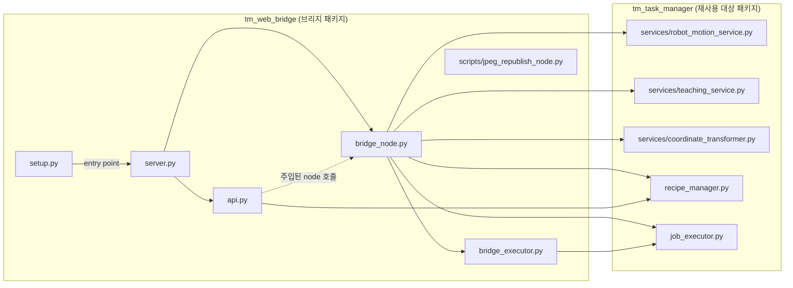
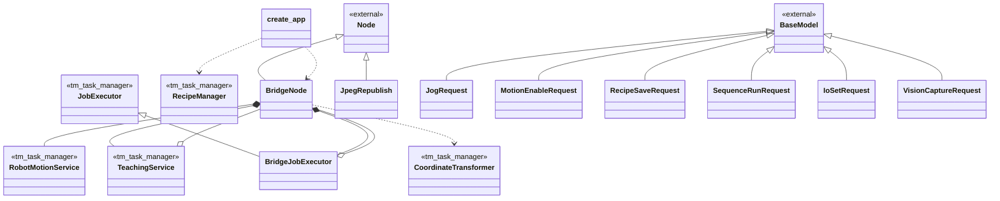
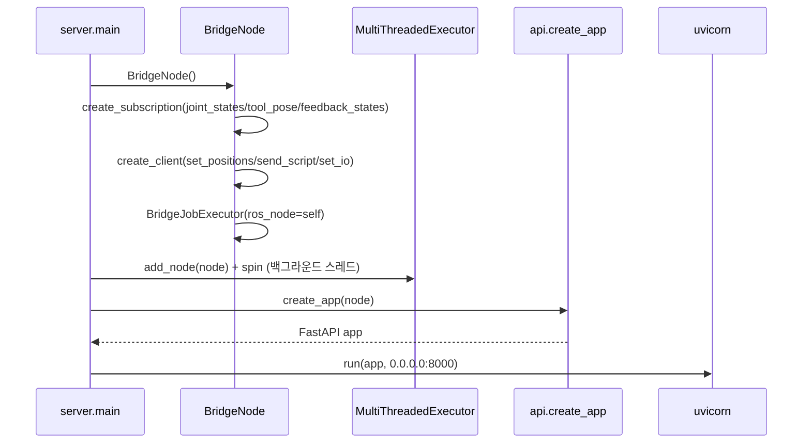
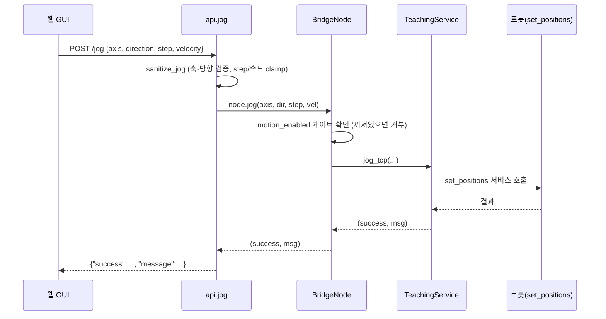
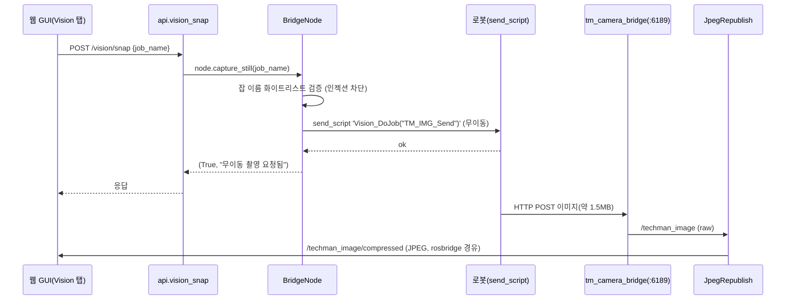

## 2026-07-13 11:15 (KST) — tm_web_bridge (웹 GUI 브리지) 구조

### 분석 범위
- 대상: `src/tm_web_bridge/` 패키지 전체 (+ 동봉 스크립트 `scripts/jpeg_republish_node.py`)
- 산출물 분기: **둘 다** (파일 의존 그래프 + 클래스 관계도)
- 위치: `/home/amap/Project/T-Robotics/kkw/TM_Robot_ros2_ws/src/tm_web_bridge/`

```
src/tm_web_bridge/
├── package.xml, setup.py, setup.cfg     # ROS2 패키지 메타 (실행파일 등록)
├── launch/web_bridge.launch.py          # rosbridge + 브리지 동시 기동
├── scripts/jpeg_republish_node.py       # (독립) raw→JPEG 재발행 노드
└── tm_web_bridge/
    ├── server.py          # ★ 진입점 — ROS 스핀 스레드 + uvicorn(FastAPI)
    ├── bridge_node.py     # ★ 핵심 — rclpy 노드, 로봇 I/O·모션 게이트·비즈니스 메서드
    ├── api.py             # FastAPI 앱 팩토리 — HTTP 엔드포인트 14개, 입력검증
    └── bridge_executor.py # JobExecutor 서브클래스 (spin 충돌 회피 오버라이드)
```

### ① 파일 의존 그래프



- `jpeg_republish_node.py` 는 어느 파일도 import 하지 않고 import 되지도 않는 **독립 실행 노드**(고립 노드 — ⑤ 참조).
- `api.py` → `bridge_node.py` 는 **import 가 아니라 의존성 주입**이다: `create_app(node)` 가 노드를 인자로 받아 핸들러에서 호출한다(점선). 그래서 순환 import 가 없다.

### ② 클래스 관계도



- `TeachingService`·`BridgeJobExecutor` 는 생성 시 `ros_node=self`(BridgeNode)를 받아 **역참조**를 보유 → 집약(`o--`).
- `create_app` 은 클래스가 아닌 **팩토리 함수**지만, RecipeManager 를 생성하고 node 를 사용하므로 관계도에 포함.

### ③ 시퀀스 다이어그램

**시나리오 A — 기동 (`server.main`)**



**시나리오 B — 웹에서 조그 요청 (`POST /jog`)**



**시나리오 C — 웹 라이브 뷰 무이동 촬영 (`POST /vision/snap`)**



### ④ 연결 관계표

| # | source | → | target | 관계 종류 | 위치 |
|---|--------|---|--------|----------|------|
| 1 | setup.py | → | server.py | call | setup.py:24 (`tm_web_bridge = tm_web_bridge.server:main`) |
| 2 | server.py | → | bridge_node.py | import | server.py:15 |
| 3 | server.py | → | api.py | import | server.py:16 |
| 4 | bridge_node.py | → | bridge_executor.py | import | bridge_node.py:31 |
| 5 | bridge_node.py | → | services/robot_motion_service.py | import | bridge_node.py:26 |
| 6 | bridge_node.py | → | services/teaching_service.py | import | bridge_node.py:27 |
| 7 | bridge_node.py | → | services/coordinate_transformer.py | import | bridge_node.py:28 |
| 8 | bridge_node.py | → | recipe_manager.py | import | bridge_node.py:29 |
| 9 | bridge_node.py | → | job_executor.py | import | bridge_node.py:30 |
| 10 | bridge_executor.py | → | job_executor.py | import | bridge_executor.py:15 |
| 11 | api.py | → | recipe_manager.py | import | api.py:19 |
| 12 | api.py | → | BridgeNode | call | api.py:101,150,160,167,172,177,183,192,199 |
| 13 | BridgeNode | → | Node (rclpy) | inherit | bridge_node.py:45 |
| 14 | BridgeJobExecutor | → | JobExecutor | inherit | bridge_executor.py:18 |
| 15 | JpegRepublish | → | Node (rclpy) | inherit | scripts/jpeg_republish_node.py:28 |
| 16 | JogRequest | → | BaseModel | inherit | api.py:32 |
| 17 | MotionEnableRequest | → | BaseModel | inherit | api.py:39 |
| 18 | RecipeSaveRequest | → | BaseModel | inherit | api.py:43 |
| 19 | SequenceRunRequest | → | BaseModel | inherit | api.py:49 |
| 20 | IoSetRequest | → | BaseModel | inherit | api.py:53 |
| 21 | VisionCaptureRequest | → | BaseModel | inherit | api.py:59 |
| 22 | BridgeNode | → | RobotMotionService | compose | bridge_node.py:52 |
| 23 | BridgeNode | → | TeachingService | compose | bridge_node.py:53 |
| 24 | BridgeNode | → | BridgeJobExecutor | compose | bridge_node.py:72 |
| 25 | BridgeNode | → | CoordinateTransformer | depend | bridge_node.py:116 |
| 26 | TeachingService | → | BridgeNode | aggregate | bridge_node.py:53 (`ros_node=self`) |
| 27 | BridgeJobExecutor | → | BridgeNode | aggregate | bridge_node.py:72 (`ros_node=self`) |
| 28 | create_app | → | RecipeManager | compose | api.py:109 |
| 29 | create_app | → | BridgeNode | depend | api.py:88 (주입 인자) |

### ⑤ 구조 관찰 (사실만)

- **순환 의존:** 순환 없음. `api.py` 가 `bridge_node.py` 를 import 하지 않고 **노드를 인자로 주입**받기 때문(`create_app(node)`, api.py:88).
- **고립 노드:** `scripts/jpeg_republish_node.py` — 패키지 내 어떤 파일도 import 하지 않고, import 되지도 않음. 독립 실행 노드(자체 `main`).
- **진입점:**
  1. `server.py:main` — `setup.py:24` 의 console_scripts 로 등록된 실행파일 `tm_web_bridge`
  2. `scripts/jpeg_republish_node.py:main` — 독립 python 실행
  3. `launch/web_bridge.launch.py` — rosbridge_server + tm_web_bridge 동시 기동
- **fan-in / fan-out 상위:**
  - `bridge_node.py` — fan-out 6 (bexec + tm_task_manager 5개), fan-in 2 (server, api)
  - `job_executor.py` — fan-in 2 (bridge_node, bridge_executor)
  - `recipe_manager.py` — fan-in 2 (bridge_node, api)

### 외부 인터페이스 (연결 경계)

| 방향 | 대상 | 위치 |
|------|------|------|
| HTTP 수신 | `0.0.0.0:8000` (FastAPI, 엔드포인트 14개) | server.py:31 |
| ROS 구독 | `joint_states`, `tool_pose`, `/feedback_states` | bridge_node.py:56-58 |
| ROS 서비스 호출 | `set_positions`, `send_script`, `set_io` | bridge_node.py:61-63 |

**엔드포인트 14개**: `GET /robot/status`, `GET /tasks/schema`, `GET /recipes`, `GET /recipes/{filename}`, `POST /recipes`, `GET|POST /motion/enable`, `POST /jog`, `POST /sequence/run`, `POST /sequence/stop`, `GET /sequence/status`, `POST /vision/capture`, `POST /vision/snap`, `POST /io/set`

---
